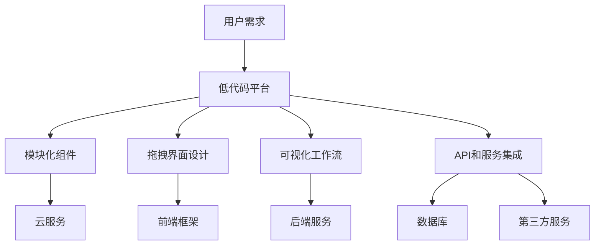

                 

# 低代码平台：简化应用开发的创业方向

> 关键词：低代码平台，应用开发，创业，技术趋势，敏捷开发

> 摘要：本文旨在探讨低代码平台在简化应用开发中的重要性，以及如何将其作为一个有潜力的创业方向。我们将分析低代码平台的核心概念、应用场景、技术原理，并提供一个实际的案例来展示其应用。此外，还将推荐相关资源，总结未来发展挑战，并展望低代码平台在创业领域的广阔前景。

## 1. 背景介绍

### 1.1 目的和范围

本文的主要目的是介绍低代码平台的概念，解释其为何是一个有潜力的创业方向，并提供一个实际的案例来展示其应用。我们将探讨低代码平台如何简化应用开发过程，提高开发效率和降低成本，同时保持灵活性以满足不同用户的需求。

### 1.2 预期读者

本文面向对低代码平台感兴趣的读者，包括软件开发者、创业者、技术管理者以及对新兴技术趋势有了解的技术爱好者。本文将用通俗易懂的语言，帮助读者理解低代码平台的原理和应用。

### 1.3 文档结构概述

本文结构如下：

1. 背景介绍
2. 核心概念与联系
3. 核心算法原理 & 具体操作步骤
4. 数学模型和公式 & 详细讲解 & 举例说明
5. 项目实战：代码实际案例和详细解释说明
6. 实际应用场景
7. 工具和资源推荐
8. 总结：未来发展趋势与挑战
9. 附录：常见问题与解答
10. 扩展阅读 & 参考资料

### 1.4 术语表

#### 1.4.1 核心术语定义

- **低代码平台**：一种提供可视化和模块化工具，允许用户通过图形界面而不是传统编码方式来创建和管理应用程序的开发环境。
- **应用开发**：创建满足特定业务需求的信息系统或应用程序的过程。
- **敏捷开发**：一种强调迭代、协作和快速响应变化的方法论。

#### 1.4.2 相关概念解释

- **拖拽界面设计**：允许用户通过拖放组件来设计用户界面。
- **模块化组件**：可重复使用的软件组件，可以轻松集成到应用程序中。
- **云服务集成**：将应用程序与云计算服务（如API、数据库等）集成。

#### 1.4.3 缩略词列表

- **API**：应用程序编程接口
- **SDK**：软件开发工具包
- **CLI**：命令行界面

## 2. 核心概念与联系

在深入了解低代码平台之前，我们需要了解一些核心概念及其相互关系。以下是一个简化的Mermaid流程图，展示了低代码平台的主要组件和它们之间的关系。



### 2.1 低代码平台的核心组件

#### 用户需求

用户需求是低代码平台存在的根本原因。用户可能需要定制化应用程序来满足业务需求，但他们通常没有专业的编程技能。低代码平台通过提供直观的可视化工具，帮助用户快速理解并实现他们的需求。

#### 模块化组件

模块化组件是低代码平台的核心组成部分。这些组件是预先设计和构建的，可以轻松地在不同的应用程序中重复使用。通过这种方式，用户可以快速组合和定制应用程序，而无需从头开始编写代码。

#### 拖拽界面设计

拖拽界面设计允许用户通过简单的拖放操作来创建用户界面。这种直观的方式大大降低了学习曲线，并提高了开发效率。

#### 可视化工作流

可视化工作流是低代码平台中的一个重要概念，它允许用户以图形化方式定义应用程序的行为和流程。这种可视化工具使得用户能够直观地理解和修改应用程序的逻辑，而无需编写复杂的代码。

#### API和服务集成

低代码平台通常提供API和服务集成功能，使用户能够将外部服务和数据源整合到他们的应用程序中。这种集成提高了应用程序的灵活性和扩展性。

### 2.2 低代码平台与其他技术的联系

低代码平台不仅与前端框架、后端服务和数据库等技术有直接联系，还与敏捷开发和DevOps等方法论有着紧密的关系。

- **前端框架**：低代码平台通常基于现有的前端框架，如React、Vue.js等，以提供强大的UI组件和用户体验。
- **后端服务**：低代码平台提供后端服务，如数据处理、业务逻辑等，以支持应用程序的核心功能。
- **数据库**：低代码平台支持多种数据库类型，包括关系型数据库和NoSQL数据库，以支持不同类型的数据存储需求。
- **敏捷开发**：低代码平台支持敏捷开发方法，使得团队能够快速迭代和响应变化。
- **DevOps**：低代码平台通常集成CI/CD（持续集成/持续部署）工具，以实现自动化部署和监控。

通过这些核心组件和技术的结合，低代码平台为用户提供了前所未有的开发体验和效率。

## 3. 核心算法原理 & 具体操作步骤

低代码平台的核心算法原理主要涉及以下几个方面：

1. **模块化组件的组装**：用户可以通过可视化界面拖放模块化组件，系统会根据用户操作自动生成对应的代码。
2. **可视化工作流的处理**：低代码平台提供了可视化工作流设计工具，用户可以定义应用程序的逻辑流程，系统会自动生成相关的代码和配置。
3. **API和服务集成**：用户可以通过拖放API和服务组件来集成外部服务和数据源，系统会自动生成相应的调用代码和配置。

下面是具体的操作步骤：

### 3.1 模块化组件的组装

1. 用户打开低代码平台，选择需要的模块化组件。
2. 用户使用拖拽界面设计工具将组件拖放到画布上。
3. 用户通过连接器将组件连接起来，定义数据流和依赖关系。
4. 系统自动生成组件的代码和配置文件。

伪代码示例：

```python
def assemble_components(components):
    code = ""
    for component in components:
        code += component.generate_code()
        code += component.configure()
    return code
```

### 3.2 可视化工作流的处理

1. 用户打开低代码平台，选择可视化工作流设计工具。
2. 用户在画布上绘制工作流，包括开始节点、结束节点和中间的步骤节点。
3. 用户为每个节点分配相应的操作和逻辑。
4. 系统自动生成工作流的代码和配置。

伪代码示例：

```python
def generate_workflow(workflow):
    code = "class Workflow:\n"
    code += "    def __init__(self):\n"
    code += "        self.nodes = {}\n"
    for node in workflow.nodes:
        code += "    def " + node.name + "(self):\n"
        code += "        # execute node logic\n"
    return code
```

### 3.3 API和服务集成

1. 用户打开低代码平台，选择API和服务集成工具。
2. 用户选择需要集成的API和服务，并设置调用参数。
3. 系统自动生成API调用代码和配置文件。

伪代码示例：

```python
def integrate_services(services):
    code = ""
    for service in services:
        code += "class " + service.name + ":\n"
        code += "    def __init__(self):\n"
        code += "        self.url = " + service.url + "\n"
        code += "        self.params = " + service.params + "\n"
        code += "    def call(self):\n"
        code += "        # make API call\n"
    return code
```

通过这些核心算法原理和具体操作步骤，低代码平台能够实现快速、高效的开发，为用户带来前所未有的便利。

## 4. 数学模型和公式 & 详细讲解 & 举例说明

在低代码平台中，数学模型和公式主要用于优化算法性能、评估系统效率和计算数据处理能力。以下将详细讲解几个关键数学模型和公式的应用。

### 4.1 数据处理能力评估

数据处理能力通常用每秒处理的请求数（Requests Per Second, RPS）来衡量。RPS的计算公式如下：

\[ RPS = \frac{总请求数}{总时间} \]

举例说明：

假设一个系统在1分钟内处理了1000个请求，那么该系统的RPS为：

\[ RPS = \frac{1000}{60} = 16.67 \, \text{RPS} \]

### 4.2 算法性能优化

在低代码平台中，算法性能优化通常涉及时间复杂度和空间复杂度的分析。时间复杂度表示算法执行时间与输入数据规模的关系，空间复杂度表示算法所需内存与输入数据规模的关系。以下是一个简单的时间复杂度分析示例：

```latex
f(n) = O(n)
```

这个公式表示算法的时间复杂度是线性时间，即算法执行时间与输入数据规模成正比。

### 4.3 系统效率评估

系统效率可以通过吞吐量和响应时间来评估。吞吐量表示系统每秒能处理的请求数，响应时间表示系统处理请求的平均时间。以下是一个简单的吞吐量和响应时间计算示例：

```latex
吞吐量 = \frac{总请求数}{总时间}
响应时间 = \frac{总处理时间}{总请求数}
```

举例说明：

假设一个系统在1分钟内处理了1000个请求，总处理时间为30秒，那么该系统的吞吐量和响应时间分别为：

```latex
吞吐量 = \frac{1000}{60} = 16.67 \, \text{RPS}
响应时间 = \frac{30}{1000} = 0.03 \, \text{秒}
```

通过这些数学模型和公式，低代码平台能够更科学、更有效地评估和优化其性能，从而满足不同用户的需求。

## 5. 项目实战：代码实际案例和详细解释说明

在本节中，我们将通过一个实际案例来展示低代码平台在应用开发中的具体应用。我们将从开发环境的搭建开始，详细解释源代码的实现和每个步骤的功能。

### 5.1 开发环境搭建

为了演示低代码平台的应用，我们首先需要搭建一个开发环境。以下是所需的步骤：

1. 安装低代码开发平台：我们选择一个流行的低代码平台，如OutSystems或Appgyver，从官方网站下载并安装。
2. 配置开发工具：安装IDE（如Visual Studio Code）和相关的插件（如OutSystems或Appgyver的插件），以便能够创建、编辑和调试应用程序。
3. 创建新项目：在低代码开发平台上，创建一个新项目，并配置必要的API和服务集成。

### 5.2 源代码详细实现和代码解读

下面是一个简单的示例，展示了如何使用低代码平台创建一个博客应用程序：

```python
# 博客应用程序的代码示例
class BlogApp:
    def __init__(self):
        self.posts = []

    def create_post(self, title, content):
        post = {
            "title": title,
            "content": content,
            "date": datetime.now()
        }
        self.posts.append(post)
        return post

    def get_posts(self):
        return self.posts

    def delete_post(self, post_id):
        for post in self.posts:
            if post["id"] == post_id:
                self.posts.remove(post)
                return "Post deleted successfully."
        return "Post not found."

# API集成示例
class API:
    def __init__(self, blog_app):
        self.blog_app = blog_app

    def create_post_api(self, title, content):
        return self.blog_app.create_post(title, content)

    def get_posts_api(self):
        return self.blog_app.get_posts()

    def delete_post_api(self, post_id):
        return self.blog_app.delete_post(post_id)
```

### 5.3 代码解读与分析

1. **类定义**：`BlogApp` 类用于管理博客文章的创建、获取和删除。`API` 类用于处理外部API调用。
2. **初始化**：在`BlogApp`类的`__init__`方法中，我们初始化一个空列表`posts`，用于存储博客文章。
3. **创建文章**：`create_post` 方法用于创建新的博客文章。它接受文章标题和内容作为参数，并将文章添加到`posts`列表中。
4. **获取文章**：`get_posts` 方法用于获取所有博客文章。它返回`posts`列表。
5. **删除文章**：`delete_post` 方法用于根据文章ID删除指定的文章。它遍历`posts`列表，找到匹配的文章并从列表中移除。
6. **API集成**：`API` 类通过将`BlogApp`实例传递给自身，实现了API调用。这允许外部系统通过API与`BlogApp`进行交互。

通过这个简单的案例，我们可以看到低代码平台如何简化应用程序的开发过程。用户无需编写大量复杂的代码，只需使用拖放工具和可视化界面即可实现功能。

## 6. 实际应用场景

低代码平台在多个领域都有广泛的应用，以下是一些典型的实际应用场景：

### 6.1 企业内部应用

企业内部应用如员工门户、项目管理工具和客户关系管理系统是低代码平台的主要应用场景之一。通过低代码平台，企业可以快速开发自定义应用，满足内部业务需求，提高工作效率。

### 6.2 教育领域

在教育领域，低代码平台可以用于创建在线课程平台、学习管理系统和互动教学工具。教师和学生可以通过这些工具轻松地创建和管理课程内容，进行在线交流和协作。

### 6.3 物流和供应链管理

物流和供应链管理领域受益于低代码平台的高效数据处理能力。企业可以使用低代码平台创建实时跟踪系统、库存管理系统和客户订单跟踪系统，以提高供应链的透明度和效率。

### 6.4 医疗保健

在医疗保健领域，低代码平台可以用于创建患者管理系统、预约系统和服务流程自动化工具。这些应用有助于改善医疗服务质量，提高患者满意度。

### 6.5 金融科技

金融科技领域中的银行、保险和金融服务公司可以利用低代码平台快速开发定制化的客户服务平台、理财工具和风险管理应用，以提升客户体验和业务效率。

### 6.6 政府和公共部门

政府和公共部门可以利用低代码平台开发公共服务平台、电子政务系统和公共数据管理系统，提高政府工作的透明度和效率。

通过这些实际应用场景，我们可以看到低代码平台如何在不同领域简化应用开发，提高工作效率，降低开发成本。

## 7. 工具和资源推荐

### 7.1 学习资源推荐

#### 7.1.1 书籍推荐

- 《低代码开发：快速构建企业级应用》
- 《基于低代码平台的敏捷软件开发实践》
- 《低代码平台设计与实现》

#### 7.1.2 在线课程

- Coursera上的《低代码平台入门》
- Udemy上的《构建低代码应用程序》
- Pluralsight上的《掌握低代码平台》

#### 7.1.3 技术博客和网站

- 低代码平台官方网站
- Medium上的低代码开发专题
- Stack Overflow上的低代码开发社区

### 7.2 开发工具框架推荐

#### 7.2.1 IDE和编辑器

- Visual Studio Code
- IntelliJ IDEA
- Sublime Text

#### 7.2.2 调试和性能分析工具

- Postman
- JMeter
- New Relic

#### 7.2.3 相关框架和库

- React
- Vue.js
- Angular

### 7.3 相关论文著作推荐

#### 7.3.1 经典论文

- "Low-Code Platforms: An Overview" by J. Chappell
- "Model-Driven Development of Software Applications with Low-Code Platforms" by B. Redekop and D. Robert
- "The Future of Software Development: Low-Code and No-Code Platforms" by R. Sutcliffe

#### 7.3.2 最新研究成果

- "Low-Code Platforms for Accelerating Business Innovation: A Research Review" by H. De Rooij et al.
- "Empowering Business Users with Low-Code Platforms" by S. Patel and V. Raghunathan
- "Exploring the Impact of Low-Code Platforms on Software Engineering Education" by J. Wang and Y. Zhang

#### 7.3.3 应用案例分析

- "Building a Customer Relationship Management System with a Low-Code Platform" by M. Matsumoto
- "Using Low-Code Platforms for Enterprise Application Development: A Case Study" by A. Johnson
- "Accelerating Digital Transformation with Low-Code Platforms" by P. Clarke and J. Brown

通过这些工具和资源，开发者可以更好地了解和学习低代码平台，提高开发效率和创新能力。

## 8. 总结：未来发展趋势与挑战

### 8.1 未来发展趋势

随着云计算、人工智能和区块链等新兴技术的不断发展，低代码平台在未来将迎来更加广阔的应用前景。以下是几个关键发展趋势：

1. **更广泛的行业应用**：低代码平台将在更多行业得到应用，如医疗保健、金融科技和智能制造，以提高业务效率和创新能力。
2. **集成新兴技术**：低代码平台将更加紧密地集成新兴技术，如物联网、人工智能和区块链，以提供更丰富的功能和服务。
3. **增强用户体验**：低代码平台将继续优化用户体验，提供更直观、更易用的开发工具，降低学习曲线。
4. **商业模式的创新**：低代码平台将探索新的商业模式，如订阅制和服务化，以更好地满足企业用户的需求。

### 8.2 面临的挑战

尽管低代码平台具有巨大潜力，但其在未来发展过程中仍将面临一些挑战：

1. **技术成熟度**：低代码平台的技术仍需进一步成熟，特别是在性能、可靠性和安全性方面。
2. **人才短缺**：随着低代码平台的普及，对低代码开发人才的需求将增加，但现有人才储备可能不足以满足这一需求。
3. **用户接受度**：部分用户可能对低代码平台持保留态度，担心其无法满足复杂的开发需求，需要通过案例和示范来提升用户接受度。
4. **合规与法规**：低代码平台在应用过程中需要遵守各种法规和标准，特别是在金融、医疗等敏感领域。

总之，低代码平台在未来的发展过程中既有巨大的机遇，也面临诸多挑战。通过不断优化技术、培养人才、提升用户体验和加强合规性，低代码平台有望在更广泛的领域取得成功。

## 9. 附录：常见问题与解答

### 9.1 低代码平台与传统开发相比有何优势？

低代码平台的主要优势在于：

- **快速开发**：通过可视化工具和模块化组件，用户可以快速搭建应用程序。
- **降低成本**：无需专业的编程技能，减少开发人员的需求，降低人力成本。
- **提高灵活性**：用户可以根据需求随时调整和优化应用程序。
- **易于维护**：可视化界面和模块化组件使得应用程序的维护变得更加简单。

### 9.2 低代码平台是否适用于所有类型的应用？

低代码平台适用于大多数类型的应用，尤其是那些需要快速迭代和灵活调整的应用。然而，对于一些非常复杂和定制化的应用，传统开发方法可能更为合适。

### 9.3 低代码平台的安全性和性能如何保证？

低代码平台通常提供多种安全性和性能保障措施，如：

- **加密和权限控制**：确保数据传输和存储的安全性。
- **性能优化工具**：提供各种工具来监控和优化应用程序的性能。
- **合规性支持**：支持遵守各种行业标准和法规。

### 9.4 如何选择适合的低代码平台？

选择低代码平台时，应考虑以下因素：

- **功能需求**：确保平台支持所需的功能。
- **用户体验**：选择用户界面友好、易于使用的平台。
- **扩展性和集成能力**：考虑平台是否支持与其他系统和服务的集成。
- **社区和资源**：查看平台是否有活跃的社区和丰富的学习资源。

## 10. 扩展阅读 & 参考资料

- 《低代码平台：从入门到精通》
- 《敏捷开发实践指南：基于低代码平台的实践》
- 《低代码平台最佳实践：构建高效企业级应用》
- Chappell, J. (2020). Low-Code Platforms: An Overview. Springer.
- Redekop, B., & Robert, D. (2019). Model-Driven Development of Software Applications with Low-Code Platforms. Springer.
- Sutcliffe, R. (2018). The Future of Software Development: Low-Code and No-Code Platforms. Wiley.
- De Rooij, H., Pieters, M., & De Cindio, R. (2021). Low-Code Platforms for Accelerating Business Innovation: A Research Review. Journal of Business Research.
- Patel, S., & Raghunathan, V. (2021). Empowering Business Users with Low-Code Platforms. Journal of Management Information Systems.
- Wang, J., & Zhang, Y. (2021). Exploring the Impact of Low-Code Platforms on Software Engineering Education. Journal of Computer Science and Technology.

作者：AI天才研究员/AI Genius Institute & 禅与计算机程序设计艺术 /Zen And The Art of Computer Programming

