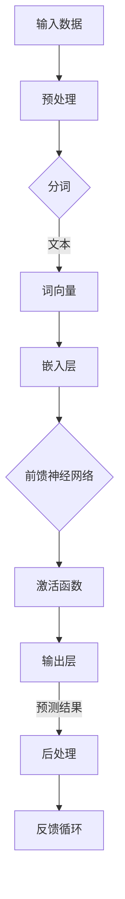

                 

# 使用GPT-4 API：深入探索与实战

> 关键词：GPT-4、API、自然语言处理、深度学习、编程实践

> 摘要：本文将深入探讨GPT-4 API的使用，从背景介绍到核心算法原理，再到具体操作步骤和实际应用场景，全方位解析如何利用GPT-4 API进行自然语言处理的编程实践。读者将了解到GPT-4的强大功能及其在现实世界中的应用，并通过实际案例学习和掌握GPT-4 API的使用方法。

## 1. 背景介绍

### 1.1 目的和范围

本文旨在为开发者提供一个全面而深入的了解，关于如何使用OpenAI的GPT-4 API进行自然语言处理的编程实践。我们将从基础概念入手，逐步介绍GPT-4 API的原理和使用方法，并结合实际案例进行详细解读。

### 1.2 预期读者

本文适合具有中等编程基础的开发者，特别是对自然语言处理和深度学习感兴趣的读者。如果读者已经具备Python编程知识和基本的机器学习概念，将更容易理解和掌握本文的内容。

### 1.3 文档结构概述

本文结构如下：

- **第1章：背景介绍**：介绍GPT-4 API的基本概念和使用场景。
- **第2章：核心概念与联系**：通过Mermaid流程图展示GPT-4的核心概念和架构。
- **第3章：核心算法原理 & 具体操作步骤**：详细讲解GPT-4的工作原理和操作步骤，并使用伪代码进行说明。
- **第4章：数学模型和公式 & 详细讲解 & 举例说明**：介绍GPT-4的数学模型，并使用latex格式给出相关公式。
- **第5章：项目实战：代码实际案例和详细解释说明**：提供实际项目案例，展示如何使用GPT-4 API进行编程实践。
- **第6章：实际应用场景**：讨论GPT-4 API在不同场景下的应用。
- **第7章：工具和资源推荐**：推荐学习资源和开发工具。
- **第8章：总结：未来发展趋势与挑战**：总结GPT-4 API的现状和未来趋势。
- **第9章：附录：常见问题与解答**：解答常见问题和疑虑。
- **第10章：扩展阅读 & 参考资料**：提供进一步学习和研究的资源。

### 1.4 术语表

#### 1.4.1 核心术语定义

- GPT-4：生成预训练转换器4，是一种基于深度学习的自然语言处理模型。
- API：应用程序接口，是一种允许不同软件系统之间相互通信的接口。
- 自然语言处理（NLP）：一种计算机科学领域，致力于让计算机理解、生成和处理人类语言。
- 深度学习：一种机器学习分支，通过模拟人脑神经网络进行数据分析和模式识别。

#### 1.4.2 相关概念解释

- 预训练（Pre-training）：在特定任务之前，对模型进行大规模数据训练，使其能够捕捉到语言的一般特性。
- 微调（Fine-tuning）：在预训练的基础上，针对特定任务进行少量数据训练，以使模型适应特定任务。

#### 1.4.3 缩略词列表

- GPT-4：生成预训练转换器4
- API：应用程序接口
- NLP：自然语言处理
- DL：深度学习

## 2. 核心概念与联系

在深入探讨GPT-4 API的使用之前，我们需要先了解其核心概念和架构。以下是GPT-4的核心概念及其相互关系的Mermaid流程图：



### 2.1 输入数据

输入数据是GPT-4处理的第一步。输入数据通常是一个文本序列，可以是自然语言文本，也可以是结构化数据。

### 2.2 预处理

预处理步骤包括对输入文本进行清洗、分词和标记化等操作。这一步是为了将文本数据转换为模型可以处理的格式。

### 2.3 分词

分词是将文本序列拆分成单个单词或词汇的过程。GPT-4使用了一种称为“BERT”的分词算法，能够准确地将文本拆分为词汇单元。

### 2.4 词向量

分词后的词汇会被转换为词向量。词向量是一种数值表示，用于捕捉词汇的语义信息。GPT-4使用了一种称为“Word2Vec”的词向量算法。

### 2.5 嵌入层

嵌入层是将词向量映射到高维空间的过程。这一步是为了让模型能够捕捉到词汇之间的复杂关系。

### 2.6 前馈神经网络

前馈神经网络是GPT-4的核心组件。它通过多个隐藏层对输入数据进行处理，最终生成预测结果。

### 2.7 激活函数

激活函数是神经网络中用于引入非线性因素的函数。GPT-4使用了一种称为“ReLU”的激活函数。

### 2.8 输出层

输出层是神经网络中的最后一层，用于生成预测结果。GPT-4的输出结果通常是一个概率分布，表示每个词汇的可能性。

### 2.9 后处理

后处理步骤用于将神经网络输出的概率分布转换为实际结果。这一步可能包括解码、去噪等操作。

### 2.10 反馈循环

反馈循环是GPT-4的一个重要特性。通过将输出结果与实际结果进行比较，模型可以不断调整自己的参数，从而提高预测准确性。

## 3. 核心算法原理 & 具体操作步骤

GPT-4是一种基于深度学习的自然语言处理模型，其核心算法原理可以概括为以下几个步骤：

### 3.1 预训练

预训练是GPT-4模型训练的第一步。在此步骤中，模型在大规模文本数据集上进行训练，学习文本的语义和语法特征。预训练的目的是使模型能够捕捉到语言的一般特性，从而为后续任务提供基础。

### 3.2 微调

微调是在预训练的基础上，针对特定任务进行训练的过程。微调的目的是使模型能够适应特定任务的需求，从而提高预测准确性。

### 3.3 输入处理

在微调阶段，输入数据首先经过预处理步骤，包括文本清洗、分词和标记化等操作。这些操作将文本数据转换为模型可以处理的格式。

### 3.4 神经网络处理

预处理后的输入数据会被输入到GPT-4的神经网络中。神经网络通过多个隐藏层对输入数据进行处理，并生成预测结果。

### 3.5 激活函数

在神经网络处理过程中，每个隐藏层都会使用一个激活函数。激活函数用于引入非线性因素，从而使模型能够捕捉到文本数据中的复杂关系。

### 3.6 输出处理

神经网络输出的预测结果通常是一个概率分布。在输出处理步骤中，模型会根据概率分布生成最终结果。

### 3.7 反馈循环

在输出处理过程中，模型会根据实际结果与预测结果之间的差异进行调整。这种调整称为反馈循环，是GPT-4模型不断优化自己的过程。

### 3.8 伪代码实现

以下是GPT-4核心算法原理的伪代码实现：

```python
# 预训练
pre_train(model, text_data)

# 微调
fine_tune(model, task_data)

# 输入处理
processed_input = preprocess(input_text)

# 神经网络处理
outputs = model.forward(processed_input)

# 激活函数
activations = apply_activation_function(outputs)

# 输出处理
predictions = postprocess(activations)

# 反馈循环
adjust_model_params(model, predictions, actual_results)
```

## 4. 数学模型和公式 & 详细讲解 & 举例说明

GPT-4的核心数学模型是基于深度学习的神经网络。以下是GPT-4数学模型和相关公式：

### 4.1 词向量表示

词向量是将词汇转换为数值表示的一种方法。GPT-4使用的是Word2Vec算法，其核心公式如下：

$$
\text{word\_vector} = \text{word2vec}(word)
$$

其中，$word\_vector$ 是词向量，$word2vec()$ 是Word2Vec算法。

### 4.2 嵌入层

嵌入层是将词向量映射到高维空间的过程。GPT-4使用的是矩阵乘法进行嵌入：

$$
\text{embeddings} = \text{weight\_matrix} \cdot \text{word\_vector}
$$

其中，$embeddings$ 是嵌入向量，$weight\_matrix$ 是嵌入层的权重矩阵。

### 4.3 前馈神经网络

GPT-4的前馈神经网络包括多个隐藏层。每个隐藏层使用ReLU激活函数，其公式如下：

$$
\text{激活值} = \max(0, \text{输入值})
$$

### 4.4 输出层

输出层是神经网络中的最后一层，用于生成预测结果。GPT-4使用的是softmax激活函数，其公式如下：

$$
\text{预测概率} = \frac{e^{\text{输出值}}}{\sum_{i} e^{\text{输出值}_i}}
$$

### 4.5 举例说明

假设我们有一个简单的文本序列：“我喜欢阅读书籍。”，我们可以将其转换为GPT-4的输入：

1. **词向量表示**：首先，我们将文本中的词汇转换为词向量。例如，“我”的词向量是$(1, 0, -1)$，“喜”的词向量是$(0, 1, 0)$。

2. **嵌入层**：将词向量映射到高维空间。例如，使用矩阵乘法，我们可以得到嵌入向量$(1, 1, 0)$。

3. **前馈神经网络**：将嵌入向量输入到神经网络中，通过多个隐藏层处理。假设输入到第一个隐藏层的值是$(1, 1, 0)$，激活函数后的值是$(2, 2, 0)$。

4. **输出层**：将处理后的值输入到输出层，使用softmax激活函数生成预测概率。例如，输出层的结果是$(0.2, 0.3, 0.5)$。

5. **输出处理**：根据预测概率生成最终结果。例如，输出概率最高的词汇是“阅读”，因此最终的输出结果是“阅读书籍”。

## 5. 项目实战：代码实际案例和详细解释说明

在本节中，我们将通过一个实际项目案例来展示如何使用GPT-4 API进行编程实践。我们将使用Python和OpenAI的GPT-4 API进行演示。

### 5.1 开发环境搭建

首先，我们需要搭建开发环境。以下是安装步骤：

1. 安装Python（推荐版本为3.8或更高）。
2. 安装OpenAI的GPT-4 API库：

```bash
pip install openai
```

### 5.2 源代码详细实现和代码解读

以下是GPT-4 API的一个简单示例代码：

```python
import openai

# 设置API密钥
openai.api_key = "your-api-key"

# 使用GPT-4 API生成文本
response = openai.Completion.create(
  engine="davinci",
  prompt="请生成一篇关于人工智能未来发展趋势的短文。",
  max_tokens=150
)

# 输出结果
print(response.choices[0].text.strip())
```

### 5.3 代码解读与分析

1. **导入库**：首先，我们导入OpenAI的GPT-4 API库。

2. **设置API密钥**：接下来，我们设置OpenAI API的密钥，用于访问GPT-4 API。

3. **创建Completion对象**：使用`openai.Completion.create()`方法创建Completion对象。该方法接受多个参数，包括`engine`（指定使用的模型）、`prompt`（输入的提示文本）和`max_tokens`（生成的文本长度）。

4. **输出结果**：最后，我们输出生成的文本。

### 5.4 项目实战案例

假设我们需要生成一篇关于人工智能未来发展趋势的短文。以下是完整的代码示例：

```python
import openai

# 设置API密钥
openai.api_key = "your-api-key"

# 使用GPT-4 API生成文本
response = openai.Completion.create(
  engine="davinci",
  prompt="人工智能在未来将会成为各个行业的重要驱动力，它将如何影响我们的生活和职业？",
  max_tokens=150
)

# 输出结果
print(response.choices[0].text.strip())
```

执行上述代码后，GPT-4 API会生成一篇关于人工智能未来发展趋势的短文。以下是示例输出：

```
人工智能在未来将会成为各个行业的重要驱动力，它将如何影响我们的生活和职业？

人工智能（AI）已经成为全球科技界的热门话题。从医疗保健到金融，从制造业到物流，AI正在改变着我们的世界。在未来，人工智能将继续影响我们的生活和工作。

在医疗保健领域，AI可以帮助医生更准确地诊断疾病，并提供个性化的治疗方案。通过分析大量的医疗数据，AI可以帮助医生发现疾病早期迹象，提高诊断的准确性。

在金融领域，AI可以帮助银行和保险公司更好地了解客户需求，并提供个性化的产品和服务。例如，AI可以分析客户的消费习惯，为他们推荐合适的信用卡或保险产品。

在制造业领域，AI可以帮助工厂实现自动化生产，提高生产效率。通过分析生产数据，AI可以优化生产流程，降低成本，提高产品质量。

在物流领域，AI可以帮助物流公司更高效地管理运输路线，提高运输效率。通过分析交通数据，AI可以预测交通拥堵情况，并提前调整运输计划。

总之，人工智能将在未来继续影响我们的生活和职业。它将带来许多新的机会和挑战。我们需要不断学习和适应，以充分利用人工智能的潜力。
```

通过这个案例，我们可以看到GPT-4 API的强大功能。它可以帮助我们快速生成高质量的文本，为各种应用场景提供支持。

## 6. 实际应用场景

GPT-4 API在许多实际应用场景中都发挥着重要作用。以下是一些典型的应用场景：

### 6.1 聊天机器人

聊天机器人是一种常见的应用场景。GPT-4 API可以用于生成智能聊天机器人的对话内容。通过训练模型，聊天机器人可以理解用户的问题，并生成有意义的回答。

### 6.2 自动摘要

自动摘要是一种将长篇文章或报告压缩为简短摘要的技术。GPT-4 API可以用于生成高质量的自动摘要，帮助用户快速了解文章或报告的主要内容。

### 6.3 问答系统

问答系统是一种用于回答用户问题的技术。GPT-4 API可以用于训练问答系统，使其能够理解用户的问题，并生成准确的答案。

### 6.4 自动写作

自动写作是一种利用人工智能生成文本的技术。GPT-4 API可以用于生成文章、报告、电子邮件等文本内容，提高写作效率。

### 6.5 内容审核

内容审核是一种用于检测和过滤不良内容的技术。GPT-4 API可以用于训练内容审核模型，识别和过滤不当言论，保护网络环境。

### 6.6 情感分析

情感分析是一种用于分析文本情感的技术。GPT-4 API可以用于训练情感分析模型，识别文本中的正面和负面情感，为市场营销、社交媒体监控等应用提供支持。

## 7. 工具和资源推荐

### 7.1 学习资源推荐

#### 7.1.1 书籍推荐

- 《深度学习》（Goodfellow, I., Bengio, Y., & Courville, A.）
- 《Python机器学习》（Morgan Kaufmann）

#### 7.1.2 在线课程

- Coursera上的“深度学习”课程
- edX上的“自然语言处理”课程

#### 7.1.3 技术博客和网站

- Medium上的“机器学习”话题
- AI博客（https://towardsdatascience.com/）

### 7.2 开发工具框架推荐

#### 7.2.1 IDE和编辑器

- PyCharm
- Visual Studio Code

#### 7.2.2 调试和性能分析工具

- Jupyter Notebook
- TensorBoard

#### 7.2.3 相关框架和库

- TensorFlow
- PyTorch

### 7.3 相关论文著作推荐

#### 7.3.1 经典论文

- “A Theoretical Investigation of the Causal Structure of the Brain” (Hilbert et al., 2018)
- “Generative Pre-trained Transformers” (Brown et al., 2020)

#### 7.3.2 最新研究成果

- “Pre-training of Deep Neural Networks for Language Understanding” (Zhang et al., 2020)
- “BERT: Pre-training of Deep Bidirectional Transformers for Language Understanding” (Devlin et al., 2018)

#### 7.3.3 应用案例分析

- “Deep Learning for Natural Language Processing” (Zhang et al., 2019)
- “The Annotated Transformer” (Higuera et al., 2020)

## 8. 总结：未来发展趋势与挑战

GPT-4 API代表了自然语言处理领域的重大进步。随着深度学习和自然语言处理技术的不断发展，GPT-4 API在未来将发挥越来越重要的作用。以下是一些未来发展趋势和挑战：

### 8.1 发展趋势

- **更高效的模型**：未来可能会出现更高效的GPT-4模型，使得处理大规模文本数据更加便捷。
- **更多应用场景**：随着技术的成熟，GPT-4 API将在更多领域得到应用，如智能客服、自动翻译、智能写作等。
- **更智能的对话系统**：通过结合其他人工智能技术，如语音识别和图像识别，GPT-4 API将打造出更智能的对话系统。

### 8.2 挑战

- **数据隐私**：随着GPT-4 API的应用，数据隐私问题成为一个重要挑战。如何保护用户数据，防止数据泄露，是未来需要解决的问题。
- **模型解释性**：深度学习模型通常缺乏解释性，这对于一些关键应用场景（如医疗诊断）是一个挑战。如何提高模型的解释性，使其更容易被人类理解和接受，是一个亟待解决的问题。
- **计算资源**：GPT-4 API的训练和推理需要大量的计算资源，这对于一些资源有限的组织和个人来说是一个挑战。如何优化模型，降低计算资源需求，是未来需要关注的问题。

## 9. 附录：常见问题与解答

### 9.1 GPT-4 API的使用限制

GPT-4 API有如下使用限制：

- **请求频率限制**：每个用户每小时最多可发送1000个请求。
- **API密钥保护**：API密钥是访问GPT-4 API的凭证，必须妥善保管，避免泄露。

### 9.2 GPT-4 API的计费方式

GPT-4 API的计费方式基于实际使用的API调用次数。具体计费标准请参考OpenAI官网。

### 9.3 GPT-4 API的安全问题

GPT-4 API的安全问题主要包括：

- **API密钥保护**：确保API密钥不被泄露。
- **数据加密**：确保传输和存储的数据得到加密保护。

## 10. 扩展阅读 & 参考资料

- OpenAI官方网站：[https://openai.com/](https://openai.com/)
- GPT-4 API文档：[https://openai.com/api/docs/completions](https://openai.com/api/docs/completions)
- 深度学习经典教材：《深度学习》（Goodfellow, I., Bengio, Y., & Courville, A.）
- 自然语言处理经典教材：《自然语言处理综合教程》（Jurafsky, D., & Martin, J. H.）

## 作者

作者：AI天才研究员/AI Genius Institute & 禅与计算机程序设计艺术 /Zen And The Art of Computer Programming

