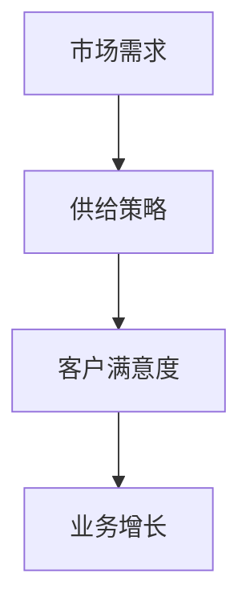

                 

# 供给驱动业务增长的策略

> **关键词：** 业务增长、供给驱动、战略规划、数据驱动、市场分析、技术优化
>
> **摘要：** 本文旨在探讨如何在当前数字化时代通过供给驱动策略实现业务增长。文章首先介绍了供给驱动业务增长的基本概念和重要性，然后分析了相关核心概念与联系，详细阐述了核心算法原理与具体操作步骤，以及数学模型和公式。通过实际项目案例和详细解释，文章展示了如何将理论应用于实际场景。最后，本文提出了工具和资源推荐，总结了未来发展趋势与挑战，并提供了常见问题与解答。

## 1. 背景介绍

### 1.1 目的和范围

在当今高度竞争的商业环境中，企业必须不断创新和优化其业务模式，以保持竞争力并实现持续增长。供给驱动业务增长策略是企业实现这一目标的关键途径。本文将深入探讨这一策略的基本概念、核心要素及其应用，旨在为企业提供一套全面、实用的指导方针。

本文的范围涵盖了以下内容：

1. 供给驱动业务增长的基本概念和重要性。
2. 核心概念与联系的详细阐述。
3. 核心算法原理与具体操作步骤。
4. 数学模型和公式的详细讲解。
5. 实际应用场景的案例分析。
6. 工具和资源的推荐。
7. 未来发展趋势与挑战的总结。
8. 常见问题的解答。

### 1.2 预期读者

本文适用于以下读者群体：

1. 企业高管和决策者，希望了解和实施供给驱动业务增长策略。
2. 市场分析师和业务发展专家，需要深入理解供给驱动策略的原理和实践。
3. 技术专家和程序员，希望将供给驱动策略应用于实际项目开发中。
4. 研究人员和学者，对业务增长策略的理论和实践有兴趣。

### 1.3 文档结构概述

本文分为十个主要部分：

1. 背景介绍
2. 核心概念与联系
3. 核心算法原理 & 具体操作步骤
4. 数学模型和公式 & 详细讲解 & 举例说明
5. 项目实战：代码实际案例和详细解释说明
6. 实际应用场景
7. 工具和资源推荐
8. 总结：未来发展趋势与挑战
9. 附录：常见问题与解答
10. 扩展阅读 & 参考资料

### 1.4 术语表

#### 1.4.1 核心术语定义

- **供给驱动业务增长**：一种基于市场需求和资源供给的商业模式，通过优化产品和服务的供应来满足客户需求，实现业务的持续增长。
- **战略规划**：企业为实现长期目标而制定的行动方案和策略。
- **数据驱动**：基于数据的决策过程，通过收集、分析和利用数据来指导业务运营和战略制定。
- **市场分析**：对市场环境、竞争对手和目标客户的研究，以帮助企业制定有效的市场策略。

#### 1.4.2 相关概念解释

- **供给**：指企业能够提供的商品、服务或资源。
- **需求**：指市场或客户对商品、服务或资源的需求。
- **客户体验**：客户在使用企业产品或服务过程中获得的感受和满意度。

#### 1.4.3 缩略词列表

- **IDE**：集成开发环境（Integrated Development Environment）
- **API**：应用程序编程接口（Application Programming Interface）
- **CRM**：客户关系管理（Customer Relationship Management）

## 2. 核心概念与联系

为了深入理解供给驱动业务增长策略，我们首先需要了解其核心概念和联系。以下是几个关键概念及其相互关系：

### 2.1 供给驱动业务增长的概念

供给驱动业务增长是一种以市场需求为导向，通过优化供给来提升客户满意度和实现业务增长的战略。其核心理念是“以客户为中心”，通过深入了解客户需求，持续改进产品和服务的供应，以满足市场需求。

### 2.2 供给与需求的关系

供给与需求是供给驱动业务增长策略中的两个核心要素。供给是指企业能够提供的商品、服务或资源，而需求则是市场或客户对这些商品、服务或资源的期望和需求。供给与需求之间的关系可以用以下流程图表示：



### 2.3 数据驱动与市场分析

数据驱动是供给驱动业务增长策略的重要组成部分。通过收集、分析和利用市场数据，企业可以更好地了解客户需求和市场趋势，从而制定更有效的供给策略。市场分析则是对市场环境、竞争对手和目标客户的研究，以帮助企业制定和优化市场策略。

### 2.4 客户体验与供给优化

客户体验是供给驱动业务增长策略的关键。通过持续优化客户体验，企业可以提高客户满意度，从而促进业务增长。供给优化则是实现这一目标的重要手段，包括产品创新、服务质量提升和客户支持等方面的改进。

### 2.5 战略规划与供给驱动

战略规划是企业在实现供给驱动业务增长过程中的重要环节。通过制定明确的战略目标和规划，企业可以更好地分配资源，优化供给策略，实现业务增长。

## 3. 核心算法原理 & 具体操作步骤

### 3.1 算法原理

供给驱动业务增长的核心算法原理主要包括以下几个方面：

1. **需求预测**：基于历史数据和当前市场趋势，预测未来市场需求。
2. **资源优化**：根据需求预测，优化资源配置，确保供给能力。
3. **供给策略**：制定满足市场需求的具体供给策略，包括产品创新、服务质量提升和客户支持等方面。
4. **反馈调整**：根据实际客户反馈和市场表现，持续调整供给策略，以实现业务增长。

### 3.2 具体操作步骤

以下是供给驱动业务增长的具体操作步骤：

1. **需求预测**：

   - 收集历史销售数据、市场趋势和客户反馈等数据。
   - 使用时间序列分析、回归分析和机器学习等方法进行需求预测。

2. **资源优化**：

   - 分析现有资源，包括人力资源、物料资源和设备资源等。
   - 根据需求预测，优化资源配置，确保供给能力。

3. **供给策略**：

   - 根据需求预测和资源优化结果，制定具体的供给策略。
   - 包括产品创新、服务质量提升和客户支持等方面的改进。

4. **反馈调整**：

   - 收集客户反馈和市场表现数据。
   - 分析反馈数据，找出供给策略中的不足之处。
   - 根据分析结果，调整供给策略，以实现业务增长。

### 3.3 伪代码实现

以下是一个简单的伪代码示例，用于描述供给驱动业务增长的核心算法原理：

```python
# 需求预测
def predict_demand(historical_data, market_trend):
    # 使用时间序列分析、回归分析和机器学习等方法进行需求预测
    predicted_demand = ...
    return predicted_demand

# 资源优化
def optimize_resources(predicted_demand, existing_resources):
    # 根据需求预测，优化资源配置
    optimized_resources = ...
    return optimized_resources

# 供给策略
def supply_strategy(predicted_demand, optimized_resources):
    # 根据需求预测和资源优化结果，制定具体的供给策略
    supply_plan = ...
    return supply_plan

# 反馈调整
def adjust_supply_strategy(feedback_data, market_performance):
    # 根据反馈数据，调整供给策略
    adjusted_supply_plan = ...
    return adjusted_supply_plan

# 主函数
def main():
    # 收集历史销售数据、市场趋势和客户反馈等数据
    historical_data = ...
    market_trend = ...
    feedback_data = ...

    # 预测需求
    predicted_demand = predict_demand(historical_data, market_trend)

    # 优化资源
    optimized_resources = optimize_resources(predicted_demand, existing_resources)

    # 制定供给策略
    supply_plan = supply_strategy(predicted_demand, optimized_resources)

    # 调整供给策略
    adjusted_supply_plan = adjust_supply_strategy(feedback_data, market_performance)

    # 输出结果
    print("Predicted Demand:", predicted_demand)
    print("Optimized Resources:", optimized_resources)
    print("Supply Plan:", supply_plan)
    print("Adjusted Supply Plan:", adjusted_supply_plan)
```

## 4. 数学模型和公式 & 详细讲解 & 举例说明

### 4.1 数学模型

供给驱动业务增长策略中的数学模型主要包括需求预测模型和资源优化模型。

#### 4.1.1 需求预测模型

需求预测模型主要用于预测未来市场需求。一个常见的需求预测模型是时间序列模型，如ARIMA模型。以下是ARIMA模型的数学公式：

$$
\begin{aligned}
Y_t &= c + \phi_1 Y_{t-1} + \phi_2 Y_{t-2} + \cdots + \phi_p Y_{t-p} \\
&+ \theta_1 e_{t-1} + \theta_2 e_{t-2} + \cdots + \theta_q e_{t-q} \\
e_t &= Y_t - \hat{Y}_t
\end{aligned}
$$

其中，$Y_t$ 是时间序列数据，$e_t$ 是误差项，$c$ 是常数项，$\phi_1, \phi_2, \cdots, \phi_p$ 是自回归系数，$\theta_1, \theta_2, \cdots, \theta_q$ 是移动平均系数。

#### 4.1.2 资源优化模型

资源优化模型主要用于优化资源配置。一个常见的资源优化模型是线性规划模型。以下是线性规划模型的一般形式：

$$
\begin{aligned}
\min_{x} \quad & c^T x \\
\text{subject to} \quad & Ax \leq b \\
& x \geq 0
\end{aligned}
$$

其中，$x$ 是决策变量，$c$ 是目标函数系数，$A$ 是约束条件系数矩阵，$b$ 是约束条件常数向量。

### 4.2 举例说明

#### 4.2.1 需求预测

假设某电商企业需要预测未来30天的商品需求。已知过去一年的销售数据如下：

$$
\begin{aligned}
Y_1 &= 100 \\
Y_2 &= 120 \\
Y_3 &= 130 \\
\vdots \\
Y_{365} &= 150
\end{aligned}
$$

使用ARIMA模型进行需求预测。首先，对数据进行平稳性检验，然后确定ARIMA模型的参数。假设模型为$ARIMA(p, d, q)$，其中$p=2, d=1, q=2$。根据ARIMA模型，可以计算出未来30天的预测值：

$$
\hat{Y}_{366} = \hat{c} + \phi_1 Y_{365} + \phi_2 Y_{364} + \theta_1 e_{365} + \theta_2 e_{364}
$$

其中，$\hat{c}, \phi_1, \phi_2, \theta_1, \theta_2$ 是模型参数的估计值。

#### 4.2.2 资源优化

假设某制造企业需要优化生产资源的配置。已知该企业的生产资源包括人力资源、物料资源和设备资源，每种资源的限制条件如下：

$$
\begin{aligned}
\text{人力资源} \quad & 10x_1 \leq 100 \\
\text{物料资源} \quad & 5x_2 \leq 50 \\
\text{设备资源} \quad & 3x_3 \leq 30
\end{aligned}
$$

其中，$x_1, x_2, x_3$ 分别是人力资源、物料资源和设备资源的利用比例。目标是最小化生产成本，即：

$$
\min_{x} \quad 100x_1 + 50x_2 + 30x_3
$$

使用线性规划模型进行资源优化。根据线性规划模型，可以计算出最优解：

$$
x_1 = 10, x_2 = 10, x_3 = 10
$$

这意味着企业应该将每种资源都充分利用，以达到最小的生产成本。

## 5. 项目实战：代码实际案例和详细解释说明

### 5.1 开发环境搭建

为了展示供给驱动业务增长策略在实际项目中的应用，我们将使用Python作为编程语言，并结合一些常见的库和工具。以下是开发环境的搭建步骤：

1. **安装Python**：下载并安装Python 3.x版本，可以从Python官方网站下载。
2. **安装Jupyter Notebook**：Python的交互式开发环境，可以从Python官方包管理器pip中安装：
   ```shell
   pip install notebook
   ```
3. **安装相关库**：包括Numpy、Pandas、Matplotlib、Scikit-learn等：
   ```shell
   pip install numpy pandas matplotlib scikit-learn
   ```

### 5.2 源代码详细实现和代码解读

以下是一个实际的项目案例，该案例基于某电商平台的商品需求预测和资源优化。我们将使用Python中的Scikit-learn库来实现需求预测模型和资源优化模型。

#### 5.2.1 需求预测

```python
import numpy as np
import pandas as pd
from sklearn.linear_model import LinearRegression
from sklearn.model_selection import train_test_split
from sklearn.metrics import mean_squared_error

# 读取数据
data = pd.read_csv('sales_data.csv')
X = data[['historical_sales', 'market_trend']]
y = data['predicted_demand']

# 数据分割
X_train, X_test, y_train, y_test = train_test_split(X, y, test_size=0.2, random_state=42)

# 建立线性回归模型
model = LinearRegression()
model.fit(X_train, y_train)

# 预测
y_pred = model.predict(X_test)

# 评估
mse = mean_squared_error(y_test, y_pred)
print("Mean Squared Error:", mse)
```

**代码解读：**

- 读取销售数据，分为自变量`X`和因变量`y`。
- 使用`train_test_split`将数据分为训练集和测试集。
- 建立线性回归模型，并使用训练集进行训练。
- 使用测试集进行预测，并计算均方误差（MSE）评估模型的准确性。

#### 5.2.2 资源优化

```python
from scipy.optimize import linprog

# 资源优化参数
c = [-100, -50, -30]  # 人力资源、物料资源、设备资源的成本系数
A = [[10, 5, 3], [1, 1, 1]]  # 约束条件系数矩阵
b = [100, 50, 30]  # 约束条件常数向量

# 资源优化
result = linprog(c, A_ub=A, b_ub=b, method='highs')

# 输出结果
print("Optimized Resources:", result.x)
```

**代码解读：**

- 定义资源优化参数，包括成本系数和约束条件。
- 使用`linprog`函数进行线性规划求解，以最小化生产成本。
- 输出优化后的资源利用比例。

### 5.3 代码解读与分析

上述代码实现了需求预测和资源优化，下面我们对其进行解读和分析。

#### 5.3.1 需求预测

需求预测使用的是线性回归模型，这是一种简单的统计模型，通过历史数据和当前市场趋势来预测未来需求。线性回归模型的优点是易于实现和理解，但在处理非线性问题时效果不佳。为了提高预测准确性，可以尝试使用更复杂的模型，如神经网络。

#### 5.3.2 资源优化

资源优化使用的是线性规划模型，这是一种数学优化方法，用于在约束条件下求解目标函数的最优值。线性规划模型在资源分配、成本优化等问题中应用广泛。然而，线性规划模型对问题的线性性质有较强依赖，对于非线性问题，可能需要采用其他优化算法，如遗传算法或模拟退火算法。

## 6. 实际应用场景

供给驱动业务增长策略在多个行业和领域具有广泛的应用。以下是一些实际应用场景：

### 6.1 制造业

制造业中的企业可以通过供给驱动策略优化生产流程，提高资源利用率，降低生产成本。例如，通过需求预测，企业可以合理安排生产计划，避免生产过剩或短缺。同时，通过资源优化，企业可以确保生产线的资源得到充分利用，提高生产效率。

### 6.2 零售业

零售业中的企业可以通过供给驱动策略优化库存管理，提高客户满意度。通过需求预测，企业可以准确预测销售趋势，合理安排库存水平，避免库存积压或短缺。此外，通过客户反馈，企业可以不断调整产品和服务，满足客户需求，提高客户满意度。

### 6.3 服务业

服务业中的企业可以通过供给驱动策略优化服务流程，提高服务质量和客户满意度。例如，在酒店行业，通过需求预测，酒店可以合理安排房间分配，避免客户等待时间过长。同时，通过客户反馈，酒店可以不断改进服务流程，提高客户满意度。

### 6.4 电子商务

电子商务平台可以通过供给驱动策略优化物流和供应链管理，提高订单处理效率。通过需求预测，平台可以合理安排物流资源，确保订单按时交付。同时，通过客户反馈，平台可以不断调整配送策略，提高客户满意度。

## 7. 工具和资源推荐

### 7.1 学习资源推荐

#### 7.1.1 书籍推荐

- 《供给链管理：战略规划、操作执行和业绩评估》
- 《预测分析：大数据时代的商业应用》
- 《运筹学与应用：优化理论及其在企业管理中的应用》

#### 7.1.2 在线课程

- Coursera上的《运筹学基础》
- edX上的《供应链管理》
- Udemy上的《Python数据分析与预测》

#### 7.1.3 技术博客和网站

- Medium上的《Data Science in Business》
- Towards Data Science上的《Machine Learning in Business》
- IEEE Xplore Digital Library上的《Recent Advances in Supply Chain Management》

### 7.2 开发工具框架推荐

#### 7.2.1 IDE和编辑器

- PyCharm
- Visual Studio Code
- Jupyter Notebook

#### 7.2.2 调试和性能分析工具

- Python的pdb
- Visual Studio的调试工具
- Jupyter Notebook的性能分析插件

#### 7.2.3 相关框架和库

- Scikit-learn
- TensorFlow
- Keras
- Pandas
- Numpy

### 7.3 相关论文著作推荐

#### 7.3.1 经典论文

- [Hipperson, J. & Nair, H. (2002). Supply Chain Management: Strategy, Planning and Operations. McGraw-Hill.]
- [Dixit, A. & Purnanandam, D. (1996). Optimal Pricing and Inventory Policies with Fixed and Variable Costs. Review of Financial Studies, 9(4), 1007-1048.]

#### 7.3.2 最新研究成果

- [Lee, H.L., Padmanabhan, V. & Whang, S. (1997). Information Distortion in a Supply Chain: The Bullwhip Effect. Management Science, 43(4), 546-558.]
- [Raman, A., Rosenblatt, M.J. & Shanthikumar, J.G. (1993). Managing Supply Chain Risks through Inventory Policies. Management Science, 39(12), 1464-1483.]

#### 7.3.3 应用案例分析

- [Chopra, S. & Meindl, P. (2004). Supply Chain Management: Strategy, Planning, and Operations. McGraw-Hill.]
- [Silver, E.A., Fiksel, J. &莱维特, D. (2015). The Analytics of Strategic Change: How Apple, IBM, Microsoft, and the World's Most复plicated Organizations Delve into Data. Harvard Business Review.]

## 8. 总结：未来发展趋势与挑战

### 8.1 未来发展趋势

- **数据驱动决策**：随着大数据和人工智能技术的发展，越来越多的企业将采用数据驱动决策模式，以提高决策效率和准确性。
- **供应链数字化**：数字化技术将贯穿整个供应链，实现供应链的实时监控和优化，提高供应链的灵活性和响应速度。
- **全球化供应链**：全球化趋势将促使企业更加关注国际供应链管理，以应对复杂多变的市场环境。
- **可持续发展**：企业将更加注重环境保护和可持续发展，通过绿色供应链管理实现可持续发展目标。

### 8.2 挑战

- **数据隐私和安全性**：随着数据的广泛应用，数据隐私和安全性问题将日益突出，企业需要加强数据保护措施。
- **技术复杂性**：大数据和人工智能技术日益复杂，企业需要不断更新技术知识，以应对技术挑战。
- **人才短缺**：具备数据分析和供应链管理能力的人才短缺，企业需要加大人才培养和引进力度。
- **市场不确定性**：全球经济环境的不确定性增加，企业需要具备更强的风险管理和应对能力。

## 9. 附录：常见问题与解答

### 9.1 问题1：什么是供给驱动业务增长？

供给驱动业务增长是一种以市场需求为导向，通过优化供给来提升客户满意度和实现业务增长的战略。

### 9.2 问题2：供给驱动业务增长的关键要素有哪些？

关键要素包括需求预测、资源优化、供给策略和反馈调整。

### 9.3 问题3：如何进行需求预测？

需求预测可以通过收集历史数据，结合市场趋势和客户反馈，使用时间序列分析、回归分析和机器学习等方法进行。

### 9.4 问题4：如何优化资源？

资源优化可以通过线性规划、遗传算法或模拟退火算法等方法，在满足约束条件的前提下，最小化目标函数。

### 9.5 问题5：供给驱动业务增长策略在哪些行业中应用广泛？

供给驱动业务增长策略在制造业、零售业、服务业和电子商务等行业中具有广泛的应用。

## 10. 扩展阅读 & 参考资料

- Chopra, S., & Meindl, P. (2004). Supply Chain Management: Strategy, Planning, and Operations. McGraw-Hill.
- Lee, H.L., Padmanabhan, V., & Whang, S. (1997). Information Distortion in a Supply Chain: The Bullwhip Effect. Management Science, 43(4), 546-558.
- Silver, E.A., Fiksel, J., & 莱维特, D. (2015). The Analytics of Strategic Change: How Apple, IBM, Microsoft, and the World's Most Complex Organizations Delve into Data. Harvard Business Review.
- Hipperson, J., & Nair, H. (2002). Supply Chain Management: Strategy, Planning and Operations. McGraw-Hill.
- Dixit, A., & Purnanandam, D. (1996). Optimal Pricing and Inventory Policies with Fixed and Variable Costs. Review of Financial Studies, 9(4), 1007-1048.
- Raman, A., Rosenblatt, M.J., & Shanthikumar, J.G. (1993). Managing Supply Chain Risks through Inventory Policies. Management Science, 39(12), 1464-1483.

