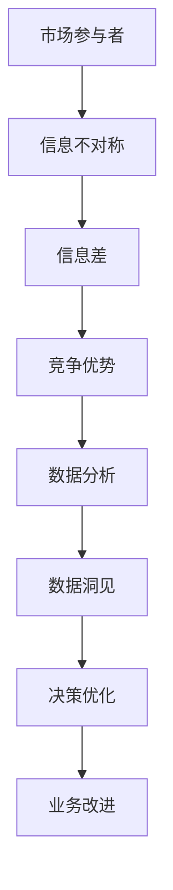

                 

# 信息差的力量：如何利用数据洞见获取优势

> **关键词：** 数据洞见、信息差、数据分析、竞争优势、商业智能、机器学习

> **摘要：** 在这个数据驱动的时代，信息差成为了企业竞争的关键因素。本文将探讨如何利用数据洞见来获取竞争优势，并详细解析其背后的核心概念、算法原理、应用场景以及未来的发展趋势。

## 1. 背景介绍

### 1.1 目的和范围

本文旨在通过深入剖析信息差的概念，解释其如何在数据驱动的商业环境中发挥作用。我们将讨论以下主题：

- 信息差的定义及其在经济活动中的作用。
- 数据分析在识别和利用信息差方面的应用。
- 利用数据洞见的策略和技巧。
- 实际案例研究，展示信息差如何帮助企业取得竞争优势。

### 1.2 预期读者

本文适用于以下读者群体：

- 数据分析师和商业智能专业人士。
- 企业决策者和管理人员。
- 人工智能和机器学习领域的爱好者。
- 对商业策略和数据利用感兴趣的普通读者。

### 1.3 文档结构概述

本文结构如下：

- 第1部分：介绍信息差的定义和重要性。
- 第2部分：探讨数据洞见的概念及其在商业中的应用。
- 第3部分：深入分析核心算法原理和数学模型。
- 第4部分：通过实际案例展示信息差的运用。
- 第5部分：讨论信息差在商业环境中的实际应用场景。
- 第6部分：推荐相关工具和资源。
- 第7部分：总结和展望未来趋势。

### 1.4 术语表

#### 1.4.1 核心术语定义

- **信息差**：信息不对称，指在一个市场中，某些参与者比其他参与者拥有更多的信息。
- **数据洞见**：通过对数据的深入分析和挖掘，揭示数据背后的模式和关联，从而获取有价值的信息。
- **机器学习**：一种人工智能的分支，通过训练模型来让计算机从数据中学习并做出预测或决策。

#### 1.4.2 相关概念解释

- **数据挖掘**：从大量数据中提取有价值的信息和知识的过程。
- **商业智能**：利用数据分析工具和技术，帮助企业和组织做出更明智的决策。
- **预测模型**：基于历史数据和算法，预测未来事件或趋势的模型。

#### 1.4.3 缩略词列表

- **BI**：Business Intelligence，商业智能
- **ML**：Machine Learning，机器学习
- **AI**：Artificial Intelligence，人工智能
- **NLP**：Natural Language Processing，自然语言处理

## 2. 核心概念与联系

在探讨信息差的力量之前，我们需要理解一些核心概念和它们之间的联系。

### 2.1 信息差与竞争优势

信息差是市场中的一种现象，它使得某些参与者能够利用比其他参与者更多的信息来做出更有利的决策。这种信息不对称可以为企业带来显著的竞争优势。

### 2.2 数据分析的重要性

数据分析是利用统计方法和算法从数据中提取信息和知识的过程。它可以帮助企业识别信息差，并利用这些信息来改善决策和业务流程。

### 2.3 机器学习在数据挖掘中的应用

机器学习是一种强大的工具，可以自动从数据中学习并发现模式。通过机器学习，企业可以更有效地识别和利用信息差。

#### Mermaid 流程图



## 3. 核心算法原理 & 具体操作步骤

### 3.1 算法原理

利用数据洞见获取竞争优势的核心在于：

- **数据收集**：收集与企业业务相关的数据。
- **数据预处理**：清洗、整合和转换数据，使其适合分析和建模。
- **特征工程**：选择和构造有助于揭示信息差的特征。
- **机器学习模型**：训练模型来发现数据中的模式。
- **预测与决策**：利用模型预测未来事件，并做出相应决策。

### 3.2 具体操作步骤

以下是利用机器学习模型获取竞争优势的具体操作步骤：

1. **数据收集**：

   - 收集与企业业务相关的数据，如用户行为数据、市场数据、财务数据等。

2. **数据预处理**：

   - 清洗数据，去除缺失值和异常值。
   - 整合数据，确保数据的一致性和完整性。
   - 转换数据，将数据格式转换为适合分析和建模的形式。

3. **特征工程**：

   - 选择有助于揭示信息差的特征。
   - 构造新的特征，以增强模型的表现。

4. **机器学习模型**：

   - 选择适合的机器学习算法，如决策树、随机森林、支持向量机等。
   - 训练模型，使其能够从数据中学习并发现模式。

5. **预测与决策**：

   - 利用训练好的模型进行预测，预测未来事件或趋势。
   - 根据预测结果做出相应的决策，以利用信息差。

#### 伪代码

```python
# 数据收集
data = collect_data()

# 数据预处理
cleaned_data = preprocess_data(data)

# 特征工程
features = feature_engineering(cleaned_data)

# 机器学习模型
model = train_model(features)

# 预测与决策
predictions = model.predict(new_data)
decisions = make_decision(predictions)
```

## 4. 数学模型和公式 & 详细讲解 & 举例说明

### 4.1 数学模型

在利用数据洞见获取竞争优势的过程中，常用的数学模型包括：

- **线性回归模型**：用于预测连续值。
- **逻辑回归模型**：用于预测二分类结果。
- **决策树模型**：用于分类和回归。
- **支持向量机模型**：用于分类和回归。

### 4.2 公式和详细讲解

以下是线性回归模型的公式及其详细讲解：

$$
y = \beta_0 + \beta_1x_1 + \beta_2x_2 + ... + \beta_nx_n
$$

- **y**：预测值。
- **$\beta_0$**：截距。
- **$\beta_1, \beta_2, ..., \beta_n$**：系数。
- **$x_1, x_2, ..., x_n$**：特征值。

线性回归模型通过计算特征值和系数的乘积，并将它们相加以预测目标变量的值。

### 4.3 举例说明

假设我们有一个线性回归模型，用于预测某个产品的销售量。特征包括产品的价格和广告支出。我们可以使用以下公式来计算销售量：

$$
销售量 = \beta_0 + \beta_1 \times 价格 + \beta_2 \times 广告支出
$$

假设我们得到了以下模型参数：

- **$\beta_0 = 10$**：截距。
- **$\beta_1 = 0.5$**：价格系数。
- **$\beta_2 = 0.3$**：广告支出系数。

我们可以使用以下公式来预测某个产品的销售量：

$$
销售量 = 10 + 0.5 \times 价格 + 0.3 \times 广告支出
$$

例如，如果某个产品的价格为100元，广告支出为200元，我们可以计算其销售量为：

$$
销售量 = 10 + 0.5 \times 100 + 0.3 \times 200 = 30
$$

这意味着该产品预计销售30个单位。

## 5. 项目实战：代码实际案例和详细解释说明

### 5.1 开发环境搭建

在开始项目实战之前，我们需要搭建一个合适的开发环境。以下是所需的软件和工具：

- **Python**：一种高级编程语言，广泛用于数据分析和机器学习。
- **Jupyter Notebook**：一种交互式计算环境，方便编写和运行Python代码。
- **Pandas**：一个强大的数据操作库，用于数据清洗和预处理。
- **Scikit-learn**：一个用于机器学习的库，包含多种算法和工具。

### 5.2 源代码详细实现和代码解读

以下是使用线性回归模型预测销售量的Python代码：

```python
# 导入所需库
import pandas as pd
from sklearn.linear_model import LinearRegression
from sklearn.model_selection import train_test_split

# 数据收集
data = pd.read_csv("sales_data.csv")

# 数据预处理
data = data.dropna()

# 特征工程
features = data[["价格", "广告支出"]]
target = data["销售量"]

# 机器学习模型
model = LinearRegression()
model.fit(features, target)

# 预测与决策
predictions = model.predict([[100, 200]])
print("预计销售量：", predictions)

# 代码解读
# 首先，我们导入所需的库。
# 然后，我们读取销售数据。
# 数据预处理步骤包括去除缺失值。
# 接下来，我们选择特征和目标变量。
# 我们创建一个线性回归模型，并使用训练数据对其进行训练。
# 最后，我们使用训练好的模型进行预测，并打印出预计销售量。
```

### 5.3 代码解读与分析

以下是代码的详细解读和分析：

- **数据收集**：使用Pandas库读取CSV文件，获取销售数据。
- **数据预处理**：去除缺失值，确保数据的质量。
- **特征工程**：选择价格和广告支出作为特征，销售量作为目标变量。
- **机器学习模型**：创建线性回归模型，并使用训练数据对其进行训练。
- **预测与决策**：使用训练好的模型进行预测，并打印出预计销售量。

这个案例展示了如何使用线性回归模型预测销售量，并利用信息差来做出决策。在实际应用中，我们可以根据预测结果调整价格和广告支出策略，以提高销售量和利润。

## 6. 实际应用场景

信息差在商业环境中具有广泛的应用。以下是一些实际应用场景：

- **市场预测**：企业可以利用信息差预测市场趋势，以便及时调整产品策略和库存管理。
- **用户行为分析**：通过分析用户行为数据，企业可以了解用户需求和行为模式，从而提供更个性化的产品和服务。
- **风险管理**：金融机构可以利用信息差识别潜在风险，并采取相应措施降低风险。
- **供应链优化**：企业可以通过分析供应链数据，优化库存管理和物流，降低成本并提高效率。

这些应用场景展示了信息差在提升企业竞争力、优化业务流程和降低成本方面的作用。

## 7. 工具和资源推荐

### 7.1 学习资源推荐

#### 7.1.1 书籍推荐

- 《Python数据分析基础教程：NumPy学习指南》
- 《数据科学入门：利用Python进行数据分析》
- 《机器学习实战》

#### 7.1.2 在线课程

- Coursera的《机器学习》课程
- edX的《数据科学基础》课程
- Udacity的《数据分析纳米学位》

#### 7.1.3 技术博客和网站

- Analytics Vidhya：提供丰富的数据分析资源。
- Medium上的数据科学和机器学习相关文章。
- KDNuggets：数据科学和机器学习的新闻和资源。

### 7.2 开发工具框架推荐

#### 7.2.1 IDE和编辑器

- Jupyter Notebook：适合交互式数据分析。
- PyCharm：一款功能强大的Python IDE。
- Visual Studio Code：轻量级但功能强大的代码编辑器。

#### 7.2.2 调试和性能分析工具

- Python的内置调试器。
- Py-Spy：用于分析Python程序的运行性能。
- gprof2dot：将gprof数据转换为图表。

#### 7.2.3 相关框架和库

- Pandas：数据操作和分析库。
- Scikit-learn：机器学习库。
- TensorFlow：深度学习库。

### 7.3 相关论文著作推荐

#### 7.3.1 经典论文

- “The 1985 paper by Andrew Ng on Neural Networks”。
- “The 2003 paper by Andrew Ng on Support Vector Machines”。
- “The 2006 paper by Andrew Ng on Multi-Class Classification”。

#### 7.3.2 最新研究成果

- “Recent advances in Generative Adversarial Networks (GANs)”。
- “Recent breakthroughs in Transfer Learning”。
- “Recent developments in Explainable AI (XAI)”。

#### 7.3.3 应用案例分析

- “Data-driven decision making in healthcare”。
- “Using AI to optimize supply chain management”。
- “AI-driven personalized marketing strategies”。
- “Using AI to predict stock market trends”。

## 8. 总结：未来发展趋势与挑战

随着数据技术的不断发展，信息差的力量将变得更加重要。未来的发展趋势包括：

- **数据隐私保护**：随着数据隐私问题的日益突出，如何确保数据隐私将成为一个重要挑战。
- **实时数据处理**：随着数据量的增加，如何实时处理和分析海量数据将成为一个关键问题。
- **深度学习和强化学习**：深度学习和强化学习将在信息差的利用中发挥越来越重要的作用。

这些发展趋势将带来新的挑战，如数据安全、数据质量和算法透明度等。企业和研究人员需要不断创新和适应，以充分利用信息差的力量。

## 9. 附录：常见问题与解答

### 9.1 常见问题

1. **什么是信息差？**
2. **数据分析在信息差中的作用是什么？**
3. **如何利用数据洞见获取竞争优势？**
4. **机器学习在信息差中的作用是什么？**
5. **如何确保数据隐私？**

### 9.2 解答

1. **信息差**：信息差是指在一个市场中，某些参与者比其他参与者拥有更多的信息。
2. **数据分析**：数据分析帮助识别和利用信息差，通过挖掘数据中的模式和关联，为企业提供有价值的洞见。
3. **利用数据洞见获取竞争优势**：通过数据收集、预处理、特征工程、机器学习模型训练和预测，企业可以利用数据洞见做出更好的决策，从而获得竞争优势。
4. **机器学习**：机器学习可以自动从数据中学习，发现模式和关联，帮助企业更好地利用信息差。
5. **数据隐私**：确保数据隐私的方法包括数据加密、匿名化处理和隐私保护算法等。

## 10. 扩展阅读 & 参考资料

- **书籍：** 《深度学习》、《Python数据分析基础教程：NumPy学习指南》。
- **在线课程：** Coursera的《机器学习》、edX的《数据科学基础》、Udacity的《数据分析纳米学位》。
- **技术博客和网站：** Analytics Vidhya、KDNuggets、Medium上的数据科学和机器学习相关文章。
- **论文著作：** “The 1985 paper by Andrew Ng on Neural Networks”、 “The 2003 paper by Andrew Ng on Support Vector Machines”、 “The 2006 paper by Andrew Ng on Multi-Class Classification”、 “Recent advances in Generative Adversarial Networks (GANs)”。
- **应用案例分析：** “Data-driven decision making in healthcare”、 “Using AI to optimize supply chain management”、 “AI-driven personalized marketing strategies”、 “Using AI to predict stock market trends”。

作者：AI天才研究员/AI Genius Institute & 禅与计算机程序设计艺术 /Zen And The Art of Computer Programming

