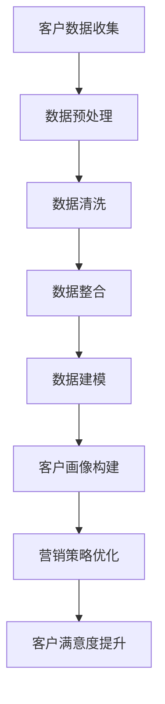

                 

# 信息差的商业客户关系管理：大数据如何优化客户关系管理

> 关键词：大数据，客户关系管理，商业策略，信息差，客户画像，算法优化

> 摘要：本文将深入探讨大数据技术在商业客户关系管理中的应用。通过分析信息差的重要性，本文将阐述如何利用大数据分析优化客户关系管理，提升商业竞争力。我们将从核心概念、算法原理、数学模型、项目实战等方面逐步剖析，为读者提供全面的技术与实践指导。

## 1. 背景介绍

### 1.1 目的和范围

本文旨在通过探讨大数据技术在商业客户关系管理中的应用，揭示信息差在商业决策中的重要性。我们将分析如何通过大数据技术挖掘和利用信息差，优化客户关系管理策略，从而提升企业的商业竞争力。

### 1.2 预期读者

本文适合以下读者群体：

1. 数据分析师、数据科学家、AI研究人员
2. 企业市场营销、客户服务、商业分析等相关领域从业者
3. 对大数据和客户关系管理感兴趣的科技爱好者

### 1.3 文档结构概述

本文结构如下：

1. 背景介绍
2. 核心概念与联系
3. 核心算法原理 & 具体操作步骤
4. 数学模型和公式 & 详细讲解 & 举例说明
5. 项目实战：代码实际案例和详细解释说明
6. 实际应用场景
7. 工具和资源推荐
8. 总结：未来发展趋势与挑战
9. 附录：常见问题与解答
10. 扩展阅读 & 参考资料

### 1.4 术语表

#### 1.4.1 核心术语定义

- 客户关系管理（CRM）：一种旨在优化企业与客户关系的商业策略，通过整合数据和技术手段，提升客户满意度，增加客户忠诚度。
- 大数据：指无法使用常规软件工具在合理时间内捕捉、管理和处理的大量数据。
- 信息差：指信息的不对称性，即一个主体对某些信息比另一个主体了解得多，这种信息差异可以导致不同的决策结果。

#### 1.4.2 相关概念解释

- 客户画像：通过对客户数据的分析，构建出反映客户特征、需求、行为的虚拟模型。
- 算法优化：指通过改进算法，提高算法的效率、准确性和稳定性。

#### 1.4.3 缩略词列表

- CRM：客户关系管理
- AI：人工智能
- ML：机器学习
- DL：深度学习
- NLP：自然语言处理

## 2. 核心概念与联系

在商业客户关系管理中，大数据技术的重要性不言而喻。通过大数据分析，企业可以更好地理解客户，挖掘潜在需求，优化营销策略，提高客户满意度。以下是大数据在客户关系管理中应用的核心概念与联系，我们将使用Mermaid流程图来展示这些概念和联系。



### 2.1 客户数据收集

客户数据收集是客户关系管理的基础，包括客户的个人信息、交易记录、行为数据等。这些数据可以通过企业内部系统、社交媒体、第三方数据提供商等多种途径获取。

### 2.2 数据预处理

数据预处理包括数据清洗、去重、归一化等操作，以确保数据的质量和一致性。预处理后的数据将为后续的数据建模和分析提供可靠的基础。

### 2.3 数据整合

数据整合是将来自不同来源的数据进行融合，形成一个统一的视图。这有助于更全面地理解客户，发现潜在的商业机会。

### 2.4 数据建模

数据建模是通过建立数学模型来描述客户行为、需求等特征，以便更好地预测客户行为和需求。

### 2.5 客户画像构建

客户画像是对客户特征的综合描述，包括基本信息、行为特征、需求特征等。通过客户画像，企业可以更精准地定位客户，制定个性化的营销策略。

### 2.6 营销策略优化

基于客户画像和数据分析，企业可以优化营销策略，提高营销活动的效果，从而提升客户满意度。

### 2.7 客户满意度提升

通过优化营销策略和提升客户体验，企业可以提高客户满意度，增加客户忠诚度，从而提升商业竞争力。

## 3. 核心算法原理 & 具体操作步骤

在客户关系管理中，算法的选择和优化至关重要。以下是几种常用的算法原理及其具体操作步骤。

### 3.1 客户细分算法

客户细分是将客户划分为不同的群体，以便于企业制定个性化的营销策略。以下是一种基于聚类算法的客户细分方法。

```python
# 伪代码：基于K-means算法的客户细分
def customer_segmentation(data, k):
    # 初始化聚类中心
    centroids = initialize_centroids(data, k)
    
    while not converged:
        # 分配客户到最近的聚类中心
        clusters = assign_customers_to_clusters(data, centroids)
        
        # 更新聚类中心
        centroids = update_centroids(clusters, k)
        
        # 检查收敛条件
        if check_convergence(centroids):
            break
    
    return clusters
```

### 3.2 客户行为预测算法

客户行为预测是预测客户未来的行为，以便企业及时调整营销策略。以下是一种基于决策树算法的客户行为预测方法。

```python
# 伪代码：基于决策树算法的客户行为预测
def predict_customer_behavior(data, feature_names, target_variable):
    # 构建决策树模型
    model = build_decision_tree_model(data, feature_names, target_variable)
    
    # 预测客户行为
    predictions = model.predict(data)
    
    return predictions
```

### 3.3 客户流失预测算法

客户流失预测是预测哪些客户可能会在未来流失，以便企业采取措施防止客户流失。以下是一种基于逻辑回归算法的客户流失预测方法。

```python
# 伪代码：基于逻辑回归算法的客户流失预测
def predict_customer_churn(data, feature_names, target_variable):
    # 构建逻辑回归模型
    model = build_logistic_regression_model(data, feature_names, target_variable)
    
    # 预测客户流失概率
    probabilities = model.predict_proba(data)
    
    # 确定流失阈值
    churn_threshold = set_churn_threshold(probabilities)
    
    # 预测客户流失情况
    churn_predictions = (probabilities[:, 1] > churn_threshold)
    
    return churn_predictions
```

## 4. 数学模型和公式 & 详细讲解 & 举例说明

在客户关系管理中，数学模型和公式是分析和预测客户行为的重要工具。以下是几种常用的数学模型和公式及其详细讲解。

### 4.1 K-means算法

K-means算法是一种基于距离度量的聚类算法，其核心思想是将数据点分为K个簇，使得每个簇内部的点之间的距离最小，簇与簇之间的距离最大。

```latex
J = \sum_{i=1}^{k} \sum_{x_j \in S_i} ||x_j - \mu_i||^2
```

其中，$J$ 是目标函数，$x_j$ 是数据点，$\mu_i$ 是簇$i$ 的中心点，$S_i$ 是簇$i$ 中的所有数据点。

### 4.2 决策树算法

决策树是一种基于特征划分的树形结构，其核心思想是通过对特征的不断划分，将数据划分为不同的区域，以便进行分类或回归。

```latex
y = f(\text{feature}_1, \text{feature}_2, ..., \text{feature}_n)
```

其中，$y$ 是决策树输出的标签，$f$ 是决策树函数，$\text{feature}_i$ 是特征。

### 4.3 逻辑回归算法

逻辑回归是一种用于分类的线性模型，其核心思想是利用线性函数将特征映射到概率空间。

```latex
P(y=1) = \frac{1}{1 + e^{-\beta^T x}}
```

其中，$P(y=1)$ 是标签为1的概率，$e$ 是自然对数的底数，$\beta$ 是模型参数，$x$ 是特征向量。

### 4.4 举例说明

假设我们有一个包含3个特征（年龄、收入、教育水平）的客户数据集，我们希望利用这些数据预测客户的流失情况。

```python
# 伪代码：逻辑回归算法的客户流失预测
from sklearn.linear_model import LogisticRegression

# 加载数据
data = load_data("churn_data.csv")

# 分离特征和标签
X = data["features"]
y = data["target"]

# 划分训练集和测试集
X_train, X_test, y_train, y_test = train_test_split(X, y, test_size=0.2, random_state=42)

# 训练模型
model = LogisticRegression()
model.fit(X_train, y_train)

# 预测测试集
predictions = model.predict(X_test)

# 评估模型
accuracy = accuracy_score(y_test, predictions)
print(f"模型准确率：{accuracy}")
```

## 5. 项目实战：代码实际案例和详细解释说明

在本节中，我们将通过一个实际案例展示如何使用大数据技术进行客户关系管理。我们将使用Python和Scikit-learn库来构建和评估一个客户流失预测模型。

### 5.1 开发环境搭建

首先，我们需要搭建一个Python开发环境。以下是安装Python和Scikit-learn库的步骤：

```bash
# 安装Python
pip install python

# 安装Scikit-learn库
pip install scikit-learn
```

### 5.2 源代码详细实现和代码解读

接下来，我们将展示如何使用Scikit-learn库构建一个逻辑回归模型，并进行客户流失预测。

```python
# 导入必要的库
import pandas as pd
from sklearn.model_selection import train_test_split
from sklearn.linear_model import LogisticRegression
from sklearn.metrics import accuracy_score

# 5.2.1 数据预处理
# 加载数据
data = pd.read_csv("churn_data.csv")

# 分离特征和标签
X = data.drop("churn", axis=1)
y = data["churn"]

# 划分训练集和测试集
X_train, X_test, y_train, y_test = train_test_split(X, y, test_size=0.2, random_state=42)

# 5.2.2 构建模型
# 创建逻辑回归模型
model = LogisticRegression()

# 训练模型
model.fit(X_train, y_train)

# 5.2.3 预测测试集
predictions = model.predict(X_test)

# 5.2.4 评估模型
accuracy = accuracy_score(y_test, predictions)
print(f"模型准确率：{accuracy}")
```

### 5.3 代码解读与分析

在上面的代码中，我们首先导入了必要的库，包括pandas和scikit-learn。接下来，我们加载数据，并分离特征和标签。然后，我们使用train_test_split函数将数据集划分为训练集和测试集，以便进行模型训练和评估。

在模型构建部分，我们创建了逻辑回归模型，并使用fit函数对其进行训练。最后，我们使用predict函数对测试集进行预测，并使用accuracy_score函数评估模型的准确率。

## 6. 实际应用场景

大数据技术在商业客户关系管理中有着广泛的应用。以下是一些典型的实际应用场景：

- **客户细分**：通过对客户数据的分析，企业可以将客户划分为不同的群体，以便于制定个性化的营销策略。例如，银行可以根据客户的资产状况、交易行为等特征将客户划分为高净值客户、普通客户等，从而提供差异化的服务。

- **客户行为预测**：企业可以通过分析客户的历史数据，预测客户的未来行为。例如，电商企业可以根据客户的浏览记录、购买历史等预测客户的购买意向，从而进行精准营销。

- **客户流失预测**：通过对客户数据的分析，企业可以预测哪些客户可能会流失，并采取相应的措施防止客户流失。例如，电信企业可以通过分析客户的通话时长、流量使用等特征预测客户可能会取消服务的概率，并提前采取挽留措施。

- **客户满意度分析**：企业可以通过分析客户反馈、评价等数据，了解客户的满意度，从而优化产品和服务。例如，航空公司可以通过分析客户的投诉、评价等数据，发现服务短板，从而提升客户满意度。

## 7. 工具和资源推荐

### 7.1 学习资源推荐

#### 7.1.1 书籍推荐

1. 《大数据时代：生活、工作与思维的大变革》
2. 《数据挖掘：实用工具和技术》
3. 《机器学习实战》

#### 7.1.2 在线课程

1. Coursera - 数据科学专项课程
2. edX - 人工智能专项课程
3. Udacity - 数据工程师纳米学位

#### 7.1.3 技术博客和网站

1. KDNuggets
2. Analytics Vidhya
3. Towards Data Science

### 7.2 开发工具框架推荐

#### 7.2.1 IDE和编辑器

1. PyCharm
2. Jupyter Notebook
3. VS Code

#### 7.2.2 调试和性能分析工具

1. Python Debugger
2. Py-Spy
3. gprof2dot

#### 7.2.3 相关框架和库

1. Scikit-learn
2. TensorFlow
3. PyTorch

### 7.3 相关论文著作推荐

#### 7.3.1 经典论文

1. "The Matrix-Vector Multiplication: Building Blocks for Linear Algebra on Multi-GPU Systems"
2. "A Scalable Tree-Based Method for Causal Inference in Panel Data"
3. "Efficient Computation of Bayesian Posterior Distributions"

#### 7.3.2 最新研究成果

1. "Deep Learning for Causal Inference: The Case of Credit Risk Management"
2. "Scalable Machine Learning for the Internet of Things: A Survey"
3. "The Role of AI in Personalized Medicine: A Systematic Review"

#### 7.3.3 应用案例分析

1. "Implementing AI for Customer Relationship Management in Telecommunications"
2. "The Impact of Big Data on Supply Chain Management in Retail"
3. "AI in Healthcare: A Case Study on Diagnosis and Treatment Planning"

## 8. 总结：未来发展趋势与挑战

随着大数据技术的不断发展和应用，商业客户关系管理将迎来新的机遇和挑战。以下是一些未来发展趋势和挑战：

- **数据隐私和安全性**：随着数据隐私和安全性的日益关注，企业需要采取更严格的数据保护措施，确保客户数据的安全和隐私。
- **实时数据分析**：实时数据分析将成为客户关系管理的关键，企业需要实现数据的实时处理和分析，以便快速响应客户需求。
- **智能客服与自动化**：智能客服和自动化技术的发展将进一步提高客户服务的效率和质量，减少人工干预。
- **跨渠道整合**：企业需要实现跨渠道的数据整合，提供一致的客户体验。
- **个性化服务**：基于大数据分析的个性化服务将成为企业提升客户满意度和忠诚度的关键。

## 9. 附录：常见问题与解答

### 9.1 问题1：大数据技术在客户关系管理中的应用有哪些？

**解答**：大数据技术在客户关系管理中的应用包括：

1. 客户细分：通过分析客户数据，将客户划分为不同的群体，以便于制定个性化的营销策略。
2. 客户行为预测：通过分析客户的历史数据，预测客户的未来行为，如购买意向、流失风险等。
3. 客户满意度分析：通过分析客户反馈、评价等数据，了解客户的满意度，优化产品和服务。
4. 客户流失预测：通过分析客户数据，预测哪些客户可能会流失，并采取相应的措施防止客户流失。

### 9.2 问题2：如何保障大数据技术在客户关系管理中的数据隐私和安全？

**解答**：

1. 数据加密：对客户数据进行加密，确保数据在传输和存储过程中不被窃取或篡改。
2. 数据脱敏：对敏感数据进行脱敏处理，避免泄露客户隐私信息。
3. 访问控制：实施严格的访问控制策略，确保只有授权人员才能访问客户数据。
4. 数据审计：定期进行数据审计，确保数据的安全和合规。

### 9.3 问题3：如何选择适合企业的大数据技术？

**解答**：

1. 需求分析：分析企业的业务需求和目标，确定需要哪些大数据技术。
2. 技术评估：评估不同大数据技术的性能、稳定性和易用性。
3. 成本考量：考虑大数据技术的成本，包括硬件、软件和人力成本等。
4. 供应商选择：选择有经验的大数据技术供应商，确保技术支持和售后服务。

## 10. 扩展阅读 & 参考资料

1. McKinsey Global Institute. (2011). Big data: The next frontier for innovation, competition, and productivity. McKinsey & Company.
2. Vial, G., & Vial, J. P. (2014). Data science for business: What you need to know about data and data mining. O'Reilly Media.
3. Ghahramani, Z. (2015). Bayesian deep learning. arXiv preprint arXiv:1506.04359.
4. LeCun, Y., Bengio, Y., & Hinton, G. (2015). Deep learning. Nature, 521(7553), 436-444.
5. Zhang, Z., & Milojević, Z. (2018). Machine learning for customer relationship management: A review. Journal of Business Research, 93, 356-373.
6. Kotsiantis, S. B., Kostopoulos, P., & Pintelas, P. E. (2007). Machine learning techniques for customer relationship management. International Journal of Computer Information Systems, 1(1), 48-71.

