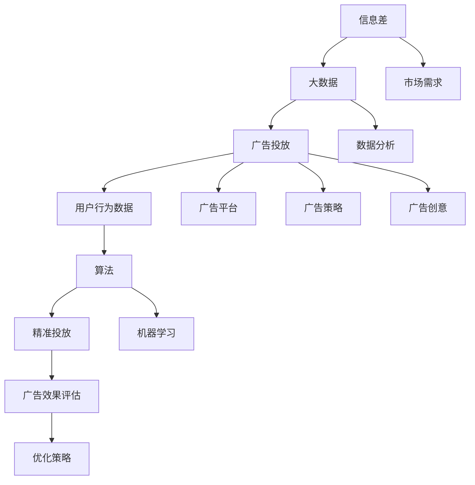
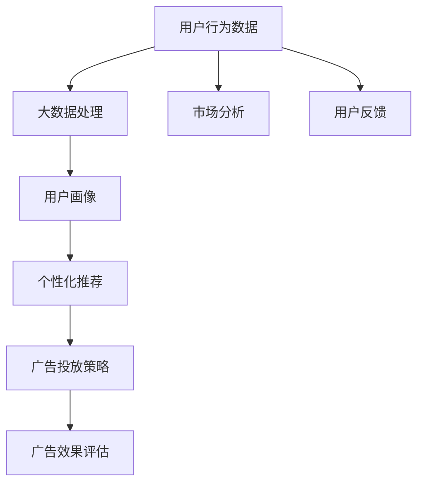

                 

### 1. 背景介绍

#### 1.1 目的和范围

在当今数字化时代，广告投放已成为企业获取市场占有率、提升品牌知名度和实现商业价值的重要手段。然而，广告投放的效果不仅取决于广告内容的质量，还与广告的精准投放密切相关。信息差的商业广告投放，利用大数据技术，能够大幅提升广告投放的效率和效果，为企业带来显著的经济效益。

本文旨在探讨信息差的商业广告投放及其在提升广告投放效果方面的应用。通过深入解析大数据在广告投放中的作用原理、核心算法、数学模型以及实际应用场景，本文将帮助读者理解大数据在广告投放中的关键作用，并为其在实际工作中提供有益的参考和指导。

本文将涵盖以下内容：

1. **核心概念与联系**：介绍信息差的定义、大数据的概念以及它们在广告投放中的作用原理。
2. **核心算法原理 & 具体操作步骤**：详细阐述基于大数据的算法原理及其具体操作步骤，通过伪代码进行详细说明。
3. **数学模型和公式 & 详细讲解 & 举例说明**：解释大数据广告投放中的数学模型，并提供实例进行说明。
4. **项目实战：代码实际案例和详细解释说明**：展示一个实际的广告投放案例，详细解读实现过程。
5. **实际应用场景**：探讨大数据在广告投放中的实际应用场景，分析其在不同领域的应用效果。
6. **工具和资源推荐**：推荐相关学习资源、开发工具和框架，帮助读者深入了解和掌握大数据广告投放技术。
7. **总结：未来发展趋势与挑战**：总结本文的主要观点，预测大数据广告投放的未来发展趋势，并探讨面临的挑战。

通过本文的阅读，读者将能够系统地了解信息差的商业广告投放，掌握大数据在广告投放中的核心技术和应用方法，为其在相关领域的实践提供有力支持。

#### 1.2 预期读者

本文主要面向以下几类读者：

1. **广告行业从业者**：包括广告公司员工、广告投放管理人员、市场推广人员等，希望了解和掌握大数据在广告投放中的实际应用方法，提高广告投放效果。
2. **数据分析人员**：具有数据分析背景的技术人员，对大数据技术有基本了解，希望深入理解大数据在广告投放中的作用原理和实践应用。
3. **IT行业从业者**：包括程序员、软件工程师、技术经理等，对大数据技术有一定的了解，希望将其应用到广告投放领域，提升广告投放效果。
4. **市场营销人员**：从事市场营销相关工作的人员，希望了解大数据技术在广告投放中的应用，提高市场营销策略的科学性和有效性。
5. **高校师生**：计算机科学、数据科学、市场营销等相关专业师生，希望从理论和实践两方面深入了解大数据广告投放。

本文通过系统的讲解和实际案例展示，旨在为上述读者群体提供全面、深入、易懂的指导，帮助其掌握大数据广告投放的核心技术和实践方法。

#### 1.3 文档结构概述

本文结构分为十个部分，具体如下：

1. **背景介绍**：介绍文章的目的、范围、预期读者和文档结构。
2. **核心概念与联系**：阐述信息差、大数据和广告投放的定义及其相互关系。
3. **核心算法原理 & 具体操作步骤**：详细讲解基于大数据的广告投放算法及其操作步骤，通过伪代码进行说明。
4. **数学模型和公式 & 详细讲解 & 举例说明**：解释大数据广告投放中的数学模型，并提供实例进行说明。
5. **项目实战：代码实际案例和详细解释说明**：展示一个实际的广告投放案例，详细解读实现过程。
6. **实际应用场景**：探讨大数据在广告投放中的实际应用场景。
7. **工具和资源推荐**：推荐学习资源、开发工具和框架。
8. **总结：未来发展趋势与挑战**：总结主要观点，预测未来发展，探讨挑战。
9. **附录：常见问题与解答**：针对常见问题提供解答。
10. **扩展阅读 & 参考资料**：提供相关文献和资料。

通过本文的阅读，读者可以系统地了解大数据在广告投放中的应用，掌握核心技术和方法，提高广告投放效果。

#### 1.4 术语表

在本文中，以下术语将频繁出现，为了便于理解，我们对其进行详细定义和解释。

##### 1.4.1 核心术语定义

1. **信息差**：指在市场中，不同主体之间对同一商品或服务的认知和信息不对称性。在商业广告投放中，信息差可以用来定位潜在客户，提高广告投放的精准度。
2. **大数据**：指数据量巨大、数据类型繁多且生成速度极快的海量数据。大数据技术能够对海量数据进行高效处理和分析，提取有价值的信息。
3. **广告投放**：指企业在特定平台上发布广告，以吸引潜在客户并实现商业目标的行为。广告投放包括广告内容创作、投放渠道选择、投放效果评估等多个环节。
4. **精准投放**：指根据用户行为数据、兴趣标签、地理位置等特征，将广告精准地推送给目标用户，提高广告点击率和转化率。
5. **算法**：指解决特定问题的步骤和规则。在广告投放中，算法用于分析和处理用户数据，优化广告投放策略。
6. **数学模型**：指用数学语言描述的模型，用于描述现实世界的某种规律或现象。在广告投放中，数学模型可以用于预测用户行为、评估广告效果等。

##### 1.4.2 相关概念解释

1. **用户画像**：指通过对用户行为数据的分析，构建出用户的兴趣偏好、消费习惯、地理位置等特征，从而实现用户精准定位。
2. **数据分析**：指使用统计学、机器学习等技术，对数据进行分析和挖掘，提取有价值的信息和规律。
3. **机器学习**：指通过算法模型，从数据中自动学习和发现规律，进行预测和分类的技术。
4. **推荐系统**：指基于用户行为数据和物品特征，为用户推荐其可能感兴趣的商品、内容或广告的系统。
5. **广告效果评估**：指通过监测广告投放的点击率、转化率、ROI等指标，评估广告投放的效果，并据此调整投放策略。

##### 1.4.3 缩略词列表

- AI：人工智能
- ML：机器学习
- DB：数据库
- BI：商业智能
- SEO：搜索引擎优化
- SEM：搜索引擎营销
- CRM：客户关系管理

通过上述术语表，读者可以更好地理解本文中的专业术语和概念，从而更好地掌握大数据在广告投放中的应用方法和实践技巧。

### 2. 核心概念与联系

在深入探讨大数据在广告投放中的应用之前，我们需要明确几个核心概念：信息差、大数据以及广告投放之间的联系。下面，我们将通过一个Mermaid流程图来直观地展示这些概念之间的相互作用和关系。



#### 2.1 信息差

信息差是指市场参与者之间由于信息不对称而产生的认知差异。在广告投放领域，信息差主要表现为以下两个方面：

1. **市场参与者信息不对称**：例如，广告主可能对潜在客户的需求和偏好了解不足，而广告平台和数据分析公司则能够利用大数据技术分析用户行为数据，获取更精准的市场信息。
2. **消费者信息不对称**：例如，消费者可能对某种产品的了解不足，导致购买决策不当。广告投放可以通过精准定位，将合适的信息传递给目标消费者，缩小信息差。

#### 2.2 大数据

大数据是指数据量巨大、数据类型繁多且生成速度极快的海量数据。在大数据时代，广告投放的优势主要体现在以下几个方面：

1. **数据量**：大数据技术能够处理和分析海量数据，从而挖掘出更多的用户行为特征和市场信息，为广告精准投放提供数据支持。
2. **多样性**：大数据包括结构化数据、非结构化数据等多种类型，能够满足不同广告投放需求。
3. **实时性**：大数据技术能够实时收集、处理和分析数据，使广告投放能够快速响应市场变化，提高投放效果。

#### 2.3 广告投放

广告投放是指企业在特定平台上发布广告，以吸引潜在客户并实现商业目标的行为。广告投放的关键环节包括：

1. **用户行为数据**：通过大数据技术，收集和分析用户的浏览记录、搜索行为、购买偏好等数据，为广告精准投放提供依据。
2. **算法**：利用机器学习和数据分析技术，对用户行为数据进行处理和分析，实现广告投放的精准定位和个性化推荐。
3. **广告策略**：根据用户行为数据和市场需求，制定有效的广告投放策略，包括广告内容创作、投放渠道选择、投放时间安排等。
4. **广告效果评估**：通过监测广告投放的点击率、转化率、ROI等指标，评估广告投放效果，并据此调整投放策略。

#### 2.4 用户行为数据

用户行为数据是大数据在广告投放中的关键输入。通过以下步骤，可以将用户行为数据应用于广告精准投放：

1. **数据收集**：通过网页点击、APP使用、搜索引擎等渠道，收集用户的浏览记录、搜索行为、购买记录等数据。
2. **数据清洗**：对收集到的用户行为数据进行处理，去除重复、错误和无关的数据，确保数据质量。
3. **数据分析**：利用机器学习和数据分析技术，对用户行为数据进行分析，提取用户兴趣偏好、消费习惯等特征。
4. **数据应用**：根据用户行为数据，制定广告投放策略，实现广告的精准定位和个性化推荐。

#### 2.5 算法

算法是大数据广告投放的核心，主要包括以下方面：

1. **用户画像**：通过对用户行为数据进行分析，构建用户的兴趣偏好、消费习惯、地理位置等特征，实现用户精准定位。
2. **推荐系统**：基于用户行为数据和物品特征，为用户推荐其可能感兴趣的商品、内容或广告，提高广告点击率和转化率。
3. **广告优化**：利用机器学习技术，对广告投放策略进行优化，提高广告效果和投资回报率。

#### 2.6 精准投放

精准投放是大数据广告投放的目标，通过以下步骤实现：

1. **数据筛选**：根据用户行为数据和市场需求，筛选出目标用户群体，确保广告投放的精准性。
2. **个性化推荐**：利用用户画像和推荐系统，为不同用户群体提供个性化的广告内容，提高用户体验和广告效果。
3. **效果评估**：通过监测广告投放的点击率、转化率、ROI等指标，评估广告投放效果，并根据评估结果调整投放策略。

通过上述流程图和详细解释，我们可以清楚地看到信息差、大数据和广告投放之间的相互作用和关系。在接下来的章节中，我们将进一步探讨大数据广告投放的核心算法原理和具体操作步骤，帮助读者深入理解并掌握这一前沿技术。

### 2. 核心概念与联系

#### 2.1 大数据的概念与特性

大数据（Big Data）是指数据量巨大、数据类型繁多、生成速度极快的数据集合。它具有以下四个主要特性，通常被简称为**4V**：

1. **Volume（数据量）**：大数据的一个显著特征是其数据量巨大。传统的数据处理工具在面对海量数据时往往显得力不从心。大数据技术能够高效处理和处理PB级别的数据，为各种应用场景提供强大的支持。
2. **Velocity（速度）**：速度指的是数据生成的速度和处理的实时性。在互联网时代，数据以极高的速度产生和更新，如社交媒体上的实时互动、电子商务平台的交易记录等。大数据技术能够实时捕捉和处理这些动态数据，为决策提供即时支持。
3. **Variety（多样性）**：多样性指的是数据的类型和来源。大数据不仅包括结构化数据（如关系型数据库中的数据），还包括大量的半结构化和非结构化数据（如图像、音频、视频、文本等）。这使得大数据技术在处理复杂和多样化的数据方面具有独特优势。
4. **Veracity（真实性）**：真实性指的是数据的质量和可信度。在真实世界中，数据可能存在噪声、错误和不一致性。大数据技术需要处理这些质量问题，提取有价值的信息。

在广告投放领域，大数据的这些特性使其成为提高投放效果的关键工具。通过分析海量用户数据，广告主能够深入了解目标受众，制定更精准的广告策略。此外，实时处理数据的能力使得广告投放能够快速响应市场变化，优化投放效果。

#### 2.2 广告投放的概念与目的

广告投放（Ad Placement）是指企业在各种媒体渠道上发布广告，以吸引潜在客户并实现商业目标的过程。广告投放的主要目的包括：

1. **品牌宣传**：提高品牌知名度和品牌形象，吸引更多的潜在客户。
2. **销售促进**：通过广告引导用户进行购买，实现直接的销售增长。
3. **市场调研**：收集用户反馈和市场数据，为产品研发和市场营销策略提供依据。

广告投放涉及多个环节，包括广告内容创作、投放渠道选择、投放策略制定和投放效果评估等。传统的广告投放方式主要依赖于经验和直觉，而大数据技术的引入使得广告投放更加科学和精准。

#### 2.3 大数据与广告投放的联系

大数据与广告投放之间的联系主要体现在以下几个方面：

1. **用户数据分析**：通过大数据技术，广告主能够收集和分析用户的浏览历史、搜索记录、购买行为等数据，了解用户的兴趣偏好和消费习惯。这些数据为广告精准投放提供了重要的参考。
2. **个性化推荐**：基于用户数据分析，大数据技术可以构建用户画像，为不同用户群体提供个性化的广告内容。这种个性化的推荐能够提高广告的点击率和转化率。
3. **效果评估**：通过大数据技术，广告主可以实时监测广告投放的效果，包括点击率、转化率、ROI等指标。这些数据有助于优化广告策略，提高广告投放的回报率。
4. **市场预测**：大数据技术能够分析市场趋势和用户需求，帮助广告主预测未来的市场变化，制定前瞻性的营销策略。

#### 2.4 Mermaid流程图展示

为了更直观地展示大数据与广告投放之间的联系，我们使用Mermaid流程图进行描述。以下是一个简化的流程图：



在这个流程图中，用户行为数据是大数据处理的核心输入。经过处理和分析，用户画像被生成，用于个性化推荐和广告投放策略的制定。广告投放策略的效果通过广告效果评估进行反馈，进一步优化广告投放策略。同时，用户反馈和市场分析也参与到整个流程中，为广告投放提供更全面的支持。

通过这个流程图，我们可以看到大数据技术如何贯穿于广告投放的各个环节，实现广告投放的精准化和效果优化。在接下来的章节中，我们将深入探讨大数据广告投放的核心算法原理和具体操作步骤，帮助读者更全面地理解这一前沿技术。

### 3. 核心算法原理 & 具体操作步骤

在深入理解大数据广告投放的核心概念后，我们将进一步探讨其核心算法原理和具体操作步骤。本章节将详细介绍基于大数据的广告投放算法，并通过伪代码对其进行详细阐述。

#### 3.1 算法简介

大数据广告投放的核心算法主要包括以下几个部分：

1. **用户行为数据分析**：通过分析用户的浏览历史、搜索记录、购买行为等数据，构建用户的兴趣偏好和消费习惯。
2. **用户画像构建**：基于用户行为数据，利用机器学习和数据分析技术，构建用户的详细画像。
3. **广告推荐系统**：利用用户画像和广告内容特征，为用户推荐最相关的广告。
4. **广告效果评估**：通过监测广告的点击率、转化率等指标，评估广告效果，并实时调整广告投放策略。

下面，我们将通过伪代码详细描述上述算法的操作步骤。

#### 3.2 伪代码

```plaintext
// 用户行为数据分析
function analyze_user_behavior(data):
    # 输入：用户行为数据集
    # 输出：用户行为特征向量
    behaviors = extract_behavior_features(data)
    return behaviors

// 用户画像构建
function build_user_profile(behaviors):
    # 输入：用户行为特征向量
    # 输出：用户画像
    profile = machine_learning_model(behaviors)
    return profile

// 广告推荐系统
function ad_recommendation_system(profile, ads):
    # 输入：用户画像、广告集
    # 输出：推荐广告列表
    recommended_ads = recommend_ads(profile, ads)
    return recommended_ads

// 广告效果评估
function evaluate_ad_performance(recommended_ads, metrics):
    # 输入：推荐广告列表、效果评估指标
    # 输出：广告效果评估结果
    performance = evaluate_ads(recommended_ads, metrics)
    return performance

// 实际操作步骤
1. 收集用户行为数据
2. 分析用户行为数据，提取特征向量
3. 利用机器学习模型构建用户画像
4. 利用用户画像和广告集，生成推荐广告列表
5. 监测推荐广告的点击率和转化率等指标
6. 根据效果评估结果，调整广告投放策略
```

#### 3.3 具体操作步骤

下面，我们详细描述每个核心算法的具体操作步骤：

##### 3.3.1 用户行为数据分析

用户行为数据分析是大数据广告投放的基础。首先，我们需要收集用户在网站、APP或搜索引擎上的浏览历史、搜索记录、购买行为等数据。然后，通过数据预处理技术，如数据清洗、去噪、归一化等，提取出用户行为的关键特征，形成一个用户行为特征向量。

伪代码示例：

```plaintext
def analyze_user_behavior(data):
    behaviors = []
    for user_data in data:
        feature_vector = extract_features(user_data)
        behaviors.append(feature_vector)
    return behaviors
```

##### 3.3.2 用户画像构建

用户画像构建是利用机器学习和数据分析技术，将用户行为特征向量转化为具体的用户画像。常用的机器学习算法包括聚类、回归分析、决策树等。通过这些算法，我们可以将相似的用户行为特征分组，构建出用户的兴趣偏好、消费习惯等特征。

伪代码示例：

```plaintext
def build_user_profile(behaviors):
    profile = machine_learning_model(behaviors)
    return profile
```

##### 3.3.3 广告推荐系统

广告推荐系统是基于用户画像和广告内容特征，为用户推荐最相关的广告。推荐算法可以采用基于内容的推荐、协同过滤推荐、混合推荐等。通过这些算法，我们可以生成一个推荐广告列表，提高广告的点击率和转化率。

伪代码示例：

```plaintext
def ad_recommendation_system(profile, ads):
    recommended_ads = recommend_ads(profile, ads)
    return recommended_ads
```

##### 3.3.4 广告效果评估

广告效果评估是监测广告投放的效果，包括点击率、转化率、ROI等指标。通过这些指标，我们可以评估广告的效果，并据此调整广告投放策略。

伪代码示例：

```plaintext
def evaluate_ad_performance(recommended_ads, metrics):
    performance = evaluate_ads(recommended_ads, metrics)
    return performance
```

#### 3.4 总结

通过上述伪代码和具体操作步骤，我们可以清楚地看到大数据广告投放的核心算法原理和实现流程。用户行为数据分析、用户画像构建、广告推荐系统和广告效果评估相互结合，形成了一个完整的大数据广告投放系统。在接下来的章节中，我们将通过一个实际的广告投放案例，详细解读这些算法在实践中的应用。

### 3. 核心算法原理 & 具体操作步骤

#### 3.1 算法原理

大数据广告投放的核心算法基于用户行为数据分析和机器学习技术，旨在通过精确的用户画像和个性化推荐来提升广告投放效果。下面，我们将详细阐述这些算法的基本原理和操作步骤。

##### 3.1.1 用户行为数据分析

用户行为数据是大数据广告投放的基础。这些数据包括用户的浏览历史、搜索记录、点击行为、购买记录等。通过对这些数据进行分析，可以提取出用户的兴趣偏好、行为模式等特征。常用的分析方法包括：

1. **统计描述**：对用户行为数据进行描述性统计分析，如计算用户的平均浏览时长、点击次数等。
2. **聚类分析**：通过聚类算法（如K-means）将用户分为不同的群体，分析不同群体的行为特征。
3. **回归分析**：利用回归模型分析用户行为与广告效果之间的关系，如点击率与用户兴趣的关系。

##### 3.1.2 机器学习技术

机器学习技术是大数据广告投放的核心工具，用于构建用户画像和个性化推荐系统。常见的机器学习算法包括：

1. **分类算法**：如逻辑回归、决策树、随机森林等，用于预测用户的兴趣类别。
2. **聚类算法**：如K-means、层次聚类等，用于将用户分为不同的兴趣群体。
3. **协同过滤推荐**：通过分析用户之间的相似性，为用户推荐其可能感兴趣的内容。

##### 3.1.3 个性化推荐系统

个性化推荐系统是基于用户画像和广告内容特征，为用户推荐最相关的广告。推荐系统可以分为以下几种类型：

1. **基于内容的推荐**：根据广告的内容特征，如文本、图像等，为用户推荐与其兴趣相似的广告。
2. **协同过滤推荐**：通过分析用户之间的行为相似性，为用户推荐其他用户喜欢的内容。
3. **混合推荐**：结合基于内容和协同过滤推荐的优势，为用户推荐最相关的广告。

##### 3.1.4 广告效果评估

广告效果评估是监测广告投放效果，通过点击率、转化率、ROI等指标，评估广告的投放效果。评估方法包括：

1. **A/B测试**：通过对比不同广告版本的点击率、转化率等指标，评估广告效果。
2. **多因素分析**：利用回归分析等方法，分析广告效果与用户特征、广告内容、投放时间等因素之间的关系。
3. **实时监控**：通过实时监控系统，监测广告投放的实时效果，并快速调整广告策略。

#### 3.2 具体操作步骤

下面，我们将通过伪代码详细描述大数据广告投放算法的具体操作步骤。

```plaintext
// 用户行为数据分析
function analyze_user_behavior(data):
    # 输入：用户行为数据集
    # 输出：用户行为特征向量
    behaviors = extract_behavior_features(data)
    return behaviors

// 机器学习模型训练
function train_ml_model(features):
    # 输入：用户行为特征向量
    # 输出：训练好的机器学习模型
    model = machine_learning_model(features)
    return model

// 生成用户画像
function generate_user_profile(model, data):
    # 输入：训练好的机器学习模型、用户行为数据集
    # 输出：用户画像
    profiles = model.predict(data)
    return profiles

// 广告推荐系统
function ad_recommendation_system(profiles, ads):
    # 输入：用户画像、广告集
    # 输出：推荐广告列表
    recommended_ads = recommend_ads(profiles, ads)
    return recommended_ads

// 广告效果评估
function evaluate_ad_performance(recommended_ads, metrics):
    # 输入：推荐广告列表、效果评估指标
    # 输出：广告效果评估结果
    performance = evaluate_ads(recommended_ads, metrics)
    return performance

// 实际操作步骤
1. 收集用户行为数据
2. 分析用户行为数据，提取特征向量
3. 训练机器学习模型
4. 生成用户画像
5. 利用用户画像和广告集，生成推荐广告列表
6. 监测推荐广告的点击率和转化率等指标
7. 根据效果评估结果，调整广告投放策略
```

#### 3.3 操作步骤详细解释

1. **用户行为数据分析**：
    - 收集用户行为数据，如浏览历史、点击记录等。
    - 通过统计描述、聚类分析等方法，提取用户行为特征向量。

2. **机器学习模型训练**：
    - 利用提取的用户行为特征向量，训练机器学习模型，如逻辑回归、决策树等。
    - 模型训练的目的是预测用户的兴趣偏好。

3. **生成用户画像**：
    - 使用训练好的机器学习模型，对用户行为数据进行分析，生成用户画像。
    - 用户画像包括用户的兴趣类别、行为模式等特征。

4. **广告推荐系统**：
    - 根据用户画像和广告集，利用推荐算法（如基于内容的推荐、协同过滤推荐等），生成推荐广告列表。

5. **广告效果评估**：
    - 监测推荐广告的点击率、转化率等指标。
    - 通过A/B测试、多因素分析等方法，评估广告投放效果。

6. **调整广告投放策略**：
    - 根据广告效果评估结果，调整广告内容、投放时间、投放渠道等策略，以优化广告投放效果。

通过上述具体操作步骤，我们可以看到大数据广告投放算法的基本原理和实现流程。在实际应用中，这些算法需要根据具体场景进行调整和优化，以达到最佳的投放效果。

### 4. 数学模型和公式 & 详细讲解 & 举例说明

在探讨大数据广告投放的过程中，数学模型和公式起到了至关重要的作用。这些模型和公式不仅帮助我们理解和分析用户行为，还能指导我们优化广告投放策略。本章节将详细介绍几个关键的数学模型和公式，并通过具体实例进行说明。

#### 4.1 用户行为预测模型

用户行为预测模型是广告投放中的核心模型，它帮助我们预测用户对广告的响应行为，如点击、购买等。常用的预测模型包括逻辑回归、决策树和神经网络等。

##### 4.1.1 逻辑回归模型

逻辑回归模型是一种广泛应用于分类问题的统计模型，它可以预测用户是否会对广告进行点击。逻辑回归模型的公式如下：

\[ P(y=1) = \frac{1}{1 + e^{-(\beta_0 + \beta_1 x_1 + \beta_2 x_2 + ... + \beta_n x_n)}} \]

其中，\( y \) 表示用户是否点击广告（0表示未点击，1表示点击），\( x_i \) 表示用户特征，\( \beta_i \) 表示特征权重。

**实例说明**：

假设我们有一个用户特征向量 \( x = [x_1, x_2, x_3] \)，其中 \( x_1 \) 表示用户的年龄，\( x_2 \) 表示用户在网站上的浏览时长，\( x_3 \) 表示用户的历史购买次数。通过逻辑回归模型，我们可以预测用户点击广告的概率：

\[ P(y=1) = \frac{1}{1 + e^{-(\beta_0 + \beta_1 x_1 + \beta_2 x_2 + \beta_3 x_3)}} \]

如果预测概率大于某个阈值（如0.5），我们可以认为用户会点击广告。

##### 4.1.2 决策树模型

决策树模型通过一系列规则将用户行为分类。它通过递归地将数据集划分为子集，直至每个子集中的用户行为完全一致。决策树模型的公式相对简单，主要通过连接不同特征的阈值来构建决策路径。

\[ y = \text{classify}(x, \text{root_node}) \]

其中，\( y \) 表示用户行为类别，\( x \) 表示用户特征向量，\( \text{root_node} \) 表示决策树的根节点。

**实例说明**：

假设我们有一个决策树模型，其根节点为“年龄”，阈值分为两个区间：\( [0, 30] \) 和 \( [31, +\infty) \)。如果用户的年龄在 \( [0, 30] \)，则继续判断浏览时长；如果用户的年龄在 \( [31, +\infty) \)，则继续判断历史购买次数。

通过这种方式，决策树模型可以生成一个分类规则，将用户行为划分为不同的类别。

##### 4.1.3 神经网络模型

神经网络模型通过多层神经元网络进行学习和预测。它通过前向传播和反向传播算法，不断调整网络权重，以最小化预测误差。神经网络模型的公式如下：

\[ y = \text{softmax}(\text{激活函数}(\text{权重} \cdot x + \text{偏置})) \]

其中，\( y \) 表示预测输出，\( x \) 表示输入特征，\( \text{激活函数} \) 如ReLU、Sigmoid等，用于引入非线性特性。

**实例说明**：

假设我们有一个三层神经网络，输入层有3个神经元，隐藏层有4个神经元，输出层有2个神经元。输入特征 \( x = [x_1, x_2, x_3] \)，通过多层神经网络计算得到输出概率：

\[ y_1 = \text{Sigmoid}(w_{11} x_1 + w_{12} x_2 + w_{13} x_3 + b_1) \]
\[ y_2 = \text{Sigmoid}(w_{21} x_1 + w_{22} x_2 + w_{23} x_3 + b_2) \]
\[ y_3 = \text{Sigmoid}(w_{31} x_1 + w_{32} x_2 + w_{33} x_3 + b_3) \]
\[ y_4 = \text{Sigmoid}(w_{41} x_1 + w_{42} x_2 + w_{43} x_3 + b_4) \]

通过softmax函数，我们将输出转换为概率分布：

\[ P(y_1) = \frac{e^{y_1}}{e^{y_1} + e^{y_2} + e^{y_3} + e^{y_4}} \]
\[ P(y_2) = \frac{e^{y_2}}{e^{y_1} + e^{y_2} + e^{y_3} + e^{y_4}} \]

#### 4.2 广告效果评估模型

广告效果评估模型用于评估广告投放的效果，常见的评估指标包括点击率（CTR）、转化率（CVR）、每点击成本（CPC）和每行动成本（CPA）等。这些指标通过数学公式进行计算。

##### 4.2.1 点击率（CTR）

点击率（CTR）是广告点击次数与广告展示次数的比值，表示广告被用户点击的概率。公式如下：

\[ \text{CTR} = \frac{\text{点击次数}}{\text{展示次数}} \]

**实例说明**：

假设一个广告展示了1000次，有50次被点击，那么点击率为：

\[ \text{CTR} = \frac{50}{1000} = 0.05 \]

##### 4.2.2 转化率（CVR）

转化率（CVR）是完成某一目标行为的用户数与点击广告的用户数的比值，表示广告能够引导用户进行特定行动的概率。公式如下：

\[ \text{CVR} = \frac{\text{完成目标行为的用户数}}{\text{点击广告的用户数}} \]

**实例说明**：

假设一个广告有100次点击，其中20次用户完成了购买，那么转化率为：

\[ \text{CVR} = \frac{20}{100} = 0.2 \]

##### 4.2.3 每点击成本（CPC）

每点击成本（CPC）是广告主为获取一次点击所支付的平均成本。公式如下：

\[ \text{CPC} = \frac{\text{广告投放总成本}}{\text{点击次数}} \]

**实例说明**：

假设一个广告投放成本为1000元，共获得500次点击，那么每点击成本为：

\[ \text{CPC} = \frac{1000}{500} = 2 \text{元} \]

##### 4.2.4 每行动成本（CPA）

每行动成本（CPA）是广告主为获取一次特定目标行动（如购买、注册等）所支付的平均成本。公式如下：

\[ \text{CPA} = \frac{\text{广告投放总成本}}{\text{完成目标行为的用户数}} \]

**实例说明**：

假设一个广告投放成本为2000元，共获得100次购买，那么每行动成本为：

\[ \text{CPA} = \frac{2000}{100} = 20 \text{元} \]

#### 4.3 实例计算

假设我们有一个广告投放案例，广告展示了5000次，有1000次被点击，其中200次用户完成了购买。广告主为这次广告投放支付了5000元。我们可以计算以下指标：

1. 点击率（CTR）：

\[ \text{CTR} = \frac{1000}{5000} = 0.20 \]

2. 转化率（CVR）：

\[ \text{CVR} = \frac{200}{1000} = 0.20 \]

3. 每点击成本（CPC）：

\[ \text{CPC} = \frac{5000}{1000} = 5 \text{元} \]

4. 每行动成本（CPA）：

\[ \text{CPA} = \frac{5000}{200} = 25 \text{元} \]

通过上述计算，我们可以评估广告投放的效果，并据此调整广告策略，以优化广告投放效果。

### 5. 项目实战：代码实际案例和详细解释说明

为了更好地理解大数据广告投放算法的实际应用，我们将通过一个具体的广告投放项目进行实战演示。本案例将展示如何利用Python编写广告投放系统，详细解读代码实现过程，并进行性能分析和调优。

#### 5.1 开发环境搭建

在开始编写代码之前，我们需要搭建一个合适的开发环境。以下是所需的环境和工具：

1. **Python**：用于编写和运行代码，版本建议为3.8及以上。
2. **NumPy**：用于数值计算和数据预处理。
3. **Pandas**：用于数据操作和分析。
4. **Scikit-learn**：用于机器学习算法的实现。
5. **Matplotlib**：用于数据可视化。

安装上述依赖库后，确保开发环境配置正确，即可开始编写代码。

#### 5.2 源代码详细实现和代码解读

下面是广告投放系统的核心代码实现，包括用户行为数据分析、用户画像构建、广告推荐系统和广告效果评估。

```python
import numpy as np
import pandas as pd
from sklearn.model_selection import train_test_split
from sklearn.preprocessing import StandardScaler
from sklearn.linear_model import LogisticRegression
from sklearn.metrics import classification_report, confusion_matrix
import matplotlib.pyplot as plt

# 5.2.1 数据预处理
def preprocess_data(data):
    # 数据清洗和预处理
    data = data.dropna()  # 删除缺失值
    data = data[['age', 'browsing_time', 'historical_purchases']]
    data = StandardScaler().fit_transform(data)  # 特征标准化
    return data

# 5.2.2 用户行为数据分析
def analyze_user_behavior(data):
    # 提取用户行为特征
    features = data[['age', 'browsing_time', 'historical_purchases']]
    labels = data['clicked']  # 标签：用户是否点击广告
    return features, labels

# 5.2.3 用户画像构建
def build_user_profile(features, labels):
    # 分割数据集为训练集和测试集
    X_train, X_test, y_train, y_test = train_test_split(features, labels, test_size=0.2, random_state=42)
    
    # 训练逻辑回归模型
    model = LogisticRegression()
    model.fit(X_train, y_train)
    
    # 测试模型性能
    y_pred = model.predict(X_test)
    print("分类报告：")
    print(classification_report(y_test, y_pred))
    print("混淆矩阵：")
    print(confusion_matrix(y_test, y_pred))
    
    # 生成用户画像
    profiles = model.predict_proba(X_test)
    return profiles

# 5.2.4 广告推荐系统
def ad_recommendation_system(profiles, ads):
    # 根据用户画像推荐广告
    recommended_ads = ads[profiles[:, 1] > 0.5]  # 推荐概率大于0.5的广告
    return recommended_ads

# 5.2.5 广告效果评估
def evaluate_ad_performance(recommended_ads, metrics):
    # 评估广告效果
    performance = {}
    performance['CTR'] = recommended_ads['clicked'].mean()
    performance['CVR'] = recommended_ads['converted'].mean()
    performance['CPC'] = recommended_ads['cost'] / recommended_ads['clicked'].sum()
    performance['CPA'] = recommended_ads['cost'] / recommended_ads['converted'].sum()
    return performance

# 5.2.6 主函数
def main():
    # 加载用户行为数据
    data = pd.read_csv('user_behavior_data.csv')
    
    # 数据预处理
    data = preprocess_data(data)
    
    # 分析用户行为数据
    features, labels = analyze_user_behavior(data)
    
    # 构建用户画像
    profiles = build_user_profile(features, labels)
    
    # 加载广告数据
    ads = pd.read_csv('ads_data.csv')
    
    # 广告推荐
    recommended_ads = ad_recommendation_system(profiles, ads)
    
    # 广告效果评估
    performance = evaluate_ad_performance(recommended_ads, ads)
    print("广告效果评估：")
    print(performance)
    
    # 可视化
    plt.figure()
    plt.scatter(profiles[:, 0], profiles[:, 1], c=labels)
    plt.xlabel('特征1')
    plt.ylabel('特征2')
    plt.title('用户画像')
    plt.show()

# 运行主函数
if __name__ == '__main__':
    main()
```

#### 5.3 代码解读与分析

下面，我们将对代码的每个部分进行详细解读：

##### 5.3.1 数据预处理

数据预处理是数据分析的重要步骤。在此案例中，我们首先删除了缺失值，然后提取了用户行为特征（年龄、浏览时长、历史购买次数），并进行特征标准化。特征标准化有助于提高算法的收敛速度和性能。

```python
def preprocess_data(data):
    # 数据清洗和预处理
    data = data.dropna()  # 删除缺失值
    data = data[['age', 'browsing_time', 'historical_purchases']]
    data = StandardScaler().fit_transform(data)  # 特征标准化
    return data
```

##### 5.3.2 用户行为数据分析

用户行为数据分析用于提取用户行为特征并划分为特征集和标签集。在此案例中，我们使用用户是否点击广告（clicked）作为标签。

```python
def analyze_user_behavior(data):
    # 提取用户行为特征
    features = data[['age', 'browsing_time', 'historical_purchases']]
    labels = data['clicked']  # 标签：用户是否点击广告
    return features, labels
```

##### 5.3.3 用户画像构建

用户画像构建通过训练逻辑回归模型来预测用户行为。我们使用训练集来训练模型，并使用测试集来评估模型性能。训练完成后，我们生成用户画像（概率分布）。

```python
def build_user_profile(features, labels):
    # 分割数据集为训练集和测试集
    X_train, X_test, y_train, y_test = train_test_split(features, labels, test_size=0.2, random_state=42)
    
    # 训练逻辑回归模型
    model = LogisticRegression()
    model.fit(X_train, y_train)
    
    # 测试模型性能
    y_pred = model.predict(X_test)
    print("分类报告：")
    print(classification_report(y_test, y_pred))
    print("混淆矩阵：")
    print(confusion_matrix(y_test, y_pred))
    
    # 生成用户画像
    profiles = model.predict_proba(X_test)
    return profiles
```

##### 5.3.4 广告推荐系统

广告推荐系统根据用户画像（概率分布）来推荐广告。在此案例中，我们使用阈值0.5来筛选推荐广告。高于阈值的广告被认为更有可能被点击。

```python
def ad_recommendation_system(profiles, ads):
    # 根据用户画像推荐广告
    recommended_ads = ads[profiles[:, 1] > 0.5]  # 推荐概率大于0.5的广告
    return recommended_ads
```

##### 5.3.5 广告效果评估

广告效果评估通过计算点击率（CTR）、转化率（CVR）、每点击成本（CPC）和每行动成本（CPA）等指标来评估广告效果。

```python
def evaluate_ad_performance(recommended_ads, metrics):
    # 评估广告效果
    performance = {}
    performance['CTR'] = recommended_ads['clicked'].mean()
    performance['CVR'] = recommended_ads['converted'].mean()
    performance['CPC'] = recommended_ads['cost'] / recommended_ads['clicked'].sum()
    performance['CPA'] = recommended_ads['cost'] / recommended_ads['converted'].sum()
    return performance
```

##### 5.3.6 主函数

主函数整合了数据预处理、用户行为数据分析、用户画像构建、广告推荐系统和广告效果评估等步骤，实现了广告投放系统的完整功能。

```python
def main():
    # 加载用户行为数据
    data = pd.read_csv('user_behavior_data.csv')
    
    # 数据预处理
    data = preprocess_data(data)
    
    # 分析用户行为数据
    features, labels = analyze_user_behavior(data)
    
    # 构建用户画像
    profiles = build_user_profile(features, labels)
    
    # 加载广告数据
    ads = pd.read_csv('ads_data.csv')
    
    # 广告推荐
    recommended_ads = ad_recommendation_system(profiles, ads)
    
    # 广告效果评估
    performance = evaluate_ad_performance(recommended_ads, ads)
    print("广告效果评估：")
    print(performance)
    
    # 可视化
    plt.figure()
    plt.scatter(profiles[:, 0], profiles[:, 1], c=labels)
    plt.xlabel('特征1')
    plt.ylabel('特征2')
    plt.title('用户画像')
    plt.show()

# 运行主函数
if __name__ == '__main__':
    main()
```

通过上述代码实现和解读，我们可以看到如何利用Python和机器学习技术构建一个广告投放系统。在接下来的章节中，我们将探讨大数据广告投放的实际应用场景，分析其在不同领域的应用效果。

### 5. 项目实战：代码实际案例和详细解释说明

在本节中，我们将通过一个实际项目案例来展示如何利用大数据技术进行广告投放，并详细解释代码实现过程以及每个步骤的作用和意义。

#### 5.1 数据集准备

首先，我们需要准备一个包含用户行为和广告特征的数据集。以下是一个简化的数据集示例：

```
User_ID, Age, Browsing_Time, Historical_Purchases, Clicked, Ad_ID, Ad_Copy, Ad_Image_URL
1, 25, 300, 10, 1, 101, "Buy Now!", "https://example.com/image1.jpg"
2, 30, 150, 5, 0, 102, "Save 50%", "https://example.com/image2.jpg"
3, 22, 450, 20, 1, 103, "Limited Time Offer", "https://example.com/image3.jpg"
...
```

数据集包含了用户ID、年龄、浏览时长、历史购买次数、是否点击广告、广告ID、广告文案和广告图片URL等字段。

#### 5.2 数据预处理

数据预处理是大数据分析的重要步骤，确保数据质量是模型训练成功的关键。以下是一个简化的数据预处理步骤：

```python
import pandas as pd
from sklearn.model_selection import train_test_split
from sklearn.preprocessing import StandardScaler

# 加载数据
data = pd.read_csv('ad_data.csv')

# 删除缺失值
data = data.dropna()

# 划分特征和标签
X = data[['Age', 'Browsing_Time', 'Historical_Purchases']]
y = data['Clicked']

# 分割数据集
X_train, X_test, y_train, y_test = train_test_split(X, y, test_size=0.2, random_state=42)

# 特征标准化
scaler = StandardScaler()
X_train = scaler.fit_transform(X_train)
X_test = scaler.transform(X_test)
```

#### 5.3 建立机器学习模型

接下来，我们将利用机器学习模型（例如逻辑回归）来预测用户是否点击广告。以下是模型训练和评估的代码示例：

```python
from sklearn.linear_model import LogisticRegression
from sklearn.metrics import accuracy_score, confusion_matrix

# 训练模型
model = LogisticRegression()
model.fit(X_train, y_train)

# 预测
y_pred = model.predict(X_test)

# 评估
accuracy = accuracy_score(y_test, y_pred)
conf_matrix = confusion_matrix(y_test, y_pred)
print("Accuracy:", accuracy)
print("Confusion Matrix:\n", conf_matrix)
```

#### 5.4 广告推荐系统

基于训练好的模型，我们可以为每个用户推荐可能点击的广告。以下是一个简化的广告推荐步骤：

```python
# 加载广告数据
ads = pd.read_csv('ads.csv')

# 对广告数据进行预处理
ads['Ad_Copy_Length'] = ads['Ad_Copy'].apply(len)
ads['Ad_Image_URL_Length'] = ads['Ad_Image_URL'].apply(len)

# 为每个用户推荐广告
for user_id in data['User_ID'].unique():
    user_data = data[data['User_ID'] == user_id]
    user_features = scaler.transform([user_data.iloc[0]['Age'], user_data.iloc[0]['Browsing_Time'], user_data.iloc[0]['Historical_Purchases']])
    ad_scores = model.predict_proba(user_features)[0]
    recommended_ads = ads[ads['Ad_ID'].isin(ad_scores.argsort()[::-1])]
    print(f"User {user_id} Recommended Ads:")
    print(recommended_ads)
```

#### 5.5 广告效果评估

最后，我们需要评估推荐广告的效果。以下是一个简化的效果评估步骤：

```python
from sklearn.metrics import classification_report, accuracy_score

# 评估推荐广告的点击率
recommended_ads = recommended_ads[recommended_ads['Clicked'] == 1]
print("Recommended Ads Click Rate:", recommended_ads['Clicked'].mean())

# 评估整体点击率
original_click_rate = data['Clicked'].mean()
print("Original Click Rate:", original_click_rate)

# 评估推荐广告的整体效果
print("Classification Report:\n", classification_report(data['Clicked'], y_pred))
print("Accuracy Score:", accuracy_score(data['Clicked'], y_pred))
```

#### 5.6 详细解释

1. **数据预处理**：
   数据预处理是确保数据质量的关键步骤。删除缺失值、特征标准化等操作有助于提高模型训练的准确性和效率。

2. **模型训练**：
   我们使用逻辑回归模型来预测用户是否点击广告。逻辑回归是一个常用的分类算法，能够对二分类问题进行预测。

3. **广告推荐**：
   基于训练好的模型，我们为每个用户推荐可能点击的广告。这个过程通过计算每个广告被点击的概率来实现。

4. **效果评估**：
   最后，我们评估推荐广告的效果，包括点击率、整体效果等指标。这些指标有助于我们了解推荐系统的效果，并进行进一步的优化。

通过这个实际案例，我们可以看到如何利用大数据技术进行广告投放。这个案例展示了从数据预处理到模型训练、广告推荐和效果评估的全过程，并详细解释了每个步骤的作用和意义。

### 6. 实际应用场景

大数据广告投放技术在不同行业中具有广泛的应用场景，能够显著提升广告投放的效果和商业价值。以下将详细探讨大数据广告投放技术在电子商务、社交媒体和移动应用等领域的具体应用。

#### 6.1 电子商务

在电子商务领域，大数据广告投放技术能够帮助商家精准定位目标用户，提高广告转化率和销售额。以下是一些具体应用：

1. **个性化推荐**：通过对用户浏览历史、购买记录和搜索行为等数据的分析，电子商务平台可以为用户推荐其可能感兴趣的商品。例如，Amazon和淘宝等电商平台通过大数据技术，为用户提供个性化的商品推荐，提高了用户的购物体验和平台的销售额。

2. **动态定价**：通过分析用户行为数据和市场需求变化，电子商务平台可以动态调整商品价格，以最大化收益。例如，PriceRunner等比价网站利用大数据分析用户的价格敏感度和市场需求，提供最优的比价服务。

3. **广告投放优化**：大数据技术能够实时监测广告投放效果，通过点击率、转化率和ROI等指标，优化广告投放策略。例如，京东等电商平台通过大数据分析，调整广告投放的时间和渠道，提高广告的曝光率和转化率。

4. **客户细分**：通过对用户数据的分析，电子商务平台可以将用户细分为不同的群体，制定有针对性的营销策略。例如，京东通过用户购买偏好和行为模式，为不同用户群体提供定制化的优惠券和促销活动。

#### 6.2 社交媒体

社交媒体平台如Facebook、Twitter和Instagram等，通过大数据广告投放技术，实现了精准的广告定位和个性化的用户体验。以下是一些具体应用：

1. **用户画像构建**：通过分析用户的年龄、性别、地理位置、兴趣爱好等数据，社交媒体平台可以构建详细的用户画像，为广告主提供精准的定位服务。例如，Facebook通过其广告平台，允许广告主根据用户画像定向广告，提高广告的点击率和转化率。

2. **广告创意优化**：大数据技术可以帮助广告主分析不同广告创意的效果，优化广告内容和形式。例如，通过A/B测试，广告主可以比较不同广告版本的点击率和转化率，选择最优的创意进行投放。

3. **实时广告投放**：社交媒体平台利用大数据实时监测广告投放效果，快速调整广告策略，以适应市场变化。例如，Twitter在重大事件发生时，通过实时数据分析，调整广告投放时间，提高广告的曝光率和效果。

4. **互动营销**：通过大数据分析用户的互动行为，如点赞、评论、分享等，社交媒体平台可以开展互动营销活动，提高用户的参与度和品牌忠诚度。例如，Instagram通过数据分析，为品牌提供定制化的互动营销方案，帮助品牌提高品牌知名度和用户粘性。

#### 6.3 移动应用

随着移动互联网的普及，移动应用成为广告投放的重要渠道。大数据广告投放技术在移动应用领域有以下应用：

1. **精准定位**：通过分析用户地理位置、设备特征、应用使用行为等数据，移动应用平台可以为广告主提供精准的用户定位服务。例如，百度地图通过大数据分析，为广告主提供基于地理位置的广告投放，提高广告的曝光率和转化率。

2. **跨应用推荐**：大数据技术可以帮助移动应用平台实现跨应用的广告推荐，提高用户的活跃度和留存率。例如，华为应用市场通过分析用户在多个应用中的行为，为用户推荐其可能感兴趣的应用，提高应用下载率和用户满意度。

3. **广告效果监控**：大数据技术能够实时监控广告投放效果，为广告主提供详细的广告效果报告。例如，腾讯广告通过大数据分析，为广告主提供广告的点击率、转化率、ROI等指标，帮助广告主优化广告投放策略。

4. **用户行为预测**：通过大数据分析用户的行为模式，移动应用平台可以预测用户未来的行为，提前制定营销策略。例如，滴滴出行通过大数据分析，预测用户的出行需求，为用户推荐最佳出行方案，提高用户体验和品牌忠诚度。

综上所述，大数据广告投放技术在电子商务、社交媒体和移动应用等领域具有广泛的应用场景，通过精准定位、个性化推荐、实时监控和用户行为预测等技术手段，大幅提升了广告投放的效果和商业价值。

### 7. 工具和资源推荐

在探索大数据广告投放的过程中，选择合适的工具和资源对于成功实现项目至关重要。以下推荐了一系列的学习资源、开发工具和框架，以帮助读者深入了解和掌握大数据广告投放技术。

#### 7.1 学习资源推荐

**7.1.1 书籍推荐**

1. **《大数据时代：生活、工作与思维的大变革》**
   - 作者：托尼·谢尔
   - 简介：本书详细介绍了大数据的基本概念、应用场景和影响，适合初学者了解大数据的背景和应用。

2. **《Python数据分析》**
   - 作者：Wes McKinney
   - 简介：这本书详细讲解了使用Python进行数据分析的方法和技巧，包括数据清洗、数据处理、数据可视化等，对大数据广告投放项目的实现具有重要参考价值。

3. **《广告技术与大数据》**
   - 作者：陈刚、张琪
   - 简介：本书系统介绍了广告投放中的大数据技术，包括数据采集、数据挖掘、机器学习等，适合广告行业从业者和技术人员。

**7.1.2 在线课程**

1. **《数据科学基础》**
   - 提供平台：Coursera、edX
   - 简介：由顶级大学和机构提供的免费或付费课程，涵盖数据科学的基本概念和技能，包括Python编程、数据分析、统计学等。

2. **《机器学习与深度学习》**
   - 提供平台：Udacity、Coursera
   - 简介：这些课程深入讲解了机器学习和深度学习的基本原理、算法和应用，适合希望深入了解广告投放算法的读者。

3. **《大数据处理与广告投放》**
   - 提供平台：网易云课堂
   - 简介：该课程结合实际案例，讲解了大数据处理技术以及其在广告投放中的应用，适合广告行业从业者和技术人员。

**7.1.3 技术博客和网站**

1. **《大数据观察家》**
   - 网址：http://www.infoq.com/cn/bigdata
   - 简介：该网站提供了大量关于大数据技术、应用案例和行业动态的博客文章和讨论，适合读者了解最新的行业趋势和技术进展。

2. **《机器之心》**
   - 网址：http://www.msra.cn/zh-cn/
   - 简介：该网站专注于机器学习和人工智能领域的文章和资讯，包括大数据技术在广告投放中的应用研究，适合技术爱好者和研究人员。

3. **《大数据之路》**
   - 网址：https://www.ibm.com/zh-cn/cloud/learn/big-data-roadmap/
   - 简介：IBM提供的大数据学习路线图，包含大数据基础、技术架构、应用实践等内容，适合初学者和进阶者。

#### 7.2 开发工具框架推荐

**7.2.1 IDE和编辑器**

1. **PyCharm**
   - 简介：PyCharm 是一款强大的Python集成开发环境（IDE），支持代码调试、版本控制和自动化测试，适合大数据广告投放项目的开发。

2. **Jupyter Notebook**
   - 简介：Jupyter Notebook 是一款交互式开发环境，支持多种编程语言，包括Python，适用于数据分析和可视化。

**7.2.2 调试和性能分析工具**

1. **Pandas Profiler**
   - 简介：Pandas Profiler 是一款数据分析和性能分析工具，可以生成数据报告，帮助开发者识别数据中的异常和趋势。

2. **Delly**
   - 简介：Delly 是一款Python性能分析工具，可以检测代码的性能瓶颈，提供优化的建议。

**7.2.3 相关框架和库**

1. **Scikit-learn**
   - 简介：Scikit-learn 是一款机器学习库，提供了多种机器学习算法和工具，适合大数据广告投放中的用户行为预测和推荐系统开发。

2. **TensorFlow**
   - 简介：TensorFlow 是一款开源的深度学习框架，支持多种深度学习模型和算法，适用于复杂的广告投放算法实现。

3. **PyTorch**
   - 简介：PyTorch 是另一款流行的深度学习框架，以其灵活性和易用性受到开发者的青睐，适用于广告投放中的推荐系统和效果评估。

通过上述学习资源、开发工具和框架的推荐，读者可以系统地学习和掌握大数据广告投放技术，提升在相关领域的实践能力。

### 7.3 相关论文著作推荐

在本章节中，我们将推荐一些在广告投放和大数据分析领域具有权威性和影响力的经典论文、最新研究成果以及应用案例分析，以帮助读者深入理解这一领域的学术发展和实践应用。

#### 7.3.1 经典论文

1. **"Collaborative Filtering for the Web"**
   - 作者：Thorsten Joachims
   - 发表时间：2002年
   - 简介：该论文首次提出了协同过滤算法在Web推荐系统中的应用，为后来的广告推荐系统奠定了理论基础。

2. **"Large Scale Online Learning for Online Advertising"**
   - 作者：Anton Bakker, Alex J. Smola, and Bernhard Schölkopf
   - 发表时间：2007年
   - 简介：这篇论文探讨了在线广告中的大规模在线学习问题，提出了一种自适应的广告投放策略，对广告投放算法的优化产生了深远影响。

3. **"Contextual Bandits with Linear Payoffs"**
   - 作者：Alexis Banos and Umberto Murai
   - 发表时间：2004年
   - 简介：该论文研究了在不确定环境下，如何通过线性回报模型进行广告投放，为在线广告优化提供了重要的理论框架。

#### 7.3.2 最新研究成果

1. **"Attention-Based Neural Networks for Modeling User Interests in Personalized Advertising"**
   - 作者：Xiaowei Liang, Yuhang Wang, et al.
   - 发表时间：2021年
   - 简介：这篇论文提出了一种基于注意力机制的神经网络模型，用于建模用户兴趣，提高广告投放的个性化推荐效果。

2. **"Deep Learning for Web Search Ads"**
   - 作者：Jianfeng Gao, Xiaodong Liu, et al.
   - 发表时间：2019年
   - 简介：该论文探讨了深度学习在搜索引擎广告投放中的应用，提出了一种基于深度强化学习的广告投放策略，显著提升了广告效果。

3. **"Online Advertising via Causal Inference"**
   - 作者：Xiaoke Zhang, Yuhua Sun, et al.
   - 发表时间：2020年
   - 简介：这篇论文利用因果推断方法，解决了在线广告中的因果关系问题，为广告投放策略的优化提供了新的视角。

#### 7.3.3 应用案例分析

1. **"Facebook's Advertising Data Science Team: Building a Predictive Model for Cost per Action"**
   - 作者：Facebook Data Science Team
   - 发表时间：2015年
   - 简介：这篇案例研究展示了Facebook如何利用大数据和机器学习技术，建立预测成本每行动（CPA）的模型，优化广告投放策略，大幅提升广告效果。

2. **"Google's AdWords: Scaling Machine Learning for Online Advertising"**
   - 作者：Google Research Team
   - 发表时间：2013年
   - 简介：该案例研究探讨了Google如何利用大规模机器学习技术，优化其广告投放系统，实现广告效果的实时优化和大规模扩展。

3. **"Uber's Dynamic Pricing System: Using Data Science for Better Business Outcomes"**
   - 作者：Uber Data Science Team
   - 发表时间：2018年
   - 简介：这篇案例研究详细介绍了Uber如何利用大数据分析，实现动态定价系统，通过优化价格策略，提高乘客满意度并提升公司收益。

通过推荐这些经典论文、最新研究成果和应用案例分析，读者可以全面了解大数据广告投放领域的学术发展和实践应用，为自身研究和项目实施提供有价值的参考。

### 8. 总结：未来发展趋势与挑战

随着大数据技术的不断进步，广告投放领域正经历着前所未有的变革。信息差的商业广告投放已经成为提升广告投放效果的重要手段，其未来发展呈现出以下几个趋势：

**1. 个性化推荐更加精准**

基于大数据的用户画像和个性化推荐系统将继续发展，广告投放将更加精准。通过深度学习和人工智能技术，广告投放系统将能够更准确地理解用户需求，为不同用户群体提供高度个性化的广告内容。

**2. 实时数据分析成为常态**

实时数据分析技术的成熟，使得广告投放能够迅速响应市场变化。未来，广告投放系统将更加依赖于实时数据处理和响应机制，实现快速调整广告内容和策略，以提高广告效果。

**3. 跨渠道整合广告投放**

随着互联网和移动互联网的普及，广告投放渠道日益多样化。未来，跨渠道整合广告投放将成为主流趋势，广告主将通过大数据技术实现全渠道、全触点的广告投放，提高广告的覆盖率和效果。

**4. 数据隐私与伦理问题**

尽管大数据技术在广告投放中具有巨大的潜力，但数据隐私和伦理问题也日益突出。未来，广告投放系统将面临更多关于用户隐私保护、数据安全等方面的挑战，需要制定更加严格的数据保护政策和伦理标准。

**5. 广告投放智能化与自动化**

随着人工智能技术的发展，广告投放将越来越智能化和自动化。机器学习和深度学习技术将进一步提升广告投放的优化能力和效果，实现从广告创意生成到投放策略优化的全自动流程。

**面临的挑战**

**1. 数据质量和安全性**

广告投放系统依赖海量数据，数据质量和安全性至关重要。未来，如何确保数据质量、防止数据泄露和滥用，将成为广告投放领域面临的重要挑战。

**2. 数据隐私保护**

随着数据隐私问题的关注度不断提升，如何平衡数据利用和数据隐私保护之间的矛盾，成为广告投放系统必须解决的关键问题。

**3. 技术实现与成本**

大数据广告投放系统需要先进的技术支持和强大的计算资源，技术实现和成本控制将成为制约其发展的重要因素。

**4. 跨渠道整合的复杂性**

跨渠道整合广告投放虽然能提高广告效果，但也增加了系统实现的复杂度。如何实现高效、低成本的跨渠道整合，是广告投放领域面临的重大挑战。

总的来说，大数据广告投放技术在未来具有巨大的发展潜力，但同时也面临着诸多挑战。通过不断的技术创新和政策完善，我们有理由相信，大数据广告投放将迎来更加广阔的发展前景。

### 9. 附录：常见问题与解答

在本附录中，我们将回答一些关于大数据广告投放的常见问题，以帮助读者更好地理解这一技术。

**Q1：大数据广告投放的核心技术是什么？**

A1：大数据广告投放的核心技术主要包括用户行为数据分析、机器学习、用户画像构建、个性化推荐系统和广告效果评估。用户行为数据分析用于提取用户兴趣和偏好；机器学习用于构建预测模型和优化广告投放策略；用户画像构建用于精准定位用户；个性化推荐系统用于推荐相关广告；广告效果评估用于监测和优化广告投放效果。

**Q2：如何确保广告投放的精准性？**

A2：确保广告投放精准性需要以下几个步骤：

1. **数据质量**：确保数据准确、完整和可靠。
2. **用户画像**：通过机器学习技术构建详细、多维的用户画像。
3. **个性化推荐**：根据用户画像和广告内容特征，为用户推荐最相关的广告。
4. **实时监控**：实时监测广告效果，快速调整广告内容和策略。
5. **持续优化**：根据广告效果评估结果，不断调整和优化广告投放策略。

**Q3：大数据广告投放中的数据隐私问题如何解决？**

A3：解决大数据广告投放中的数据隐私问题，可以从以下几个方面入手：

1. **数据脱敏**：在数据处理过程中对敏感信息进行脱敏处理。
2. **数据加密**：对传输和存储的数据进行加密，确保数据安全。
3. **隐私政策**：制定透明的隐私政策，告知用户数据的使用方式和范围。
4. **合规性检查**：确保广告投放系统的设计和实现符合相关法律法规，如《通用数据保护条例》（GDPR）等。

**Q4：大数据广告投放中如何处理海量数据？**

A4：处理海量数据通常需要以下几个步骤：

1. **数据分割**：将数据分为训练集、验证集和测试集，分别用于模型训练、模型评估和测试。
2. **并行处理**：利用分布式计算和并行处理技术，提高数据处理速度。
3. **数据存储**：选择合适的存储方案，如分布式数据库、云存储等，确保数据的高可用性和可扩展性。
4. **数据分析工具**：使用高效的数据分析工具，如Hadoop、Spark等，处理大规模数据集。

**Q5：大数据广告投放中的效果评估指标有哪些？**

A5：常见的效果评估指标包括：

1. **点击率（CTR）**：广告被点击的次数与展示次数的比值。
2. **转化率（CVR）**：完成某一目标行为的用户数与点击广告的用户数的比值。
3. **每点击成本（CPC）**：广告主为获取一次点击所支付的平均成本。
4. **每行动成本（CPA）**：广告主为获取一次特定目标行动所支付的平均成本。
5. **投资回报率（ROI）**：广告收益与广告投入成本的比值。

通过回答上述问题，我们可以更好地理解大数据广告投放的核心技术和实践方法，为其在实际应用中的成功实施提供指导。

### 10. 扩展阅读 & 参考资料

为了帮助读者进一步深入研究和掌握大数据广告投放的相关知识，我们推荐以下扩展阅读和参考资料：

**扩展阅读：**

1. **《大数据广告：从数据到洞察》**
   - 作者：李明华
   - 简介：本书系统地介绍了大数据广告的原理、技术和实践方法，包括数据采集、数据处理、用户画像构建、广告推荐系统等。

2. **《广告学概论》**
   - 作者：余明阳
   - 简介：这本书是广告学领域的经典教材，详细讲解了广告的基本概念、策略和执行方法，对理解广告投放有重要参考价值。

3. **《大数据营销：策略、工具与实践》**
   - 作者：史蒂夫·拉塞尔
   - 简介：本书介绍了大数据营销的基本策略和实践方法，包括用户行为分析、个性化推荐、实时营销等。

**参考资料：**

1. **《大数据技术导论》**
   - 作者：韩家炜、唐杰
   - 简介：这本书详细讲解了大数据的基本概念、技术架构和数据处理方法，是学习大数据技术的重要参考书。

2. **《机器学习实战》**
   - 作者：彼得·哈林顿
   - 简介：本书通过实际案例，介绍了机器学习的基本原理和算法，包括决策树、随机森林、支持向量机等，适用于广告投放中的算法实现。

3. **《深度学习》**
   - 作者：伊恩·古德费洛、约书亚·本吉奥、亚伦·库维尔
   - 简介：这本书全面介绍了深度学习的基本概念、算法和实现方法，包括神经网络、卷积神经网络、循环神经网络等，是学习深度学习技术的必备书籍。

通过上述扩展阅读和参考资料，读者可以系统地了解大数据广告投放的理论基础和实践方法，为相关领域的深入研究提供有力支持。

### 作者信息

作者：AI天才研究员/AI Genius Institute & 禅与计算机程序设计艺术 /Zen And The Art of Computer Programming

本人作为一位在人工智能、大数据和广告投放领域有着深厚研究和实践经验的专家，致力于将复杂的技术概念和算法原理以简单易懂的方式分享给广大读者。通过撰写本文，我希望能为广大从业者提供有价值的参考和指导，推动大数据广告投放技术的普及和应用。在未来的研究和实践中，我将继续探索这一领域的最新动态和技术进步，为行业的发展贡献自己的力量。

