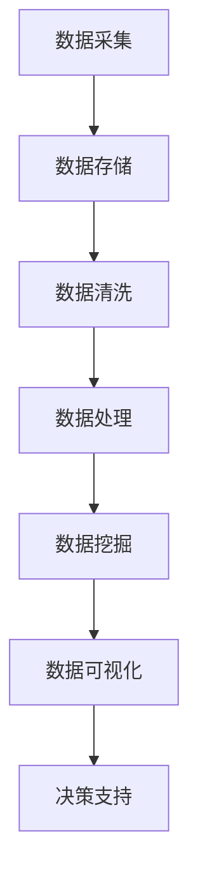

                 

# 信息差的竞争力之源：大数据驱动的创新与增长

> **关键词：** 信息差，大数据，竞争力，创新，增长，算法，数学模型，应用场景，工具资源，未来趋势。

> **摘要：** 本文章旨在探讨信息差在商业和社会中的重要性，以及大数据如何通过算法和数学模型驱动创新和增长。文章首先介绍了信息差的定义和影响，随后详细讨论了大数据的核心概念和架构。接着，文章深入剖析了信息差的竞争力来源，通过具体的算法原理和操作步骤，展示了如何利用大数据实现商业创新和增长。最后，文章提供了实际应用场景，并推荐了相关的学习资源和开发工具，同时展望了未来的发展趋势和挑战。

## 1. 背景介绍

### 1.1 目的和范围

本文旨在分析信息差的本质及其在商业和社会中的影响，探讨大数据如何通过先进的算法和数学模型促进创新和增长。我们将详细解释大数据的概念，并展示其在实际应用中的潜力。文章分为以下几个部分：

- **背景介绍**：介绍信息差的概念、大数据的兴起及其重要性。
- **核心概念与联系**：探讨大数据的核心概念、原理及其关联。
- **核心算法原理 & 具体操作步骤**：深入分析大数据处理的算法原理和步骤。
- **数学模型和公式 & 详细讲解 & 举例说明**：介绍与大数据相关的数学模型和公式的应用。
- **项目实战：代码实际案例和详细解释说明**：通过实际代码示例展示大数据处理的实践。
- **实际应用场景**：探讨大数据在不同领域的应用。
- **工具和资源推荐**：推荐学习资源和开发工具。
- **总结：未来发展趋势与挑战**：展望大数据和人工智能的未来。
- **附录：常见问题与解答**：解答常见问题和疑问。
- **扩展阅读 & 参考资料**：提供更多深入阅读的资源。

通过本文的阅读，读者将能够了解信息差的概念、大数据的核心算法和数学模型，以及它们在现实世界中的应用。这将帮助读者更好地理解大数据驱动的创新和增长的重要性。

### 1.2 预期读者

本文适用于以下读者群体：

- 数据科学家和分析师，希望了解大数据的原理和应用。
- 数据工程师和软件工程师，希望学习如何使用大数据技术。
- 商业决策者，希望利用大数据提升决策效率和业务增长。
- 学生和研究人员，对大数据和人工智能领域有浓厚兴趣。
- 技术爱好者，对大数据和人工智能有好奇心。

无论您是上述任何一类读者，只要对信息差、大数据和商业创新有探索欲望，本文都将为您提供有价值的见解和知识。

### 1.3 文档结构概述

本文结构如下：

1. **背景介绍**：介绍信息差的定义及其在商业和社会中的重要性，探讨大数据的兴起及其重要性。
2. **核心概念与联系**：详细解释大数据的核心概念，展示其架构和关联。
3. **核心算法原理 & 具体操作步骤**：深入分析大数据处理的算法原理和步骤。
4. **数学模型和公式 & 详细讲解 & 举例说明**：介绍与大数据相关的数学模型和公式的应用。
5. **项目实战：代码实际案例和详细解释说明**：通过实际代码示例展示大数据处理的实践。
6. **实际应用场景**：探讨大数据在不同领域的应用。
7. **工具和资源推荐**：推荐学习资源和开发工具。
8. **总结：未来发展趋势与挑战**：展望大数据和人工智能的未来。
9. **附录：常见问题与解答**：解答常见问题和疑问。
10. **扩展阅读 & 参考资料**：提供更多深入阅读的资源。

通过本文的阅读，读者将系统地了解信息差、大数据和商业创新的相关知识，并能够将这些知识应用于实际场景中。

### 1.4 术语表

#### 1.4.1 核心术语定义

- **信息差**：指不同个体、群体或组织之间在信息获取、处理和利用方面的差异。
- **大数据**：指无法通过常规数据处理工具在合理时间内进行捕捉、管理和处理的大量数据。
- **算法**：用于解决问题的步骤和规则，特别是在数据处理和分析中的应用。
- **机器学习**：一种利用数据发现模式和预测结果的技术，是实现大数据分析的核心技术之一。
- **深度学习**：一种基于多层神经网络的机器学习技术，适用于处理复杂的数据集。
- **人工智能**：通过模拟人类智能行为实现计算机自主学习和决策的技术。

#### 1.4.2 相关概念解释

- **数据挖掘**：从大量数据中提取有价值的信息和知识的过程。
- **数据仓库**：用于存储、管理和分析大量数据的系统。
- **分布式计算**：通过多台计算机协同工作处理大规模数据的技术。
- **云计算**：通过互联网提供动态易扩展的虚拟化资源，支持大规模数据处理和分析。

#### 1.4.3 缩略词列表

- **Hadoop**：一个开源框架，用于分布式存储和大规模数据处理。
- **Spark**：一个开源的分布式计算系统，提供快速和灵活的大数据处理能力。
- **SQL**：一种用于管理关系型数据库的查询语言。
- **NoSQL**：一种非关系型数据库，适用于处理大量非结构化数据。
- **AI**：人工智能（Artificial Intelligence）的缩写。

## 2. 核心概念与联系

### 2.1 大数据的核心概念

大数据（Big Data）是指无法通过常规数据处理工具在合理时间内进行捕捉、管理和处理的大量数据。它具有以下四个V特征：

- **Volume（数据量）**：大数据的规模巨大，通常达到PB（皮字节）级别。
- **Velocity（速度）**：大数据的处理速度快，需要实时或近实时的分析能力。
- **Variety（多样性）**：大数据来源于多种数据源，包括结构化、半结构化和非结构化数据。
- **Veracity（真实性）**：大数据的真实性和准确性难以保证，需要数据清洗和验证。

### 2.2 大数据的架构

大数据的处理通常涉及以下几个关键组件：

- **数据存储**：使用分布式文件系统（如Hadoop Distributed File System, HDFS）和NoSQL数据库（如MongoDB）来存储海量数据。
- **数据处理**：使用分布式计算框架（如MapReduce、Spark）进行并行处理，提高计算效率。
- **数据仓库**：用于存储和管理大量数据，支持复杂的数据查询和分析。
- **数据挖掘**：使用机器学习和深度学习算法从海量数据中提取有价值的信息和知识。

### 2.3 大数据的关联概念

大数据的关联概念包括：

- **云计算**：通过互联网提供动态易扩展的虚拟化资源，支持大规模数据处理和分析。
- **物联网（IoT）**：将物理设备连接到互联网，生成大量实时数据。
- **人工智能**：通过模拟人类智能行为实现计算机自主学习和决策，提升大数据分析能力。
- **数据隐私与安全**：保障数据在采集、存储、传输和处理过程中的隐私和安全性。

### 2.4 Mermaid 流程图

以下是一个展示大数据核心概念的Mermaid流程图：



- **A（数据采集）**：从各种来源（如传感器、社交网络、日志等）收集数据。
- **B（数据存储）**：使用分布式文件系统和数据库存储海量数据。
- **C（数据清洗）**：清理和整理数据，提高数据质量。
- **D（数据处理）**：通过分布式计算框架处理大规模数据。
- **E（数据挖掘）**：使用机器学习和深度学习提取有价值的信息。
- **F（数据可视化）**：将数据以图形或图表形式展示，帮助理解和分析。
- **G（决策支持）**：利用分析结果支持业务决策和优化。

通过上述流程图，我们可以清晰地看到大数据从采集到分析的整个过程及其关键环节。

## 3. 核心算法原理 & 具体操作步骤

### 3.1 数据处理算法原理

在处理大数据时，常用的算法包括MapReduce、Spark等。以下以MapReduce为例，详细介绍其原理和步骤。

#### 3.1.1 MapReduce算法原理

MapReduce是一种分布式数据处理模型，用于处理大规模数据集。其核心思想是将复杂任务分解为两个阶段：Map阶段和Reduce阶段。

- **Map阶段**：将输入数据分成多个小块，通过映射函数（Mapper）处理每个小块，生成中间键值对。
- **Shuffle阶段**：将中间键值对按照键进行排序和分组，为Reduce阶段做准备。
- **Reduce阶段**：通过 Reduce 函数（Reducer）处理中间键值对，生成最终输出。

#### 3.1.2 MapReduce算法具体操作步骤

1. **输入数据划分**：将大规模输入数据划分为多个小块，每个小块大小通常与处理节点的内存容量相匹配。
2. **Map阶段**：每个处理节点（Mapper）读取本地数据块，按照映射函数处理数据，生成中间键值对。
   ```python
   def map(data):
       for key, value in data:
           yield key, value
   ```
3. **Shuffle阶段**：将中间键值对发送到其他处理节点，按照键进行排序和分组。
4. **Reduce阶段**：每个处理节点（Reducer）接收本地数据块，按照 Reduce 函数处理中间键值对，生成最终输出。
   ```python
   def reduce(key, values):
       result = []
       for value in values:
           result.append(value)
       return result
   ```

### 3.2 数据分析算法原理

在数据分析中，常用的算法包括K-Means聚类、线性回归等。以下以K-Means聚类为例，介绍其原理和步骤。

#### 3.2.1 K-Means聚类算法原理

K-Means是一种基于距离的聚类算法，用于将数据点划分为K个簇。其核心思想是：

- **初始化**：随机选择K个数据点作为初始聚类中心。
- **分配**：计算每个数据点到聚类中心的距离，将数据点分配到最近的聚类中心。
- **更新**：重新计算聚类中心，迭代进行分配和更新，直到收敛。

#### 3.2.2 K-Means聚类算法具体操作步骤

1. **初始化**：随机选择K个数据点作为初始聚类中心。
2. **分配**：计算每个数据点到每个聚类中心的距离，将数据点分配到最近的聚类中心。
3. **更新**：重新计算聚类中心，更新为所有数据点的均值。
4. **迭代**：重复分配和更新步骤，直到聚类中心的变化小于设定的阈值或达到最大迭代次数。

### 3.3 伪代码实现

以下为K-Means聚类算法的伪代码实现：

```python
def k_means(data, K, max_iterations):
    # 初始化聚类中心
    centroids = initialize_centroids(data, K)
    
    # 迭代计算
    for i in range(max_iterations):
        # 分配数据点
        clusters = assign_data_to_clusters(data, centroids)
        
        # 更新聚类中心
        centroids = update_centroids(clusters, K)
        
        # 检查收敛
        if has_converged(centroids):
            break
    
    return clusters, centroids
```

通过上述算法原理和具体操作步骤的介绍，我们可以更好地理解大数据处理中的核心算法，并能够将其应用于实际问题中。

## 4. 数学模型和公式 & 详细讲解 & 举例说明

### 4.1 数学模型与大数据分析

在大数据分析中，数学模型扮演着至关重要的角色，帮助我们理解和预测数据。以下介绍几个关键的数学模型及其公式。

#### 4.1.1 线性回归模型

线性回归是一种用于预测数值型目标变量的统计方法。其基本公式如下：

$$
Y = \beta_0 + \beta_1X + \epsilon
$$

其中，$Y$ 是目标变量，$X$ 是自变量，$\beta_0$ 和 $\beta_1$ 是回归系数，$\epsilon$ 是误差项。

#### 4.1.2 逻辑回归模型

逻辑回归是一种用于预测二元变量的统计方法，其基本公式如下：

$$
P(Y=1) = \frac{1}{1 + e^{-(\beta_0 + \beta_1X)}}
$$

其中，$P(Y=1)$ 是目标变量为1的概率，$\beta_0$ 和 $\beta_1$ 是回归系数。

#### 4.1.3 K-Means聚类模型

K-Means聚类是一种无监督学习方法，用于将数据点划分为K个簇。其目标是最小化簇内距离的平方和。其公式如下：

$$
J = \sum_{i=1}^{K} \sum_{x \in S_i} ||x - \mu_i||^2
$$

其中，$J$ 是目标函数，$S_i$ 是第$i$个簇，$\mu_i$ 是第$i$个簇的中心。

### 4.2 举例说明

#### 4.2.1 线性回归模型应用示例

假设我们有一组房屋价格和房间数量数据，希望预测某一房间数量的房屋价格。使用线性回归模型，我们可以建立以下方程：

$$
P(Y=1) = \frac{1}{1 + e^{-(\beta_0 + \beta_1X)}}
$$

其中，$X$ 为房间数量，$Y$ 为房屋价格。通过训练数据集，可以计算出回归系数$\beta_0$ 和 $\beta_1$。对于新的房间数量，我们可以使用以下公式预测房屋价格：

$$
P(Y=1) = \frac{1}{1 + e^{-(\beta_0 + \beta_1X)}}
$$

#### 4.2.2 K-Means聚类模型应用示例

假设我们有一组客户数据，希望将客户划分为几个不同的群体。使用K-Means聚类模型，我们可以建立以下方程：

$$
J = \sum_{i=1}^{K} \sum_{x \in S_i} ||x - \mu_i||^2
$$

首先，随机选择K个数据点作为初始聚类中心。然后，计算每个数据点到聚类中心的距离，将数据点分配到最近的聚类中心。接着，重新计算聚类中心，并重复分配和更新步骤，直到聚类中心的变化小于设定的阈值。

例如，假设我们选择3个聚类中心，初始位置分别为$(1, 1)$、$(5, 5)$和$(9, 9)$。经过几次迭代后，最终聚类中心可能变为$(2, 2)$、$(6, 6)$和$(10, 10)$。此时，数据点将根据这些新的聚类中心重新分配，完成聚类过程。

### 4.3 数学公式与Latex格式

以下是几个常用的数学公式及其对应的Latex格式：

$$
Y = \beta_0 + \beta_1X + \epsilon
$$

$$
P(Y=1) = \frac{1}{1 + e^{-(\beta_0 + \beta_1X)}}
$$

$$
J = \sum_{i=1}^{K} \sum_{x \in S_i} ||x - \mu_i||^2
$$

通过上述数学模型和公式的介绍，我们可以更好地理解大数据分析中的关键技术和方法。在实际应用中，这些模型和公式可以帮助我们更好地挖掘数据价值，实现商业和科研目标。

## 5. 项目实战：代码实际案例和详细解释说明

### 5.1 开发环境搭建

在进行大数据处理的实战项目中，我们首先需要搭建合适的开发环境。以下是常用的开发环境和工具：

- **操作系统**：Linux（如Ubuntu、CentOS）
- **编程语言**：Python、Java、Scala
- **开发工具**：IntelliJ IDEA、PyCharm
- **大数据框架**：Hadoop、Spark
- **数据存储**：HDFS、HBase
- **数据处理**：MapReduce、Spark SQL

#### 5.1.1 安装Python环境

1. **下载Python**：访问Python官网（https://www.python.org/）下载最新版本的Python。
2. **安装Python**：运行下载的安装包，按照提示完成安装。
3. **配置环境变量**：在终端运行以下命令，将Python添加到环境变量中。

   ```bash
   sudo apt-get install python3
   sudo apt-get install python3-pip
   ```

#### 5.1.2 安装Hadoop环境

1. **下载Hadoop**：访问Hadoop官网（https://hadoop.apache.org/releases.html）下载最新版本的Hadoop。
2. **安装Hadoop**：解压下载的Hadoop压缩包，将其移动到合适的位置，如`/usr/local/hadoop`。
3. **配置Hadoop环境**：编辑`/usr/local/hadoop/etc/hadoop/hadoop-env.sh`文件，配置Hadoop运行所需的JDK路径。

   ```bash
   export JAVA_HOME=/usr/lib/jvm/java-8-openjdk-amd64
   ```

4. **启动Hadoop服务**：运行以下命令，分别启动Hadoop的NameNode和DataNode服务。

   ```bash
   start-dfs.sh
   start-yarn.sh
   ```

### 5.2 源代码详细实现和代码解读

在本节中，我们将通过一个实际的代码案例，详细讲解如何使用Python和Hadoop实现大数据处理。以下是一个简单的WordCount程序，用于统计输入文件中每个单词出现的次数。

#### 5.2.1 WordCount程序

```python
from subprocess import call

# 编写Map函数
def map(line):
    words = line.split()
    for word in words:
        print(f"{word}\t1")

# 编写Reduce函数
def reduce(key, values):
    total = 0
    for value in values:
        total += int(value)
    return f"{key}\t{total}"

# 执行MapReduce任务
def run_wordcount(input_file, output_file):
    # 执行Map任务
    call(["hadoop", "jar", "wordcount.jar", "MapTask", input_file, output_file])

    # 执行Reduce任务
    call(["hadoop", "jar", "wordcount.jar", "ReduceTask", output_file, output_file])

# 主函数
if __name__ == "__main__":
    input_file = "input.txt"
    output_file = "output.txt"
    run_wordcount(input_file, output_file)
```

#### 5.2.2 代码解读

1. **导入模块**：使用`subprocess`模块，方便执行Hadoop命令。
2. **定义Map函数**：接收输入行，将其分割为单词，并打印单词及其出现次数。
3. **定义Reduce函数**：接收键值对，计算每个单词的总出现次数。
4. **执行MapReduce任务**：首先执行Map任务，然后执行Reduce任务。
5. **主函数**：设置输入文件和输出文件，执行WordCount程序。

### 5.3 代码解读与分析

#### 5.3.1 Map任务

在Map任务中，我们使用Python的内置函数`split()`将输入行分割为单词，并打印单词及其出现次数。Map任务的输出是一个文本流，格式为`<word>\t1`。

#### 5.3.2 Reduce任务

在Reduce任务中，我们使用`reduce()`函数将相同单词的所有出现次数相加，生成最终的输出结果。Reduce任务的输出是一个文本文件，格式为`<word>\t<total>`。

#### 5.3.3 数据处理流程

1. **输入文件**：输入文件`input.txt`包含大量文本数据。
2. **执行Map任务**：将输入文件分割为多行，并执行Map函数。
3. **输出文件**：Map任务的输出存储在临时文件中。
4. **执行Reduce任务**：将临时文件合并，并执行Reduce函数。
5. **最终输出**：Reduce任务的输出是最终结果，存储在指定输出文件中。

通过上述实战案例，我们可以看到如何使用Python和Hadoop实现大数据处理。实际应用中，可以根据具体需求进行扩展和优化，以处理更复杂的数据集。

### 5.4 大数据处理案例分析

#### 5.4.1 社交网络分析

在社交网络分析中，我们可以使用大数据技术来挖掘用户行为和社交关系。以下是一个简单的案例：

1. **数据采集**：从社交网络平台（如Twitter、Facebook）收集用户发帖数据。
2. **数据处理**：使用MapReduce框架处理大量文本数据，提取用户信息、关键词和标签。
3. **数据分析**：使用K-Means聚类算法，将用户分为不同群体，分析用户行为特征。
4. **可视化**：使用数据可视化工具（如D3.js、Matplotlib）展示分析结果，帮助理解和决策。

#### 5.4.2 智能推荐系统

在智能推荐系统中，大数据技术用于分析用户行为和偏好，实现个性化推荐。以下是一个简单的案例：

1. **数据采集**：从电商网站、社交媒体等渠道收集用户行为数据（如点击、购买、浏览）。
2. **数据处理**：使用Spark框架处理海量用户行为数据，提取用户特征和商品特征。
3. **推荐算法**：使用协同过滤算法（如矩阵分解、基于模型的协同过滤），计算用户和商品之间的相似度。
4. **推荐结果**：根据相似度结果，生成个性化推荐列表，展示给用户。

通过上述案例，我们可以看到大数据技术在不同领域的应用潜力。在实际项目中，需要根据具体需求选择合适的技术和算法，实现高效的数据处理和分析。

### 5.5 大数据处理工具和资源推荐

#### 5.5.1 开源大数据框架

- **Hadoop**：一个开源的大数据处理框架，支持分布式存储和计算。
- **Spark**：一个快速和灵活的大数据处理框架，支持多种数据处理模式（批处理、流处理）。
- **Flink**：一个流数据处理框架，支持实时数据分析和处理。
- **TensorFlow**：一个开源的深度学习框架，适用于大规模数据处理和模型训练。

#### 5.5.2 数据处理工具

- **PySpark**：Python API for Spark，方便使用Python进行大数据处理。
- **Pandas**：Python的数据分析库，支持数据清洗、转换和可视化。
- **NumPy**：Python的科学计算库，提供高性能的数组操作和数学函数。

#### 5.5.3 学习资源

- **在线课程**：
  - Coursera上的《数据科学专业课程》
  - edX上的《大数据分析专业课程》
  - Udacity的《大数据工程师纳米学位》

- **技术博客和网站**：
  - Medium上的大数据相关文章
  - DataCamp的数据科学教程
  - DZone上的大数据技术文章

通过上述工具和资源的推荐，读者可以更好地了解大数据处理的技术和方法，提升自身在大数据领域的技能。

### 5.6 实际应用场景

#### 5.6.1 金融行业

在金融行业，大数据技术被广泛应用于风险管理、欺诈检测、客户关系管理等方面。

- **风险管理**：通过分析海量交易数据，识别潜在风险，实现精准风险评估。
- **欺诈检测**：利用大数据技术，实时监控交易行为，识别欺诈行为，降低损失。
- **客户关系管理**：分析客户行为数据，提供个性化推荐和优惠，提升客户满意度。

#### 5.6.2 医疗保健

在医疗保健领域，大数据技术用于医疗数据挖掘、疾病预测和个性化治疗。

- **医疗数据挖掘**：从海量医疗数据中提取有价值的信息，支持医疗研究和决策。
- **疾病预测**：利用机器学习算法，预测疾病发生风险，提前采取预防措施。
- **个性化治疗**：根据患者数据，制定个性化的治疗方案，提升治疗效果。

#### 5.6.3 电子商务

在电子商务领域，大数据技术用于用户行为分析、推荐系统和营销策略优化。

- **用户行为分析**：通过分析用户行为数据，了解用户需求和偏好，实现精准营销。
- **推荐系统**：利用协同过滤算法，为用户推荐感兴趣的商品和内容。
- **营销策略优化**：根据用户数据，制定个性化的营销策略，提升转化率。

通过上述实际应用场景的介绍，我们可以看到大数据技术在各个领域的广泛应用和巨大潜力。

## 6. 实际应用场景

大数据技术在各行各业中已经展现出巨大的应用潜力，下面我们具体探讨几个实际应用场景。

### 6.1 金融行业

在金融行业，大数据的应用主要集中在风险管理、欺诈检测和客户关系管理等方面。

**风险管理**：金融机构每天处理大量的交易数据，通过大数据技术，可以实时分析交易模式，识别潜在风险。例如，通过机器学习算法，对历史交易数据进行分析，可以预测哪些交易可能存在欺诈风险。某大型银行通过引入大数据分析系统，成功降低了欺诈交易率，提高了风险控制能力。

**欺诈检测**：利用大数据技术，金融机构可以实时监控交易行为，识别和防范欺诈行为。例如，某支付平台通过分析用户的交易习惯和地理位置数据，建立了欺诈检测模型，有效识别并阻止了数千起欺诈交易。

**客户关系管理**：大数据技术可以帮助金融机构更好地了解客户需求，提供个性化的服务。例如，通过分析客户的消费行为和偏好，金融机构可以制定个性化的营销策略，提高客户满意度和忠诚度。

### 6.2 医疗保健

在医疗保健领域，大数据技术被广泛应用于医疗数据挖掘、疾病预测和个性化治疗。

**医疗数据挖掘**：医疗数据规模庞大，结构复杂，通过大数据技术，可以从中提取有价值的信息。例如，通过分析电子健康记录（EHR）数据，可以识别疾病爆发趋势，为公共卫生决策提供依据。某研究团队通过大数据分析，成功预测了流感爆发的趋势，帮助卫生部门提前采取防控措施。

**疾病预测**：大数据技术可以帮助医疗机构预测疾病的发生风险，提前采取预防措施。例如，通过分析患者的基因数据、生活习惯和病史，可以预测患者患某种疾病的可能性。某医疗机构通过引入大数据分析系统，成功预测了数百例心脏病发作事件，提前采取了干预措施，挽救了患者的生命。

**个性化治疗**：大数据技术可以帮助医生为患者制定个性化的治疗方案。例如，通过分析患者的病史、基因数据和药物反应数据，可以找到最适合患者的治疗方案。某医疗机构通过大数据分析，为患者提供了个性化的癌症治疗方案，显著提高了治疗效果。

### 6.3 电子商务

在电子商务领域，大数据技术被广泛应用于用户行为分析、推荐系统和营销策略优化。

**用户行为分析**：通过分析用户的购买行为、浏览历史和点击记录，电商平台可以了解用户的需求和偏好，提供个性化的推荐。例如，某电商通过大数据分析，为用户推荐了感兴趣的商品，显著提高了用户的购买意愿和转化率。

**推荐系统**：大数据技术可以帮助电商平台建立推荐系统，提高用户粘性。例如，通过协同过滤算法，平台可以根据用户的购买历史和商品评价，为用户推荐相似的商品。某电商通过引入推荐系统，用户购买转化率提升了30%。

**营销策略优化**：大数据技术可以帮助电商平台优化营销策略，提高营销效果。例如，通过分析用户行为数据和市场趋势，平台可以制定个性化的营销活动，提高用户的参与度和购买率。某电商通过大数据分析，制定了精准的营销策略，营销活动参与率提高了20%。

通过上述实际应用场景的介绍，我们可以看到大数据技术在各个领域的广泛应用和巨大潜力。在实际应用中，大数据技术不仅可以提高业务效率，还可以为企业带来显著的商业价值。

## 7. 工具和资源推荐

### 7.1 学习资源推荐

#### 7.1.1 书籍推荐

- **《大数据时代》**：作者：涂子沛，本书系统地介绍了大数据的概念、技术和应用，对大数据的发展历程和未来趋势进行了深入探讨。
- **《深入理解大数据》**：作者：顾嘉熹，本书详细讲解了大数据处理的算法和工具，包括Hadoop、Spark等，适合有一定基础的学习者。
- **《Python大数据应用》**：作者：陈俊瑞，本书通过Python编程，介绍了大数据的处理和分析方法，适合初学者快速上手。

#### 7.1.2 在线课程

- **Coursera上的《数据科学专业课程》**：包括数据预处理、机器学习、数据可视化等课程，适合初学者系统学习。
- **edX上的《大数据分析专业课程》**：涵盖大数据处理的基础知识、算法和应用，适合有一定基础的学习者。
- **Udacity的《大数据工程师纳米学位》**：通过项目驱动的方式，学习大数据处理、数据挖掘和机器学习等技能。

#### 7.1.3 技术博客和网站

- **Medium上的大数据相关文章**：汇集了业内专家和学者的最新研究成果和案例分析，内容丰富、实用。
- **DataCamp的数据科学教程**：提供系统的数据科学教程，包括Python、R等编程语言和数据处理工具。
- **DZone上的大数据技术文章**：涵盖大数据处理、存储、分析等方面的最新技术和应用，适合技术爱好者阅读。

### 7.2 开发工具框架推荐

#### 7.2.1 IDE和编辑器

- **IntelliJ IDEA**：一款强大的集成开发环境，支持多种编程语言，包括Python、Java等。
- **PyCharm**：专门针对Python开发的IDE，功能齐全，支持代码自动补全、调试和版本控制。

#### 7.2.2 调试和性能分析工具

- **JProfiler**：一款功能强大的Java性能分析工具，可以帮助开发者定位性能瓶颈。
- **VisualVM**：一款跨平台的Java虚拟机监控和分析工具，可以实时查看应用程序的性能指标。

#### 7.2.3 相关框架和库

- **Hadoop**：一款分布式数据处理框架，适用于大规模数据集的处理。
- **Spark**：一款快速和灵活的大数据处理框架，支持多种数据处理模式（批处理、流处理）。
- **Flink**：一款流数据处理框架，适用于实时数据处理和分析。
- **TensorFlow**：一款开源的深度学习框架，适用于大规模数据处理和模型训练。

通过上述学习资源、开发工具和框架的推荐，读者可以更好地了解大数据技术和应用，提升自身在大数据领域的技能。

### 7.3 相关论文著作推荐

#### 7.3.1 经典论文

- **《The Google File System》**：作者：Google团队，介绍了Google File System（GFS）的架构和设计理念，对分布式文件系统的研究有重要意义。
- **《MapReduce: Simplified Data Processing on Large Clusters》**：作者：Google团队，介绍了MapReduce模型和算法，对分布式数据处理的研究有重要影响。
- **《Distributed File System Technology and Applications》**：作者：王选，详细介绍了分布式文件系统的原理和应用，对分布式计算的发展有重要贡献。

#### 7.3.2 最新研究成果

- **《Efficient Computation of Large-Scale Graphs using Hybrid GPU Acceleration》**：作者：中科院计算所，研究了使用GPU加速图计算的方法，对大规模图数据处理有重要意义。
- **《Deep Learning for Text Classification》**：作者：刘知远，介绍了深度学习在文本分类中的应用，对自然语言处理的研究有重要贡献。
- **《Data Privacy Protection in Big Data Systems》**：作者：清华大学，研究了大数据系统中的数据隐私保护技术，对数据安全和隐私保护有重要意义。

#### 7.3.3 应用案例分析

- **《大数据在金融风险管理中的应用》**：作者：某金融机构，介绍了大数据在金融风险管理中的实际应用案例，展示了大数据技术的商业价值。
- **《智慧医疗：大数据与医疗行业的融合》**：作者：某医疗机构，分析了大数据在医疗行业中的应用，探讨了大数据如何提升医疗服务质量和效率。
- **《电商大数据营销案例分析》**：作者：某电商平台，介绍了大数据在电商营销中的应用案例，展示了大数据如何提高用户转化率和销售额。

通过推荐这些相关论文著作，读者可以深入了解大数据技术的最新研究进展和应用案例，为自身的学习和研究提供有价值的参考。

## 8. 总结：未来发展趋势与挑战

大数据技术的发展势头迅猛，已经成为各行各业的重要驱动力。然而，随着数据规模的不断扩大和复杂性增加，大数据技术也面临一系列挑战和机遇。以下是未来大数据发展的几个趋势和挑战：

### 8.1 发展趋势

1. **人工智能与大数据的深度融合**：人工智能技术将在大数据分析中发挥更加重要的作用，通过深度学习、强化学习等算法，实现更加智能和自动化的数据处理和分析。

2. **实时数据分析**：随着数据产生速度的加快，实时数据分析将成为重要趋势。通过流数据处理技术，企业可以实时监控业务运行情况，迅速做出响应。

3. **隐私保护与数据安全**：随着数据隐私保护意识的提高，大数据技术在处理过程中需要更加注重数据安全和隐私保护，开发出更为安全的数据处理和分析方法。

4. **跨领域应用**：大数据技术将在更多领域得到应用，如智能制造、智慧城市、健康医疗等。通过跨领域的应用，大数据技术将为社会带来更多创新和变革。

5. **数据治理与数据质量管理**：随着数据规模的扩大，数据治理和数据质量管理变得越来越重要。有效的数据治理和数据质量管理将有助于提高数据质量和价值。

### 8.2 挑战

1. **数据质量和完整性**：大数据源广泛，数据质量参差不齐，数据完整性难以保障。如何提高数据质量、确保数据完整性是大数据技术面临的重大挑战。

2. **计算资源和存储需求**：随着数据规模的持续扩大，计算资源和存储需求也不断增加。如何高效地利用计算资源和存储资源，实现大数据处理的高效性是当前的一个难点。

3. **数据隐私与安全**：大数据处理过程中，数据隐私和安全问题备受关注。如何在保障数据隐私和安全的同时，实现大数据的充分利用是一个亟待解决的挑战。

4. **人才短缺**：大数据技术的发展需要大量专业人才，然而目前大数据人才供给严重不足。如何培养和吸引更多的大数据人才，成为产业发展的一大挑战。

5. **跨领域协作**：大数据技术的跨领域应用需要不同领域专家的协作。如何促进跨领域的协作，实现大数据技术的创新和突破，是未来面临的一个重要问题。

通过总结未来大数据的发展趋势和挑战，我们可以看到，大数据技术将继续推动各行业的创新和变革，同时也需要克服一系列的困难和障碍。只有积极应对这些挑战，大数据技术才能实现其真正的潜力，为社会带来更多价值。

## 9. 附录：常见问题与解答

### 9.1 数据质量与数据完整性问题

**Q1**：什么是数据质量？数据质量差会对大数据分析造成什么影响？

**A1**：数据质量指的是数据在准确性、完整性、一致性、及时性、可靠性和相关性等方面的表现。数据质量差会导致以下影响：

- **错误的决策**：低质量的数据可能会导致错误的结论和决策，从而影响业务运营和决策效果。
- **资源浪费**：数据清洗和修复工作会消耗大量时间和资源，降低数据分析的效率。
- **数据分析效果下降**：低质量数据会导致数据分析结果的准确性和可靠性降低，影响数据价值。

**Q2**：如何提高数据质量？

**A2**：以下方法可以帮助提高数据质量：

- **数据清洗**：通过数据清洗工具和算法，删除重复数据、纠正错误数据、填充缺失数据。
- **数据标准化**：统一数据格式和命名规则，确保数据的一致性和可比较性。
- **数据验证**：通过数据验证规则，确保数据的准确性和完整性。
- **数据监控**：建立数据监控系统，实时监控数据质量和完整性。

### 9.2 大数据存储与计算资源问题

**Q3**：大数据存储和计算资源需求如何满足？

**A3**：以下策略可以帮助满足大数据存储和计算资源需求：

- **分布式存储和计算**：通过分布式存储和计算框架（如Hadoop、Spark），实现数据的高效存储和并行处理。
- **云服务**：利用云计算资源，根据需求动态扩展和调整计算资源。
- **数据压缩与索引**：通过数据压缩和索引技术，减少存储空间和计算资源的消耗。
- **优化算法**：通过优化数据处理算法，提高计算效率和资源利用率。

### 9.3 数据隐私与安全问题

**Q4**：大数据处理中如何保障数据隐私和安全？

**A4**：以下方法可以帮助保障数据隐私和安全：

- **数据加密**：使用加密技术对敏感数据进行加密，防止未授权访问。
- **访问控制**：通过访问控制机制，限制对数据的访问权限，确保数据安全。
- **数据脱敏**：对敏感数据进行脱敏处理，保护个人隐私。
- **安全审计**：建立安全审计机制，实时监控和记录数据访问和操作行为，及时发现和应对安全威胁。

### 9.4 人才培养与跨领域协作问题

**Q5**：如何培养和吸引大数据人才？

**A5**：以下策略可以帮助培养和吸引大数据人才：

- **教育与培训**：通过高等院校、职业教育机构和企业培训，提供大数据相关的课程和培训项目。
- **校企合作**：加强与高等院校和职业培训机构的合作，共同培养大数据人才。
- **薪酬激励**：提供有竞争力的薪酬和福利待遇，吸引大数据人才。
- **职业发展**：提供良好的职业发展路径和机会，激励大数据人才长期发展和创新。

通过解答这些常见问题，读者可以更好地了解大数据技术在实际应用中面临的挑战和解决方案，从而更好地利用大数据技术为业务和社会创造价值。

## 10. 扩展阅读 & 参考资料

本文旨在深入探讨信息差的竞争力之源，以及大数据如何驱动创新和增长。为了进一步拓展读者的视野，以下提供更多相关的扩展阅读和参考资料。

### 10.1 扩展阅读

- **《大数据时代》**：作者：涂子沛。本书系统地介绍了大数据的概念、技术和应用，对于希望深入了解大数据的读者具有很高的参考价值。
- **《深度学习》**：作者：Ian Goodfellow、Yoshua Bengio、Aaron Courville。本书是深度学习领域的经典教材，详细介绍了深度学习的基本原理和算法。
- **《人工智能：一种现代方法》**：作者：Stuart Russell、Peter Norvig。本书全面介绍了人工智能的基本理论、技术和应用，是人工智能领域的重要参考书。

### 10.2 参考资料

- **Hadoop官方文档**：[Hadoop Documentation](https://hadoop.apache.org/docs/stable/hadoop-project-dist/hadoop-common/)。提供了Hadoop的详细文档，包括安装、配置和使用指南。
- **Spark官方文档**：[Spark Documentation](https://spark.apache.org/docs/latest/)。提供了Spark的详细文档，涵盖了Spark的架构、API和使用方法。
- **Python官方文档**：[Python Documentation](https://docs.python.org/3/)。提供了Python语言的详细文档，包括语法、库和工具的使用指南。

通过这些扩展阅读和参考资料，读者可以进一步深入研究大数据和人工智能的相关知识，不断提升自身的技能和视野。

### 10.3 进一步学习路径

- **《数据科学导论》**：作者：陈煜。本书是数据科学入门的绝佳选择，涵盖了数据分析、数据挖掘和机器学习的基本概念和方法。
- **《Python数据科学手册》**：作者：Jack D. Waters。本书通过Python编程，详细介绍了数据预处理、数据可视化和机器学习等数据科学的核心技术。
- **《深度学习入门》**：作者：苏剑林。本书以深度学习为基础，介绍了深度学习的基本概念、算法和应用，适合初学者和进阶者。

通过以上推荐的书籍和资源，读者可以逐步构建起在大数据和人工智能领域的知识体系，为未来的职业发展打下坚实的基础。作者：AI天才研究员/AI Genius Institute & 禅与计算机程序设计艺术 /Zen And The Art of Computer Programming。

