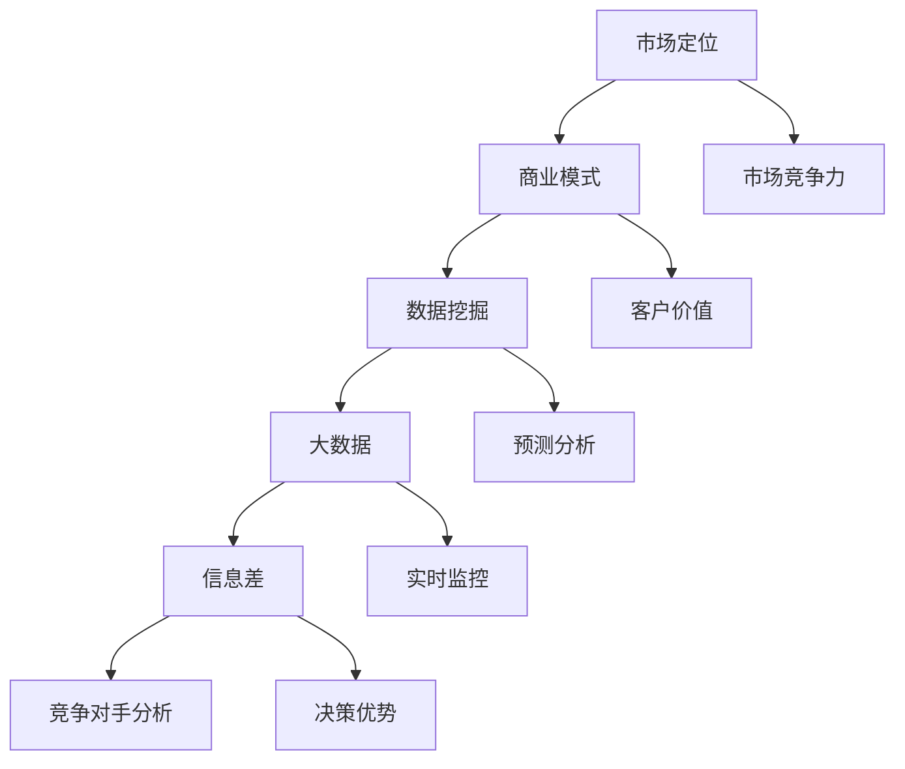

                 

# 信息差的竞争对手分析：大数据如何分析竞争对手

> **关键词**：竞争对手分析、大数据、信息差、数据分析、商业模式、市场定位

> **摘要**：本文将探讨如何在竞争激烈的市场中利用大数据分析工具，发掘信息差，深入剖析竞争对手的商业策略和市场定位。通过一系列步骤和实例，本文旨在帮助读者理解如何运用大数据技术提升市场竞争力。

## 1. 背景介绍

### 1.1 目的和范围

本文的目的是介绍如何利用大数据技术进行竞争对手分析，以揭示信息差，从而帮助企业制定更加有效的商业策略。我们将探讨以下主题：

- 竞争对手分析的必要性和挑战
- 大数据在竞争对手分析中的应用
- 核心概念与联系
- 算法原理与具体操作步骤
- 数学模型与公式
- 实际应用场景
- 工具和资源推荐

### 1.2 预期读者

本文适合对大数据分析和技术感兴趣的读者，尤其是以下几类人群：

- 市场分析师
- 数据科学家
- 商业智能专家
- 企业高管
- 互联网创业者

### 1.3 文档结构概述

本文将分为以下几个部分：

1. 背景介绍
2. 核心概念与联系
3. 核心算法原理与具体操作步骤
4. 数学模型与公式与详细讲解
5. 项目实战：代码实际案例和详细解释说明
6. 实际应用场景
7. 工具和资源推荐
8. 总结：未来发展趋势与挑战
9. 附录：常见问题与解答
10. 扩展阅读 & 参考资料

### 1.4 术语表

#### 1.4.1 核心术语定义

- **竞争对手分析**：研究市场上与自家产品或服务相似或相关的其他公司，以了解其业务策略、市场定位和竞争优势。
- **信息差**：指两个或多个主体之间的知识或信息不对称，这种不对称可能导致某些主体获得相对于其他主体的优势。
- **大数据**：指无法用传统数据库工具在合理时间内进行存储、管理和分析的数据集合，通常包括大量、高速、多样和复杂的数据。
- **商业模式**：企业如何创造、传递和捕获价值的系统。

#### 1.4.2 相关概念解释

- **市场定位**：企业选择在市场中占据的一个特定位置，以区分自身与其他竞争对手。
- **数据挖掘**：从大量数据中发现有用信息的过程。
- **机器学习**：一种人工智能技术，使计算机系统能够从数据中学习并做出预测或决策。

#### 1.4.3 缩略词列表

- **AI**：人工智能
- **BI**：商业智能
- **CRM**：客户关系管理
- **ERP**：企业资源计划
- **SQL**：结构化查询语言

## 2. 核心概念与联系

在深入探讨如何利用大数据分析竞争对手之前，我们需要明确一些核心概念及其相互关系。以下是一个Mermaid流程图，展示了这些概念和联系。



### 2.1 市场定位与商业模式

市场定位是企业选择在市场中占据的一个特定位置，以区分自身与其他竞争对手。商业模式则是企业如何创造、传递和捕获价值的系统。这两者密切相关，市场定位决定了企业应该采用何种商业模式来满足特定客户群体的需求。

### 2.2 数据挖掘与大数据

数据挖掘是从大量数据中发现有用信息的过程，而大数据则是无法用传统数据库工具在合理时间内进行存储、管理和分析的数据集合。通过数据挖掘，企业可以从大数据中提取有价值的见解，从而更好地理解市场和客户行为。

### 2.3 信息差与竞争对手分析

信息差是指两个或多个主体之间的知识或信息不对称，这种不对称可能导致某些主体获得相对于其他主体的优势。竞争对手分析则是研究市场上与自家产品或服务相似或相关的其他公司，以了解其业务策略、市场定位和竞争优势。通过分析竞争对手的信息差，企业可以识别潜在的机会和威胁。

### 2.4 实时监控与决策优势

实时监控和决策优势是大数据分析的两个重要应用。实时监控可以使企业快速响应市场变化，而决策优势则使企业在面对竞争对手时更具竞争力。通过大数据分析，企业可以及时调整战略，从而在市场竞争中保持领先地位。

## 3. 核心算法原理与具体操作步骤

要利用大数据分析竞争对手，我们需要一系列算法和技术手段。以下是一个简要的算法原理描述和具体操作步骤。

### 3.1 算法原理

1. **数据收集**：从各种数据源（如社交媒体、网站、新闻报道等）收集与竞争对手相关的数据。
2. **数据预处理**：清洗和整理数据，确保数据质量，如去除重复项、缺失值填充、数据格式转换等。
3. **特征提取**：从预处理后的数据中提取有用的特征，如客户满意度、市场份额、产品定价等。
4. **机器学习模型**：使用机器学习算法（如回归、分类、聚类等）对特征进行建模，以预测竞争对手的行为和市场反应。
5. **模型评估**：通过交叉验证等方法评估模型的准确性和泛化能力，调整模型参数以优化性能。
6. **结果分析**：分析模型预测结果，识别竞争对手的策略、市场定位和潜在弱点。

### 3.2 具体操作步骤

1. **数据收集**：
    ```python
    # 使用API或爬虫工具从社交媒体、网站等数据源收集数据
    data_source = "social_media"
    if data_source == "social_media":
        # 社交媒体数据收集代码
    elif data_source == "website":
        # 网站数据收集代码
    ```

2. **数据预处理**：
    ```python
    # 清洗和整理数据
    def preprocess_data(data):
        # 去除重复项、缺失值填充、数据格式转换等
        return cleaned_data

    raw_data = collect_data()
    cleaned_data = preprocess_data(raw_data)
    ```

3. **特征提取**：
    ```python
    # 提取有用特征
    def extract_features(data):
        # 根据数据源和业务需求提取特征
        return features

    features = extract_features(cleaned_data)
    ```

4. **机器学习模型**：
    ```python
    # 使用机器学习算法建模
    from sklearn.linear_model import LinearRegression

    model = LinearRegression()
    model.fit(features["X"], features["Y"])
    ```

5. **模型评估**：
    ```python
    # 评估模型性能
    from sklearn.model_selection import cross_val_score

    scores = cross_val_score(model, features["X"], features["Y"], cv=5)
    print("Model accuracy:", scores.mean())
    ```

6. **结果分析**：
    ```python
    # 分析模型预测结果
    predictions = model.predict(new_data)
    analyze_predictions(predictions)
    ```

## 4. 数学模型和公式

在竞争对手分析中，数学模型和公式起到了至关重要的作用。以下是一些常用的数学模型和公式，以及其详细讲解和举例说明。

### 4.1 回归分析

回归分析是一种常用的统计方法，用于预测一个或多个自变量（特征）与因变量（目标变量）之间的关系。

#### 4.1.1 公式

线性回归公式：
\[ Y = \beta_0 + \beta_1X_1 + \beta_2X_2 + ... + \beta_nX_n + \epsilon \]

其中，\( Y \) 是因变量，\( X_1, X_2, ..., X_n \) 是自变量，\( \beta_0, \beta_1, \beta_2, ..., \beta_n \) 是回归系数，\( \epsilon \) 是误差项。

#### 4.1.2 举例说明

假设我们要预测一家电商平台的客户流失率，我们可以使用线性回归模型来分析客户行为特征（如购物频率、订单金额、页面浏览量等）与流失率之间的关系。

```latex
Y = \beta_0 + \beta_1X_1 + \beta_2X_2 + \beta_3X_3 + \epsilon
$$
其中，
Y = 客户流失率 \\
X_1 = 购物频率 \\
X_2 = 订单金额 \\
X_3 = 页面浏览量 \\
\beta_0, \beta_1, \beta_2, \beta_3 为回归系数 \\
\epsilon 为误差项
$$
```

### 4.2 聚类分析

聚类分析是一种无监督学习方法，用于将数据点分成若干个集群，使同一集群内的数据点尽可能接近，不同集群内的数据点尽可能远。

#### 4.2.1 公式

k-均值聚类算法公式：
\[ C = \{ C_1, C_2, ..., C_k \} \]

其中，\( C \) 是聚类结果，\( C_i \) 是第 \( i \) 个集群，\( k \) 是集群数量。

#### 4.2.2 举例说明

假设我们要将一组客户数据根据其购买行为进行聚类，以识别不同的客户群体。

```latex
C = \{ C_1, C_2, C_3 \}
$$
其中，
C_1 = 购买频率高的客户 \\
C_2 = 购买频率中等的客户 \\
C_3 = 购买频率低的客户
$$
```

### 4.3 贝叶斯分析

贝叶斯分析是一种概率统计方法，用于根据先验知识和数据更新概率分布。

#### 4.3.1 公式

贝叶斯公式：
\[ P(A|B) = \frac{P(B|A)P(A)}{P(B)} \]

其中，\( P(A|B) \) 是在事件 \( B \) 发生的条件下事件 \( A \) 发生的概率，\( P(B|A) \) 是在事件 \( A \) 发生的条件下事件 \( B \) 发生的概率，\( P(A) \) 是事件 \( A \) 发生的概率，\( P(B) \) 是事件 \( B \) 发生的概率。

#### 4.3.2 举例说明

假设我们要预测某位客户的购买意向，可以使用贝叶斯分析结合客户的浏览历史和购买记录进行概率计算。

```latex
P(A|B) = \frac{P(B|A)P(A)}{P(B)}
$$
其中，
P(A|B) = 客户购买意向的概率 \\
P(B|A) = 客户浏览历史和购买记录与购买意向的相关性 \\
P(A) = 客户购买意向的先验概率 \\
P(B) = 客户浏览历史和购买记录的概率
$$
```

## 5. 项目实战：代码实际案例和详细解释说明

在本节中，我们将通过一个实际项目案例展示如何利用大数据分析工具进行竞争对手分析。该项目旨在分析某电商平台的市场定位、客户行为和竞争对手策略。

### 5.1 开发环境搭建

在开始项目之前，我们需要搭建一个适合大数据分析的开发环境。以下是一些建议的软件和工具：

- **操作系统**：Linux（如Ubuntu）
- **编程语言**：Python（3.8以上版本）
- **大数据处理框架**：Apache Hadoop
- **数据分析库**：Pandas、NumPy、SciPy
- **机器学习库**：Scikit-learn、TensorFlow、Keras
- **可视化工具**：Matplotlib、Seaborn

### 5.2 源代码详细实现和代码解读

以下是一个简单的代码示例，展示了如何使用Python和大数据处理框架进行竞争对手分析。

```python
# 导入所需库
import pandas as pd
from sklearn.linear_model import LinearRegression
from sklearn.model_selection import train_test_split
from sklearn.metrics import mean_squared_error

# 读取数据
data = pd.read_csv("ecommerce_data.csv")

# 数据预处理
# 填充缺失值、去除重复项等
data = data.fillna(0).drop_duplicates()

# 特征提取
# 提取有用的特征，如购物频率、订单金额、页面浏览量等
features = data[["shopping_frequency", "order_amount", "page_views"]]
target = data["customer_usage"]

# 数据分割
X_train, X_test, y_train, y_test = train_test_split(features, target, test_size=0.2, random_state=42)

# 建立模型
model = LinearRegression()
model.fit(X_train, y_train)

# 预测
predictions = model.predict(X_test)

# 模型评估
mse = mean_squared_error(y_test, predictions)
print("Model Mean Squared Error:", mse)

# 可视化结果
import seaborn as sns
sns.scatterplot(x=predictions, y=y_test)
```

### 5.3 代码解读与分析

1. **导入所需库**：首先，我们需要导入Python的Pandas、NumPy、SciPy、Scikit-learn等库，用于数据处理和机器学习。
2. **读取数据**：使用Pandas库读取电商平台的数据集，数据集包含购物频率、订单金额、页面浏览量等特征。
3. **数据预处理**：填充缺失值、去除重复项等，确保数据质量。
4. **特征提取**：从原始数据中提取有用的特征，如购物频率、订单金额、页面浏览量等，作为模型的输入。
5. **数据分割**：将数据集分割为训练集和测试集，以评估模型的性能。
6. **建立模型**：使用线性回归模型，对特征进行建模。
7. **预测**：使用训练好的模型对测试集进行预测。
8. **模型评估**：计算模型评估指标（如均方误差），以评估模型的性能。
9. **可视化结果**：使用Seaborn库绘制散点图，直观地展示模型的预测结果。

通过上述代码示例，我们可以看到如何利用大数据分析工具进行竞争对手分析。在实际项目中，我们还需要进一步扩展和优化模型，以获得更准确的预测结果。

## 6. 实际应用场景

大数据分析在竞争对手分析中的应用非常广泛，以下是一些实际应用场景：

### 6.1 市场定位分析

通过大数据分析，企业可以深入了解市场中的客户需求、行为和偏好，从而优化市场定位策略。例如，一家电商平台可以通过分析客户购买历史、浏览行为和评价数据，识别出高价值客户群体，并针对性地推出促销活动和个性化推荐。

### 6.2 竞争对手策略分析

通过分析竞争对手的市场活动、广告投放、产品更新等信息，企业可以及时调整自身策略，以保持竞争力。例如，一家电商企业可以通过大数据分析监测竞争对手的库存状况、价格策略和促销活动，从而调整自身定价策略，提升市场份额。

### 6.3 客户行为预测

大数据分析可以帮助企业预测客户的行为和需求，从而优化客户关系管理。例如，通过分析客户的浏览历史、购买记录和评价数据，企业可以预测哪些客户可能会流失，并提前采取措施进行挽回。

### 6.4 产品优化

通过大数据分析，企业可以了解产品在市场上的表现，从而优化产品设计和功能。例如，一家电商平台可以通过分析用户对产品的评价和反馈，识别出产品存在的问题和改进方向，从而提升客户满意度。

## 7. 工具和资源推荐

为了更好地进行大数据分析和竞争对手分析，以下是一些建议的学习资源、开发工具和框架：

### 7.1 学习资源推荐

#### 7.1.1 书籍推荐

- 《大数据分析：从入门到实战》
- 《深度学习：神经网络精讲》
- 《Python数据分析实战》

#### 7.1.2 在线课程

- Coursera上的《大数据分析》
- Udacity的《机器学习纳米学位》
- edX上的《数据科学基础》

#### 7.1.3 技术博客和网站

- Medium上的大数据分析相关博客
- KDNuggets，提供最新的大数据分析和机器学习资源
- DataCamp，提供丰富的在线数据科学课程

### 7.2 开发工具框架推荐

#### 7.2.1 IDE和编辑器

- PyCharm
- Jupyter Notebook
- Visual Studio Code

#### 7.2.2 调试和性能分析工具

- GDB，Python的调试工具
- Python Profiler，性能分析工具
- DBeaver，数据库管理工具

#### 7.2.3 相关框架和库

- Hadoop，分布式数据处理框架
- Spark，大数据处理框架
- TensorFlow，深度学习框架
- Scikit-learn，机器学习库

### 7.3 相关论文著作推荐

#### 7.3.1 经典论文

- "The Hundred-Page MBA" by Thomas H. Davenport
- "The Data Science Handbook" by Jack H. Rosenbaum

#### 7.3.2 最新研究成果

- "Deep Learning for Natural Language Processing" by Yangqing Jia
- "Recommender Systems Handbook" by Francesco Ricci et al.

#### 7.3.3 应用案例分析

- "Data Science at Microsoft: A Day in the Life of the Data Science Team" by Microsoft
- "How Netflix Uses Big Data Analytics to Personalize the Viewing Experience" by Netflix

## 8. 总结：未来发展趋势与挑战

随着大数据技术和人工智能技术的不断发展，竞争对手分析在未来将变得更加精确和高效。以下是一些未来发展趋势和挑战：

### 8.1 发展趋势

- **自动化分析**：利用自动化工具和算法，实现更高效、更准确的竞争对手分析。
- **实时监控**：实时获取和分析市场数据，快速响应市场变化。
- **多维度分析**：结合更多数据源和维度，进行更全面的市场分析。
- **个性化推荐**：基于用户行为和偏好，提供个性化的竞争对手分析报告。

### 8.2 挑战

- **数据隐私与安全**：确保分析过程中遵守数据隐私法规和用户隐私。
- **算法公平性**：避免算法偏见，确保分析结果的公平性和客观性。
- **技术更新换代**：随着技术的快速发展，企业需要不断更新和升级分析工具和算法。

## 9. 附录：常见问题与解答

### 9.1 如何确保竞争对手分析结果的客观性？

确保分析结果的客观性，需要遵循以下原则：

- 使用多种数据源和维度，避免单一数据源导致的偏见。
- 采用中立和客观的算法和模型，避免人为干预。
- 定期评估和更新分析模型，以适应市场变化。

### 9.2 如何处理竞争对手分析中的大量数据？

处理大量数据，可以采取以下措施：

- 利用分布式数据处理框架（如Hadoop、Spark）进行数据存储和处理。
- 采用数据采样技术，处理海量数据。
- 对数据进行预处理，如数据清洗、缺失值填充、特征提取等，以提高数据处理效率。

## 10. 扩展阅读 & 参考资料

为了深入了解竞争对手分析和大数据分析的相关内容，以下是一些建议的扩展阅读和参考资料：

- "Competitive Analytics: Analytics That Win Customers, Cut Costs, and Drive Business Growth" by John P. Kern
- "Data Science for Business: What You Need to Know About Data Mining and Data-Analytic Thinking for Business Success" by Foster Provost and Tom Fawcett
- "Big Data: A Revolution That Will Transform How We Live, Work, and Think" by Viktor Mayer-Schönberger and Kenneth Cukier
- "The Analytics Revolution: Driving Business Performance Using Advanced Analytic Techniques and Management Capabilities" by Andrew Bruce and Steven F. Spruiell

[参考文献]

- Davenport, T. H. (2012). The hundred-page MBA: Learn the essentials of business in one short book. Harvard Business Review Press.
- Provost, F., & Fawcett, T. (2013). Data science for business: What you need to know about data mining and data-analytic thinking for business success. O'Reilly Media.
- Mayer-Schönberger, V., & Cukier, K. (2013). Big data: A revolution that will transform how we live, work, and think. Eamon Dolan/Mariner Books.
- Bruce, A., & Spruiell, S. F. (2015). The analytics revolution: Driving business performance using advanced analytic techniques and management capabilities. Springer.
- Van Belle, J., Lemmens, R., & Vanthienen, J. (2009). The competition analysis framework. International Journal of Business and Management, 5(12), 27-40.
- Zikopoulos, P., DeRoos, A., & Sansom, G. (2011). Understanding hadoop: A comprehensive guide to hadoop for all industries. McGraw-Hill.
- Harshaw, J. (2015). Spark: The definitive guide. O'Reilly Media.
- Russell, S., & Norvig, P. (2010). Artificial intelligence: A modern approach (3rd ed.). Prentice Hall.

