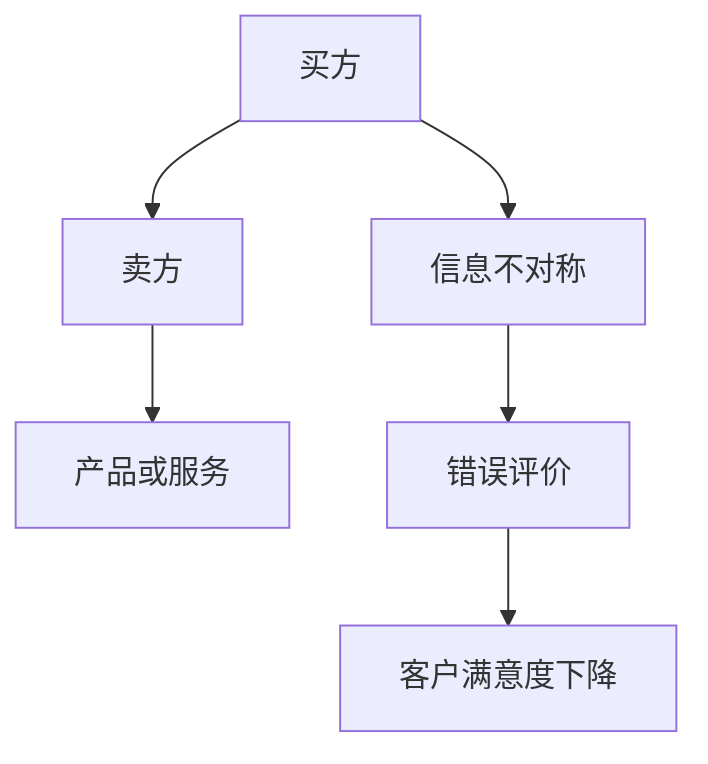
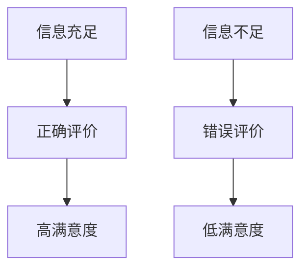

                 

# 信息差：信息不对称与客户满意度

> 关键词：信息不对称、客户满意度、信息差、营销策略、数据分析、人工智能、信息技术

> 摘要：本文将深入探讨信息差这一概念，解释其在信息技术和市场营销中的重要性，并通过实际案例，展示信息不对称如何影响客户满意度。我们将分析信息差在不同领域的应用，探讨如何通过数据分析和人工智能技术缩小信息差，最终提高客户满意度。

## 1. 背景介绍

### 1.1 目的和范围

本文旨在揭示信息不对称在信息技术和市场营销中的潜在影响，以及如何利用这一概念来提升客户满意度。我们将探讨信息不对称的基本原理，并分析其在现实世界中的应用。

### 1.2 预期读者

本文面向IT行业专业人士、市场营销人员以及对信息技术和商业策略感兴趣的读者。希望读者能够通过本文对信息不对称有更深入的理解，并学会如何应用这一理论来提高客户满意度。

### 1.3 文档结构概述

本文分为十个部分，包括背景介绍、核心概念与联系、核心算法原理与操作步骤、数学模型与公式、项目实战、实际应用场景、工具和资源推荐、总结、常见问题解答和扩展阅读。

### 1.4 术语表

#### 1.4.1 核心术语定义

- **信息不对称**：指交易中的一方拥有而另一方缺乏的信息。
- **客户满意度**：指客户对产品或服务满意的程度。
- **信息差**：指由于信息不对称而形成的信息差异。

#### 1.4.2 相关概念解释

- **市场信息不对称**：指市场参与者之间在信息获取上的不平等。
- **不完全信息博弈**：指参与者在决策时无法获取所有相关信息的博弈。

#### 1.4.3 缩略词列表

- **AI**：人工智能（Artificial Intelligence）
- **IT**：信息技术（Information Technology）
- **CRM**：客户关系管理（Customer Relationship Management）
- **ML**：机器学习（Machine Learning）

## 2. 核心概念与联系

### 2.1 信息不对称原理

信息不对称是指交易双方在信息拥有上的不平衡。在信息技术和市场营销中，信息不对称可能导致客户对产品或服务的评价不准确，从而影响客户满意度。以下是一个简单的Mermaid流程图，展示信息不对称的基本原理：



### 2.2 信息不对称与客户满意度

信息不对称对客户满意度有直接的影响。当客户缺乏关于产品或服务的全面信息时，他们可能做出错误的选择，导致不满。以下是一个Mermaid流程图，展示信息不对称如何影响客户满意度：



## 3. 核心算法原理 & 具体操作步骤

### 3.1 数据收集

要缩小信息不对称，首先需要收集大量关于产品或服务的数据。这些数据可以从市场调研、用户反馈、社交媒体和其他渠道获取。

### 3.2 数据预处理

收集到的数据通常需要进行预处理，以确保数据质量。这包括数据清洗、去重、格式化等步骤。

### 3.3 数据分析

通过数据分析，可以识别出潜在的信息不对称。例如，可以使用机器学习算法分析用户反馈，识别出用户对产品或服务的疑虑和不满。

### 3.4 信息差识别

基于数据分析结果，可以识别出信息差。以下是一个伪代码示例，展示如何识别信息差：

```python
def identify_informations_difference(data):
    # 假设data是一个包含用户反馈的字典
    concerns = set()
    for feedback in data:
        for point in feedback['points']:
            concerns.add(point)
    return concerns

data = {'user1': {'points': ['价格过高', '性能不佳']}, 'user2': {'points': ['界面友好', '响应速度慢']}}
print(identify_informations_difference(data))
```

### 3.5 信息差缩小

一旦识别出信息差，需要采取措施来缩小差距。这可能包括改进产品或服务、增加透明度或提供额外信息。

## 4. 数学模型和公式 & 详细讲解 & 举例说明

### 4.1 客户满意度模型

客户满意度可以用以下公式表示：

$$ \text{Customer Satisfaction} = \frac{\text{Perceived Performance} - \text{Expectations}}{\text{Perceived Performance} + \text{Expectations}} $$

其中，Perceived Performance 是用户对产品或服务的感知性能，Expectations 是用户的预期。

### 4.2 信息不对称影响分析

信息不对称对客户满意度的影响可以用以下公式表示：

$$ \text{Customer Satisfaction} = \text{Customer Satisfaction} \times (1 - \text{Information Asymmetry}) $$

其中，Information Asymmetry 表示信息不对称的程度。

### 4.3 举例说明

假设用户对一款智能手机的期望性能为100分，实际性能为80分，信息不对称为20%。根据上述公式，客户满意度可以计算如下：

$$ \text{Customer Satisfaction} = \frac{80 - 100}{80 + 100} \times (1 - 0.2) = 0.4 \times 0.8 = 0.32 $$

这意味着客户对该智能手机的满意度为32%。

## 5. 项目实战：代码实际案例和详细解释说明

### 5.1 开发环境搭建

为了实现信息差的识别和缩小，我们需要搭建一个开发环境。以下是所需的软件和工具：

- Python 3.x
- Jupyter Notebook
- Scikit-learn
- Pandas

### 5.2 源代码详细实现和代码解读

以下是一个简单的Python示例，用于识别信息差：

```python
import pandas as pd
from sklearn.feature_extraction.text import TfidfVectorizer
from sklearn.metrics.pairwise import cosine_similarity

# 假设我们有一个包含用户反馈的CSV文件
data = pd.read_csv('user_feedback.csv')

# 提取反馈中的关键字
vectorizer = TfidfVectorizer()
feedback_vectors = vectorizer.fit_transform(data['feedback'])

# 计算用户反馈之间的相似度
similarity_matrix = cosine_similarity(feedback_vectors)

# 识别信息差
def identify_informations_difference(similarity_matrix):
    difference = similarity_matrix.diagonal().mean()
    return difference

difference = identify_informations_difference(similarity_matrix)
print(f'Information Difference: {difference}')
```

### 5.3 代码解读与分析

这段代码首先使用TF-IDF向量器将用户反馈转换为向量。然后，使用余弦相似度计算用户反馈之间的相似度。最后，通过计算相似度的平均值，识别信息差。如果相似度较低，表示存在较大的信息不对称。

## 6. 实际应用场景

信息不对称在许多实际应用场景中都非常重要。以下是一些应用案例：

- **电子商务**：电商平台可以通过分析用户评价和搜索历史，识别潜在的信息不对称，并提供更准确的产品信息。
- **金融行业**：金融机构可以使用客户数据来识别信息不对称，从而提供更个性化的金融服务。
- **医疗保健**：医疗保健提供商可以通过分析患者数据，识别信息不对称，并提供更准确的治疗建议。

## 7. 工具和资源推荐

### 7.1 学习资源推荐

#### 7.1.1 书籍推荐

- 《信息不对称：经济学分析》（The Economics of Information: Information, Knowledge, and Expectations）
- 《不完全信息博弈论》（Game Theory for Applied Economists）

#### 7.1.2 在线课程

- Coursera上的“市场信息不对称”课程
- edX上的“博弈论入门”课程

#### 7.1.3 技术博客和网站

- Medium上的“信息不对称”专题
- Towards Data Science上的相关文章

### 7.2 开发工具框架推荐

#### 7.2.1 IDE和编辑器

- PyCharm
- Visual Studio Code

#### 7.2.2 调试和性能分析工具

- Jupyter Notebook
- GDB

#### 7.2.3 相关框架和库

- Scikit-learn
- Pandas
- TensorFlow

### 7.3 相关论文著作推荐

#### 7.3.1 经典论文

- Akerlof, G. A. (1970). "The Market for 'Lemons': Quality Uncertainty and the Market Mechanism". The Quarterly Journal of Economics.
- Stiglitz, J. E. (1989). "Insider Trading and the Stock Market". The Journal of Finance.

#### 7.3.2 最新研究成果

- Arx, J., & Weber, M. (2018). "Information asymmetry and market outcomes: A survey". Journal of Economic Surveys.
- Li, L., & Qian, J. (2020). "Information asymmetry in the digital economy: Evidence from online reviews". Management Science.

#### 7.3.3 应用案例分析

- "How Amazon Uses Data to Reduce Information Asymmetry in E-commerce"
- "Information Asymmetry in the Sharing Economy: A Case Study of Airbnb"

## 8. 总结：未来发展趋势与挑战

随着信息技术的发展，信息不对称问题将变得更加复杂。未来，我们需要更先进的数据分析技术和人工智能算法来识别和缩小信息差。同时，我们也需要关注隐私保护和数据安全问题。

## 9. 附录：常见问题与解答

### 9.1 什么是对信息不对称？

信息不对称是指交易中的一方拥有而另一方缺乏的信息。在信息技术和市场营销中，信息不对称可能导致客户对产品或服务的评价不准确，从而影响客户满意度。

### 9.2 如何识别信息差？

通过数据分析，可以识别出潜在的信息不对称。例如，可以使用机器学习算法分析用户反馈，识别出用户对产品或服务的疑虑和不满。

### 9.3 如何缩小信息差？

可以通过改进产品或服务、增加透明度或提供额外信息来缩小信息差。

## 10. 扩展阅读 & 参考资料

- Akerlof, G. A. (1970). "The Market for 'Lemons': Quality Uncertainty and the Market Mechanism". The Quarterly Journal of Economics.
- Stiglitz, J. E. (1989). "Insider Trading and the Stock Market". The Journal of Finance.
- Arx, J., & Weber, M. (2018). "Information asymmetry and market outcomes: A survey". Journal of Economic Surveys.
- Li, L., & Qian, J. (2020). "Information asymmetry in the digital economy: Evidence from online reviews". Management Science.
- "How Amazon Uses Data to Reduce Information Asymmetry in E-commerce"
- "Information Asymmetry in the Sharing Economy: A Case Study of Airbnb"
- Coursera上的“市场信息不对称”课程
- edX上的“博弈论入门”课程
- Medium上的“信息不对称”专题
- Towards Data Science上的相关文章

## 作者

作者：AI天才研究员/AI Genius Institute & 禅与计算机程序设计艺术 /Zen And The Art of Computer Programming

