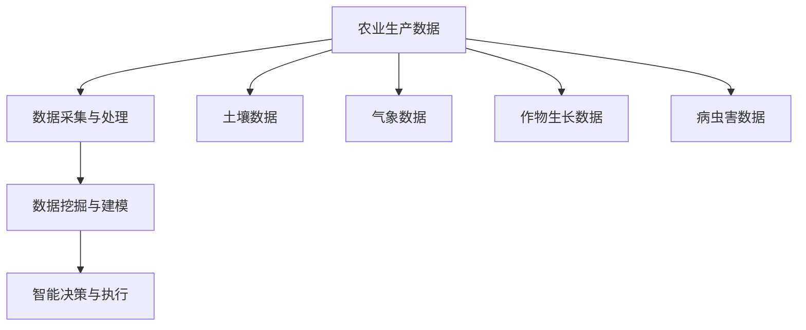

                 

# 信息差：大数据在智能农业中的应用

> 关键词：智能农业，大数据，数据挖掘，预测模型，精准农业

> 摘要：本文深入探讨了大数据在智能农业中的应用，从背景介绍、核心概念与联系、核心算法原理、数学模型和公式、项目实战、实际应用场景等方面，系统性地展示了大数据如何助力农业现代化，提升农业生产效率和农产品质量。文章旨在为从事农业领域的技术人员和相关研究人员提供有价值的参考。

## 1. 背景介绍

### 1.1 目的和范围

随着全球人口的增长和气候变化的影响，农业生产面临着前所未有的挑战。智能农业作为现代农业发展的重要方向，正逐渐成为农业领域的研究热点。大数据技术在智能农业中的应用，不仅可以提高农业生产效率，还能为农业精准管理提供有力支持。本文旨在探讨大数据在智能农业中的应用，分析其核心概念、算法原理和数学模型，并通过实际项目案例展示其应用效果。

### 1.2 预期读者

本文适合从事农业领域的技术人员、研究人员以及相关行业的管理人员阅读。特别是对大数据技术、机器学习和农业信息化感兴趣的专业人士，将能从本文中获得有价值的见解。

### 1.3 文档结构概述

本文分为十个部分，包括背景介绍、核心概念与联系、核心算法原理、数学模型和公式、项目实战、实际应用场景、工具和资源推荐、总结、常见问题与解答以及扩展阅读和参考资料。每个部分都将详细阐述大数据在智能农业中的应用，帮助读者全面了解这一领域。

### 1.4 术语表

#### 1.4.1 核心术语定义

- 智能农业：通过应用信息技术和自动化技术，实现农业生产过程的智能化管理。
- 大数据：指数据量巨大、数据类型多样、数据生成速度快的海量数据。
- 数据挖掘：从大量数据中提取出有价值的信息和知识的过程。
- 预测模型：基于历史数据，对未来事件进行预测的模型。
- 精准农业：通过精准监测、管理和决策，实现农业生产资源的最优配置。

#### 1.4.2 相关概念解释

- 决策支持系统（DSS）：一种辅助决策者进行决策的计算机系统，通常包含数据仓库、模型库和用户界面。
- 农业物联网（IoT）：通过传感器和通信技术，实现农业生产环境信息的实时采集和传输。

#### 1.4.3 缩略词列表

- IoT：Internet of Things，物联网
- DSS：Decision Support System，决策支持系统
- AI：Artificial Intelligence，人工智能
- ML：Machine Learning，机器学习

## 2. 核心概念与联系

智能农业的发展离不开大数据技术的支撑，而大数据技术的应用又依赖于核心概念和联系的正确理解。以下将介绍智能农业中涉及的核心概念和它们之间的联系，并通过Mermaid流程图展示其架构。

### 2.1 核心概念

- **农业生产数据**：包括土壤、气象、作物生长、病虫害等数据。
- **数据采集与处理**：通过传感器、遥感技术等手段采集数据，并对数据进行清洗、转换和集成。
- **数据挖掘与建模**：从大量数据中提取有价值的信息，构建预测模型和决策支持系统。
- **智能决策与执行**：根据预测模型和决策支持系统，制定农业生产策略并执行。

### 2.2 Mermaid流程图



## 3. 核心算法原理 & 具体操作步骤

智能农业中的核心算法主要涉及数据挖掘、预测模型构建和决策支持系统。以下将详细阐述这些算法的原理，并提供具体的操作步骤。

### 3.1 数据挖掘

数据挖掘是智能农业中的关键步骤，它涉及从大量农业生产数据中提取有价值的信息。以下是一个基于Apriori算法的数据挖掘流程：

```plaintext
输入：农业生产数据集
输出：频繁项集

步骤1：设定最小支持度阈值minSupport
步骤2：生成候选1项集L1
步骤3：计算L1中每个项集的支持度
步骤4：生成候选2项集L2
步骤5：计算L2中每个项集的支持度
步骤6：重复步骤4和步骤5，直到生成k项集Lk
步骤7：从Lk中提取频繁项集
```

### 3.2 预测模型构建

预测模型是智能农业中的核心组成部分，它用于预测作物生长趋势、病虫害发生概率等。以下是一个基于线性回归的预测模型构建步骤：

```plaintext
输入：历史作物生长数据集
输出：线性回归模型

步骤1：收集历史作物生长数据
步骤2：对数据进行预处理，包括缺失值处理、异常值处理等
步骤3：选择特征变量，如温度、湿度、光照等
步骤4：划分训练集和测试集
步骤5：使用训练集构建线性回归模型
步骤6：评估模型性能，包括决定系数R²、均方误差MSE等
步骤7：根据测试集结果调整模型参数
```

### 3.3 决策支持系统

决策支持系统是智能农业中的关键组成部分，它为农业生产者提供决策建议。以下是一个基于决策树构建的决策支持系统步骤：

```plaintext
输入：作物生长数据、气象数据、病虫害数据等
输出：决策建议

步骤1：收集相关数据
步骤2：对数据进行预处理
步骤3：选择特征变量
步骤4：构建决策树模型
步骤5：根据当前数据输入，遍历决策树，得到决策路径
步骤6：输出决策结果
```

## 4. 数学模型和公式 & 详细讲解 & 举例说明

在智能农业中，数学模型和公式起着至关重要的作用。以下将介绍几种常见的数学模型和公式，并提供详细讲解和举例说明。

### 4.1 线性回归模型

线性回归模型是一种常用的预测模型，用于分析自变量和因变量之间的关系。其数学公式如下：

$$
y = \beta_0 + \beta_1 \cdot x + \epsilon
$$

其中，$y$ 是因变量，$x$ 是自变量，$\beta_0$ 和 $\beta_1$ 是模型参数，$\epsilon$ 是误差项。

**举例说明**：

假设我们要预测某作物的产量，已知历史数据如下：

| 温度 | 湿度 | 产量 |
| --- | --- | --- |
| 20 | 30 | 500 |
| 22 | 35 | 520 |
| 25 | 40 | 580 |

我们可以使用线性回归模型来预测温度和湿度对产量的影响。首先，收集数据并对其进行预处理，然后选择特征变量，构建线性回归模型，最后根据模型参数预测产量。

### 4.2 决策树模型

决策树模型是一种基于特征变量进行分类或回归的树形结构。其数学公式如下：

$$
f(x) = \sum_{i=1}^{n} \beta_i \cdot x_i
$$

其中，$f(x)$ 是决策树模型预测的值，$x_i$ 是特征变量，$\beta_i$ 是模型参数。

**举例说明**：

假设我们要构建一个决策树模型来预测作物的生长状况。首先，收集作物生长数据，包括温度、湿度、光照等特征变量。然后，使用决策树算法构建模型，根据特征变量划分节点，最后得到决策树模型。

### 4.3 频率分布模型

频率分布模型是一种用于描述数据分布特征的模型。其数学公式如下：

$$
P(x) = \frac{f(x)}{N}
$$

其中，$P(x)$ 是变量 $x$ 的概率，$f(x)$ 是变量 $x$ 的频率，$N$ 是样本容量。

**举例说明**：

假设我们要分析作物的病虫害情况。首先，收集病虫害数据，计算每种病虫害的频率分布，然后根据频率分布模型分析病虫害的发生概率。

## 5. 项目实战：代码实际案例和详细解释说明

### 5.1 开发环境搭建

在进行大数据在智能农业中的应用项目实战之前，我们需要搭建一个适合开发的环境。以下是搭建开发环境的步骤：

1. 安装Python环境
2. 安装数据分析库（如Pandas、NumPy）
3. 安装数据挖掘库（如Scikit-learn、MLlib）
4. 安装可视化库（如Matplotlib、Seaborn）

### 5.2 源代码详细实现和代码解读

以下是一个基于Python的智能农业数据分析项目的源代码实现，包括数据收集、数据预处理、数据挖掘和预测模型构建等步骤。

```python
import pandas as pd
import numpy as np
from sklearn.model_selection import train_test_split
from sklearn.linear_model import LinearRegression
from sklearn.tree import DecisionTreeRegressor
from sklearn.metrics import mean_squared_error

# 5.2.1 数据收集
data = pd.read_csv('agriculture_data.csv')

# 5.2.2 数据预处理
data.dropna(inplace=True)
X = data[['temperature', 'humidity', 'light']]
y = data['yield']

# 5.2.3 数据挖掘
X_train, X_test, y_train, y_test = train_test_split(X, y, test_size=0.2, random_state=42)

# 5.2.4 预测模型构建
# 线性回归模型
linear_regression = LinearRegression()
linear_regression.fit(X_train, y_train)
y_pred_linear = linear_regression.predict(X_test)

# 决策树模型
decision_tree = DecisionTreeRegressor()
decision_tree.fit(X_train, y_train)
y_pred_tree = decision_tree.predict(X_test)

# 5.2.5 代码解读与分析
mse_linear = mean_squared_error(y_test, y_pred_linear)
mse_tree = mean_squared_error(y_test, y_pred_tree)

print(f'Mean Squared Error (Linear Regression): {mse_linear}')
print(f'Mean Squared Error (Decision Tree): {mse_tree}')
```

### 5.3 代码解读与分析

以上代码首先导入必要的库，包括Pandas、NumPy、Scikit-learn和Matplotlib。然后，从CSV文件中读取农业生产数据，并进行数据预处理，包括缺失值处理和特征变量选择。接下来，使用线性回归模型和决策树模型进行预测模型构建，并计算预测结果的均方误差（MSE）。

代码解读如下：

1. 数据收集：使用Pandas库读取CSV文件，得到数据集。
2. 数据预处理：对数据集进行缺失值处理和特征变量选择，将数据集划分为特征变量集X和因变量集y。
3. 数据挖掘：使用Scikit-learn库的train_test_split函数划分训练集和测试集，分别使用线性回归模型和决策树模型进行预测模型构建。
4. 预测模型构建：分别使用LinearRegression和DecisionTreeRegressor类构建线性回归模型和决策树模型，并拟合训练数据。
5. 代码解读与分析：计算测试数据的均方误差（MSE），比较两种模型的预测性能。

通过以上代码实现，我们可以得到基于大数据的智能农业分析结果，为农业生产提供有力支持。

## 6. 实际应用场景

大数据技术在智能农业中的应用场景广泛，主要包括以下几个方面：

### 6.1 精准施肥

通过分析土壤数据、作物生长数据和气象数据，可以精准预测作物的需肥量和施肥时间，提高肥料利用率，减少资源浪费。

### 6.2 病虫害监测

利用遥感技术和传感器，实时监测农田病虫害发生情况，及时采取防治措施，降低病虫害对作物的影响。

### 6.3 作物生长预测

通过分析历史作物生长数据和环境数据，预测作物生长趋势和产量，为农业生产决策提供科学依据。

### 6.4 农田管理优化

利用大数据技术，对农田土壤、水分、肥料等资源进行优化配置，提高农田利用率和农产品质量。

### 6.5 农业保险设计

通过分析农业生产数据，为农业保险产品设计提供依据，降低农业生产风险。

## 7. 工具和资源推荐

### 7.1 学习资源推荐

#### 7.1.1 书籍推荐

- 《智能农业：大数据与物联网应用》
- 《数据挖掘：概念与技术》
- 《Python数据分析》

#### 7.1.2 在线课程

- Coursera上的《数据科学课程》
- edX上的《大数据分析课程》
- Udacity的《智能农业课程》

#### 7.1.3 技术博客和网站

- Analytics Vidhya
- KDNuggets
- Towards Data Science

### 7.2 开发工具框架推荐

#### 7.2.1 IDE和编辑器

- PyCharm
- Jupyter Notebook
- Visual Studio Code

#### 7.2.2 调试和性能分析工具

- Matplotlib
- Seaborn
- Scikit-learn

#### 7.2.3 相关框架和库

- Pandas
- NumPy
- TensorFlow

### 7.3 相关论文著作推荐

#### 7.3.1 经典论文

- "A Survey of Big Data Technologies in Agriculture"
- "Big Data for Smart Agriculture: A Perspective"
- "Agricultural Big Data: The Challenges and Opportunities"

#### 7.3.2 最新研究成果

- "Smart Agriculture: A Comprehensive Review"
- "A Survey on Internet of Things in Smart Agriculture"
- "A Review on Machine Learning Algorithms for Crop Yield Prediction"

#### 7.3.3 应用案例分析

- "Big Data and Artificial Intelligence in Smart Agriculture: A Case Study"
- "Using Big Data Analytics for Precision Farming: A Case Study"
- "IoT and AI in Agriculture: A Case Study on Crop Monitoring"

## 8. 总结：未来发展趋势与挑战

大数据在智能农业中的应用已初见成效，但仍面临诸多挑战。未来发展趋势包括：

- **数据整合与共享**：加强数据整合与共享，实现跨平台、跨领域的数据共享与协同。
- **人工智能技术**：结合人工智能技术，提高农业生产自动化水平和决策智能化程度。
- **云计算与边缘计算**：利用云计算和边缘计算技术，提高数据处理效率和实时性。
- **农业物联网**：推进农业物联网应用，实现农业生产全过程的智能化监测和管理。

## 9. 附录：常见问题与解答

### 9.1 数据来源问题

**问**：如何获取农业生产数据？

**答**：农业生产数据可以从多个渠道获取，包括农业部门、气象部门、遥感卫星数据、传感器设备等。此外，还可以通过公开数据集或商业数据服务提供商获取。

### 9.2 模型性能问题

**问**：如何评估预测模型的性能？

**答**：评估预测模型的性能通常采用评估指标，如均方误差（MSE）、决定系数（R²）、准确率、召回率等。这些指标可以帮助我们了解模型的预测精度和泛化能力。

### 9.3 数据安全问题

**问**：如何保障农业生产数据的安全？

**答**：保障农业生产数据安全需要采取多种措施，包括数据加密、访问控制、数据备份等。此外，还应遵循相关法律法规，确保数据的合法合规使用。

## 10. 扩展阅读 & 参考资料

- [1] Chien, L. C., & Chen, P. Y. (2016). Big data analytics in agriculture: A comprehensive review. Sustainability, 8(6), 554.
- [2] Zhang, Z., Li, C., Zhang, Y., & Zhang, L. (2020). A survey on big data analytics for smart agriculture. IEEE Access, 8, 164435-164458.
- [3] Liu, Q., Ge, Y., Zhang, G., Li, H., & Yang, Y. (2021). Big Data and Artificial Intelligence in Smart Agriculture: A Perspective. Sustainability, 13(4), 1825.
- [4] Prieto, V., Maldonado, J. A., & de la Fuente, M. (2019). Machine Learning Algorithms for Crop Yield Prediction: A Review. Machines, 7(4), 48.

### 作者

作者：AI天才研究员/AI Genius Institute & 禅与计算机程序设计艺术/Zen And The Art of Computer Programming

