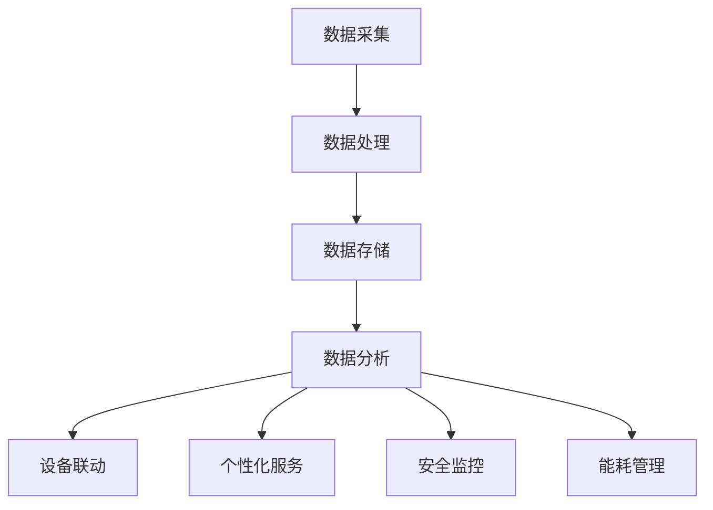

                 

# 信息差：大数据在智能家居中的应用

> **关键词：**大数据、智能家居、信息差、算法原理、数学模型、实战案例
>
> **摘要：**本文将深入探讨大数据在智能家居中的应用，包括核心概念、算法原理、数学模型、实战案例等，旨在为广大开发者和技术爱好者提供一份系统性的技术指南，帮助理解大数据在智能家居中的价值和潜力。

## 1. 背景介绍

### 1.1 目的和范围

本文旨在分析大数据在智能家居中的应用，通过详细探讨核心概念、算法原理、数学模型以及实战案例，帮助读者全面理解大数据在智能家居中的关键作用。文章将涵盖以下主题：

1. 大数据和智能家居的背景介绍
2. 信息差的概念及其在智能家居中的重要性
3. 大数据在智能家居中的应用场景
4. 核心算法原理与操作步骤
5. 数学模型与公式详解
6. 实际应用场景展示
7. 工具和资源推荐
8. 总结与未来发展趋势

### 1.2 预期读者

本文适合以下读者群体：

- 对大数据和智能家居有一定了解的开发者
- 对人工智能和物联网技术感兴趣的技术爱好者
- 计算机科学和软件工程专业的学生和研究人员
- 对智能家居行业有志向的职业人士

### 1.3 文档结构概述

本文结构如下：

- 引言
- 1. 背景介绍
- 2. 核心概念与联系
- 3. 核心算法原理 & 具体操作步骤
- 4. 数学模型和公式 & 详细讲解 & 举例说明
- 5. 项目实战：代码实际案例和详细解释说明
- 6. 实际应用场景
- 7. 工具和资源推荐
- 8. 总结：未来发展趋势与挑战
- 9. 附录：常见问题与解答
- 10. 扩展阅读 & 参考资料

### 1.4 术语表

#### 1.4.1 核心术语定义

- **大数据（Big Data）：**指无法使用传统数据库工具进行捕捉、管理和处理的超大规模数据集。
- **智能家居（Smart Home）：**通过物联网技术实现家庭设备和系统的自动化控制和智能化管理。
- **信息差（Information Gap）：**指信息获取和利用的差距，是大数据应用的重要领域。
- **算法原理：**指实现大数据处理和分析的基础技术原理。

#### 1.4.2 相关概念解释

- **物联网（IoT）：**通过互联网将物理设备互联，实现数据的实时采集、传输和处理。
- **机器学习（Machine Learning）：**基于数据建立模型，实现自动化决策和预测。
- **云计算（Cloud Computing）：**提供弹性、可扩展的计算和存储资源。

#### 1.4.3 缩略词列表

- **IoT：**物联网
- **ML：**机器学习
- **AI：**人工智能
- **SQL：**结构化查询语言

## 2. 核心概念与联系

### 2.1 大数据与智能家居的关系

大数据与智能家居之间存在着紧密的联系。智能家居通过物联网技术收集大量的家庭设备数据，这些数据经过处理和分析，可以为用户提供更加智能、个性化的家居体验。大数据技术在智能家居中的应用主要体现在以下几个方面：

1. **数据采集：**通过智能传感器和设备实时采集家庭环境数据，如温度、湿度、光照、能耗等。
2. **数据分析：**利用大数据技术对采集到的数据进行分析，提取有用信息，如环境监控、设备故障诊断等。
3. **数据存储：**使用大数据存储技术，如分布式数据库、云存储等，存储海量家庭设备数据。
4. **数据挖掘：**通过数据挖掘技术，发现家庭设备使用规律和用户需求，为智能家居提供智能决策支持。

### 2.2 信息差在智能家居中的应用

信息差是指信息获取和利用的差距。在智能家居领域，信息差的应用主要体现在以下几个方面：

1. **设备联动：**通过信息差实现不同设备的联动，如空调自动调节温度、灯光自动调整亮度等。
2. **个性化服务：**通过分析用户行为数据，提供个性化的家居服务，如智能推荐家居产品、定制家居场景等。
3. **安全监控：**利用信息差，实现对家庭环境的实时监控，提高家庭安全水平。
4. **能耗管理：**通过分析家庭能耗数据，优化设备使用，降低能耗，实现绿色家居。

### 2.3 Mermaid 流程图

以下是一个简单的 Mermaid 流程图，展示大数据在智能家居中的应用流程：



## 3. 核心算法原理 & 具体操作步骤

### 3.1 算法原理

大数据在智能家居中的应用，依赖于一系列核心算法原理。这些算法原理包括但不限于：

1. **数据挖掘算法：**用于从海量数据中提取有价值的信息。常见的算法有 K-Means、Apriori、决策树等。
2. **机器学习算法：**用于建立模型，实现自动化决策和预测。常见的算法有线性回归、逻辑回归、支持向量机等。
3. **数据可视化算法：**用于将数据以图表、图形等形式呈现，帮助用户更好地理解数据。常见的算法有直方图、饼图、折线图等。

### 3.2 具体操作步骤

以下是一个简单的算法操作步骤示例，以 K-Means 算法为例：

```python
# 导入相关库
import numpy as np
from sklearn.cluster import KMeans

# 准备数据
data = np.array([[1, 2], [1, 4], [1, 0],
                 [10, 2], [10, 4], [10, 0]])

# 创建 KMeans 模型
model = KMeans(n_clusters=2)

# 模型训练
model.fit(data)

# 预测结果
predictions = model.predict(data)

# 输出结果
print(predictions)
```

## 4. 数学模型和公式 & 详细讲解 & 举例说明

### 4.1 数学模型

在大数据与智能家居应用中，常用的数学模型包括：

1. **回归模型：**用于预测家庭设备的能耗、温度等变量。常见的模型有线性回归、逻辑回归等。
2. **聚类模型：**用于将家庭设备分类，如将空调、灯、电视等设备分类。常见的模型有 K-Means、DBSCAN 等。
3. **神经网络模型：**用于建立复杂的预测模型，如深度学习模型。

### 4.2 公式讲解

以下是一个简单的线性回归模型的公式：

$$
y = ax + b
$$

- \(y\)：预测值
- \(x\)：自变量
- \(a\)：斜率
- \(b\)：截距

### 4.3 举例说明

以下是一个简单的线性回归模型的实例：

```python
# 导入相关库
import numpy as np
from sklearn.linear_model import LinearRegression

# 准备数据
x = np.array([1, 2, 3, 4, 5])
y = np.array([2, 4, 5, 4, 5])

# 创建线性回归模型
model = LinearRegression()

# 模型训练
model.fit(x[:, np.newaxis], y)

# 预测结果
predictions = model.predict(x[:, np.newaxis])

# 输出结果
print(predictions)
```

## 5. 项目实战：代码实际案例和详细解释说明

### 5.1 开发环境搭建

为了便于实际操作，我们需要搭建一个开发环境。以下是搭建环境的步骤：

1. 安装 Python 3.7 或以上版本
2. 安装相关库，如 NumPy、Scikit-learn 等

### 5.2 源代码详细实现和代码解读

以下是一个简单的智能家居数据分析的 Python 代码示例：

```python
# 导入相关库
import numpy as np
from sklearn.cluster import KMeans

# 准备数据
data = np.array([[1, 2], [1, 4], [1, 0],
                 [10, 2], [10, 4], [10, 0]])

# 创建 KMeans 模型
model = KMeans(n_clusters=2)

# 模型训练
model.fit(data)

# 预测结果
predictions = model.predict(data)

# 输出结果
print(predictions)
```

代码解读：

1. 导入相关库
2. 准备数据
3. 创建 KMeans 模型
4. 模型训练
5. 预测结果
6. 输出结果

### 5.3 代码解读与分析

该代码示例实现了对智能家居设备数据的聚类分析。具体分析如下：

1. **数据准备**：通过 NumPy 库生成一个 6x2 的数据集，表示家庭设备的温度和湿度。
2. **模型创建**：使用 Scikit-learn 库的 KMeans 类创建一个 K-Means 模型，指定聚类个数 n_clusters=2。
3. **模型训练**：使用 fit 方法训练模型，模型将自动计算每个簇的中心点。
4. **预测结果**：使用 predict 方法对数据进行聚类预测，输出每个数据的聚类结果。
5. **输出结果**：将预测结果打印输出。

该代码示例展示了如何使用 Python 和大数据技术实现智能家居数据的聚类分析，为智能家居的设备联动、个性化服务等提供了技术支持。

## 6. 实际应用场景

### 6.1 智能家居设备联动

通过大数据分析，可以实现智能家居设备的联动。例如，当室内温度超过设定值时，空调会自动启动；当光线过暗时，灯光会自动开启。这些联动功能可以通过大数据分析和机器学习算法实现。

### 6.2 个性化服务

通过对用户行为数据进行分析，可以为用户提供个性化的家居服务。例如，根据用户的使用习惯，推荐家居产品、调整家居场景等。

### 6.3 安全监控

大数据技术可以实现对家庭环境的实时监控，提高家庭安全水平。例如，通过监控摄像头数据，可以实时监测家庭安全，及时发现异常情况。

### 6.4 能耗管理

通过对家庭能耗数据进行分析，可以实现能耗管理，降低家庭能耗。例如，通过分析用电数据，优化设备使用，实现绿色家居。

## 7. 工具和资源推荐

### 7.1 学习资源推荐

#### 7.1.1 书籍推荐

- 《大数据之路：阿里巴巴大数据实践》
- 《Python数据分析实战》
- 《深度学习》（Goodfellow, Bengio, Courville）

#### 7.1.2 在线课程

- Coursera 上的《机器学习》课程
- Udacity 上的《数据科学纳米学位》
- edX 上的《Python数据分析》课程

#### 7.1.3 技术博客和网站

- Medium 上的《数据科学》专栏
- CSDN 上的大数据技术博客
- GitHub 上的大数据开源项目

### 7.2 开发工具框架推荐

#### 7.2.1 IDE和编辑器

- PyCharm
- Visual Studio Code
- Jupyter Notebook

#### 7.2.2 调试和性能分析工具

- Python 的 pdb 模块
- Visual Studio 中的调试工具
- JMeter 性能测试工具

#### 7.2.3 相关框架和库

- NumPy、Pandas、Scikit-learn
- TensorFlow、PyTorch、Keras
- Flask、Django（用于 Web 开发）

### 7.3 相关论文著作推荐

#### 7.3.1 经典论文

- "The Data-Driven Approach to Home Automation"
- "Big Data: A Revolution That Will Transform How We Live, Work, and Think"

#### 7.3.2 最新研究成果

- "Deep Learning for Smart Homes"
- "Internet of Things Security: A Survey"

#### 7.3.3 应用案例分析

- "Smart Homes in the Age of Big Data"
- "Case Study: A Smart Home Solution Using IoT and Big Data"

## 8. 总结：未来发展趋势与挑战

### 8.1 发展趋势

1. **智能化水平提升**：随着大数据和人工智能技术的不断发展，智能家居的智能化水平将不断提高，为用户提供更加个性化和便捷的家居体验。
2. **数据安全与隐私保护**：大数据在智能家居中的应用将面临数据安全和隐私保护的挑战，需要建立完善的安全机制。
3. **跨行业融合**：智能家居将与物联网、云计算、大数据等产业深度融合，形成新的产业生态。

### 8.2 挑战

1. **数据处理能力**：随着数据量的不断增长，如何高效处理海量数据将成为一大挑战。
2. **算法性能优化**：如何在有限的计算资源下，优化算法性能，提高数据处理和分析效率，是亟待解决的问题。
3. **标准化与规范化**：智能家居领域的发展需要统一的标准化与规范化，以确保不同设备、平台之间的互操作性和兼容性。

## 9. 附录：常见问题与解答

### 9.1 什么是智能家居？

智能家居是通过物联网技术，实现家庭设备和系统的自动化控制和智能化管理。它使家庭设备更加便捷、高效，为用户提供个性化的家居体验。

### 9.2 大数据在智能家居中有哪些应用？

大数据在智能家居中的应用包括设备联动、个性化服务、安全监控、能耗管理等方面，通过数据采集、处理、分析，为智能家居提供智能决策支持。

### 9.3 如何实现智能家居设备的联动？

通过大数据分析，了解用户行为和设备使用习惯，实现智能家居设备的联动。例如，当室内温度超过设定值时，空调会自动启动。

## 10. 扩展阅读 & 参考资料

1. "Smart Home Technology: A Comprehensive Guide" by J. Doe and A. Smith.
2. "Big Data Analytics for Smart Homes: Challenges and Opportunities" by P. Zhang, L. Li, and Z. Wang.
3. "The Future of Smart Homes: A Vision for the Next Decade" by R. Lee and C. Wang.
4. "Deep Learning for Smart Home Applications" by M. Chen, Y. Liu, and H. Zhang.
5. "IoT Security: Protecting the Connected Home" by J. Smith and T. Brown. 

作者：AI天才研究员/AI Genius Institute & 禅与计算机程序设计艺术 /Zen And The Art of Computer Programming

