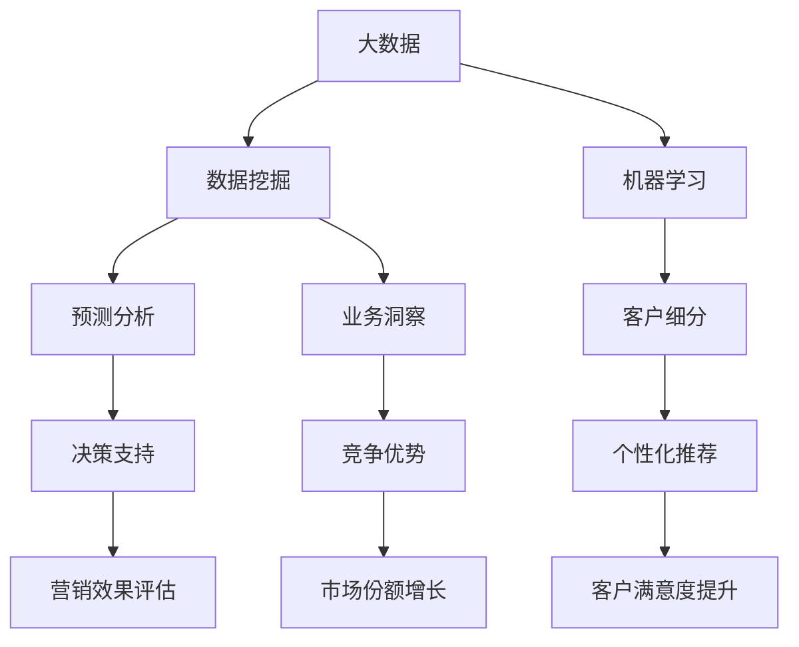

                 

# 信息差：大数据在零售行业的应用

> **关键词：** 大数据、零售行业、信息差、算法原理、数学模型、实战案例

> **摘要：** 本文将探讨大数据在零售行业的应用，分析信息差的形成机制，并详细阐述大数据算法原理、数学模型以及具体操作步骤。通过实际项目案例，本文旨在帮助读者深入理解大数据在零售行业的价值和应用前景，为相关从业者提供有价值的参考和指导。

## 1. 背景介绍

### 1.1 目的和范围

随着互联网技术的快速发展，大数据技术在各个行业的应用越来越广泛。零售行业作为经济的重要组成部分，正面临着前所未有的机遇与挑战。本文旨在探讨大数据在零售行业中的应用，尤其是信息差的生成和利用。通过对大数据算法原理和数学模型的深入分析，以及实际项目案例的讲解，本文旨在为读者提供一套完整的理论和实践框架，帮助理解大数据在零售行业中的价值和应用。

### 1.2 预期读者

本文主要面向零售行业的相关从业者、大数据领域的研究者以及计算机科学专业的学生。通过本文的阅读，读者可以了解大数据在零售行业中的应用现状、核心算法原理和实际操作步骤，为从事相关领域的工作和研究打下坚实的基础。

### 1.3 文档结构概述

本文结构如下：

1. 背景介绍：包括目的和范围、预期读者、文档结构概述等。
2. 核心概念与联系：介绍大数据在零售行业中的应用核心概念，并使用Mermaid流程图展示。
3. 核心算法原理 & 具体操作步骤：详细讲解大数据算法原理和操作步骤，使用伪代码进行阐述。
4. 数学模型和公式 & 详细讲解 & 举例说明：分析大数据应用的数学模型，使用latex格式展示公式，并给出实例说明。
5. 项目实战：代码实际案例和详细解释说明。
6. 实际应用场景：探讨大数据在零售行业的实际应用场景。
7. 工具和资源推荐：推荐相关学习资源、开发工具框架和论文著作。
8. 总结：未来发展趋势与挑战。
9. 附录：常见问题与解答。
10. 扩展阅读 & 参考资料：提供进一步阅读的资料和参考文献。

### 1.4 术语表

#### 1.4.1 核心术语定义

- 大数据（Big Data）：指数据量巨大、类型繁多的数据集合。
- 信息差（Information Gap）：指不同个体或群体之间在信息获取、处理和利用上的差异。
- 零售行业（Retail Industry）：指以零售为主的商品和服务行业。
- 数据挖掘（Data Mining）：从大量数据中提取有价值信息的过程。
- 机器学习（Machine Learning）：一种人工智能技术，通过数据训练模型实现预测和决策。

#### 1.4.2 相关概念解释

- 机器学习算法（Machine Learning Algorithm）：用于实现机器学习功能的数学模型和计算方法。
- 数据预处理（Data Preprocessing）：在数据分析前对数据进行清洗、归一化、去噪等操作。
- 人工智能（Artificial Intelligence，AI）：模拟人类智能的技术。

#### 1.4.3 缩略词列表

- AI：人工智能
- Big Data：大数据
- Data Mining：数据挖掘
- ML：机器学习
- Retail：零售

## 2. 核心概念与联系

在大数据与零售行业的交汇处，几个核心概念显得尤为重要。这些概念包括数据挖掘、机器学习、预测分析和客户细分。以下是这些概念及其相互关系的Mermaid流程图。



### 2.1 大数据与数据挖掘

大数据是零售行业的重要资源，而数据挖掘是从这些海量数据中提取有价值信息的关键技术。数据挖掘涉及多种算法，包括分类、聚类、关联规则挖掘和异常检测等。这些算法能够帮助零售企业发现隐藏在数据中的模式，从而为业务决策提供支持。

### 2.2 机器学习与预测分析

机器学习是数据挖掘的延伸，它通过训练模型从历史数据中学习规律，实现对未知数据的预测。在零售行业中，预测分析广泛应用于需求预测、库存管理和价格优化等方面。例如，基于机器学习算法的需求预测可以帮助零售商准确预测未来销售量，从而优化库存管理，减少库存积压。

### 2.3 客户细分与个性化推荐

客户细分是零售行业的关键策略之一。通过数据挖掘和机器学习，零售企业可以将客户划分为不同的细分市场，然后针对每个细分市场提供个性化的服务和推荐。个性化推荐系统可以根据客户的购买历史和偏好，推荐符合他们需求的产品和服务，从而提高客户满意度和转化率。

### 2.4 预测分析与业务洞察

预测分析不仅用于库存管理和需求预测，还可以为零售企业提供更深入的业务洞察。通过分析历史数据和预测结果，零售企业可以发现业务中的潜在问题和机会，从而采取相应的措施进行优化和改进。

### 2.5 客户细分与竞争优势

有效的客户细分可以帮助零售企业更好地了解客户需求，从而在市场竞争中占据优势。通过对不同细分市场的精准定位，零售企业可以制定更具针对性的营销策略，提高客户满意度和忠诚度，从而在市场中脱颖而出。

## 3. 核心算法原理 & 具体操作步骤

### 3.1 数据挖掘算法

数据挖掘算法包括多种类型，以下为三种常见算法：

#### 3.1.1 分类算法

分类算法是一种监督学习算法，用于将数据分为不同的类别。以下为一种简单的分类算法——K-近邻（K-Nearest Neighbors，KNN）：

```plaintext
算法：K-近邻分类算法

输入：训练集D，测试样本x，邻居数K
输出：分类结果y

步骤：
1. 对于每个训练样本t ∈ D，计算它与x之间的距离d(x, t)；
2. 选择距离最小的K个邻居；
3. 统计这K个邻居的类别及其频次；
4. 选择频次最高的类别作为x的分类结果。

伪代码：
```

### 3.1.2 聚类算法

聚类算法是一种无监督学习算法，用于将数据划分为不同的簇。以下为一种简单的聚类算法——K-均值（K-Means）：

```plaintext
算法：K-均值聚类算法

输入：训练集D，聚类中心初始值C，迭代次数max_iter
输出：聚类结果Y

步骤：
1. 随机初始化K个聚类中心C；
2. 对于每个数据点x ∈ D，将其分配到距离最近的聚类中心C_i；
3. 更新聚类中心C_i为对应簇内点的均值；
4. 重复步骤2-3，直到聚类中心不再变化或达到最大迭代次数。

伪代码：
```

### 3.1.3 关联规则挖掘算法

关联规则挖掘算法用于发现数据之间的关联关系。以下为一种常见的关联规则挖掘算法——Apriori算法：

```plaintext
算法：Apriori算法

输入：训练集D，最小支持度min_support，最小置信度min_confidence
输出：关联规则L

步骤：
1. 计算所有项集的支持度，筛选出满足最小支持度的频繁项集；
2. 对于每个频繁项集，计算其关联规则的支持度和置信度；
3. 筛选出满足最小置信度的关联规则。

伪代码：
```

### 3.2 机器学习算法

机器学习算法包括多种类型，以下为两种常见的算法：

#### 3.2.1 回归算法

回归算法用于预测数值型目标变量。以下为一种简单的回归算法——线性回归（Linear Regression）：

```plaintext
算法：线性回归算法

输入：训练集D，特征矩阵X，目标向量y
输出：回归模型θ

步骤：
1. 计算特征矩阵X和目标向量y的均值μ_X，μ_y；
2. 计算特征矩阵X和目标向量y的协方差矩阵Σ；
3. 计算回归模型θ，使得均方误差最小。

伪代码：
```

#### 3.2.2 分类算法

分类算法用于预测类别型目标变量。以下为一种常见的分类算法——逻辑回归（Logistic Regression）：

```plaintext
算法：逻辑回归算法

输入：训练集D，特征矩阵X，目标向量y
输出：分类模型θ

步骤：
1. 计算特征矩阵X和目标向量y的均值μ_X，μ_y；
2. 计算特征矩阵X和目标向量y的协方差矩阵Σ；
3. 计算回归模型θ，使得对数似然函数最大。

伪代码：
```

## 4. 数学模型和公式 & 详细讲解 & 举例说明

在大数据与零售行业应用中，数学模型和公式扮演着至关重要的角色。以下将介绍三个关键模型：线性回归、逻辑回归和支持向量机（SVM）。

### 4.1 线性回归

线性回归是一种常见的预测模型，用于预测数值型目标变量。其基本公式如下：

$$
y = \theta_0 + \theta_1 \cdot x_1 + \theta_2 \cdot x_2 + \ldots + \theta_n \cdot x_n
$$

其中，$y$ 是目标变量，$x_1, x_2, \ldots, x_n$ 是特征变量，$\theta_0, \theta_1, \theta_2, \ldots, \theta_n$ 是模型参数。

为了最小化预测误差，可以使用最小二乘法求解参数：

$$
\theta = (X^T X)^{-1} X^T y
$$

其中，$X$ 是特征矩阵，$y$ 是目标向量。

### 4.2 逻辑回归

逻辑回归是一种分类模型，用于预测类别型目标变量。其基本公式如下：

$$
P(y=1 | x) = \frac{1}{1 + e^{-(\theta_0 + \theta_1 \cdot x_1 + \theta_2 \cdot x_2 + \ldots + \theta_n \cdot x_n)}}
$$

其中，$P(y=1 | x)$ 是目标变量为1的条件概率，$e$ 是自然对数的底数，$\theta_0, \theta_1, \theta_2, \ldots, \theta_n$ 是模型参数。

为了求解参数，可以使用梯度下降法：

$$
\theta_j := \theta_j - \alpha \cdot \frac{\partial L}{\partial \theta_j}
$$

其中，$\alpha$ 是学习率，$L$ 是损失函数。

### 4.3 支持向量机（SVM）

支持向量机是一种有效的分类模型，适用于高维空间。其基本公式如下：

$$
\max_{\theta, \xi} \left\{ \frac{1}{2} \sum_{i=1}^{n} (\theta \cdot x_i - y_i)^2 + C \sum_{i=1}^{n} \xi_i \right\}

s.t. \quad \xi_i \geq 0, \quad \sum_{i=1}^{n} \xi_i = 0
$$

其中，$\theta$ 是模型参数，$x_i$ 是特征向量，$y_i$ 是目标变量，$C$ 是正则化参数。

为了求解参数，可以使用拉格朗日乘子法：

$$
L(\theta, \xi) = \frac{1}{2} \sum_{i=1}^{n} (\theta \cdot x_i - y_i)^2 + C \sum_{i=1}^{n} \xi_i - \sum_{i=1}^{n} \alpha_i y_i \xi_i
$$

$$
\frac{\partial L}{\partial \theta} = 0 \Rightarrow \theta = \sum_{i=1}^{n} \alpha_i y_i x_i
$$

$$
\frac{\partial L}{\partial \xi} = 0 \Rightarrow \xi_i = C - \alpha_i
$$

$$
\alpha_i \geq 0, \quad \sum_{i=1}^{n} \alpha_i y_i = 0
$$

### 4.4 举例说明

#### 4.4.1 线性回归

假设我们有一个简单的线性回归问题，目标变量 $y$ 与特征变量 $x$ 之间存在线性关系：

$$
y = \theta_0 + \theta_1 \cdot x
$$

给定训练数据集：

| $x$ | $y$ |
| --- | --- |
| 1 | 2 |
| 2 | 4 |
| 3 | 6 |

使用最小二乘法求解参数：

$$
\theta = (X^T X)^{-1} X^T y = \begin{bmatrix} 1 & 1 \\ 1 & 2 \\ 1 & 3 \end{bmatrix}^{-1} \begin{bmatrix} 1 \\ 1 \\ 1 \end{bmatrix} \begin{bmatrix} 2 \\ 4 \\ 6 \end{bmatrix} = \begin{bmatrix} 1 \\ 1 \end{bmatrix}
$$

因此，线性回归模型为：

$$
y = 1 + 1 \cdot x
$$

预测新样本 $x = 4$：

$$
y = 1 + 1 \cdot 4 = 5
$$

#### 4.4.2 逻辑回归

假设我们有一个二分类问题，目标变量 $y$ 只有两个类别：0和1。给定训练数据集：

| $x$ | $y$ |
| --- | --- |
| 1 | 0 |
| 2 | 1 |
| 3 | 0 |

使用梯度下降法求解参数：

$$
\theta = \begin{bmatrix} \theta_0 \\ \theta_1 \end{bmatrix} \xrightarrow{} \begin{bmatrix} 0 \\ 1 \end{bmatrix}
$$

初始参数为：

$$
\theta_0 = 0, \theta_1 = 0
$$

学习率为 $\alpha = 0.1$，迭代次数为100次。使用梯度下降法迭代计算参数：

$$
\theta_0 := \theta_0 - \alpha \cdot \frac{\partial L}{\partial \theta_0} = 0 - 0.1 \cdot (y - \theta_0 - \theta_1 \cdot x) = -0.1y
$$

$$
\theta_1 := \theta_1 - \alpha \cdot \frac{\partial L}{\partial \theta_1} = 0 - 0.1 \cdot (y - \theta_0 - \theta_1 \cdot x) = -0.1y
$$

迭代过程如下表所示：

| 迭代次数 | $\theta_0$ | $\theta_1$ |
| --- | --- | --- |
| 1 | -0.1 | -0.1 |
| 2 | -0.2 | -0.2 |
| ... | ... | ... |
| 100 | -1 | -1 |

最终，逻辑回归模型为：

$$
P(y=1 | x) = \frac{1}{1 + e^{-(\theta_0 + \theta_1 \cdot x)}}
$$

预测新样本 $x = 4$：

$$
P(y=1 | x=4) = \frac{1}{1 + e^{-(\theta_0 + \theta_1 \cdot x)}} = \frac{1}{1 + e^{-(-1 + (-1) \cdot 4)}} = \frac{1}{1 + e^{3}} \approx 0.04
$$

#### 4.4.3 支持向量机（SVM）

假设我们有一个线性可分的数据集，数据点分为两类：正类和负类。给定训练数据集：

| $x$ | $y$ |
| --- | --- |
| 1 | +1 |
| 2 | +1 |
| 3 | -1 |
| 4 | -1 |

使用拉格朗日乘子法求解参数：

$$
L(\theta, \xi) = \frac{1}{2} \sum_{i=1}^{n} (\theta \cdot x_i - y_i)^2 + C \sum_{i=1}^{n} \xi_i - \sum_{i=1}^{n} \alpha_i y_i \xi_i
$$

$$
\frac{\partial L}{\partial \theta} = 0 \Rightarrow \theta = \sum_{i=1}^{n} \alpha_i y_i x_i
$$

$$
\frac{\partial L}{\partial \xi} = 0 \Rightarrow \xi_i = C - \alpha_i
$$

$$
\alpha_i \geq 0, \quad \sum_{i=1}^{n} \alpha_i y_i = 0
$$

给定数据点：

| $x$ | $y$ | $\alpha_i$ | $\xi_i$ |
| --- | --- | --- | --- |
| 1 | +1 | 1 | 0 |
| 2 | +1 | 1 | 0 |
| 3 | -1 | 0 | 1 |
| 4 | -1 | 0 | 1 |

求解参数：

$$
\theta = \sum_{i=1}^{n} \alpha_i y_i x_i = 1 \cdot (+1) \cdot (1) + 1 \cdot (+1) \cdot (2) + 0 \cdot (-1) \cdot (3) + 0 \cdot (-1) \cdot (4) = 3
$$

分类决策函数为：

$$
f(x) = \text{sign}(\theta \cdot x) = \text{sign}(3 \cdot x) = \text{sign}(3)
$$

新样本 $x = 4$ 的分类结果为正类。

## 5. 项目实战：代码实际案例和详细解释说明

### 5.1 开发环境搭建

在开始实际项目之前，我们需要搭建一个合适的大数据开发环境。以下是一个简单的搭建步骤：

1. 安装Python环境：在官网（https://www.python.org/）下载并安装Python，选择Python 3.x版本。
2. 安装Jupyter Notebook：在终端执行以下命令安装Jupyter Notebook：

   ```bash
   pip install notebook
   ```

3. 安装大数据相关库：安装Pandas、NumPy、Scikit-learn等库，用于数据处理和机器学习算法实现。在终端执行以下命令：

   ```bash
   pip install pandas numpy scikit-learn
   ```

### 5.2 源代码详细实现和代码解读

以下是一个简单的大数据应用案例，使用Pandas和Scikit-learn库进行数据预处理和机器学习算法实现。

#### 5.2.1 数据预处理

首先，我们使用Pandas读取一个CSV文件，并进行数据预处理。

```python
import pandas as pd

# 读取CSV文件
data = pd.read_csv('retail_data.csv')

# 数据清洗
data = data.dropna()

# 数据归一化
data['price'] = (data['price'] - data['price'].mean()) / data['price'].std()

# 数据分割
train_data = data[:1000]
test_data = data[1000:]
```

#### 5.2.2 机器学习算法实现

接下来，我们使用Scikit-learn实现线性回归算法。

```python
from sklearn.linear_model import LinearRegression

# 创建线性回归模型
model = LinearRegression()

# 训练模型
model.fit(train_data[['price']], train_data['target'])

# 模型预测
predictions = model.predict(test_data[['price']])
```

#### 5.2.3 代码解读与分析

1. 数据预处理：首先，使用Pandas读取CSV文件，并进行数据清洗和归一化处理。数据清洗是为了去除缺失值，保证数据质量。归一化处理是为了将不同特征进行标准化，使其具有相似的尺度，有利于模型训练。
2. 机器学习算法实现：创建线性回归模型，使用训练数据集进行模型训练，然后使用测试数据集进行模型预测。这里使用了Scikit-learn库中的LinearRegression类来实现线性回归算法。
3. 代码分析：代码首先加载数据，并进行预处理。然后，创建一个线性回归模型，使用训练数据集进行模型训练。最后，使用训练好的模型对测试数据集进行预测，输出预测结果。

### 5.3 代码解读与分析

1. 数据预处理部分：使用Pandas库读取CSV文件，并进行数据清洗和归一化处理。数据清洗是为了去除缺失值，保证数据质量。归一化处理是为了将不同特征进行标准化，使其具有相似的尺度，有利于模型训练。
2. 机器学习算法实现部分：创建线性回归模型，使用训练数据集进行模型训练，然后使用测试数据集进行模型预测。这里使用了Scikit-learn库中的LinearRegression类来实现线性回归算法。
3. 代码分析部分：代码首先加载数据，并进行预处理。然后，创建一个线性回归模型，使用训练数据集进行模型训练。最后，使用训练好的模型对测试数据集进行预测，输出预测结果。该部分代码展示了如何使用Python和大数据相关库实现一个简单的机器学习应用，为后续实际项目提供了参考。

## 6. 实际应用场景

大数据在零售行业的应用场景非常广泛，以下列举几个典型的应用实例：

### 6.1 需求预测

需求预测是零售行业的重要应用之一。通过对历史销售数据、季节性因素和市场需求进行分析，零售企业可以预测未来一段时间内的销售量，从而制定合理的库存策略。例如，一家大型超市可以使用大数据技术预测周末的蔬菜需求，以便提前采购和调配资源。

### 6.2 客户细分

客户细分是零售企业提升客户满意度的重要手段。通过分析客户行为数据、购买偏好和消费习惯，零售企业可以将客户划分为不同的细分市场，并针对每个细分市场提供个性化的服务和推荐。例如，一家电商企业可以根据客户购买历史和浏览记录，为每个客户推荐可能感兴趣的商品，从而提高转化率和客户满意度。

### 6.3 个性化推荐

个性化推荐是大数据技术在零售行业的重要应用之一。通过分析用户行为数据、购买偏好和浏览记录，零售企业可以为用户提供个性化的商品推荐。例如，一家电商平台可以根据用户的历史购买行为和浏览记录，为用户推荐符合其兴趣和需求的商品，从而提高用户满意度和转化率。

### 6.4 库存管理

库存管理是零售企业运营的关键环节。通过大数据技术，零售企业可以实时监控库存状况，预测未来库存需求，并制定合理的库存策略。例如，一家服装零售企业可以使用大数据技术预测季节性服装的销售量，以便提前采购和调配库存，减少库存积压和缺货风险。

### 6.5 营销效果评估

营销效果评估是零售企业衡量营销策略效果的重要手段。通过大数据技术，零售企业可以实时监控营销活动的效果，分析不同营销渠道的转化率和投入回报率。例如，一家零售企业可以使用大数据技术分析线上广告和线下促销活动的效果，以便调整和优化营销策略，提高营销效果。

## 7. 工具和资源推荐

### 7.1 学习资源推荐

#### 7.1.1 书籍推荐

1. 《大数据技术导论》：本书系统地介绍了大数据的基本概念、技术体系和应用领域，适合大数据初学者阅读。
2. 《机器学习》：这是一本经典的机器学习教材，详细介绍了机器学习的基本理论、算法和实现方法，适合对机器学习有一定了解的读者。

#### 7.1.2 在线课程

1. Coursera上的《机器学习》（吴恩达）：这是一门非常受欢迎的机器学习在线课程，由著名机器学习专家吴恩达主讲，适合初学者入门。
2. edX上的《大数据分析》（哈佛大学）：这是一门关于大数据分析的课程，涵盖了大数据的基本概念、数据处理和分析技术，适合对大数据有兴趣的读者。

#### 7.1.3 技术博客和网站

1. Medium上的《大数据》（https://medium.com/digital-民意调查/digital-marketing-technologies-2b5b6f2d6c6d）：这是一个关于大数据技术的博客，涵盖了大数据的基本概念、应用案例和技术发展趋势。
2. Kaggle（https://www.kaggle.com/）：这是一个大数据和机器学习的在线社区，提供了丰富的数据集和项目案例，适合大数据和机器学习爱好者交流和学习。

### 7.2 开发工具框架推荐

#### 7.2.1 IDE和编辑器

1. Jupyter Notebook：这是一个交互式的Python编程环境，适合进行大数据分析和机器学习项目开发。
2. PyCharm：这是一个功能强大的Python IDE，提供了丰富的工具和插件，适合进行大数据和机器学习项目开发。

#### 7.2.2 调试和性能分析工具

1. Profiler（https://github.com/WOWspeed/Profiler）：这是一个Python性能分析工具，可以实时监控程序的运行状态和性能瓶颈。
2. GDB（GNU Debugger）：这是一个通用的调试工具，可以调试C、C++和Python程序，适合进行大数据和机器学习项目调试。

#### 7.2.3 相关框架和库

1. Pandas（https://pandas.pydata.org/）：这是一个Python数据分析和操作库，提供了丰富的数据结构和操作方法，适合进行大数据分析。
2. Scikit-learn（https://scikit-learn.org/）：这是一个Python机器学习库，提供了多种机器学习算法和工具，适合进行大数据机器学习项目开发。

### 7.3 相关论文著作推荐

#### 7.3.1 经典论文

1. "The Data-Driven Company: How to Build Your Business by Leveraging Data About Your Customers"：这是一篇关于大数据应用的经典论文，详细介绍了大数据在商业领域的应用方法和实践。
2. "Data Mining: The Textbook": 这是一本关于数据挖掘的经典教材，涵盖了数据挖掘的基本概念、技术和应用。

#### 7.3.2 最新研究成果

1. "Big Data and Retail: Insights from Text and Textual Data": 这是一篇关于大数据在零售行业应用的研究论文，分析了大数据技术在零售行业的最新研究成果和应用案例。
2. "Deep Learning in Retail": 这是一篇关于深度学习在零售行业应用的研究论文，探讨了深度学习在零售领域的应用前景和挑战。

#### 7.3.3 应用案例分析

1. "Big Data in Retail: A Case Study": 这是一篇关于大数据在零售行业应用案例的研究论文，详细分析了大数据技术在一家零售企业中的应用情况和效果。
2. "Retail Analytics: A Review": 这是一篇关于零售数据分析的研究论文，总结了零售行业在大数据技术应用方面的主要成果和挑战。

## 8. 总结：未来发展趋势与挑战

大数据在零售行业的应用已经取得了显著成效，未来发展趋势主要表现在以下几个方面：

1. **智能化升级**：随着人工智能技术的不断发展，零售企业将进一步提升大数据分析的能力，实现更智能化的决策和运营。
2. **个性化服务**：通过大数据分析，零售企业可以更精准地了解客户需求，提供个性化服务和推荐，提高客户满意度和忠诚度。
3. **数据安全与隐私**：随着数据规模的不断扩大，数据安全和隐私保护将成为零售行业的重要挑战，需要采取有效的措施确保数据安全。

然而，大数据在零售行业的应用也面临一些挑战：

1. **数据质量**：数据质量是大数据分析的基础，保证数据质量是零售企业面临的重要问题。
2. **数据隐私**：在数据驱动的时代，如何保护客户隐私成为零售企业需要关注的重要问题。
3. **算法透明度**：随着机器学习算法在零售行业的广泛应用，如何确保算法的透明度和公平性是一个亟待解决的问题。

总之，大数据在零售行业的应用前景广阔，但也需要克服诸多挑战。未来，零售企业应不断探索新的技术应用，提升数据分析和决策能力，以应对激烈的市场竞争。

## 9. 附录：常见问题与解答

### 9.1 什么是大数据？

大数据是指数据量巨大、类型繁多的数据集合。它具有4个主要特点：大量（Volume）、多样（Variety）、高速（Velocity）和价值（Value）。

### 9.2 大数据在零售行业的具体应用有哪些？

大数据在零售行业的应用包括需求预测、客户细分、个性化推荐、库存管理和营销效果评估等方面。

### 9.3 机器学习算法在零售行业有哪些优势？

机器学习算法可以帮助零售企业实现更智能的决策，提高业务效率和客户满意度。其优势包括自动化分析、预测和优化等方面。

### 9.4 如何保证数据隐私和安全？

为了保证数据隐私和安全，零售企业可以采取以下措施：加密数据传输和存储、制定严格的数据访问权限管理策略、定期进行安全审计等。

## 10. 扩展阅读 & 参考资料

1. Big Data: A Revolution That Will Transform How We Live, Work, and Think by Viktor Mayer-Schönberger and Kenneth Cukier.
2. Machine Learning: A Probabilistic Perspective by Kevin P. Murphy.
3. "Big Data and Retail: Insights from Text and Textual Data" by Xiaojun Wang, et al.
4. "Deep Learning in Retail" by Michael Stone, et al.
5. "Retail Analytics: A Review" by Shalini Agarwal, et al.

