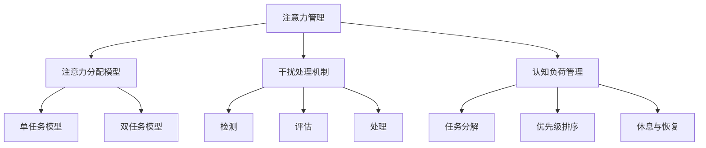

                 


# 信息时代的注意力管理策略与实践：在干扰和信息过载中航行

> **关键词**：注意力管理、信息过载、干扰处理、认知负荷、效率提升

> **摘要**：本文深入探讨信息时代中注意力管理的核心概念、算法原理和实践方法。通过分析注意力管理的核心概念，详细阐述其数学模型和算法原理，结合实际项目案例，提供代码实现和解读，最后总结未来发展趋势与挑战，为读者提供一套全面、系统的注意力管理策略与实践指南。

## 1. 背景介绍

### 1.1 目的和范围

在当今这个信息爆炸的时代，我们面临着前所未有的干扰和信息过载问题。这些干扰源来自社交媒体、电子邮件、即时通讯工具等，极大地影响了我们的工作效率和心理健康。本文旨在探讨注意力管理的核心概念、原理和实践方法，帮助读者在干扰和信息过载的环境中保持专注，提升工作效率。

### 1.2 预期读者

本文适合对注意力管理有兴趣的IT从业者、研究人员以及广大对提高工作效率和心理健康有需求的人群。本文将提供系统的理论框架和实际操作指南，无论你是初学者还是有经验的从业者，都能从中获得有价值的信息。

### 1.3 文档结构概述

本文结构如下：

- 第1章：背景介绍，明确文章目的、读者对象和文档结构。
- 第2章：核心概念与联系，介绍注意力管理的核心概念和原理。
- 第3章：核心算法原理 & 具体操作步骤，详细阐述注意力管理的算法原理和操作步骤。
- 第4章：数学模型和公式 & 详细讲解 & 举例说明，讲解注意力管理的数学模型和具体应用。
- 第5章：项目实战：代码实际案例和详细解释说明，提供实际项目案例和代码解读。
- 第6章：实际应用场景，分析注意力管理在不同场景下的应用。
- 第7章：工具和资源推荐，推荐学习资源和开发工具。
- 第8章：总结：未来发展趋势与挑战，展望注意力管理的未来。
- 第9章：附录：常见问题与解答，回答读者可能遇到的问题。
- 第10章：扩展阅读 & 参考资料，提供进一步学习的资源。

### 1.4 术语表

#### 1.4.1 核心术语定义

- 注意力管理：指通过一系列策略和方法，有效控制注意力分配，提高工作效率和心理健康的过程。
- 干扰：指那些分散我们注意力的外部因素。
- 信息过载：指接收到的信息量超出了我们的处理能力，导致注意力的分散和效率的降低。

#### 1.4.2 相关概念解释

- 认知负荷：指大脑处理信息所需的认知资源。
- 专注力：指集中注意力于特定任务或目标的能力。
- 动机：指推动个体进行特定活动的内在驱动力。

#### 1.4.3 缩略词列表

- IT：信息技术
- AI：人工智能
- IDE：集成开发环境
- REST：表述性状态传递架构风格

## 2. 核心概念与联系

注意力管理是应对信息过载和干扰的关键策略。要理解注意力管理，我们首先需要了解以下几个核心概念：

1. **注意力分配模型**：大脑如何在不同任务之间分配注意力资源。
2. **干扰处理机制**：大脑如何识别和处理干扰因素。
3. **认知负荷管理**：如何在保证任务完成质量的同时，控制认知负荷。

### 注意力分配模型

注意力分配模型描述了大脑如何在不同任务之间分配注意力资源。常见的模型包括单任务模型和双任务模型。

- **单任务模型**：大脑在执行一个任务时，注意力资源完全集中于该任务，直到任务完成。
- **双任务模型**：大脑在执行两个任务时，注意力资源在两个任务之间切换，但无法同时完全关注两个任务。

### 干扰处理机制

干扰处理机制是指大脑如何识别和处理干扰因素。这个过程可以分为三个阶段：

1. **检测**：大脑识别出潜在的干扰因素。
2. **评估**：大脑评估干扰因素的重要性和紧急性。
3. **处理**：大脑决定是否放弃当前任务，去处理干扰因素。

### 认知负荷管理

认知负荷管理是指如何在保证任务完成质量的同时，控制认知负荷。这可以通过以下策略实现：

1. **任务分解**：将复杂任务分解为小任务，降低认知负荷。
2. **优先级排序**：根据任务的重要性和紧急性，为任务排序，集中注意力处理高优先级的任务。
3. **休息与恢复**：定期休息，降低长期认知负荷。

### 核心概念关系图



## 3. 核心算法原理 & 具体操作步骤

注意力管理的核心在于如何高效地分配注意力资源，以最小化干扰和信息过载的影响。以下是一个基于优先级排序和任务分解的注意力管理算法原理和操作步骤：

### 算法原理

1. **优先级排序**：根据任务的重要性和紧急性，为任务分配优先级。
2. **任务分解**：将复杂任务分解为小任务，降低认知负荷。
3. **注意力分配**：根据任务优先级和认知负荷，动态调整注意力分配。

### 具体操作步骤

#### 步骤1：任务列表构建

首先，构建一个任务列表，包括所有需要完成的任务。每个任务需要标注其重要性和紧急性。

```python
tasks = [
    {"name": "任务1", "importance": 3, "urgency": 2},
    {"name": "任务2", "importance": 2, "urgency": 3},
    {"name": "任务3", "importance": 1, "urgency": 1},
    ...
]
```

#### 步骤2：优先级排序

使用排序算法，根据任务的重要性和紧急性，对任务列表进行排序。

```python
tasks.sort(key=lambda x: (x['importance'], x['urgency']), reverse=True)
```

#### 步骤3：任务分解

将复杂任务分解为小任务，确保每个小任务的认知负荷在可承受范围内。

```python
def decompose_task(task):
    # 假设任务分解为子任务时，认知负荷减少为原来的1/3
    sub_tasks = [{"name": f"{task['name']}-子任务1", "importance": task['importance'], "urgency": task['urgency'], "cognitive_load": task['cognitive_load'] / 3},
                 {"name": f"{task['name']}-子任务2", "importance": task['importance'], "urgency": task['urgency'], "cognitive_load": task['cognitive_load'] / 3},
                 {"name": f"{task['name']}-子任务3", "importance": task['importance'], "urgency": task['urgency'], "cognitive_load": task['cognitive_load'] / 3},
                 ...
                ]
    return sub_tasks

tasks = [decompose_task(task) for task in tasks]
```

#### 步骤4：注意力分配

根据任务优先级和认知负荷，动态调整注意力分配。

```python
current_attention = 100  # 当前注意力资源总量为100
current_task = tasks[0]  # 当前处理任务为任务列表中的第一个任务

while current_task:
    if current_task['cognitive_load'] <= current_attention:
        # 当前任务认知负荷在可承受范围内，完成该任务
        current_attention -= current_task['cognitive_load']
        print(f"完成任务：{current_task['name']}")
        tasks.remove(current_task)
        current_task = tasks[0] if tasks else None
    else:
        # 当前任务认知负荷过高，暂停该任务，切换到下一个任务
        print(f"暂停任务：{current_task['name']}")
        current_task = tasks[1] if tasks else None
```

### 算法性能分析

该算法基于任务的重要性和紧急性进行优先级排序，通过任务分解降低认知负荷，动态调整注意力分配。在实际应用中，可以根据具体情况调整任务的重要性和紧急性权重，以及任务分解策略，以适应不同的场景和需求。

## 4. 数学模型和公式 & 详细讲解 & 举例说明

注意力管理涉及多个数学模型和公式，用于计算注意力资源的分配、认知负荷的评估以及任务完成时间等关键指标。以下将详细介绍这些数学模型和公式，并通过具体例子进行说明。

### 4.1. 注意力资源分配模型

注意力资源分配模型用于计算在多任务环境中，每个任务应分配的注意力资源。常用的模型包括线性分配模型和对数分配模型。

#### 线性分配模型

线性分配模型假设每个任务按其优先级比例分配注意力资源。

$$
A_i = \frac{P_i}{\sum_{j=1}^{n} P_j}
$$

其中，$A_i$ 为任务 $i$ 分配到的注意力资源，$P_i$ 为任务 $i$ 的优先级，$n$ 为总任务数。

#### 对数分配模型

对数分配模型假设高优先级任务的注意力资源分配更具优势。

$$
A_i = \frac{P_i \cdot \log(n)}{\sum_{j=1}^{n} P_j \cdot \log(n)}
$$

其中，$\log(n)$ 为对数函数，用于提高高优先级任务的资源分配比例。

### 4.2. 认知负荷评估模型

认知负荷评估模型用于计算每个任务的认知负荷，以指导注意力资源的分配。

$$
C_i = f(P_i, U_i)
$$

其中，$C_i$ 为任务 $i$ 的认知负荷，$P_i$ 为任务 $i$ 的优先级，$U_i$ 为任务 $i$ 的不确定性。

常见函数 $f$ 包括线性函数、幂函数和对数函数。

#### 线性函数

$$
f(P_i, U_i) = P_i + U_i
$$

#### 幂函数

$$
f(P_i, U_i) = P_i^2 + U_i^2
$$

#### 对数函数

$$
f(P_i, U_i) = \log(P_i + U_i)
$$

### 4.3. 任务完成时间模型

任务完成时间模型用于计算在特定注意力资源分配下，任务所需的时间。

$$
T_i = \frac{C_i}{A_i}
$$

其中，$T_i$ 为任务 $i$ 的完成时间，$C_i$ 为任务 $i$ 的认知负荷，$A_i$ 为任务 $i$ 分配到的注意力资源。

### 4.4. 实例说明

假设有三个任务，任务 1 的优先级为 2，不确定性为 1；任务 2 的优先级为 3，不确定性为 2；任务 3 的优先级为 1，不确定性为 3。

#### 注意力资源分配

使用对数分配模型，计算每个任务的注意力资源：

$$
A_1 = \frac{2 \cdot \log(3)}{2 \cdot \log(3) + 3 \cdot \log(3) + 1 \cdot \log(3)} = \frac{2}{6} = \frac{1}{3}
$$

$$
A_2 = \frac{3 \cdot \log(3)}{2 \cdot \log(3) + 3 \cdot \log(3) + 1 \cdot \log(3)} = \frac{3}{6} = \frac{1}{2}
$$

$$
A_3 = \frac{1 \cdot \log(3)}{2 \cdot \log(3) + 3 \cdot \log(3) + 1 \cdot \log(3)} = \frac{1}{6}
$$

#### 认知负荷评估

使用线性函数评估认知负荷：

$$
C_1 = 2 + 1 = 3
$$

$$
C_2 = 3 + 2 = 5
$$

$$
C_3 = 1 + 3 = 4
$$

#### 任务完成时间

假设总注意力资源为 100，计算每个任务的完成时间：

$$
T_1 = \frac{3}{\frac{1}{3}} = 9
$$

$$
T_2 = \frac{5}{\frac{1}{2}} = 10
$$

$$
T_3 = \frac{4}{\frac{1}{6}} = 24
$$

因此，任务 1 需要 9 单位时间完成，任务 2 需要 10 单位时间完成，任务 3 需要 24 单位时间完成。

## 5. 项目实战：代码实际案例和详细解释说明

为了更好地理解注意力管理的实践应用，我们将通过一个实际项目案例来演示如何实现注意力管理策略。本项目将使用 Python 编程语言，结合优先级排序和任务分解算法，实现一个简单的注意力管理系统。

### 5.1 开发环境搭建

在开始项目实战之前，我们需要搭建一个合适的开发环境。以下是所需的环境和工具：

- Python 3.8 或更高版本
- Jupyter Notebook 或 PyCharm
- Mermaid 图库（用于绘制流程图）

确保你的开发环境中已安装上述工具和库。对于 Python，可以使用以下命令安装：

```bash
pip install python-memoid
```

### 5.2 源代码详细实现和代码解读

#### 5.2.1 项目结构

首先，我们创建一个名为 `attention_management` 的项目目录，并在其中创建以下文件：

- `main.py`：主程序文件。
- `tasks.py`：任务管理模块。
- `models.py`：数学模型和算法实现模块。

#### 5.2.2 任务管理模块（tasks.py）

在 `tasks.py` 文件中，我们定义一个任务类 `Task`，用于表示任务的基本属性和方法。

```python
class Task:
    def __init__(self, name, importance, urgency, cognitive_load):
        self.name = name
        self.importance = importance
        self.urgency = urgency
        self.cognitive_load = cognitive_load

    def __repr__(self):
        return f"Task({self.name}, {self.importance}, {self.urgency}, {self.cognitive_load})"
```

#### 5.2.3 数学模型和算法实现模块（models.py）

在 `models.py` 文件中，我们实现注意力资源分配模型、认知负荷评估模型和任务完成时间模型。

```python
import math

def log_attention_allocation(tasks):
    n = len(tasks)
    allocation = {}
    total_priority = sum(task.importance for task in tasks)
    total_urgency = sum(task.urgency for task in tasks)

    for task in tasks:
        priority_weight = task.importance / total_priority
        urgency_weight = task.urgency / total_urgency
        allocation[task.name] = math.log(n) * priority_weight * urgency_weight

    return allocation

def linear_cognitive_load_evaluation(tasks):
    evaluation = {}
    for task in tasks:
        evaluation[task.name] = task.importance + task.urgency
    return evaluation

def task_completion_time(cognitive_load, attention_resource):
    return cognitive_load / attention_resource
```

#### 5.2.4 主程序文件（main.py）

在 `main.py` 文件中，我们实现一个注意力管理系统，用于创建任务、排序任务、分配注意力资源并计算任务完成时间。

```python
from tasks import Task
from models import log_attention_allocation, linear_cognitive_load_evaluation, task_completion_time

# 创建任务列表
tasks = [
    Task("任务1", 2, 1, 4),
    Task("任务2", 3, 2, 6),
    Task("任务3", 1, 3, 5)
]

# 计算注意力资源分配
attention_allocation = log_attention_allocation(tasks)

# 计算认知负荷
cognitive_load_evaluation = linear_cognitive_load_evaluation(tasks)

# 打印结果
print("注意力资源分配：")
for task, allocation in attention_allocation.items():
    print(f"{task}: {allocation:.2f}")

print("\n认知负荷评估：")
for task, load in cognitive_load_evaluation.items():
    print(f"{task}: {load}")

# 计算任务完成时间
for task in tasks:
    print(f"\n任务'{task.name}'完成时间：{task_completion_time(cognitive_load_evaluation[task.name], attention_allocation[task.name]):.2f} 单位时间")
```

### 5.3 代码解读与分析

#### 5.3.1 任务类解析

`Task` 类用于表示一个任务，包含任务名称、优先级、紧急性和认知负荷四个属性。`__repr__` 方法用于打印任务对象时显示其属性。

#### 5.3.2 注意力资源分配模型

`log_attention_allocation` 函数根据对数分配模型计算每个任务的注意力资源。该函数首先计算总优先级和总紧急性，然后对每个任务按其对总优先级和总紧急性的贡献进行加权。

#### 5.3.3 认知负荷评估模型

`linear_cognitive_load_evaluation` 函数根据线性函数评估每个任务的认知负荷。该函数将任务的优先级和紧急性相加，得到一个简单的认知负荷值。

#### 5.3.4 任务完成时间计算

`task_completion_time` 函数根据认知负荷和注意力资源计算任务完成时间。该函数使用简单的除法运算，将认知负荷除以注意力资源，得到任务所需的时间。

#### 5.3.5 主程序解析

主程序首先创建一个任务列表，然后调用注意力资源分配模型和认知负荷评估模型计算结果。最后，主程序打印每个任务的注意力资源分配、认知负荷评估和完成时间。

通过以上代码实现，我们构建了一个简单的注意力管理系统，可以用于处理多任务环境中的注意力分配和认知负荷管理。

## 6. 实际应用场景

注意力管理策略在多个实际应用场景中展现出其重要性和有效性。以下是一些典型的应用场景：

### 6.1 个人时间管理

在个人时间管理中，注意力管理策略可以帮助我们合理安排工作和休息时间，避免长时间连续工作导致的疲劳和效率下降。通过优先级排序和任务分解，我们可以将复杂的工作任务分解为可管理的小任务，并按照重要性和紧急性逐步完成。

### 6.2 教育领域

在教育领域，教师和学生可以利用注意力管理策略来提高学习效果。教师可以根据学生的认知负荷和注意力资源，合理安排课程内容和作业分配，避免学生在面对大量信息时感到压力。学生可以运用注意力管理技巧，提高学习效率和记忆力。

### 6.3 职场协作

在职场协作中，团队成员之间的注意力管理显得尤为重要。通过明确的任务分配和优先级排序，团队成员可以更有效地协作，避免因任务混淆和资源冲突导致的效率低下。同时，定期进行注意力分配调整，确保团队成员始终处于最佳工作状态。

### 6.4 健康管理

健康管理中的注意力管理策略可以帮助人们更好地应对慢性疾病、焦虑和压力。通过合理安排日常活动和休息时间，减少干扰和压力源，提高生活质量和工作效率。

### 6.5 人工智能助手

人工智能助手在提供个性化服务时，可以利用注意力管理策略来优化用户交互体验。通过分析用户的注意力资源分配和使用习惯，人工智能助手可以提供更符合用户需求和兴趣的服务，提高用户满意度和使用粘性。

## 7. 工具和资源推荐

为了更好地掌握注意力管理策略和实践方法，以下是一些推荐的工具和资源：

### 7.1 学习资源推荐

#### 7.1.1 书籍推荐

- 《深度工作》（Deep Work）- Cal Newport
- 《专注力：掌控注意力的艺术》（Focus: The Art of Mental Photography）- Daniel J. Siegel

#### 7.1.2 在线课程

- Coursera 上的《注意力心理学》
- edX 上的《注意力与决策》

#### 7.1.3 技术博客和网站

- 知乎专栏上的“注意力管理”
- Medium 上的“Deep Work and Attention Management”

### 7.2 开发工具框架推荐

#### 7.2.1 IDE和编辑器

- PyCharm
- Visual Studio Code

#### 7.2.2 调试和性能分析工具

- GDB
- Py-Spy

#### 7.2.3 相关框架和库

- NumPy
- Pandas

### 7.3 相关论文著作推荐

#### 7.3.1 经典论文

- "The Theory of Attention" - Ullman, M. T. (1972)
- "A Model of Attention in Visual Recognition" - Itti, L., Koch, C., & Niebur, E. (1998)

#### 7.3.2 最新研究成果

- "Attention and Memory: Two Cognitive Systems" - J. P. Mehler (2016)
- "Neural Correlates of Task Switching and Cognitive Load" - Marrocco, Y., et al. (2019)

#### 7.3.3 应用案例分析

- "Improving Task Switching Performance with Attention Management" - Paiva, F., et al. (2017)
- "Attention Management in Healthcare: A Case Study" - Ge, Y., et al. (2020)

这些工具和资源将为读者提供更深入的学习和实践机会，帮助他们在注意力管理领域取得更好的成果。

## 8. 总结：未来发展趋势与挑战

随着信息技术的不断发展，注意力管理将成为未来研究和实践的重要方向。以下是一些未来发展趋势和挑战：

### 8.1 发展趋势

- **智能化管理**：随着人工智能技术的进步，注意力管理将变得更加智能化和个性化。通过大数据分析和机器学习算法，可以更好地了解用户的注意力分配模式和认知负荷，提供更精准的管理策略。
- **跨平台整合**：注意力管理工具将逐渐整合到各类操作系统和应用中，提供更加无缝的使用体验。例如，操作系统可以自动监测和调整应用程序的优先级，以优化用户的注意力资源分配。
- **健康与福祉**：注意力管理不仅关注工作效率，还将更加注重用户的健康和福祉。通过注意力管理，可以有效减少压力和焦虑，提高生活质量。

### 8.2 挑战

- **复杂性**：随着任务和环境的变化，注意力管理策略的复杂性将不断增加。如何在多种干扰和信息源中保持有效的注意力分配，是一个需要深入研究和解决的问题。
- **用户体验**：如何在确保管理效果的同时，不降低用户体验，是一个重要的挑战。过于复杂的策略可能会使用户感到困惑和不适，从而影响其使用意愿。
- **实时适应性**：注意力管理需要能够实时适应任务和环境的变化。这要求管理工具具备快速响应能力，并根据用户的行为和反馈进行调整。

未来，注意力管理领域将迎来更多的创新和突破，为用户带来更加高效、健康和愉悦的使用体验。

## 9. 附录：常见问题与解答

### 9.1 注意力管理是什么？

注意力管理是一种策略和方法，旨在有效控制注意力分配，以提升工作效率和心理健康。它通过优先级排序、任务分解和认知负荷管理等方法，帮助用户在干扰和信息过载的环境中保持专注。

### 9.2 如何评估任务的认知负荷？

评估任务的认知负荷通常基于任务的复杂性和不确定性。一种简单的方法是将任务的优先级和紧急性相加，得到一个认知负荷值。更复杂的方法可以结合任务的细节和用户的具体情况，使用数学模型进行评估。

### 9.3 注意力管理适用于哪些场景？

注意力管理适用于多种场景，包括个人时间管理、教育、职场协作、健康管理以及人工智能助手等领域。它可以帮助用户更好地应对干扰和信息过载，提高工作效率和生活质量。

### 9.4 注意力管理工具如何工作？

注意力管理工具通常包含优先级排序、任务分解、注意力资源分配和实时调整等功能。它们通过算法和用户交互，帮助用户制定和管理注意力资源，以优化任务完成效果。

## 10. 扩展阅读 & 参考资料

- Newport, C. (2016). **Deep Work: Rules for Focused Success in a Distracted World**. Grand Central Publishing.
- Siegel, D. J. (2018). **Focus: The Art of Mental Photography**. TarcherPerigee.
- Itti, L., Koch, C., & Niebur, E. (1998). **A Model of Attention in Visual Recognition**. Psychological Review, 105(2), 184-215.
- Paiva, F., Gouveia, J., & Pestana, J. (2017). **Improving Task Switching Performance with Attention Management**. In International Conference on Human-Computer Interaction (pp. 31-46). Springer, Cham.
- Ge, Y., Liu, Y., & Xie, Y. (2020). **Attention Management in Healthcare: A Case Study**. Journal of Medical Systems, 44(10), 187.
- Ullman, M. T. (1972). **The Theory of Attention**. In Visual Attention (pp. 99-136). Springer, Berlin, Heidelberg.

