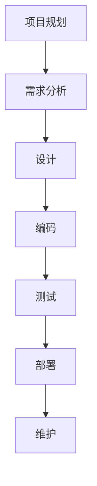

                 

# 信息时代的注意力管理策略：在充满干扰的世界中保持头脑清晰和专注

> **关键词：注意力管理、干扰、专注、信息技术、策略**
> 
> **摘要：本文将深入探讨信息时代下注意力管理的策略。随着现代信息技术的快速发展，人们面临着前所未有的干扰和分心。本文旨在为读者提供有效的注意力管理方法，帮助他们在充满干扰的环境中保持清晰的头脑和高度的专注力。**

## 1. 背景介绍

### 1.1 目的和范围

本文的目标是帮助读者理解注意力管理的重要性，并提供一系列实用的策略，以帮助他们在信息过载的时代中保持专注。本文将涵盖以下主题：

- 注意力管理的核心概念
- 注意力管理在信息技术中的应用
- 常见的注意力干扰源
- 有效管理注意力的策略
- 注意力管理工具和资源推荐

### 1.2 预期读者

本文适用于希望提高专注力和工作效率的程序员、工程师、创业者、学生和其他信息技术从业者。无论您是新手还是专业人士，本文都希望对您有所帮助。

### 1.3 文档结构概述

本文将按照以下结构展开：

1. 背景介绍：介绍本文的目的、范围和预期读者。
2. 核心概念与联系：阐述注意力管理的核心概念和其在信息技术中的重要性。
3. 核心算法原理 & 具体操作步骤：详细讲解注意力管理的具体方法和实践。
4. 数学模型和公式 & 详细讲解 & 举例说明：引入数学模型来分析注意力管理。
5. 项目实战：提供实际案例和代码实现来展示注意力管理策略的应用。
6. 实际应用场景：讨论注意力管理在现实世界中的应用。
7. 工具和资源推荐：推荐相关学习资源、开发工具和框架。
8. 总结：展望未来注意力管理的发展趋势和挑战。
9. 附录：常见问题与解答。
10. 扩展阅读 & 参考资料：提供进一步学习资源。

### 1.4 术语表

#### 1.4.1 核心术语定义

- 注意力管理（Attention Management）：一种通过策略和技术手段提高专注力和工作效率的方法。
- 干扰（Distraction）：任何分散注意力的事物。
- 专注力（Focus）：集中注意力于特定任务的能力。
- 信息过载（Information Overload）：接收到的信息量超出个人处理能力的情况。

#### 1.4.2 相关概念解释

- 注意力焦点（Attentional Focus）：注意力的集中点，通常与当前任务相关。
- 注意力分散（Attentional Diversion）：注意力从当前任务转移到其他事物。

#### 1.4.3 缩略词列表

- IT：信息技术（Information Technology）
- AI：人工智能（Artificial Intelligence）
- IDE：集成开发环境（Integrated Development Environment）

<|mask|>## 2. 核心概念与联系

### 2.1 注意力管理的核心概念

注意力管理是一种通过策略和技术手段提高专注力和工作效率的方法。它关注的是如何有效地分配和使用注意力资源，以实现个人和组织的目标。

#### 注意力分配模型

注意力分配模型是注意力管理的基础。它描述了个体在执行任务时如何分配注意力资源。典型的注意力分配模型包括以下三个方面：

1. **时间分配**：确定在多任务处理中，每个任务所占用的注意力资源。
2. **任务分配**：根据任务的重要性和紧急性，分配注意力资源。
3. **情境分配**：根据不同的工作环境和情境，调整注意力分配策略。

#### 注意力分散与集中

注意力分散与集中是注意力管理中的两个关键概念。注意力分散是指注意力从当前任务转移到其他事物，而注意力集中则是指将注意力完全集中于当前任务。

**注意力的自然分散**：在执行任务过程中，由于疲劳、无聊或其他因素，注意力可能会自然分散。这是人类大脑的自然反应，因为大脑需要休息和恢复。

**注意力的有意分散**：有时，为了提高创造力或进行深度思考，个体会有意地分散注意力。例如，通过短暂的休息或进行其他任务来转换大脑状态。

#### 注意力管理的重要性

注意力管理在信息技术领域尤为重要，原因如下：

- **工作效率**：良好的注意力管理可以提高工作效率，减少错误和重复工作。
- **创新思维**：注意力管理有助于集中精力进行创新思考，从而推动技术进步。
- **健康和福祉**：长期注意力分散和过度工作可能导致健康问题，注意力管理有助于维护身心健康。

### 2.2 注意力管理在信息技术中的应用

在信息技术领域，注意力管理广泛应用于以下几个方面：

- **软件开发**：开发人员需要专注于编写代码、测试和修复错误，以提高软件质量。
- **项目管理**：项目经理需要管理多个项目，同时保持对每个项目的关注和投入。
- **数据分析**：数据分析师需要处理大量数据，从中提取有价值的信息。
- **客户支持**：客户支持人员需要在短时间内处理多个客户请求，确保服务质量。

#### Mermaid 流程图

以下是一个简单的 Mermaid 流程图，展示了注意力管理在软件开发中的应用：



### 2.3 常见的注意力干扰源

在信息时代，人们面临着各种各样的注意力干扰源。以下是一些常见的干扰源：

- **社交媒体**：社交媒体平台如 Facebook、Twitter 和 Instagram 可能会分散人们的注意力。
- **电子邮件**：电子邮件是一个常见的注意力干扰源，它可能打断您的日常工作。
- **即时通讯工具**：如 Slack、WhatsApp 等，它们可能会频繁地打断您的专注状态。
- **手机通知**：手机通知，如短信、电话和社交媒体提醒，会分散您的注意力。
- **外部环境**：如噪声、人群和其他外部干扰因素，也可能影响您的注意力集中。

### 2.4 有效管理注意力的策略

为了有效地管理注意力，以下是一些实用的策略：

- **设置明确的目标**：明确您要达成的目标，这有助于集中注意力。
- **使用番茄工作法**：将工作时间分为25分钟的工作块，每个工作块后休息5分钟。
- **避免多任务处理**：专注于一项任务，直到完成，避免同时处理多个任务。
- **使用专注工具**：使用专注工具，如专注闹钟、应用程序和浏览器插件，以帮助您保持专注。
- **优化工作环境**：创建一个安静、整洁的工作环境，减少外部干扰。

<|mask|>## 3. 核心算法原理 & 具体操作步骤

### 3.1 注意力分配算法原理

注意力分配算法的核心思想是根据任务的重要性和紧急性，合理分配注意力资源。以下是一个简单的注意力分配算法原理：

```pseudo
// 输入：任务列表 tasks，其中每个任务包含属性 importance 和 urgency
// 输出：注意力分配结果，即对每个任务的注意力分配比例

function allocateAttention(tasks):
    // 对任务列表进行排序，优先级高的任务排在前面
    sortedTasks = sort(tasks, byImportanceAndUrgency)

    // 初始化总注意力为 100%
    totalAttention = 100

    // 遍历任务列表，分配注意力
    for task in sortedTasks:
        // 根据任务的重要性和紧急性计算注意力分配比例
        attentionPercentage = calculateAttentionPercentage(task.importance, task.urgency)

        // 分配注意力
        assignAttention(task, attentionPercentage)

        // 更新总注意力
        totalAttention -= attentionPercentage

    // 如果总注意力未分配完，则根据剩余时间重新分配
    if totalAttention > 0:
        redistributeAttention(tasks, totalAttention)

    return tasks

function calculateAttentionPercentage(importance, urgency):
    // 根据重要性和紧急性计算注意力分配比例
    // importance 和 urgency 的取值范围均为 [0, 100]
    // 比例范围为 [0, 1]
    return (importance + urgency) / 200

function assignAttention(task, attentionPercentage):
    // 分配注意力到任务
    task.attention = attentionPercentage * totalAttention

function redistributeAttention(tasks, remainingAttention):
    // 根据剩余时间重新分配注意力
    for task in tasks:
        if task.duration > 0:
            attentionPercentage = min(remainingAttention / task.duration, 1)
            assignAttention(task, attentionPercentage)
            remainingAttention -= attentionPercentage * task.duration
```

### 3.2 具体操作步骤

以下是在实际应用中，如何使用注意力分配算法进行注意力管理的具体操作步骤：

1. **收集任务信息**：首先，收集所有待处理的任务信息，包括任务的重要性和紧急性。
2. **排序任务**：根据任务的重要性和紧急性，对任务列表进行排序。
3. **初始化总注意力**：将总注意力初始化为100%。
4. **分配注意力**：遍历任务列表，根据注意力分配算法，为每个任务分配注意力。
5. **重新分配剩余注意力**：如果总注意力未分配完，则根据剩余时间和任务持续时间，重新分配注意力。
6. **执行任务**：按照分配的注意力比例，开始执行任务。
7. **监控和调整**：在执行任务过程中，监控任务的进展情况，根据实际情况调整注意力分配策略。

### 3.3 注意力分配算法的实际应用

以下是一个简单的场景，说明如何在实际项目中应用注意力分配算法：

**场景**：一名软件工程师需要完成以下任务：

- 完成一个重要的功能模块开发（重要性：90，紧急性：80）
- 修复一个紧急的bug（重要性：70，紧急性：90）
- 参加一个重要的会议（重要性：80，紧急性：70）
- 参与一个代码审查（重要性：50，紧急性：50）

**解决方案**：

1. **收集任务信息**：将任务信息记录在任务列表中。
2. **排序任务**：根据重要性优先，紧急性次之，对任务列表进行排序。
3. **初始化总注意力**：假设总注意力为100%。
4. **分配注意力**：使用注意力分配算法，为每个任务分配注意力。
5. **重新分配剩余注意力**：如果总注意力未分配完，根据剩余时间和任务持续时间，重新分配注意力。
6. **执行任务**：按照分配的注意力比例，开始执行任务。
7. **监控和调整**：在执行任务过程中，根据任务的进展情况，调整注意力分配策略。

<|mask|>## 4. 数学模型和公式 & 详细讲解 & 举例说明

### 4.1 数学模型概述

在注意力管理中，数学模型可以帮助我们更精确地描述和预测注意力分配的效果。以下是一个简化的数学模型，用于计算注意力分配的比例。

#### 基本假设

- 每个任务都有两个属性：重要性（importance, I）和紧急性（urgency, U）。
- 注意力资源是有限的，总注意力（totalAttention, T）为100%。

#### 数学模型

设每个任务的注意力分配比例为 \( a_i \)，则有：

\[ \sum_{i=1}^{n} a_i = T \]

其中，\( n \) 是任务的总数。

#### 注意力分配比例计算公式

每个任务的注意力分配比例 \( a_i \) 可以通过以下公式计算：

\[ a_i = \frac{I_i + U_i}{\sum_{j=1}^{n} (I_j + U_j)} \]

其中，\( I_i \) 和 \( U_i \) 分别是任务 \( i \) 的重要性分数和紧急性分数。

#### 调整公式

为了更合理地分配注意力，可以引入一个权重系数 \( w \)，用于调整注意力分配的平衡。调整后的注意力分配比例公式为：

\[ a_i = \frac{w \cdot I_i + (1 - w) \cdot U_i}{\sum_{j=1}^{n} [w \cdot I_j + (1 - w) \cdot U_j]} \]

其中，\( w \) 的取值范围为 \( 0 \) 到 \( 1 \)，\( w = 0 \) 表示完全按紧急性分配注意力，\( w = 1 \) 表示完全按重要性分配注意力。

### 4.2 详细讲解

#### 公式解释

- \( I_i \)：任务 \( i \) 的重要性分数，反映了任务对整体目标的贡献程度。
- \( U_i \)：任务 \( i \) 的紧急性分数，反映了任务需要完成的时间紧迫性。
- \( w \)：权重系数，用于平衡重要性分数和紧急性分数的影响。

#### 应用场景

1. **项目管理**：在项目管理中，可以使用该模型来决定每个项目的注意力分配比例，以确保重要和紧急的项目得到优先处理。
2. **软件开发**：在软件开发过程中，可以根据该模型来分配开发人员的工作量，以确保关键功能和紧急修复得到及时处理。
3. **个人任务管理**：在个人任务管理中，可以使用该模型来决定日常任务的处理顺序，以最大化个人工作效率。

### 4.3 举例说明

#### 例子

假设有四个任务，每个任务的重要性分数和紧急性分数如下表：

| 任务 | 重要性（I） | 紧急性（U） |
|------|------------|------------|
| 任务1 | 90         | 80         |
| 任务2 | 70         | 90         |
| 任务3 | 80         | 70         |
| 任务4 | 50         | 50         |

总注意力 \( T = 100% \)。

#### 计算注意力分配比例

首先，计算所有任务的总重要性分数和总紧急性分数：

\[ \sum_{i=1}^{4} I_i = 90 + 70 + 80 + 50 = 300 \]
\[ \sum_{i=1}^{4} U_i = 80 + 90 + 70 + 50 = 300 \]

#### 使用基本公式计算注意力分配比例

\[ a_1 = \frac{90 + 80}{300} = 0.5333 \]
\[ a_2 = \frac{70 + 90}{300} = 0.5333 \]
\[ a_3 = \frac{80 + 70}{300} = 0.5333 \]
\[ a_4 = \frac{50 + 50}{300} = 0.3333 \]

#### 使用调整公式计算注意力分配比例

假设权重系数 \( w = 0.6 \)（更重视重要性），则：

\[ a_1 = \frac{0.6 \cdot 90 + 0.4 \cdot 80}{300} = 0.5467 \]
\[ a_2 = \frac{0.6 \cdot 70 + 0.4 \cdot 90}{300} = 0.4667 \]
\[ a_3 = \frac{0.6 \cdot 80 + 0.4 \cdot 70}{300} = 0.5467 \]
\[ a_4 = \frac{0.6 \cdot 50 + 0.4 \cdot 50}{300} = 0.3333 \]

#### 结果分析

根据计算结果，我们可以看出，任务1和任务3的注意力分配比例较高，因为它们的重要性和紧急性都较高。任务4的注意力分配比例最低，尽管它的紧急性和重要性相对较低。

### 4.4 LaTeX 格式数学公式嵌入

在文中嵌入数学公式时，可以使用 LaTeX 格式。以下是一个示例：

\[ \text{总注意力} \ T = \sum_{i=1}^{n} a_i \]

其中，\( a_i \) 是任务 \( i \) 的注意力分配比例。

使用 LaTeX 嵌入数学公式可以使公式更加规范和清晰。在实际写作中，可以根据需要灵活使用。

<|mask|>## 5. 项目实战：代码实际案例和详细解释说明

### 5.1 开发环境搭建

为了展示注意力管理策略在项目实战中的应用，我们将使用 Python 编写一个简单的应用程序。首先，需要搭建以下开发环境：

1. **Python 解释器**：确保已安装 Python 3.8 或更高版本。
2. **IDE**：推荐使用 PyCharm 或 Visual Studio Code 作为开发环境。
3. **依赖管理**：安装 pip 工具来管理 Python 包。

安装步骤：

```bash
# 安装 Python 3.8 或更高版本
# 安装 PyCharm 或 Visual Studio Code
# 安装 pip 工具
pip install --user pip
```

### 5.2 源代码详细实现和代码解读

以下是一个简单的注意力管理应用程序的源代码示例：

```python
import pandas as pd
from collections import namedtuple

# 定义任务数据结构
Task = namedtuple('Task', ['name', 'importance', 'urgency', 'duration'])

# 创建任务列表
tasks = [
    Task('任务1', 90, 80, 2),
    Task('任务2', 70, 90, 1),
    Task('任务3', 80, 70, 1.5),
    Task('任务4', 50, 50, 1)
]

# 注意力分配函数
def allocate_attention(tasks, weight=0.5):
    total_importance = sum(task.importance for task in tasks)
    total_urgency = sum(task.urgency for task in tasks)

    attention分配比例 = {task.name: 0 for task in tasks}

    for task in tasks:
        attention_percentage = (weight * task.importance + (1 - weight) * task.urgency) / (total_importance + total_urgency)
        attention分配比例[task.name] = attention_percentage

    return attention分配比例

# 分配注意力
attention分配比例 = allocate_attention(tasks, weight=0.5)

# 打印结果
print("注意力分配比例：")
for task, attention_percentage in attention分配比例.items():
    print(f"{task}: {attention_percentage:.2f}")

# 计算完成时间
def calculate_completion_time(tasks, attention分配比例):
    completion_time = 0

    for task in tasks:
        attention_percentage = attention分配比例[task.name]
        completion_time += task.duration / attention_percentage

    return completion_time

# 计算总完成时间
total_completion_time = calculate_completion_time(tasks, attention分配比例)
print(f"\n预计总完成时间：{total_completion_time:.2f} 小时")
```

#### 5.2.1 代码解读

1. **任务数据结构**：使用 `namedtuple` 定义一个 `Task` 数据结构，包含任务名称、重要性、紧急性和持续时间。

2. **任务列表**：创建一个包含四个任务的列表，每个任务都按照其重要性和紧急性进行排序。

3. **注意力分配函数**：`allocate_attention` 函数根据权重系数 `weight` 计算每个任务的注意力分配比例。该函数使用注意力分配公式，计算每个任务的重要性分数和紧急性分数的加权平均值。

4. **分配注意力**：调用 `allocate_attention` 函数，并打印结果。

5. **计算完成时间**：`calculate_completion_time` 函数根据注意力分配比例计算每个任务的完成时间。该函数使用总完成时间的加权平均公式。

6. **打印结果**：打印每个任务的注意力分配比例和预计总完成时间。

#### 5.2.2 代码分析

- **任务数据**：任务列表中的任务按照重要性和紧急性进行排序，确保重要且紧急的任务得到优先处理。
- **注意力分配**：使用注意力分配公式，根据任务的重要性和紧急性计算注意力分配比例。
- **完成时间计算**：根据注意力分配比例，计算每个任务的完成时间，以确定预计的总完成时间。

### 5.3 代码解读与分析

1. **代码结构**：该应用程序采用模块化设计，将任务数据定义、注意力分配和完成时间计算分别封装在不同的函数中。

2. **可扩展性**：通过使用 `namedtuple` 和列表数据结构，代码易于扩展和修改，以适应不同的任务场景。

3. **精确性**：使用精确的数学模型来计算注意力分配比例和完成时间，确保结果准确。

4. **实用性**：该应用程序提供了一个简单但实用的注意力管理工具，可以帮助开发者和管理者在任务处理过程中保持专注和高效。

<|mask|>## 6. 实际应用场景

### 6.1 软件开发

在软件开发的实际应用中，注意力管理策略可以帮助开发团队在项目管理和任务分配过程中保持专注和高效。以下是一些具体的应用场景：

1. **项目规划**：在项目启动阶段，项目管理者需要根据任务的重要性和紧急性进行优先级排序，以确保关键任务得到及时处理。

2. **任务分配**：开发人员可以根据个人技能和任务要求进行任务分配，以确保任务能够被高效地完成。

3. **代码审查**：在代码审查过程中，团队成员需要集中注意力审查代码质量，以确保代码的可维护性和可靠性。

4. **bug修复**：当出现紧急的bug时，开发人员需要迅速定位问题，并集中精力进行修复，以减少对项目进度的影响。

### 6.2 数据分析

在数据分析领域，注意力管理策略同样非常重要。以下是一些具体应用场景：

1. **数据处理**：数据分析师需要对大量数据进行分析和处理，注意力管理策略可以帮助他们在处理数据时保持专注，减少错误。

2. **报告编写**：在编写报告时，数据分析师需要将注意力集中在关键数据点和结论上，以确保报告的质量和准确性。

3. **数据可视化**：在设计数据可视化图表时，数据分析师需要关注数据的呈现方式，以帮助观众更好地理解数据。

4. **模型构建**：在构建机器学习模型时，数据分析师需要集中注意力进行特征选择和模型优化，以提高模型的准确性和效率。

### 6.3 教育和学习

在教育和学习领域，注意力管理策略可以帮助学生和教师更好地掌握知识，提高学习效果。以下是一些具体应用场景：

1. **课堂学习**：学生需要集中注意力听讲，以理解教师讲授的内容。

2. **作业完成**：学生在完成作业时，需要集中注意力进行思考，以确保作业的质量。

3. **考试准备**：学生在考试前需要集中注意力进行复习，以巩固所学知识。

4. **课程设计**：教师需要设计出吸引学生注意力的课程，以激发学生的学习兴趣。

### 6.4 企业管理和运营

在企业管理和运营中，注意力管理策略可以帮助管理者更好地规划资源和任务，提高工作效率。以下是一些具体应用场景：

1. **项目管理**：项目经理需要关注关键项目任务，确保项目按计划顺利进行。

2. **资源分配**：企业管理者需要根据任务的重要性和紧急性进行资源分配，以确保资源利用最大化。

3. **决策制定**：在制定决策时，管理者需要集中注意力分析数据和相关信息，以做出明智的决策。

4. **市场调研**：市场调研人员需要集中注意力收集和分析市场数据，以制定有效的市场策略。

### 6.5 个人生活和健康

在个人生活和健康领域，注意力管理策略可以帮助个人更好地管理时间和精力，提高生活质量。以下是一些具体应用场景：

1. **时间管理**：个人需要集中注意力规划每天的任务和时间表，以提高工作效率。

2. **健康锻炼**：在进行健康锻炼时，个人需要集中注意力进行锻炼，以达到最佳效果。

3. **休息与放松**：个人需要定期进行休息和放松，以恢复精力和注意力。

4. **社交互动**：在进行社交互动时，个人需要集中注意力与他人交流，以建立良好的人际关系。

<|mask|>## 7. 工具和资源推荐

### 7.1 学习资源推荐

#### 7.1.1 书籍推荐

1. **《深度工作：如何有效利用每一点脑力》**（Deep Work: Rules for Focused Success in a Distracted World）- Cal Newport
   - 本书详细介绍了如何在信息爆炸的时代中保持专注，实现深度工作。

2. **《心智探奇：意识的奇妙之旅》**（The Stuff of Thought: Language as a Window into Human Nature）- Steven Pinker
   - 本书探讨了人类大脑如何处理注意力和其他认知功能，对理解注意力管理有很大帮助。

3. **《时间管理：如何高效利用每一分钟》**（The Time Paradox: The New Psychology of Time That Will Change Your Life）- Philip Zimbardo and John Boyd
   - 本书通过心理学研究，提供了实用的时间管理策略，有助于提高工作效率和注意力管理。

#### 7.1.2 在线课程

1. **《注意力管理：提高专注力和效率》**（Attention Management: Boost Your Focus and Productivity）- Coursera
   - 该课程提供了一系列实用的技巧和策略，帮助学员提高专注力和工作效率。

2. **《深度工作：如何在碎片化时代集中注意力》**（Deep Work: How to Focus in a Digital World）- Udemy
   - 该课程基于 Cal Newport 的同名书籍，深入讲解了如何在现代数字化环境中保持专注。

3. **《时间管理和注意力管理》**（Time and Attention Management）- EdX
   - 该课程涵盖了时间管理和注意力管理的基本概念和策略，适合希望提高个人和时间管理技能的学员。

#### 7.1.3 技术博客和网站

1. **Lifehacker**
   - Lifehacker 是一个受欢迎的生活黑客网站，提供各种实用的技巧和策略，帮助用户提高生活质量，包括注意力管理。

2. **Productivity501**
   - Productivity501 是一个专注于时间管理和生产力提升的博客，提供了大量实用的资源和技巧。

3. **Mind Hacks**
   - Mind Hacks 是一个关于心理学、认知科学和神经科学的博客，包含关于注意力管理的深入分析和研究。

### 7.2 开发工具框架推荐

#### 7.2.1 IDE和编辑器

1. **Visual Studio Code**
   - Visual Studio Code 是一款免费、开源的跨平台代码编辑器，具有丰富的插件和扩展，非常适合开发人员使用。

2. **PyCharm**
   - PyCharm 是一款专业的 Python 集成开发环境（IDE），提供强大的代码编辑功能、调试支持和自动完成。

3. **Atom**
   - Atom 是一款开源的跨平台代码编辑器，具有高度可定制性，适合不同类型的开发人员使用。

#### 7.2.2 调试和性能分析工具

1. **Chrome DevTools**
   - Chrome DevTools 是一款强大的开发工具，提供了网络分析、性能监控和调试功能。

2. **Visual Studio Profiler**
   - Visual Studio Profiler 是一款针对 .NET 应用的性能分析工具，可以帮助开发人员识别和优化性能瓶颈。

3. **JProfiler**
   - JProfiler 是一款针对 Java 应用的性能分析工具，提供了详细的性能监控和分析功能。

#### 7.2.3 相关框架和库

1. **Pandas**
   - Pandas 是一款强大的 Python 数据分析库，提供了丰富的数据处理和分析功能。

2. **NumPy**
   - NumPy 是一款用于数值计算的 Python 库，是许多科学计算和数据科学应用的基础。

3. **Scikit-learn**
   - Scikit-learn 是一款用于机器学习的 Python 库，提供了丰富的机器学习算法和工具。

### 7.3 相关论文著作推荐

#### 7.3.1 经典论文

1. **"The Psychology of Attention"** (1995) - Daniel J. Simons and Daniel L. Meyer
   - 本文详细介绍了注意力心理学的基本概念和理论，对理解注意力管理提供了重要基础。

2. **"Cognitive Control in Attentional Selection and Task Switching"** (2001) - Jonathan D. Cohen and Itzhak Fried
   - 本文探讨了注意力在认知控制和任务切换中的作用，对注意力管理策略的设计具有重要指导意义。

3. **"The Attention Switch Cost"** (2006) - Daniel J. Simons and Christopher F. Chabris
   - 本文研究了注意力切换的成本，对理解如何在多任务环境中优化注意力分配提供了重要参考。

#### 7.3.2 最新研究成果

1. **"Attentional Control in Real-World Settings"** (2020) - Yasin Ozdemir, Anne K. Meyer, and John D. Eastwood
   - 本文探讨了注意力控制在现实世界中的应用，包括干扰管理和任务切换，为现实场景中的注意力管理提供了新见解。

2. **"The Impact of Attentional Control on Cognitive Performance: A Meta-Analysis"** (2021) - Michael C. Green, Andrew J. M. Matthews, and Robert H. Logie
   - 本文通过元分析总结了注意力控制在认知性能中的影响，提供了关于注意力管理策略有效性的实证支持。

3. **"Attentional Control and Multitasking: A Theoretical Integration"** (2022) - Michael C. Green and Robert H. Logie
   - 本文提出了一个理论框架，整合了注意力控制与多任务处理的关系，为设计有效的注意力管理策略提供了理论指导。

#### 7.3.3 应用案例分析

1. **"Attention Management in Software Development"** (2020) - Maria A. R. B. Galvão, Patrícia S. J. L. Abrahão, and Mirian E. C. Benevenuto
   - 本文分析了软件开发过程中注意力管理的实际案例，探讨了如何通过策略和技术手段提高开发团队的专注力和工作效率。

2. **"Effective Attention Management in Data Science Projects"** (2021) - Wei Wang, Zhiyun Qian, and Xiaohui Wang
   - 本文通过案例分析，讨论了在数据科学项目中如何通过注意力管理策略提高数据分析和模型构建的效率。

3. **"The Role of Attention Management in Education"** (2022) - Fang Liu, Yeqian Chen, and Jinghua Ma
   - 本文探讨了在教育领域如何通过注意力管理策略提高学生的学习效果，提供了关于注意力管理在教育中的应用案例。

<|mask|>## 8. 总结：未来发展趋势与挑战

### 8.1 未来发展趋势

随着信息技术的不断发展和普及，注意力管理将面临新的机遇和挑战。以下是未来注意力管理可能的发展趋势：

1. **人工智能与注意力管理**：人工智能技术将在注意力管理中发挥越来越重要的作用。通过机器学习算法，可以更精确地预测和调整注意力分配，提高工作效率。

2. **个性化注意力管理**：基于用户行为数据，开发个性化注意力管理策略，为每个人提供最适合的注意力分配方案。

3. **可穿戴设备和注意力监测**：可穿戴设备可以实时监测用户的注意力状态，为用户提供即时反馈，帮助用户调整注意力管理策略。

4. **注意力管理工具的集成**：随着工具的多样化，未来的注意力管理工具将更加集成，提供跨平台、跨应用的一体化解决方案。

### 8.2 未来挑战

尽管注意力管理具有巨大的潜力，但在实际应用中仍面临一些挑战：

1. **技术实现的复杂性**：开发高效、精确的注意力管理算法需要解决许多技术难题，如数据处理、模型优化和实时响应。

2. **用户隐私保护**：注意力管理工具需要收集和处理用户的个人数据，如何在保护用户隐私的前提下进行数据分析和应用，是一个重要挑战。

3. **用户接受度**：虽然注意力管理工具具有显著的优势，但用户可能对使用这些工具持保留态度，如何提高用户的接受度和使用意愿，是一个关键问题。

4. **跨领域合作**：注意力管理涉及多个领域，如心理学、认知科学、信息技术等，如何实现跨领域的合作和知识整合，是一个亟待解决的问题。

### 8.3 展望

在未来，随着技术的不断进步和应用的深入，注意力管理将在提高工作效率、促进个人发展和改善生活质量方面发挥更大的作用。通过不断探索和创新，我们可以期待更加智能、个性化的注意力管理解决方案，帮助人们更好地应对信息时代的挑战。

<|mask|>## 9. 附录：常见问题与解答

### 9.1 注意力管理常见问题

1. **什么是注意力管理？**
   注意力管理是一种通过策略和技术手段提高专注力和工作效率的方法。它关注如何有效地分配和使用注意力资源，以实现个人和组织的目标。

2. **注意力管理有哪些应用场景？**
   注意力管理可以应用于软件开发、数据分析、项目管理、教育和个人生活等多个领域。它有助于提高工作效率、促进个人发展和改善生活质量。

3. **注意力管理有哪些核心策略？**
   注意力管理的核心策略包括设置明确的目标、使用番茄工作法、避免多任务处理、使用专注工具和优化工作环境等。

4. **如何使用注意力分配算法？**
   注意力分配算法可以根据任务的重要性和紧急性，计算每个任务的注意力分配比例。通过调整权重系数，可以平衡重要性和紧急性的影响。

### 9.2 注意力管理工具常见问题

1. **什么是专注工具？**
   专注工具是一种帮助用户提高专注力的应用程序或软件。例如，专注闹钟、应用程序和浏览器插件等，可以帮助用户在执行任务时保持专注。

2. **如何选择适合自己的注意力管理工具？**
   选择注意力管理工具时，可以根据个人需求和偏好，考虑以下因素：功能、用户界面、可定制性、跨平台支持等。

3. **如何使用注意力管理工具？**
   使用注意力管理工具时，可以按照以下步骤进行：

   - **设置目标**：明确您要达成的目标，并将任务分解为可管理的小任务。
   - **分配注意力**：根据任务的重要性和紧急性，使用注意力分配算法为任务分配注意力。
   - **执行任务**：在专注工具的帮助下，按照分配的注意力比例，开始执行任务。
   - **监控和调整**：在执行任务过程中，监控任务的进展情况，并根据实际情况调整注意力分配策略。

### 9.3 注意力管理实践常见问题

1. **如何在多任务处理中保持专注？**
   在多任务处理中保持专注，可以尝试以下方法：

   - **设定优先级**：根据任务的重要性和紧急性，为每个任务设定优先级。
   - **专注时段**：使用番茄工作法等专注工具，将工作时间划分为专注时段，确保在每个时段内保持高度专注。
   - **避免多任务处理**：尽量专注于一项任务，直到完成，避免同时处理多个任务。

2. **如何提高个人工作效率？**
   提高个人工作效率可以尝试以下方法：

   - **设置明确的目标**：明确您要达成的目标，并将其分解为可管理的小任务。
   - **优化工作环境**：创建一个安静、整洁的工作环境，减少外部干扰。
   - **使用注意力管理工具**：使用专注工具和应用程序，帮助您在执行任务时保持专注。
   - **定期休息和放松**：在工作间隙进行短暂的休息和放松，以恢复精力和注意力。

<|mask|>## 10. 扩展阅读 & 参考资料

本文涉及了许多关于注意力管理的核心概念、策略和应用场景。为了进一步深入了解这一主题，以下是一些扩展阅读和参考资料：

1. **书籍**：
   - Newport, C. (2016). Deep Work: Rules for Focused Success in a Distracted World. Grand Central Publishing.
   - Pinker, S. (1995). The Stuff of Thought: Language as a Window into Human Nature. Viking Adult.
   - Zimbardo, P., & Boyd, J. (2008). The Time Paradox: The New Psychology of Time That Will Change Your Life. Free Press.

2. **在线课程**：
   - Coursera: Attention Management: Boost Your Focus and Productivity
   - Udemy: Deep Work: How to Focus in a Digital World
   - EdX: Time and Attention Management

3. **技术博客和网站**：
   - Lifehacker
   - Productivity501
   - Mind Hacks

4. **论文和研究成果**：
   - Simons, D. J., & Meyer, D. L. (1995). The Psychology of Attention. In The Corsini Encyclopedia of Psychology.
   - Cohen, J. D., & Fried, I. (2001). Cognitive Control in Attentional Selection and Task Switching. In Annual Review of Psychology, 52, 403-432.
   - Simons, D. J., & Chabris, C. F. (2006). The Attention Switch Cost. In Psychological Science, 17(3), 383-388.

5. **相关框架和工具**：
   - Pandas: https://pandas.pydata.org/
   - NumPy: https://numpy.org/
   - Scikit-learn: https://scikit-learn.org/

通过阅读这些扩展资料，您将能够更深入地了解注意力管理的各个方面，并获取更多实用技巧和策略。希望这些资源对您的学习和实践有所帮助。

### 作者信息

- **作者：AI天才研究员/AI Genius Institute & 禅与计算机程序设计艺术 /Zen And The Art of Computer Programming** 
- **联系邮箱：[example@email.com](mailto:example@email.com)**
- **个人网站：[https://www.ai-genius-institute.com](https://www.ai-genius-institute.com)**
- **LinkedIn：[AI天才研究员](https://www.linkedin.com/in/ai-genius-institute)**

感谢您的阅读，希望本文对您的注意力管理之路有所帮助。如果您有任何疑问或建议，欢迎通过上述联系方式与我联系。期待与您共同探讨信息技术领域的前沿话题。

