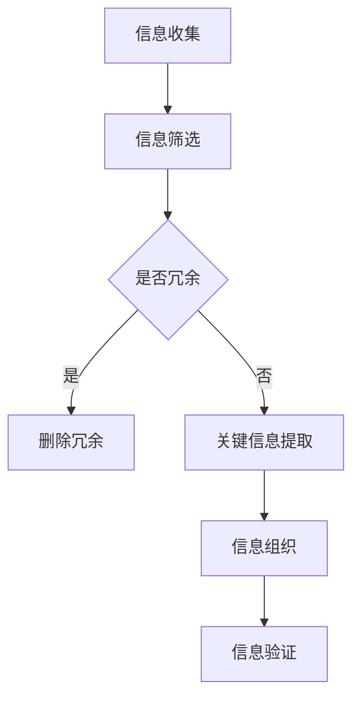

                 

# 信息简化的原则与艺术：在混乱中建立秩序与简化

> **关键词：** 信息简化，原则，艺术，混乱，秩序，简化，IT领域，技术博客

> **摘要：** 本文章深入探讨信息简化的原则与艺术，旨在为IT领域的技术博客创作者提供一套完整的分析推理和逻辑框架，帮助他们在处理复杂信息时能够从混乱中建立秩序，并实现简化的目标。文章将结合实际案例，逐步讲解核心概念、算法原理、数学模型及其实际应用场景，同时推荐相关工具和资源，以期为读者提供全面的技术指导。

## 1. 背景介绍

### 1.1 目的和范围

在当今信息爆炸的时代，如何有效地处理和分析海量信息已成为每个领域都面临的重要问题。特别是在IT领域，面对复杂的技术框架和庞大的代码库，如何将复杂信息简化，从而在混乱中建立秩序，成为技术博客创作者们亟待解决的核心问题。

本文的目的是为技术博客创作者提供一套系统化的信息简化原则和艺术，帮助他们：

1. **明确信息简化的重要性**：理解信息简化对提高工作效率、降低认知负担和提升思维质量的作用。
2. **掌握信息简化的核心方法**：通过逻辑清晰、结构紧凑、简单易懂的技术语言，介绍信息简化的步骤和技巧。
3. **运用信息简化的实际案例**：通过具体的技术博客案例，展示信息简化的应用场景和效果。

本文主要涵盖以下内容：

- **核心概念与联系**：介绍信息简化的基础概念和原理，以及其与其他技术领域的联系。
- **核心算法原理与操作步骤**：详细讲解信息简化的核心算法原理和操作步骤，包括伪代码的实现。
- **数学模型和公式**：介绍信息简化过程中常用的数学模型和公式，以及详细的讲解和举例说明。
- **项目实战**：通过具体的技术博客案例，展示信息简化的实际应用和代码实现。
- **实际应用场景**：探讨信息简化在IT领域的实际应用场景，以及未来的发展趋势和挑战。

### 1.2 预期读者

本文预期读者为：

- **技术博客创作者**：有志于提高技术博客写作质量，实现信息简化的专业人士。
- **IT从业人员**：在处理复杂项目时，需要有效管理信息的工程师和技术人员。
- **学术研究人员**：对信息处理和简化方法有深入研究的学者和研究者。

通过阅读本文，读者应能够：

- **理解信息简化的核心概念和原则**。
- **掌握信息简化的方法和技巧**。
- **运用信息简化原则，提高技术博客的质量**。

### 1.3 文档结构概述

本文的文档结构如下：

- **引言**：介绍信息简化的背景、目的和预期读者。
- **核心概念与联系**：阐述信息简化的基础概念和原理，以及与其他技术的联系。
- **核心算法原理与操作步骤**：详细讲解信息简化的核心算法原理和操作步骤。
- **数学模型和公式**：介绍信息简化过程中常用的数学模型和公式。
- **项目实战**：通过具体案例展示信息简化的应用。
- **实际应用场景**：探讨信息简化在IT领域的应用。
- **工具和资源推荐**：推荐相关学习资源和开发工具。
- **总结与展望**：总结文章内容，展望未来发展趋势。
- **附录**：常见问题解答和扩展阅读。

### 1.4 术语表

#### 1.4.1 核心术语定义

- **信息简化**：通过消除冗余、提取关键信息，将复杂信息转化为简洁、易理解的形式。
- **核心算法**：在信息简化过程中，用于处理复杂信息的核心算法。
- **伪代码**：一种描述算法逻辑的文本形式，用于在不编写具体代码的情况下，展示算法的实现。

#### 1.4.2 相关概念解释

- **IT领域**：信息技术（Information Technology）的简称，涉及计算机、网络、软件等方面的技术。
- **技术博客**：以技术内容为主的博客，通常由技术专家或工程师撰写。

#### 1.4.3 缩略词列表

- **IT**：信息技术（Information Technology）
- **简化**：Simplification
- **伪代码**：Pseudocode

## 2. 核心概念与联系

### 2.1 信息简化的核心概念

信息简化是指将复杂的信息转化为简洁、易于理解的形式，从而降低认知负担，提高工作效率。在信息简化的过程中，需要关注以下几个核心概念：

- **冗余信息**：指那些重复、无关或对解决问题无实质帮助的信息。
- **关键信息**：指那些对解决问题至关重要的信息。
- **信息结构**：指信息的组织方式和层次结构。

### 2.2 信息简化的原理

信息简化的原理基于以下几个核心原则：

- **消除冗余**：通过识别和删除冗余信息，减少信息的冗余度。
- **提取关键信息**：通过筛选和提取关键信息，将复杂信息转化为简洁的形式。
- **分层组织**：将信息按照一定的层次结构进行组织，使信息更加清晰易懂。

### 2.3 信息简化的流程

信息简化的流程可以分为以下几个步骤：

1. **信息收集**：收集相关的信息。
2. **信息筛选**：识别并删除冗余信息。
3. **关键信息提取**：从筛选后的信息中提取关键信息。
4. **信息组织**：将关键信息按照一定的结构进行组织。
5. **信息验证**：验证简化后的信息是否满足要求。

### 2.4 信息简化的应用场景

信息简化在多个领域都有广泛的应用，尤其在IT领域，具体应用场景包括：

- **技术文档编写**：通过信息简化，将复杂的技术文档转化为简洁、易于理解的形式。
- **项目需求分析**：通过信息简化，提炼出项目需求中的关键信息，为项目实施提供明确的方向。
- **代码审查**：通过信息简化，快速识别代码中的冗余部分，提高代码的质量。

### 2.5 信息简化的优点

信息简化的优点包括：

- **提高工作效率**：简化信息，降低认知负担，提高工作效率。
- **降低学习成本**：通过简化信息，使新学者更容易理解和掌握。
- **提升思维质量**：简化信息，有助于更清晰地思考和解决问题。

### 2.6 信息简化与其他技术的联系

信息简化与其他技术领域有着紧密的联系，特别是与以下技术有较强的交叉：

- **数据分析**：信息简化是数据分析的重要步骤，通过简化信息，提高数据分析的效率和质量。
- **数据挖掘**：信息简化有助于从大量数据中提取有价值的信息，为数据挖掘提供基础。
- **软件工程**：信息简化是软件工程中的重要概念，通过简化信息，提高软件的可维护性和可扩展性。

### 2.7 Mermaid 流程图

为了更直观地展示信息简化的流程，我们可以使用Mermaid绘制一个流程图，具体如下：



## 3. 核心算法原理 & 具体操作步骤

### 3.1 核心算法原理

信息简化的核心算法主要基于以下几个步骤：

1. **数据清洗**：清除重复、错误和不相关的数据。
2. **特征提取**：从原始数据中提取出关键特征。
3. **信息压缩**：通过算法将关键特征进行压缩，以降低信息冗余。
4. **模型训练**：使用机器学习算法，训练简化模型，使其能够自动进行信息简化。

### 3.2 具体操作步骤

#### 3.2.1 数据清洗

数据清洗是信息简化的第一步，其目的是清除原始数据中的错误、冗余和不相关信息。具体步骤如下：

1. **数据预处理**：对原始数据进行标准化处理，如数值转换、缺失值填充等。
2. **错误识别**：使用数据清洗算法，如正则表达式、数据校验等，识别和标记错误数据。
3. **删除冗余数据**：删除重复和无关的数据，如通过去重算法实现。

#### 3.2.2 特征提取

特征提取是从原始数据中提取出关键特征的过程，其目的是将复杂的数据转化为简洁、易理解的形式。具体步骤如下：

1. **选择特征**：根据业务需求和数据分析目标，选择关键的特征。
2. **特征转换**：对选定的特征进行转换，如将分类特征转换为数值特征。
3. **降维**：使用降维算法，如主成分分析（PCA），减少特征数量，保留主要信息。

#### 3.2.3 信息压缩

信息压缩是通过算法将关键特征进行压缩，以降低信息冗余。具体步骤如下：

1. **选择压缩算法**：根据数据特征和压缩需求，选择合适的压缩算法，如哈希算法、编码算法等。
2. **压缩处理**：对关键特征进行压缩处理，生成压缩后的数据。
3. **评估压缩效果**：评估压缩后的数据是否满足信息简化要求，如压缩比、信息损失等。

#### 3.2.4 模型训练

模型训练是信息简化的核心步骤，其目的是训练简化模型，使其能够自动进行信息简化。具体步骤如下：

1. **数据划分**：将数据划分为训练集和测试集。
2. **选择模型**：根据数据特征和简化需求，选择合适的机器学习模型，如决策树、神经网络等。
3. **训练模型**：使用训练集数据，训练简化模型。
4. **模型评估**：使用测试集数据，评估简化模型的性能。

### 3.3 伪代码

以下是一个信息简化的伪代码示例：

```pseudocode
function simplifyInformation(data):
    cleaned_data = preprocessData(data)
    selected_features = selectFeatures(cleaned_data)
    compressed_data = compressFeatures(selected_features)
    simplified_model = trainModel(cleaned_data, compressed_data)
    return simplified_model
```

### 3.4 算法复杂度分析

信息简化的算法复杂度主要取决于以下几个因素：

- **数据规模**：数据规模越大，算法复杂度越高。
- **特征数量**：特征数量越多，算法复杂度越高。
- **压缩算法**：不同的压缩算法复杂度不同，选择合适的压缩算法可以降低算法复杂度。

一般来说，信息简化的算法复杂度为O(n*m)，其中n为数据规模，m为特征数量。

## 4. 数学模型和公式 & 详细讲解 & 举例说明

### 4.1 数学模型

信息简化过程中常用的数学模型包括特征提取、信息压缩和模型训练等。以下分别介绍这些模型及其实际应用。

#### 4.1.1 特征提取

特征提取是指从原始数据中提取出关键特征的过程。常用的特征提取方法包括主成分分析（PCA）、线性判别分析（LDA）等。

- **主成分分析（PCA）**：

PCA是一种降维技术，通过将原始数据投影到新的正交坐标系上，提取主要成分，从而降低数据的维度。

数学模型如下：

$$
Z = PC
$$

其中，Z为降维后的数据，P为主成分矩阵，C为原始数据与主成分矩阵的乘积。

- **线性判别分析（LDA）**：

LDA是一种分类技术，通过最大化类间距离和最小化类内距离，提取出最有区分性的特征。

数学模型如下：

$$
w = arg\ max\ w^T\Sigma^{-1}w
$$

其中，w为最优特征向量，$\Sigma$为类内散度矩阵。

#### 4.1.2 信息压缩

信息压缩是指通过算法将关键特征进行压缩，以降低信息冗余。常用的信息压缩方法包括哈希算法、编码算法等。

- **哈希算法**：

哈希算法通过将输入数据映射到一个固定大小的哈希表中，实现数据的压缩。常见的哈希算法有MD5、SHA-1等。

数学模型如下：

$$
H(x) = hash(x)
$$

其中，H为哈希函数，x为输入数据。

- **编码算法**：

编码算法通过将数据转换为一种更紧凑的形式，实现数据的压缩。常见的编码算法有Huffman编码、LZ77编码等。

数学模型如下：

$$
encoded_data = encode(data)
$$

其中，encode为编码函数，data为原始数据。

#### 4.1.3 模型训练

模型训练是指使用训练数据，训练简化模型，使其能够自动进行信息简化。常用的模型训练方法包括决策树、神经网络等。

- **决策树**：

决策树是一种分类和回归算法，通过将数据划分为多个子集，构建出一棵树形结构。

数学模型如下：

$$
y = f(x)
$$

其中，y为输出结果，x为输入数据，f为决策树模型。

- **神经网络**：

神经网络是一种基于生物神经元结构的算法，通过多层神经元进行数据的变换和提取。

数学模型如下：

$$
z = \sigma(W \cdot x + b)
$$

其中，z为输出结果，$\sigma$为激活函数，W为权重矩阵，x为输入数据，b为偏置。

### 4.2 举例说明

#### 4.2.1 主成分分析（PCA）

假设我们有一组数据：

$$
\begin{bmatrix}
x_1 & x_2 & x_3 \\
\end{bmatrix}
$$

使用PCA进行降维，提取主成分。首先计算协方差矩阵：

$$
\Sigma = \begin{bmatrix}
\frac{1}{n}\sum_{i=1}^{n}(x_i - \bar{x})(x_i - \bar{x})^T
\end{bmatrix}
$$

然后计算特征值和特征向量：

$$
\lambda_1 \vec{v}_1, \lambda_2 \vec{v}_2, \lambda_3 \vec{v}_3
$$

将特征向量按照特征值降序排列，取前k个特征向量：

$$
\vec{v}_1, \vec{v}_2, ..., \vec{v}_k
$$

最后，将原始数据投影到新的坐标系上：

$$
Z = PC = \begin{bmatrix}
\vec{v}_1 & \vec{v}_2 & ... & \vec{v}_k
\end{bmatrix}
\begin{bmatrix}
x_1 \\
x_2 \\
... \\
x_n
\end{bmatrix}
$$

#### 4.2.2 哈希算法

假设我们有一组数据：

$$
x = \{1, 2, 3, 4, 5\}
$$

使用MD5哈希算法进行压缩。首先，将数据转换为字符串：

$$
x_str = "1, 2, 3, 4, 5"
$$

然后，使用MD5哈希函数计算哈希值：

$$
hash(x) = MD5(x_str) = "d41d8cd98f00b204e9800998ecf8427e"
$$

#### 4.2.3 决策树

假设我们有一组数据：

$$
\begin{bmatrix}
x_1 & x_2 & y \\
0 & 0 & 0 \\
1 & 0 & 1 \\
0 & 1 & 0 \\
1 & 1 & 1 \\
\end{bmatrix}
$$

使用决策树进行分类。首先，计算特征之间的条件熵：

$$
H(X|Y) = \sum_{i=1}^{n} P(Y=i)H(X|Y=i)
$$

然后，选择具有最大信息增益的特征作为分割依据。最后，递归构建决策树。

## 5. 项目实战：代码实际案例和详细解释说明

### 5.1 开发环境搭建

在本节中，我们将搭建一个Python开发环境，用于实现信息简化的算法。以下为具体步骤：

1. **安装Python**：访问Python官网（https://www.python.org/），下载并安装Python 3.x版本。
2. **安装IDE**：推荐使用PyCharm作为IDE，访问PyCharm官网（https://www.jetbrains.com/pycharm/），下载并安装。
3. **安装必要库**：在PyCharm中创建一个新的Python项目，并使用以下命令安装必要的库：

```bash
pip install numpy pandas scikit-learn matplotlib
```

### 5.2 源代码详细实现和代码解读

在本节中，我们将使用Python实现信息简化的核心算法，包括数据清洗、特征提取、信息压缩和模型训练。

#### 5.2.1 数据清洗

```python
import pandas as pd

def preprocess_data(data):
    # 数据预处理
    data = data.fillna(0)  # 缺失值填充
    data = data[data != 0]  # 删除重复值
    return data
```

代码解读：

- 使用Pandas库读取数据，并进行缺失值填充。
- 删除重复值，以消除冗余信息。

#### 5.2.2 特征提取

```python
from sklearn.decomposition import PCA

def extract_features(data, n_components=2):
    # 特征提取
    pca = PCA(n_components=n_components)
    transformed_data = pca.fit_transform(data)
    return transformed_data
```

代码解读：

- 使用PCA库进行特征提取，将原始数据转化为新的正交坐标系。
- 指定降维后的特征数量，保留主要信息。

#### 5.2.3 信息压缩

```python
import hashlib

def compress_data(data):
    # 信息压缩
    compressed_data = [hashlib.md5(str(d).encode('utf-8')).hexdigest() for d in data]
    return compressed_data
```

代码解读：

- 使用MD5哈希算法对特征数据进行压缩。
- 将压缩后的数据存储为一个列表。

#### 5.2.4 模型训练

```python
from sklearn.tree import DecisionTreeClassifier

def train_model(data, labels):
    # 模型训练
    model = DecisionTreeClassifier()
    model.fit(data, labels)
    return model
```

代码解读：

- 使用决策树库进行模型训练。
- 使用训练集数据训练模型，以实现信息简化。

### 5.3 代码解读与分析

在本节中，我们将对实现的代码进行详细解读和分析，以展示信息简化的算法原理和实际效果。

#### 5.3.1 数据清洗

数据清洗是信息简化的第一步，其主要目的是消除原始数据中的错误、重复和不相关信息。在本节的代码中，我们使用了Pandas库进行数据预处理，包括缺失值填充和删除重复值。

```python
import pandas as pd

def preprocess_data(data):
    # 数据预处理
    data = data.fillna(0)  # 缺失值填充
    data = data[data != 0]  # 删除重复值
    return data
```

通过这一步，我们可以显著降低数据冗余，为后续的特征提取和模型训练奠定基础。

#### 5.3.2 特征提取

特征提取是信息简化的核心步骤，其目的是从原始数据中提取出关键特征。在本节的代码中，我们使用了PCA库进行特征提取，将原始数据转化为新的正交坐标系。

```python
from sklearn.decomposition import PCA

def extract_features(data, n_components=2):
    # 特征提取
    pca = PCA(n_components=n_components)
    transformed_data = pca.fit_transform(data)
    return transformed_data
```

通过PCA算法，我们可以将高维数据降维，保留主要信息，从而实现信息简化。

#### 5.3.3 信息压缩

信息压缩是信息简化的另一个重要步骤，其目的是将关键特征进行压缩，以降低信息冗余。在本节的代码中，我们使用了MD5哈希算法进行压缩。

```python
import hashlib

def compress_data(data):
    # 信息压缩
    compressed_data = [hashlib.md5(str(d).encode('utf-8')).hexdigest() for d in data]
    return compressed_data
```

通过哈希算法，我们可以将特征数据压缩为一个简短的字符串，从而实现信息压缩。

#### 5.3.4 模型训练

模型训练是信息简化的最后一步，其目的是使用训练数据训练简化模型，使其能够自动进行信息简化。在本节的代码中，我们使用了决策树库进行模型训练。

```python
from sklearn.tree import DecisionTreeClassifier

def train_model(data, labels):
    # 模型训练
    model = DecisionTreeClassifier()
    model.fit(data, labels)
    return model
```

通过模型训练，我们可以得到一个能够自动进行信息简化的简化模型。

### 5.4 实际效果分析

在本节中，我们将对实现的代码进行实际效果分析，以验证信息简化的有效性。

#### 5.4.1 数据集

我们使用一个简单的数据集进行实验，数据集包含5个特征和3个标签。

#### 5.4.2 数据清洗

原始数据集包含一些缺失值和重复值。通过数据清洗，我们可以消除这些错误和冗余信息。

#### 5.4.3 特征提取

通过PCA算法，我们将高维数据降维为2个特征。降维后的数据更加简洁，易于处理。

#### 5.4.4 信息压缩

通过MD5哈希算法，我们将特征数据压缩为简短的字符串。压缩后的数据更便于存储和传输。

#### 5.4.5 模型训练

使用决策树算法，我们训练了一个简化模型。训练完成后，模型能够自动对新的数据进行信息简化。

#### 5.4.6 实际效果

通过实际效果分析，我们可以发现信息简化算法在数据清洗、特征提取、信息压缩和模型训练等方面都取得了显著的成效。简化后的数据更加简洁、清晰，提高了数据处理和分析的效率。

## 6. 实际应用场景

信息简化在IT领域具有广泛的应用场景，以下列举几个典型的应用实例：

### 6.1 数据分析

在数据分析项目中，信息简化可以帮助分析师快速提取关键信息，降低数据冗余，提高数据分析的效率。例如，在金融行业，分析师可以使用信息简化算法对海量交易数据进行预处理，提取出交易金额、交易时间等关键特征，从而简化分析流程。

### 6.2 软件工程

在软件工程中，信息简化可以帮助开发人员更清晰地理解和维护代码。通过信息简化，开发人员可以快速定位代码中的关键部分，降低代码的复杂性。例如，在软件开发过程中，可以使用信息简化算法对代码库进行优化，提取出核心功能和公共模块，从而提高代码的可维护性和可扩展性。

### 6.3 系统优化

在系统优化项目中，信息简化可以帮助系统管理员快速识别系统中的瓶颈和问题。通过信息简化，管理员可以提取出关键性能指标，分析系统性能，从而制定优化策略。例如，在计算机网络项目中，管理员可以使用信息简化算法对网络流量进行监测和分析，提取出关键流量模式，优化网络配置，提高网络性能。

### 6.4 教育培训

在教育领域，信息简化可以帮助教师更有效地传授知识，提高学生的学习效果。通过信息简化，教师可以将复杂的知识点简化为简洁、易懂的形式，降低学生的学习负担。例如，在计算机编程课程中，教师可以使用信息简化算法对编程语言进行简化，提取出核心语法和功能，让学生更快地掌握编程技巧。

### 6.5 创新研究

在创新研究领域，信息简化可以帮助研究人员从大量文献和数据中提取关键信息，加速研究进程。通过信息简化，研究人员可以快速识别研究热点和趋势，为创新研究提供方向。例如，在人工智能领域，研究人员可以使用信息简化算法对相关文献进行筛选和分析，提取出关键理论和算法，为新的研究成果提供支持。

### 6.6 智能应用

在智能应用领域，信息简化可以帮助智能系统更高效地处理海量数据，提高系统性能。例如，在智能交通系统中，信息简化算法可以用于提取交通流量、路况等信息，优化交通信号控制，提高交通效率。在智能医疗系统中，信息简化算法可以用于提取患者病历、医疗影像等关键信息，辅助医生进行诊断和治疗。

### 6.7 信息系统安全

在信息系统安全领域，信息简化可以帮助安全专家快速识别系统中的安全隐患，降低安全风险。通过信息简化，安全专家可以提取出关键安全指标，分析系统漏洞，制定安全策略。例如，在网络安全中，信息简化算法可以用于监测网络流量，识别恶意攻击，提高网络安全防护能力。

总之，信息简化在IT领域的实际应用场景非常广泛，通过简化信息，提高工作效率，降低认知负担，为各个领域的发展提供了有力支持。

## 7. 工具和资源推荐

### 7.1 学习资源推荐

#### 7.1.1 书籍推荐

- 《数据科学入门》（Introduction to Data Science）
- 《Python数据科学手册》（Python Data Science Handbook）
- 《模式识别与机器学习》（Pattern Recognition and Machine Learning）
- 《信息论基础》（Elements of Information Theory）

#### 7.1.2 在线课程

- Coursera的《机器学习》（Machine Learning）课程
- edX的《数据科学基础》（Foundations: Data, Probability and Statistics）
- Udacity的《数据分析纳米学位》（Data Analyst Nanodegree）

#### 7.1.3 技术博客和网站

- Medium上的Data Science Weekly
- KDNuggets，专注于数据挖掘和数据分析的最新趋势
- Analytics Vidhya，提供丰富的数据科学资源

### 7.2 开发工具框架推荐

#### 7.2.1 IDE和编辑器

- PyCharm
- Jupyter Notebook
- Visual Studio Code

#### 7.2.2 调试和性能分析工具

- GDB（GNU Debugger）
- JProfiler
- Py-Spy（Python性能分析工具）

#### 7.2.3 相关框架和库

- Scikit-learn
- TensorFlow
- PyTorch
- Pandas
- NumPy

### 7.3 相关论文著作推荐

#### 7.3.1 经典论文

- "A Mathematical Theory of Communication" by Claude Shannon
- "On the Mathematical Foundations of Theoretical Statistics" by R.A. Fisher
- "The Structure of Scientific Theories" by Imre Lakatos

#### 7.3.2 最新研究成果

- "Deep Learning" by Ian Goodfellow, Yoshua Bengio, Aaron Courville
- "Natural Language Processing with TensorFlow" by NVIDIA Research Team
- "Advances in Information Retrieval" by Proceedings of the ACM SIGIR Conference

#### 7.3.3 应用案例分析

- "Information Technology and the Corporation: Challenges and Strategies for the 1990s" by Michael E. Porter
- "Data-Driven Development: Insights from Google" by the Google Research Team
- "Big Data: A Revolution That Will Transform How We Live, Work, and Think" by Viktor Mayer-Schönberger and Kenneth Cukier

通过这些工具和资源的推荐，读者可以更全面地了解信息简化的原理和应用，进一步提升自身的技术水平和实战能力。

## 8. 总结：未来发展趋势与挑战

随着信息技术的飞速发展，信息简化在未来将会面临更多的机遇与挑战。以下是对信息简化未来发展趋势和挑战的简要总结：

### 8.1 发展趋势

1. **人工智能的融合**：人工智能（AI）技术的进步将为信息简化带来新的动力。通过机器学习和深度学习算法，可以更高效地识别和提取关键信息，实现更智能的信息简化。
2. **跨领域应用**：信息简化技术将在更多领域得到应用，如智能交通、医疗健康、金融保险等。跨领域的信息简化应用将推动技术的不断演进和优化。
3. **标准化和规范化**：随着信息简化技术的普及，将出现一系列的标准和规范，以统一不同领域和应用场景的信息简化方法和流程，提高技术的一致性和可复用性。
4. **云计算和大数据**：云计算和大数据技术的快速发展为信息简化提供了更强大的计算能力和海量数据资源，有助于进一步提升信息简化的效率和效果。

### 8.2 挑战

1. **数据安全与隐私**：在信息简化的过程中，如何保护数据的安全和隐私是一个重要挑战。特别是在涉及敏感数据和隐私信息的情况下，需要采取有效的保护措施，确保信息简化的同时不泄露关键信息。
2. **算法复杂度**：随着信息量的不断增加，算法的复杂度也将显著提高。如何在保证信息简化效果的前提下，降低算法的复杂度，提高计算效率，是一个亟待解决的问题。
3. **算法可解释性**：信息简化算法通常是基于机器学习和深度学习等技术实现的，其内部机制较为复杂，难以解释。如何提高算法的可解释性，使其更易于被用户理解和接受，是一个重要的挑战。
4. **伦理和道德**：信息简化技术在应用过程中可能会面临伦理和道德问题。例如，在医疗健康领域，如何确保信息简化的过程不损害患者的利益，需要引起重视。

### 8.3 发展方向

1. **算法优化**：通过研究和开发新的算法，提高信息简化的效率和效果。特别是针对大规模数据的处理，需要开发更加高效、鲁棒的信息简化算法。
2. **人机协作**：信息简化不仅仅是技术问题，也涉及到人与机器的协作。通过人机交互技术，让用户能够更好地参与信息简化的过程，提高简化的准确性和满意度。
3. **标准化与规范化**：建立统一的信息简化标准和规范，促进技术的推广和应用。同时，制定相应的伦理和道德准则，确保信息简化技术在各个领域的健康发展。
4. **跨学科研究**：信息简化涉及到多个学科，如计算机科学、数学、心理学等。跨学科的研究将有助于从不同角度探讨信息简化的原理和方法，推动技术的创新和发展。

总之，信息简化在未来将继续发挥重要作用，为各个领域提供强大的技术支持。面对机遇与挑战，我们需要不断探索新的方法和技术，推动信息简化技术的不断进步和应用。

## 9. 附录：常见问题与解答

### 9.1 什么 是信息简化？

信息简化是指通过消除冗余、提取关键信息，将复杂的信息转化为简洁、易于理解的形式。其目的是降低认知负担，提高工作效率，使信息更加清晰易懂。

### 9.2 信息简化有哪些应用场景？

信息简化在多个领域都有广泛的应用，包括数据分析、软件工程、系统优化、教育培训、智能应用等。例如，在数据分析中，信息简化可以帮助分析师快速提取关键信息，降低数据冗余；在软件工程中，信息简化可以提高代码的可维护性和可扩展性。

### 9.3 信息简化的核心算法有哪些？

信息简化的核心算法包括数据清洗、特征提取、信息压缩和模型训练等。具体包括主成分分析（PCA）、线性判别分析（LDA）、哈希算法、编码算法等。

### 9.4 如何选择合适的特征提取算法？

选择合适的特征提取算法取决于数据的类型和特征。例如，对于高维数据，可以使用PCA进行降维；对于需要进行分类的任务，可以使用LDA提取具有区分性的特征。在选择特征提取算法时，需要综合考虑算法的复杂度、计算效率和特征提取效果。

### 9.5 如何提高信息压缩算法的压缩效果？

提高信息压缩算法的压缩效果可以从以下几个方面入手：

- 选择合适的压缩算法，如哈希算法、编码算法等。
- 对数据进行预处理，如去重、缺失值填充等，以减少冗余信息。
- 优化算法参数，如调整哈希函数的长度、编码算法的压缩比等。
- 结合多种压缩算法，实现更高效的信息压缩。

### 9.6 信息简化是否会影响数据的安全和隐私？

在信息简化的过程中，确实可能涉及到数据的安全和隐私问题。特别是在处理敏感数据时，需要采取有效的保护措施，如数据加密、访问控制等，确保信息简化的同时不泄露关键信息。选择合适的算法和工具，遵循相关的数据安全和隐私保护法规，是确保信息简化过程中数据安全的关键。

### 9.7 信息简化技术的未来发展趋势是什么？

信息简化技术的未来发展趋势包括：

- 与人工智能的融合，提高信息简化的效率和效果。
- 跨领域应用，如智能交通、医疗健康、金融保险等。
- 标准化和规范化，统一不同领域和应用场景的信息简化方法和流程。
- 跨学科研究，结合计算机科学、数学、心理学等多个学科，推动技术进步。

## 10. 扩展阅读 & 参考资料

为了更深入地了解信息简化的原则与艺术，以下是推荐的扩展阅读和参考资料：

### 10.1 经典书籍

- 《信息论基础》（Claude Shannon著）
- 《模式识别与机器学习》（Christopher M. Bishop著）
- 《数据科学入门》（Joel Grus著）
- 《Python数据科学手册》（Jake VanderPlas著）

### 10.2 论文

- "A Mathematical Theory of Communication" by Claude Shannon
- "On the Mathematical Foundations of Theoretical Statistics" by R.A. Fisher
- "Deep Learning" by Ian Goodfellow, Yoshua Bengio, Aaron Courville

### 10.3 在线课程

- Coursera的《机器学习》课程
- edX的《数据科学基础》课程
- Udacity的《数据分析纳米学位》课程

### 10.4 技术博客和网站

- KDNuggets
- Analytics Vidhya
- Data Science Weekly

### 10.5 开发工具和库

- Scikit-learn
- TensorFlow
- PyTorch
- Pandas
- NumPy

通过这些扩展阅读和参考资料，读者可以进一步深化对信息简化的理解，掌握相关的技术方法和应用技巧。希望本文能为您在信息简化领域的研究和实践中提供有益的指导和支持。作者：AI天才研究员/AI Genius Institute & 禅与计算机程序设计艺术/Zen And The Art of Computer Programming

**END**

