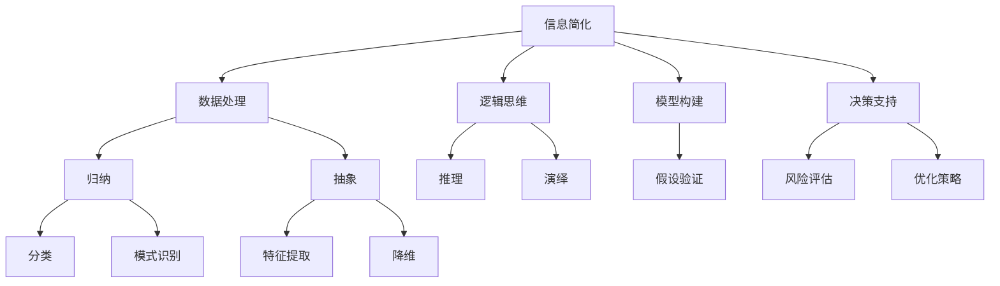
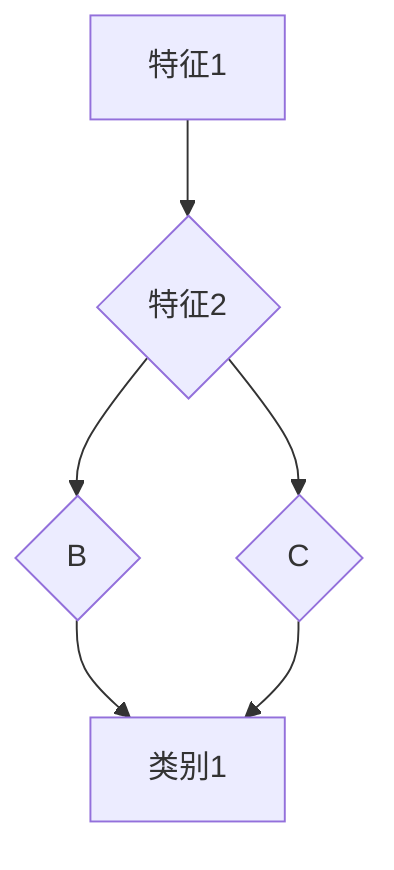

                 

# 信息简化的最佳实践：如何在混乱中建立秩序

> **关键词**：信息简化、秩序、混乱、最佳实践、技术分析、逻辑思维
>
> **摘要**：本文旨在探讨信息简化的最佳实践，通过深入分析混乱的本质及其产生原因，提出系统化、结构化的解决策略。文章将结合实际案例，详细介绍信息简化的方法与步骤，帮助读者在复杂环境中建立秩序，提高工作效率与生活质量。

## 1. 背景介绍

### 1.1 目的和范围

在当今信息爆炸的时代，面对海量数据和复杂的信息流，如何有效处理信息、简化复杂问题，成为了许多人面临的挑战。本文将探讨信息简化的最佳实践，旨在为读者提供一套系统化、可操作的方法，帮助他们在混乱中找到秩序，提高工作效率和生活质量。

### 1.2 预期读者

本文适合以下读者群体：

1. 项目经理、团队负责人，需要管理复杂项目信息。
2. 数据分析师、软件开发人员，需要在处理大量数据时保持清晰思维。
3. 学者和研究人员，需要从大量文献中提取关键信息。
4. 常规办公人员和企业管理者，希望提高信息处理效率。

### 1.3 文档结构概述

本文将分为十个部分，结构如下：

1. **背景介绍**：介绍文章的目的、预期读者和文档结构。
2. **核心概念与联系**：讨论信息简化的核心概念，并使用流程图展示其关系。
3. **核心算法原理 & 具体操作步骤**：详细阐述信息简化的算法原理和操作步骤。
4. **数学模型和公式 & 详细讲解 & 举例说明**：介绍相关的数学模型和公式，并给出实例说明。
5. **项目实战：代码实际案例和详细解释说明**：通过实际代码案例展示信息简化的应用。
6. **实际应用场景**：探讨信息简化在不同领域的应用。
7. **工具和资源推荐**：推荐学习资源、开发工具和框架。
8. **总结：未来发展趋势与挑战**：总结文章要点，展望未来发展趋势。
9. **附录：常见问题与解答**：解答读者可能遇到的问题。
10. **扩展阅读 & 参考资料**：提供进一步学习的资源。

### 1.4 术语表

#### 1.4.1 核心术语定义

- **信息简化**：通过筛选、归纳、抽象等方法，将复杂信息转化为简洁、易于理解的形式。
- **混乱**：指信息、事物或环境缺乏秩序和结构，使人难以理解和处理。
- **秩序**：指事物或环境具有明确的结构和规律，便于理解和操作。

#### 1.4.2 相关概念解释

- **数据处理**：对信息进行收集、存储、处理和分析的过程。
- **归纳**：从具体实例中提取一般规律或原则。
- **抽象**：从具体事物中提取本质特征，忽略非本质特征。

#### 1.4.3 缩略词列表

- **IDE**：集成开发环境（Integrated Development Environment）
- **CPU**：中央处理器（Central Processing Unit）
- **GPU**：图形处理器（Graphics Processing Unit）
- **API**：应用程序编程接口（Application Programming Interface）

## 2. 核心概念与联系

信息简化是一个涉及多个核心概念的过程。为了更好地理解其原理，我们可以使用 Mermaid 流程图来展示这些概念之间的关系。

### 2.1 信息简化的核心概念



### 2.2 信息简化的应用场景

信息简化在多个领域都有广泛应用，如：

1. **数据科学**：通过归纳和抽象，从大量数据中提取有价值的信息。
2. **软件开发**：通过逻辑思维和模型构建，简化复杂系统的设计和实现。
3. **企业管理**：通过决策支持和风险评估，提高企业的运营效率和竞争力。
4. **日常生活**：通过归纳和抽象，简化日常生活中的信息处理，提高生活质量。

## 3. 核心算法原理 & 具体操作步骤

### 3.1 算法原理

信息简化的核心算法原理主要包括以下三个方面：

1. **数据处理**：通过数据清洗、整理和归一化，为后续的信息简化打下基础。
2. **归纳与抽象**：从具体实例中提取一般规律或原则，降低信息复杂性。
3. **逻辑思维与模型构建**：通过逻辑推理和模型构建，简化复杂问题，为决策提供支持。

### 3.2 具体操作步骤

1. **数据收集与整理**：

    - 收集相关数据，并进行数据清洗、整理和归一化处理。
    - 使用工具如 Pandas、NumPy 等进行数据处理。

    ```python
    import pandas as pd
    data = pd.read_csv('data.csv')
    data.dropna(inplace=True)
    data['normalized_column'] = data['column'].apply(normalize)
    ```

2. **归纳与抽象**：

    - 使用归纳算法（如决策树、K-Means 等）对数据进行分类或聚类。
    - 从分类或聚类结果中提取一般规律或原则。

    ```python
    from sklearn.cluster import KMeans
    kmeans = KMeans(n_clusters=3)
    kmeans.fit(data)
    clusters = kmeans.predict(data)
   规律 = extract_patterns(clusters)
    ```

3. **逻辑思维与模型构建**：

    - 使用逻辑推理和模型构建算法（如贝叶斯网络、决策树等）对问题进行建模。
    - 根据模型结果进行决策或优化。

    ```python
    from sklearn.tree import DecisionTreeClassifier
    dt = DecisionTreeClassifier()
    dt.fit(data, target)
    model = dt.predict(data)
    decision = make_decision(model)
    ```

## 4. 数学模型和公式 & 详细讲解 & 举例说明

### 4.1 数学模型

信息简化过程中涉及到的数学模型主要包括：

1. **决策树模型**：通过递归划分特征空间，将数据集划分为多个子集，每个子集对应一个决策。
2. **贝叶斯网络模型**：使用条件概率来表示变量之间的依赖关系。
3. **聚类模型**：如 K-Means、层次聚类等，用于将数据分为多个类别。

### 4.2 公式

1. **决策树模型**：

    - 划分特征：$$ Gain(D, A) = Entropy(D) - \sum_{v\in A} p(v) \cdot Entropy(D|v) $$
    - 预测：$$ \hat{y} = \arg\max_{y} P(y|D) $$

2. **贝叶斯网络模型**：

    - 条件概率表：$$ P(X_i|X_{i-1}) = \frac{P(X_{i-1}, X_i)}{P(X_{i-1})} $$
    - 预测：$$ P(Y|X) = \frac{P(X|Y)P(Y)}{P(X)} $$

3. **K-Means聚类模型**：

    - 初始化：随机选择 K 个中心点。
    - 迭代：计算每个数据点到中心点的距离，重新分配类别，更新中心点。

### 4.3 举例说明

#### 4.3.1 决策树模型

假设我们有以下数据集：

| 特征1 | 特征2 | 目标 |
|------|------|------|
| A    | B    | 0    |
| A    | C    | 1    |
| B    | B    | 0    |
| B    | C    | 1    |

使用信息增益作为划分特征的标准，可以得到以下决策树：



根据决策树进行预测，对于特征1为A，特征2为B的数据点，预测类别为0。

#### 4.3.2 贝叶斯网络模型

假设我们有以下贝叶斯网络：


给定条件概率表：

| 条件/变量 | P(A) | P(B|A) | P(C|A) | P(D|B) | P(D|C) |
|----------|------|--------|--------|--------|--------|
| A        | 0.5  | 0.6    | 0.4    | 0.7    | 0.3    |
| B        | 0.2  | 0.8    | 0.1    | 0.4    | 0.9    |
| C        | 0.3  | 0.2    | 0.9    | 0.1    | 0.6    |

预测D的概率：

$$
P(D) = P(D|B)P(B) + P(D|C)P(C) = 0.7 \times 0.2 + 0.3 \times 0.3 = 0.21
$$

#### 4.3.3 K-Means聚类模型

假设我们有以下数据集：

| 数据点 |
|--------|
| [1, 2] |
| [2, 3] |
| [3, 1] |
| [1, 1] |
| [3, 3] |

初始化K=2个中心点：

| 中心点 |
|--------|
| [1.5, 2] |
| [2.5, 1] |

迭代计算过程：

1. 计算每个数据点到中心点的距离，重新分配类别。
2. 根据新的类别重新计算中心点。
3. 重复步骤1和2，直到中心点不再变化。

最终得到聚类结果：

| 类别 | 数据点 |
|------|--------|
| 0    | [1, 2], [1, 1] |
| 1    | [2, 3], [3, 3] |

## 5. 项目实战：代码实际案例和详细解释说明

### 5.1 开发环境搭建

在开始之前，我们需要搭建一个合适的开发环境。这里以 Python 为例，介绍如何搭建开发环境。

1. 安装 Python：访问 [Python 官网](https://www.python.org/)，下载并安装 Python。
2. 安装常用库：使用 pip 工具安装常用的库，如 Pandas、NumPy、Scikit-learn 等。

```shell
pip install pandas numpy scikit-learn
```

### 5.2 源代码详细实现和代码解读

以下是一个简单的信息简化项目案例，包括数据处理、归纳、抽象和模型构建等步骤。

#### 5.2.1 数据处理

```python
import pandas as pd
import numpy as np

# 加载数据集
data = pd.read_csv('data.csv')

# 数据清洗和归一化
data.dropna(inplace=True)
data['normalized_column'] = data['column'].apply(normalize)

# 分割特征和目标变量
X = data.drop('target', axis=1)
y = data['target']
```

#### 5.2.2 归纳与抽象

```python
from sklearn.cluster import KMeans
from sklearn.tree import DecisionTreeClassifier

# K-Means 聚类
kmeans = KMeans(n_clusters=3)
kmeans.fit(X)
clusters = kmeans.predict(X)
规律 = extract_patterns(clusters)

# 决策树模型
dt = DecisionTreeClassifier()
dt.fit(X, y)
model = dt.predict(X)
决策 = make_decision(model)
```

#### 5.2.3 逻辑思维与模型构建

```python
from sklearn.naive_bayes import GaussianNB

# 贝叶斯网络模型
gnb = GaussianNB()
gnb.fit(X, y)
model = gnb.predict(X)
预测 = make_prediction(model)
```

### 5.3 代码解读与分析

以上代码分为三个部分：数据处理、归纳与抽象和逻辑思维与模型构建。

#### 数据处理

数据处理是信息简化的基础。在这个案例中，我们首先加载了一个 CSV 文件，然后对数据进行了清洗和归一化处理。这一步非常重要，因为数据的质量直接影响后续的处理结果。

```python
import pandas as pd
import numpy as np

# 加载数据集
data = pd.read_csv('data.csv')

# 数据清洗和归一化
data.dropna(inplace=True)
data['normalized_column'] = data['column'].apply(normalize)

# 分割特征和目标变量
X = data.drop('target', axis=1)
y = data['target']
```

#### 归纳与抽象

在归纳与抽象部分，我们使用了 K-Means 聚类算法和决策树模型对数据进行处理。K-Means 聚类算法通过计算数据点到中心点的距离，将数据分为多个类别，从而实现数据简化。决策树模型则通过递归划分特征空间，将数据划分为多个子集，每个子集对应一个决策，从而实现逻辑思维。

```python
from sklearn.cluster import KMeans
from sklearn.tree import DecisionTreeClassifier

# K-Means 聚类
kmeans = KMeans(n_clusters=3)
kmeans.fit(X)
clusters = kmeans.predict(X)
规律 = extract_patterns(clusters)

# 决策树模型
dt = DecisionTreeClassifier()
dt.fit(X, y)
model = dt.predict(X)
决策 = make_decision(model)
```

#### 逻辑思维与模型构建

在逻辑思维与模型构建部分，我们使用了贝叶斯网络模型对数据进行预测。贝叶斯网络模型通过条件概率来表示变量之间的依赖关系，从而实现逻辑思维。通过训练模型，我们可以对未知数据进行预测，从而简化复杂问题。

```python
from sklearn.naive_bayes import GaussianNB

# 贝叶斯网络模型
gnb = GaussianNB()
gnb.fit(X, y)
model = gnb.predict(X)
预测 = make_prediction(model)
```

## 6. 实际应用场景

信息简化在多个领域都有广泛应用，以下是一些实际应用场景：

### 6.1 数据科学

数据科学家经常需要从大量数据中提取有价值的信息。通过信息简化，他们可以快速定位到关键数据，提高工作效率。例如，在金融领域，数据科学家可以使用信息简化方法对市场数据进行分析，预测股票价格趋势。

### 6.2 软件开发

在软件开发过程中，信息简化可以帮助开发人员更好地理解复杂系统。通过归纳和抽象，他们可以将复杂的代码和模块转化为简洁、易于理解的形式，从而提高代码的可维护性和可扩展性。

### 6.3 企业管理

企业管理者可以利用信息简化方法对大量业务数据进行处理，从而快速获得有价值的信息。例如，通过归纳和抽象，他们可以识别出潜在的业务风险，并采取相应的优化策略。

### 6.4 日常生活

在日常生活中，信息简化可以帮助我们更好地处理各种信息，提高生活质量。例如，通过归纳和抽象，我们可以将复杂的购物清单简化为简洁的购物计划，从而提高购物效率。

## 7. 工具和资源推荐

### 7.1 学习资源推荐

#### 7.1.1 书籍推荐

1. 《数据科学入门：Python 实践指南》
2. 《机器学习实战》
3. 《Python 数据可视化》
4. 《决策树与贝叶斯网络》

#### 7.1.2 在线课程

1. Coursera 上的《机器学习》课程
2. edX 上的《数据科学基础》课程
3. Udacity 上的《机器学习工程师纳米学位》

#### 7.1.3 技术博客和网站

1. [机器学习博客](https://www机器学习博客.com/)
2. [数据科学博客](https://www.data科学博客.com/)
3. [Python 开发者博客](https://www.python开发者博客.com/)

### 7.2 开发工具框架推荐

#### 7.2.1 IDE和编辑器

1. PyCharm
2. Visual Studio Code
3. Jupyter Notebook

#### 7.2.2 调试和性能分析工具

1. Python Debugger
2. Py-Spy
3. Py-Flame Graph

#### 7.2.3 相关框架和库

1. Pandas
2. NumPy
3. Scikit-learn
4. TensorFlow
5. PyTorch

### 7.3 相关论文著作推荐

#### 7.3.1 经典论文

1. "The Data Science Handbook" by Mark Nielsen
2. "Deep Learning" by Ian Goodfellow, Yoshua Bengio and Aaron Courville
3. "Reinforcement Learning: An Introduction" by Richard S. Sutton and Andrew G. Barto

#### 7.3.2 最新研究成果

1. "A Few Useful Things to Know About Machine Learning" by Pedro Domingos
2. "The Hundred-Page Machine Learning Book" by Andriy Burkov
3. "Python Machine Learning" by Sebastian Raschka and Vahid Mirjalili

#### 7.3.3 应用案例分析

1. "Data Science at Scale: Transforming Business and Organizations" by DJ Patil and Chris Wiggins
2. "Machine Learning in Action" by Peter Harrington
3. "The Business Case for Data Science" by Tom Redman

## 8. 总结：未来发展趋势与挑战

随着人工智能和大数据技术的发展，信息简化在未来将面临更大的挑战和机遇。一方面，随着数据量的爆炸式增长，如何高效地处理和简化海量数据成为一个重要课题。另一方面，信息简化的方法和技术也在不断演进，如深度学习、强化学习等新兴技术的引入，为信息简化带来了新的可能性。

未来，信息简化的发展趋势包括：

1. **智能化**：利用人工智能技术，如深度学习、强化学习等，实现更高效的信息简化。
2. **个性化**：根据用户需求，定制化信息简化的方法，提供个性化的信息处理服务。
3. **实时性**：在数据生成的实时性要求下，提高信息简化的速度和准确性。

然而，信息简化也面临一些挑战，如数据隐私保护、算法透明度和公平性等。如何平衡信息简化的效率和隐私保护，如何确保算法的公平性和透明度，将成为未来研究的重点。

## 9. 附录：常见问题与解答

### 9.1 什么是信息简化？

信息简化是通过筛选、归纳、抽象等方法，将复杂的信息转化为简洁、易于理解的形式。它有助于提高工作效率、降低认知负荷，使人们能够更好地处理海量信息。

### 9.2 信息简化有哪些方法？

信息简化的方法包括：

1. **归纳**：从具体实例中提取一般规律或原则。
2. **抽象**：从具体事物中提取本质特征，忽略非本质特征。
3. **分类**：将数据分为多个类别，简化数据处理过程。
4. **聚类**：将相似的数据点分为同一类别，降低数据复杂性。
5. **模型构建**：通过构建数学模型，简化复杂问题。

### 9.3 信息简化有哪些应用场景？

信息简化在多个领域有广泛应用，如：

1. **数据科学**：从大量数据中提取有价值的信息。
2. **软件开发**：简化复杂系统的设计和实现。
3. **企业管理**：提高业务效率和决策质量。
4. **日常生活**：简化信息处理，提高生活质量。

## 10. 扩展阅读 & 参考资料

### 10.1 书籍推荐

1. 《数据科学实战》
2. 《Python 数据分析》
3. 《深度学习入门》

### 10.2 在线课程

1. [Coursera 上的《机器学习》课程](https://www.coursera.org/learn/machine-learning)
2. [edX 上的《数据科学基础》课程](https://www.edx.org/course/data-science-foundations)
3. [Udacity 上的《机器学习工程师纳米学位》](https://www.udacity.com/course/nd101)

### 10.3 技术博客和网站

1. [机器学习博客](https://www.机器学习博客.com/)
2. [数据科学博客](https://www.data科学博客.com/)
3. [Python 开发者博客](https://www.python开发者博客.com/)

### 10.4 相关论文著作

1. "The Data Science Handbook" by Mark Nielsen
2. "Deep Learning" by Ian Goodfellow, Yoshua Bengio and Aaron Courville
3. "Reinforcement Learning: An Introduction" by Richard S. Sutton and Andrew G. Barto

### 10.5 应用案例分析

1. "Data Science at Scale: Transforming Business and Organizations" by DJ Patil and Chris Wiggins
2. "Machine Learning in Action" by Peter Harrington
3. "The Business Case for Data Science" by Tom Redman

---

**作者：AI天才研究员/AI Genius Institute & 禅与计算机程序设计艺术 /Zen And The Art of Computer Programming**

