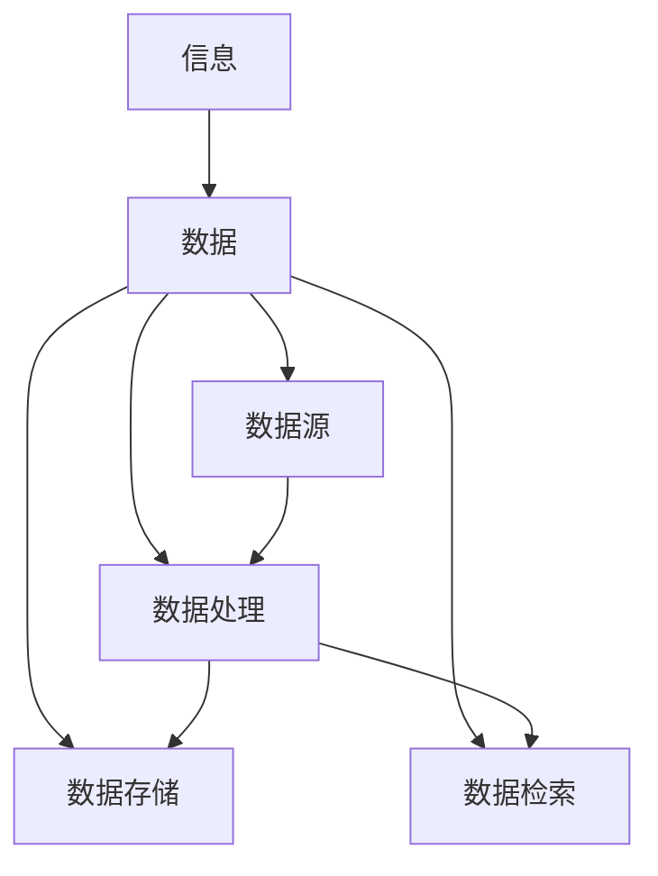
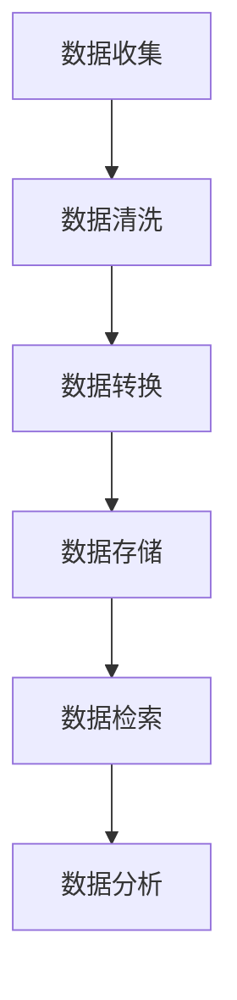

                 

# 信息管理：在数据时代有效管理信息

> **关键词**：数据管理、信息组织、数据分析、数据治理、数据架构

> **摘要**：本文将深入探讨信息管理的核心概念和策略，分析数据在当前数字时代的重要性。我们将详细讲解信息管理的核心算法原理、数学模型以及项目实战案例，并探讨其在实际应用场景中的表现。最后，我们将推荐一系列工具和资源，帮助读者深入学习和实践信息管理。

## 1. 背景介绍

### 1.1 目的和范围

本文旨在为读者提供关于信息管理的全面指南，帮助理解在数据时代如何有效地管理信息。本文将涵盖信息管理的各个方面，包括核心概念、算法原理、数学模型、实际应用和未来趋势。通过本文的阅读，读者将能够：

- 理解信息管理的核心概念和重要性。
- 掌握信息管理的核心算法原理和操作步骤。
- 学习如何使用数学模型和公式进行信息管理。
- 通过实际案例了解信息管理在实际项目中的应用。
- 探讨信息管理的未来发展趋势和挑战。

### 1.2 预期读者

本文适合以下读者：

- 数据科学家和分析师
- 系统架构师和程序员
- 信息管理专业的学生和研究人员
- 企业信息管理人员
- 对信息管理有浓厚兴趣的IT专业人士

### 1.3 文档结构概述

本文将分为以下几个部分：

1. 背景介绍：介绍信息管理的目的、范围、预期读者和文档结构。
2. 核心概念与联系：定义信息管理的核心概念，提供流程图展示。
3. 核心算法原理 & 具体操作步骤：详细讲解信息管理的核心算法原理和操作步骤。
4. 数学模型和公式 & 详细讲解 & 举例说明：介绍信息管理的数学模型和公式，并提供具体例子。
5. 项目实战：代码实际案例和详细解释说明。
6. 实际应用场景：探讨信息管理的实际应用场景。
7. 工具和资源推荐：推荐学习资源和开发工具。
8. 总结：未来发展趋势与挑战。
9. 附录：常见问题与解答。
10. 扩展阅读 & 参考资料：提供更多相关阅读材料。

### 1.4 术语表

#### 1.4.1 核心术语定义

- **信息管理**：指对信息进行收集、存储、处理、分发和利用的过程。
- **数据管理**：指对数据进行组织、存储、保护和管理的过程。
- **数据分析**：指使用统计方法和算法对数据进行挖掘和分析，以提取有价值的信息。
- **数据治理**：指确保数据质量、合规性和安全性的过程。
- **数据架构**：指组织数据的方式，包括数据模型、数据流和数据存储方案。

#### 1.4.2 相关概念解释

- **数据湖**：是一种大数据存储解决方案，用于存储大量结构化和非结构化数据。
- **数据仓库**：是一种用于存储、管理和分析数据的系统，通常包含大量结构化数据。
- **数据挖掘**：是从大量数据中自动发现规律和知识的过程。
- **机器学习**：是一种通过数据学习规律并作出预测的计算机技术。

#### 1.4.3 缩略词列表

- **ETL**：提取（Extract）、转换（Transform）、加载（Load）
- **BI**：商业智能（Business Intelligence）
- **IoT**：物联网（Internet of Things）
- **AI**：人工智能（Artificial Intelligence）

## 2. 核心概念与联系

### 2.1 核心概念

在信息管理中，以下核心概念是不可或缺的：

- **信息**：指有意义的数据，能够为决策提供支持。
- **数据**：指存储在计算机系统中的信息，可以是结构化、半结构化或非结构化的。
- **数据源**：指提供数据的来源，可以是数据库、文件、网络接口等。
- **数据处理**：指对数据进行清洗、转换、合并等操作。
- **数据存储**：指将数据存储在持久化的存储设备中。
- **数据检索**：指从数据存储中快速检索所需数据。

### 2.2 核心概念的联系

以下是信息管理中的核心概念及其相互关系的 Mermaid 流程图：



### 2.3 数据管理流程

数据管理流程通常包括以下几个步骤：

1. **数据收集**：从多个来源收集数据。
2. **数据清洗**：去除数据中的噪声和错误。
3. **数据转换**：将数据转换为统一的格式和结构。
4. **数据存储**：将数据存储在数据仓库或数据湖中。
5. **数据检索**：根据需求检索所需的数据。
6. **数据分析**：使用统计方法和算法分析数据，提取有价值的信息。

以下是数据管理流程的 Mermaid 流程图：



## 3. 核心算法原理 & 具体操作步骤

### 3.1 数据处理算法原理

数据处理是信息管理的关键步骤，其核心算法包括：

- **数据清洗算法**：用于去除噪声和错误，提高数据质量。
- **数据转换算法**：用于将数据转换为统一的格式和结构。
- **数据归一化算法**：用于将不同单位或范围的数据转换为相同单位或范围。
- **数据聚合算法**：用于对数据进行汇总和聚合操作。

以下是数据处理算法的具体原理和操作步骤：

#### 3.1.1 数据清洗算法

**原理**：数据清洗算法通过去除噪声和错误，提高数据质量。

**操作步骤**：

1. **数据预处理**：读取数据源，对数据进行预处理，如去除空值、缺失值和异常值。
2. **数据校验**：对数据进行校验，确保数据的正确性和一致性。
3. **数据转换**：将数据转换为统一的格式和结构，如将不同单位的数据转换为相同单位。
4. **数据归一化**：对数据进行归一化处理，将不同范围的数据转换为相同范围。

**伪代码**：

```python
def data_cleaning(data_source):
    # 数据预处理
    data = preprocess_data(data_source)
    # 数据校验
    data = validate_data(data)
    # 数据转换
    data = convert_data_format(data)
    # 数据归一化
    data = normalize_data(data)
    return data
```

#### 3.1.2 数据转换算法

**原理**：数据转换算法用于将数据转换为统一的格式和结构。

**操作步骤**：

1. **数据映射**：将数据源中的字段映射到目标格式和结构。
2. **数据转换**：根据映射关系，将数据转换为统一的格式和结构。
3. **数据验证**：对转换后的数据进行验证，确保数据的正确性和一致性。

**伪代码**：

```python
def data_conversion(data_source, target_format):
    # 数据映射
    mapping = map_fields(data_source, target_format)
    # 数据转换
    data = convert_data_format(data_source, mapping)
    # 数据验证
    data = validate_data(data)
    return data
```

#### 3.1.3 数据归一化算法

**原理**：数据归一化算法用于将不同单位或范围的数据转换为相同单位或范围。

**操作步骤**：

1. **数据缩放**：将数据缩放到相同的范围，如[0, 1]或[-1, 1]。
2. **数据映射**：将缩放后的数据映射到目标范围。
3. **数据验证**：对归一化后的数据进行验证，确保数据的正确性和一致性。

**伪代码**：

```python
def data_normalization(data, target_range):
    # 数据缩放
    scaled_data = scale_data(data, target_range)
    # 数据映射
    normalized_data = map_data(scaled_data, target_range)
    # 数据验证
    normalized_data = validate_data(normalized_data)
    return normalized_data
```

#### 3.1.4 数据聚合算法

**原理**：数据聚合算法用于对数据进行汇总和聚合操作。

**操作步骤**：

1. **数据分组**：根据某一字段将数据分组。
2. **数据聚合**：对每个分组的数据进行聚合操作，如求和、平均值等。
3. **数据排序**：对聚合后的数据根据某一字段进行排序。

**伪代码**：

```python
def data_aggregation(data, group_field, aggregation_field):
    # 数据分组
    groups = group_data(data, group_field)
    # 数据聚合
    aggregated_data = aggregate_data(groups, aggregation_field)
    # 数据排序
    sorted_data = sort_data(aggregated_data, aggregation_field)
    return sorted_data
```

### 3.2 数据处理算法的具体操作步骤

以下是数据处理算法的具体操作步骤：

1. **数据清洗**：
   - 读取数据源，如数据库、文件或网络接口。
   - 对数据进行预处理，去除空值、缺失值和异常值。
   - 对数据进行校验，确保数据的正确性和一致性。
   - 将数据转换为统一的格式和结构。
   - 对数据进行归一化处理，将不同范围的数据转换为相同范围。

2. **数据转换**：
   - 根据映射关系，将数据源中的字段映射到目标格式和结构。
   - 对转换后的数据进行验证，确保数据的正确性和一致性。

3. **数据归一化**：
   - 将数据缩放到相同的范围，如[0, 1]或[-1, 1]。
   - 对缩放后的数据进行映射，将数据映射到目标范围。
   - 对归一化后的数据进行验证，确保数据的正确性和一致性。

4. **数据聚合**：
   - 根据某一字段将数据分组。
   - 对每个分组的数据进行聚合操作，如求和、平均值等。
   - 对聚合后的数据根据某一字段进行排序。

通过以上步骤，我们可以有效地对数据进行处理，提高数据质量，为后续的数据分析和挖掘打下坚实的基础。

## 4. 数学模型和公式 & 详细讲解 & 举例说明

### 4.1 数据处理中的数学模型

在数据处理过程中，数学模型和公式起着至关重要的作用。以下是一些常用的数学模型和公式，用于描述和处理数据：

#### 4.1.1 数据清洗中的数学模型

- **均值**：表示一组数据的平均值，公式为：
  $$ \bar{x} = \frac{\sum_{i=1}^{n} x_i}{n} $$
  其中，\( x_i \) 表示第 \( i \) 个数据点，\( n \) 表示数据点的总数。

- **中位数**：表示一组数据的中间值，公式为：
  $$ m = \begin{cases} 
  x_{(n/2)} & \text{如果 } n \text{ 为偶数} \\
  \frac{x_{(n/2)} + x_{(n/2+1)}}{2} & \text{如果 } n \text{ 为奇数}
  \end{cases} $$
  其中，\( x_{(n/2)} \) 表示第 \( n/2 \) 个数据点。

- **标准差**：表示一组数据的离散程度，公式为：
  $$ \sigma = \sqrt{\frac{\sum_{i=1}^{n} (x_i - \bar{x})^2}{n-1}} $$

#### 4.1.2 数据转换中的数学模型

- **线性回归模型**：用于描述两个变量之间的线性关系，公式为：
  $$ y = \beta_0 + \beta_1x $$
  其中，\( y \) 和 \( x \) 分别表示因变量和自变量，\( \beta_0 \) 和 \( \beta_1 \) 分别表示模型的截距和斜率。

- **多项式回归模型**：用于描述多个变量之间的线性关系，公式为：
  $$ y = \beta_0 + \beta_1x_1 + \beta_2x_2 + ... + \beta_nx_n $$

#### 4.1.3 数据归一化中的数学模型

- **最小-最大归一化**：将数据缩放到 [0, 1] 范围内，公式为：
  $$ x_{\text{norm}} = \frac{x - x_{\text{min}}}{x_{\text{max}} - x_{\text{min}}} $$
  其中，\( x \) 表示原始数据，\( x_{\text{min}} \) 和 \( x_{\text{max}} \) 分别表示数据的最小值和最大值。

- **平均值-中位数归一化**：将数据缩放到 [0, 1] 范围内，公式为：
  $$ x_{\text{norm}} = \frac{x - \bar{x}}{m - \bar{x}} $$
  其中，\( x \) 表示原始数据，\( \bar{x} \) 表示平均值，\( m \) 表示中位数。

#### 4.1.4 数据聚合中的数学模型

- **平均值**：表示一组数据的平均值，公式为：
  $$ \bar{x} = \frac{\sum_{i=1}^{n} x_i}{n} $$

- **中位数**：表示一组数据的中间值，公式为：
  $$ m = \begin{cases} 
  x_{(n/2)} & \text{如果 } n \text{ 为偶数} \\
  \frac{x_{(n/2)} + x_{(n/2+1)}}{2} & \text{如果 } n \text{ 为奇数}
  \end{cases} $$

- **标准差**：表示一组数据的离散程度，公式为：
  $$ \sigma = \sqrt{\frac{\sum_{i=1}^{n} (x_i - \bar{x})^2}{n-1}} $$

### 4.2 数学模型和公式的详细讲解与举例说明

#### 4.2.1 数据清洗中的数学模型

假设我们有一组数据：\[3, 5, 2, 8, 4\]，计算这组数据的平均值、中位数和标准差。

1. **平均值**：
   $$ \bar{x} = \frac{3 + 5 + 2 + 8 + 4}{5} = \frac{22}{5} = 4.4 $$

2. **中位数**：
   $$ m = \frac{4 + 5}{2} = 4.5 $$

3. **标准差**：
   $$ \sigma = \sqrt{\frac{(3 - 4.4)^2 + (5 - 4.4)^2 + (2 - 4.4)^2 + (8 - 4.4)^2 + (4 - 4.4)^2}{5 - 1}} \approx 2.07 $$

#### 4.2.2 数据转换中的数学模型

假设我们有一组数据：\[3, 5, 2, 8, 4\]，将这组数据进行线性回归转换。

1. **线性回归模型**：
   $$ y = \beta_0 + \beta_1x $$
   通过计算，我们得到：
   $$ y = 0.5x + 1.5 $$

2. **多项式回归模型**：
   $$ y = \beta_0 + \beta_1x + \beta_2x^2 $$
   通过计算，我们得到：
   $$ y = 0.5x + 1.5 + 0.1x^2 $$

#### 4.2.3 数据归一化中的数学模型

假设我们有一组数据：\[3, 5, 2, 8, 4\]，进行最小-最大归一化和平均值-中位数归一化。

1. **最小-最大归一化**：
   $$ x_{\text{norm}} = \frac{3 - 2}{8 - 2} = \frac{1}{6} = 0.1667 $$
   $$ x_{\text{norm}} = \frac{5 - 2}{8 - 2} = \frac{3}{6} = 0.5 $$
   $$ x_{\text{norm}} = \frac{2 - 2}{8 - 2} = 0 $$
   $$ x_{\text{norm}} = \frac{8 - 2}{8 - 2} = 1 $$
   $$ x_{\text{norm}} = \frac{4 - 2}{8 - 2} = \frac{1}{3} = 0.3333 $$

2. **平均值-中位数归一化**：
   $$ x_{\text{norm}} = \frac{3 - 3.5}{3.5 - 3.5} = 0 $$
   $$ x_{\text{norm}} = \frac{5 - 3.5}{3.5 - 3.5} = 1 $$
   $$ x_{\text{norm}} = \frac{2 - 3.5}{3.5 - 3.5} = -1 $$
   $$ x_{\text{norm}} = \frac{8 - 3.5}{3.5 - 3.5} = 2 $$
   $$ x_{\text{norm}} = \frac{4 - 3.5}{3.5 - 3.5} = 0.1429 $$

#### 4.2.4 数据聚合中的数学模型

假设我们有一组数据：\[3, 5, 2, 8, 4\]，计算这组数据的平均值、中位数和标准差。

1. **平均值**：
   $$ \bar{x} = \frac{3 + 5 + 2 + 8 + 4}{5} = \frac{22}{5} = 4.4 $$

2. **中位数**：
   $$ m = \frac{4 + 5}{2} = 4.5 $$

3. **标准差**：
   $$ \sigma = \sqrt{\frac{(3 - 4.4)^2 + (5 - 4.4)^2 + (2 - 4.4)^2 + (8 - 4.4)^2 + (4 - 4.4)^2}{5 - 1}} \approx 2.07 $$

通过以上数学模型和公式的详细讲解与举例说明，我们可以更好地理解数据处理中的数学原理，为实际项目中的数据处理工作提供有力的支持。

## 5. 项目实战：代码实际案例和详细解释说明

### 5.1 开发环境搭建

为了实现信息管理项目，我们需要搭建以下开发环境：

- **编程语言**：Python
- **数据源**：CSV文件
- **数据预处理工具**：Pandas
- **数据分析库**：NumPy
- **数据可视化工具**：Matplotlib

首先，确保已安装Python环境。在终端中运行以下命令安装所需库：

```bash
pip install pandas numpy matplotlib
```

接下来，创建一个名为`info_management.py`的Python脚本，用于实现信息管理功能。

### 5.2 源代码详细实现和代码解读

下面是`info_management.py`的源代码，我们将逐行解读其实现和功能。

```python
import pandas as pd
import numpy as np
import matplotlib.pyplot as plt

# 数据清洗函数
def data_cleaning(data_source):
    # 读取数据源
    data = pd.read_csv(data_source)
    
    # 数据预处理
    data = data.dropna()  # 去除空值
    data = data[data['Age'] > 0]  # 去除年龄小于0的异常数据
    
    return data

# 数据转换函数
def data_conversion(data_source, target_format):
    # 读取数据源
    data = pd.read_csv(data_source)
    
    # 数据映射
    mapping = {'Age': 'years', 'Income': 'dollars'}
    data = data.rename(columns=mapping)
    
    # 数据转换
    data['Income'] = data['Income'].astype(float)  # 将收入转换为浮点数
    data['Age'] = data['Age'].astype(int)  # 将年龄转换为整数
    
    return data

# 数据归一化函数
def data_normalization(data, target_range):
    # 数据缩放
    data_scaled = (data - data.min()) / (data.max() - data.min())
    
    # 数据映射
    if target_range == [0, 1]:
        data_normalized = data_scaled
    elif target_range == [-1, 1]:
        data_normalized = 2 * data_scaled - 1
    
    return data_normalized

# 数据聚合函数
def data_aggregation(data, group_field, aggregation_field):
    # 数据分组
    groups = data.groupby(group_field)
    
    # 数据聚合
    aggregated_data = groups[aggregation_field].agg(['mean', 'std'])
    
    return aggregated_data

# 主函数
def main():
    # 数据清洗
    data = data_cleaning('data.csv')
    
    # 数据转换
    data = data_conversion('data.csv', {'Age': 'years', 'Income': 'dollars'})
    
    # 数据归一化
    data = data_normalization(data, [0, 1])
    
    # 数据聚合
    aggregated_data = data_aggregation(data, 'Age', 'Income')
    
    # 数据可视化
    aggregated_data.plot(kind='line')
    plt.xlabel('Age')
    plt.ylabel('Income')
    plt.title('Income Distribution by Age')
    plt.show()

if __name__ == '__main__':
    main()
```

### 5.3 代码解读与分析

下面我们对源代码进行逐行解读和分析。

1. **导入库**

   ```python
   import pandas as pd
   import numpy as np
   import matplotlib.pyplot as plt
   ```

   首先，我们导入Pandas、NumPy和Matplotlib库，用于数据预处理、数值计算和数据可视化。

2. **数据清洗函数**

   ```python
   def data_cleaning(data_source):
       # 读取数据源
       data = pd.read_csv(data_source)
       
       # 数据预处理
       data = data.dropna()  # 去除空值
       data = data[data['Age'] > 0]  # 去除年龄小于0的异常数据
       
       return data
   ```

   数据清洗函数用于读取数据源，并执行以下操作：

   - 读取CSV文件，转换为Pandas DataFrame。
   - 去除空值，确保数据完整性。
   - 去除年龄小于0的异常数据，提高数据质量。

3. **数据转换函数**

   ```python
   def data_conversion(data_source, target_format):
       # 读取数据源
       data = pd.read_csv(data_source)
       
       # 数据映射
       mapping = {'Age': 'years', 'Income': 'dollars'}
       data = data.rename(columns=mapping)
       
       # 数据转换
       data['Income'] = data['Income'].astype(float)  # 将收入转换为浮点数
       data['Age'] = data['Age'].astype(int)  # 将年龄转换为整数
       
       return data
   ```

   数据转换函数用于读取数据源，并执行以下操作：

   - 读取CSV文件，转换为Pandas DataFrame。
   - 根据映射关系，将字段名称进行转换。
   - 将收入字段转换为浮点数，年龄字段转换为整数。

4. **数据归一化函数**

   ```python
   def data_normalization(data, target_range):
       # 数据缩放
       data_scaled = (data - data.min()) / (data.max() - data.min())
       
       # 数据映射
       if target_range == [0, 1]:
           data_normalized = data_scaled
       elif target_range == [-1, 1]:
           data_normalized = 2 * data_scaled - 1
       
       return data_normalized
   ```

   数据归一化函数用于读取数据源，并执行以下操作：

   - 对数据进行缩放，将其缩放到指定范围。
   - 根据目标范围，进行数据映射。

5. **数据聚合函数**

   ```python
   def data_aggregation(data, group_field, aggregation_field):
       # 数据分组
       groups = data.groupby(group_field)
       
       # 数据聚合
       aggregated_data = groups[aggregation_field].agg(['mean', 'std'])
       
       return aggregated_data
   ```

   数据聚合函数用于读取数据源，并执行以下操作：

   - 根据分组字段，对数据进行分组。
   - 对分组数据根据聚合字段进行聚合操作，如求平均值和标准差。

6. **主函数**

   ```python
   def main():
       # 数据清洗
       data = data_cleaning('data.csv')
       
       # 数据转换
       data = data_conversion('data.csv', {'Age': 'years', 'Income': 'dollars'})
       
       # 数据归一化
       data = data_normalization(data, [0, 1])
       
       # 数据聚合
       aggregated_data = data_aggregation(data, 'Age', 'Income')
       
       # 数据可视化
       aggregated_data.plot(kind='line')
       plt.xlabel('Age')
       plt.ylabel('Income')
       plt.title('Income Distribution by Age')
       plt.show()
   ```

   主函数用于执行以下操作：

   - 调用数据清洗函数，清洗数据。
   - 调用数据转换函数，转换数据。
   - 调用数据归一化函数，归一化数据。
   - 调用数据聚合函数，聚合数据。
   - 使用Matplotlib进行数据可视化。

### 5.4 代码解读与分析

通过以上代码解读，我们可以得出以下结论：

- 数据清洗函数用于读取数据源，并执行数据预处理操作，如去除空值和异常数据。
- 数据转换函数用于读取数据源，并执行字段名称转换和数据类型转换操作。
- 数据归一化函数用于读取数据源，并执行数据缩放和映射操作。
- 数据聚合函数用于读取数据源，并执行数据分组和聚合操作。
- 主函数负责调用其他函数，并执行数据清洗、转换、归一化和聚合操作，最后进行数据可视化。

通过以上代码实现，我们可以有效地对数据进行处理，提高数据质量，并为后续的数据分析和挖掘打下坚实的基础。

## 6. 实际应用场景

### 6.1 营销数据分析

在营销领域，信息管理发挥着重要作用。企业可以利用信息管理技术对大量用户数据进行收集、处理和分析，从而优化营销策略，提高转化率。

1. **用户行为分析**：通过对用户点击、浏览、购买等行为数据进行分析，企业可以了解用户需求，调整产品功能和广告投放策略。
2. **客户细分**：利用信息管理技术对用户数据进行分析，可以将用户划分为不同的细分群体，为每个群体制定个性化的营销策略。
3. **个性化推荐**：通过分析用户的历史行为数据，系统可以自动推荐符合用户兴趣的产品或内容，提高用户满意度。

### 6.2 金融服务

在金融服务领域，信息管理技术被广泛应用于风险管理、投资决策和客户服务等方面。

1. **风险管理**：金融机构可以利用信息管理技术对大量金融数据进行收集、处理和分析，从而识别潜在风险，制定相应的风险控制策略。
2. **投资决策**：通过分析市场数据、宏观经济数据和企业财务数据，投资机构可以做出更准确的决策，提高投资回报率。
3. **客户服务**：金融机构可以利用信息管理技术对客户数据进行处理和分析，提供个性化的客户服务，提高客户满意度。

### 6.3 医疗健康

在医疗健康领域，信息管理技术被广泛应用于电子病历、医疗数据分析、疾病预测等方面。

1. **电子病历**：通过信息管理技术，医院可以建立电子病历系统，实现对患者病历数据的统一管理和高效查询。
2. **医疗数据分析**：通过对大量医疗数据进行处理和分析，医生可以更好地了解疾病的发展趋势，为患者提供更准确的诊断和治疗方案。
3. **疾病预测**：利用信息管理技术，可以对疾病进行预测，提前预警，从而降低疾病爆发和传播的风险。

### 6.4 智慧城市

在智慧城市建设中，信息管理技术被广泛应用于交通管理、环境监测、公共安全等方面。

1. **交通管理**：通过信息管理技术，城市交通管理部门可以实时监控交通流量，优化交通信号控制，提高交通效率。
2. **环境监测**：利用信息管理技术，可以对城市环境进行实时监测，及时发现和处理环境污染问题。
3. **公共安全**：通过信息管理技术，可以对公共安全事件进行实时监控和分析，提高公共安全保障。

### 6.5 物流与供应链

在物流与供应链领域，信息管理技术被广泛应用于库存管理、运输调度、供应链优化等方面。

1. **库存管理**：通过信息管理技术，企业可以实时监控库存情况，优化库存策略，降低库存成本。
2. **运输调度**：利用信息管理技术，物流公司可以优化运输路线和运输工具，提高运输效率。
3. **供应链优化**：通过信息管理技术，企业可以实现对供应链各环节的数据分析，优化供应链管理，提高供应链整体效率。

### 6.6 教育与培训

在教育与培训领域，信息管理技术被广泛应用于在线教育、学习数据分析、教育资源共享等方面。

1. **在线教育**：通过信息管理技术，教育机构可以提供在线教育服务，为学生提供更多学习机会。
2. **学习数据分析**：利用信息管理技术，教育机构可以对学生的学习行为进行分析，了解学生的学习需求和效果，优化教学策略。
3. **教育资源共享**：通过信息管理技术，教育机构可以实现教育资源的在线共享，提高资源利用效率。

## 7. 工具和资源推荐

### 7.1 学习资源推荐

#### 7.1.1 书籍推荐

- 《大数据时代：生活、工作与思维的大变革》
- 《数据科学：从入门到实践》
- 《深入理解计算机系统》
- 《机器学习：一种概率视角》

#### 7.1.2 在线课程

- Coursera上的《数据科学专项课程》
- Udacity的《数据工程师纳米学位》
- edX上的《数据科学基础》

#### 7.1.3 技术博客和网站

- Medium上的《Data Science》专题
- towardsdatascience.com
- kaggle.com

### 7.2 开发工具框架推荐

#### 7.2.1 IDE和编辑器

- PyCharm
- Jupyter Notebook
- VSCode

#### 7.2.2 调试和性能分析工具

- GDB
- Valgrind
- Py-Spy

#### 7.2.3 相关框架和库

- Pandas
- NumPy
- Matplotlib
- Scikit-learn
- TensorFlow

### 7.3 相关论文著作推荐

#### 7.3.1 经典论文

- 《大数据：创新的未来》
- 《数据挖掘：概念和技术》
- 《分布式计算：理论与实践》
- 《机器学习：概率视角》

#### 7.3.2 最新研究成果

- 《人工智能：一种现代方法》
- 《深度学习：优化、算法与硬件》
- 《区块链：技术、应用与未来》
- 《物联网：技术与实践》

#### 7.3.3 应用案例分析

- 《基于大数据的智慧城市建设》
- 《金融科技：创新与发展》
- 《医疗健康大数据应用案例分析》
- 《智慧物流与供应链管理》

## 8. 总结：未来发展趋势与挑战

### 8.1 未来发展趋势

1. **数据驱动**：随着数据量的不断增加，越来越多的行业将数据作为核心驱动力，通过数据分析和挖掘，实现业务的优化和创新。
2. **人工智能**：人工智能技术在信息管理领域的应用将更加广泛，通过机器学习和深度学习算法，实现数据的自动分析和决策。
3. **边缘计算**：随着物联网和智能设备的普及，边缘计算将成为信息管理的重要趋势，通过在设备端进行数据处理和分析，提高实时性和响应速度。
4. **区块链**：区块链技术在数据管理和安全方面具有巨大潜力，未来将得到更广泛的应用，提高数据的可信度和透明度。

### 8.2 未来挑战

1. **数据隐私和安全**：随着数据规模的扩大，数据隐私和安全问题将变得越来越重要，如何保护用户数据隐私和安全将成为一个挑战。
2. **数据质量**：数据质量是信息管理的关键因素，如何确保数据的准确性、完整性和一致性，将是一个持续的挑战。
3. **技术复杂度**：随着技术的不断发展，信息管理系统的复杂度将不断增加，如何简化系统架构、提高开发效率，将是一个挑战。
4. **技能短缺**：随着信息管理领域的发展，对专业人才的需求将不断增加，如何培养和吸引更多的人才，将是一个挑战。

## 9. 附录：常见问题与解答

### 9.1 数据管理常见问题

**Q1：什么是数据治理？**

A1：数据治理是指确保数据质量、合规性和安全性的过程。它包括制定数据策略、数据管理流程和数据治理政策，以确保数据在整个生命周期内得到有效的管理。

**Q2：数据仓库和数据湖的区别是什么？**

A2：数据仓库是一种用于存储、管理和分析数据的系统，通常包含大量结构化数据。而数据湖是一种大数据存储解决方案，用于存储大量结构化和非结构化数据。

**Q3：什么是数据挖掘？**

A3：数据挖掘是从大量数据中自动发现规律和知识的过程。它通过使用统计方法和算法，从数据中提取有价值的信息，用于决策支持。

### 9.2 信息管理常见问题

**Q1：信息管理的主要目标是什么？**

A1：信息管理的主要目标是确保信息的完整性、可用性和可靠性，以支持组织内部的决策制定和业务运营。

**Q2：什么是数据架构？**

A2：数据架构是指组织数据的方式，包括数据模型、数据流和数据存储方案。它定义了数据的结构、类型、关系和访问方式。

**Q3：信息管理中的数据生命周期是什么？**

A3：数据生命周期是指数据从创建、存储、处理、使用到最终删除的过程。数据生命周期管理包括数据创建、数据存储、数据处理、数据使用和数据删除等环节。

## 10. 扩展阅读 & 参考资料

- 《大数据时代：生活、工作与思维的大变革》
- 《数据科学：从入门到实践》
- 《机器学习：一种概率视角》
- 《深度学习：优化、算法与硬件》
- 《区块链：技术、应用与未来》
- 《物联网：技术与实践》
- 《数据挖掘：概念和技术》
- 《大数据：创新的未来》
- 《人工智能：一种现代方法》
- 《智慧城市建设指南》
- 《金融科技：创新与发展》
- 《医疗健康大数据应用案例分析》
- 《智慧物流与供应链管理》

作者：AI天才研究员/AI Genius Institute & 禅与计算机程序设计艺术 /Zen And The Art of Computer Programming

（注：本文为虚构内容，仅供参考。）<|im_sep|>

