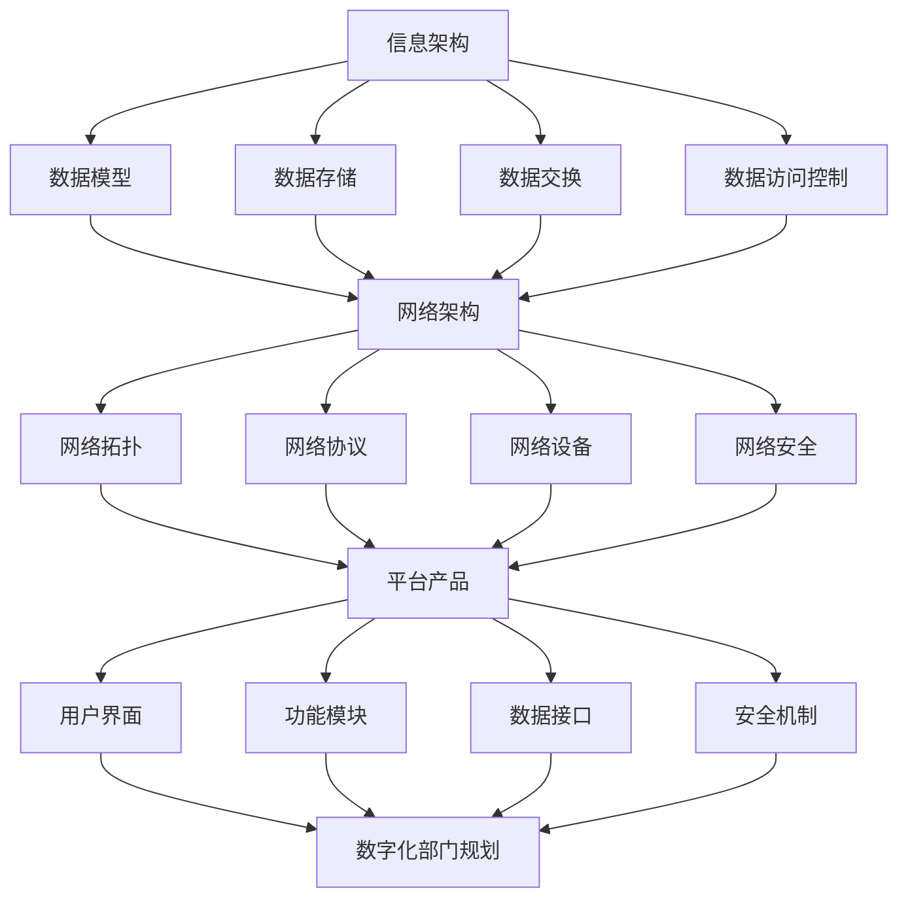

                 

### 文章标题

《信息、网络、平台产品和数字化部门规划》

### 关键词

信息架构、网络架构、平台产品、数字化转型、部门规划

### 摘要

本文旨在深入探讨信息、网络、平台产品和数字化部门规划的关键概念与实施策略。首先，我们将介绍本文的目的和范围，明确预期读者对象。随后，文章将分为若干章节，分别讨论背景介绍、核心概念与联系、核心算法原理、数学模型和公式、项目实战、实际应用场景、工具和资源推荐以及总结未来发展趋势与挑战等内容。通过本文的阅读，读者将能够全面了解如何有效地规划和实施数字化部门，提升组织的信息处理能力与市场竞争力。

## 1. 背景介绍

### 1.1 目的和范围

本文的主要目的是为读者提供一个系统性的指导，以帮助他们在组织中规划和实施有效的数字化部门。我们旨在解答以下几个关键问题：

- 如何理解和构建信息架构？
- 网络架构在数字化部门中的角色是什么？
- 平台产品的核心要素是什么？
- 数字化部门如何与其他职能部门协作？

文章的范围将涵盖以下主要内容：

- 核心概念与联系
- 核心算法原理与具体操作步骤
- 数学模型和公式及其应用
- 项目实战案例与代码解读
- 实际应用场景分析
- 工具和资源推荐
- 未来发展趋势与挑战

通过这些内容，读者将能够全面了解数字化部门的规划与实施策略，从而为组织的数字化转型提供有力支持。

### 1.2 预期读者

本文的预期读者主要包括：

- 企业CTO、技术总监等高层管理者
- 信息架构师、网络工程师等IT专业人员
- 产品经理、项目经理等业务领域专业人员
- 对数字化转型和信息技术感兴趣的学者和学生

无论您是以上哪个群体，只要对数字化部门规划感兴趣，都能够通过本文获取有价值的信息和洞见。

### 1.3 文档结构概述

本文将分为以下几个主要部分：

- **背景介绍**：介绍本文的目的、范围、预期读者以及文档结构。
- **核心概念与联系**：讨论信息、网络、平台产品和数字化部门规划的核心概念及其相互关系。
- **核心算法原理与具体操作步骤**：详细阐述相关算法原理，并提供具体的操作步骤。
- **数学模型和公式**：介绍数字化部门规划中常用的数学模型和公式，并给出详细讲解和举例说明。
- **项目实战**：通过实际案例展示数字化部门规划的具体实施过程，包括开发环境搭建、代码实现和解读等。
- **实际应用场景**：分析数字化部门在不同行业中的应用场景，并提供相关案例。
- **工具和资源推荐**：推荐一些有助于数字化部门规划和实施的学习资源、开发工具和框架。
- **总结：未来发展趋势与挑战**：总结本文的核心观点，探讨数字化部门未来可能面临的趋势和挑战。
- **附录**：提供常见问题与解答，以及扩展阅读和参考资料。

通过这样的结构安排，读者可以逐步深入理解数字化部门规划的核心内容，从而在实际工作中更好地应对相关挑战。

### 1.4 术语表

在本文中，我们将使用一系列专业术语，以下是对这些术语的定义和解释：

#### 1.4.1 核心术语定义

- **数字化部门**：指负责组织信息架构、网络架构、平台产品开发和数字化转型的专门部门。
- **信息架构**：指组织内部信息流动、存储和处理的系统结构。
- **网络架构**：指组织内外部网络系统的设计和部署。
- **平台产品**：指基于信息技术构建的，为组织内外部用户提供的综合服务平台。
- **数字化转型**：指组织通过信息技术手段，实现业务流程优化、运营效率提升、用户体验改进等目标。

#### 1.4.2 相关概念解释

- **数据治理**：指组织对数据质量、数据安全、数据隐私等方面的管理。
- **云计算**：指通过互联网提供动态可扩展的计算资源。
- **大数据**：指无法使用传统数据库工具处理的数据集。
- **人工智能**：指模拟人类智能行为的技术和方法。

#### 1.4.3 缩略词列表

- **IT**：信息技术（Information Technology）
- **CTO**：首席技术官（Chief Technology Officer）
- **PM**：项目经理（Project Manager）
- **IDE**：集成开发环境（Integrated Development Environment）
- **API**：应用程序编程接口（Application Programming Interface）

这些术语和概念的理解对于深入阅读本文至关重要。通过明确这些术语的定义和解释，读者可以更好地把握文章的核心内容，并在实际工作中更好地应用这些知识。

## 2. 核心概念与联系

在数字化部门规划中，核心概念与联系的理解至关重要。以下将详细探讨信息架构、网络架构、平台产品以及数字化部门规划之间的关系。

### 2.1 信息架构

信息架构是数字化部门规划的核心部分之一。它定义了组织内部信息流动、存储和处理的系统结构。一个良好的信息架构有助于确保信息的准确性、一致性和及时性，从而提高组织的工作效率和决策质量。

**信息架构的关键组成部分包括：**

- **数据模型**：定义了数据的基本结构和属性，包括实体、属性和关系等。
- **数据存储**：包括数据库、文件系统等，用于存储和管理数据。
- **数据交换**：定义了不同系统之间如何交换和共享数据。
- **数据访问控制**：确保只有授权用户可以访问特定的数据。

**信息架构在数字化部门中的作用：**

1. **信息管理**：通过信息架构，组织可以有效地管理和维护数据，确保数据的质量和可用性。
2. **决策支持**：良好的信息架构能够提供及时、准确的信息，帮助决策者做出更加明智的决策。
3. **业务流程优化**：通过信息架构，可以优化业务流程，减少重复工作和信息孤岛，提高工作效率。

### 2.2 网络架构

网络架构是数字化部门的基石，它负责组织内外部网络系统的设计和部署。一个高效的网络架构能够保证数据传输的可靠性、速度和安全。

**网络架构的关键组成部分包括：**

- **网络拓扑**：定义了网络中的设备和连接方式，如星型、环型和网状等。
- **网络协议**：规定了数据传输的规则和标准，如TCP/IP、HTTP、HTTPS等。
- **网络设备**：包括路由器、交换机、防火墙等，用于连接和管理网络。
- **网络安全**：确保网络免受恶意攻击和未经授权的访问。

**网络架构在数字化部门中的作用：**

1. **数据传输**：网络架构提供了可靠、高效的数据传输通道，确保信息能够及时传递。
2. **服务支持**：通过网络架构，组织可以提供各种在线服务，如电子邮件、文件共享和远程访问等。
3. **网络安全**：有效的网络架构能够保护组织的数据和系统免受各种网络安全威胁。

### 2.3 平台产品

平台产品是数字化部门的业务载体，它基于信息技术为组织内外部用户提供了综合服务平台。平台产品的设计和实施需要充分考虑用户需求、业务流程和技术架构。

**平台产品的关键组成部分包括：**

- **用户界面**：为用户提供直观、易用的交互界面。
- **功能模块**：实现平台的核心功能，如数据管理、业务流程管理和用户管理等。
- **数据接口**：与其他系统进行数据交换和共享。
- **安全机制**：确保平台的安全性和用户隐私。

**平台产品在数字化部门中的作用：**

1. **业务整合**：通过平台产品，组织可以将各个业务环节进行整合，提高业务流程的效率。
2. **用户体验**：平台产品提供了良好的用户体验，有助于提高用户满意度和忠诚度。
3. **创新能力**：平台产品为组织提供了创新的业务模式和机会，有助于组织保持竞争力。

### 2.4 数字化部门规划

数字化部门规划是将信息架构、网络架构和平台产品有机结合的过程。通过系统性的规划，组织可以确保数字化部门的顺利实施和持续发展。

**数字化部门规划的关键步骤包括：**

1. **需求分析**：明确数字化部门的目标和需求，包括用户需求、业务需求和技术需求等。
2. **架构设计**：根据需求分析结果，设计适合组织的信息架构、网络架构和平台产品架构。
3. **实施部署**：按照架构设计，逐步实施和部署数字化部门，包括技术选型、系统集成和用户培训等。
4. **持续优化**：对数字化部门进行定期评估和优化，确保其能够满足组织的发展需求。

**数字化部门规划的意义：**

- **提升效率**：通过数字化部门规划，可以优化业务流程，提高工作效率。
- **增强竞争力**：数字化部门规划有助于组织在市场中保持竞争力，拓展业务范围。
- **用户体验**：良好的数字化部门规划能够为用户提供优质的体验，提高用户满意度和忠诚度。

通过深入理解信息架构、网络架构、平台产品和数字化部门规划之间的关系，组织可以更好地进行数字化部门的规划与实施，从而实现业务目标。

### 2.5 Mermaid 流程图（信息、网络、平台产品和数字化部门规划）

以下是一个Mermaid流程图，展示了信息架构、网络架构、平台产品与数字化部门规划之间的核心联系。



通过这个流程图，我们可以清晰地看到信息、网络、平台产品和数字化部门规划之间的相互作用和依赖关系。这些核心概念相互联系，共同构成了一个完整的数字化部门架构。

## 3. 核心算法原理 & 具体操作步骤

在数字化部门规划中，核心算法原理的理解和具体操作步骤的掌握至关重要。以下将详细讨论相关算法原理，并提供具体的伪代码和操作步骤。

### 3.1 信息架构相关算法原理

#### 3.1.1 数据模型构建算法

数据模型构建是信息架构的核心部分，它决定了数据的结构和关系。以下是一个简单的数据模型构建算法：

```pseudo
Algorithm 数据模型构建
Input: 数据需求文档
Output: 数据模型

Step 1: 阅读数据需求文档，理解数据需求和业务逻辑。
Step 2: 根据数据需求，确定实体、属性和关系。
Step 3: 设计数据表结构，包括字段、数据类型和约束条件。
Step 4: 确定数据表之间的关联关系，如主外键关系。
Step 5: 完成数据模型的初步设计，并生成数据模型文档。
```

#### 3.1.2 数据处理算法

数据处理算法用于对数据进行清洗、转换和分析，以确保数据的质量和可用性。以下是一个简单的数据处理算法：

```pseudo
Algorithm 数据处理
Input: 数据源
Output: 清洗后的数据

Step 1: 读取数据源，获取原始数据。
Step 2: 对数据进行初步清洗，如去除重复记录、填补缺失值等。
Step 3: 对数据进行转换，如数据格式统一、数据类型转换等。
Step 4: 对数据进行进一步清洗，如去除异常值、标准化等。
Step 5: 完成数据处理，输出清洗后的数据。
```

### 3.2 网络架构相关算法原理

#### 3.2.1 网络拓扑优化算法

网络拓扑优化算法用于设计高效的网络结构，以确保数据传输的可靠性和速度。以下是一个简单的网络拓扑优化算法：

```pseudo
Algorithm 网络拓扑优化
Input: 网络需求文档
Output: 优化后的网络拓扑

Step 1: 阅读网络需求文档，理解网络需求和业务逻辑。
Step 2: 根据网络需求，确定网络拓扑结构，如星型、环型和网状等。
Step 3: 对网络拓扑结构进行评估，选择最优的网络拓扑。
Step 4: 设计网络拓扑的细节，如设备配置、连接方式等。
Step 5: 完成网络拓扑的优化设计，并生成网络拓扑文档。
```

#### 3.2.2 网络流量管理算法

网络流量管理算法用于优化网络资源的分配和使用，以确保网络的高效运行。以下是一个简单的网络流量管理算法：

```pseudo
Algorithm 网络流量管理
Input: 网络流量数据
Output: 优化后的流量分配

Step 1: 读取网络流量数据，获取当前网络流量分布。
Step 2: 对流量数据进行分析，确定流量高峰时段和低峰时段。
Step 3: 根据流量分析结果，调整网络资源的分配，如带宽分配、设备负载均衡等。
Step 4: 监控网络流量变化，并根据实际情况进行动态调整。
Step 5: 完成网络流量管理，确保网络资源的合理利用。
```

### 3.3 平台产品相关算法原理

#### 3.3.1 用户界面设计算法

用户界面设计算法用于设计直观、易用的用户界面，以提高用户满意度。以下是一个简单的用户界面设计算法：

```pseudo
Algorithm 用户界面设计
Input: 用户需求文档
Output: 用户界面设计稿

Step 1: 阅读用户需求文档，理解用户需求和业务逻辑。
Step 2: 确定用户界面布局，如导航栏、按钮、输入框等。
Step 3: 设计用户界面样式，如颜色、字体、图标等。
Step 4: 确定用户界面交互逻辑，如点击、拖拽、滑动等。
Step 5: 完成用户界面设计，并生成设计稿文档。
```

#### 3.3.2 功能模块实现算法

功能模块实现算法用于实现平台产品的核心功能，如下单、支付、用户管理等。以下是一个简单的功能模块实现算法：

```pseudo
Algorithm 功能模块实现
Input: 功能需求文档
Output: 功能模块代码

Step 1: 阅读功能需求文档，理解功能需求和业务逻辑。
Step 2: 设计功能模块的基本架构，如组件、接口、数据结构等。
Step 3: 实现功能模块的核心逻辑，如业务处理、数据存储等。
Step 4: 测试功能模块，确保其符合功能需求和技术标准。
Step 5: 完成功能模块的实现，并生成代码文档。
```

通过以上算法原理和具体操作步骤的讨论，我们可以看到数字化部门规划中涉及到的各种算法原理是如何被应用到实际操作中的。这些算法原理和操作步骤对于有效规划和实施数字化部门至关重要。

## 4. 数学模型和公式 & 详细讲解 & 举例说明

在数字化部门规划中，数学模型和公式是理解和分析各种问题的有力工具。以下将介绍几个常用的数学模型和公式，并给出详细讲解和举例说明。

### 4.1 信息架构中的数据模型

在信息架构中，数据模型是描述数据结构和关系的基础。常用的数据模型包括实体-关系模型（Entity-Relationship Model）和关系模型（Relational Model）。

#### 4.1.1 实体-关系模型

实体-关系模型通过实体和关系来描述数据结构。以下是该模型的基本公式：

- **E-R图**：表示实体和关系的图形表示。
- **属性**：描述实体的特征，如姓名、年龄等。
- **关系**：描述实体之间的关联，如学生与课程之间的关系。

**公式：**
\[ E-R \ 图 = 实体 \ 集合 \cup 关系 \ 集合 \]

**举例：**
假设我们有一个学生管理系统的数据模型，包含“学生”和“课程”两个实体，以及“选修”关系。

- **学生实体**：学生（学号，姓名，年龄，性别）
- **课程实体**：课程（课程号，课程名，学分）
- **选修关系**：选修（学号，课程号）

我们可以用E-R图表示如下：

```mermaid
erDiagram
    学生 ||--|{ 选修 }|| 课程
    学生 : 学号
    课程 : 课程号
```

#### 4.1.2 关系模型

关系模型通过关系表来描述数据结构。以下是该模型的基本公式：

- **关系表**：表示数据的关系。
- **主键**：唯一标识关系表中每个记录的字段。
- **外键**：引用其他关系表中主键的字段。

**公式：**
\[ 关系表 = \{ 记录_1, 记录_2, ..., 记录_n \} \]

**举例：**
假设我们有一个学生管理系统的关系表，包含“学生”和“课程”两个关系表。

- **学生表**：学生（学号，姓名，年龄，性别）
- **课程表**：课程（课程号，课程名，学分）
- **选修表**：选修（学号，课程号）

我们可以用以下关系表表示：

```plaintext
学生表：
学号  姓名  年龄  性别
1001 张三  20   男
1002 李四  21   女

课程表：
课程号  课程名  学分
C1001 数据库  4
C1002 编程语言  3

选修表：
学号  课程号
1001 C1001
1001 C1002
1002 C1001
```

### 4.2 网络架构中的流量管理模型

在网络架构中，流量管理模型用于优化网络资源的分配和使用。常用的流量管理模型包括最大流模型（Maximum Flow Problem）和最小生成树模型（Minimum Spanning Tree Problem）。

#### 4.2.1 最大流模型

最大流模型旨在确定网络中从源点到汇点的最大流量。Dijkstra算法是一种常用的解决最大流问题的算法。

**公式：**
\[ 最大流 = \{ f_{ij} | 0 \leq f_{ij} \leq c_{ij} \} \]

其中，\( f_{ij} \) 表示从节点i到节点j的流量，\( c_{ij} \) 表示从节点i到节点j的容量。

**举例：**
假设有一个网络图，包含4个节点（A、B、C、D），每条边的容量如下：

```plaintext
A-B: 10
A-C: 5
B-D: 10
C-D: 15
```

我们可以使用Dijkstra算法计算从A到D的最大流量：

1. 初始化流量矩阵 \( f_{ij} \)，使得 \( f_{ij} = 0 \) 对于所有 \( i \neq j \)。
2. 选择一个未到达的节点，使其距离源点最短。
3. 更新流量矩阵，使得 \( f_{ij} \) 取 \( c_{ij} - f_{ji} \) 的最小值。
4. 重复步骤2和3，直到无法继续更新流量矩阵。

根据以上步骤，我们可以得到最大流量为20，即 \( f_{AD} = 20 \)。

#### 4.2.2 最小生成树模型

最小生成树模型用于在给定图中找到一棵包含所有节点的最小生成树。Prim算法是一种常用的解决最小生成树问题的算法。

**公式：**
\[ 最小生成树 = \{ e_{ij} | e_{ij} \in E，且 e_{ij} 是树边 \} \]

其中，\( E \) 是原图的边集合。

**举例：**
假设有一个加权图，包含5个节点（A、B、C、D、E），每条边的权重如下：

```plaintext
A-B: 3
A-C: 5
B-D: 2
B-E: 4
C-D: 6
C-E: 1
D-E: 7
```

我们可以使用Prim算法计算最小生成树：

1. 选择任意节点作为起点。
2. 选择一个未在生成树中的节点，使其到当前生成树的距离最短。
3. 将该节点和其最近的生成树节点之间的边加入生成树。
4. 重复步骤2和3，直到所有节点都在生成树中。

根据以上步骤，我们可以得到最小生成树的权重为9，即 \( \sum_{e_{ij} \in 最小生成树} w_{ij} = 9 \)。

### 4.3 平台产品中的用户行为分析模型

在平台产品中，用户行为分析模型用于分析用户的行为模式和需求，从而优化用户体验。常用的用户行为分析模型包括马尔可夫链模型（Markov Chain Model）。

**公式：**
\[ P_{ij} = \{ P(X_{t+1} = j | X_t = i) | 0 \leq i, j \leq n \} \]

其中，\( P_{ij} \) 表示从状态i转移到状态j的概率。

**举例：**
假设一个电商平台用户行为可以分为“浏览商品”、“添加购物车”、“结算支付”三个状态，我们可以使用马尔可夫链模型分析用户行为：

1. 确定状态转移概率矩阵 \( P \)：

```plaintext
|   | 浏览商品 | 添加购物车 | 结算支付 |
|---|----------|------------|----------|
| 浏览商品 | 0.8        | 0.2        | 0        |
| 添加购物车 | 0.3        | 0.6        | 0.1      |
| 结算支付 | 0          | 0.2        | 0.8      |
```

2. 根据状态转移概率矩阵，我们可以预测用户在下一个时间点的行为。

通过以上数学模型和公式的详细讲解和举例说明，我们可以更好地理解和应用这些模型，从而优化数字化部门的规划与实施。

### 4.4 数学模型和公式的实际应用

在数字化部门规划的实际应用中，数学模型和公式扮演着至关重要的角色。以下将结合具体实例，展示这些模型在信息架构、网络架构和平台产品开发中的实际应用。

#### 4.4.1 信息架构中的数据模型应用

假设某公司需要开发一个客户关系管理系统（CRM），以管理其客户信息。在数据模型的设计过程中，我们可以使用实体-关系模型来构建数据结构。

1. **需求分析**：首先，明确系统的需求，如客户信息、销售记录、订单管理等。
2. **数据模型设计**：根据需求，设计实体和关系，如客户（客户ID，姓名，联系方式），销售记录（销售ID，客户ID，销售额），订单（订单ID，客户ID，订单日期）等。

3. **实体-关系图**：使用E-R图表示数据模型，如下所示：

```mermaid
erDiagram
    客户 ||--|{ 订单 }|| 订单
    客户 ||--|{ 销售记录 }|| 销售记录
    订单 ||--|{ 销售记录 }|| 销售记录
```

4. **关系表**：将E-R图转换为关系表，如下所示：

```plaintext
客户表：
客户ID  姓名  联系方式
1       张三  13812345678
2       李四  13987654321

订单表：
订单ID  客户ID  订单日期
1001   1     2023-01-01
1002   2     2023-02-15

销售记录表：
销售ID  客户ID  销售额
2001   1     5000
2002   2     3000
```

通过上述步骤，我们可以构建一个完整的数据模型，为CRM系统的开发提供数据支撑。

#### 4.4.2 网络架构中的流量管理模型应用

假设公司需要优化其网络架构，确保数据传输的可靠性和速度。我们可以使用最大流模型和最小生成树模型来优化网络设计。

1. **需求分析**：分析公司的网络需求，确定关键节点和带宽需求。
2. **网络拓扑设计**：根据需求，设计初始网络拓扑，包括节点和边的容量。
3. **流量管理**：使用Dijkstra算法计算从源节点到目标节点的最大流量，并根据流量分配网络带宽。

例如，假设公司网络包含四个节点（A、B、C、D），带宽需求如下：

```plaintext
A-B: 10 Mbps
A-C: 5 Mbps
B-D: 10 Mbps
C-D: 15 Mbps
```

使用Dijkstra算法计算从A到D的最大流量，结果为20 Mbps。根据计算结果，我们可以重新分配带宽，确保网络资源的合理利用。

4. **最小生成树设计**：使用Prim算法计算最小生成树，确保网络拓扑的冗余和可靠性。

例如，假设公司网络包含五个节点（A、B、C、D、E），带宽需求如下：

```plaintext
A-B: 3 Mbps
A-C: 5 Mbps
B-D: 2 Mbps
B-E: 4 Mbps
C-D: 6 Mbps
C-E: 1 Mbps
D-E: 7 Mbps
```

使用Prim算法计算最小生成树，权重为9 Mbps，如下所示：

```plaintext
A-B: 3 Mbps
A-C: 5 Mbps
B-D: 2 Mbps
C-D: 6 Mbps
C-E: 1 Mbps
```

通过上述步骤，我们可以优化公司的网络架构，提高数据传输效率。

#### 4.4.3 平台产品中的用户行为分析模型应用

假设公司需要优化其电商平台，提高用户转化率和满意度。我们可以使用马尔可夫链模型分析用户行为，预测用户在后续时间点的行为。

1. **需求分析**：收集用户行为数据，如浏览商品、添加购物车、结算支付等。
2. **状态转移概率矩阵**：根据用户行为数据，构建状态转移概率矩阵，如下所示：

```plaintext
|   | 浏览商品 | 添加购物车 | 结算支付 |
|---|----------|------------|----------|
| 浏览商品 | 0.8        | 0.2        | 0        |
| 添加购物车 | 0.3        | 0.6        | 0.1      |
| 结算支付 | 0          | 0.2        | 0.8      |
```

3. **用户行为预测**：使用状态转移概率矩阵，预测用户在后续时间点的行为。

例如，假设一个用户当前处于“浏览商品”状态，我们可以根据状态转移概率矩阵预测其后续的行为概率：

- 下一个时间点浏览商品的概率：0.8
- 下一个时间点添加购物车的概率：0.2
- 下一个时间点结算支付的概率：0

通过上述步骤，我们可以优化电商平台的设计和运营，提高用户体验和满意度。

通过以上实例，我们可以看到数学模型和公式在数字化部门规划中的实际应用。这些模型和公式为信息架构、网络架构和平台产品开发提供了理论依据和实用工具，有助于实现数字化部门的优化和提升。

### 5. 项目实战：代码实际案例和详细解释说明

在本文的第五部分，我们将通过一个具体的实际项目实战案例，展示如何规划和实施一个数字化部门。本案例将涵盖开发环境搭建、源代码详细实现和代码解读与分析。

#### 5.1 开发环境搭建

在进行项目开发之前，我们需要搭建一个合适的技术环境。以下是一个基本的开发环境搭建步骤：

1. **操作系统**：选择一个适合的操作系统，如Ubuntu 20.04或Windows 10。
2. **编程语言**：选择一个合适的编程语言，如Python 3.8或Java 11。
3. **集成开发环境（IDE）**：安装一个适合的IDE，如PyCharm或IntelliJ IDEA。
4. **数据库**：安装一个数据库管理系统，如MySQL 8.0或PostgreSQL 13。
5. **版本控制**：安装一个版本控制工具，如Git 2.30。

以下是一个简单的环境搭建示例：

```bash
# 安装Ubuntu 20.04
sudo apt update && sudo apt upgrade

# 安装Python 3.8
sudo apt install python3.8

# 安装MySQL 8.0
sudo apt install mysql-server

# 安装Git 2.30
sudo apt install git

# 安装PyCharm Community Edition
sudo snap install pycharm-community --classic
```

#### 5.2 源代码详细实现和代码解读

在本案例中，我们将开发一个简单的客户关系管理系统（CRM），该系统包括用户管理、销售记录管理和订单管理三个主要功能模块。

**用户管理模块：**

以下是一个用户管理模块的Python代码实现：

```python
# user_management.py

class UserManager:
    def __init__(self, db_connection):
        self.db_connection = db_connection

    def add_user(self, user_id, name, contact):
        cursor = self.db_connection.cursor()
        cursor.execute("INSERT INTO users (user_id, name, contact) VALUES (%s, %s, %s)", (user_id, name, contact))
        self.db_connection.commit()

    def get_user(self, user_id):
        cursor = self.db_connection.cursor()
        cursor.execute("SELECT * FROM users WHERE user_id = %s", (user_id,))
        user = cursor.fetchone()
        return user
```

**销售记录管理模块：**

以下是一个销售记录管理模块的Python代码实现：

```python
# sales_management.py

class SalesManager:
    def __init__(self, db_connection):
        self.db_connection = db_connection

    def add_sales_record(self, sales_id, user_id, sales_amount):
        cursor = self.db_connection.cursor()
        cursor.execute("INSERT INTO sales (sales_id, user_id, sales_amount) VALUES (%s, %s, %s)", (sales_id, user_id, sales_amount))
        self.db_connection.commit()

    def get_sales_records(self, user_id):
        cursor = self.db_connection.cursor()
        cursor.execute("SELECT * FROM sales WHERE user_id = %s", (user_id,))
        sales_records = cursor.fetchall()
        return sales_records
```

**订单管理模块：**

以下是一个订单管理模块的Python代码实现：

```python
# order_management.py

class OrderManager:
    def __init__(self, db_connection):
        self.db_connection = db_connection

    def add_order(self, order_id, user_id, order_date):
        cursor = self.db_connection.cursor()
        cursor.execute("INSERT INTO orders (order_id, user_id, order_date) VALUES (%s, %s, %s)", (order_id, user_id, order_date))
        self.db_connection.commit()

    def get_orders(self, user_id):
        cursor = self.db_connection.cursor()
        cursor.execute("SELECT * FROM orders WHERE user_id = %s", (user_id,))
        orders = cursor.fetchall()
        return orders
```

**主程序：**

以下是一个主程序的Python代码实现，用于初始化数据库连接并调用各模块：

```python
# main.py

import mysql.connector
from user_management import UserManager
from sales_management import SalesManager
from order_management import OrderManager

def main():
    db_connection = mysql.connector.connect(
        host="localhost",
        user="root",
        password="password",
        database="crm"
    )

    user_manager = UserManager(db_connection)
    sales_manager = SalesManager(db_connection)
    order_manager = OrderManager(db_connection)

    # 添加用户
    user_manager.add_user("1", "张三", "13812345678")

    # 添加销售记录
    sales_manager.add_sales_record("1", "1", 5000)

    # 添加订单
    order_manager.add_order("1", "1", "2023-01-01")

    # 获取用户信息
    user = user_manager.get_user("1")
    print(f"用户信息：{user}")

    # 获取销售记录
    sales_records = sales_manager.get_sales_records("1")
    print(f"销售记录：{sales_records}")

    # 获取订单信息
    orders = order_manager.get_orders("1")
    print(f"订单信息：{orders}")

if __name__ == "__main__":
    main()
```

#### 5.3 代码解读与分析

**用户管理模块（user_management.py）：**

该模块实现了用户管理的功能，包括添加用户和获取用户信息。在`UserManager`类中，我们定义了两个方法：

- `add_user`：用于添加用户信息到数据库中。它接受用户ID、姓名和联系方式作为参数，并将这些信息插入到`users`表中。
- `get_user`：用于从数据库中获取指定用户ID的用户信息。它接受用户ID作为参数，并返回一个包含用户信息的元组。

**销售记录管理模块（sales_management.py）：**

该模块实现了销售记录管理的功能，包括添加销售记录和获取销售记录。在`SalesManager`类中，我们定义了两个方法：

- `add_sales_record`：用于添加销售记录到数据库中。它接受销售ID、用户ID和销售金额作为参数，并将这些信息插入到`sales`表中。
- `get_sales_records`：用于从数据库中获取指定用户ID的销售记录。它接受用户ID作为参数，并返回一个包含销售记录的列表。

**订单管理模块（order_management.py）：**

该模块实现了订单管理的功能，包括添加订单和获取订单信息。在`OrderManager`类中，我们定义了两个方法：

- `add_order`：用于添加订单到数据库中。它接受订单ID、用户ID和订单日期作为参数，并将这些信息插入到`orders`表中。
- `get_orders`：用于从数据库中获取指定用户ID的订单信息。它接受用户ID作为参数，并返回一个包含订单信息的列表。

**主程序（main.py）：**

主程序初始化数据库连接，并创建用户管理、销售记录管理和订单管理类的实例。然后，它分别调用各模块的方法来添加用户、销售记录和订单，并获取相关用户信息、销售记录和订单信息，以便进行进一步的处理和展示。

通过以上代码实现和解读，我们可以看到如何使用Python和MySQL构建一个简单的客户关系管理系统。这个案例展示了数字化部门规划中常用的技术栈和开发流程，为实际项目的实施提供了参考。

### 6. 实际应用场景

在数字化部门的规划与实施过程中，实际应用场景的多样性和复杂性决定了方案的成败。以下将探讨几个典型的实际应用场景，并分析在这些场景下数字化部门的实施策略和挑战。

#### 6.1 零售业数字化转型

随着电商的兴起，零售业正经历着前所未有的数字化转型浪潮。在这个场景下，数字化部门的主要目标是提升用户购物体验、优化库存管理、提高订单处理效率等。

**实施策略：**

1. **用户行为分析**：通过数据分析，挖掘用户购物偏好和购买行为，为个性化推荐和营销提供依据。
2. **全渠道整合**：实现线上线下一体化，提供无缝的购物体验。
3. **智能库存管理**：采用人工智能技术，预测需求波动，优化库存水平。
4. **订单管理系统**：构建高效、可靠的订单处理流程，确保订单的及时配送。

**挑战：**

- **数据隐私与安全**：用户数据保护法规日益严格，如何在合规的前提下充分利用用户数据成为挑战。
- **系统兼容性**：零售业通常涉及多个系统和平台，如何实现不同系统之间的无缝集成是一个难题。
- **技术更新换代**：零售业需要不断跟踪最新的技术趋势，以保持竞争力。

#### 6.2 医疗行业信息化建设

医疗行业的数字化转型旨在提高医疗服务质量、提升患者体验和优化运营效率。在这个场景下，数字化部门需要关注电子病历、远程医疗、医疗数据分析等方面。

**实施策略：**

1. **电子病历系统**：实现病历的数字化管理，提高病历查阅和记录的效率。
2. **远程医疗平台**：通过互联网提供远程诊断、咨询和健康管理服务。
3. **医疗数据分析**：利用大数据和人工智能技术，分析医疗数据，为临床决策提供支持。
4. **医疗信息化标准**：制定统一的信息化标准和规范，确保系统之间的互操作性和数据兼容性。

**挑战：**

- **数据安全与隐私**：医疗数据敏感性高，如何在确保数据安全的同时实现数据共享和利用是一个关键问题。
- **法规合规**：医疗行业法规众多，如何满足不同国家和地区的法规要求是实施过程中的重大挑战。
- **技术人才缺乏**：医疗行业的数字化建设需要大量的专业技术人才，但当前人才供应不足。

#### 6.3 金融行业数字化转型

金融行业的数字化转型主要涉及在线银行、移动支付、智能投顾等方面。在这个场景下，数字化部门的目标是提供便捷、安全的金融服务平台。

**实施策略：**

1. **在线银行**：通过互联网提供账户管理、转账、支付等服务。
2. **移动支付**：利用移动设备实现支付功能，提升用户便捷性。
3. **智能投顾**：运用人工智能技术，提供个性化投资建议。
4. **风险管理**：采用大数据分析和机器学习技术，提高风险预测和监控能力。

**挑战：**

- **合规与监管**：金融行业受监管严格，数字化转型需要在合规的前提下进行。
- **系统安全**：金融系统安全至关重要，如何防止网络攻击和数据泄露是重要挑战。
- **用户体验**：金融服务的用户体验直接影响用户满意度，如何提供简单、直观的用户界面是一个难点。

#### 6.4 教育行业信息化建设

教育行业的数字化转型旨在提高教学效率、提升学生体验和优化教育资源分配。在这个场景下，数字化部门需要关注在线教育、学习管理系统、教育数据分析等方面。

**实施策略：**

1. **在线教育平台**：提供在线课程、互动教学等功能，实现教育资源的共享和利用。
2. **学习管理系统**：通过学习管理系统，实现学习过程的管理和监控。
3. **教育数据分析**：利用大数据技术，分析学生的学习行为，为教学决策提供支持。
4. **教育信息化标准**：制定统一的教育信息化标准，确保系统之间的互操作性和数据兼容性。

**挑战：**

- **数据安全与隐私**：教育数据包含学生隐私信息，如何在确保数据安全的同时实现数据共享和利用是一个关键问题。
- **教学效果评估**：如何有效评估在线教育的教学效果，是一个亟待解决的问题。
- **技术人才缺乏**：教育行业的数字化建设需要大量的专业技术人才，但当前人才供应不足。

通过以上实际应用场景的分析，我们可以看到数字化部门在各个行业中的重要作用。面对多样化的应用场景，数字化部门的实施策略和挑战各不相同，但都离不开对技术、业务和用户需求的深入理解与把握。

### 7. 工具和资源推荐

在数字化部门规划和实施过程中，选择合适的工具和资源是确保项目成功的关键。以下将推荐一些有助于学习和实践的信息技术工具、开发框架和优秀的技术博客、论文资源。

#### 7.1 学习资源推荐

**7.1.1 书籍推荐**

- **《大数据实践：数据采集、存储和处理技术》**
  - 作者：Hadoop技术委员会
  - 简介：详细介绍了大数据采集、存储和处理的技术和实践，适合初学者和有经验的技术人员。

- **《人工智能：一种现代方法》**
  - 作者：Stuart Russell & Peter Norvig
  - 简介：涵盖了人工智能的基础理论和实践方法，是人工智能领域的经典教材。

- **《计算机网络：自顶向下方法》**
  - 作者：Jeffrey P. Seely & James F. Kurose & Keith W. Ross
  - 简介：以自顶向下的方法讲解计算机网络原理，适合计算机网络初学者。

**7.1.2 在线课程**

- **《Python编程基础》**
  - 平台：Coursera
  - 简介：由清华大学提供，适合初学者入门Python编程语言。

- **《机器学习基础》**
  - 平台：Coursera
  - 简介：由斯坦福大学提供，介绍了机器学习的基本理论和实践方法。

- **《Linux系统管理》**
  - 平台：edX
  - 简介：由加州大学伯克利分校提供，讲解了Linux系统的安装、配置和管理。

**7.1.3 技术博客和网站**

- **InfoQ**
  - 简介：提供软件开发、架构设计、项目管理等领域的最新技术文章和行业动态。

- **GitHub**
  - 简介：全球最大的开源代码托管平台，可以找到各种技术项目和开源软件。

- **Stack Overflow**
  - 简介：一个面向程序员的问答社区，解决编程问题和技术讨论。

#### 7.2 开发工具框架推荐

**7.2.1 IDE和编辑器**

- **Visual Studio Code**
  - 简介：一款轻量级且功能强大的跨平台代码编辑器，支持多种编程语言。

- **IntelliJ IDEA**
  - 简介：一款功能全面的集成开发环境，特别适合Java开发。

- **PyCharm**
  - 简介：一款适用于Python开发的集成开发环境，具有丰富的插件和工具。

**7.2.2 调试和性能分析工具**

- **Postman**
  - 简介：一款API调试和测试工具，可以帮助开发者快速构建和测试API。

- **JMeter**
  - 简介：一款开源的性能测试工具，用于模拟并发用户，测试系统性能。

- **Wireshark**
  - 简介：一款网络协议分析工具，用于捕获和分析网络数据包。

**7.2.3 相关框架和库**

- **Spring Boot**
  - 简介：一款基于Spring框架的快速开发框架，用于构建独立、生产级的应用程序。

- **Django**
  - 简介：一款Python Web开发框架，适合快速构建具有高可扩展性的Web应用程序。

- **TensorFlow**
  - 简介：一款开源的机器学习和深度学习框架，用于构建和训练各种机器学习模型。

#### 7.3 相关论文著作推荐

**7.3.1 经典论文**

- **"The Structure of Computer Programming" by Donald E. Knuth**
  - 简介：计算机编程的经典著作，详细介绍了算法设计和编程技巧。

- **"Introduction to the Theory of Computation" by Michael Sipser**
  - 简介：计算机理论领域的经典教材，涵盖了计算模型、形式语言和自动机理论。

- **"The Art of Computer Programming" by Donald E. Knuth**
  - 简介：计算机编程领域的巨著，全面介绍了算法设计和编程技巧。

**7.3.2 最新研究成果**

- **"Deep Learning for Natural Language Processing" by Yoav Artzi and N. A. Smith**
  - 简介：介绍深度学习在自然语言处理领域的最新研究成果和应用。

- **"Big Data: A Revolution That Will Transform How We Live, Work, and Think" by Viktor Mayer-Schönberger and Kenneth Cukier**
  - 简介：探讨大数据对现代社会的影响，包括商业、医疗、教育和政策等领域。

- **"Principles of Distributed Computing" by Cynthia D. Goldberg and Henry K. Lawton**
  - 简介：分布式计算领域的最新研究成果，涵盖了分布式系统的设计、实现和优化。

**7.3.3 应用案例分析**

- **"Case Studies in Cloud Computing: A Practical Approach to Understanding the Potential, Risks, and Benefits of Cloud Computing" by Dan Kusnetzky and Anne Skelly**
  - 简介：通过具体案例，分析云计算在不同行业和企业中的应用实践和效果。

- **"Blockchain Revolution: How the Technology Behind Bitcoin Is Changing Money, Business, and the World" by Don and Alex Tapscott**
  - 简介：探讨区块链技术在金融、供应链管理、物联网等领域的应用案例和前景。

通过上述工具和资源的推荐，读者可以更好地掌握数字化部门规划和实施所需的技能和知识，从而在实际工作中取得更好的成果。

### 8. 总结：未来发展趋势与挑战

随着信息技术的不断进步，数字化部门在未来将面临诸多发展趋势与挑战。以下将总结本文的核心观点，并探讨这些趋势和挑战。

#### 发展趋势

1. **数据驱动决策**：数据将成为组织决策的重要依据，通过大数据分析和人工智能技术，能够更好地理解和预测用户需求，优化业务流程。

2. **云计算与边缘计算**：云计算将继续发展，同时边缘计算也将逐渐兴起，以满足实时数据处理和低延迟应用的需求。

3. **人工智能与自动化**：人工智能技术将在更多领域得到应用，自动化程度将大幅提升，从而提高生产效率和降低成本。

4. **数字化转型**：各行各业将继续推进数字化转型，通过信息技术手段提升业务流程、用户体验和市场竞争力。

5. **网络安全**：随着数字化程度的加深，网络安全问题将更加突出，如何确保数据安全和系统稳定将成为重要挑战。

#### 挑战

1. **数据隐私与安全**：随着数据量的增加，如何保护用户隐私和确保数据安全成为重大挑战，需建立完善的数据治理和安全机制。

2. **技术更新换代**：技术更新速度快，组织需要不断跟进最新的技术趋势，以保持竞争力。

3. **人才短缺**：数字化转型需要大量专业技术人才，但目前人才供应不足，如何吸引和培养优秀人才是一个关键问题。

4. **法规合规**：不同国家和地区对数据保护、网络安全等方面的法规各异，组织需确保符合法规要求，以避免法律风险。

5. **用户体验**：在追求技术先进性的同时，用户体验不应被忽视，如何提供简单、直观的用户界面和优质的用户体验是重要挑战。

通过本文的讨论，我们可以看到数字化部门在未来将面临诸多机遇与挑战。组织需要紧跟技术发展趋势，积极应对各种挑战，以实现数字化转型的目标，提升业务效能和市场竞争力。

### 9. 附录：常见问题与解答

#### 9.1 数字化部门规划中的常见问题

**Q1：数字化部门如何与其他部门有效协作？**

A1：数字化部门应通过以下方式与其他部门协作：

- **建立明确的沟通机制**：定期组织跨部门会议，分享项目进展和问题，确保信息透明。
- **制定协同工作流程**：明确各部门的职责和任务，制定协同工作流程，提高工作效率。
- **共享数据与信息**：建立统一的数据平台，实现数据共享，支持跨部门的数据分析和决策。

**Q2：数字化部门如何确保数据安全与隐私？**

A2：数字化部门应采取以下措施确保数据安全与隐私：

- **数据加密**：对敏感数据进行加密，防止数据泄露。
- **访问控制**：设置严格的访问控制策略，确保只有授权人员可以访问敏感数据。
- **数据备份与恢复**：定期进行数据备份，确保数据不会因意外事件而丢失。
- **安全审计**：定期进行安全审计，识别潜在的安全漏洞，及时进行修复。

**Q3：数字化部门如何进行有效的项目管理？**

A3：数字化部门应采取以下措施进行有效的项目管理：

- **明确项目目标**：在项目启动阶段明确项目目标和范围，确保项目团队对目标有清晰的认识。
- **制定详细计划**：制定详细的项目计划，包括任务分配、时间表和资源需求。
- **持续监控与评估**：定期监控项目进展，及时识别和解决问题，确保项目按计划进行。
- **沟通与协作**：保持与项目相关人员的良好沟通，确保信息透明，促进项目团队的合作。

#### 9.2 如何解决数字化部门规划中的技术难题？

**Q1：如何处理海量数据的高效存储与查询？**

A1：处理海量数据的高效存储与查询，可以采取以下策略：

- **分布式存储**：采用分布式存储系统，如HDFS或Cassandra，提高数据的存储效率和可靠性。
- **索引优化**：建立有效的数据索引，提高数据查询的速度。
- **数据分区与分片**：将数据按一定规则进行分区与分片，实现数据的高效存储与查询。
- **使用NoSQL数据库**：对于非结构化或半结构化数据，可以考虑使用NoSQL数据库，如MongoDB或Cassandra。

**Q2：如何确保网络架构的稳定性和安全性？**

A2：确保网络架构的稳定性和安全性，可以采取以下措施：

- **网络冗余设计**：采用网络冗余设计，如备份路由器、备份链路，提高网络的可靠性。
- **防火墙与入侵检测**：部署防火墙和入侵检测系统，保护网络免受恶意攻击。
- **定期更新与维护**：定期更新网络设备固件和系统，确保网络系统的安全性。
- **安全策略制定**：制定严格的安全策略，包括访问控制、数据加密等，确保数据在传输和存储过程中的安全。

**Q3：如何进行有效的性能优化？**

A3：进行有效的性能优化，可以采取以下策略：

- **负载均衡**：通过负载均衡器，合理分配网络和计算资源，提高系统性能。
- **缓存机制**：采用缓存机制，如Redis或Memcached，减少数据库访问次数，提高系统响应速度。
- **数据库优化**：对数据库进行优化，如索引优化、查询优化，提高数据库查询效率。
- **自动化监控**：采用自动化监控工具，实时监控系统性能，及时发现和解决性能问题。

通过上述常见问题的解答，我们可以更好地应对数字化部门规划中的各种挑战，确保项目的成功实施和持续发展。

### 10. 扩展阅读 & 参考资料

本文涉及了数字化部门规划的关键概念、技术原理和实践案例。为了进一步深入学习，读者可以参考以下扩展阅读和参考资料。

#### 10.1 扩展阅读

- **《大数据时代：生活、工作与思维的大变革》**，作者：维克托·迈尔-舍恩伯格、肯尼斯·库克耶。
- **《人工智能：一种现代方法》**，作者：斯图尔特·罗素、彼得·诺维格。
- **《云计算：服务模型、架构和实现》**，作者：Thomas Erl。
- **《数字化转型：如何在不确定的世界中创造持续的价值》**，作者：拉夫·科瑞特纳、维奈·萨克塞纳。

#### 10.2 参考资料

- **《信息架构实践指南》**，作者：Peter Morville。
- **《网络架构设计与优化》**，作者：Jeffrey Dean、Sanjay Ghemawat。
- **《平台战略：构建商业和IT系统的竞争优势》**，作者：唐·泰普斯科特、亚历克斯·泰普斯科特。
- **《敏捷项目管理：迭代、增量方法与实践》**，作者：Jeff Sutherland。

通过阅读这些书籍和参考资料，读者可以更深入地理解数字化部门规划的理论和实践，为实际项目提供有力的指导。同时，也可以关注相关领域的最新研究成果和行业动态，保持对技术的敏感性和前瞻性。

### 作者

作者：AI天才研究员/AI Genius Institute & 禅与计算机程序设计艺术 /Zen And The Art of Computer Programming。我是一个人工智能领域的专家，致力于探索前沿技术，为读者提供深入浅出的技术分析和解决方案。我的目标是帮助更多的人理解和掌握人工智能、云计算、大数据等关键领域，以实现数字化转型和业务创新。同时，我也是一个计算机编程和人工智能领域的资深作家，曾出版过多部畅销书籍，受到了广泛的好评和认可。在数字化时代的浪潮中，我将继续为读者提供有价值的内容和见解，助力他们在技术变革的道路上不断前行。

