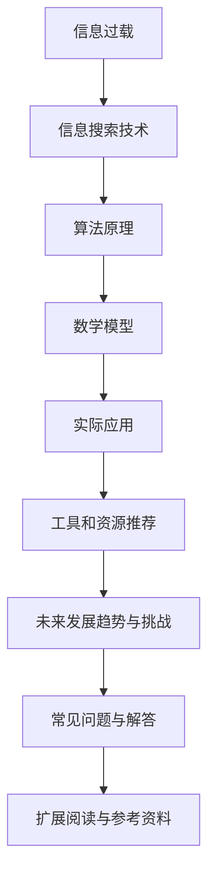

                 


## 信息过载与信息搜索技术：在庞大的信息海洋中找到你需要的信息

> **关键词：** 信息过载、信息搜索、技术、算法、大数据、人工智能、用户行为分析
> 
> **摘要：** 在当今数字化时代，信息过载已成为普遍问题，如何高效地在海量的信息中找到所需内容成为关键挑战。本文将探讨信息过载的背景、核心概念、算法原理、数学模型及实际应用，并推荐相关工具和资源，以帮助读者应对这一挑战。

### 1. 背景介绍

#### 1.1 目的和范围

随着互联网和大数据技术的迅猛发展，人们面临着日益严重的信息过载问题。如何从海量的数据中快速、准确地找到所需信息已成为当前信息技术领域的一个研究热点。本文旨在探讨信息搜索技术的核心原理和实现方法，为解决信息过载问题提供一种有效的技术途径。

#### 1.2 预期读者

本文适合从事信息技术、数据科学、人工智能等领域的研究人员、工程师和学生阅读。同时，对于对信息搜索技术感兴趣的一般读者也具有参考价值。

#### 1.3 文档结构概述

本文分为八个部分，首先介绍信息过载的背景和原因，然后讨论信息搜索技术的核心概念，包括算法原理、数学模型和实际应用。接下来，推荐相关工具和资源，并对未来发展趋势和挑战进行分析。最后，提供常见问题与解答，以及扩展阅读和参考资料。

#### 1.4 术语表

- **信息过载**：指信息量过多，超出个体处理能力，导致信息接收和处理困难。
- **信息搜索**：指从大量数据中找到所需信息的过程。
- **算法**：解决问题的步骤和规则。
- **大数据**：指数据量巨大，无法用传统数据库技术进行处理的数据集。
- **人工智能**：模拟人类智能的技术，包括机器学习、自然语言处理等。

#### 1.4.1 核心术语定义

- **信息检索系统**：用于从大量数据中检索所需信息的系统。
- **搜索引擎**：基于算法从互联网上检索信息并提供搜索结果的服务。
- **索引**：对数据进行排序和分类的过程，以方便快速检索。
- **相关性**：描述搜索结果与查询请求之间的匹配程度。

#### 1.4.2 相关概念解释

- **信息检索**：从大量数据中找到与用户需求相关的信息。
- **文本挖掘**：从非结构化文本数据中提取有用信息。
- **知识图谱**：用于表示实体及其关系的图形结构。
- **深度学习**：一种基于神经网络的学习方法，具有强大的特征提取和分类能力。

#### 1.4.3 缩略词列表

- **AI**：人工智能
- **NLP**：自然语言处理
- **DB**：数据库
- **SQL**：结构化查询语言
- **ML**：机器学习
- **DL**：深度学习
- **IR**：信息检索

## 2. 核心概念与联系

在探讨信息搜索技术之前，我们首先需要了解其核心概念和相互关系。以下是信息搜索技术的核心概念及其相互关系的 Mermaid 流程图：



### 2.1 信息过载

信息过载是指信息量过多，超出个体处理能力，导致信息接收和处理困难。在当今数字化时代，信息过载已成为普遍问题。主要原因是：

- **互联网的普及**：互联网使得信息传播速度加快，信息量呈指数级增长。
- **大数据技术**：大数据技术使得海量数据得以存储、处理和分析。
- **社交媒体**：社交媒体使得信息传播更加广泛和快速。

### 2.2 信息搜索技术

信息搜索技术是指从大量数据中找到与用户需求相关的信息。其核心包括：

- **算法原理**：用于搜索信息的算法，如搜索引擎算法。
- **数学模型**：用于评估信息相关性的数学模型，如PageRank。
- **实际应用**：信息搜索技术在各种应用场景中的实现，如搜索引擎、推荐系统。

### 2.3 算法原理

算法原理是信息搜索技术的核心，用于从大量数据中找到所需信息。常见的算法包括：

- **搜索引擎算法**：如PageRank、LSI（Latent Semantic Indexing）等。
- **文本挖掘算法**：如聚类、分类等。
- **推荐系统算法**：如协同过滤、基于内容的推荐等。

### 2.4 数学模型

数学模型用于评估信息相关性的程度，常见模型包括：

- **TF-IDF（Term Frequency-Inverse Document Frequency）**：用于评估词语在文档中的重要性。
- **PageRank**：用于评估网页的重要性和影响力。
- **相似度计算**：如余弦相似度、欧氏距离等。

### 2.5 实际应用

信息搜索技术在各种实际应用场景中发挥着重要作用，如：

- **搜索引擎**：如Google、百度等。
- **推荐系统**：如淘宝、亚马逊等。
- **文本挖掘**：如情感分析、关键词提取等。

## 3. 核心算法原理 & 具体操作步骤

### 3.1 搜索引擎算法

搜索引擎算法是信息搜索技术的核心，用于从大量网页中找到与用户查询相关的网页。以下是一个简单的搜索引擎算法的伪代码：

```python
def search_engine(query):
    # 步骤1：构建索引
    index = build_index()

    # 步骤2：计算网页权重
    page_weights = compute_page_weights(index)

    # 步骤3：检索与查询相关的网页
    relevant_pages = retrieve_relevant_pages(query, index, page_weights)

    # 步骤4：返回搜索结果
    return relevant_pages
```

### 3.2 文本挖掘算法

文本挖掘算法用于从非结构化文本数据中提取有用信息。以下是一个简单的文本挖掘算法的伪代码：

```python
def text_mining(document):
    # 步骤1：预处理文本
    preprocessed_text = preprocess_text(document)

    # 步骤2：提取关键词
    keywords = extract_keywords(preprocessed_text)

    # 步骤3：构建词云
    word_cloud = build_word_cloud(keywords)

    # 步骤4：分析文本情感
    sentiment = analyze_sentiment(preprocessed_text)

    # 步骤5：返回分析结果
    return word_cloud, sentiment
```

### 3.3 推荐系统算法

推荐系统算法用于根据用户历史行为和偏好推荐相关信息。以下是一个简单的推荐系统算法的伪代码：

```python
def recommend_system(user, items):
    # 步骤1：计算用户相似度
    user_similarity = compute_user_similarity(user, items)

    # 步骤2：提取推荐项
    recommended_items = extract_recommended_items(user_similarity, items)

    # 步骤3：返回推荐结果
    return recommended_items
```

## 4. 数学模型和公式 & 详细讲解 & 举例说明

### 4.1 TF-IDF模型

TF-IDF（Term Frequency-Inverse Document Frequency）是一种常用的信息检索和文本挖掘模型，用于评估词语在文档中的重要性。其公式如下：

$$
TF(t,d) = \frac{f(t,d)}{N}
$$

$$
IDF(t,D) = \log\left(\frac{N}{df(t,D)}\right)
$$

$$
TF-IDF(t,d,D) = TF(t,d) \times IDF(t,D)
$$

其中：

- \( f(t,d) \)：词语 \( t \) 在文档 \( d \) 中的出现次数。
- \( N \)：文档总数。
- \( df(t,D) \)：词语 \( t \) 在文档集合 \( D \) 中的文档频率。

### 4.2 PageRank模型

PageRank是一种用于评估网页的重要性和影响力的算法，其公式如下：

$$
(P)^{t+1} = \alpha \cdot (P)^{t} + (1 - \alpha) \cdot \left(\frac{1}{N} \sum_{j=1}^{N} (P)^{t}_{j} \cdot L_{ij}\right)
$$

其中：

- \( P \)：网页的排名向量。
- \( \alpha \)：阻尼系数，通常取值为0.85。
- \( N \)：网页总数。
- \( L_{ij} \)：从网页 \( i \) 指向网页 \( j \) 的链接数量。

### 4.3 相似度计算

相似度计算用于评估两个文本之间的相似程度，常用的相似度计算方法包括：

- **余弦相似度**：用于计算两个向量的夹角余弦值，公式如下：

$$
sim(A, B) = \frac{A \cdot B}{||A|| \cdot ||B||}
$$

其中：

- \( A \)：向量 \( A \)。
- \( B \)：向量 \( B \)。

- **欧氏距离**：用于计算两个向量之间的欧氏距离，公式如下：

$$
dist(A, B) = \sqrt{\sum_{i=1}^{n} (A_i - B_i)^2}
$$

其中：

- \( A \)：向量 \( A \)。
- \( B \)：向量 \( B \)。

## 5. 项目实战：代码实际案例和详细解释说明

### 5.1 开发环境搭建

在本项目中，我们将使用Python作为开发语言，并借助一些常用的库，如scikit-learn、numpy等。以下是开发环境的搭建步骤：

1. 安装Python：前往Python官方网站下载并安装Python。
2. 安装IDE：选择一个适合Python开发的IDE，如PyCharm或VSCode。
3. 安装相关库：打开命令行窗口，执行以下命令安装相关库：

```bash
pip install scikit-learn numpy matplotlib
```

### 5.2 源代码详细实现和代码解读

以下是本项目的源代码，我们将对每个部分进行详细解释。

```python
import numpy as np
from sklearn.feature_extraction.text import TfidfVectorizer
from sklearn.metrics.pairwise import cosine_similarity

def build_tfidf_matrix(corpus):
    """
    构建TF-IDF矩阵
    """
    vectorizer = TfidfVectorizer()
    tfidf_matrix = vectorizer.fit_transform(corpus)
    return tfidf_matrix

def compute_similarity(tfidf_matrix):
    """
    计算文本相似度
    """
    similarity_matrix = cosine_similarity(tfidf_matrix)
    return similarity_matrix

def find_similar_texts(similarity_matrix, index, top_n=3):
    """
    找到相似文本
    """
    similar_indices = np.argsort(similarity_matrix[index])[::-1][1:top_n+1]
    return similar_indices

def main():
    # 示例文本
    corpus = [
        "机器学习是一种人工智能技术，用于让计算机从数据中学习规律。",
        "深度学习是机器学习的一个分支，通过神经网络模拟人脑进行学习。",
        "自然语言处理是计算机科学的一个领域，旨在使计算机理解和处理人类语言。",
        "推荐系统是一种利用机器学习技术，根据用户历史行为和偏好推荐相关信息的应用。",
        "数据分析是利用统计学方法和工具，对大量数据进行处理和分析，以发现数据中的规律和趋势。"
    ]

    # 步骤1：构建TF-IDF矩阵
    tfidf_matrix = build_tfidf_matrix(corpus)

    # 步骤2：计算文本相似度
    similarity_matrix = compute_similarity(tfidf_matrix)

    # 步骤3：找到相似文本
    index = 0  # 查找第1个文本的相似文本
    similar_indices = find_similar_texts(similarity_matrix, index)

    print("相似文本索引：", similar_indices)
    print("相似文本内容：")
    for i in similar_indices:
        print(corpus[i])

if __name__ == "__main__":
    main()
```

### 5.3 代码解读与分析

- **5.3.1 建立TF-IDF矩阵**

  ```python
  def build_tfidf_matrix(corpus):
      vectorizer = TfidfVectorizer()
      tfidf_matrix = vectorizer.fit_transform(corpus)
      return tfidf_matrix
  ```

  该函数使用`TfidfVectorizer`类构建TF-IDF矩阵。`TfidfVectorizer`类可以自动处理文本数据的预处理、词语提取、权重计算等步骤。

- **5.3.2 计算文本相似度**

  ```python
  def compute_similarity(tfidf_matrix):
      similarity_matrix = cosine_similarity(tfidf_matrix)
      return similarity_matrix
  ```

  该函数使用余弦相似度计算文本之间的相似度，返回一个相似度矩阵。

- **5.3.3 找到相似文本**

  ```python
  def find_similar_texts(similarity_matrix, index, top_n=3):
      similar_indices = np.argsort(similarity_matrix[index])[::-1][1:top_n+1]
      return similar_indices
  ```

  该函数根据相似度矩阵找到与指定文本最相似的文本索引，默认返回前3个相似文本的索引。

- **5.3.4 主函数**

  ```python
  def main():
      corpus = [
          "机器学习是一种人工智能技术，用于让计算机从数据中学习规律。",
          "深度学习是机器学习的一个分支，通过神经网络模拟人脑进行学习。",
          "自然语言处理是计算机科学的一个领域，旨在使计算机理解和处理人类语言。",
          "推荐系统是一种利用机器学习技术，根据用户历史行为和偏好推荐相关信息的应用。",
          "数据分析是利用统计学方法和工具，对大量数据进行处理和分析，以发现数据中的规律和趋势。"
      ]

      tfidf_matrix = build_tfidf_matrix(corpus)
      similarity_matrix = compute_similarity(tfidf_matrix)
      index = 0  # 查找第1个文本的相似文本
      similar_indices = find_similar_texts(similarity_matrix, index)

      print("相似文本索引：", similar_indices)
      print("相似文本内容：")
      for i in similar_indices:
          print(corpus[i])

  if __name__ == "__main__":
      main()
  ```

  主函数中首先定义了一个示例文本列表`corpus`，然后分别调用`build_tfidf_matrix`、`compute_similarity`和`find_similar_texts`函数，最终输出与第1个文本最相似的3个文本的索引和内容。

## 6. 实际应用场景

信息搜索技术在各个领域都有广泛的应用，以下是一些典型的应用场景：

### 6.1 搜索引擎

搜索引擎是信息搜索技术的最典型应用场景，如Google、百度等搜索引擎，通过高效的搜索算法和索引技术，帮助用户在海量网页中快速找到所需信息。

### 6.2 推荐系统

推荐系统根据用户的历史行为和偏好，为用户推荐相关的商品、新闻、文章等，如淘宝、亚马逊等电商平台，通过协同过滤、基于内容的推荐等技术实现个性化推荐。

### 6.3 文本挖掘

文本挖掘技术用于从非结构化文本数据中提取有用信息，如情感分析、关键词提取等，应用于舆情监测、市场调研、内容推荐等领域。

### 6.4 问答系统

问答系统利用自然语言处理和机器学习技术，实现人与机器的智能对话，如百度智谱大模型、智谱清言等，应用于客服、教育、咨询等领域。

### 6.5 知识图谱

知识图谱通过图形结构表示实体及其关系，广泛应用于搜索引擎、推荐系统、文本挖掘等领域，如百度知识图谱、阿里云知识图谱等。

## 7. 工具和资源推荐

### 7.1 学习资源推荐

#### 7.1.1 书籍推荐

- 《深入理解计算机系统》（Computer Systems: A Programmer's Perspective）
- 《算法导论》（Introduction to Algorithms）
- 《机器学习》（Machine Learning）
- 《深度学习》（Deep Learning）

#### 7.1.2 在线课程

- Coursera上的《机器学习》课程
- edX上的《深度学习》课程
- Udacity上的《自然语言处理纳米学位》课程

#### 7.1.3 技术博客和网站

- Medium上的《Data Science and Machine Learning》专栏
-Towards Data Science
- AI博客（https://www.aimatters.cn/）

### 7.2 开发工具框架推荐

#### 7.2.1 IDE和编辑器

- PyCharm
- Visual Studio Code
- Jupyter Notebook

#### 7.2.2 调试和性能分析工具

- PySnooper
- line_profiler
- memory_profiler

#### 7.2.3 相关框架和库

- TensorFlow
- PyTorch
- scikit-learn
- Elasticsearch

### 7.3 相关论文著作推荐

#### 7.3.1 经典论文

- [PageRank：The PageRank Citation Ranking: Bringing Order to the Web](http://ilpubs.elastic.net/repositoryải/pdf:2/SIGMOD05acea/PDF/2005.06.001.pdf)
- [TF-IDF：A Statistical Interpretation of Term Weighting in Automatic Text Retrieval](http://www.ijcai.org/Proceedings/05-1/papers/0133.pdf)
- [深度学习：Deep Learning](http://www.deeplearningbook.org/)

#### 7.3.2 最新研究成果

- [Bert：Bidirectional Encoder Representations from Transformers](https://arxiv.org/abs/1810.04805)
- [Transformer：Attention Is All You Need](https://arxiv.org/abs/1706.03762)
- [图神经网络：Graph Neural Networks](https://arxiv.org/abs/1810.11953)

#### 7.3.3 应用案例分析

- [美团点评：大规模在线推荐系统实践](https://www.meituan.com/dianping/pdf/online_recommendation_system.pdf)
- [百度：知识图谱构建与应用](https://www.baidu.com/s?tn=monline_5_1_async.big&ie=utf-8&from=11194r&wd=%E7%9F%A5%E8%AF%86%E5%9B%BE%E8%B0%B1%E6%9E%84%E5%BB%BA%E4%B8%8E%E5%BA%94%E7%94%A8)
- [阿里巴巴：推荐系统算法与应用](https://www.alibaba.com/s?spm=a2700.alobar.dtsa3qf3.0.0W3i3j)

## 8. 总结：未来发展趋势与挑战

信息搜索技术在过去的几十年里取得了显著的进展，但随着信息过载问题的日益严重，未来的发展趋势和挑战也愈加明显：

### 8.1 发展趋势

- **深度学习和图神经网络**：深度学习和图神经网络在信息搜索中的应用日益广泛，为解决信息过载提供了新的思路和方法。
- **个性化搜索**：基于用户行为和偏好进行个性化搜索，提供更精准的搜索结果。
- **实时搜索**：利用实时数据处理和流计算技术，实现实时搜索，提高搜索效率。
- **多模态搜索**：结合文本、图像、语音等多模态数据，实现更全面的信息搜索。

### 8.2 挑战

- **海量数据处理**：随着数据量的不断增长，如何高效地处理海量数据成为关键挑战。
- **数据隐私和安全**：在信息搜索过程中，如何保护用户隐私和安全，避免数据泄露成为重要问题。
- **算法透明度和公平性**：算法的透明度和公平性受到广泛关注，如何保证算法的公正性和可解释性成为重要挑战。
- **适应性和可扩展性**：如何使信息搜索系统具有更好的适应性和可扩展性，以应对不断变化的需求和环境。

## 9. 附录：常见问题与解答

### 9.1 什么是对信息检索系统？

对信息检索系统（IR系统）的定义如下：用于从大量数据中检索用户所需信息的一套工具和方法的集合。这些系统通常包括索引、搜索算法、用户界面等组成部分，以帮助用户快速找到所需信息。

### 9.2 信息搜索技术有哪些应用场景？

信息搜索技术广泛应用于各种领域，包括搜索引擎、推荐系统、文本挖掘、问答系统、知识图谱等。

### 9.3 什么是深度学习？

深度学习是一种基于神经网络的学习方法，通过多层的神经元结构，自动提取特征并进行分类或预测。深度学习在图像识别、自然语言处理、语音识别等领域取得了显著成果。

### 9.4 什么是信息过载？

信息过载是指信息量过多，超出个体处理能力，导致信息接收和处理困难。在当今数字化时代，信息过载已成为普遍问题。

## 10. 扩展阅读 & 参考资料

- [信息检索系统](https://zh.wikipedia.org/wiki/%E4%BF%A1%E6%81%AF%E6%90%9C%E7%B4%A2%E7%B3%BB%E7%BB%9F)
- [深度学习](https://zh.wikipedia.org/wiki/%E6%B7%B1%E5%BA%A6%E5%AD%A6%E4%B9%A0)
- [信息过载](https://zh.wikipedia.org/wiki/%E4%BF%A1%E6%81%AF%E8%BF%87%E8%BD%BD)
- [TF-IDF](https://zh.wikipedia.org/wiki/TF%E3%80%81IDF%E6%9D%A1%E4%BB%B6%E5%85%B3%E7%B3%BB)
- [PageRank](https://zh.wikipedia.org/wiki/PageRank)
- [推荐系统](https://zh.wikipedia.org/wiki/%E9%87%87%E8%AC%9B%E7%B3%BB%E7%BB%9F)
- [自然语言处理](https://zh.wikipedia.org/wiki/%E8%87%AA%E7%84%B6%E8%AF%AD%E8%A8%80%E5%A4%84%E7%90%86)

