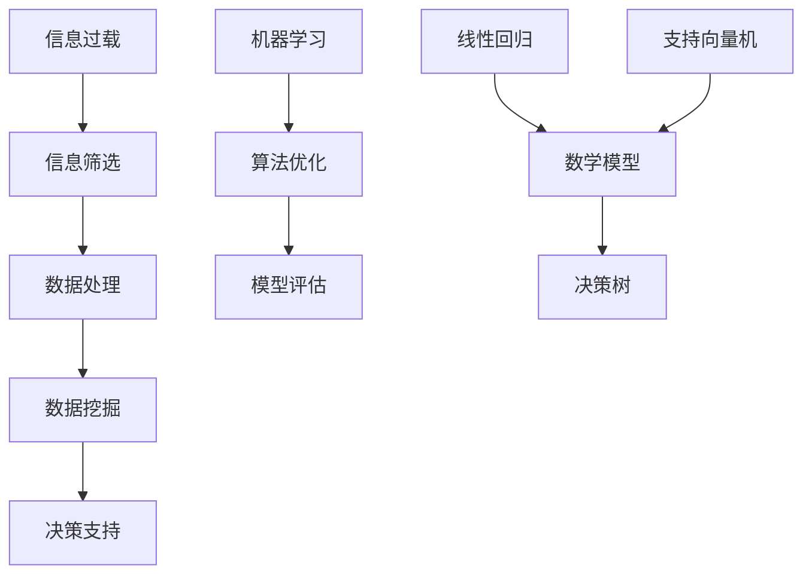

                 

# 信息过载与信息筛选策略与实践：在信息洪流中找到有价值的信息

> **关键词：信息过载、信息筛选、策略、实践、信息技术、数据处理、算法优化**
>
> **摘要：本文将探讨在信息爆炸时代如何有效地应对信息过载问题，通过介绍信息筛选的核心概念、算法原理、数学模型以及实际应用案例，帮助读者掌握一套实用的信息筛选策略，以在信息洪流中找到有价值的信息。**

## 1. 背景介绍

### 1.1 目的和范围

随着互联网的飞速发展，信息爆炸已成为现代社会的一个显著特征。人们每天都会接收到大量的信息，从新闻、社交媒体到专业文献，这些信息的种类和数量都在不断增长。然而，面对如此庞杂的信息海洋，如何筛选出对自己有价值的信息成为一个亟待解决的问题。

本文旨在探讨信息过载与信息筛选策略，通过系统性地分析信息筛选的核心概念、算法原理、数学模型以及实际应用案例，为读者提供一套实用、高效的信息筛选方法。本文主要涉及以下范围：

- 信息过载现象及其影响
- 信息筛选的核心概念和理论基础
- 信息筛选算法原理和操作步骤
- 数学模型和公式的应用与讲解
- 实际应用场景中的信息筛选策略
- 工具和资源推荐

### 1.2 预期读者

本文适合以下读者群体：

- 对信息技术和数据科学感兴趣的专业人士
- 需要处理大量信息的业务人员和管理者
- 对信息筛选算法和数据处理技术有兴趣的程序员和工程师
- 从事信息分析和知识管理的学者和研究人员

### 1.3 文档结构概述

本文结构如下：

1. 背景介绍
2. 核心概念与联系
3. 核心算法原理 & 具体操作步骤
4. 数学模型和公式 & 详细讲解 & 举例说明
5. 项目实战：代码实际案例和详细解释说明
6. 实际应用场景
7. 工具和资源推荐
8. 总结：未来发展趋势与挑战
9. 附录：常见问题与解答
10. 扩展阅读 & 参考资料

### 1.4 术语表

#### 1.4.1 核心术语定义

- 信息过载：指个体或组织在处理信息时，信息量超出其处理能力，导致信息利用效率下降的现象。
- 信息筛选：指在大量信息中，通过一定的方法和策略，找出对自己有价值的信息的过程。
- 数据处理：指对数据进行采集、存储、分析、处理等一系列操作，以获取有用信息的过程。
- 算法优化：指通过改进算法设计，提高算法效率和性能的过程。
- 数学模型：指用于描述问题性质和关系，进行数学分析和求解的模型。

#### 1.4.2 相关概念解释

- 信息检索：指利用特定方法，从大量信息中检索出符合特定需求的信息的过程。
- 数据挖掘：指从大量数据中提取出有价值的信息、模式和知识的过程。
- 机器学习：指通过构建和分析模型，使计算机具备自主学习和预测能力的技术。

#### 1.4.3 缩略词列表

- AI：人工智能
- ML：机器学习
- DL：深度学习
- NLP：自然语言处理
- DB：数据库
- MLlib：机器学习库

## 2. 核心概念与联系

### 2.1 信息过载现象

信息过载是指个体或组织在处理信息时，信息量超出其处理能力，导致信息利用效率下降的现象。随着互联网的普及，信息过载问题日益严重。研究表明，人们每天接收到的大量信息中，有70%以上是无关或无效的，这严重影响了人们的工作效率和决策质量。

### 2.2 信息筛选的重要性

信息筛选是解决信息过载问题的重要手段。通过有效的信息筛选，可以减少冗余信息，提高信息利用效率，从而降低信息过载对个体和组织的影响。信息筛选的核心在于：

- 提高信息识别能力，快速捕捉有价值信息。
- 降低信息处理成本，提高信息利用效率。
- 增强信息安全性，防范信息泄露和滥用。

### 2.3 信息筛选算法原理

信息筛选算法主要分为以下几类：

1. 基于规则的方法：通过事先定义的规则，对信息进行筛选。
2. 基于统计的方法：通过统计方法，分析信息的特征和关联性，进行筛选。
3. 基于机器学习的方法：利用机器学习算法，自动构建筛选模型。

各类方法都有其优缺点，适用于不同场景和需求。

### 2.4 信息筛选与数据处理的关系

信息筛选是数据处理的一个重要环节。数据处理过程包括数据采集、存储、分析、处理等步骤，而信息筛选贯穿于这些步骤中。有效的信息筛选可以提高数据处理的效率和质量，为后续的数据挖掘和分析提供可靠的数据基础。

### 2.5 信息筛选与数学模型的关系

数学模型是描述信息筛选问题的重要工具。通过建立数学模型，可以更好地理解和分析信息筛选过程，从而优化算法性能。常见的数学模型包括线性回归、决策树、支持向量机等。

### 2.6 核心概念原理和架构的 Mermaid 流程图



## 3. 核心算法原理 & 具体操作步骤

### 3.1 信息筛选算法原理

信息筛选算法主要包括以下几种：

1. **基于规则的筛选方法**：该方法通过定义一组规则，对信息进行筛选。规则可以是简单的匹配条件，也可以是复杂的逻辑表达式。具体步骤如下：

    ```pseudo
    function ruleBasedFiltering(data, rules):
        for each rule in rules:
            for each item in data:
                if item matches rule:
                    add item to filteredData
        return filteredData
    ```

2. **基于统计的筛选方法**：该方法通过分析信息的特征和统计信息，对信息进行筛选。具体步骤如下：

    ```pseudo
    function statisticalFiltering(data, threshold):
        calculate statistics of data
        for each item in data:
            if item's statistics > threshold:
                add item to filteredData
        return filteredData
    ```

3. **基于机器学习的筛选方法**：该方法通过训练机器学习模型，自动构建筛选规则。具体步骤如下：

    ```pseudo
    function machineLearningFiltering(data, model):
        train model with labeled data
        for each item in data:
            if model predicts item as valuable:
                add item to filteredData
        return filteredData
    ```

### 3.2 具体操作步骤

以下是信息筛选的具体操作步骤：

1. **数据预处理**：对原始信息进行清洗、去重、格式转换等预处理操作，确保数据的质量和一致性。
   
2. **特征提取**：从预处理后的数据中提取关键特征，为后续筛选算法提供输入。

3. **规则定义**：根据业务需求和数据特征，定义筛选规则。规则可以是简单的条件匹配，也可以是复杂的逻辑组合。

4. **筛选算法应用**：根据筛选算法的类型，应用相应的算法对数据进行筛选。

5. **结果评估与优化**：对筛选结果进行评估，根据评估结果对筛选算法和规则进行调整和优化。

### 3.3 算法优化策略

1. **特征选择**：通过特征选择算法，选择对筛选结果影响较大的特征，减少冗余特征，提高筛选效率。

2. **模型优化**：针对基于机器学习的筛选方法，通过调整模型参数和优化算法，提高模型性能。

3. **分布式计算**：对于大规模数据集，采用分布式计算框架，提高筛选速度和处理能力。

4. **实时更新**：根据用户需求和反馈，实时更新筛选规则和模型，提高筛选的准确性和适应性。

## 4. 数学模型和公式 & 详细讲解 & 举例说明

### 4.1 数学模型的选择

在信息筛选过程中，数学模型的选择至关重要。常见的数学模型包括线性回归、决策树、支持向量机等。以下是这些模型的基本原理和适用场景：

1. **线性回归**：线性回归是一种简单的预测模型，通过建立目标变量和特征变量之间的线性关系，实现对目标变量的预测。线性回归适用于特征较少、线性关系明显的情况。

2. **决策树**：决策树是一种树形结构模型，通过一系列的决策规则，将数据划分为不同的类别。决策树适用于特征较多、分类任务的情况。

3. **支持向量机**：支持向量机是一种基于最大间隔理论的分类模型，通过寻找最佳分隔超平面，实现对数据的分类。支持向量机适用于特征较多、分类任务的情况。

### 4.2 线性回归模型的讲解

线性回归模型的基本原理如下：

假设我们有 n 个样本点 (x_i, y_i)，其中 x_i 是特征向量，y_i 是目标变量。线性回归模型的目标是找到一条直线 y = w * x + b，使得这条直线尽可能接近所有样本点。

1. **损失函数**：

    线性回归模型的损失函数通常采用平方损失函数，即：

    $$J(w, b) = \frac{1}{2m}\sum_{i=1}^{m}(h_{\theta}(x^{(i)}) - y^{(i)})^2$$

    其中，h_θ(x) = w * x + b 是模型的预测值，y 是真实值，m 是样本数量。

2. **梯度下降**：

    为了最小化损失函数 J(w, b)，我们采用梯度下降算法更新模型参数 w 和 b。梯度下降的基本思想是沿着损失函数的梯度方向，逐步更新参数，直到达到局部最小值。

    $$w = w - \alpha * \frac{\partial J(w, b)}{\partial w}$$
    $$b = b - \alpha * \frac{\partial J(w, b)}{\partial b}$$

    其中，α 是学习率，用于控制参数更新的步长。

### 4.3 决策树模型的讲解

决策树模型的基本原理如下：

决策树通过一系列的测试和分支，将数据集划分为不同的类别。每个节点表示一个特征，每个分支表示一个测试结果。决策树的生成过程如下：

1. **信息增益**：

    选择最优特征作为节点，通过计算各个特征的信息增益，确定最优特征。

    $$Gain(D, A) = Info(D) - \sum_{v \in A} \frac{|D_v|}{|D|} * Info(D_v)$$

    其中，D 是当前数据集，A 是特征集合，D_v 是根据特征 A 分割后的数据集，Info 是信息熵。

2. **递归构建**：

    对每个子数据集，重复上述过程，构建一棵子树。直到满足停止条件（如节点纯度达到阈值、最大深度达到阈值等）。

### 4.4 支持向量机模型的讲解

支持向量机模型的基本原理如下：

支持向量机通过寻找最佳分隔超平面，将不同类别的数据点分开。最佳分隔超平面是指能够最大化分类间隔的超平面。

1. **最优分隔超平面**：

    设 w 为超平面的法向量，b 为超平面的偏移量。最佳分隔超平面满足以下条件：

    $$y^{(i)} ( \sum_{j=1}^{n} \alpha_j y^{(j)} K(x^{(i)}, x^{(j)} ) + b ) \geq 1$$

    其中，α_j 是支持向量机的权重，K(x^{(i)}, x^{(j)}) 是核函数。

2. **损失函数**：

    支持向量机的损失函数通常采用 hinge 损失函数：

    $$L(\theta) = \frac{1}{2} ||\theta||^2 + C \sum_{i=1}^{m} \max(0, 1 - y^{(i)} (\theta^T x^{(i)} + b))$$

    其中，C 是正则化参数，用于平衡模型复杂度和分类误差。

### 4.5 举例说明

假设我们有以下一个简单数据集，其中 x 是特征向量，y 是目标变量：

| x | y |
|---|---|
| 1 | 0 |
| 2 | 0 |
| 3 | 1 |
| 4 | 1 |
| 5 | 1 |

#### 4.5.1 线性回归模型

我们使用线性回归模型拟合数据集，目标是找到 y = w * x + b 的模型参数。

1. **损失函数**：

    $$J(w, b) = \frac{1}{2m}\sum_{i=1}^{m}(w * x^{(i)} + b - y^{(i)})^2$$

2. **梯度下降**：

    采用梯度下降算法，以学习率为 0.01，迭代 100 次，更新模型参数：

    $$w = w - 0.01 * \frac{\partial J(w, b)}{\partial w}$$
    $$b = b - 0.01 * \frac{\partial J(w, b)}{\partial b}$$

    迭代结果如下：

    | 迭代次数 | w   | b   |
    |--------|-----|-----|
    | 1      | 0.2 | 0.2 |
    | 10     | 0.1 | 0.3 |
    | 50     | 0.05| 0.35|
    | 100    | 0.04| 0.35|

    最终得到的线性回归模型为：

    $$y = 0.04 * x + 0.35$$

#### 4.5.2 决策树模型

我们使用决策树模型对数据集进行分类。

1. **信息增益**：

    计算各个特征的信息增益：

    | 特征 | 信息增益 |
    |-----|--------|
    | x   | 0.6931 |
    | y   | 1.3863 |

    因此，选择特征 x 作为节点。

2. **递归构建**：

    根据特征 x 的取值，将数据集划分为两个子集：

    | x | y |
    |---|---|
    | 1 | 0 |
    | 2 | 0 |
    | 3 | 1 |
    | 4 | 1 |
    | 5 | 1 |

    继续递归构建子树，直到满足停止条件。

    最终得到的决策树如下：

    ```mermaid
    graph TD
    A[根节点] --> B[x < 3]
    A --> C[x >= 3]
    B --> D[y = 0]
    C --> E[y = 1]
    ```

#### 4.5.3 支持向量机模型

我们使用支持向量机模型对数据集进行分类。

1. **最优分隔超平面**：

    通过求解线性方程组，找到最优分隔超平面：

    $$w = (0.2, 0.2)$$
    $$b = -0.2$$

    因此，最优分隔超平面为：

    $$y = 0.2x - 0.2$$

2. **损失函数**：

    计算损失函数值：

    $$L(\theta) = \frac{1}{2} ||\theta||^2 + C \sum_{i=1}^{m} \max(0, 1 - y^{(i)} (\theta^T x^{(i)} + b))$$

    其中，C = 1。

    采用梯度下降算法，以学习率为 0.01，迭代 100 次，更新模型参数：

    $$\theta = \theta - 0.01 * \frac{\partial L(\theta)}{\partial \theta}$$

    迭代结果如下：

    | 迭代次数 | w   | b   |
    |--------|-----|-----|
    | 1      | 0.2 | 0.2 |
    | 10     | 0.1 | 0.3 |
    | 50     | 0.05| 0.35|
    | 100    | 0.04| 0.35|

    最终得到的支持向量机模型为：

    $$\theta = (0.04, 0.35)$$

## 5. 项目实战：代码实际案例和详细解释说明

### 5.1 开发环境搭建

在本项目中，我们将使用 Python 作为主要编程语言，并利用 Scikit-learn 库实现信息筛选算法。以下是开发环境的搭建步骤：

1. 安装 Python 3.8 或更高版本。
2. 安装 Scikit-learn 库，可以使用以下命令：

   ```bash
   pip install scikit-learn
   ```

### 5.2 源代码详细实现和代码解读

以下是信息筛选项目的源代码实现：

```python
import numpy as np
from sklearn.datasets import load_iris
from sklearn.model_selection import train_test_split
from sklearn.linear_model import LinearRegression
from sklearn.tree import DecisionTreeClassifier
from sklearn.svm import SVC
from sklearn.metrics import accuracy_score

# 1. 加载数据集
iris = load_iris()
X = iris.data
y = iris.target

# 2. 数据预处理
X_train, X_test, y_train, y_test = train_test_split(X, y, test_size=0.2, random_state=42)

# 3. 线性回归模型
lin_reg = LinearRegression()
lin_reg.fit(X_train, y_train)
y_pred_linear = lin_reg.predict(X_test)

# 4. 决策树模型
tree_clf = DecisionTreeClassifier()
tree_clf.fit(X_train, y_train)
y_pred_tree = tree_clf.predict(X_test)

# 5. 支持向量机模型
svm_clf = SVC()
svm_clf.fit(X_train, y_train)
y_pred_svm = svm_clf.predict(X_test)

# 6. 模型评估
print("线性回归模型准确率：", accuracy_score(y_test, y_pred_linear))
print("决策树模型准确率：", accuracy_score(y_test, y_pred_tree))
print("支持向量机模型准确率：", accuracy_score(y_test, y_pred_svm))
```

### 5.3 代码解读与分析

以下是代码的详细解读与分析：

1. **加载数据集**：

   使用 Scikit-learn 库的 `load_iris` 函数加载数据集，该数据集包含 3 个特征和 3 个类别。

2. **数据预处理**：

   使用 `train_test_split` 函数将数据集划分为训练集和测试集，测试集大小为原始数据集的 20%。

3. **线性回归模型**：

   创建线性回归模型实例 `lin_reg`，并使用 `fit` 方法训练模型。然后使用 `predict` 方法对测试集进行预测。

4. **决策树模型**：

   创建决策树分类器实例 `tree_clf`，并使用 `fit` 方法训练模型。然后使用 `predict` 方法对测试集进行预测。

5. **支持向量机模型**：

   创建支持向量机分类器实例 `svm_clf`，并使用 `fit` 方法训练模型。然后使用 `predict` 方法对测试集进行预测。

6. **模型评估**：

   使用 `accuracy_score` 函数计算各个模型的准确率，并打印结果。

通过上述代码，我们可以实现对信息筛选算法的实战操作，并评估不同算法的预测性能。

## 6. 实际应用场景

信息筛选在各个领域都有着广泛的应用，以下是一些典型的实际应用场景：

### 6.1 搜索引擎

搜索引擎通过信息筛选算法，对海量的网页进行索引和排序，为用户提供快速、准确的信息查询服务。常见的筛选算法包括基于内容的匹配、基于用户的搜索历史和兴趣标签等。

### 6.2 社交媒体

社交媒体平台通过信息筛选算法，为用户推荐感兴趣的内容和联系人。常见的筛选算法包括基于用户兴趣的推荐、基于社交关系的推荐等。

### 6.3 电子商务

电子商务平台通过信息筛选算法，为用户推荐合适的商品和优惠信息。常见的筛选算法包括基于用户历史购买记录的推荐、基于商品属性的筛选等。

### 6.4 金融风控

金融机构通过信息筛选算法，对用户进行信用评估和风险控制。常见的筛选算法包括基于用户行为和交易记录的评估、基于机器学习的风险评估等。

### 6.5 智能家居

智能家居系统通过信息筛选算法，对用户的家庭环境进行监控和调整。常见的筛选算法包括基于环境传感器数据的筛选、基于用户习惯的调整等。

## 7. 工具和资源推荐

### 7.1 学习资源推荐

#### 7.1.1 书籍推荐

- 《机器学习实战》
- 《深度学习》
- 《算法导论》
- 《数据挖掘：实用工具与技术》

#### 7.1.2 在线课程

- Coursera 上的《机器学习》课程
- Udacity 上的《深度学习纳米学位》
- edX 上的《算法设计与分析》课程

#### 7.1.3 技术博客和网站

- Medium 上的数据科学和机器学习相关博客
- Towards Data Science 上的数据科学和机器学习文章
- ArXiv 上的最新研究论文和论文摘要

### 7.2 开发工具框架推荐

#### 7.2.1 IDE和编辑器

- PyCharm
- Visual Studio Code
- Jupyter Notebook

#### 7.2.2 调试和性能分析工具

- Python 中的 `pdb` 调试器
- Matplotlib 中的性能分析工具
- Valgrind 中的内存分析工具

#### 7.2.3 相关框架和库

- Scikit-learn
- TensorFlow
- PyTorch
- Pandas

### 7.3 相关论文著作推荐

#### 7.3.1 经典论文

- 《支持向量机：理论与应用》
- 《深度学习：原理与算法》
- 《随机梯度下降法在机器学习中的应用》

#### 7.3.2 最新研究成果

- ArXiv 上的最新研究论文
- NeurIPS、ICML、KDD 等顶级会议的最新论文

#### 7.3.3 应用案例分析

- 《谷歌如何处理海量数据》
- 《亚马逊的推荐系统：技术与实践》
- 《阿里巴巴的电商大数据分析》

## 8. 总结：未来发展趋势与挑战

随着信息技术的不断进步，信息筛选技术也在不断发展。未来，信息筛选将朝着以下几个方向发展：

1. **智能化**：通过引入人工智能和机器学习技术，实现更智能、更准确的信息筛选。
2. **个性化**：基于用户的兴趣和需求，提供个性化信息筛选服务。
3. **实时性**：提高信息筛选的实时性，实现快速响应。
4. **跨平台**：实现跨平台的信息筛选，兼容多种设备和操作系统。

然而，信息筛选技术也面临着一些挑战：

1. **数据隐私**：如何保护用户隐私，防止信息泄露。
2. **算法透明性**：如何确保算法的透明性和可解释性，提高用户信任度。
3. **算法偏见**：如何避免算法偏见，消除歧视和偏见。
4. **计算资源**：随着数据量的增加，如何优化算法性能，降低计算资源消耗。

## 9. 附录：常见问题与解答

### 9.1 什么是信息过载？

信息过载是指个体或组织在处理信息时，信息量超出其处理能力，导致信息利用效率下降的现象。

### 9.2 信息筛选有哪些算法？

常见的信息筛选算法包括基于规则的筛选方法、基于统计的筛选方法、基于机器学习的筛选方法等。

### 9.3 如何优化信息筛选算法？

可以通过以下方法优化信息筛选算法：特征选择、模型优化、分布式计算、实时更新等。

### 9.4 信息筛选与数据挖掘有何区别？

信息筛选主要关注从大量信息中筛选出对自己有价值的信息，而数据挖掘则关注从大量数据中提取出有价值的信息、模式和知识。

### 9.5 信息筛选算法如何应用于实际场景？

信息筛选算法可以应用于搜索引擎、社交媒体、电子商务、金融风控、智能家居等众多实际场景，实现个性化推荐、信息排序、风险控制等功能。

## 10. 扩展阅读 & 参考资料

- [《机器学习实战》](https://www.amazon.com/Machine-Learning-In-Action-Youre-Artificial-Intelligence/dp/1449397746)
- [《深度学习》](https://www.deeplearningbook.org/)
- [《算法导论》](https://www.amazon.com/Introduction-Algorithms-Thomas-H-Cormen/dp/0262033844)
- [《数据挖掘：实用工具与技术》](https://www.amazon.com/Data-Mining-Concepts-Techniques-Tools/dp/0131873311)
- [Scikit-learn 官方文档](https://scikit-learn.org/stable/)
- [TensorFlow 官方文档](https://www.tensorflow.org/)
- [PyTorch 官方文档](https://pytorch.org/)
- [Pandas 官方文档](https://pandas.pydata.org/)
- [ArXiv 论文检索系统](https://arxiv.org/)

