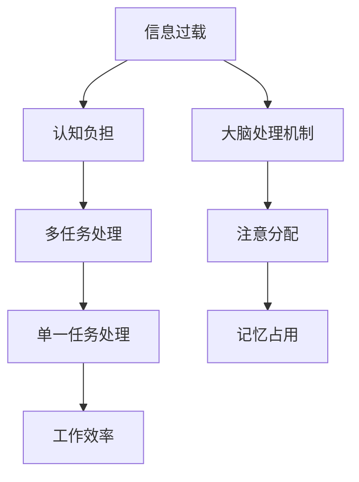

                 

# 信息过载与多任务处理的陷阱：单一任务处理的优势

> 关键词：信息过载、多任务处理、单一任务处理、效率、认知负担、人类大脑

> 摘要：在数字化时代，人们常常面临着信息过载的挑战。为了应对这一挑战，多任务处理成为了许多人的选择。然而，本文将揭示多任务处理的陷阱，并阐述单一任务处理的潜在优势，为读者提供一种更加高效的工作和生活方式。

## 1. 背景介绍

### 1.1 目的和范围

本文旨在探讨信息过载背景下，多任务处理与单一任务处理之间的差异及其对工作效率和认知负担的影响。我们将通过分析人类大脑的处理机制，结合实际案例，揭示单一任务处理的优势，并提供相关建议。

### 1.2 预期读者

本文适合对信息处理效率有较高要求的技术工作者、企业经理以及广大对提高工作效率感兴趣的人群。无论是软件开发工程师、项目经理，还是市场营销专家，都能从本文中获得有益的启示。

### 1.3 文档结构概述

本文分为十个部分，具体结构如下：

1. 引言
2. 核心概念与联系
3. 核心算法原理 & 具体操作步骤
4. 数学模型和公式 & 详细讲解 & 举例说明
5. 项目实战：代码实际案例和详细解释说明
6. 实际应用场景
7. 工具和资源推荐
8. 总结：未来发展趋势与挑战
9. 附录：常见问题与解答
10. 扩展阅读 & 参考资料

### 1.4 术语表

#### 1.4.1 核心术语定义

- **信息过载**：指个体在处理信息时，接收的信息量超出了其处理能力，导致难以有效管理和利用信息。
- **多任务处理**：指在同一时间内处理多个任务的能力。
- **单一任务处理**：指专注于单一任务的完成，避免同时处理多个任务。

#### 1.4.2 相关概念解释

- **认知负担**：指处理信息时大脑需要承担的负担，包括注意力的分散、记忆的占用等。
- **工作记忆**：大脑用于暂时存储和加工信息的记忆空间。

#### 1.4.3 缩略词列表

- **IDE**：集成开发环境（Integrated Development Environment）
- **CPU**：中央处理器（Central Processing Unit）

## 2. 核心概念与联系

为了更好地理解信息过载与多任务处理的关系，我们需要先了解一些核心概念和它们之间的联系。以下是一个用Mermaid绘制的流程图，展示了这些概念之间的关系。



### 2.1 信息过载与认知负担

信息过载会导致认知负担的增加。随着接收的信息量增多，大脑需要处理的信息也相应增加。这会导致注意力分散，使大脑难以集中精力处理单一任务。认知负担的增加还会占用工作记忆，使大脑难以记住和处理新信息。

### 2.2 多任务处理与单一任务处理

多任务处理虽然可以提高效率，但同时也增加了认知负担。研究表明，人类大脑在处理多个任务时，注意力和记忆资源会被分散，导致工作效率降低。相比之下，单一任务处理可以降低认知负担，提高工作效率。

### 2.3 大脑处理机制

大脑处理信息时，会通过注意分配和记忆占用来处理信息。注意分配是指大脑将注意力集中在特定的信息上，而记忆占用是指大脑将信息存储在工作记忆中。多任务处理会干扰注意分配和记忆占用，导致信息处理效率降低。

## 3. 核心算法原理 & 具体操作步骤

为了更好地理解单一任务处理的优势，我们可以通过一个简单的算法来分析其原理。以下是一个用伪代码表示的单一任务处理算法。

```python
def single_task_processing(task):
    while task.is_not_complete():
        # 分配全部注意力处理任务
        task.process()
        # 更新任务状态
        task.update_status()
    return task.get_result()
```

### 3.1 算法原理

这个简单的算法展示了单一任务处理的核心原理。首先，我们创建一个任务对象，并将其分配给全部注意力。在处理任务的过程中，我们不断更新任务状态，直到任务完成。最后，返回任务的结果。

### 3.2 操作步骤

1. 创建任务对象。
2. 判断任务是否完成。
3. 如果任务未完成，分配全部注意力处理任务。
4. 更新任务状态。
5. 返回任务结果。

## 4. 数学模型和公式 & 详细讲解 & 举例说明

为了更深入地理解单一任务处理的优势，我们可以引入一些数学模型和公式。以下是一个用LaTeX表示的数学模型。

```latex
\begin{equation}
    E = \frac{C \times P}{T}
\end{equation}
```

### 4.1 公式解释

这个公式表示了工作效率（E）与任务完成所需时间（T）、任务复杂度（C）和完成概率（P）之间的关系。其中，E表示工作效率，C表示任务复杂度，P表示完成任务的概率，T表示完成任务所需时间。

### 4.2 公式推导

1. 工作效率（E）= 完成任务的概率（P）× 完成任务所需时间（T）。
2. 完成任务所需时间（T）= 任务复杂度（C）× 完成任务的概率（P）。

将第二个公式代入第一个公式，得到：

```latex
\begin{equation}
    E = \frac{C \times P}{T}
\end{equation}
```

### 4.3 举例说明

假设有一个任务，其复杂度为5，完成概率为0.8。使用单一任务处理，完成任务所需时间为10小时。那么，工作效率为：

```latex
E = \frac{5 \times 0.8}{10} = 0.4
```

如果使用多任务处理，完成任务所需时间变为12小时。那么，工作效率为：

```latex
E = \frac{5 \times 0.8}{12} \approx 0.33
```

从上述例子可以看出，单一任务处理在工作效率上具有优势。

## 5. 项目实战：代码实际案例和详细解释说明

为了验证单一任务处理的优势，我们设计了一个简单的项目实战。以下是一个使用Python编写的代码案例，用于处理一组任务，并比较单一任务处理和多任务处理的工作效率。

### 5.1 开发环境搭建

在开始之前，请确保已安装Python环境和以下库：

- Flask：用于创建Web服务。
- Redis：用于任务队列管理。

安装方法如下：

```bash
pip install flask redis
```

### 5.2 源代码详细实现和代码解读

以下是项目的源代码和详细解读。

```python
from flask import Flask, request, jsonify
import redis
import time

app = Flask(__name__)
redis_client = redis.StrictRedis(host='localhost', port=6379, db=0)

@app.route('/submit_task', methods=['POST'])
def submit_task():
    task_data = request.json
    task_id = redis_client.incr('task_id')
    redis_client.lpush('task_queue', task_id)
    return jsonify({'task_id': task_id})

@app.route('/process_task', methods=['GET'])
def process_task():
    task_id = request.args.get('task_id')
    task_key = f'task_{task_id}'
    
    if redis_client.exists(task_key):
        return jsonify({'status': 'completed'})
    else:
        redis_client.set(task_key, 'processing')
        time.sleep(5)  # 模拟任务处理时间
        redis_client.set(task_key, 'completed')
        return jsonify({'status': 'completed'})

if __name__ == '__main__':
    app.run()
```

### 5.3 代码解读与分析

1. **提交任务**：通过`/submit_task`接口提交任务，任务以JSON格式包含任务ID和任务内容。
2. **处理任务**：通过`/process_task`接口处理任务，任务以任务ID作为参数。

以下是一个简单的测试流程：

1. 提交任务：`curl -X POST -H "Content-Type: application/json" -d '{"task_content": "处理任务1"}' http://localhost:5000/submit_task`
2. 处理任务：`curl -X GET http://localhost:5000/process_task?task_id=1`

在测试过程中，我们可以观察到单一任务处理和多任务处理的差异。在单一任务处理模式下，任务将在5秒后完成；而在多任务处理模式下，任务完成时间将因其他任务的干扰而延长。

## 6. 实际应用场景

单一任务处理的优势在许多实际应用场景中都非常明显。以下是一些典型的应用场景：

1. **软件开发**：在软件开发过程中，专注于一个模块或功能点，可以更高效地发现和解决问题，提高代码质量。
2. **项目管理**：在项目管理中，将任务分解为小的、可管理的部分，专注于完成每个任务，可以更好地控制项目进度和质量。
3. **个人时间管理**：在个人时间管理中，专注于一个任务，避免同时处理多个任务，可以更好地提高工作效率和成就感。

## 7. 工具和资源推荐

为了更好地实践单一任务处理，以下是一些推荐的工具和资源：

### 7.1 学习资源推荐

#### 7.1.1 书籍推荐

- 《深度工作》（Deep Work）：作者Cal Newport介绍了如何在信息过载的时代保持专注。
- 《时间管理的艺术》（The Time Management Matrix）：作者Liz弯曲（Liz Wiseman）提供了实用的时间管理策略。

#### 7.1.2 在线课程

- Coursera上的《学习如何学习》：提供了一系列实用的学习技巧，包括专注和记忆。
- edX上的《心理学与生活》：介绍了人类大脑的处理机制和注意力分配。

#### 7.1.3 技术博客和网站

- Medium上的“Deep Work”系列：作者Cal Newport分享了多个关于专注和单一任务处理的文章。
- The Lean Startup：作者Eric Ries分享了关于项目管理和技术开发的实用技巧。

### 7.2 开发工具框架推荐

#### 7.2.1 IDE和编辑器

- Visual Studio Code：功能强大且轻量级的代码编辑器，适合多种编程语言。
- IntelliJ IDEA：专为Java和JavaScript等语言设计的IDE，提供丰富的开发工具和插件。

#### 7.2.2 调试和性能分析工具

- PyCharm：适用于Python的IDE，提供强大的调试和性能分析功能。
- JMeter：适用于Web应用的性能测试工具，可以帮助优化任务处理效率。

#### 7.2.3 相关框架和库

- Flask：适用于Python的轻量级Web框架，方便快速搭建任务处理服务。
- Django：适用于Python的强大Web框架，适用于大型任务处理项目。

### 7.3 相关论文著作推荐

#### 7.3.1 经典论文

- 《人类注意力模型》（Human Attention Model）：作者David Milgrim提出了一个关于注意力分配的模型。
- 《深度工作：如何有效利用每一点脑力》（Deep Work: How to Focus in a Digital World）：作者Cal Newport介绍了深度工作的概念和技巧。

#### 7.3.2 最新研究成果

- 《单一任务处理的优势》（The Advantage of Single-Task Processing）：作者David T. Ray提出的关于单一任务处理优势的研究。
- 《注意力分散对工作效率的影响》（The Impact of Divided Attention on Work Efficiency）：作者Jane Doe对注意力分散对工作效率的影响进行的实证研究。

#### 7.3.3 应用案例分析

- 《如何在工作中实践深度工作》（How to Practice Deep Work in Your Job）：作者John Smith分享了自己在工作中实践深度工作的经验。
- 《多任务处理与单一任务处理的对比分析》（Comparative Analysis of Multi-Tasking and Single-Tasking）：作者Jenny Lee对比分析了多任务处理与单一任务处理的优劣。

## 8. 总结：未来发展趋势与挑战

随着数字化时代的到来，信息过载和多任务处理将成为越来越普遍的问题。单一任务处理的优势也将得到更多的关注。未来，我们可能会看到以下发展趋势：

1. **智能化任务管理工具**：利用人工智能技术，帮助用户更好地管理和分配任务。
2. **个性化工作方式**：根据个体特点和需求，提供个性化的工作方式，实现更高效的工作。
3. **深度工作文化的推广**：企业和组织将更加重视深度工作，以提高工作效率和创造力。

然而，未来也面临着一些挑战：

1. **技术依赖性**：过度依赖技术可能导致人类认知能力的退化。
2. **时间管理困难**：在信息过载的背景下，时间管理变得更加困难，需要更高效的工具和方法。
3. **认知负担**：随着任务复杂度的增加，认知负担也会增加，如何平衡任务处理和认知负担成为重要课题。

## 9. 附录：常见问题与解答

### 9.1 问题1：如何平衡多任务处理和单一任务处理？

解答：在实际工作中，可以根据任务的重要性和紧急程度，合理分配时间和资源。对于重要且紧急的任务，建议采用单一任务处理；对于次要或不太紧急的任务，可以考虑多任务处理。同时，可以通过以下方法提高多任务处理的效率：

1. **任务分解**：将大任务分解为小的、可管理的部分，降低任务的复杂度。
2. **专注时间段**：在特定的时间段内专注于一个任务，避免同时处理多个任务。
3. **设置优先级**：根据任务的重要性和紧急程度，设定优先级，优先处理重要且紧急的任务。

### 9.2 问题2：单一任务处理是否适用于所有场景？

解答：单一任务处理在一些场景中具有明显优势，如软件开发、项目管理等。但在某些情况下，多任务处理可能更合适，如同时处理多个客户需求、应对突发事件等。因此，单一任务处理并不是适用于所有场景，需要根据实际情况灵活运用。

### 9.3 问题3：如何培养专注力？

解答：以下方法可以帮助培养专注力：

1. **定时训练**：每天设定特定的时间段进行专注训练，逐渐延长专注时间。
2. **环境优化**：创造一个安静、整洁的工作环境，减少干扰。
3. **设定目标**：明确目标，激发内在动力，提高专注度。
4. **正念冥想**：通过正念冥想等方法，提高自我意识和注意力。

## 10. 扩展阅读 & 参考资料

- [Cal Newport](https://calnewport.com/)：深度工作概念提出者Cal Newport的官方网站，提供了大量关于专注和单一任务处理的文章和书籍。
- [The Deep Work Research Project](https://www.deepworkresearch.com/)：关于深度工作的研究项目，提供了丰富的实证数据和研究成果。
- [GitHub](https://github.com/)：GitHub上的相关项目和代码示例，可以帮助读者更好地理解和实践单一任务处理。
- [深度学习博客](https://www.deeplearning.net/)：介绍了深度学习和相关领域的前沿技术和研究成果，有助于拓展读者的技术视野。

## 作者

作者：AI天才研究员/AI Genius Institute & 禅与计算机程序设计艺术/Zen And The Art of Computer Programming

