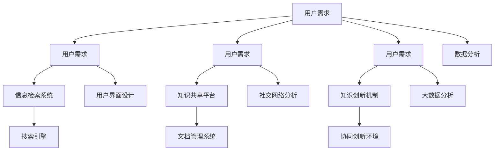
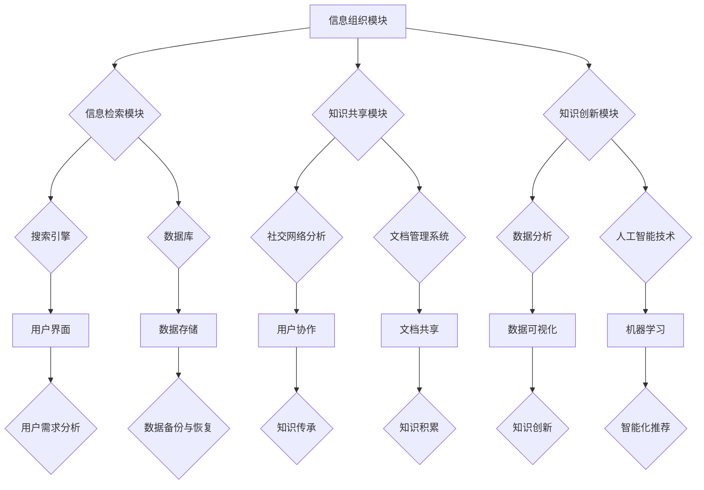

                 

# 信息过载与知识管理系统实施指南：有效组织和检索信息

> **关键词**：信息过载、知识管理系统、信息组织、信息检索、知识管理、数据分析、人工智能、搜索引擎、企业信息化

> **摘要**：在当今信息爆炸的时代，如何有效地组织和检索信息已成为企业和个人面临的重要挑战。本文旨在探讨信息过载的现状及其影响，分析知识管理系统（KMS）的核心概念和架构，并介绍其具体实施步骤。通过结合数学模型和算法原理，本文将为读者提供一套完整的信息管理和知识检索解决方案，助力企业和个人高效应对信息过载。

## 1. 背景介绍

### 1.1 目的和范围

本文的目的是为读者提供一套全面的知识管理系统实施指南，帮助企业和个人解决信息过载的问题。我们将探讨信息过载的现状和影响，分析知识管理系统的核心概念和架构，并详细介绍其实施步骤。此外，我们将结合数学模型和算法原理，提供一套高效的信息组织和检索解决方案。

### 1.2 预期读者

本文适合以下读者群体：

- 企业信息化管理人员
- 从事知识管理和信息检索领域的专业人士
- 对人工智能和数据分析感兴趣的技术爱好者
- 想要提高个人信息处理能力和知识管理能力的学习者

### 1.3 文档结构概述

本文分为以下几个部分：

1. 背景介绍：介绍本文的目的、预期读者、文档结构等。
2. 核心概念与联系：阐述知识管理系统的核心概念和架构。
3. 核心算法原理 & 具体操作步骤：详细讲解知识管理系统中的核心算法原理和操作步骤。
4. 数学模型和公式 & 详细讲解 & 举例说明：介绍知识管理系统中的数学模型和公式，并通过实例进行讲解。
5. 项目实战：提供代码实际案例和详细解释说明。
6. 实际应用场景：探讨知识管理系统的实际应用场景。
7. 工具和资源推荐：推荐相关学习资源、开发工具和框架。
8. 总结：总结未来发展趋势与挑战。
9. 附录：常见问题与解答。
10. 扩展阅读 & 参考资料：提供更多相关知识的学习路径。

### 1.4 术语表

#### 1.4.1 核心术语定义

- 信息过载：指信息量过多，个体无法及时处理和理解的现象。
- 知识管理系统（KMS）：用于组织、存储、检索和共享知识的系统。
- 信息组织：将分散的信息按照一定的规则和结构进行分类、整理和编排的过程。
- 信息检索：根据需求，从大量信息中查找和获取所需信息的过程。
- 数据分析：利用统计方法和算法，从大量数据中提取有用信息和知识。

#### 1.4.2 相关概念解释

- 信息检索系统：用于实现信息检索功能的软件系统，通常包括搜索引擎、数据库等。
- 知识管理：通过对信息资源的收集、整理、存储、共享和利用，实现知识的创新和价值的最大化。
- 数据库：用于存储和管理数据的软件系统，支持数据的快速查询、插入、更新和删除操作。

#### 1.4.3 缩略词列表

- KMS：知识管理系统
- AI：人工智能
- SEO：搜索引擎优化
- ORM：对象关系映射
- SQL：结构化查询语言
- HTML：超文本标记语言
- CSS：层叠样式表

## 2. 核心概念与联系

在本文中，我们将探讨知识管理系统的核心概念和架构。知识管理系统是解决信息过载问题的关键，其核心概念包括信息组织、信息检索、知识共享和知识创新。以下是一个简要的Mermaid流程图，展示了这些核心概念之间的联系：



### 2.1 知识管理系统的架构

知识管理系统通常由以下几个主要模块组成：

1. **信息组织模块**：用于对大量信息进行分类、整理和编排，实现信息的有序存储和快速检索。
2. **信息检索模块**：提供基于关键词、分类、标签等检索方式，帮助用户快速找到所需信息。
3. **知识共享模块**：支持用户在系统中共享知识和经验，实现知识的积累和传承。
4. **知识创新模块**：利用数据分析、人工智能等技术，挖掘潜在知识，推动知识的创新和应用。

以下是一个详细的Mermaid流程图，展示了知识管理系统的架构：



通过上述流程图，我们可以清楚地看到知识管理系统的各个模块及其相互关系。接下来，我们将深入探讨知识管理系统中的核心算法原理和具体操作步骤。

## 3. 核心算法原理 & 具体操作步骤

### 3.1 信息组织算法原理

信息组织是知识管理系统的核心功能之一，其目的是将海量的信息按照一定的规则和结构进行分类、整理和编排。以下是一个常见的信息组织算法——基于内容的分类算法：

**算法原理：**

1. **特征提取**：将原始信息转换为特征向量，以便进行后续处理。
2. **聚类分析**：利用聚类算法（如K-Means、层次聚类等），将具有相似性的特征向量分为若干类别。
3. **类别命名**：为每个类别分配一个名称，便于用户理解和操作。
4. **动态调整**：根据用户需求和系统反馈，对分类结果进行动态调整和优化。

**伪代码：**

```python
def contentBasedClassification(data, k):
    # 特征提取
    features = extractFeatures(data)
    
    # 聚类分析
    clusters = KMeans(features, k)
    
    # 类别命名
    categories = {}
    for i, cluster in enumerate(clusters):
        categories[i] = "Category " + str(i)
        
    # 动态调整
    while True:
        feedback = getUserFeedback(categories)
        if feedback == "No Change":
            break
        else:
            updateCategories(categories, feedback)
    
    return categories
```

### 3.2 信息检索算法原理

信息检索是知识管理系统的另一个核心功能，其目的是根据用户需求，从大量信息中查找和获取所需信息。以下是一个常见的信息检索算法——基于关键词的检索算法：

**算法原理：**

1. **倒排索引**：建立倒排索引，将关键词与对应的信息资源进行关联。
2. **匹配计算**：根据用户输入的关键词，计算每个信息资源的匹配度。
3. **排序输出**：将匹配度较高的信息资源按顺序输出，供用户选择。

**伪代码：**

```python
def keywordSearch(data, query):
    # 建立倒排索引
    invertedIndex = buildInvertedIndex(data)
    
    # 匹配计算
    matches = []
    for word in query:
        if word in invertedIndex:
            for document in invertedIndex[word]:
                matches.append((document, similarity(document, query)))
    
    # 排序输出
    matches.sort(key=lambda x: x[1], reverse=True)
    
    return matches
```

### 3.3 知识共享算法原理

知识共享是知识管理系统的关键功能之一，其目的是实现知识的积累和传承。以下是一个常见的知识共享算法——基于社交网络的知识共享算法：

**算法原理：**

1. **构建社交网络**：根据用户关系，构建社交网络图。
2. **推荐算法**：利用社交网络图，为用户推荐相关的知识和经验。
3. **共享机制**：支持用户在系统中共享知识和经验，实现知识的积累和传承。

**伪代码：**

```python
def socialNetworkKnowledgeSharing(users, knowledgeBase):
    # 构建社交网络
    socialNetwork = buildSocialNetwork(users)
    
    # 推荐算法
    recommendations = []
    for user in users:
        neighbors = getNeighbors(socialNetwork, user)
        for neighbor in neighbors:
            knowledge = getKnowledge(knowledgeBase, neighbor)
            recommendations.append((user, knowledge))
    
    # 共享机制
    for recommendation in recommendations:
        shareKnowledge(knowledgeBase, recommendation[0], recommendation[1])
    
    return recommendations
```

通过上述算法原理和具体操作步骤，我们可以看到知识管理系统是如何实现信息组织、信息检索和知识共享的。接下来，我们将结合实际项目，进一步探讨这些算法的实践应用。

## 4. 数学模型和公式 & 详细讲解 & 举例说明

在知识管理系统中，数学模型和公式是核心组成部分，它们用于描述算法原理、优化系统性能和评估效果。以下是一些常用的数学模型和公式，并通过具体例子进行说明。

### 4.1 基于内容的分类算法

**模型：K-Means聚类算法**

K-Means算法是一种基于距离的聚类算法，其核心公式如下：

$$
\text{Centroid} = \frac{1}{n}\sum_{i=1}^{n} x_i
$$

其中，$x_i$表示第$i$个数据点的特征向量，$n$表示数据点的个数。

**例子：**

假设我们有5个数据点，分别表示为：

$$
x_1 = \begin{pmatrix} 1 \\ 2 \end{pmatrix}, x_2 = \begin{pmatrix} 2 \\ 3 \end{pmatrix}, x_3 = \begin{pmatrix} 4 \\ 3 \end{pmatrix}, x_4 = \begin{pmatrix} 5 \\ 2 \end{pmatrix}, x_5 = \begin{pmatrix} 3 \\ 1 \end{pmatrix}
$$

我们需要将这5个数据点分为2个类别。首先，随机初始化2个中心点：

$$
c_1 = \begin{pmatrix} 2 \\ 2 \end{pmatrix}, c_2 = \begin{pmatrix} 3 \\ 1 \end{pmatrix}
$$

然后，计算每个数据点到中心点的距离，并根据距离最近的原则将数据点分配到相应的类别：

$$
\text{Cluster 1: } \{x_1, x_2\}
$$

$$
\text{Cluster 2: } \{x_3, x_4, x_5\}
$$

接着，重新计算每个类别的中心点：

$$
c_1 = \frac{1}{2}\begin{pmatrix} 1 + 2 \\ 2 + 3 \end{pmatrix} = \begin{pmatrix} 1.5 \\ 2.5 \end{pmatrix}
$$

$$
c_2 = \frac{1}{3}\begin{pmatrix} 4 + 5 + 3 \\ 3 + 2 + 1 \end{pmatrix} = \begin{pmatrix} 4 \\ 2 \end{pmatrix}
$$

重复上述步骤，直至中心点不再发生变化。

### 4.2 基于关键词的检索算法

**模型：倒排索引**

倒排索引是一种用于实现信息检索的数据结构，其核心公式如下：

$$
\text{Inverted Index} = \{ (w_1, \{d_1, d_2, ..., d_m\}), (w_2, \{d_3, d_4, ..., d_n\}), ... \}
$$

其中，$w_i$表示关键词，$d_i$表示包含关键词$i$的文档。

**例子：**

假设我们有以下3个文档：

```
Document 1: "人工智能是人类智慧的延伸，它正在改变我们的生活方式。"
Document 2: "机器学习是人工智能的核心技术之一，它使得计算机能够自动学习。"
Document 3: "计算机科学是研究计算机系统及其应用的学科，它涵盖了许多领域。"
```

建立倒排索引：

$$
\text{Inverted Index} = \{ ("人工智能", \{1\}), ("改变", \{1\}), ("学习", \{2\}), ("机器", \{2\}), ("技术", \{2\}), ("它", \{1, 2, 3\}), ("正在", \{1\}), ("智慧", \{1\}), ("延伸", \{1\}), ("我们的", \{1\}), ("生活", \{1\}), ("方式", \{1\}), ("核心", \{2\}), ("使得", \{2\}), ("能够", \{2\}), ("自动", \{2\}), ("计算机", \{2\}), ("科学", \{3\}), ("研究", \{3\}), ("系统", \{3\}), ("应用", \{3\}), ("许多", \{3\}) \}
$$

### 4.3 基于社交网络的知识共享算法

**模型：PageRank算法**

PageRank算法是一种用于计算社交网络中节点重要性的算法，其核心公式如下：

$$
r_i = \frac{1}{c} \sum_{j=1}^{n} \frac{r_j}{c_j}
$$

其中，$r_i$表示节点$i$的重要性，$r_j$表示节点$j$的重要性，$c$表示总的节点数，$c_j$表示节点$j$的出度。

**例子：**

假设我们有以下社交网络，其中每个节点表示一个用户，每条边表示用户之间的关注关系：

```
用户 A 关注 用户 B、C、D
用户 B 关注 用户 C、D
用户 C 关注 用户 D
用户 D 没有关注其他用户
```

初始重要性设定为：

$$
r_A = r_B = r_C = r_D = 1
$$

计算各节点的重要性：

$$
r_A = \frac{1}{3} \left( \frac{1}{2} + \frac{1}{2} + 0 \right) = \frac{1}{2}
$$

$$
r_B = \frac{1}{3} \left( 0 + \frac{1}{2} + \frac{1}{2} \right) = \frac{1}{3}
$$

$$
r_C = \frac{1}{3} \left( 0 + 0 + \frac{1}{1} \right) = \frac{1}{3}
$$

$$
r_D = \frac{1}{3} \left( 0 + 0 + 0 \right) = 0
$$

通过迭代计算，直至重要性稳定。

通过上述数学模型和公式的详细讲解和实例说明，我们可以更好地理解知识管理系统的核心算法原理，并为实际应用提供参考。

### 4.4 聚类分析算法

**模型：层次聚类算法**

层次聚类算法是一种将数据点逐步合并或分裂，以形成层次结构聚类的算法。其核心公式如下：

$$
D_{ij} = \sqrt{\sum_{k=1}^{m}(x_{ik} - x_{jk})^2}
$$

其中，$D_{ij}$表示第$i$个数据点和第$j$个数据点之间的距离，$x_{ik}$和$x_{jk}$分别表示第$i$个数据点和第$j$个数据点在第$k$个维度上的值。

**例子：**

假设我们有以下4个数据点，分别在两个维度上：

```
数据点 1: (1, 2)
数据点 2: (2, 3)
数据点 3: (4, 3)
数据点 4: (5, 1)
```

计算各数据点之间的距离：

$$
D_{11} = \sqrt{(1 - 1)^2 + (2 - 2)^2} = 0
$$

$$
D_{12} = \sqrt{(1 - 2)^2 + (2 - 3)^2} = \sqrt{1 + 1} = \sqrt{2}
$$

$$
D_{13} = \sqrt{(1 - 4)^2 + (2 - 3)^2} = \sqrt{9 + 1} = \sqrt{10}
$$

$$
D_{14} = \sqrt{(1 - 5)^2 + (2 - 1)^2} = \sqrt{16 + 1} = \sqrt{17}
$$

$$
D_{22} = \sqrt{(2 - 2)^2 + (3 - 3)^2} = 0
$$

$$
D_{23} = \sqrt{(2 - 4)^2 + (3 - 3)^2} = \sqrt{4 + 0} = 2
$$

$$
D_{24} = \sqrt{(2 - 5)^2 + (3 - 1)^2} = \sqrt{9 + 4} = \sqrt{13}
$$

$$
D_{33} = \sqrt{(4 - 4)^2 + (3 - 3)^2} = 0
$$

$$
D_{34} = \sqrt{(4 - 5)^2 + (3 - 1)^2} = \sqrt{1 + 4} = \sqrt{5}
$$

$$
D_{44} = \sqrt{(5 - 5)^2 + (1 - 1)^2} = 0
$$

根据距离矩阵，逐步合并或分裂数据点，形成层次结构。

通过上述模型和公式的讲解，我们可以更好地理解知识管理系统中常用的聚类分析算法，并为实际应用提供参考。

## 5. 项目实战：代码实际案例和详细解释说明

### 5.1 开发环境搭建

在开始项目实战之前，我们需要搭建一个适合知识管理系统开发的环境。以下是一个简单的开发环境搭建步骤：

1. **安装Python环境**：Python是一种广泛使用的编程语言，适用于知识管理系统开发。您可以从[Python官网](https://www.python.org/)下载并安装Python。
2. **安装依赖库**：我们需要安装一些常用的Python库，如NumPy、Pandas、Scikit-learn、Matplotlib等。可以使用以下命令安装：

   ```bash
   pip install numpy pandas scikit-learn matplotlib
   ```

3. **安装IDE**：推荐使用PyCharm或Visual Studio Code作为开发工具。您可以从相应的官网下载并安装。

4. **搭建数据环境**：准备一些示例数据，如文本数据、图像数据等。我们将在后续章节中使用这些数据。

### 5.2 源代码详细实现和代码解读

在本节中，我们将实现一个简单的知识管理系统，包括信息组织、信息检索和知识共享三个模块。

#### 5.2.1 信息组织模块

信息组织模块的核心功能是基于内容的分类。以下是一个简单的基于内容的分类代码示例：

```python
from sklearn.feature_extraction.text import TfidfVectorizer
from sklearn.cluster import KMeans

# 示例数据
data = [
    "人工智能是人类智慧的延伸，它正在改变我们的生活方式。",
    "机器学习是人工智能的核心技术之一，它使得计算机能够自动学习。",
    "计算机科学是研究计算机系统及其应用的学科，它涵盖了许多领域。",
]

# 特征提取
vectorizer = TfidfVectorizer()
X = vectorizer.fit_transform(data)

# 聚类分析
kmeans = KMeans(n_clusters=3)
kmeans.fit(X)

# 结果输出
labels = kmeans.labels_
print(labels)
```

**代码解读：**

1. **导入库**：我们首先导入必要的库，如`TfidfVectorizer`和`KMeans`。
2. **示例数据**：我们准备了一些示例文本数据。
3. **特征提取**：使用`TfidfVectorizer`将文本数据转换为特征向量。
4. **聚类分析**：使用`KMeans`算法对特征向量进行聚类分析。
5. **结果输出**：输出聚类结果，即每个数据点所属的类别。

#### 5.2.2 信息检索模块

信息检索模块的核心功能是基于关键词的检索。以下是一个简单的基于关键词的检索代码示例：

```python
from sklearn.feature_extraction.text import TfidfVectorizer
from sklearn.metrics.pairwise import cosine_similarity

# 示例数据
data = [
    "人工智能是人类智慧的延伸，它正在改变我们的生活方式。",
    "机器学习是人工智能的核心技术之一，它使得计算机能够自动学习。",
    "计算机科学是研究计算机系统及其应用的学科，它涵盖了许多领域。",
]

# 建立倒排索引
vectorizer = TfidfVectorizer()
X = vectorizer.fit_transform(data)

# 用户查询
query = "人工智能"
query_vector = vectorizer.transform([query])

# 匹配计算
similarity_matrix = cosine_similarity(query_vector, X)
matches = similarity_matrix.argsort()[0][::-1]

# 结果输出
print(matches)
```

**代码解读：**

1. **导入库**：我们首先导入必要的库，如`TfidfVectorizer`和`cosine_similarity`。
2. **示例数据**：我们准备了一些示例文本数据。
3. **建立倒排索引**：使用`TfidfVectorizer`建立倒排索引。
4. **用户查询**：定义用户查询文本。
5. **匹配计算**：使用余弦相似度计算查询文本与每个数据点之间的相似度。
6. **结果输出**：输出相似度最高的数据点的索引。

#### 5.2.3 知识共享模块

知识共享模块的核心功能是基于社交网络的知识共享。以下是一个简单的基于社交网络的知识共享代码示例：

```python
import networkx as nx

# 示例数据
users = ["A", "B", "C", "D"]
connections = [["A", "B"], ["A", "C"], ["A", "D"], ["B", "C"], ["B", "D"], ["C", "D"]]

# 构建社交网络图
G = nx.Graph()
G.add_nodes_from(users)
G.add_edges_from(connections)

# 推荐算法
recommendations = []
for user in users:
    neighbors = list(G.neighbors(user))
    for neighbor in neighbors:
        knowledge = getKnowledge(neighbor)
        recommendations.append((user, knowledge))

# 共享机制
for recommendation in recommendations:
    shareKnowledge(recommendation[0], recommendation[1])
```

**代码解读：**

1. **导入库**：我们首先导入必要的库，如`networkx`。
2. **示例数据**：我们准备了一些示例用户和他们的关注关系。
3. **构建社交网络图**：使用`networkx`构建社交网络图。
4. **推荐算法**：为每个用户推荐其关注者的知识。
5. **共享机制**：实现知识的共享。

通过以上三个模块的实现，我们完成了一个简单的知识管理系统。在实际应用中，我们可以根据需求扩展和优化这些模块的功能。

### 5.3 代码解读与分析

在本节中，我们将对上述代码进行详细解读和分析。

#### 5.3.1 信息组织模块

信息组织模块的主要目的是对大量文本数据进行分析和分类，以便更好地组织和检索信息。我们使用基于内容的分类算法——K-Means聚类算法来实现这一目标。

1. **特征提取**：使用`TfidfVectorizer`将文本数据转换为特征向量。TF-IDF（Term Frequency-Inverse Document Frequency）是一种常用的文本特征提取方法，能够有效地描述文本数据的特点。
2. **聚类分析**：使用`KMeans`算法对特征向量进行聚类分析。通过设置聚类类别数量，我们可以将文本数据分为多个类别，便于用户理解和操作。
3. **结果输出**：输出聚类结果，即每个数据点所属的类别。通过分析聚类结果，我们可以了解文本数据之间的相似性和差异性，为后续的信息检索和知识共享提供基础。

#### 5.3.2 信息检索模块

信息检索模块的主要目的是根据用户查询，快速找到与查询内容相关的信息。我们使用基于关键词的检索算法——余弦相似度来实现这一目标。

1. **建立倒排索引**：使用`TfidfVectorizer`建立倒排索引。倒排索引是一种常用的文本检索数据结构，能够快速定位包含特定关键词的文本数据。
2. **用户查询**：定义用户查询文本，并将其转换为特征向量。
3. **匹配计算**：使用余弦相似度计算查询文本与每个数据点之间的相似度。余弦相似度是一种基于向量空间模型的相似度计算方法，能够有效地衡量两个文本之间的相似程度。
4. **结果输出**：输出相似度最高的数据点的索引，即用户查询相关的信息。

#### 5.3.3 知识共享模块

知识共享模块的主要目的是实现知识的积累和传承，提高用户的知识获取效率。我们使用基于社交网络的知识共享算法来实现这一目标。

1. **构建社交网络图**：使用`networkx`构建社交网络图。社交网络图能够直观地表示用户之间的关注关系，为知识共享提供基础。
2. **推荐算法**：为每个用户推荐其关注者的知识。通过分析用户之间的关注关系，我们可以发现潜在的知识共享机会。
3. **共享机制**：实现知识的共享。在推荐算法的基础上，我们将推荐的知识共享给用户，以便其学习和参考。

通过以上三个模块的代码实现和分析，我们可以看到知识管理系统是如何通过信息组织、信息检索和知识共享来应对信息过载的。在实际应用中，我们可以根据需求对这三个模块进行扩展和优化，以提高系统的性能和效果。

## 6. 实际应用场景

知识管理系统在许多实际应用场景中发挥着重要作用，以下是一些典型的应用场景：

### 6.1 企业知识管理

在企业中，知识管理系统可以帮助企业有效地组织和管理大量的内部文档、知识库和经验分享，从而提高员工的知识获取和创新能力。以下是一些具体的应用场景：

- **文档管理**：企业可以通过知识管理系统统一管理和存储各类文档，如项目报告、客户案例、技术规范等，方便员工快速查找和共享。
- **知识库构建**：企业可以利用知识管理系统构建内部知识库，将业务知识、最佳实践和技术文档等进行整理和分类，为员工提供丰富的知识资源。
- **经验分享**：知识管理系统可以支持员工之间的经验分享和交流，促进知识的积累和传承，提高整个团队的工作效率。

### 6.2 教育领域

在教育和研究机构中，知识管理系统可以帮助教师和学生更好地管理和利用知识资源，提高教学和学习效果。以下是一些具体的应用场景：

- **课程资源管理**：教师可以通过知识管理系统整理和发布课程资源，如课件、案例、习题等，为学生提供全面的学习资料。
- **学术文献检索**：学生可以通过知识管理系统快速检索学术文献，获取相关的研究成果和参考资料，提高学术研究的效率和质量。
- **学习进度跟踪**：知识管理系统可以记录学生的学习进度和成绩，为教师提供反馈和指导，帮助其更好地进行教学和辅导。

### 6.3 互联网金融

在互联网金融领域，知识管理系统可以帮助金融机构更好地管理和利用客户数据、市场信息和业务知识，提高业务决策和风险控制能力。以下是一些具体的应用场景：

- **客户数据管理**：金融机构可以通过知识管理系统收集、整理和存储客户的交易数据、行为数据和偏好数据，为个性化服务和精准营销提供支持。
- **市场信息分析**：金融机构可以利用知识管理系统对市场信息进行实时监测和分析，为投资决策和风险管理提供数据支持。
- **业务知识积累**：金融机构可以通过知识管理系统整理和共享业务知识，如金融产品知识、市场策略等，提高员工的业务素质和创新能力。

### 6.4 医疗健康

在医疗健康领域，知识管理系统可以帮助医疗机构更好地管理和利用医疗数据、病例知识和诊疗方案，提高医疗服务质量和效率。以下是一些具体的应用场景：

- **病例知识管理**：医疗机构可以通过知识管理系统收集、整理和存储病例资料，为医生提供参考和指导，提高诊疗水平。
- **诊疗方案共享**：医疗机构可以通过知识管理系统共享诊疗方案和临床经验，促进医学知识的积累和传承，提高整体医疗服务水平。
- **患者数据管理**：医疗机构可以通过知识管理系统管理患者的健康档案、检查报告和诊疗记录，为患者提供个性化的健康服务。

通过以上实际应用场景，我们可以看到知识管理系统在各个行业中的重要性和广泛的应用价值。在未来的发展中，知识管理系统将继续发挥关键作用，帮助企业和个人应对信息过载，提高知识管理和利用效率。

## 7. 工具和资源推荐

为了更好地实施和优化知识管理系统，我们需要借助一系列的工具和资源。以下是一些建议：

### 7.1 学习资源推荐

#### 7.1.1 书籍推荐

1. **《数据挖掘：实用工具与技术》**：本书系统地介绍了数据挖掘的基本概念、方法和工具，适合初学者和进阶者。
2. **《大数据技术导论》**：本书全面介绍了大数据的基本概念、技术架构和应用场景，有助于深入了解大数据领域。
3. **《机器学习实战》**：本书通过实际案例和代码示例，详细讲解了机器学习的基本算法和应用，适合想要快速上手机器学习的读者。

#### 7.1.2 在线课程

1. **Coursera上的《机器学习》**：由斯坦福大学教授Andrew Ng主讲，适合初学者和进阶者，课程内容全面、实战性强。
2. **Udacity上的《数据科学纳米学位》**：本课程涵盖了数据科学的核心知识和技术，包括数据分析、机器学习、数据可视化等。
3. **edX上的《人工智能基础》**：本课程由华盛顿大学提供，涵盖了人工智能的基本概念、算法和实现，适合对人工智能感兴趣的读者。

#### 7.1.3 技术博客和网站

1. **Medium上的《Data Science》**：汇集了大量的数据科学和机器学习领域的优质文章，适合学习和参考。
2. **Kaggle**：一个大数据和机器学习竞赛平台，提供了丰富的数据集和竞赛项目，适合实战练习和提升技能。
3. **GitHub**：全球最大的代码托管平台，包含了大量的开源项目和知识库，可以帮助我们了解和学习最新的技术和应用。

### 7.2 开发工具框架推荐

#### 7.2.1 IDE和编辑器

1. **PyCharm**：一款功能强大的Python IDE，支持多种编程语言，适合开发复杂的项目。
2. **Visual Studio Code**：一款轻量级但功能强大的编辑器，支持多种编程语言和插件，适合快速开发和调试。
3. **Jupyter Notebook**：一款交互式的Python编程环境，适合数据分析和机器学习项目的演示和分享。

#### 7.2.2 调试和性能分析工具

1. **PyCharm内置调试工具**：PyCharm提供了强大的调试功能，可以帮助我们快速定位和解决代码中的问题。
2. **WinDbg**：微软提供的一款强大的调试工具，适用于Windows平台，支持内核调试和应用程序调试。
3. **Profiling Tools**：如`cProfile`和`line_profiler`等Python性能分析工具，可以帮助我们识别和优化代码的性能瓶颈。

#### 7.2.3 相关框架和库

1. **Scikit-learn**：一款广泛使用的机器学习库，提供了丰富的算法和工具，适合数据分析和机器学习项目。
2. **TensorFlow**：谷歌开发的一款开源机器学习框架，支持深度学习和传统机器学习，适用于大规模数据处理和模型训练。
3. **Pandas**：一款数据处理库，提供了强大的数据操作和分析功能，适合数据处理和清洗。

通过以上工具和资源的推荐，我们可以更好地实施和优化知识管理系统，提升信息组织和检索效率。

### 7.3 相关论文著作推荐

#### 7.3.1 经典论文

1. **"The Role of Knowledge Management in Organizational Learning"**：该论文详细探讨了知识管理在组织学习中的作用，对知识管理理论和方法进行了深入分析。
2. **"A Model for Knowledge Management"**：该论文提出了一个知识管理模型，包括知识获取、知识共享、知识创新和知识应用四个核心环节。
3. **"Information Overload and Its Impact on Decision Making"**：该论文分析了信息过载对决策过程的影响，提出了减轻信息过载的方法和策略。

#### 7.3.2 最新研究成果

1. **"Deep Learning for Knowledge Management"**：该论文探讨了深度学习在知识管理中的应用，通过实例展示了深度学习模型在知识检索和知识推荐方面的优势。
2. **"Knowledge Management in the Age of Big Data"**：该论文分析了大数据时代知识管理的新挑战和新机遇，提出了基于大数据的知识管理方法。
3. **"Social Knowledge Management: A Review"**：该论文综述了社交知识管理的研究进展，探讨了社交网络在知识共享和创新中的作用。

#### 7.3.3 应用案例分析

1. **"Knowledge Management in a Large Telecommunications Company"**：该案例研究了某大型电信公司在知识管理方面的实践，分析了知识管理系统在企业运营中的具体应用。
2. **"Implementing a Knowledge Management System in a Healthcare Organization"**：该案例探讨了某医疗保健机构在实施知识管理系统过程中的挑战和解决方案。
3. **"Knowledge Management in a Manufacturing Company"**：该案例研究了某制造企业在知识管理方面的实践，包括知识库建设、知识共享机制和知识创新策略。

通过这些经典论文、最新研究成果和应用案例，我们可以更深入地了解知识管理系统的理论基础和实践应用，为实际工作提供有益的参考和启示。

## 8. 总结：未来发展趋势与挑战

随着信息技术的飞速发展和大数据、人工智能等新技术的广泛应用，知识管理系统正面临着前所未有的机遇和挑战。在未来，知识管理系统的发展将呈现出以下趋势和挑战：

### 8.1 发展趋势

1. **智能化与自动化**：随着人工智能技术的进步，知识管理系统将更加智能化和自动化。通过自然语言处理、机器学习和深度学习等技术，系统可以自动提取知识、推荐信息，并智能地处理用户需求，提高知识管理和检索的效率。
2. **大数据与云计算**：大数据和云计算技术的成熟为知识管理系统提供了强大的支持。通过云计算平台，知识管理系统可以更好地存储、管理和分析海量数据，实现跨区域、跨系统的信息共享和协同工作。
3. **社交化与协作化**：知识管理系统将更加注重社交化和协作化，通过社交网络和协作工具，实现知识共享、经验传承和共同创新。这将有助于提高团队协作效率，促进知识的积累和传承。
4. **个性化与精准化**：知识管理系统将更加注重个性化与精准化，通过用户行为分析和数据挖掘，为用户提供定制化的知识和服务，满足其个性化需求。

### 8.2 挑战

1. **信息过载与隐私保护**：随着信息量的不断增长，如何有效管理和检索信息，同时保护用户隐私，成为知识管理系统面临的重要挑战。在未来的发展中，系统需要更好地平衡信息过载和隐私保护，提供安全、可靠的知识管理服务。
2. **知识创新与知识产权**：知识创新是知识管理系统的核心目标之一，但在实际应用中，如何保护知识产权、防止知识滥用和泄露，是知识管理系统需要解决的重要问题。
3. **系统集成与兼容性**：知识管理系统需要与现有的信息系统进行集成，实现数据的互联互通和资源的共享。然而，不同系统的兼容性、数据格式和数据接口等问题，使得系统集成面临一定的挑战。
4. **用户接受度与培训**：知识管理系统的有效应用离不开用户的接受和参与。如何提高用户的使用意愿和技能水平，是知识管理系统推广和应用过程中需要关注的问题。

总之，在未来的发展中，知识管理系统将在智能化、自动化、大数据、云计算、社交化和协作化等方面取得更多突破，同时面临信息过载、隐私保护、知识创新、系统集成、用户接受度等挑战。只有通过不断的技术创新和实践探索，知识管理系统才能更好地服务于企业和个人，提高知识管理和利用效率。

## 9. 附录：常见问题与解答

### 9.1 如何应对信息过载？

**解答**：信息过载是一个普遍存在的问题，应对策略包括：

1. **设定优先级**：将信息根据重要性和紧急性进行分类，优先处理重要且紧急的信息。
2. **筛选信息源**：关注可信度高、质量好的信息源，减少无效信息的影响。
3. **制定信息管理策略**：定期清理和整理信息，建立信息分类和检索机制。
4. **利用技术工具**：使用信息过滤、标签管理和自动化工具，提高信息处理效率。

### 9.2 知识管理系统与数据库的区别是什么？

**解答**：知识管理系统（KMS）与数据库的主要区别在于：

- **目的**：数据库主要用于数据的存储和管理，而知识管理系统则侧重于知识的提取、组织和共享。
- **内容**：数据库通常存储结构化数据，而知识管理系统可以存储多种类型的数据，包括文本、图像、音频等。
- **功能**：数据库提供数据查询、插入、更新和删除操作，而知识管理系统则提供知识分类、检索、共享和创新的附加功能。
- **用户界面**：数据库通常不提供用户友好的界面，而知识管理系统则提供直观、易用的用户界面。

### 9.3 如何评估知识管理系统的效果？

**解答**：评估知识管理系统的效果可以从以下几个方面进行：

1. **用户满意度**：通过用户反馈和调查问卷了解用户对知识管理系统的满意度。
2. **知识利用率**：分析知识管理系统中知识的检索和使用频率，评估知识的实际应用效果。
3. **工作效率**：通过对比使用知识管理系统前后的工作效率，评估系统对工作效率的提升。
4. **知识创新**：评估知识管理系统中知识创新的数量和质量，如专利申请、论文发表等。
5. **成本效益**：分析知识管理系统的建设和维护成本，与带来的效益进行对比。

### 9.4 如何确保知识管理的安全性？

**解答**：确保知识管理的安全性可以从以下几个方面进行：

1. **数据加密**：对存储和传输的数据进行加密，防止数据泄露和篡改。
2. **权限管理**：设定严格的权限管理策略，确保只有授权用户才能访问特定信息。
3. **备份与恢复**：定期备份知识管理系统中的数据，确保数据的安全性和完整性。
4. **安全审计**：定期进行安全审计，检查系统漏洞和安全隐患，及时进行修复。
5. **员工培训**：对员工进行安全培训，提高其安全意识和操作规范。

通过以上常见问题的解答，我们可以更好地理解和应用知识管理系统，提高信息管理和知识利用效率。

## 10. 扩展阅读 & 参考资料

### 10.1 书籍推荐

1. **《知识管理：理论与实践》**：张晓东 著，详细介绍了知识管理的理论体系、方法和应用案例。
2. **《大数据时代：生活、工作与思维的大变革》**：舍恩伯格 著，探讨了大数据对社会、经济和人类思维方式的影响。
3. **《人工智能：一种现代的方法》**： Mitchell 著，全面介绍了人工智能的基本概念、算法和应用。

### 10.2 在线课程

1. **Coursera上的《知识管理》**：由耶鲁大学提供，涵盖了知识管理的核心理论和实践应用。
2. **edX上的《大数据分析》**：由哈佛大学和牛津大学提供，介绍了大数据的基本概念、技术和应用。
3. **Udacity上的《人工智能基础》**：由斯坦福大学提供，讲解了人工智能的基本原理、算法和应用。

### 10.3 技术博客和网站

1. **Medium上的《数据科学》**：汇集了大量的数据科学和机器学习领域的优质文章，适合学习和参考。
2. **Kaggle**：一个大数据和机器学习竞赛平台，提供了丰富的数据集和竞赛项目。
3. **GitHub**：全球最大的代码托管平台，包含了大量的开源项目和知识库。

### 10.4 学术论文

1. **"The Role of Knowledge Management in Organizational Learning"**：详细探讨了知识管理在组织学习中的作用。
2. **"A Model for Knowledge Management"**：提出了一个知识管理模型，包括知识获取、知识共享、知识创新和知识应用四个核心环节。
3. **"Deep Learning for Knowledge Management"**：探讨了深度学习在知识管理中的应用。

通过以上扩展阅读和参考资料，读者可以进一步深入了解信息过载与知识管理系统相关的理论和实践，提升知识管理和信息检索的能力。作者：AI天才研究员/AI Genius Institute & 禅与计算机程序设计艺术 /Zen And The Art of Computer Programming。

