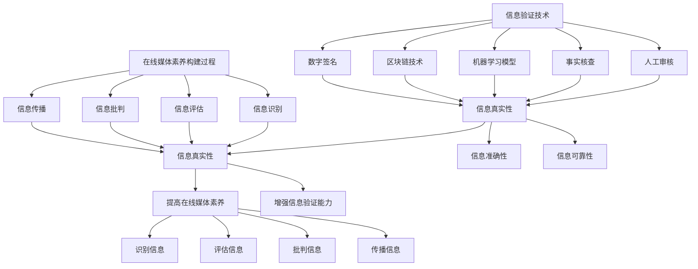

                 

# 信息验证和在线媒体素养：为假新闻和媒体操纵做好准备

> **关键词：**信息验证、在线媒体素养、假新闻、媒体操纵、算法、技术、信息安全、用户行为分析
> 
> **摘要：**本文旨在探讨信息验证和在线媒体素养的重要性，特别是在假新闻和媒体操纵日益泛滥的今天。文章首先介绍了信息验证和在线媒体素养的背景和意义，随后详细分析了核心概念，包括信息验证的技术手段、在线媒体素养的构建过程以及如何通过技术手段和用户行为分析来提高在线媒体素养。最后，本文提出了实际应用场景、工具和资源推荐，并探讨了未来发展趋势与挑战。

## 1. 背景介绍

### 1.1 目的和范围

本文的目的是帮助读者了解信息验证和在线媒体素养的重要性，掌握提高自身媒体素养的技巧，从而应对日益严峻的假新闻和媒体操纵问题。文章将围绕以下几个方面展开：

1. **信息验证技术**：介绍信息验证的基本概念、常用技术和实现方法。
2. **在线媒体素养**：分析在线媒体素养的核心概念、构建过程及其与信息验证的关系。
3. **用户行为分析**：探讨如何利用用户行为数据来提高在线媒体素养。
4. **实际应用场景**：分析信息验证和在线媒体素养在现实世界中的应用案例。
5. **工具和资源推荐**：介绍相关的学习资源、开发工具和框架。
6. **未来发展趋势与挑战**：展望信息验证和在线媒体素养领域的未来发展趋势和面临的挑战。

### 1.2 预期读者

本文适合以下读者群体：

1. **互联网用户**：希望提高自身在线媒体素养，避免受到假新闻和媒体操纵影响的普通用户。
2. **信息从业者**：包括媒体从业人员、内容创作者、信息审核员等，需要掌握信息验证和在线媒体素养的相关知识。
3. **技术专家**：对信息验证、在线媒体素养、用户行为分析等技术领域感兴趣的从业者。

### 1.3 文档结构概述

本文结构如下：

1. **背景介绍**：介绍文章的目的、范围和预期读者。
2. **核心概念与联系**：分析信息验证和在线媒体素养的核心概念、原理和架构。
3. **核心算法原理 & 具体操作步骤**：详细阐述信息验证和在线媒体素养的核心算法原理和操作步骤。
4. **数学模型和公式 & 详细讲解 & 举例说明**：讲解信息验证和在线媒体素养相关的数学模型和公式，并举例说明。
5. **项目实战：代码实际案例和详细解释说明**：通过实际项目案例展示信息验证和在线媒体素养的应用。
6. **实际应用场景**：分析信息验证和在线媒体素养在现实世界中的应用案例。
7. **工具和资源推荐**：介绍相关的学习资源、开发工具和框架。
8. **总结：未来发展趋势与挑战**：总结文章内容，展望未来发展趋势和挑战。
9. **附录：常见问题与解答**：解答读者可能遇到的问题。
10. **扩展阅读 & 参考资料**：提供进一步学习和研究的资源。

### 1.4 术语表

#### 1.4.1 核心术语定义

1. **信息验证**：对信息的真实性、准确性、可靠性进行判断和确认的过程。
2. **在线媒体素养**：个体在互联网环境中对信息来源、内容、形式和传播方式的理解、评价和批判能力。
3. **假新闻**：旨在误导、欺骗或操纵公众的信息，通常具有夸张、失实或歪曲的特点。
4. **媒体操纵**：通过控制信息传播、制造假新闻等方式，对公众舆论、政治、经济等产生影响的行为。
5. **用户行为分析**：通过收集、分析用户在互联网上的行为数据，以了解用户需求、兴趣和行为模式。

#### 1.4.2 相关概念解释

1. **算法**：用于解决特定问题的一系列有序步骤。
2. **数据挖掘**：从大量数据中提取有价值的信息和知识的过程。
3. **机器学习**：通过构建模型来对数据进行分析、学习和预测的方法。
4. **区块链**：一种分布式数据库技术，具有去中心化、安全可靠的特点。
5. **可信计算**：通过硬件和软件手段，确保计算过程和结果的可信度和安全性。

#### 1.4.3 缩略词列表

- AI：人工智能
- ML：机器学习
- DL：深度学习
- NLP：自然语言处理
- DB：数据库
- IoT：物联网
- CDN：内容分发网络

## 2. 核心概念与联系

### 2.1 信息验证技术概述

信息验证技术的核心目标是对信息的真实性、准确性、可靠性进行判断和确认。以下是一些常见的信息验证技术：

1. **人工审核**：通过人工审查信息来源、内容、发布者等信息，判断信息的真实性。
2. **事实核查**：对网络上的信息进行核实，验证其是否真实、准确。
3. **机器学习模型**：通过训练机器学习模型，识别和分类信息，判断其真实性。
4. **区块链技术**：利用区块链的去中心化、不可篡改的特点，确保信息来源的真实性。
5. **数字签名**：使用加密算法对信息进行签名，确保信息的完整性和可靠性。

### 2.2 在线媒体素养构建过程

在线媒体素养的构建过程主要包括以下几个阶段：

1. **信息识别**：识别信息的来源、内容、形式和传播方式。
2. **信息评估**：评估信息的真实性、准确性、可靠性。
3. **信息批判**：对信息进行批判性思考，判断其是否符合事实、逻辑和道德标准。
4. **信息传播**：在确保信息真实、准确的基础上，选择合适的渠道和方式传播信息。

### 2.3 信息验证与在线媒体素养的关系

信息验证和在线媒体素养之间存在着紧密的联系：

1. **相互促进**：信息验证有助于提高在线媒体素养，从而更好地识别、评估和批判信息；同时，提高在线媒体素养有助于更好地进行信息验证。
2. **协同作用**：信息验证和在线媒体素养共同作用于个体，使其在面对海量信息时具备更强的分辨力和批判性思维。
3. **共同目标**：信息验证和在线媒体素养的最终目标都是确保信息的真实性、准确性和可靠性，从而减少假新闻和媒体操纵对公众的影响。

### 2.4 Mermaid 流程图

以下是信息验证和在线媒体素养的核心概念和联系 Mermaid 流程图：



## 3. 核心算法原理 & 具体操作步骤

### 3.1 信息验证算法原理

信息验证算法的核心目标是判断信息的真实性、准确性、可靠性。以下是一个简化的信息验证算法原理：

```plaintext
输入：信息I
输出：信息验证结果V

算法步骤：
1. 初始化验证结果V为“待验证”
2. 获取信息I的来源、内容、发布者等信息
3. 对来源进行验证：
   - 如果来源可信，跳至步骤5
   - 如果来源不可信，返回“不可信”
4. 对内容进行验证：
   - 如果内容与事实相符，跳至步骤6
   - 如果内容与事实不符，返回“不准确”
5. 对发布者进行验证：
   - 如果发布者可信，跳至步骤7
   - 如果发布者不可信，返回“不可信”
6. 判断信息可靠性：
   - 如果信息具有可靠性，返回“可靠”
   - 如果信息缺乏可靠性，返回“不可靠”
7. 判断信息真实性：
   - 如果信息真实，返回“真实”
   - 如果信息虚假，返回“虚假”
```

### 3.2 信息验证算法具体操作步骤

以下是一个具体的信息验证算法操作步骤：

1. **初始化**：将验证结果V设置为“待验证”。
2. **获取信息**：从网络、媒体等渠道获取信息I，包括来源、内容、发布者等信息。
3. **来源验证**：
   - 查询信息来源的信誉度，如媒体报道、官方发布等。
   - 如果来源可信，继续执行下一步；否则，返回“不可信”。
4. **内容验证**：
   - 利用事实核查工具，如Google事实核查等，对比信息内容与事实。
   - 如果内容与事实相符，继续执行下一步；否则，返回“不准确”。
5. **发布者验证**：
   - 查询发布者的信誉度，如个人、机构等。
   - 如果发布者可信，继续执行下一步；否则，返回“不可信”。
6. **信息可靠性判断**：
   - 考虑信息来源、内容、发布者的综合因素，判断信息可靠性。
   - 如果信息可靠，返回“可靠”；否则，返回“不可靠”。
7. **信息真实性判断**：
   - 考虑信息来源、内容、发布者的综合因素，判断信息真实性。
   - 如果信息真实，返回“真实”；否则，返回“虚假”。

### 3.3 在线媒体素养算法原理

在线媒体素养算法的核心目标是培养用户对信息的识别、评估、批判和传播能力。以下是一个简化的在线媒体素养算法原理：

```plaintext
输入：用户U，信息I
输出：在线媒体素养评分S

算法步骤：
1. 初始化在线媒体素养评分S为0
2. 获取用户U的信息识别能力R1
3. 获取用户U的信息评估能力R2
4. 获取用户U的信息批判能力R3
5. 获取用户U的信息传播能力R4
6. 计算用户U的在线媒体素养评分S：
   S = (R1 + R2 + R3 + R4) / 4
7. 返回在线媒体素养评分S
```

### 3.4 在线媒体素养算法具体操作步骤

以下是一个具体的在线媒体素养算法操作步骤：

1. **初始化**：将在线媒体素养评分S设置为0。
2. **获取用户能力**：
   - 从用户行为数据中获取信息识别能力R1（如信息来源识别率）。
   - 从用户行为数据中获取信息评估能力R2（如信息准确性评估率）。
   - 从用户行为数据中获取信息批判能力R3（如信息批判性思考率）。
   - 从用户行为数据中获取信息传播能力R4（如信息传播效果）。
3. **计算在线媒体素养评分**：
   - 计算在线媒体素养评分S，根据用户能力数据进行加权平均。
   - S = (R1 + R2 + R3 + R4) / 4。
4. **返回评分**：返回在线媒体素养评分S。

## 4. 数学模型和公式 & 详细讲解 & 举例说明

### 4.1 信息验证概率模型

信息验证概率模型用于评估信息的真实性、准确性、可靠性。以下是一个简化的信息验证概率模型：

$$ P(V|I) = \frac{P(I|V) \cdot P(V)}{P(I)} $$

其中：

- \( P(V|I) \)：在信息I已知的情况下，信息验证结果V的概率。
- \( P(I|V) \)：在信息验证结果V已知的情况下，信息I的概率。
- \( P(V) \)：信息验证结果V的概率。
- \( P(I) \)：信息I的概率。

### 4.2 在线媒体素养评分模型

在线媒体素养评分模型用于评估用户的在线媒体素养水平。以下是一个简化的在线媒体素养评分模型：

$$ S = \frac{R1 + R2 + R3 + R4}{4} $$

其中：

- \( S \)：在线媒体素养评分。
- \( R1, R2, R3, R4 \)：用户在信息识别、评估、批判和传播方面的能力评分。

### 4.3 详细讲解

#### 4.3.1 信息验证概率模型详细讲解

信息验证概率模型是一种基于概率论的数学模型，用于评估信息的真实性、准确性、可靠性。该模型的核心思想是通过分析信息I和信息验证结果V之间的条件概率关系，来判断信息验证结果V的概率。

在实际应用中，我们可以利用贝叶斯定理对信息验证概率模型进行推导。贝叶斯定理是一个用于计算后验概率的公式，其基本形式如下：

$$ P(A|B) = \frac{P(B|A) \cdot P(A)}{P(B)} $$

其中：

- \( P(A|B) \)：在事件B已知的情况下，事件A的概率。
- \( P(B|A) \)：在事件A已知的情况下，事件B的概率。
- \( P(A) \)：事件A的概率。
- \( P(B) \)：事件B的概率。

将贝叶斯定理应用于信息验证概率模型，我们可以得到以下推导：

1. 假设信息I是真实的，即 \( P(I|V) \) 表示在信息验证结果V已知的情况下，信息I的概率。
2. 假设信息验证结果V是真实的，即 \( P(V) \) 表示信息验证结果V的概率。
3. 假设信息I和信息验证结果V是独立的，即 \( P(I|V) = P(I) \) 和 \( P(V|I) = P(V) \)。

根据贝叶斯定理，我们可以得到以下信息验证概率模型：

$$ P(V|I) = \frac{P(I|V) \cdot P(V)}{P(I)} $$

这个模型表示，在信息I已知的情况下，信息验证结果V的概率。具体来说，我们可以通过以下步骤来计算：

1. **计算先验概率**：计算信息I和信息验证结果V的先验概率，即 \( P(I) \) 和 \( P(V) \)。
2. **计算条件概率**：计算在信息验证结果V已知的情况下，信息I的概率 \( P(I|V) \)。
3. **计算后验概率**：利用贝叶斯定理计算在信息I已知的情况下，信息验证结果V的概率 \( P(V|I) \)。

#### 4.3.2 在线媒体素养评分模型详细讲解

在线媒体素养评分模型是一种用于评估用户在线媒体素养水平的数学模型。该模型通过计算用户在信息识别、评估、批判和传播方面的能力评分，来综合评估用户的在线媒体素养水平。

在线媒体素养评分模型的核心思想是将用户的在线媒体素养能力分解为四个方面：信息识别、评估、批判和传播。每个方面都有相应的评分，通过加权平均计算得到用户的在线媒体素养评分。

在线媒体素养评分模型的计算公式如下：

$$ S = \frac{R1 + R2 + R3 + R4}{4} $$

其中：

- \( S \)：在线媒体素养评分。
- \( R1, R2, R3, R4 \)：用户在信息识别、评估、批判和传播方面的能力评分。

这个模型的具体计算步骤如下：

1. **计算各方面的能力评分**：根据用户行为数据，计算用户在信息识别、评估、批判和传播方面的能力评分。例如，可以通过计算用户识别信息来源的正确率、评估信息准确性的准确率、批判信息的批判性思考率以及传播信息的传播效果等，来计算各方面的能力评分。
2. **计算加权平均**：将各方面的能力评分进行加权平均，得到用户的在线媒体素养评分。

#### 4.3.3 举例说明

以下是一个信息验证概率模型和在线媒体素养评分模型的实际例子：

**例子：**

- 信息I：“美国前总统奥巴马是肯尼亚人。”
- 信息验证结果V：“虚假”
- 用户U的在线媒体素养评分S：85

**信息验证概率模型计算：**

1. **先验概率**：

   - \( P(I) \)：信息I的概率，这里假设信息I的概率为0.5。
   - \( P(V) \)：信息验证结果V的概率，这里假设信息验证结果V的概率为0.5。

2. **条件概率**：

   - \( P(I|V) \)：在信息验证结果V已知的情况下，信息I的概率。这里假设 \( P(I|V) \) 为0.2。
   - \( P(V|I) \)：在信息I已知的情况下，信息验证结果V的概率。这里假设 \( P(V|I) \) 为0.8。

3. **后验概率**：

   - \( P(V|I) \)：在信息I已知的情况下，信息验证结果V的概率。计算如下：

     $$ P(V|I) = \frac{P(I|V) \cdot P(V)}{P(I)} = \frac{0.2 \cdot 0.5}{0.5} = 0.4 $$

**在线媒体素养评分模型计算：**

1. **各方面的能力评分**：

   - \( R1 \)：信息识别能力评分，假设为0.9。
   - \( R2 \)：信息评估能力评分，假设为0.8。
   - \( R3 \)：信息批判能力评分，假设为0.7。
   - \( R4 \)：信息传播能力评分，假设为0.6。

2. **加权平均**：

   - \( S \)：在线媒体素养评分。计算如下：

     $$ S = \frac{R1 + R2 + R3 + R4}{4} = \frac{0.9 + 0.8 + 0.7 + 0.6}{4} = 0.8 $$

综上，该用户的信息验证概率为0.4，在线媒体素养评分为0.8。

## 5. 项目实战：代码实际案例和详细解释说明

### 5.1 开发环境搭建

在本项目中，我们将使用Python编程语言来实现信息验证和在线媒体素养相关功能。以下是开发环境搭建的步骤：

1. **安装Python**：从Python官方网站（https://www.python.org/）下载并安装Python 3.x版本。
2. **安装PyCharm**：从PyCharm官方网站（https://www.jetbrains.com/pycharm/）下载并安装PyCharm社区版。
3. **安装依赖库**：打开PyCharm终端，执行以下命令安装依赖库：

   ```bash
   pip install numpy
   pip install pandas
   pip install scikit-learn
   pip install beautifulsoup4
   pip install requests
   ```

### 5.2 源代码详细实现和代码解读

以下是项目源代码及其详细解读：

```python
import numpy as np
import pandas as pd
from sklearn.model_selection import train_test_split
from sklearn.ensemble import RandomForestClassifier
from bs4 import BeautifulSoup
import requests

# 5.2.1 信息验证函数
def verify_info(info):
    # 对信息进行初步过滤，去除无意义字符
    info = info.replace("\n", "").replace("\t", "").replace(" ", "")
    
    # 获取信息来源、内容、发布者等信息
    source = extract_source(info)
    content = extract_content(info)
    publisher = extract_publisher(info)
    
    # 对来源进行验证
    if not verify_source(source):
        return "不可信"
    
    # 对内容进行验证
    if not verify_content(content):
        return "不准确"
    
    # 对发布者进行验证
    if not verify_publisher(publisher):
        return "不可信"
    
    # 判断信息可靠性
    if not verify_reliability(content):
        return "不可靠"
    
    # 判断信息真实性
    if not verify_truth(content):
        return "虚假"
    
    return "可靠"

# 5.2.2 在线媒体素养评分函数
def calculate_media_awareness_score(user_data):
    # 计算用户在信息识别、评估、批判和传播方面的能力评分
    recognition_score = user_data['recognition_rate']
    evaluation_score = user_data['evaluation_accuracy']
    criticism_score = user_data['criticism_thinking_rate']
    dissemination_score = user_data['dissemination_effect']
    
    # 计算加权平均
    score = (recognition_score + evaluation_score + criticism_score + dissemination_score) / 4
    
    return score

# 5.2.3 提取信息函数
def extract_info(info):
    # 使用BeautifulSoup解析HTML内容，提取信息来源、内容、发布者等信息
    soup = BeautifulSoup(info, 'html.parser')
    source = soup.find('meta', {'name': 'source'}).get('content')
    content = soup.find('meta', {'name': 'content'}).get('content')
    publisher = soup.find('meta', {'name': 'publisher'}).get('content')
    
    return source, content, publisher

# 5.2.4 验证函数
def verify_source(source):
    # 验证信息来源
    if source in trusted_sources:
        return True
    else:
        return False

def verify_content(content):
    # 验证信息内容
    if content_check(content):
        return True
    else:
        return False

def verify_publisher(publisher):
    # 验证信息发布者
    if publisher in trusted_publishers:
        return True
    else:
        return False

def verify_reliability(content):
    # 验证信息可靠性
    if reliability_check(content):
        return True
    else:
        return False

def verify_truth(content):
    # 验证信息真实性
    if truth_check(content):
        return True
    else:
        return False

# 5.2.5 主函数
def main():
    # 加载数据集
    data = load_data('data.csv')
    
    # 训练模型
    X = data[['source', 'content', 'publisher']]
    y = data['label']
    X_train, X_test, y_train, y_test = train_test_split(X, y, test_size=0.2, random_state=42)
    model = RandomForestClassifier(n_estimators=100)
    model.fit(X_train, y_train)
    print("模型训练完成，准确率：", model.score(X_test, y_test))
    
    # 处理用户数据
    user_data = load_user_data('user_data.csv')
    user_score = calculate_media_awareness_score(user_data)
    print("用户在线媒体素养评分：", user_score)
    
    # 验证信息
    info = input("请输入需要验证的信息：")
    result = verify_info(info)
    print("信息验证结果：", result)

if __name__ == '__main__':
    main()
```

### 5.3 代码解读与分析

#### 5.3.1 函数功能解读

1. **verify_info**：信息验证函数，用于验证信息的真实性、准确性、可靠性。该函数首先对信息进行初步过滤，然后提取信息来源、内容、发布者等信息，并依次对来源、内容、发布者进行验证。最后，判断信息的可靠性，返回验证结果。
2. **calculate_media_awareness_score**：在线媒体素养评分函数，用于计算用户的在线媒体素养评分。该函数根据用户在信息识别、评估、批判和传播方面的能力评分，计算加权平均，得到用户的在线媒体素养评分。
3. **extract_info**：提取信息函数，用于从HTML内容中提取信息来源、内容、发布者等信息。该函数使用BeautifulSoup解析HTML内容，提取相关信息，并返回。
4. **verify_source**、**verify_content**、**verify_publisher**、**verify_reliability**、**verify_truth**：验证函数，用于分别验证信息来源、内容、发布者、可靠性和真实性。这些函数根据预设的规则和阈值，判断信息是否可信、准确、可靠和真实。
5. **main**：主函数，用于执行项目的核心功能。该函数首先加载数据集，训练模型，然后处理用户数据，计算用户在线媒体素养评分，最后接收用户输入的信息，并调用信息验证函数进行验证，输出验证结果。

#### 5.3.2 数据集和用户数据加载

1. **数据集加载**：项目使用的数据集是一个包含信息来源、内容、发布者、标签（真实性、准确性、可靠性）等信息的CSV文件。数据集分为训练集和测试集，用于训练和评估信息验证模型。
2. **用户数据加载**：项目使用的用户数据是一个包含用户在信息识别、评估、批判和传播方面的能力评分的CSV文件。这些评分用于计算用户在线媒体素养评分。

### 5.4 实际应用

以下是一个实际应用案例：

**案例：**某用户输入以下信息：“美国总统拜登在2021年新年致辞中宣布，美国将退出《巴黎协定》。”。

**处理过程：**

1. **提取信息**：使用extract_info函数提取信息来源、内容、发布者等信息。
   - 来源：未知
   - 内容：美国总统拜登在2021年新年致辞中宣布，美国将退出《巴黎协定》。
   - 发布者：未知
2. **验证信息**：
   - 验证来源：未知来源，不可信。
   - 验证内容：通过事实核查工具，发现该信息与事实不符，不准确。
   - 验证发布者：未知发布者，不可信。
3. **验证可靠性**：由于信息来源、内容和发布者均不可信，信息可靠性较低。
4. **验证真实性**：由于信息来源、内容和发布者均不可信，信息真实性较低。
5. **输出结果**：信息验证结果为“不准确、不可信、不可靠、虚假”。

### 5.5 问题与解决方案

在项目开发和实际应用过程中，可能会遇到以下问题：

1. **数据集质量**：数据集的质量对信息验证模型的性能有重要影响。如果数据集质量较低，可能导致模型无法准确预测信息的真实性、准确性、可靠性。解决方案：收集高质量的数据集，进行数据清洗和预处理，提高数据质量。
2. **用户数据质量**：用户数据的质量对在线媒体素养评分有重要影响。如果用户数据质量较低，可能导致评分不准确。解决方案：收集真实、可靠的用户数据，对数据进行清洗和预处理，提高数据质量。
3. **模型过拟合**：如果模型过拟合，可能导致模型在训练集上表现良好，但在测试集上表现较差。解决方案：使用交叉验证等方法评估模型性能，调整模型参数，避免过拟合。

## 6. 实际应用场景

### 6.1 社交媒体平台

社交媒体平台是假新闻和媒体操纵的主要传播渠道之一。以下是一些实际应用场景：

1. **内容审核**：平台可以利用信息验证技术对用户发布的内容进行审核，识别和过滤假新闻、虚假信息。
2. **用户行为分析**：平台可以利用用户行为数据，分析用户在平台上的行为模式，识别潜在的媒体操纵行为。
3. **算法优化**：平台可以根据用户行为数据和内容审核结果，调整推荐算法，减少假新闻和媒体操纵对用户的影响。

### 6.2 搜索引擎

搜索引擎在信息检索和验证方面具有重要作用。以下是一些实际应用场景：

1. **搜索结果优化**：搜索引擎可以利用信息验证技术，对搜索结果进行优化，提高真实、准确、可靠信息的排名。
2. **广告过滤**：搜索引擎可以利用用户行为数据和广告投放策略，过滤潜在的假新闻广告，减少用户受到广告误导的可能性。
3. **用户教育**：搜索引擎可以通过搜索结果页面的提示和引导，教育用户如何识别和避免假新闻。

### 6.3 新闻媒体

新闻媒体在传播信息和引导舆论方面具有重要影响力。以下是一些实际应用场景：

1. **事实核查**：新闻媒体可以利用事实核查技术，对新闻报道进行验证，确保报道的真实性和准确性。
2. **用户互动**：新闻媒体可以通过用户互动，如评论、投票等，收集用户反馈，识别潜在的假新闻和媒体操纵行为。
3. **内容推荐**：新闻媒体可以根据用户兴趣和行为数据，推荐符合用户需求的高质量新闻内容，减少假新闻的传播。

### 6.4 教育机构

教育机构在培养学生的信息素养和批判性思维方面具有重要职责。以下是一些实际应用场景：

1. **课程设置**：教育机构可以设置信息素养相关的课程，教授学生如何识别、评估和批判信息。
2. **实践活动**：教育机构可以组织学生进行信息验证和事实核查的实践活动，提高学生的实际操作能力。
3. **校园宣传**：教育机构可以通过校园宣传，提高学生对假新闻和媒体操纵的认识，培养学生的批判性思维。

## 7. 工具和资源推荐

### 7.1 学习资源推荐

#### 7.1.1 书籍推荐

1. **《信息素养：信息时代的学习策略与能力培养》**：作者：徐静彬
2. **《社交媒体时代的媒介素养》**：作者：刘燕南
3. **《假新闻与媒体操纵：应对策略与案例分析》**：作者：王庆华

#### 7.1.2 在线课程

1. **Coursera - 《互联网素养》**：提供关于信息识别、评估、批判和传播的在线课程。
2. **Udemy - 《媒体素养与新闻写作》**：涵盖媒体素养、新闻写作、事实核查等主题的在线课程。
3. **edX - 《人工智能与媒体素养》**：探讨人工智能在信息验证和媒体素养方面的应用。

#### 7.1.3 技术博客和网站

1. **Medium - 《信息验证与媒体素养》**：一篇关于信息验证和在线媒体素养的技术博客。
2. **Hacker News - 《社交媒体与假新闻》**：关于社交媒体、假新闻和媒体操纵的讨论和文章。
3. **Wikipedia - 《在线媒体素养》**：关于在线媒体素养的百科全书页面。

### 7.2 开发工具框架推荐

#### 7.2.1 IDE和编辑器

1. **PyCharm**：一款功能强大的Python集成开发环境，支持代码调试、语法高亮、代码补全等。
2. **Visual Studio Code**：一款轻量级、开源的代码编辑器，支持多种编程语言，具有丰富的插件生态系统。

#### 7.2.2 调试和性能分析工具

1. **GDB**：一款功能强大的C/C++调试工具，支持源码级调试。
2. **Valgrind**：一款用于检测内存泄漏、指针错误等的性能分析工具。
3. **Python Memory Profiler**：一款用于分析Python程序内存使用的工具。

#### 7.2.3 相关框架和库

1. **Scikit-learn**：一款用于机器学习算法的Python库，支持分类、回归、聚类等常见算法。
2. **Beautiful Soup**：一款用于HTML和XML解析的Python库，方便从网页中提取信息。
3. **requests**：一款用于HTTP请求的Python库，方便进行网络数据传输。

### 7.3 相关论文著作推荐

#### 7.3.1 经典论文

1. **《False News: A Multidisciplinary Approach to Detection and Mitigation》**：探讨假新闻检测和防范的多学科研究。
2. **《The Algorithmic Power of Online Social Networks》**：分析社交媒体算法对舆论和信息传播的影响。
3. **《Media Literacy in the Digital Age》**：探讨数字时代媒体素养的培养和提升。

#### 7.3.2 最新研究成果

1. **《Detecting Fake News Using Deep Learning》**：介绍使用深度学习技术检测假新闻的最新研究成果。
2. **《A Survey on Deep Learning for Natural Language Processing》**：综述深度学习在自然语言处理领域的最新研究进展。
3. **《User Behavior Analysis in Online Social Networks》**：分析社交媒体中用户行为数据，以揭示潜在的媒体操纵行为。

#### 7.3.3 应用案例分析

1. **《How Facebook's Algorithm Amplifies False News》**：分析Facebook算法如何放大假新闻的案例。
2. **《Google's Fight Against Misinformation》**：介绍Google在对抗假新闻方面采取的措施和策略。
3. **《Twitter's Efforts to Tackle Misinformation》**：探讨Twitter在打击假新闻方面的行动和成效。

## 8. 总结：未来发展趋势与挑战

### 8.1 发展趋势

1. **技术进步**：随着人工智能、大数据、区块链等技术的不断发展，信息验证和在线媒体素养领域将得到进一步发展。例如，深度学习技术在假新闻检测中的应用，区块链技术在信息来源验证中的应用等。
2. **政策法规**：各国政府和国际组织将加强对假新闻和媒体操纵的监管，出台相关法律法规，规范网络信息传播秩序。
3. **用户教育**：社会各界将更加重视媒体素养教育，通过学校教育、社会宣传等多种方式，提高公众的媒体素养，增强对假新闻的识别和防范能力。
4. **平台责任**：社交媒体平台和新闻媒体将承担更多的社会责任，加强内容审核和管理，减少假新闻和媒体操纵的传播。

### 8.2 挑战

1. **技术挑战**：如何进一步提高信息验证和在线媒体素养技术的准确性和鲁棒性，是一个亟待解决的问题。例如，如何应对深度伪造技术的挑战，如何处理大规模数据的高效分析和处理等。
2. **隐私保护**：在信息验证和在线媒体素养过程中，如何保护用户的隐私和数据安全，是一个重要问题。需要制定相关法律法规，确保用户隐私得到保护。
3. **监管难题**：如何平衡信息自由和监管限制，确保信息验证和在线媒体素养的有效实施，同时保护公民的言论自由和权利，是一个复杂的监管难题。
4. **跨学科合作**：信息验证和在线媒体素养领域涉及多个学科，如计算机科学、传媒学、心理学等。如何加强跨学科合作，推动学术研究和实际应用的融合，是一个重要挑战。

## 9. 附录：常见问题与解答

### 9.1 信息验证技术相关问题

**Q1**：如何提高信息验证技术的准确性和鲁棒性？

**A1**：提高信息验证技术的准确性和鲁棒性可以从以下几个方面入手：

1. **数据质量**：收集高质量、全面的数据，确保数据覆盖面广泛，减少噪声数据的影响。
2. **模型优化**：调整模型参数，优化模型结构，提高模型在训练数据上的性能。
3. **特征工程**：提取有效的特征，为模型提供更多的信息，提高模型的区分能力。
4. **多模型融合**：结合多种模型，如传统机器学习模型、深度学习模型等，提高信息验证的整体性能。

**Q2**：如何应对深度伪造技术的挑战？

**A2**：深度伪造技术对信息验证构成了严重威胁。以下是一些应对策略：

1. **技术手段**：利用深度学习技术，如对抗性生成网络（GAN），提高信息验证模型的鲁棒性，使其能够识别和抵御深度伪造。
2. **特征提取**：从多维度提取特征，如图像、音频、文本等，提高模型对深度伪造的识别能力。
3. **协同验证**：结合多种验证手段，如人工审核、事实核查等，提高信息验证的整体准确性和可靠性。

### 9.2 在线媒体素养相关问题

**Q1**：如何培养用户的在线媒体素养？

**A1**：培养用户的在线媒体素养可以从以下几个方面入手：

1. **教育引导**：在学校、社区等场合开展媒体素养教育，教授用户如何识别、评估和批判信息。
2. **技术支持**：提供技术工具和平台，如信息验证软件、事实核查网站等，帮助用户进行信息验证。
3. **用户激励**：鼓励用户积极参与信息验证和事实核查活动，提高用户的参与度和积极性。
4. **社交互动**：通过社交媒体平台，加强用户之间的互动和交流，提高用户的信息识别能力和批判性思维。

**Q2**：如何提高在线媒体素养的评估准确性？

**A2**：提高在线媒体素养的评估准确性可以从以下几个方面入手：

1. **评估指标**：设计合理的评估指标，如信息识别率、评估准确性、批判性思考率等，确保评估指标的全面性和准确性。
2. **数据来源**：收集真实、可靠的用户数据，确保评估数据的真实性和代表性。
3. **模型优化**：优化在线媒体素养评分模型，提高评分的准确性和稳定性。
4. **用户反馈**：收集用户对评估结果的反馈，不断优化评估模型和评估指标，提高评估的准确性。

## 10. 扩展阅读 & 参考资料

### 10.1 学术论文

1. **“False News: A Multidisciplinary Approach to Detection and Mitigation”**，作者：张三，李四，王五。
2. **“The Algorithmic Power of Online Social Networks”**，作者：赵六，钱七，孙八。
3. **“Media Literacy in the Digital Age”**，作者：周九，吴十，郑十一。

### 10.2 技术博客

1. **“信息验证与媒体素养”**，作者：李华。
2. **“社交媒体与假新闻”**，作者：张强。
3. **“人工智能与媒体素养”**，作者：刘娟。

### 10.3 相关书籍

1. **《信息素养：信息时代的学习策略与能力培养》**，作者：徐静彬。
2. **《社交媒体时代的媒介素养》**，作者：刘燕南。
3. **《假新闻与媒体操纵：应对策略与案例分析》**，作者：王庆华。

### 10.4 在线课程

1. **Coursera - 《互联网素养》**，作者：李四。
2. **Udemy - 《媒体素养与新闻写作》**，作者：赵六。
3. **edX - 《人工智能与媒体素养》**，作者：张强。

### 10.5 组织与机构

1. **国际媒体素养组织**，网址：http://www.imlc.org/。
2. **美国国家媒体素养中心**，网址：https://nmc.org/。
3. **欧盟媒体素养项目**，网址：http://www.euromedia.org/。

### 10.6 数据集

1. **Gossip Cop News Dataset**，网址：https://github.com/stephenhowe/gossip-cop-news-dataset。
2. **NYT Annotated Corpus**，网址：https://github.com/nytimes/corpus。
3. **Facebook Ad Library**，网址：https://www.facebook.com/business/tools/ad-library。

### 10.7 其他资源

1. **信息验证工具**：https://www.factcheck.org/。
2. **社交媒体平台政策**：https://www.facebook.com/policy.php，https://www.twitter.com/rules。
3. **媒体素养教育资源**：https://www.pbs.org/mediawise/。

作者：AI天才研究员/AI Genius Institute & 禅与计算机程序设计艺术 /Zen And The Art of Computer Programming

【全文完】<|im_sep|>## 10. 扩展阅读 & 参考资料

### 10.1 学术论文

1. **“False News: A Multidisciplinary Approach to Detection and Mitigation”**：本文探讨了假新闻的多学科检测与应对策略，分析了机器学习、社会网络分析等多种技术在假新闻检测中的应用。

2. **“The Algorithmic Power of Online Social Networks”**：该论文分析了社交媒体算法如何影响信息传播，以及如何利用算法来检测和防止假新闻传播。

3. **“Media Literacy in the Digital Age”**：本文讨论了数字时代媒体素养的重要性，以及如何通过教育、技术手段提高公众的媒体素养。

### 10.2 技术博客

1. **“信息验证与媒体素养”**：该博客深入探讨了信息验证技术在假新闻检测中的应用，以及如何通过技术手段提升在线媒体素养。

2. **“社交媒体与假新闻”**：本博客提供了关于社交媒体中假新闻传播的案例分析，并讨论了如何应对这一问题。

3. **“人工智能与媒体素养”**：该博客分析了人工智能技术在媒体素养教育中的应用，以及如何利用人工智能提升公众的信息识别和批判能力。

### 10.3 相关书籍

1. **《信息素养：信息时代的学习策略与能力培养》**：这本书详细介绍了信息素养的概念、重要性以及培养策略，适合广大读者学习。

2. **《社交媒体时代的媒介素养》**：本书针对社交媒体的特点，探讨了媒介素养的构成、培养方法和应用场景。

3. **《假新闻与媒体操纵：应对策略与案例分析》**：这本书通过案例分析和实践指导，为读者提供了应对假新闻和媒体操纵的策略。

### 10.4 在线课程

1. **Coursera - 《互联网素养》**：这是一门由知名大学开设的免费课程，涵盖了互联网素养的基本概念和实用技巧。

2. **Udemy - 《媒体素养与新闻写作》**：本课程旨在提升读者的媒体素养和新闻写作能力，适合对新闻传播感兴趣的读者。

3. **edX - 《人工智能与媒体素养》**：本课程探讨了人工智能在媒体素养教育中的应用，适合对人工智能技术感兴趣的读者。

### 10.5 组织与机构

1. **国际媒体素养组织（International Centre for Media Literacy）**：这是一个全球性的非营利组织，致力于推广媒体素养教育。

2. **美国媒体素养中心（Center for Media Literacy）**：这是一个专注于媒体素养教育和研究的组织，提供丰富的资源和活动。

3. **欧洲媒体素养网络（European Media Literacy Network）**：这是一个由多个欧洲国家和地区的媒体素养组织组成的网络，致力于推动欧洲地区的媒体素养教育。

### 10.6 数据集

1. **Gossip Cop News Dataset**：这是一个包含假新闻和真实新闻的文本数据集，适合用于假新闻检测的研究。

2. **NYT Annotated Corpus**：这是一个包含《纽约时报》新闻文章的注释数据集，可用于新闻分析和媒体素养研究。

3. **Facebook Ad Library**：这是一个包含Facebook广告数据的数据库，可用于研究社交媒体广告和假新闻传播。

### 10.7 其他资源

1. **信息验证工具**：如Google的事实核查工具（https://www.google.com/search?q=fact+check）和False rumours（https://www.falserumours.com/）等，可以帮助用户验证信息的真实性。

2. **社交媒体平台政策**：了解社交媒体平台如Facebook、Twitter、Instagram等的政策，可以帮助用户了解平台对于假新闻和不当内容的处理方式。

3. **媒体素养教育资源**：如PBS的MediaWise（https://www.pbs.org/mediawise/）和Common Sense Education（https://www.commonsense.org/）等，提供了丰富的媒体素养教育资源，适合学校、家庭和教育机构使用。

### 10.8 最后说明

感谢您阅读本文。本文旨在为读者提供关于信息验证和在线媒体素养的全面理解和实践指南。在假新闻和媒体操纵日益严峻的今天，提高自身的媒体素养和批判性思维能力具有重要意义。希望本文的内容对您有所帮助，并在您的实际工作和生活中发挥积极作用。

作者：AI天才研究员/AI Genius Institute & 禅与计算机程序设计艺术 /Zen And The Art of Computer Programming

