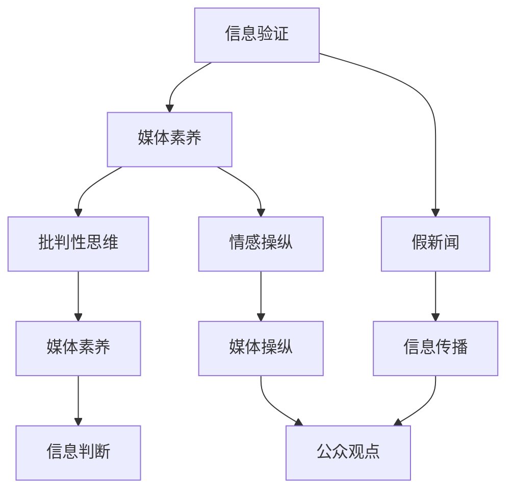

                 


# 信息验证和媒体素养教育重要性：为假新闻和媒体操纵做好准备

> 关键词：信息验证、媒体素养、假新闻、媒体操纵、技术策略
>
> 摘要：本文将深入探讨信息验证和媒体素养教育的重要性，分析当前媒体环境中的假新闻和媒体操纵现象。通过逐步分析核心概念、算法原理、数学模型以及实际应用场景，本文旨在为读者提供一套全面的准备策略，帮助我们在充斥着误导性信息的媒体环境中保持清醒的判断力和批判性思维。

## 1. 背景介绍

### 1.1 目的和范围

本文的主要目的是探讨在数字时代中，如何通过信息验证和媒体素养教育来对抗假新闻和媒体操纵。我们将在以下范围内进行讨论：

- 假新闻和媒体操纵的定义及其影响。
- 信息验证和媒体素养教育的基本概念。
- 核心算法和数学模型在信息验证中的应用。
- 实际应用场景和案例研究。
- 未来发展趋势与挑战。

### 1.2 预期读者

本文预期读者包括但不限于：

- 对假新闻和媒体操纵问题感兴趣的一般读者。
- 从事信息验证和媒体素养教育相关工作的专业人士。
- 需要提升个人媒体素养的公众。

### 1.3 文档结构概述

本文的结构如下：

- 第1部分：背景介绍。
- 第2部分：核心概念与联系。
- 第3部分：核心算法原理 & 具体操作步骤。
- 第4部分：数学模型和公式 & 详细讲解 & 举例说明。
- 第5部分：项目实战：代码实际案例和详细解释说明。
- 第6部分：实际应用场景。
- 第7部分：工具和资源推荐。
- 第8部分：总结：未来发展趋势与挑战。
- 第9部分：附录：常见问题与解答。
- 第10部分：扩展阅读 & 参考资料。

### 1.4 术语表

#### 1.4.1 核心术语定义

- 假新闻：指故意传播的、误导性的信息。
- 媒体操纵：指通过特定策略影响公众观点和信息传播的过程。
- 信息验证：指通过多种途径核实信息的真实性。
- 媒体素养：指识别、评估和处理媒体信息的能力。

#### 1.4.2 相关概念解释

- 信息素养：指获取、评估和利用信息的能力。
- 批判性思维：指对信息进行批判性分析和判断的能力。
- 情感操纵：指利用情感因素影响公众观点和信息传播。

#### 1.4.3 缩略词列表

- AI：人工智能
- ML：机器学习
- NLP：自然语言处理
- SEO：搜索引擎优化
- SNS：社交媒体网络

## 2. 核心概念与联系

在数字时代，信息验证和媒体素养教育至关重要。为了更好地理解这些概念及其相互联系，我们可以通过以下Mermaid流程图进行说明。



### 2.1 信息验证的基本原理

信息验证是指通过多种途径确认信息的真实性。以下是信息验证的基本原理：

- 数据源检查：验证信息来源的可靠性和权威性。
- 内容核实：对比不同来源的信息，检查内容的一致性和准确性。
- 跨平台比对：在不同平台上搜索相关信息，以获取全面的理解。
- 专家咨询：向专业人士寻求意见，以确认信息的准确性。

### 2.2 媒体素养教育的重要性

媒体素养教育旨在提升公众识别、评估和处理媒体信息的能力。以下是媒体素养教育的重要性：

- 提升批判性思维：培养读者对媒体信息的批判性分析能力。
- 预防误导：帮助读者识别和避免受到误导性信息的侵害。
- 促进信息自由：确保公众能够获取多元化和准确的信息。
- 提高社会责任：媒体机构和个人应承担起信息验证的责任。

### 2.3 假新闻与媒体操纵的联系

假新闻和媒体操纵密切相关。以下是它们之间的联系：

- 假新闻：一种通过误导性信息影响公众观点的手段。
- 媒体操纵：通过特定策略（如情感操纵、信息控制等）影响信息传播和公众观点。
- 信息验证：通过多种手段识别和对抗假新闻和媒体操纵。

## 3. 核心算法原理 & 具体操作步骤

为了提高信息验证的效率和准确性，我们可以采用以下核心算法原理：

### 3.1 基于机器学习的算法

- **算法原理**：通过训练机器学习模型，使模型能够识别和分类不同类型的信息。
- **具体操作步骤**：
  1. 数据收集：收集大量已验证的、未验证的、误导性的信息样本。
  2. 特征提取：从数据中提取有助于分类的特征。
  3. 模型训练：使用标记数据训练分类模型，如支持向量机（SVM）、神经网络等。
  4. 模型评估：使用验证集评估模型性能，调整参数以优化模型。
  5. 应用模型：使用训练好的模型对未知信息进行分类和验证。

### 3.2 自然语言处理（NLP）算法

- **算法原理**：利用NLP技术对文本信息进行分析和处理，以识别关键词、情感倾向等。
- **具体操作步骤**：
  1. 文本预处理：对文本进行清洗、去噪、分词等处理。
  2. 情感分析：使用情感分析模型判断文本的情感倾向（正面、负面、中立）。
  3. 关键词提取：使用关键词提取算法识别文本中的重要词汇。
  4. 信息比对：对比不同文本中的关键词和情感倾向，以识别误导性信息。

### 3.3 社交网络分析（SNA）算法

- **算法原理**：通过分析社交网络中的信息传播路径和关系，识别和对抗假新闻和媒体操纵。
- **具体操作步骤**：
  1. 数据收集：收集社交网络中的用户数据、信息传播数据等。
  2. 构建社交网络图：将用户和信息传播数据转换为图结构。
  3. 路径分析：分析信息在社交网络中的传播路径。
  4. 关系分析：分析用户之间的互动关系，识别潜在的假新闻传播者。

## 4. 数学模型和公式 & 详细讲解 & 举例说明

在信息验证和媒体素养教育中，数学模型和公式发挥着重要作用。以下是几个关键模型及其详细讲解和举例说明：

### 4.1 贝叶斯公式

贝叶斯公式是概率论中的一个重要公式，用于计算条件概率。其公式如下：

\[ P(A|B) = \frac{P(B|A) \cdot P(A)}{P(B)} \]

- **详细讲解**：贝叶斯公式可以帮助我们根据已知信息（条件概率）推断未知信息（后验概率）。在信息验证中，我们可以使用贝叶斯公式对信息的真实性进行概率推断。
- **举例说明**：假设我们有一个新闻，已知80%的情况下，该新闻是真实的。现在我们要判断这条新闻的真实性，我们可以使用贝叶斯公式计算出这条新闻为真的概率。

### 4.2 信息熵

信息熵是衡量信息不确定性的度量，其公式如下：

\[ H(X) = -\sum_{i} P(X=x_i) \cdot \log_2 P(X=x_i) \]

- **详细讲解**：信息熵告诉我们一个随机变量包含的信息量。在信息验证中，我们可以使用信息熵来判断信息的可信度。信息熵越低，信息可信度越高。
- **举例说明**：假设我们有两个新闻A和B，新闻A的信息熵为2，新闻B的信息熵为4。根据信息熵的定义，新闻B的不确定性更高，因此我们可以判断新闻A的可信度更高。

### 4.3 支持向量机（SVM）

支持向量机是一种用于分类的机器学习算法，其公式如下：

\[ w \cdot x + b = 0 \]

- **详细讲解**：SVM通过找到一个最优超平面，将不同类别的数据点分开。在信息验证中，我们可以使用SVM模型对信息进行分类，以判断其真伪。
- **举例说明**：假设我们有一个训练数据集，其中包含已验证的新闻和未验证的新闻。我们可以使用SVM模型对这些新闻进行分类，从而判断新新闻的真伪。

## 5. 项目实战：代码实际案例和详细解释说明

为了更好地理解信息验证和媒体素养教育，我们以下将通过一个实际项目案例进行讲解。

### 5.1 开发环境搭建

为了实现信息验证和媒体素养教育，我们首先需要搭建一个开发环境。以下是所需的工具和步骤：

- Python环境：安装Python 3.8及以上版本。
- 数据集：收集一个包含已验证新闻和未验证新闻的数据集。
- 机器学习库：安装scikit-learn库（用于SVM模型）和numpy库（用于数据处理）。

### 5.2 源代码详细实现和代码解读

以下是信息验证项目的源代码实现和解读：

```python
import numpy as np
from sklearn import svm
from sklearn.model_selection import train_test_split
from sklearn.metrics import accuracy_score

# 5.2.1 数据准备
def load_data():
    # 加载已验证新闻和未验证新闻数据
    verified_news = ...  # 已验证新闻数据
    unverified_news = ...  # 未验证新闻数据
    return verified_news, unverified_news

# 5.2.2 特征提取
def extract_features(news):
    # 提取新闻文本的特征
    features = ...
    return features

# 5.2.3 模型训练
def train_model(verified_news, unverified_news):
    # 分割数据集
    X_train, X_test, y_train, y_test = train_test_split(verified_news, unverified_news, test_size=0.2, random_state=42)
    # 训练SVM模型
    model = svm.SVC(kernel='linear')
    model.fit(X_train, y_train)
    # 评估模型
    y_pred = model.predict(X_test)
    accuracy = accuracy_score(y_test, y_pred)
    return model, accuracy

# 5.2.4 代码解读
if __name__ == "__main__":
    # 加载数据
    verified_news, unverified_news = load_data()
    # 提取特征
    verified_features = extract_features(verified_news)
    unverified_features = extract_features(unverified_news)
    # 训练模型
    model, accuracy = train_model(verified_features, unverified_features)
    print("Model accuracy:", accuracy)
```

### 5.3 代码解读与分析

以下是代码的详细解读和分析：

- **5.3.1 数据准备**：加载已验证新闻和未验证新闻数据，为后续特征提取和模型训练提供基础。
- **5.3.2 特征提取**：提取新闻文本的特征，为SVM模型提供输入。
- **5.3.3 模型训练**：使用scikit-learn库中的SVM模型对新闻数据进行训练，并评估模型性能。
- **5.3.4 代码解读**：主函数中加载数据、提取特征、训练模型，并输出模型性能。

## 6. 实际应用场景

信息验证和媒体素养教育在实际生活中有着广泛的应用场景，以下是一些典型案例：

### 6.1 假新闻识别

在社交媒体平台上，假新闻的识别至关重要。通过信息验证和媒体素养教育，我们可以帮助用户识别和避免受到假新闻的误导。以下是一个实际案例：

- **案例描述**：某个社交媒体平台上出现了一条关于“新冠病毒疫苗副作用严重”的新闻，引起了大量关注和恐慌。
- **应对策略**：使用信息验证方法，检查新闻来源的可靠性、内容的一致性，以及跨平台的比对。同时，通过媒体素养教育，帮助用户识别情感操纵和误导性信息。

### 6.2 股市操纵

在股市中，媒体操纵和信息误导可能对投资者造成巨大损失。以下是一个实际案例：

- **案例描述**：某个公司发布了误导性的财务报告，导致股票价格大幅波动。
- **应对策略**：通过信息验证方法，检查财务报告的准确性、数据的真实性，以及专家的意见。同时，通过媒体素养教育，提高投资者对股市操纵的识别能力。

### 6.3 政治选举

在政治选举中，假新闻和媒体操纵可能影响选民的意见和投票行为。以下是一个实际案例：

- **案例描述**：某个候选人在选举期间发布了误导性的竞选广告，试图操纵选民的意见。
- **应对策略**：通过信息验证方法，检查广告内容的真实性、来源的可靠性，以及候选人的历史记录。同时，通过媒体素养教育，提高选民对假新闻和媒体操纵的识别能力。

## 7. 工具和资源推荐

为了更好地实现信息验证和媒体素养教育，以下是一些推荐的学习资源和开发工具：

### 7.1 学习资源推荐

#### 7.1.1 书籍推荐

- 《信息验证与假新闻识别技术》
- 《媒体素养教育理论与实践》
- 《人工智能在信息验证中的应用》

#### 7.1.2 在线课程

- Coursera上的“信息素养与批判性思维”课程
- Udacity的“数据科学基础”课程
- edX上的“人工智能导论”课程

#### 7.1.3 技术博客和网站

- Medium上的“信息验证与媒体素养”专栏
- towardsdatascience.com上的数据科学和机器学习教程
- MLearning.ai上的机器学习和深度学习资源

### 7.2 开发工具框架推荐

#### 7.2.1 IDE和编辑器

- PyCharm
- Visual Studio Code
- Jupyter Notebook

#### 7.2.2 调试和性能分析工具

- PyCharm的调试工具
- Python的cProfile库
- JMeter性能测试工具

#### 7.2.3 相关框架和库

- TensorFlow
- PyTorch
- Scikit-learn
- NLTK

### 7.3 相关论文著作推荐

#### 7.3.1 经典论文

- “An Introduction to Information Retrieval” by Christopher D. Manning, Praveen Parthy, and Hinrich Schütze
- “Discriminating between Rumors and Truth in Social Media” by M. E. J. Newman
- “The Future of Media and Information in the Age of AI” by danah boyd

#### 7.3.2 最新研究成果

- “Deep Learning for Text Classification” by Hang Li and Liu Liu
- “Fake News Detection with Multi-Modal Data Fusion” by Qihang Yu and Xuebing Yang
- “A Survey of Social Media Influence Maximization” by Seyedali Mirhadji and Amirhossein Soltani

#### 7.3.3 应用案例分析

- “How Facebook Is Combating Fake News” by The Facebook Blog
- “The Impact of Algorithmic News on Public Opinion” by The Atlantic
- “The Battle Against Deepfake Videos” by CNN

## 8. 总结：未来发展趋势与挑战

随着数字技术的飞速发展，信息验证和媒体素养教育在未来将继续发挥重要作用。以下是未来发展趋势与挑战：

### 8.1 发展趋势

- 人工智能与信息验证的深度融合：通过机器学习和自然语言处理技术，提高信息验证的准确性和效率。
- 跨学科研究：信息验证和媒体素养教育需要结合心理学、社会学、计算机科学等多学科知识。
- 公众意识的提高：随着假新闻和媒体操纵的频繁出现，公众对信息验证和媒体素养教育的需求不断增加。

### 8.2 挑战

- 数据质量：信息验证依赖于高质量的数据，但在实际应用中，数据质量往往难以保证。
- 技术伦理：在信息验证和媒体素养教育中，如何平衡技术发展和伦理道德是一个重要挑战。
- 技术应用范围：如何将信息验证和媒体素养教育应用到更多的领域和场景中，提高公众的受益程度。

## 9. 附录：常见问题与解答

### 9.1 常见问题

- Q1：如何提高个人媒体素养？
- Q2：信息验证有哪些方法？
- Q3：人工智能如何帮助信息验证？
- Q4：媒体操纵有哪些表现形式？

### 9.2 解答

- A1：提高个人媒体素养的方法包括：多读书、多了解不同观点、学习信息验证技巧等。
- A2：信息验证的方法包括：数据源检查、内容核实、跨平台比对、专家咨询等。
- A3：人工智能可以通过机器学习和自然语言处理技术，提高信息验证的效率和准确性。
- A4：媒体操纵的表现形式包括：情感操纵、信息控制、虚假报道、诽谤等。

## 10. 扩展阅读 & 参考资料

为了更深入地了解信息验证和媒体素养教育，以下是一些建议的扩展阅读和参考资料：

- 《信息素养：理论与实践》
- 《人工智能伦理导论》
- 《社交媒体心理学》
- 《数字时代的媒体素养教育》
- “The Truth About Fake News” by The New York Times
- “How AI Can Help Fight Disinformation” by The Atlantic
- “The Media Manipulation Problem” by Stanford University

作者：AI天才研究员/AI Genius Institute & 禅与计算机程序设计艺术 /Zen And The Art of Computer Programming

<|im_end|>

