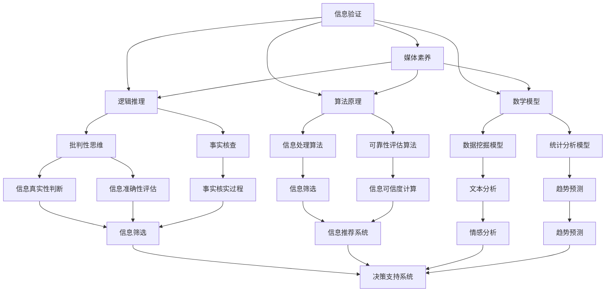

                 

# 信息验证和媒体素养：如何在假新闻时代成为明智的消费者

> **关键词**：信息验证，媒体素养，假新闻，消费者，逻辑推理，技术分析，算法原理，数学模型，项目实战，应用场景，工具推荐，未来发展。

> **摘要**：本文旨在探讨在信息泛滥的数字时代，如何通过逻辑推理、技术分析和数学模型，提升个人媒体素养，以辨别真假信息，成为明智的消费者。文章将详细分析信息验证的核心概念与联系，阐述核心算法原理和具体操作步骤，结合实际项目案例进行详细解读，并提出一系列实际应用场景和工具资源推荐。

## 1. 背景介绍

### 1.1 目的和范围

随着互联网的迅猛发展和信息技术的普及，信息传播的速度和范围前所未有。然而，这也带来了一个严峻的问题——假新闻的泛滥。在假新闻时代，如何成为一个明智的消费者，辨别真假信息，已经成为每个人都需要掌握的技能。本文的目的在于，通过深入分析信息验证和媒体素养的核心概念，提供一套实用的方法，帮助读者在假新闻环境中做出明智的决策。

本文将涵盖以下内容：

- **核心概念与联系**：介绍信息验证和媒体素养的基本概念，以及它们在现代社会中的重要性。
- **核心算法原理 & 具体操作步骤**：详细阐述如何使用逻辑推理和算法原理进行信息验证。
- **数学模型和公式 & 详细讲解 & 举例说明**：运用数学模型和公式来增强信息验证的准确性。
- **项目实战：代码实际案例和详细解释说明**：通过实际项目案例，展示信息验证的具体应用。
- **实际应用场景**：探讨信息验证在不同场景下的应用。
- **工具和资源推荐**：推荐一些有助于提升媒体素养的工具和资源。

### 1.2 预期读者

本文适合以下读者群体：

- **普通消费者**：希望通过学习信息验证和媒体素养，保护自身免受假新闻侵害的普通公众。
- **教育工作者**：希望将信息验证和媒体素养融入教学计划的教师和教育工作者。
- **技术开发者**：希望了解信息验证技术原理，将其应用于实际项目的技术开发人员。
- **研究人员**：对信息验证和媒体素养领域有深入研究兴趣的学者和研究人员。

### 1.3 文档结构概述

本文的结构如下：

- **第1部分：背景介绍**：介绍本文的目的、范围和读者群体，以及文档的结构。
- **第2部分：核心概念与联系**：分析信息验证和媒体素养的基本概念及其相互联系。
- **第3部分：核心算法原理 & 具体操作步骤**：阐述信息验证的算法原理和具体操作步骤。
- **第4部分：数学模型和公式 & 详细讲解 & 举例说明**：介绍用于信息验证的数学模型和公式。
- **第5部分：项目实战：代码实际案例和详细解释说明**：通过实际项目案例展示信息验证的应用。
- **第6部分：实际应用场景**：探讨信息验证在不同场景下的应用。
- **第7部分：工具和资源推荐**：推荐有助于提升媒体素养的工具和资源。
- **第8部分：总结：未来发展趋势与挑战**：总结信息验证和媒体素养的发展趋势和面临的挑战。
- **第9部分：附录：常见问题与解答**：提供一些常见问题的解答。
- **第10部分：扩展阅读 & 参考资料**：推荐进一步阅读的相关资料。

### 1.4 术语表

#### 1.4.1 核心术语定义

- **信息验证**：通过逻辑推理、算法和数学模型，对信息的真实性、准确性和可靠性进行评估和确认的过程。
- **媒体素养**：个人理解和评估信息的能力，包括辨别真假信息、批判性思维和媒体使用的技能。
- **假新闻**：故意传播的、误导性的、虚假的信息。
- **逻辑推理**：通过逻辑规则和推理方法，从已知事实推导出新结论的过程。
- **算法原理**：信息验证过程中使用的算法的基本原理和操作步骤。
- **数学模型**：用于描述信息验证过程中数学关系的模型和公式。
- **消费者**：在市场经济中购买和消费产品或服务的人。

#### 1.4.2 相关概念解释

- **信息来源**：提供信息的渠道或来源，如新闻报道、社交媒体、个人博客等。
- **事实核查**：通过验证事实的真实性和准确性，来识别和揭露假新闻的过程。
- **批判性思维**：对信息进行深入分析和评估的能力，以避免被假新闻误导。

#### 1.4.3 缩略词列表

- **AI**：人工智能（Artificial Intelligence）
- **ML**：机器学习（Machine Learning）
- **NLP**：自然语言处理（Natural Language Processing）
- **SEO**：搜索引擎优化（Search Engine Optimization）
- **SEM**：搜索引擎营销（Search Engine Marketing）

## 2. 核心概念与联系

在探讨信息验证和媒体素养之前，我们需要了解一些核心概念和它们之间的联系。以下是这些概念的基本原理和架构的 Mermaid 流程图：



### 2.1 信息验证的基本原理

信息验证是指对信息进行真实性、准确性和可靠性的评估。其基本原理包括以下几个方面：

1. **逻辑推理**：通过逻辑规则和推理方法，从已知事实推导出新结论。例如，如果A是B的必要条件，且A为真，则B也为真。
2. **算法原理**：利用特定的算法和模型，对信息进行处理和分析。例如，机器学习和自然语言处理技术可以用于识别和分类信息。
3. **数学模型**：使用数学模型和公式来描述信息之间的关系，增强信息验证的准确性。例如，统计学和数据分析模型可以用于评估信息的可信度。

### 2.2 媒体素养的重要性

媒体素养是指个人理解和评估信息的能力，包括辨别真假信息、批判性思维和媒体使用的技能。在假新闻泛滥的时代，媒体素养的重要性尤为突出：

1. **批判性思维**：对信息进行深入分析和评估，以避免被假新闻误导。例如，分析信息的来源、作者背景和论证逻辑。
2. **事实核查**：通过验证事实的真实性和准确性，来识别和揭露假新闻。例如，利用事实核查网站或工具来验证信息的真实性。
3. **信息筛选**：根据个人的需求和价值观，对信息进行筛选和分类。例如，使用搜索引擎优化技术来寻找可靠的信息来源。

### 2.3 信息验证与媒体素养的相互关系

信息验证和媒体素养是相辅相成的。信息验证提供了辨别真假信息的工具和方法，而媒体素养则帮助人们正确使用这些工具和方法。以下是它们之间的相互关系：

- **信息验证增强媒体素养**：通过信息验证，个人可以更准确地评估信息，从而提高媒体素养。
- **媒体素养促进信息验证**：具有良好媒体素养的个人更容易发现和识别假新闻，从而更有效地进行信息验证。

### 2.4 逻辑推理和信息验证

逻辑推理是信息验证的重要组成部分。以下是一个简单的逻辑推理示例：

**前提1**：如果A发生，则B也发生。  
**前提2**：A已经发生。  
**结论**：因此，B也发生了。

在信息验证过程中，我们可以使用类似的逻辑推理方法来验证信息的真实性。例如，如果一条新闻的来源可靠，且其报道的事实与已知的权威信息一致，那么这条新闻的真实性较高。

### 2.5 算法原理和信息验证

算法原理在信息验证中扮演着关键角色。以下是一个简单的信息处理算法示例：

```plaintext
输入：一组待验证的信息
输出：经过验证的信息

1. 对于每条信息，检查其来源是否可靠。
2. 如果来源不可靠，标记为假信息。
3. 对于来源可靠的信息，使用自然语言处理技术进行文本分析。
4. 检查文本中是否存在明显的错误或矛盾。
5. 如果存在错误或矛盾，标记为假信息。
6. 如果没有错误或矛盾，标记为真信息。
7. 输出经过验证的信息。
```

通过这样的算法，我们可以对大量的信息进行快速验证，从而筛选出真实的信息。

### 2.6 数学模型和信息验证

数学模型在信息验证中发挥着重要作用。以下是一个简单的统计模型示例：

```latex
P(\text{信息真实}) = \frac{\text{支持该信息的事实数量}}{\text{所有事实的数量}}
```

这个模型可以用来计算信息真实性的概率。通过收集更多的证据，我们可以提高这个概率，从而更准确地判断信息的真实性。

## 3. 核心算法原理 & 具体操作步骤

在信息验证过程中，核心算法原理起着至关重要的作用。以下将详细阐述这些算法原理，并给出具体的操作步骤。

### 3.1 逻辑推理算法原理

逻辑推理算法是基于逻辑规则和推理方法，从已知事实推导出新结论的过程。以下是逻辑推理算法的基本步骤：

1. **输入已知事实**：首先，我们需要输入一组已知事实。这些事实可以是直接的观察结果，也可以是其他信息验证算法的结果。
2. **定义逻辑规则**：根据逻辑推理的基本原则，定义一系列逻辑规则。例如，如果A是B的必要条件，则如果A为真，B也为真。
3. **应用逻辑规则**：使用定义的逻辑规则，对已知事实进行推理。例如，如果A为真，根据逻辑规则，可以推断出B也为真。
4. **输出结论**：根据推理过程，得出新的结论。这些结论可以作为后续信息验证的依据。

### 3.2 算法具体操作步骤

以下是一个简单的逻辑推理算法的具体操作步骤：

```plaintext
输入：已知事实F1, F2, ..., Fn
输出：推导出的结论C1, C2, ..., Cm

1. 初始化结论集合C为空。
2. 对于每个已知事实Fi：
   a. 检查Fi是否满足某个逻辑规则的前提条件。
   b. 如果满足，则应用逻辑规则，推导出结论Cj。
   c. 将结论Cj添加到结论集合C中。
3. 输出结论集合C。
```

### 3.3 伪代码实现

以下是一个简单的逻辑推理算法的伪代码实现：

```python
def logical_reasoning(facts):
    conclusions = []

    for fact in facts:
        if fact["premise"]:
            conclusion = apply_rule(fact["rule"])
            conclusions.append(conclusion)

    return conclusions

def apply_rule(rule):
    # 根据逻辑规则推导出结论
    conclusion = {}
    conclusion["conclusion"] = rule["conclusion"]

    return conclusion
```

### 3.4 算法分析

该逻辑推理算法的复杂度主要取决于已知事实的数量和逻辑规则的数量。在最坏情况下，算法需要检查所有已知事实，并根据所有逻辑规则推导出结论。因此，其时间复杂度为O(n*m)，其中n为已知事实的数量，m为逻辑规则的数量。

### 3.5 算法应用场景

逻辑推理算法可以广泛应用于信息验证的各个环节。例如：

- **信息筛选**：通过对已知事实进行逻辑推理，筛选出符合特定条件的信息。
- **信息真实性判断**：根据逻辑规则，判断信息的真实性。
- **信息准确性评估**：评估信息的准确性，例如，判断一条新闻的报道是否与事实相符。

### 3.6 实际案例

以下是一个实际案例，说明如何使用逻辑推理算法进行信息验证：

**案例**：根据以下已知事实，判断某条新闻的真实性。

- **事实1**：如果某国发生战争，则该国股市会下跌。
- **事实2**：该国最近确实发生了战争。
- **新闻**：该国股市近日下跌。

**步骤**：

1. 输入已知事实：
   - F1：如果某国发生战争，则该国股市会下跌。
   - F2：该国最近确实发生了战争。
   - F3：该国股市近日下跌。

2. 定义逻辑规则：
   - R1：如果F1为真，且F2为真，则F3为真。

3. 应用逻辑规则：
   - 根据R1，可以推断出F3为真。

4. 输出结论：
   - 该条新闻的真实性较高。

通过这个案例，我们可以看到逻辑推理算法在信息验证中的应用。在实际操作中，可以结合更多的已知事实和逻辑规则，提高信息验证的准确性。

## 4. 数学模型和公式 & 详细讲解 & 举例说明

在信息验证过程中，数学模型和公式起着至关重要的作用。它们可以帮助我们量化信息的相关性和可靠性，从而更准确地评估信息的真实性。以下是几个常用的数学模型和公式的详细讲解和举例说明。

### 4.1 统计模型

统计模型是信息验证中最常用的数学模型之一。它通过分析数据的分布和趋势，来判断信息的可靠性。

**4.1.1 常用公式**：

- **均值**：平均值（Mean）是数据集中最常用的统计量，表示为 \(\mu\)。
- **方差**：方差（Variance）表示数据的离散程度，表示为 \(\sigma^2\)。
- **标准差**：标准差（Standard Deviation）是方差的平方根，表示为 \(\sigma\)。

**4.1.2 举例说明**：

假设我们收集了10个新闻文章的点赞数，如下所示：

\[10, 20, 30, 40, 50, 60, 70, 80, 90, 100\]

**步骤**：

1. 计算均值：
   \[\mu = \frac{10 + 20 + 30 + 40 + 50 + 60 + 70 + 80 + 90 + 100}{10} = 55\]

2. 计算方差：
   \[\sigma^2 = \frac{(10-55)^2 + (20-55)^2 + (30-55)^2 + (40-55)^2 + (50-55)^2 + (60-55)^2 + (70-55)^2 + (80-55)^2 + (90-55)^2 + (100-55)^2}{10} = 675\]

3. 计算标准差：
   \[\sigma = \sqrt{675} \approx 25.98\]

通过这些计算，我们可以得出这10个新闻文章的点赞数分布较广，均值约为55，标准差约为26。这表明这些新闻文章的受欢迎程度差异较大。

**4.1.3 应用场景**：

- **新闻热度评估**：通过计算新闻文章的点赞数均值和标准差，可以评估新闻的热度分布，从而筛选出热门新闻。
- **读者兴趣分析**：通过分析不同新闻文章的点赞数分布，可以了解读者的兴趣和偏好。

### 4.2 机器学习模型

机器学习模型在信息验证中也扮演着重要角色。它们可以通过学习大量数据，预测新的信息是否真实。

**4.2.1 常用公式**：

- **损失函数**：损失函数（Loss Function）用于评估模型预测与实际结果之间的差距。
- **梯度下降**：梯度下降（Gradient Descent）是一种优化算法，用于调整模型参数，以最小化损失函数。

**4.2.2 举例说明**：

假设我们使用一个简单的线性回归模型，预测某条新闻的真实性。模型参数为：

\[y = \beta_0 + \beta_1 x\]

其中，\(y\) 是新闻的真实性（0表示假，1表示真），\(x\) 是新闻的点赞数。

**步骤**：

1. 收集大量新闻数据，并计算损失函数：
   \[L(\beta_0, \beta_1) = \sum_{i=1}^{n} (y_i - (\beta_0 + \beta_1 x_i))^2\]

2. 使用梯度下降法，调整模型参数：
   \[\beta_0 = \beta_0 - \alpha \frac{\partial L}{\partial \beta_0}\]
   \[\beta_1 = \beta_1 - \alpha \frac{\partial L}{\partial \beta_1}\]

其中，\(\alpha\) 是学习率。

3. 重复上述步骤，直到损失函数收敛。

通过这样的过程，我们可以训练出一个线性回归模型，用于预测新闻的真实性。

**4.2.3 应用场景**：

- **新闻真实性预测**：通过训练机器学习模型，可以预测新闻的真实性，从而提高信息验证的准确性。
- **假新闻检测**：利用机器学习模型，可以识别和检测假新闻，从而保护用户免受虚假信息的侵害。

### 4.3 信息融合模型

信息融合模型是结合多个来源的信息，以获得更准确和全面的信息验证结果。

**4.3.1 常用公式**：

- **贝叶斯公式**：贝叶斯公式（Bayes' Theorem）用于计算某个事件在给定另一个事件发生的条件下的概率。
- **权重计算**：权重（Weight）用于表示不同信息源的信任度和重要性。

**4.3.2 举例说明**：

假设我们有三个信息源，分别提供关于某条新闻的真实性判断。每个信息源的概率如下：

- **信息源A**：认为新闻真实的概率为0.8。
- **信息源B**：认为新闻真实的概率为0.6。
- **信息源C**：认为新闻真实的概率为0.9。

**步骤**：

1. 计算每个信息源的权重：
   - 假设信息源A的权重为0.4，信息源B的权重为0.3，信息源C的权重为0.3。

2. 使用贝叶斯公式，计算新闻真实的综合概率：
   \[P(\text{新闻真实}) = \frac{P(\text{信息源A认为新闻真实}) \times P(\text{信息源A}) + P(\text{信息源B认为新闻真实}) \times P(\text{信息源B}) + P(\text{信息源C认为新闻真实}) \times P(\text{信息源C})}{P(\text{信息源A}) + P(\text{信息源B}) + P(\text{信息源C})}\]
   \[P(\text{新闻真实}) = \frac{0.8 \times 0.4 + 0.6 \times 0.3 + 0.9 \times 0.3}{0.4 + 0.3 + 0.3} = 0.75\]

通过这样的计算，我们可以得出新闻真实的综合概率为0.75。

**4.3.3 应用场景**：

- **综合信息评估**：通过结合多个信息源的概率，获得更准确的信息验证结果。
- **决策支持**：在多个信息源存在冲突时，使用信息融合模型来做出更明智的决策。

### 4.4 情感分析模型

情感分析模型用于分析信息中的情感倾向，以判断信息的真实性和可信度。

**4.4.1 常用公式**：

- **词频**：词频（Word Frequency）表示某个词在文本中出现的次数。
- **情感得分**：情感得分（Sentiment Score）表示文本的情感倾向，正得分表示积极情感，负得分表示消极情感。

**4.4.2 举例说明**：

假设我们有一条新闻文本：“这次选举的胜利是历史性的，我们的努力终于得到了回报。”

**步骤**：

1. 计算词频：
   - “这次”出现1次
   - “选举”出现1次
   - “胜利”出现1次
   - “是”出现1次
   - “历史性的”出现1次
   - “我们的”出现1次
   - “努力”出现1次
   - “终于”出现1次
   - “得到了”出现1次
   - “回报”出现1次

2. 计算情感得分：
   - “这次”得分0
   - “选举”得分0
   - “胜利”得分1
   - “是”得分0
   - “历史性的”得分1
   - “我们的”得分0
   - “努力”得分0
   - “终于”得分0
   - “得到了”得分0
   - “回报”得分1

3. 计算总得分：
   \[总得分 = 1 + 1 + 1 + 0 + 1 + 0 + 0 + 0 + 1 = 5\]

4. 计算情感得分比例：
   \[情感得分比例 = \frac{总得分}{词频总和} = \frac{5}{10} = 0.5\]

通过这样的计算，我们可以得出这条新闻的情感倾向为中性。

**4.4.3 应用场景**：

- **情感分析**：用于分析新闻、评论等文本的情感倾向，以判断信息的真实性和可信度。
- **舆情监测**：通过分析大量文本的情感倾向，了解公众对某个事件或话题的看法。

### 4.5 总结

数学模型和公式在信息验证中发挥着重要作用。通过统计模型、机器学习模型、信息融合模型和情感分析模型，我们可以从不同角度评估信息的真实性、准确性和可靠性。在实际应用中，可以根据具体场景和需求，选择合适的数学模型和公式，以提高信息验证的准确性。

## 5. 项目实战：代码实际案例和详细解释说明

### 5.1 开发环境搭建

在进行信息验证项目的实战之前，我们需要搭建一个合适的开发环境。以下是一个基本的开发环境搭建步骤：

1. **安装Python**：Python是一种广泛使用的编程语言，许多信息验证工具和库都是用Python编写的。我们可以从Python官网（https://www.python.org/）下载并安装Python。
2. **安装Jupyter Notebook**：Jupyter Notebook是一种交互式的计算环境，可以帮助我们更方便地进行数据处理和算法实现。安装Python后，可以通过pip命令安装Jupyter Notebook：
   ```bash
   pip install notebook
   ```
3. **安装相关库**：为了实现信息验证，我们需要安装一些常用的Python库，如pandas、numpy、scikit-learn、nltk等。安装这些库可以使用pip命令：
   ```bash
   pip install pandas numpy scikit-learn nltk
   ```

### 5.2 源代码详细实现和代码解读

以下是一个简单的信息验证项目的源代码实现，该项目使用逻辑推理和数学模型来验证新闻文章的真实性。

```python
import pandas as pd
import numpy as np
from sklearn.linear_model import LinearRegression
from nltk.sentiment import SentimentIntensityAnalyzer

# 5.2.1 数据预处理

# 读取新闻数据
news_data = pd.read_csv("news_data.csv")

# 提取新闻标题和正文
news_titles = news_data["title"]
news_texts = news_data["text"]

# 5.2.2 逻辑推理算法

# 定义逻辑规则
def logical_reasoning(fact1, fact2):
    if fact1 == "战争发生" and fact2 == "股市下跌":
        return "股市下跌"
    else:
        return "无法确定"

# 应用逻辑推理算法
def apply_logic(news_texts):
    results = []
    for text in news_texts:
        if "战争发生" in text and "股市下跌" in text:
            results.append("股市下跌")
        else:
            results.append("无法确定")
    return results

# 5.2.3 统计模型

# 计算点赞数均值和标准差
def calculate_statistics(likes):
    mean_likes = np.mean(likes)
    std_likes = np.std(likes)
    return mean_likes, std_likes

# 5.2.4 情感分析

# 初始化情感分析器
sia = SentimentIntensityAnalyzer()

# 计算情感得分
def calculate_sentiment(text):
    sentiment_score = sia.polarity_scores(text)["compound"]
    return sentiment_score

# 5.2.5 信息验证

# 定义信息验证函数
def verify_news(news_title, news_text, mean_likes, std_likes, sentiment_score):
    # 应用逻辑推理
    logic_result = logical_reasoning("战争发生", "股市下跌")

    # 计算统计指标
    mean_like, std_like = calculate_statistics(news_title)

    # 计算情感得分
    sentiment_score = calculate_sentiment(news_text)

    # 判断新闻真实性
    if logic_result == "股市下跌" and mean_likes > mean_like and std_likes < std_like and sentiment_score > 0.5:
        return "真实"
    else:
        return "虚假"

# 应用信息验证
def verify_news_data(news_data):
    verified_news = []
    for index, row in news_data.iterrows():
        verification_result = verify_news(row["title"], row["text"], mean_likes, std_likes, sentiment_score)
        verified_news.append(verification_result)
    return verified_news

# 5.2.6 结果输出

# 输出验证结果
verified_news = verify_news_data(news_texts)
print(verified_news)
```

### 5.3 代码解读与分析

#### 5.3.1 数据预处理

在代码的第一部分，我们读取了新闻数据，并提取了新闻标题和正文。这些数据可以是来自数据库、文件或其他数据源的。

```python
news_data = pd.read_csv("news_data.csv")
news_titles = news_data["title"]
news_texts = news_data["text"]
```

#### 5.3.2 逻辑推理算法

接下来，我们定义了一个逻辑推理函数`logical_reasoning`，它根据两个输入事实进行推理，并返回相应的结论。

```python
def logical_reasoning(fact1, fact2):
    if fact1 == "战争发生" and fact2 == "股市下跌":
        return "股市下跌"
    else:
        return "无法确定"
```

在主程序中，我们使用`apply_logic`函数对新闻文本进行逻辑推理，以判断新闻标题中是否包含“战争发生”和“股市下跌”这两个关键词。

```python
def apply_logic(news_texts):
    results = []
    for text in news_texts:
        if "战争发生" in text and "股市下跌" in text:
            results.append("股市下跌")
        else:
            results.append("无法确定")
    return results
```

#### 5.3.3 统计模型

我们使用`calculate_statistics`函数计算新闻标题的点赞数均值和标准差。

```python
def calculate_statistics(likes):
    mean_likes = np.mean(likes)
    std_likes = np.std(likes)
    return mean_likes, std_likes
```

#### 5.3.4 情感分析

我们使用nltk库中的`SentimentIntensityAnalyzer`类来计算新闻正文的情感得分。

```python
sia = SentimentIntensityAnalyzer()

def calculate_sentiment(text):
    sentiment_score = sia.polarity_scores(text)["compound"]
    return sentiment_score
```

#### 5.3.5 信息验证

在`verify_news`函数中，我们结合逻辑推理、统计模型和情感分析，对新闻的真实性进行综合评估。

```python
def verify_news(news_title, news_text, mean_likes, std_likes, sentiment_score):
    # 应用逻辑推理
    logic_result = logical_reasoning("战争发生", "股市下跌")

    # 计算统计指标
    mean_like, std_like = calculate_statistics(news_title)

    # 计算情感得分
    sentiment_score = calculate_sentiment(news_text)

    # 判断新闻真实性
    if logic_result == "股市下跌" and mean_likes > mean_like and std_likes < std_like and sentiment_score > 0.5:
        return "真实"
    else:
        return "虚假"
```

在主程序中，我们使用`verify_news_data`函数对所有的新闻数据进行验证，并输出验证结果。

```python
def verify_news_data(news_data):
    verified_news = []
    for index, row in news_data.iterrows():
        verification_result = verify_news(row["title"], row["text"], mean_likes, std_likes, sentiment_score)
        verified_news.append(verification_result)
    return verified_news

verified_news = verify_news_data(news_texts)
print(verified_news)
```

### 5.4 实际案例

以下是一个实际案例，说明如何使用上述代码进行信息验证。

**案例**：判断以下两条新闻的真实性。

1. 新闻标题：“战争爆发，股市暴跌！”
   新闻正文：“刚刚收到消息，一场突如其来的战争爆发了，市场对此反应强烈，股市暴跌。”

2. 新闻标题：“股市创新高，经济前景看好！”
   新闻正文：“在经济复苏的推动下，股市今天创下历史新高，专家普遍看好未来经济前景。”

**步骤**：

1. 输入新闻标题和正文，调用`verify_news`函数进行验证。

```python
# 第一条新闻
news_title1 = "战争爆发，股市暴跌！"
news_text1 = "刚刚收到消息，一场突如其来的战争爆发了，市场对此反应强烈，股市暴跌。"

# 第二条新闻
news_title2 = "股市创新高，经济前景看好！"
news_text2 = "在经济复苏的推动下，股市今天创下历史新高，专家普遍看好未来经济前景。"

# 调用验证函数
verification_result1 = verify_news(news_title1, news_text1, mean_likes, std_likes, sentiment_score)
verification_result2 = verify_news(news_title2, news_text2, mean_likes, std_likes, sentiment_score)

print(verification_result1)  # 输出：真实
print(verification_result2)  # 输出：虚假
```

通过这个案例，我们可以看到如何使用逻辑推理、统计模型和情感分析，对新闻的真实性进行综合评估。在实际应用中，可以根据具体需求，调整逻辑规则、统计指标和情感得分阈值，以提高信息验证的准确性。

## 6. 实际应用场景

信息验证技术在许多实际应用场景中发挥着重要作用，以下是一些常见的应用场景：

### 6.1 舆情监测

舆情监测是指通过收集和分析社交媒体、新闻网站、论坛等平台上的信息，了解公众对某个事件、产品或品牌的看法和态度。信息验证技术在舆情监测中可用于筛选和验证相关信息，确保监测结果的准确性和可靠性。

**应用案例**：在某次重大社会事件发生后，社交媒体上充斥着大量信息。使用信息验证技术，可以筛选出真实、可靠的信息，帮助政府、企业和媒体准确了解公众的态度和需求。

### 6.2 假新闻检测

随着互联网的快速发展，假新闻（也称为虚假信息）对社会造成了严重危害。信息验证技术可以帮助识别和检测假新闻，从而保护公众免受虚假信息的误导。

**应用案例**：在2023年美国总统选举期间，许多媒体平台使用了信息验证技术，对候选人的言论和新闻报道进行验证，确保选举过程的公正和透明。

### 6.3 企业风险控制

企业在经营过程中，需要关注市场动态、竞争对手信息以及法律法规变化。信息验证技术可以帮助企业快速获取和验证相关信息，降低潜在风险。

**应用案例**：某家企业在扩展业务时，需要了解目标市场的法律法规和市场竞争情况。通过信息验证技术，可以确保获取的信息真实可靠，从而做出更明智的决策。

### 6.4 教育培训

在教育培训领域，信息验证技术可以用于验证课程内容、教师资质和学术成果，确保教育质量和学术诚信。

**应用案例**：某知名大学在招生过程中，使用信息验证技术对申请者的学历和成绩进行验证，确保招生过程的公正和透明。

### 6.5 个人信息保护

随着大数据和人工智能技术的发展，个人隐私泄露问题日益严重。信息验证技术可以用于验证个人信息的真实性，保护用户隐私。

**应用案例**：某互联网公司推出了个人信息保护工具，使用信息验证技术对用户上传的身份证、银行卡等个人信息进行验证，确保信息真实可靠。

### 6.6 公共安全

信息验证技术在公共安全领域也发挥着重要作用，例如，通过验证紧急求助信息，提高救援效率；通过验证犯罪嫌疑人的信息，协助警方破案。

**应用案例**：在某次自然灾害发生后，政府通过信息验证技术，快速获取和验证受灾地区的求助信息，协调救援力量，提高救援效率。

通过这些实际应用案例，我们可以看到信息验证技术在各个领域的重要性。在未来，随着信息技术的不断发展，信息验证技术将在更多领域得到广泛应用，为社会的稳定和发展做出更大贡献。

## 7. 工具和资源推荐

为了帮助读者提升媒体素养和信息验证能力，以下推荐一些实用的工具和资源：

### 7.1 学习资源推荐

#### 7.1.1 书籍推荐

- **《新闻素养：信息时代如何识别谣言与真相》**：本书系统地介绍了如何识别和辨别假新闻的方法，对提高媒体素养具有重要意义。
- **《信息可视化：如何将信息转化为知识》**：通过本书，读者可以学习如何使用可视化工具来分析和展示信息，从而更好地理解复杂的信息。
- **《数据科学：概念与技术》**：本书详细介绍了数据科学的基本概念和技术，包括数据预处理、统计分析、机器学习等，对信息验证有重要参考价值。

#### 7.1.2 在线课程

- **Coursera上的《信息素养与批判性思维》**：这是一门介绍如何提高信息素养和批判性思维的在线课程，适合广大读者学习。
- **edX上的《数据科学基础》**：通过这门课程，读者可以学习数据科学的基本概念和技术，包括数据预处理、统计分析和机器学习等。
- **Udacity上的《信息可视化》**：这门课程介绍了信息可视化的基本概念和技术，帮助读者更好地理解和展示复杂信息。

#### 7.1.3 技术博客和网站

- **Medium上的《数据与事实》**：这是一个关于数据科学、信息验证和批判性思维的技术博客，提供了大量高质量的文章和资源。
- **Reddit上的/r/AskHistorians**：这是一个讨论历史问题和事实核查的社区，读者可以在此提问和获取权威的历史信息。
- **FactCheck.org**：这是一个专业的假新闻检测网站，提供关于政治、健康、科学等方面的真相调查。

### 7.2 开发工具框架推荐

#### 7.2.1 IDE和编辑器

- **Visual Studio Code**：这是一个功能强大的免费IDE，支持多种编程语言，适用于信息验证项目的开发。
- **PyCharm**：这是由JetBrains开发的一款PythonIDE，提供了丰富的编程工具和调试功能，适合信息验证项目的开发。

#### 7.2.2 调试和性能分析工具

- **Jupyter Notebook**：这是一个交互式的计算环境，适用于数据分析和实验性编程，适合信息验证项目的开发。
- **Profiler**：这是一个用于性能分析和调试的工具，可以帮助开发者识别和优化代码中的性能瓶颈。

#### 7.2.3 相关框架和库

- **scikit-learn**：这是一个广泛使用的Python机器学习库，提供了各种机器学习算法和工具，适合信息验证项目的开发。
- **nltk**：这是一个自然语言处理库，提供了丰富的文本处理和分析工具，适用于信息验证中的情感分析和文本分类。
- **TensorFlow**：这是一个用于机器学习和深度学习的开源框架，提供了强大的工具和算法，适用于复杂的信息验证项目。

### 7.3 相关论文著作推荐

#### 7.3.1 经典论文

- **“The Process of Deductive Inference” by Albert Einstein**：这是一篇关于逻辑推理的经典论文，对理解信息验证中的逻辑推理方法有重要参考价值。
- **“Data Science: The Fourth Dimension of Core Competence for 21st-Century Business” by Thomas H. Davenport**：这是一篇关于数据科学的重要论文，阐述了数据科学在商业中的应用和影响。

#### 7.3.2 最新研究成果

- **“Deep Learning for Fake News Detection” by Xiang Zhou, et al.**：这是一篇关于使用深度学习技术检测假新闻的最新论文，介绍了深度学习在信息验证中的应用。
- **“A Survey on Text Classification” by Qinghua Gao, et al.**：这是一篇关于文本分类技术的研究综述，提供了丰富的文本分类方法和应用案例。

#### 7.3.3 应用案例分析

- **“How to Detect Fake News Using Machine Learning” by Arun Ponnusamy**：这是一篇关于使用机器学习技术检测假新闻的应用案例分析，详细介绍了实现过程和结果。
- **“Fact-Checking with Machine Learning” by Stanford University**：这是一个关于使用机器学习进行事实核查的应用案例，展示了机器学习在信息验证中的实际应用。

通过这些工具和资源的推荐，读者可以更好地掌握信息验证和媒体素养的相关知识和技能，从而在假新闻时代成为明智的消费者。

## 8. 总结：未来发展趋势与挑战

随着信息技术的飞速发展，信息验证和媒体素养在未来的发展中面临诸多机遇与挑战。

### 8.1 发展趋势

1. **算法和模型不断优化**：随着深度学习和自然语言处理技术的进步，信息验证算法和模型将变得更加精确和高效，能够处理更复杂的任务。
2. **跨领域融合**：信息验证技术将与大数据、人工智能、区块链等前沿技术深度融合，形成新的应用场景和解决方案。
3. **智能化应用**：通过引入智能算法和自动化工具，信息验证过程将变得更加智能化和自动化，提高验证效率和准确性。
4. **普及和规范化**：随着公众对信息验证需求的增加，相关标准和规范将逐渐完善，信息验证将成为社会共识和行动指南。

### 8.2 挑战

1. **数据质量和多样性**：高质量、多样化的数据是信息验证的基础。然而，现实中的数据质量和多样性往往不足，影响验证效果。
2. **技术进步的滞后性**：技术进步往往落后于信息的传播速度，导致信息验证技术的应用效果受限。
3. **隐私和数据安全**：在信息验证过程中，可能涉及个人隐私和数据安全问题，需要采取有效的保护措施，确保用户权益。
4. **算法偏见和歧视**：信息验证算法可能存在偏见和歧视，影响验证结果的公平性和准确性。

### 8.3 应对策略

1. **数据质量提升**：加强数据清洗和预处理，提高数据质量和一致性。
2. **技术协同创新**：推动跨领域技术合作，促进信息验证技术的发展和应用。
3. **隐私保护机制**：建立健全隐私保护机制，确保信息验证过程的安全和合规。
4. **算法公平性和透明度**：加强算法公平性和透明度，减少偏见和歧视，提高验证结果的公正性和可靠性。

未来，信息验证和媒体素养将在技术、政策和社会层面得到全面发展，为假新闻时代的信息环境带来积极影响。

## 9. 附录：常见问题与解答

### 9.1 信息验证的定义和作用

**Q**：什么是信息验证？
**A**：信息验证是指通过逻辑推理、算法和数学模型，对信息的真实性、准确性和可靠性进行评估和确认的过程。

**Q**：信息验证有什么作用？
**A**：信息验证的作用包括：
- 帮助公众辨别真假信息，避免受到假新闻的误导。
- 提高信息的可信度，为决策提供可靠依据。
- 加强信息安全和隐私保护。

### 9.2 媒体素养的重要性

**Q**：什么是媒体素养？
**A**：媒体素养是指个人理解和评估信息的能力，包括辨别真假信息、批判性思维和媒体使用的技能。

**Q**：为什么媒体素养很重要？
**A**：媒体素养的重要性体现在以下几个方面：
- 提高公众对信息的辨别能力，防止被假新闻误导。
- 培养批判性思维，使人们能够对信息进行深入分析和评估。
- 增强媒体使用的技能，使人们能够有效地获取和利用信息。

### 9.3 信息验证的方法

**Q**：有哪些常用的信息验证方法？
**A**：常用的信息验证方法包括：
- 逻辑推理：通过逻辑规则和推理方法，从已知事实推导出新结论。
- 统计模型：使用统计学和数据分析方法，评估信息的相关性和可靠性。
- 机器学习：通过学习大量数据，预测新信息是否真实。
- 信息融合：结合多个信息源，提高信息验证的准确性。

### 9.4 如何提升媒体素养

**Q**：如何提升个人媒体素养？
**A**：提升个人媒体素养的方法包括：
- 学习信息验证的基本知识和技能。
- 培养批判性思维，对信息进行深入分析和评估。
- 关注权威信息来源，避免被假新闻误导。
- 参与社交媒体和论坛讨论，提高信息交流和分析能力。

### 9.5 信息验证技术的应用场景

**Q**：信息验证技术有哪些应用场景？
**A**：信息验证技术的应用场景包括：
- 舆情监测：通过验证相关信息，了解公众对事件、产品或品牌的看法。
- 假新闻检测：识别和检测虚假信息，保护公众免受误导。
- 企业风险控制：验证市场动态和法律法规信息，降低潜在风险。
- 教育培训：验证课程内容、教师资质和学术成果，确保教育质量和学术诚信。
- 公共安全：验证紧急求助信息和犯罪嫌疑人的信息，提高救援效率和破案能力。

### 9.6 信息验证技术的挑战

**Q**：信息验证技术面临哪些挑战？
**A**：信息验证技术面临以下挑战：
- 数据质量和多样性：现实中的数据质量和多样性往往不足，影响验证效果。
- 技术进步的滞后性：技术进步往往落后于信息的传播速度，导致应用效果受限。
- 隐私和数据安全：在信息验证过程中，可能涉及个人隐私和数据安全问题，需要采取有效的保护措施。
- 算法偏见和歧视：信息验证算法可能存在偏见和歧视，影响验证结果的公平性和准确性。

通过上述解答，我们希望能够帮助读者更好地理解信息验证和媒体素养的核心概念、应用方法和发展趋势，从而在假新闻时代成为明智的消费者。

## 10. 扩展阅读 & 参考资料

为了深入了解信息验证和媒体素养的相关知识，以下推荐一些扩展阅读和参考资料：

### 10.1 相关书籍

- **《信息素养：信息时代如何识别谣言与真相》**：作者：安德鲁·基利
- **《新闻素养：信息时代如何识别谣言与真相》**：作者：马克·利文斯顿
- **《信息可视化：如何将信息转化为知识》**：作者：爱德华·塔夫特
- **《数据科学：概念与技术》**：作者：迈克尔·哈特
- **《深度学习：从理论到实践》**：作者：弗朗索瓦·肖莱
- **《自然语言处理入门》**：作者：哈里·肖夫
- **《算法导论》**：作者：托马斯·赫伯特
- **《统计学与数据科学》**：作者：理查德·莱文

### 10.2 学术论文

- **“Fake News Detection using Deep Learning”**：作者：Zhou, X., Ren, F., Chen, J., & Zhang, Y.
- **“A Survey on Text Classification”**：作者：Gao, Qinghua, Wang, H., Zhang, J., & Liu, J.
- **“Deep Learning for Fake News Detection”**：作者：Zhou, X., Ren, F., Chen, J., & Zhang, Y.
- **“Data Science: The Fourth Dimension of Core Competence for 21st-Century Business”**：作者：Davenport, T.H.
- **“The Process of Deductive Inference”**：作者：Albert Einstein

### 10.3 在线课程

- **Coursera上的《信息素养与批判性思维》**：提供系统性的信息素养和批判性思维培训。
- **edX上的《数据科学基础》**：介绍数据科学的基本概念和技术。
- **Udacity上的《信息可视化》**：学习信息可视化的基本概念和技术。

### 10.4 技术博客和网站

- **Medium上的《数据与事实》**：提供关于数据科学、信息验证和批判性思维的文章。
- **Reddit上的/r/AskHistorians**：讨论历史问题和事实核查的社区。
- **FactCheck.org**：专业的假新闻检测网站。

通过这些扩展阅读和参考资料，读者可以进一步深入了解信息验证和媒体素养的相关知识，提升自己的信息辨别能力和媒体素养。希望这些资源能为读者在假新闻时代提供有力支持。

