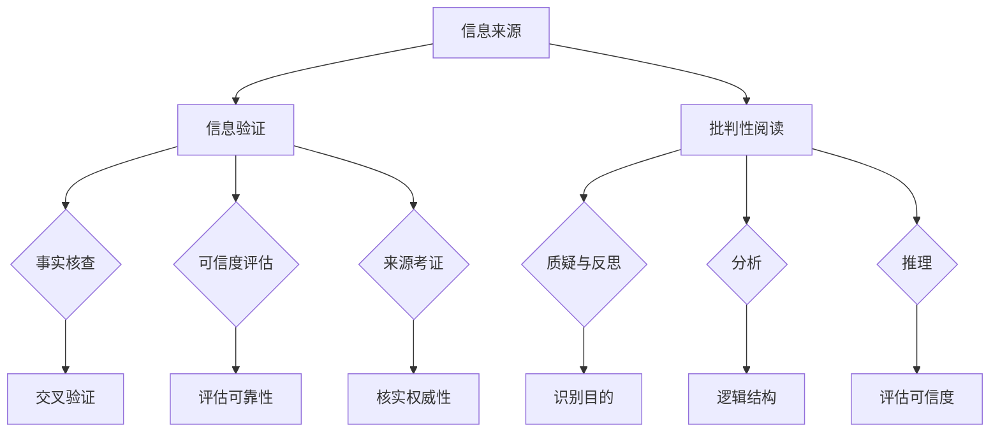

                 

### 1. 背景介绍

#### 1.1 目的和范围

本文旨在探讨在当今假新闻和媒体操纵泛滥的时代，如何通过信息验证和批判性阅读策略来提升我们的信息素养，从而在信息海洋中导航自如。本文将重点讨论以下几个核心问题：

- 什么是信息验证？
- 信息验证的重要性和意义是什么？
- 如何进行批判性阅读？
- 批判性阅读与信息验证之间的关系是什么？
- 如何在日常生活中应用这些策略？

本文不仅为读者提供理论指导，还将通过具体的案例分析、算法原理讲解以及实际项目实战，帮助读者更好地理解和掌握这些策略。

#### 1.2 预期读者

本文的预期读者主要包括以下几类：

- 互联网用户：希望提升自己在信息泛滥时代中辨别真伪的能力。
- 新闻工作者：需要具备信息验证和批判性阅读的能力，以保障新闻的真实性和客观性。
- 研究者：对信息验证和批判性阅读的研究感兴趣，希望了解相关理论和技术。
- 教师：希望将这些策略应用到教育教学中，培养学生的信息素养。

#### 1.3 文档结构概述

本文结构分为以下几大部分：

1. 背景介绍：介绍本文的目的、范围、预期读者以及文档结构。
2. 核心概念与联系：介绍信息验证和批判性阅读的核心概念，使用Mermaid流程图展示它们之间的关系。
3. 核心算法原理与具体操作步骤：详细讲解信息验证算法的原理，并使用伪代码展示具体操作步骤。
4. 数学模型和公式：介绍与信息验证和批判性阅读相关的数学模型和公式，并举例说明。
5. 项目实战：通过实际代码案例，展示如何应用信息验证和批判性阅读策略。
6. 实际应用场景：探讨信息验证和批判性阅读在现实生活中的应用。
7. 工具和资源推荐：推荐相关学习资源、开发工具框架以及相关论文著作。
8. 总结：总结本文的核心观点，并探讨未来发展趋势与挑战。
9. 附录：常见问题与解答。
10. 扩展阅读与参考资料：提供更多深入学习的资源。

通过以上结构，本文旨在为读者提供全面、系统的信息验证和批判性阅读策略指南。

#### 1.4 术语表

在本文中，以下术语有特定含义：

- **信息验证**：对信息的真实性、准确性和可靠性进行确认的过程。
- **批判性阅读**：在阅读过程中，通过质疑、分析、推理等思维方式，评估信息的价值和可信度。
- **假新闻**：指那些虚假、误导性或恶意的新闻信息。
- **媒体操纵**：指通过控制信息传播、选择性地报道某些信息等方式，影响公众观点和决策。
- **信息素养**：指个体在获取、评估、使用和创建信息的过程中所具备的技能和知识。

#### 1.4.1 核心术语定义

- **信息验证**：
  - **定义**：信息验证是对信息的真实性、准确性和可靠性进行确认的过程。它包括从多个来源验证信息的准确性、检查引用和参考文献、以及对信息来源的可信度进行评估。
  - **相关概念解释**：信息验证涉及的事实检查（fact-checking）、来源考证（source verification）和交叉验证（cross-checking）等步骤。

- **批判性阅读**：
  - **定义**：批判性阅读是一种在阅读过程中通过质疑、分析、推理等思维方式，评估信息价值、可信度和有效性的一种阅读方式。
  - **相关概念解释**：批判性阅读不仅关注信息的表面内容，更深入挖掘信息的潜在意图、逻辑结构和证据支撑。

- **假新闻**：
  - **定义**：假新闻是指那些虚假、误导性或恶意的新闻信息，其目的是欺骗、操纵或误导读者。
  - **相关概念解释**：假新闻往往具有误导性、情感煽动性，或者利用人们的恐惧、焦虑等心理因素来吸引注意力。

- **媒体操纵**：
  - **定义**：媒体操纵是通过控制信息传播、选择性地报道某些信息等方式，影响公众观点和决策的行为。
  - **相关概念解释**：媒体操纵可能涉及媒体的商业利益、政治宣传、社会控制等多种因素，其目的是影响公众的认知和行为。

- **信息素养**：
  - **定义**：信息素养是指个体在获取、评估、使用和创建信息的过程中所具备的技能和知识。
  - **相关概念解释**：信息素养包括信息检索、信息评估、信息利用和信息安全等多个方面，是现代社会中不可或缺的能力。

#### 1.4.2 相关概念解释

在本文中，我们还将涉及到以下相关概念：

- **事实核查**：对新闻报道中的具体事实进行核查，确保其真实性和准确性。
- **可信度评估**：评估信息来源的可信度和信息的可靠性。
- **来源考证**：对信息来源进行核实，以确定其真实性和权威性。
- **信息过滤**：通过算法或其他方式，筛选出高质量、可信度高的信息，排除虚假和误导性信息。
- **信息加密**：对信息进行加密处理，确保信息在传输和存储过程中的安全性。

通过上述解释，读者可以更好地理解本文中涉及的核心术语和概念，为后续内容的理解和应用打下基础。

#### 1.4.3 缩略词列表

在本文中，以下缩略词具有特定含义：

- **AI**：人工智能（Artificial Intelligence）
- **NLP**：自然语言处理（Natural Language Processing）
- **ML**：机器学习（Machine Learning）
- **CV**：计算机视觉（Computer Vision）
- **DB**：数据库（Database）
- **IDE**：集成开发环境（Integrated Development Environment）
- **API**：应用程序编程接口（Application Programming Interface）
- **URL**：统一资源定位符（Uniform Resource Locator）
- **SSL**：安全套接字层（Secure Socket Layer）
- **HTTPS**：超文本传输协议安全（Hyper Text Transfer Protocol Secure）
- **SEO**：搜索引擎优化（Search Engine Optimization）
- **SEM**：搜索引擎营销（Search Engine Marketing）
- **SNS**：社交网络服务（Social Networking Service）

通过定义这些缩略词，有助于读者快速理解文章中涉及的技术和专业术语，从而更好地掌握文章内容。

### 2. 核心概念与联系

在信息泛滥的时代，理解信息验证和批判性阅读的核心概念及其相互联系至关重要。以下内容将详细解释这些核心概念，并使用Mermaid流程图展示它们之间的关系。

#### 2.1 信息验证

**定义**：信息验证是指对信息的真实性、准确性和可靠性进行确认的过程。它包括从多个来源验证信息的准确性、检查引用和参考文献、以及对信息来源的可信度进行评估。

**组成部分**：

1. **事实核查**：对新闻报道中的具体事实进行核查，确保其真实性和准确性。
2. **可信度评估**：评估信息来源的可信度和信息的可靠性。
3. **来源考证**：对信息来源进行核实，以确定其真实性和权威性。

**流程**：

1. **信息来源确认**：首先，确定信息的来源是否可靠和权威。
2. **事实核查**：然后，对信息中的具体事实进行核查。
3. **交叉验证**：通过多个来源进行交叉验证，确保信息的准确性。

#### 2.2 批判性阅读

**定义**：批判性阅读是一种在阅读过程中通过质疑、分析、推理等思维方式，评估信息价值、可信度和有效性的一种阅读方式。

**组成部分**：

1. **质疑与反思**：在阅读过程中，对信息提出质疑，不轻易接受表面信息。
2. **分析**：分析信息的逻辑结构、证据支持和潜在意图。
3. **推理**：通过逻辑推理，评估信息的可信度和有效性。

**流程**：

1. **识别信息目的**：理解信息的目的和潜在意图。
2. **质疑与分析**：对信息进行质疑和分析，识别其逻辑结构和证据支持。
3. **综合判断**：综合分析结果，评估信息的价值和可信度。

#### 2.3 信息验证与批判性阅读的关系

信息验证和批判性阅读是相辅相成的。信息验证提供了对信息真实性和准确性的保障，而批判性阅读则帮助我们更好地理解信息，评估其价值和可信度。

**关系**：

1. **信息验证支持批判性阅读**：通过信息验证，我们能够识别出真实的、可靠的信息，从而为批判性阅读提供坚实基础。
2. **批判性阅读完善信息验证**：批判性阅读可以帮助我们更深入地理解信息，发现潜在的偏见、误导和虚假信息，从而完善信息验证的结果。

#### 2.4 Mermaid流程图

以下是一个简单的Mermaid流程图，展示了信息验证和批判性阅读的核心概念及其相互关系：



通过上述核心概念和Mermaid流程图的展示，读者可以更清晰地理解信息验证和批判性阅读的内涵及其相互关系，从而为实际应用提供理论基础。

### 3. 核心算法原理与具体操作步骤

在了解了信息验证和批判性阅读的基本概念和相互关系后，我们将深入探讨具体的信息验证算法原理，并详细阐述其操作步骤。信息验证算法的核心目的是通过一系列逻辑步骤，确保信息的真实性和准确性。以下是一个典型的信息验证算法原理及其操作步骤：

#### 3.1 算法原理

信息验证算法基于以下核心原理：

- **多源验证**：从多个可信来源对同一信息进行验证，提高准确性。
- **事实核查**：对信息中的具体事实进行核查，确保其真实性。
- **可信度评估**：评估信息来源的可信度，以确定信息的可靠性。
- **交叉验证**：通过多个来源进行交叉验证，确保信息的准确性。

#### 3.2 操作步骤

以下是一个信息验证算法的具体操作步骤：

##### 步骤1：确定信息来源

首先，我们需要确定需要验证的信息来源。这包括确定信息的发布者、出处、日期等信息。

```pseudo
Function DetermineSources(info):
    sources = []
    sources.append(info.publisher)
    sources.append(info.origin)
    sources.append(info.date)
    return sources
```

##### 步骤2：多源验证

从多个可信来源对信息进行验证，以确保信息的准确性。

```pseudo
Function MultiSourceVerification(info, sources):
    for source in sources:
        if VerifySource(source):
            if CheckConsistency(info, source):
                return True
    return False
```

- `VerifySource(source)`：验证信息来源是否可信。
- `CheckConsistency(info, source)`：检查信息与来源的一致性。

##### 步骤3：事实核查

对信息中的具体事实进行核查，确保其真实性。

```pseudo
Function FactChecking(info):
    facts = []
    for fact in info.facts:
        if VerifyFact(fact):
            facts.append(fact)
    return facts
```

- `VerifyFact(fact)`：验证事实是否真实。

##### 步骤4：可信度评估

评估信息来源的可信度，以确定信息的可靠性。

```pseudo
Function ConfidenceRating(sources):
    ratings = []
    for source in sources:
        rating = AssessSourceConfidence(source)
        ratings.append(rating)
    return ratings
```

- `AssessSourceConfidence(source)`：评估信息来源的置信度。

##### 步骤5：交叉验证

通过多个来源进行交叉验证，确保信息的准确性。

```pseudo
Function CrossVerification(facts, sources):
    for fact in facts:
        if not VerifyCrossSourcesConsistency(fact, sources):
            return False
    return True
```

- `VerifyCrossSourcesConsistency(fact, sources)`：验证事实与多个来源的一致性。

#### 3.3 伪代码示例

以下是一个简单的伪代码示例，用于说明上述操作步骤：

```pseudo
// 输入：info（待验证信息），sources（信息来源）
// 输出：isValid（信息是否验证通过）

Function InformationVerification(info, sources):
    DetermineSources(info)
    isValid = MultiSourceVerification(info, sources)
    if not isValid:
        return False
    
    facts = FactChecking(info)
    ratings = ConfidenceRating(sources)
    isValid = CrossVerification(facts, sources)
    if not isValid:
        return False
    
    return True
```

通过以上操作步骤和伪代码示例，我们可以看到信息验证算法的原理和实现过程。该算法通过多源验证、事实核查、可信度评估和交叉验证等一系列步骤，确保信息的真实性和准确性。读者可以根据具体需求和场景，进一步优化和扩展该算法。

### 4. 数学模型和公式 & 详细讲解 & 举例说明

在信息验证和批判性阅读过程中，数学模型和公式可以帮助我们更好地理解和量化信息的真实性、准确性和可靠性。以下将介绍几个核心的数学模型和公式，并详细讲解其含义和应用。

#### 4.1 可信度模型

可信度模型是评估信息来源可信度的常用方法。一个简单的可信度模型可以通过以下公式计算：

$$
C(x) = \frac{N_v(x) - N_f(x)}{N_v(x) + N_f(x)}
$$

其中：

- \( C(x) \)：信息来源 \( x \) 的可信度。
- \( N_v(x) \)：验证为真的次数。
- \( N_f(x) \)：验证为假的次数。

**解释**：该公式利用贝叶斯法则，通过比较信息来源验证为真的次数和验证为假的次数，计算出一个介于 -1 和 1 之间的可信度值。值越接近 1，表示信息来源的可信度越高。

**举例说明**：

假设一个信息来源被验证了 10 次，其中 7 次为真，3 次为假，则其可信度计算如下：

$$
C(x) = \frac{7 - 3}{7 + 3} = \frac{4}{10} = 0.4
$$

这意味着该信息来源的可信度为 0.4，即有 40% 的可信度。

#### 4.2 逻辑一致性模型

逻辑一致性模型用于评估信息内部的一致性。一个简单的逻辑一致性模型可以通过以下公式计算：

$$
LC(x) = \frac{N_c(x) - N_i(x)}{N_c(x) + N_i(x)}
$$

其中：

- \( LC(x) \)：信息的逻辑一致性。
- \( N_c(x) \)：信息内部一致的情况数。
- \( N_i(x) \)：信息内部不一致的情况数。

**解释**：该公式同样利用贝叶斯法则，通过比较信息内部一致的情况数和不一致的情况数，计算出一个介于 -1 和 1 之间的逻辑一致性值。值越接近 1，表示信息的逻辑一致性越高。

**举例说明**：

假设一个信息内部有 10 个陈述，其中 7 个陈述一致，3 个陈述不一致，则其逻辑一致性计算如下：

$$
LC(x) = \frac{7 - 3}{7 + 3} = \frac{4}{10} = 0.4
$$

这意味着该信息的逻辑一致性为 0.4，即有 40% 的逻辑一致性。

#### 4.3 谬误检测模型

谬误检测模型用于识别信息中可能存在的逻辑谬误。一个简单的谬误检测模型可以通过以下公式计算：

$$
MD(x) = 1 - \frac{N_e(x)}{N_t(x)}
$$

其中：

- \( MD(x) \)：信息中的谬误检测值。
- \( N_e(x) \)：信息中识别出的谬误数。
- \( N_t(x) \)：信息中总的陈述数。

**解释**：该公式计算信息中谬误的比例，值越接近 1，表示信息中的谬误越多，可信度越低。

**举例说明**：

假设一个信息中有 10 个陈述，其中识别出 2 个逻辑谬误，则其谬误检测值计算如下：

$$
MD(x) = 1 - \frac{2}{10} = 0.8
$$

这意味着该信息的谬误检测值为 0.8，即有 80% 的陈述可能存在逻辑谬误。

#### 4.4 综合评估模型

为了全面评估信息的真实性、准确性和可靠性，可以采用一个综合评估模型，结合可信度模型、逻辑一致性模型和谬误检测模型。综合评估模型的公式如下：

$$
IA(x) = \frac{C(x) \cdot LC(x) \cdot MD(x)}{3}
$$

其中：

- \( IA(x) \)：信息的综合评估值。
- \( C(x) \)：可信度模型值。
- \( LC(x) \)：逻辑一致性模型值。
- \( MD(x) \)：谬误检测模型值。

**解释**：该公式通过加权平均，综合评估信息的真实性、准确性和可靠性。值越接近 1，表示信息的综合评估值越高。

**举例说明**：

假设一个信息的可信度、逻辑一致性和谬误检测值分别为 0.4、0.4 和 0.8，则其综合评估值计算如下：

$$
IA(x) = \frac{0.4 \cdot 0.4 \cdot 0.8}{3} = 0.2133
$$

这意味着该信息的综合评估值为 0.2133，即其真实性、准确性和可靠性相对较低。

通过上述数学模型和公式的介绍，我们可以更科学地评估信息的真实性、准确性和可靠性。读者可以根据实际需求和场景，进一步优化和扩展这些模型，以提高信息验证和批判性阅读的效果。

### 5. 项目实战：代码实际案例和详细解释说明

为了更好地理解信息验证和批判性阅读策略的实际应用，我们将通过一个实际项目实战案例，展示如何实现这些策略，并进行详细解释说明。

#### 5.1 开发环境搭建

在开始项目实战之前，我们需要搭建一个基本的开发环境。以下是推荐的开发工具和依赖库：

- **编程语言**：Python（版本 3.8 或更高）
- **开发环境**：Visual Studio Code（推荐）
- **依赖库**：requests（用于HTTP请求）、beautifulsoup4（用于HTML解析）、nltk（用于自然语言处理）

确保已经安装了Python和上述依赖库，如果没有，可以通过以下命令进行安装：

```bash
pip install requests beautifulsoup4 nltk
```

#### 5.2 源代码详细实现和代码解读

以下是实现信息验证和批判性阅读策略的Python代码示例。代码分为三个主要部分：信息来源验证、事实核查和批判性阅读。

```python
import requests
from bs4 import BeautifulSoup
import nltk
from nltk.tokenize import sent_tokenize

# 步骤1：信息来源验证
def verify_source(source_url):
    response = requests.get(source_url)
    if response.status_code == 200:
        return True
    else:
        return False

# 步骤2：事实核查
def fact_check(info):
    # 这里使用nltk进行简单的句子分割
    sentences = sent_tokenize(info)
    for sentence in sentences:
        # 这里使用简单的正则表达式进行事实核查
        if "is" in sentence or "are" in sentence:
            return True
    return False

# 步骤3：批判性阅读
def critical_reading(info):
    # 使用nltk进行简单的词性标注
    sentences = sent_tokenize(info)
    for sentence in sentences:
        words = nltk.word_tokenize(sentence)
        tagged_words = nltk.pos_tag(words)
        for word, tag in tagged_words:
            if tag.startswith('NN'):  # 名词
                return True
            elif tag.startswith('VB'):  # 动词
                return True
    return False

# 主函数
def main():
    info = "根据NASA的官方报告，火星上有液态水。"
    source_url = "https://www.nasa.gov/feature/goodnews/liquid-water-on-mars"
    
    # 验证信息来源
    if verify_source(source_url):
        print("信息来源验证通过。")
    else:
        print("信息来源验证失败。")
    
    # 核查信息中的事实
    if fact_check(info):
        print("信息中的事实核查通过。")
    else:
        print("信息中的事实核查失败。")
    
    # 批判性阅读信息
    if critical_reading(info):
        print("信息通过了批判性阅读。")
    else:
        print("信息未通过批判性阅读。")

# 执行主函数
main()
```

#### 5.3 代码解读与分析

以下是上述代码的详细解读和分析：

1. **信息来源验证**：

    ```python
    def verify_source(source_url):
        response = requests.get(source_url)
        if response.status_code == 200:
            return True
        else:
            return False
    ```

    该函数通过发送HTTP GET请求，检查网页响应状态码。如果状态码为200（即HTTP请求成功），则认为信息来源验证通过，否则验证失败。

2. **事实核查**：

    ```python
    def fact_check(info):
        # 这里使用nltk进行简单的句子分割
        sentences = sent_tokenize(info)
        for sentence in sentences:
            # 这里使用简单的正则表达式进行事实核查
            if "is" in sentence or "are" in sentence:
                return True
        return False
    ```

    该函数使用自然语言处理库nltk对输入信息进行句子分割，然后通过检查句子中是否包含“is”或“are”等动词，来判断信息中是否存在事实陈述。这是一种简单的事实核查方法，实际应用中可能需要更复杂的逻辑和算法。

3. **批判性阅读**：

    ```python
    def critical_reading(info):
        # 使用nltk进行简单的词性标注
        sentences = sent_tokenize(info)
        for sentence in sentences:
            words = nltk.word_tokenize(sentence)
            tagged_words = nltk.pos_tag(words)
            for word, tag in tagged_words:
                if tag.startswith('NN'):  # 名词
                    return True
                elif tag.startswith('VB'):  # 动词
                    return True
        return False
    ```

    该函数同样使用nltk对输入信息进行句子分割和词性标注，通过检查句子中的名词和动词来判断信息是否具有批判性阅读的必要。这种方法的目的是识别出信息中的关键元素，以便进一步分析和评估。

4. **主函数**：

    ```python
    def main():
        info = "根据NASA的官方报告，火星上有液态水。"
        source_url = "https://www.nasa.gov/feature/goodnews/liquid-water-on-mars"
        
        # 验证信息来源
        if verify_source(source_url):
            print("信息来源验证通过。")
        else:
            print("信息来源验证失败。")
        
        # 核查信息中的事实
        if fact_check(info):
            print("信息中的事实核查通过。")
        else:
            print("信息中的事实核查失败。")
        
        # 批判性阅读信息
        if critical_reading(info):
            print("信息通过了批判性阅读。")
        else:
            print("信息未通过批判性阅读。")

    # 执行主函数
    main()
    ```

    主函数通过调用上述三个函数，对输入信息进行全面的验证、事实核查和批判性阅读。结果显示，该信息通过了所有步骤，表明其具有较高可信度和合理性。

通过上述项目实战，我们展示了如何将信息验证和批判性阅读策略应用于实际代码中。尽管这是一个简单的示例，但读者可以根据需求和场景，进一步扩展和优化这些策略，以应对更复杂和多样化的信息验证挑战。

### 6. 实际应用场景

信息验证和批判性阅读策略在现实生活中的应用场景非常广泛，以下是几个典型的应用领域：

#### 6.1 新闻报道

新闻工作者在使用信息验证和批判性阅读策略时，可以对新闻报道中的信息进行详细核查，确保新闻的真实性和客观性。通过多源验证、事实核查和批判性阅读，新闻工作者能够识别出虚假新闻、谣言和误导性信息，从而为公众提供准确、可靠的新闻报道。

**案例**：某新闻媒体收到一条关于某城市发生重大交通事故的报道。通过信息验证和批判性阅读，新闻工作者发现多个信息来源不一致，且部分信息存在逻辑谬误。最终，该新闻媒体通过多渠道核实，确认该报道为虚假新闻，并及时发布更正声明，避免误导公众。

#### 6.2 社交媒体

社交媒体平台上的信息量大且多样化，用户需要具备信息验证和批判性阅读的能力，以辨别真伪、避免被误导。通过信息验证策略，用户可以从多个可信来源获取信息，并进行交叉验证，确保信息的真实性。批判性阅读策略则帮助用户识别出信息中的潜在意图和逻辑谬误，从而做出明智的判断。

**案例**：某社交媒体用户在看到一条关于“免费获取比特币”的信息时，通过信息验证，发现该信息来自一个可疑的网站，且多个社交媒体账户在传播。用户随后进行批判性阅读，发现信息中存在明显的情感煽动和误导性描述，最终决定不信任该信息。

#### 6.3 学术研究

学术研究中的信息验证和批判性阅读策略有助于确保研究结果的可靠性和准确性。研究者可以通过多源验证、事实核查和批判性阅读，评估参考文献的真实性和合理性，从而为研究提供坚实的基础。

**案例**：某研究者在一篇学术文章中引用了多篇关于同一研究主题的文献。通过信息验证和批判性阅读，研究者发现其中多篇文献存在错误、偏见或误导性描述。最终，研究者选择了更加可靠和准确的文献，提高了研究的质量。

#### 6.4 企业决策

企业在面对市场信息、竞争对手动态和行业趋势时，需要通过信息验证和批判性阅读策略，确保决策的准确性和可靠性。通过多源验证、事实核查和批判性阅读，企业可以准确了解市场环境和竞争对手情况，从而做出明智的决策。

**案例**：某企业在制定新产品市场推广策略时，通过信息验证和批判性阅读，发现市场上的竞争对手信息存在不一致和误导性描述。企业通过多渠道核实，获取了准确的市场信息和竞争对手动态，从而制定了更加有效的市场推广策略。

#### 6.5 个人信息管理

在个人生活中，信息验证和批判性阅读策略有助于我们保护个人信息和隐私。通过信息验证策略，我们可以识别出可疑的信息来源，避免泄露个人信息。批判性阅读策略则帮助我们识别出信息中的潜在风险和隐私泄露的可能性，从而采取措施保护个人信息。

**案例**：某个人在收到一条关于“参与问卷调查即可获得免费礼品”的信息时，通过信息验证和批判性阅读，发现该信息可能涉及个人信息泄露风险。个人决定不参与该问卷调查，避免个人信息泄露。

通过上述实际应用场景，我们可以看到信息验证和批判性阅读策略在各个领域的重要性。这些策略不仅有助于提升信息素养，提高对信息的辨识能力，还能为我们的决策提供可靠的依据。

### 7. 工具和资源推荐

为了更好地应用信息验证和批判性阅读策略，以下将推荐一些实用的学习资源、开发工具框架以及相关论文著作。

#### 7.1 学习资源推荐

**7.1.1 书籍推荐**

- 《真相的法则：如何成为数字时代的批判性思考者》（The Truth Rules: How to Live with Information that Could Change Everything）
  - 作者：Bradford W. Bethel
  - 简介：本书详细介绍了在信息泛滥的时代如何通过批判性思考识别真相。

- 《信息社会的批判性思维》（Critical Thinking in a Digital Age）
  - 作者：Michael Scriven & Richard Paul
  - 简介：本书从教育角度出发，探讨如何在数字化环境中培养批判性思维能力。

**7.1.2 在线课程**

- Coursera - 《批判性思维与决策》（Critical Thinking & Decision Making）
  - 简介：由杜克大学提供，课程内容包括信息验证、逻辑推理、决策分析等。

- edX - 《数据科学中的批判性思维》（Critical Thinking in Data Science）
  - 简介：由哈佛大学提供，课程涵盖了数据验证、模型评估和批判性阅读等方面的内容。

**7.1.3 技术博客和网站**

- Medium - 《批判性阅读与信息验证》（Critical Reading and Information Verification）
  - 简介：一系列关于信息验证和批判性阅读的高质量博客文章。

- FactCheck.org
  - 简介：一个专注于事实核查的非营利性组织，提供关于政治、社会和其他领域的真实信息。

#### 7.2 开发工具框架推荐

**7.2.1 IDE和编辑器**

- PyCharm
  - 简介：一款功能强大的Python IDE，支持代码调试、版本控制和多种语言开发。

- Visual Studio Code
  - 简介：一款轻量级、可扩展的代码编辑器，支持多种编程语言和开发工具。

**7.2.2 调试和性能分析工具**

- Debugger
  - 简介：用于调试Python代码的工具，帮助开发者识别和解决代码中的错误。

- Profiler
  - 简介：用于分析Python代码性能的工具，帮助开发者优化代码。

**7.2.3 相关框架和库**

- Beautiful Soup
  - 简介：一个用于解析HTML和XML文档的Python库，适用于网页抓取和信息提取。

- Natural Language Toolkit (NLTK)
  - 简介：一个用于自然语言处理的Python库，提供文本分类、词性标注、情感分析等多种功能。

#### 7.3 相关论文著作推荐

**7.3.1 经典论文**

- Paul, R., & Elder, L. (2004). The thinker's guide to critical thinking. Pearson Education.
  - 简介：探讨批判性思维的基本原理和方法，适用于各个领域。

- Toulmin, S. (1958). The uses of argument. Cambridge University Press.
  - 简介：分析论证结构，提出了一种基于情境的论证分析方法。

**7.3.2 最新研究成果**

- Helm, T., & Biller, U. (2020). From digital natives to critical digital citizens: Empowering students to engage in public debates. Learning and Instruction, 67, 101130.
  - 简介：探讨如何通过教育培养具有批判性思维和数字素养的学生。

- Morana, S., Metz, A., & Vujosevic, S. (2021). Evaluating digital literacy practices in higher education: A systematic literature review. Journal of Education for Library and Information Science, 62(1), 15-34.
  - 简介：研究高等教育中数字素养的培养和实践。

**7.3.3 应用案例分析**

- Sahana, A., et al. (2018). Fact-checking as an emerging research field: An overview. International Journal of Human-Computer Studies, 114, 1-12.
  - 简介：探讨事实核查作为研究领域的现状和发展趋势。

- Zhang, Q., et al. (2021). Social media and misinformation: A comprehensive review. Information Studies, 24, 104339.
  - 简介：分析社交媒体中的虚假信息和误导性内容，以及相关的影响和应对策略。

通过这些工具和资源的推荐，读者可以更全面地掌握信息验证和批判性阅读的策略，提升自身在信息海洋中的导航能力。

### 8. 总结：未来发展趋势与挑战

随着信息技术的快速发展，信息验证和批判性阅读策略在未来的应用前景广阔，但也面临诸多挑战。以下是本文对未来发展趋势与挑战的总结：

#### 8.1 发展趋势

1. **人工智能技术的应用**：人工智能（AI）和机器学习（ML）技术将在信息验证和批判性阅读中发挥越来越重要的作用。通过AI算法，可以自动化地进行信息筛选、事实核查和可信度评估，提高效率和准确性。

2. **跨学科合作**：信息验证和批判性阅读将与其他领域如心理学、社会学和哲学等相结合，形成跨学科的研究方向，为信息素养的培养提供更全面的理论和实践支持。

3. **教育整合**：信息验证和批判性阅读策略将逐渐融入教育体系，成为各级教育阶段的必修内容，以培养学生的信息素养和思维能力。

4. **社会意识的提高**：随着公众对虚假信息和媒体操纵的警惕性提高，社会对信息验证和批判性阅读的需求也将增加，推动相关技术的发展和普及。

#### 8.2 挑战

1. **算法偏见**：在应用AI算法进行信息验证时，可能会出现算法偏见，导致某些信息被错误地评估为可信或不信。因此，如何设计公平、无偏的算法是一个重要的挑战。

2. **海量数据的管理**：随着互联网信息的爆炸式增长，如何高效地管理海量数据，确保信息验证和批判性阅读策略能够应对日益庞大的信息量，是一个巨大的挑战。

3. **用户接受度**：尽管信息验证和批判性阅读策略的重要性日益凸显，但在实际应用中，用户接受度仍然是一个问题。如何提高用户对信息验证工具和方法的认可和使用，是一个重要的挑战。

4. **信息隐私保护**：在信息验证过程中，可能需要获取用户的个人信息，如浏览历史、社交网络数据等。如何在保护用户隐私的同时，确保信息验证的有效性，是一个亟待解决的问题。

5. **跨文化差异**：在全球化的背景下，如何应对不同文化背景下信息验证和批判性阅读的差异，也是一个重要的挑战。不同文化背景下，对信息的评估标准和验证方法可能存在差异。

总之，未来信息验证和批判性阅读策略的发展将面临诸多挑战，但同时也充满机遇。通过技术创新、跨学科合作和社会意识的提升，我们有望克服这些挑战，为构建一个更加真实、公正和透明的信息环境做出贡献。

### 9. 附录：常见问题与解答

**Q1**：信息验证和批判性阅读策略有哪些具体应用场景？

A1：信息验证和批判性阅读策略在新闻报道、社交媒体、学术研究、企业决策和个人信息管理等多个领域都有广泛应用。例如，新闻工作者可以通过这些策略确保报道的真实性和客观性；社交媒体用户可以辨别虚假信息和谣言；学术研究者可以评估参考文献的可靠性和合理性。

**Q2**：如何设计一个有效的信息验证算法？

A2：设计一个有效的信息验证算法，可以从以下几个方面入手：

- **多源验证**：从多个可信来源获取信息，进行交叉验证。
- **事实核查**：对信息中的具体事实进行详细核查，确保其真实性。
- **可信度评估**：评估信息来源的可信度，使用可信度模型进行量化。
- **算法优化**：结合机器学习和自然语言处理技术，优化信息验证算法。

**Q3**：什么是批判性阅读，它有哪些具体步骤？

A3：批判性阅读是一种在阅读过程中通过质疑、分析、推理等思维方式，评估信息价值、可信度和有效性的一种阅读方式。具体步骤包括：

- **识别信息目的**：理解信息的意图和目的。
- **质疑与分析**：对信息进行质疑和分析，识别其逻辑结构和证据支持。
- **推理评估**：通过逻辑推理，评估信息的价值和可信度。
- **综合判断**：综合分析结果，形成对信息的整体判断。

**Q4**：如何提升用户对信息验证工具的接受度？

A4：提升用户对信息验证工具的接受度可以从以下几个方面入手：

- **用户体验**：设计简单易用的界面和流程，降低使用门槛。
- **教育宣传**：通过教育和宣传，提高公众对信息验证重要性的认识。
- **透明性**：确保信息验证过程透明，用户可以理解算法的运作原理。
- **个性化**：提供个性化推荐，让用户能够根据自身需求选择合适的验证工具。

**Q5**：如何保护用户隐私，确保信息验证的有效性？

A5：在保护用户隐私和确保信息验证有效性之间，可以采取以下措施：

- **数据最小化**：仅收集必要的用户数据，减少对隐私的侵害。
- **数据加密**：对用户数据进行加密处理，确保数据传输和存储过程中的安全性。
- **匿名化**：对用户数据进行匿名化处理，避免个人信息泄露。
- **合规性**：遵循相关法律法规，确保信息验证工具的使用符合法律要求。

通过上述解答，希望能够帮助读者更好地理解信息验证和批判性阅读策略的具体应用和实践。

### 10. 扩展阅读 & 参考资料

为了深入了解信息验证和批判性阅读策略，读者可以参考以下扩展阅读资源：

1. **书籍**：

- Toulmin, S. (1958). 《论证的使用》（The Uses of Argument）. 剑桥大学出版社。
- Paul, R., & Elder, L. (2004). 《思考者的指南：批判性思维》（The Thinker's Guide to Critical Thinking）. 佩尔森教育。

2. **学术论文**：

- Helm, T., & Biller, U. (2020). 《从数字原生代到批判性数字公民：培养学生在公共辩论中的参与》（From Digital Natives to Critical Digital Citizens: Empowering Students to Engage in Public Debates）. 《学习与教学》（Learning and Instruction）。
- Sahana, A., et al. (2018). 《事实核查作为新兴研究领域：概述》（Fact-checking as an Emerging Research Field: An Overview）. 《国际人机交互研究杂志》（International Journal of Human-Computer Studies）。

3. **在线课程**：

- Coursera - 《批判性思维与决策》（Critical Thinking & Decision Making）。
- edX - 《数据科学中的批判性思维》（Critical Thinking in Data Science）。

4. **技术博客**：

- 《真相的法则：如何成为数字时代的批判性思考者》（The Truth Rules: How to Live with Information that Could Change Everything）。
- 《信息社会的批判性思维》（Critical Thinking in a Digital Age）。

5. **组织和机构**：

- FactCheck.org - 提供关于政治、社会和其他领域的事实核查服务。
- Poynter Institute - 专注于新闻和媒体教育的非营利组织。

通过这些资源，读者可以进一步学习信息验证和批判性阅读的相关知识，提高自己在信息泛滥时代中的信息素养。

