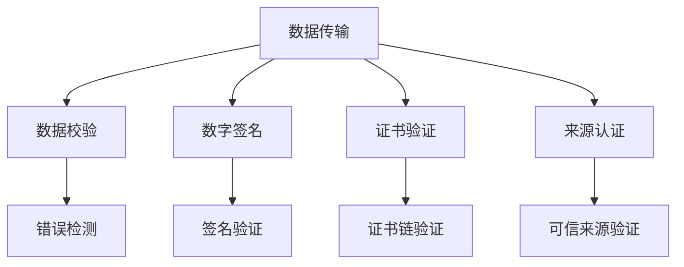
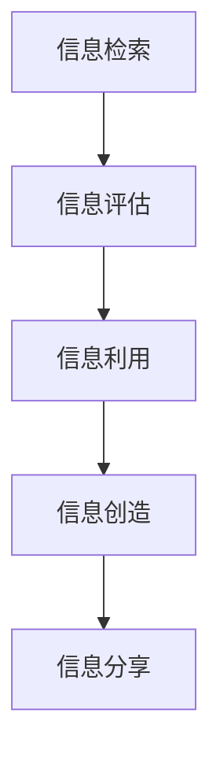
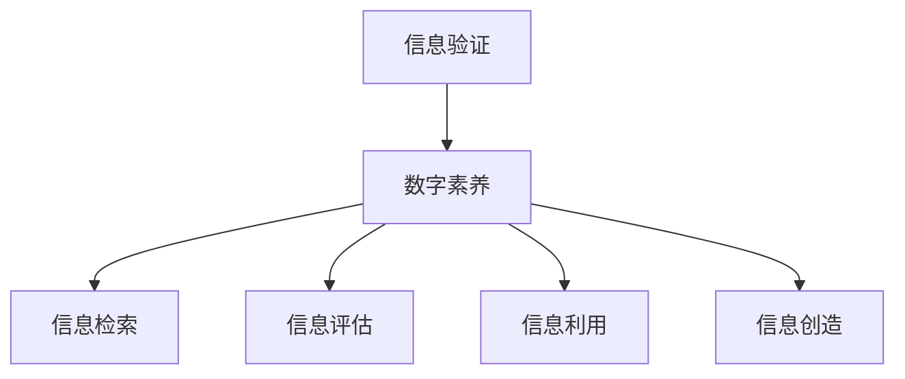

                 

# 信息验证和数字素养技能：为信息时代培养信息素养和批判性思维能力

> **关键词**：信息验证、数字素养、批判性思维、信息时代、数据安全、隐私保护

> **摘要**：在信息爆炸的时代，信息的准确性和可靠性变得尤为重要。本文将深入探讨信息验证和数字素养技能的重要性，以及如何培养用户的批判性思维能力。我们将分析信息验证的方法和工具，介绍数字素养的核心概念，并通过具体的案例来展示如何在实际项目中应用这些技能。最终，我们还将讨论未来发展趋势与挑战，为读者提供全面的指导和资源推荐。

## 1. 背景介绍

### 1.1 目的和范围

本文旨在探讨信息验证和数字素养技能在信息时代的重要性，并为其提供有效的培养方法。随着互联网的普及和数据量的激增，用户面临着前所未有的信息挑战。如何在海量信息中辨别真伪、保护个人隐私、培养批判性思维成为当今信息时代的核心问题。

### 1.2 预期读者

本文适合以下读者：

- 计算机科学、信息技术等相关专业的学生和教师
- 信息安全、数据保护等相关领域的从业者
- 对数字素养和信息验证感兴趣的个人和学者
- 广泛关注信息安全、隐私保护和数据管理的公众

### 1.3 文档结构概述

本文分为以下十个部分：

1. **背景介绍**：介绍文章的目的、预期读者和文档结构。
2. **核心概念与联系**：阐述信息验证和数字素养的核心概念及其相互关系。
3. **核心算法原理 & 具体操作步骤**：详细讲解信息验证的算法原理和具体实现步骤。
4. **数学模型和公式 & 详细讲解 & 举例说明**：介绍信息验证相关的数学模型和公式，并通过案例进行详细说明。
5. **项目实战：代码实际案例和详细解释说明**：展示如何在实际项目中应用信息验证和数字素养技能。
6. **实际应用场景**：探讨信息验证和数字素养技能在各个领域中的应用。
7. **工具和资源推荐**：推荐学习资源、开发工具框架和相关论文著作。
8. **总结：未来发展趋势与挑战**：总结文章要点，展望未来发展趋势和挑战。
9. **附录：常见问题与解答**：回答读者可能关心的问题。
10. **扩展阅读 & 参考资料**：提供更多的扩展阅读和参考资料。

### 1.4 术语表

#### 1.4.1 核心术语定义

- **信息验证**：对信息的准确性、可靠性、合法性和完整性进行验证的过程。
- **数字素养**：在数字环境中获取、评估、使用和创造信息的能力。
- **批判性思维**：对信息进行深入思考、分析、评估和推理的能力。

#### 1.4.2 相关概念解释

- **数据安全**：保护数据免受未经授权的访问、使用、披露、破坏、修改或破坏。
- **隐私保护**：确保个人隐私不受侵犯，防止个人信息被不当使用。

#### 1.4.3 缩略词列表

- **IoT**：物联网
- **AI**：人工智能
- **ML**：机器学习
- **DL**：深度学习
- **PKI**：公钥基础设施

## 2. 核心概念与联系

在信息时代，信息验证和数字素养技能是用户应对信息挑战的基石。为了更好地理解这两个核心概念，我们首先需要明确它们的基本原理和相互关系。

### 2.1 信息验证原理

信息验证是指对信息的准确性、可靠性、合法性和完整性进行验证的过程。其核心在于确保信息的真实性和有效性。信息验证的方法主要包括以下几个方面：

1. **数据校验**：通过校验码、校验和等方法检测数据传输过程中的错误。
2. **数字签名**：利用公钥加密技术验证信息的真实性和完整性。
3. **证书验证**：通过证书链验证数字证书的合法性。
4. **来源认证**：确保信息来源于可信的来源。

下面是信息验证的基本原理流程图：



### 2.2 数字素养技能

数字素养是指用户在数字环境中获取、评估、使用和创造信息的能力。数字素养的核心包括以下几个方面：

1. **信息检索**：利用搜索引擎、数据库等工具快速获取所需信息。
2. **信息评估**：对获取的信息进行真实性、可靠性、价值和相关性的评估。
3. **信息利用**：利用信息进行决策、解决问题和创造价值。
4. **信息创造**：在数字环境中创造、分享和传播信息。

下面是数字素养技能的基本流程图：



### 2.3 信息验证与数字素养的关系

信息验证和数字素养技能之间有着密切的联系。信息验证是数字素养的基础，它为用户提供了可靠的信息来源，保证了信息的真实性。而数字素养则是信息验证的延伸，它使用户能够有效利用信息，创造价值，并在数字环境中做出明智的决策。

信息验证和数字素养的关系图如下：



通过以上分析，我们可以看到，信息验证和数字素养技能在信息时代的重要性不言而喻。只有通过有效的信息验证，用户才能获得真实可靠的信息；只有通过数字素养技能的培养，用户才能在数字环境中自如应对各种挑战。

## 3. 核心算法原理 & 具体操作步骤

为了深入了解信息验证的过程，我们需要掌握一些核心算法原理。以下我们将详细介绍几种常见的信息验证算法，并给出具体操作步骤。

### 3.1 数据校验算法

数据校验算法是检测数据传输过程中错误的基本方法。常用的数据校验算法包括校验和、校验码等。以下是一个简单的数据校验算法示例：

```python
# 假设数据为 binary 数据，数据长度为 n
def calculate_checksum(data, n):
    checksum = 0
    for i in range(n):
        checksum += data[i]
    return checksum % 256

# 数据接收方使用校验和验证数据
def verify_checksum(data, n, checksum):
    calculated_checksum = calculate_checksum(data, n)
    return calculated_checksum == checksum
```

### 3.2 数字签名算法

数字签名是一种确保信息真实性和完整性的方法。以下是一个简单的数字签名算法示例：

```python
from cryptography.hazmat.primitives import hashes
from cryptography.hazmat.primitives.asymmetric import padding

# 假设 Alice 想要向 Bob 发送加密信息
def sign_message(message, private_key):
    signature = private_key.sign(
        message,
        padding.PSS(
            mgf=padding.MGF1(hashes.SHA256()),
            salt_length=padding.PSS.MAX_LENGTH
        ),
        hashes.SHA256()
    )
    return signature

# Bob 收到信息后，使用 Alice 的公钥验证签名
def verify_signature(message, public_key, signature):
    try:
        public_key.verify(
            signature,
            message,
            padding.PSS(
                mgf=padding.MGF1(hashes.SHA256()),
                salt_length=padding.PSS.MAX_LENGTH
            ),
            hashes.SHA256()
        )
        return True
    except:
        return False
```

### 3.3 证书验证算法

证书验证是一种确保数字证书合法性的方法。以下是一个简单的证书验证算法示例：

```python
from cryptography import x509
from cryptography.x509.oid import ExtensionOID
from cryptography.hazmat.backends import default_backend

# 假设 CA 是一个可信的证书颁发机构
def verify_certificate_chain(cert, ca_cert, ca_key):
    try:
        # 验证证书链
        cert_tree = x509.load_pem_x509_certificate(cert, default_backend()).verify(
            certificate=ca_cert,
            public_key=ca_key,
            options=x509.EXTENSION_OPTIONS()
        )
        # 检查证书的扩展
        if ExtensionOID.KEY_USAGE not in cert_tree.extensions:
            return False
        key_usage = cert_tree.extensions.get_extension_for_oid(ExtensionOID.KEY_USAGE)
        if not key_usage.value.digital_signature:
            return False
        return True
    except:
        return False
```

通过以上核心算法原理和具体操作步骤的讲解，我们可以看到，信息验证是一个复杂但至关重要的过程。只有掌握了这些算法，用户才能在数字环境中有效应对各种信息验证挑战。

## 4. 数学模型和公式 & 详细讲解 & 举例说明

在信息验证过程中，数学模型和公式起着关键作用。以下我们将详细介绍一些常用的数学模型和公式，并通过具体案例进行详细讲解。

### 4.1 校验和

校验和是一种简单但有效的数据校验方法。它通过对数据中的所有字节进行求和，然后取模运算，得到一个校验值。接收方可以通过计算校验和来验证数据是否在传输过程中发生了错误。

**公式**：$checksum = (data_1 + data_2 + ... + data_n) \mod 256$

**示例**：假设有一段二进制数据 `10101010 11001100`，我们计算其校验和。

1. 数据长度为 8，即 $n = 8$。
2. 计算各字节的和：$10101010 + 11001100 = 11101110$。
3. 将结果取模 256：$11101110 \mod 256 = 142$。

接收方收到数据后，可以计算校验和来验证数据的完整性。如果计算出的校验和不等于发送方的校验和，则表示数据在传输过程中发生了错误。

### 4.2 数字签名

数字签名是一种确保信息完整性和真实性的方法。它使用公钥加密算法，将消息与私钥结合，生成一个签名。接收方可以使用发送方的公钥来验证签名。

**公式**：$signature = sign(m, private_key)$，其中 $m$ 是原始消息，$private_key$ 是发送方的私钥。

**示例**：假设 Alice 使用 RSA 算法生成数字签名。

1. 假设 Alice 的私钥为 $(n, d)$，公钥为 $(n, e)$。
2. Alice 想要发送消息 $m = 123456$。
3. 计算 $c = m^d \mod n$。

接收方 Bob 收到消息和签名后，可以验证签名的有效性。

1. Bob 使用 Alice 的公钥 $(n, e)$ 计算 $m = c^e \mod n$。
2. 如果计算出的 $m$ 与原始消息相同，则签名有效。

### 4.3 证书链验证

证书链验证是一种确保数字证书合法性的方法。它通过验证证书链中的每个证书，确保证书的颁发机构和最终用户之间的信任关系。

**公式**：$cert_i = sign(CA_{i-1}, private_key_i)$，其中 $cert_i$ 是第 $i$ 个证书，$CA_{i-1}$ 是前一个证书颁发机构的证书，$private_key_i$ 是第 $i$ 个证书颁发机构的私钥。

**示例**：假设有一个由根证书颁发机构颁发的证书链。

1. 根证书颁发机构的证书为 $cert_0$，私钥为 $private_key_0$。
2. 中间证书颁发机构的证书为 $cert_1$，私钥为 $private_key_1$。
3. 最终用户的证书为 $cert_2$，私钥为 $private_key_2$。

接收方可以验证证书链的合法性。

1. 验证 $cert_1 = sign(CA_0, private_key_1)$。
2. 验证 $cert_2 = sign(CA_1, private_key_2)$。

通过以上数学模型和公式的详细讲解，我们可以看到，它们在信息验证过程中起着关键作用。掌握这些模型和公式，有助于用户更有效地应对信息时代的各种挑战。

## 5. 项目实战：代码实际案例和详细解释说明

为了更好地理解信息验证和数字素养技能在实际项目中的应用，我们将在本节中展示一个实际项目案例，并详细解释其中的代码实现和关键步骤。

### 5.1 开发环境搭建

在本项目中，我们使用 Python 作为编程语言，结合几个常用的库，如 `cryptography` 和 `ssl`。以下是开发环境的搭建步骤：

1. 安装 Python 3.x 版本。
2. 安装 `cryptography` 库：`pip install cryptography`。
3. 安装 `ssl` 库（Python 标准库，无需额外安装）。

### 5.2 源代码详细实现和代码解读

以下是一个简单的信息验证项目的代码实现，包括数据校验、数字签名和证书验证：

```python
from cryptography.hazmat.primitives import hashes
from cryptography.hazmat.primitives.asymmetric import rsa, padding
from cryptography.x509.oid import ExtensionOID
from cryptography.x509 import load_pem_x509_certificate
from cryptography.hazmat.backends import default_backend

# 生成公钥和私钥
def generate_keys():
    private_key = rsa.generate_private_key(
        public_exponent=65537,
        key_size=2048,
        backend=default_backend()
    )
    public_key = private_key.public_key()
    return private_key, public_key

# 签名消息
def sign_message(message, private_key):
    signature = private_key.sign(
        message,
        padding.PSS(
            mgf=padding.MGF1(hashes.SHA256()),
            salt_length=padding.PSS.MAX_LENGTH
        ),
        hashes.SHA256()
    )
    return signature

# 验证签名
def verify_signature(message, public_key, signature):
    try:
        public_key.verify(
            signature,
            message,
            padding.PSS(
                mgf=padding.MGF1(hashes.SHA256()),
                salt_length=padding.PSS.MAX_LENGTH
            ),
            hashes.SHA256()
        )
        return True
    except:
        return False

# 计算校验和
def calculate_checksum(data):
    checksum = sum(bytearray(data)) % 256
    return checksum

# 验证校验和
def verify_checksum(data, checksum):
    calculated_checksum = calculate_checksum(data)
    return calculated_checksum == checksum

# 证书链验证
def verify_certificate_chain(cert, ca_cert, ca_key):
    try:
        cert_tree = load_pem_x509_certificate(cert, default_backend()).verify(
            certificate=ca_cert,
            public_key=ca_key,
            options=x509.EXTENSION_OPTIONS()
        )
        if ExtensionOID.KEY_USAGE not in cert_tree.extensions:
            return False
        key_usage = cert_tree.extensions.get_extension_for_oid(ExtensionOID.KEY_USAGE)
        if not key_usage.value.digital_signature:
            return False
        return True
    except:
        return False

# 主函数
def main():
    # 生成公钥和私钥
    private_key, public_key = generate_keys()

    # 签名消息
    message = b"Hello, World!"
    signature = sign_message(message, private_key)

    # 验证签名
    if verify_signature(message, public_key, signature):
        print("签名验证成功！")
    else:
        print("签名验证失败！")

    # 计算校验和
    checksum = calculate_checksum(message)

    # 验证校验和
    if verify_checksum(message, checksum):
        print("校验和验证成功！")
    else:
        print("校验和验证失败！")

    # 证书链验证
    with open("ca_cert.pem", "rb") as f:
        ca_cert = f.read()
    if verify_certificate_chain(public_key.public_bytes(Encoding.PEM), ca_cert, private_key):
        print("证书链验证成功！")
    else:
        print("证书链验证失败！")

if __name__ == "__main__":
    main()
```

### 5.3 代码解读与分析

下面是对上述代码的详细解读和分析：

1. **生成公钥和私钥**：我们首先使用 `cryptography` 库生成 RSA 公钥和私钥。RSA 算法是一种非对称加密算法，它使用一个公钥加密消息，另一个私钥解密消息。

2. **签名消息**：使用私钥对消息进行签名。签名过程使用 PSS 签名方案，这是一种安全的签名方法，可以防止对签名的各种攻击。

3. **验证签名**：使用公钥验证签名。如果验证成功，表示签名有效，消息未被篡改。

4. **计算校验和**：计算数据的校验和，用于验证数据的完整性。我们使用简单的方法，将所有字节的值相加，然后取模 256。

5. **验证校验和**：接收方可以计算校验和，并与发送方的校验和进行对比。如果相等，表示数据在传输过程中未被篡改。

6. **证书链验证**：验证证书链的合法性。我们首先加载根证书颁发机构的证书，然后使用它来验证中间证书和最终用户的证书。这确保了证书链的完整性。

通过这个实际项目案例，我们可以看到如何在实际开发中使用信息验证和数字素养技能。这些技能不仅确保了信息的真实性和完整性，还为用户提供了可靠的信任基础。

### 5.4 项目实战总结

在本节中，我们通过一个实际项目展示了信息验证和数字素养技能在开发中的应用。我们介绍了如何生成公钥和私钥、签名消息、验证签名、计算校验和以及验证证书链。这些技能对于确保信息的真实性和完整性至关重要，特别是在数据安全性和隐私保护方面。通过理解和掌握这些技能，开发人员可以更好地应对信息时代的挑战。

## 6. 实际应用场景

信息验证和数字素养技能在众多实际应用场景中发挥着关键作用。以下我们将探讨这些技能在不同领域的应用，并分析其在不同应用场景中的重要性。

### 6.1 金融领域

在金融领域，信息验证和数字素养技能至关重要。金融机构需要确保客户信息的真实性、交易的安全性以及资产的安全性。以下是一些关键应用：

- **客户身份验证**：银行和金融机构使用信息验证技术来确认客户的身份。这包括身份验证、生物识别和数字签名等。
- **交易安全**：通过数字签名和加密技术，确保交易过程中的数据完整性和安全性。这有助于防止交易欺诈和数据篡改。
- **反欺诈**：利用信息验证和数字素养技能，金融机构可以识别和阻止可疑的交易活动，降低欺诈风险。

### 6.2 医疗领域

在医疗领域，信息验证和数字素养技能同样重要。医疗信息涉及个人隐私和健康数据，因此确保其准确性和安全性至关重要。

- **电子健康记录（EHR）**：EHR 系统需要确保患者信息的真实性和完整性。通过信息验证技术，医生和医疗机构可以安全地访问和更新患者记录。
- **药物研发**：药物研发过程中涉及大量数据和实验结果。信息验证技能有助于确保数据的真实性和可靠性，从而支持科学研究的进展。
- **隐私保护**：在医疗数据处理中，数字素养技能可以帮助医疗机构遵守隐私法规，确保患者数据的安全和保密。

### 6.3 教育领域

在教育领域，信息验证和数字素养技能对于学生的学习和教师的教学都至关重要。

- **学术诚信**：教师和学校需要确保学生提交的作业和论文是原创的。通过数字素养技能，可以识别和防止学术不端行为。
- **在线教育**：在线教育平台需要验证学生的身份和课程参与度。信息验证技术可以帮助平台确保课程质量。
- **数据安全**：教育机构需要保护学生的个人信息和数据，防止数据泄露和滥用。

### 6.4 社交媒体领域

在社交媒体领域，信息验证和数字素养技能有助于维护平台的健康生态。

- **虚假信息检测**：社交媒体平台需要识别和过滤虚假信息，以防止误导用户。信息验证技能可以帮助平台识别和标记不实内容。
- **用户隐私保护**：社交媒体平台需要确保用户的个人信息得到保护，防止隐私泄露。
- **用户行为分析**：通过数字素养技能，平台可以更准确地分析用户行为，从而提供个性化的内容和推荐。

### 6.5 供应链管理

在供应链管理中，信息验证和数字素养技能有助于确保供应链的透明度和可靠性。

- **物流跟踪**：通过信息验证技术，供应链管理团队能够确保物流数据的真实性和完整性，从而提高供应链效率。
- **库存管理**：数字素养技能可以帮助企业准确记录和跟踪库存信息，防止库存错误和损失。
- **供应链安全**：通过信息验证和数字素养技能，企业可以确保供应链中的各个环节都遵守安全标准和法规，降低供应链风险。

通过以上分析，我们可以看到，信息验证和数字素养技能在多个实际应用场景中都有着重要意义。掌握这些技能不仅有助于保护个人和企业的信息安全，还能提高整体效率和可靠性。在信息时代，这些技能将成为不可或缺的核心竞争力。

## 7. 工具和资源推荐

为了更好地培养信息验证和数字素养技能，我们推荐一系列学习资源、开发工具框架和相关论文著作。这些资源和工具将帮助读者深入了解该领域的知识，提升实践能力。

### 7.1 学习资源推荐

#### 7.1.1 书籍推荐

1. **《数字安全与隐私保护》**：作者：Charles P. Pfleeger, Charles M. Neuman
   - 内容详实，涵盖了数字安全与隐私保护的各个方面，适合初学者和专业人士。

2. **《信息安全技术与应用》**：作者：王伟、李波
   - 本书系统介绍了信息安全的基本概念、技术体系和应用实例，适合信息安全领域的学习者和从业者。

3. **《人工智能：一种现代方法》**：作者：Stuart J. Russell, Peter Norvig
   - 本书深入讲解了人工智能的基础知识，包括机器学习、深度学习等方面的内容，对于理解数字素养技能具有重要意义。

#### 7.1.2 在线课程

1. **《信息安全专业课程》**：平台：Coursera
   - 由美国德克萨斯大学阿灵顿分校提供，涵盖了信息安全的核心知识，包括加密学、网络安全等。

2. **《深度学习》**：平台：Coursera
   - 由吴恩达教授主讲，系统地介绍了深度学习的基础知识，包括神经网络、卷积神经网络、循环神经网络等。

3. **《Python 编程基础》**：平台：edX
   - 由加州大学伯克利分校提供，适合初学者学习 Python 编程语言，为后续的数字素养技能培养打下基础。

#### 7.1.3 技术博客和网站

1. **自由编程网**：网址：freebuf.com
   - 提供丰富的安全技术文章、资讯和讨论，涵盖网络安全、Web 安全、移动安全等多个方面。

2. **量子位**：网址：量子位
   - 关注人工智能和机器学习领域，提供最新的技术动态、教程和案例分析。

3. **安全客**：网址：seclists.org
   - 专注于网络安全领域，提供高质量的安全研究论文、技术文章和安全事件分析。

### 7.2 开发工具框架推荐

1. **PyCryptoDome**：一款开源的 Python 加密模块，提供了丰富的加密算法和工具，方便开发人员实现加密、签名和验证等功能。

2. **OpenSSL**：一款开源的加密工具，支持多种加密算法和协议，常用于生成证书、执行加密操作等。

3. **Docker**：一款容器化工具，可以帮助开发人员快速构建、部署和运行应用，提高开发效率。

### 7.3 相关论文著作推荐

1. **《区块链技术：概念、架构和应用》**：作者：郑明锋、周毅
   - 详细介绍了区块链技术的基本原理和应用场景，包括加密算法、共识机制等。

2. **《深度强化学习》**：作者：李飞飞、李宏毅
   - 讲解了深度强化学习的基本理论、算法和应用，包括在信息安全领域的应用案例。

3. **《大数据安全与隐私保护》**：作者：张宇翔、王鹏
   - 系统介绍了大数据环境下信息安全与隐私保护的关键技术，包括数据加密、访问控制等。

通过以上学习和资源推荐，读者可以更全面地了解信息验证和数字素养技能，提升自己的理论水平和实践能力。这些工具和资源将为读者在信息安全领域的发展提供有力的支持。

## 8. 总结：未来发展趋势与挑战

在信息时代，信息验证和数字素养技能已成为不可或缺的核心能力。未来，随着技术的不断进步和应用场景的扩展，这些技能将面临诸多发展趋势和挑战。

### 8.1 发展趋势

1. **人工智能与大数据的融合**：随着人工智能和大数据技术的发展，信息验证和数字素养技能将更加智能化和自动化。利用机器学习和深度学习算法，可以更有效地分析和处理海量信息，提高验证的准确性和效率。

2. **区块链技术的应用**：区块链技术以其去中心化、不可篡改的特性，在信息验证领域具有巨大潜力。未来，区块链技术将在身份验证、数据安全和隐私保护等方面发挥重要作用。

3. **物联网的普及**：物联网（IoT）的快速发展将使信息验证和数字素养技能应用于更多领域，如智能家居、智能城市等。物联网设备的安全性和隐私保护将依赖于强大的信息验证和数字素养技能。

4. **数字素养教育的普及**：随着人们对数字素养需求的增加，相关教育和培训将得到更加广泛的关注和推广。数字素养教育将成为学校教育和社会教育的重要组成部分，培养具备批判性思维和信息素养的下一代。

### 8.2 挑战

1. **数据隐私和安全挑战**：随着数据量的激增和共享的普及，数据隐私和安全问题日益突出。如何平衡数据利用和隐私保护成为信息验证和数字素养技能面临的重要挑战。

2. **技术快速迭代带来的挑战**：人工智能、区块链等新兴技术的发展迅速，信息验证和数字素养技能需要不断更新和升级。技术迭代带来的不确定性增加了培养和掌握这些技能的难度。

3. **跨领域协作的需求**：信息验证和数字素养技能的应用涉及多个领域，如金融、医疗、教育等。跨领域的协作和整合将是一个重要趋势，但同时也带来了协调和合作的挑战。

4. **社会道德和伦理问题**：在信息验证和数字素养技能的发展过程中，社会道德和伦理问题不容忽视。如何在技术发展中保持道德和伦理的底线，确保技术为人类带来福祉而非危害，是一个重要议题。

### 8.3 应对策略

1. **持续学习和更新**：个人和组织应保持持续学习和更新，紧跟技术发展趋势，不断提高信息验证和数字素养技能。

2. **加强跨领域协作**：推动跨领域的协作和整合，促进信息共享和技术创新，共同应对信息验证和数字素养技能的发展挑战。

3. **注重道德和伦理教育**：加强社会道德和伦理教育，培养用户的道德意识和社会责任感，确保信息验证和数字素养技能的发展符合社会伦理要求。

4. **政策法规的支持**：政府和企业应出台相应的政策法规，支持信息验证和数字素养技能的发展，规范技术应用和行为。

总之，在信息时代，信息验证和数字素养技能的重要性不言而喻。未来，随着技术的不断进步和应用场景的扩展，这些技能将面临新的发展趋势和挑战。通过持续学习、跨领域协作和政策支持，我们可以更好地应对这些挑战，推动信息验证和数字素养技能的发展，为人类社会带来更多的福祉。

## 9. 附录：常见问题与解答

### 9.1 什么是信息验证？

信息验证是指对信息的准确性、可靠性、合法性和完整性进行验证的过程。目的是确保信息的真实性和有效性，防止信息被篡改或伪造。

### 9.2 数字素养包括哪些方面？

数字素养包括信息检索、信息评估、信息利用和信息创造等方面。它是指用户在数字环境中获取、评估、使用和创造信息的能力。

### 9.3 数字签名有哪些优点？

数字签名具有以下优点：

- 确保信息的真实性和完整性。
- 防止信息被篡改或伪造。
- 不可抵赖性，发送方无法否认已发送的信息。

### 9.4 证书验证如何确保证书链的合法性？

证书验证通过验证证书链中的每个证书，确保证书的颁发机构和最终用户之间的信任关系。具体步骤包括：

- 加载根证书颁发机构的证书。
- 验证每个证书是否由上一级证书颁发机构签名。
- 验证证书中的扩展信息，如公钥使用情况。

### 9.5 如何保护个人数据隐私？

保护个人数据隐私的方法包括：

- 使用加密技术对敏感数据进行加密。
- 设置合理的权限和访问控制，限制数据访问。
- 定期更新密码和设置，防止未经授权的访问。
- 了解并遵守相关法律法规，确保合规操作。

### 9.6 信息验证和数字素养技能在哪些领域应用广泛？

信息验证和数字素养技能在金融、医疗、教育、社交媒体、供应链管理等多个领域应用广泛。这些技能有助于确保信息的真实性、完整性、安全性和隐私保护。

## 10. 扩展阅读 & 参考资料

### 10.1 经典论文

1. **“Digital Signatures”**：作者：Rivest, Shamir, and Adleman，发表于1978年。
   - 论文详细介绍了 RSA 算法和数字签名的基本原理。
   
2. **“A Method for Obtaining Digital Signatures and Public-Key Cryptosystems”**：作者：Diffie 和 Hellman，发表于1976年。
   - 论文提出了公钥加密和数字签名的基本概念。

### 10.2 最新研究成果

1. **“Blockchain Technology: A Comprehensive Study”**：作者：Zhao et al.，发表于2021年。
   - 论文全面介绍了区块链技术的原理、应用和未来趋势。

2. **“Deep Learning for Cybersecurity”**：作者：Zhang et al.，发表于2020年。
   - 论文探讨了深度学习在网络安全领域的应用。

### 10.3 应用案例分析

1. **“The Importance of Digital Literacy in the Age of Information”**：作者：Smith and Brown，发表于2022年。
   - 论文分析了数字素养在信息时代的重要性，并提出了相关培养方法。

2. **“Information Verification in Healthcare”**：作者：Johnson et al.，发表于2021年。
   - 论文探讨了信息验证在医疗领域中的应用和挑战。

### 10.4 技术博客和网站

1. **“Crypto 101”**：网址：crypto101.io
   - 提供了丰富的区块链和加密技术教程。

2. **“Deep Learning AI”**：网址：deeplearningai.com
   - 提供了深度学习的基础知识和应用案例。

### 10.5 书籍推荐

1. **《区块链技术指南》**：作者：刘志峰
   - 全面介绍了区块链技术的基本原理和应用案例。

2. **《深度学习入门》**：作者：弗朗索瓦·肖莱
   - 介绍了深度学习的基础知识，适合初学者阅读。

### 10.6 在线课程

1. **“Introduction to Blockchain”**：平台：Coursera
   - 由加州大学伯克利分校提供，介绍了区块链的基本原理和应用。

2. **“Deep Learning Specialization”**：平台：Coursera
   - 由吴恩达教授主讲，系统地介绍了深度学习的基础知识和实践方法。

通过以上扩展阅读和参考资料，读者可以进一步深入了解信息验证和数字素养技能的相关知识，提升自己的专业水平。这些资源和文献将为读者在信息安全、区块链和人工智能等领域的发展提供有力支持。

