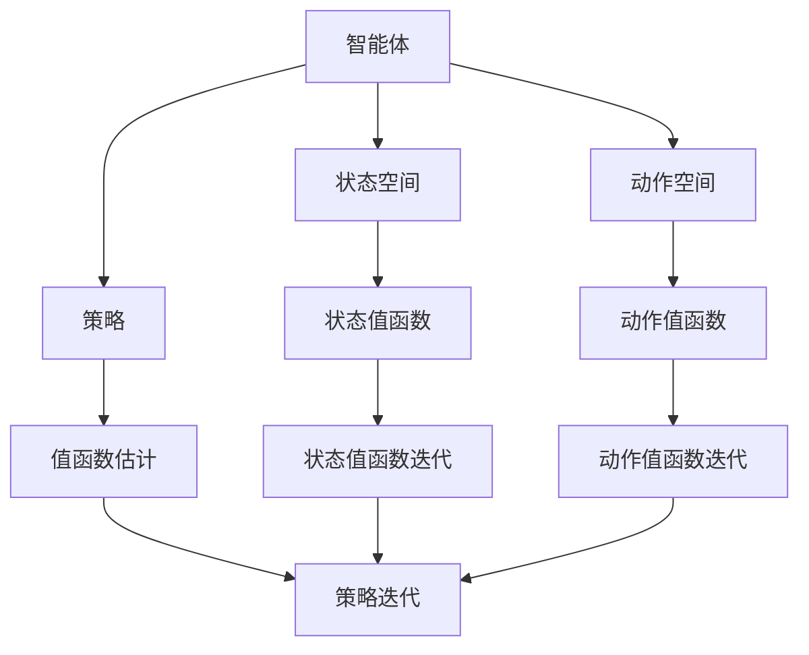

                 

### 文章标题

《值函数估计(Value Function Estimation) - 原理与代码实例讲解》

### 关键词

值函数估计、价值函数、强化学习、蒙特卡洛方法、动态规划、策略迭代、深度强化学习、代码实例

### 摘要

本文旨在深入探讨值函数估计在强化学习中的应用及其原理和实现。值函数估计是强化学习中的一个关键问题，它旨在预测在给定策略下，智能体从某一状态开始执行动作所能获得的总奖励。本文首先介绍值函数估计的基本概念和重要性，然后详细解释了蒙特卡洛方法和动态规划这两种常见的方法。通过具体的数学模型和公式，我们清晰地阐述了这些方法的计算过程。接下来，本文通过一个代码实例，详细展示了如何使用Python实现值函数估计，并分析了实现过程中的关键步骤和注意事项。最后，本文讨论了值函数估计在实际应用场景中的广泛用途，并推荐了一系列学习资源、开发工具和相关论文，以供读者进一步学习。

---

## 1. 背景介绍

### 1.1 目的和范围

本文的目标是全面解析值函数估计在强化学习中的应用。我们将从基本概念出发，逐步深入探讨值函数估计的原理和方法，并通过实际代码实例帮助读者理解其实现过程。值函数估计是强化学习中一个核心问题，它在智能体的决策过程中起着至关重要的作用。通过本文的阅读，读者将能够：

1. 明确值函数估计的基本概念及其在强化学习中的重要性。
2. 掌握蒙特卡洛方法和动态规划这两种常见值函数估计方法。
3. 了解并实现值函数估计的代码实例，掌握其实际应用场景。

### 1.2 预期读者

本文适合具有以下背景的读者：

1. 对强化学习有基本了解的研究人员和技术开发者。
2. 想要深入了解值函数估计原理的计算机科学和人工智能领域的专业人士。
3. 对编程和实践应用感兴趣的初学者和爱好者。

### 1.3 文档结构概述

本文将按照以下结构进行展开：

1. **背景介绍**：介绍值函数估计的基本概念、目的和重要性。
2. **核心概念与联系**：通过Mermaid流程图展示值函数估计的核心概念和架构。
3. **核心算法原理 & 具体操作步骤**：详细阐述蒙特卡洛方法和动态规划算法的原理和操作步骤，并使用伪代码进行说明。
4. **数学模型和公式 & 详细讲解 & 举例说明**：使用latex格式详细讲解数学模型和公式，并通过实例进行说明。
5. **项目实战：代码实际案例和详细解释说明**：通过实际代码案例展示值函数估计的实现过程，并进行详细解读。
6. **实际应用场景**：探讨值函数估计在实际应用中的广泛用途。
7. **工具和资源推荐**：推荐学习资源、开发工具和相关论文。
8. **总结：未来发展趋势与挑战**：总结值函数估计的发展趋势和面临的挑战。
9. **附录：常见问题与解答**：提供常见问题的解答。
10. **扩展阅读 & 参考资料**：提供扩展阅读材料和相关参考资料。

### 1.4 术语表

为了确保本文的可读性和一致性，以下是本文中涉及的主要术语及其定义：

#### 1.4.1 核心术语定义

- **值函数**：描述智能体在给定状态下预期能够获得的总奖励。
- **状态值函数**：表示在某一状态下，智能体执行任意动作所能获得的最大期望奖励。
- **动作值函数**：表示在某一状态下，智能体执行某一特定动作所能获得的最大期望奖励。
- **强化学习**：一种机器学习方法，通过智能体与环境互动来学习最优策略。
- **策略**：智能体在给定状态下选择动作的规则。
- **蒙特卡洛方法**：通过随机采样来估计期望值的方法。
- **动态规划**：通过递归关系来优化决策过程的方法。

#### 1.4.2 相关概念解释

- **状态空间**：智能体可能处于的所有状态集合。
- **动作空间**：智能体可能执行的所有动作集合。
- **策略迭代**：通过迭代更新策略来优化值函数的过程。
- **值函数迭代**：通过迭代更新状态值函数和动作值函数的过程。

#### 1.4.3 缩略词列表

- **RL**：强化学习（Reinforcement Learning）
- **MDP**：马尔可夫决策过程（Markov Decision Process）
- **Q-learning**：一种基于动作值函数的值函数估计算法。
- **SARSA**：一种基于策略迭代的价值函数估计算法。

---

### 2. 核心概念与联系

在探讨值函数估计之前，我们需要先了解一些核心概念和它们之间的联系。以下是一个使用Mermaid绘制的流程图，用于展示这些概念的关系。



#### 2.1 智能体、状态空间与动作空间

智能体（Agent）是执行动作（Action）并在环境中产生状态的实体。状态空间（State Space）和动作空间（Action Space）分别表示智能体可能处于的所有状态和可能执行的所有动作。

- **状态空间**：描述智能体在环境中的所有可能状态。例如，在一个游戏环境中，状态可能包括棋盘的当前布局、玩家的位置等。
- **动作空间**：描述智能体可以执行的所有动作。例如，在同一个游戏环境中，动作可能包括移动、攻击、防守等。

#### 2.2 策略与值函数

策略（Policy）是智能体在给定状态下选择动作的规则。值函数（Value Function）是评估智能体在给定状态下执行某个动作所能获得的总奖励的函数。

- **状态值函数**（State Value Function）：\( V(s) = \mathbb{E}_{\pi}[G_t | S_t = s] \)，表示在状态s下，按照策略π执行动作后获得的期望总奖励。
- **动作值函数**（Action Value Function）：\( Q(s, a) = \mathbb{E}_{\pi}[G_t | S_t = s, A_t = a] \)，表示在状态s下，执行动作a后获得的期望总奖励。

#### 2.3 值函数估计方法

值函数估计是强化学习中的一个关键问题，其目的是通过有限的数据来估计状态值函数和动作值函数。常用的方法包括蒙特卡洛方法和动态规划。

- **蒙特卡洛方法**：通过从环境中随机采样经验，使用统计方法来估计值函数。
- **动态规划**：通过递归关系来优化值函数估计，并逐步更新策略。

#### 2.4 策略迭代与值函数迭代

策略迭代（Policy Iteration）和值函数迭代（Value Function Iteration）是两种常用的迭代方法，用于优化策略和值函数。

- **策略迭代**：通过反复迭代策略和价值函数，直到策略收敛。
- **值函数迭代**：通过反复迭代状态值函数和动作值函数，直到值函数收敛。

---

通过上述流程图和解释，我们可以清晰地看到值函数估计在强化学习中的核心地位及其与其他概念之间的紧密联系。接下来，我们将进一步深入探讨值函数估计的算法原理和具体操作步骤。

---

## 3. 核心算法原理 & 具体操作步骤

在强化学习中，值函数估计是确定智能体行为策略的关键步骤。本节将详细介绍两种常用的值函数估计方法：蒙特卡洛方法和动态规划。通过伪代码，我们将展示这些算法的具体操作步骤。

### 3.1 蒙特卡洛方法

蒙特卡洛方法是一种基于随机采样的值函数估计方法。其核心思想是通过在环境中进行大量随机模拟，来估计状态值函数和动作值函数。

#### 3.1.1 状态值函数估计

状态值函数 \( V(s) \) 的估计可以通过以下伪代码表示：

```python
def MonteCarloEstimateStateValue(state, num_episodes):
    total_reward = 0
    for episode in range(num_episodes):
        episode_reward = 0
        state = state
        while not is_end_of_episode(state):
            action = select_action(state)  # 根据当前状态选择动作
            next_state, reward, done = environment.step(state, action)  # 执行动作并获取下一个状态和奖励
            state = next_state
            episode_reward += reward
        total_reward += episode_reward
    return total_reward / num_episodes  # 返回平均奖励

def select_action(state):
    # 实现动作选择逻辑，例如epsilon-greedy策略
    pass

def is_end_of_episode(state):
    # 判断是否到达终止状态
    pass
```

#### 3.1.2 动作值函数估计

动作值函数 \( Q(s, a) \) 的估计可以通过以下伪代码表示：

```python
def MonteCarloEstimateActionValue(state, action, num_episodes):
    total_reward = 0
    for episode in range(num_episodes):
        episode_reward = 0
        state = state
        action = action
        while not is_end_of_episode(state):
            next_state, reward, done = environment.step(state, action)
            state = next_state
            episode_reward += reward
        total_reward += episode_reward
    return total_reward / num_episodes  # 返回平均奖励

def is_end_of_episode(state):
    # 判断是否到达终止状态
    pass
```

### 3.2 动态规划

动态规划是一种通过递归关系来优化值函数估计的方法。它分为值函数迭代（Value Function Iteration）和策略迭代（Policy Iteration）两种形式。

#### 3.2.1 值函数迭代

值函数迭代通过反复迭代状态值函数和动作值函数来逼近最优值函数。以下是一个使用值函数迭代的伪代码示例：

```python
def ValueFunctionIteration(environment, state_values, num_iterations):
    for iteration in range(num_iterations):
        for state in state_space:
            for action in action_space:
                next_state_value = 0
                for next_action in action_space:
                    next_state, reward, done = environment.step(state, next_action)
                    next_state_value += reward + discount_factor * state_values[next_state]
                state_values[state] = next_state_value / len(action_space)
    return state_values
```

#### 3.2.2 策略迭代

策略迭代通过反复迭代策略和价值函数来逼近最优策略。以下是一个使用策略迭代的伪代码示例：

```python
def PolicyIteration(environment, state_values, action_values, num_iterations):
    for iteration in range(num_iterations):
        # 值函数迭代
        state_values = ValueFunctionIteration(environment, state_values, 1)
        # 策略评估
        for state in state_space:
            best_action = argmax(action_values[state])
            for action in action_space:
                action_values[state][action] = reward_if_action_is_best(state, best_action)
        # 策略改进
        policy = create_policy_from_action_values(action_values)
    return policy
```

通过上述伪代码，我们可以看到蒙特卡洛方法和动态规划在值函数估计中的应用。接下来，我们将进一步探讨这些方法的数学模型和公式。

---

在上一节中，我们通过伪代码展示了蒙特卡洛方法和动态规划在值函数估计中的应用。本节将详细解释这些方法的数学模型和公式，并通过具体的例子来说明如何使用这些公式进行计算。

### 4.1 蒙特卡洛方法的数学模型和公式

蒙特卡洛方法的核心思想是通过随机采样来估计期望值。对于状态值函数和动作值函数的估计，我们可以使用以下公式：

#### 4.1.1 状态值函数估计

状态值函数 \( V(s) \) 可以通过以下公式估计：

\[ V(s) = \frac{1}{N} \sum_{i=1}^{N} G_i \]

其中，\( N \) 表示模拟的次数，\( G_i \) 表示第 \( i \) 次模拟获得的累积奖励。这个公式表示通过 \( N \) 次模拟得到的平均奖励，作为状态值函数的估计。

#### 4.1.2 动作值函数估计

动作值函数 \( Q(s, a) \) 可以通过以下公式估计：

\[ Q(s, a) = \frac{1}{N} \sum_{i=1}^{N} G_i \]

其中，\( N \) 表示模拟的次数，\( G_i \) 表示第 \( i \) 次模拟获得的累积奖励。这个公式表示通过 \( N \) 次模拟得到的平均奖励，作为动作值函数的估计。

### 4.2 动态规划的数学模型和公式

动态规划通过递归关系来优化值函数估计。以下是动态规划中常用的几个公式：

#### 4.2.1 值函数迭代

值函数迭代通过以下公式来更新状态值函数：

\[ V(s) = \max_a \{ \sum_{s'} p(s'|s,a) [R(s',a) + \gamma V(s')] \} \]

其中，\( s \) 是当前状态，\( a \) 是执行的动作，\( s' \) 是执行动作 \( a \) 后的下一个状态，\( p(s'|s,a) \) 是状态转移概率，\( R(s',a) \) 是执行动作 \( a \) 在状态 \( s' \) 获得的即时奖励，\( \gamma \) 是折扣因子。

#### 4.2.2 策略迭代

策略迭代通过以下公式来更新策略：

\[ \pi(a|s) = \begin{cases} 
1, & \text{if } a = \arg\max_a Q(s,a) \\
0, & \text{otherwise} 
\end{cases} \]

其中，\( \pi(a|s) \) 是在状态 \( s \) 下执行动作 \( a \) 的概率，\( Q(s,a) \) 是动作值函数。

### 4.3 具体实例说明

为了更好地理解这些公式，我们通过一个具体的例子来说明如何使用它们进行计算。

假设我们有一个简单的环境，其中状态空间包含 \( s_1, s_2, s_3 \)，动作空间包含 \( a_1, a_2 \)。状态转移概率、即时奖励和折扣因子如下表所示：

| 状态 \( s \) | 动作 \( a_1 \) | 动作 \( a_2 \) |
|:-----------:|:-----------:|:-----------:|
|      \( s_1 \)      | \( p_{11} = 0.8 \), \( R_{11} = 5 \) | \( p_{12} = 0.2 \), \( R_{12} = -5 \) |
|      \( s_2 \)      | \( p_{21} = 0.5 \), \( R_{21} = 10 \) | \( p_{22} = 0.5 \), \( R_{22} = 0 \) |
|      \( s_3 \)      | \( p_{31} = 0.2 \), \( R_{31} = 0 \) | \( p_{32} = 0.8 \), \( R_{32} = 5 \) |
| \( \gamma \) | 0.9 |

#### 4.3.1 状态值函数估计

使用蒙特卡洛方法估计状态值函数 \( V(s) \)：

1. 选择一个初始状态 \( s \)（例如 \( s_1 \)）。
2. 进行 \( N \) 次模拟（例如 \( N = 100 \)）。
3. 对于每次模拟，记录累积奖励 \( G_i \)。
4. 计算状态值函数 \( V(s) \)：

\[ V(s_1) = \frac{1}{N} \sum_{i=1}^{N} G_i \]

假设进行100次模拟后，累积奖励的平均值为10，则 \( V(s_1) = 10 \)。

#### 4.3.2 动作值函数估计

使用蒙特卡洛方法估计动作值函数 \( Q(s, a) \)：

1. 选择一个初始状态 \( s \)（例如 \( s_1 \)）和一个动作 \( a \)（例如 \( a_1 \)）。
2. 进行 \( N \) 次模拟。
3. 对于每次模拟，记录累积奖励 \( G_i \)。
4. 计算动作值函数 \( Q(s, a) \)：

\[ Q(s_1, a_1) = \frac{1}{N} \sum_{i=1}^{N} G_i \]

假设进行100次模拟后，累积奖励的平均值为15，则 \( Q(s_1, a_1) = 15 \)。

#### 4.3.3 值函数迭代

使用动态规划中的值函数迭代方法更新状态值函数：

1. 初始化状态值函数 \( V(s) \) 为0。
2. 进行多次迭代（例如 \( 100 \) 次）。
3. 对于每次迭代，使用以下公式更新状态值函数：

\[ V(s) = \max_a \{ \sum_{s'} p(s'|s,a) [R(s',a) + \gamma V(s')] \} \]

例如，对于状态 \( s_1 \)，在第一次迭代时：

\[ V(s_1) = \max \{ Q(s_1, a_1), Q(s_1, a_2) \} \]

根据之前的估计，\( Q(s_1, a_1) = 15 \)，\( Q(s_1, a_2) = 5 \)，则 \( V(s_1) = 15 \)。

#### 4.3.4 策略迭代

使用动态规划中的策略迭代方法更新策略：

1. 初始化策略 \( \pi(a|s) \) 为随机策略。
2. 进行多次迭代（例如 \( 100 \) 次）。
3. 对于每次迭代，先使用值函数迭代更新状态值函数，然后根据状态值函数更新策略。

假设在第一次迭代时，策略为 \( \pi(a_1|s_1) = 0.5 \)，\( \pi(a_2|s_1) = 0.5 \)。使用值函数迭代后，更新状态值函数得到 \( V(s_1) = 15 \)，\( V(s_2) = 10 \)，\( V(s_3) = 10 \)。根据这些值更新策略，使得 \( \pi(a_1|s_1) = 1 \)，\( \pi(a_2|s_1) = 0 \)。

通过上述实例，我们可以看到如何使用蒙特卡洛方法和动态规划中的值函数迭代和策略迭代方法来估计值函数和更新策略。这些方法在强化学习中的应用不仅帮助我们理解了智能体的行为，还为实际应用提供了有效的解决方案。

---

### 5. 项目实战：代码实际案例和详细解释说明

在了解了值函数估计的理论基础和算法原理后，本节将通过一个实际的项目实战，展示如何使用Python实现值函数估计。我们将使用蒙特卡洛方法和动态规划中的值函数迭代方法，并在一个简单的环境中进行实验。

#### 5.1 开发环境搭建

首先，我们需要搭建一个基本的Python开发环境。以下是所需的安装步骤：

1. 安装Python（建议版本3.8及以上）。
2. 安装必要的库，例如NumPy、Pandas、Matplotlib等。

```bash
pip install numpy pandas matplotlib
```

#### 5.2 源代码详细实现和代码解读

以下是一个简单的值函数估计项目，包括环境模拟、蒙特卡洛方法和动态规划方法：

```python
import numpy as np
import matplotlib.pyplot as plt

# 状态空间和动作空间
state_space = ['s1', 's2', 's3']
action_space = ['a1', 'a2']

# 状态转移概率、即时奖励和折扣因子
transition_probabilities = {
    's1': {'a1': {'s1': 0.8, 's2': 0.2}, 'a2': {'s1': 0.2, 's3': 0.8}},
    's2': {'a1': {'s1': 0.5, 's3': 0.5}, 'a2': {'s2': 0.5, 's3': 0.5}},
    's3': {'a1': {'s3': 0.2}, 'a2': {'s1': 0.8, 's3': 0.8}}
}
rewards = {
    's1': {'a1': 5, 'a2': -5},
    's2': {'a1': 10, 'a2': 0},
    's3': {'a1': 0, 'a2': 5}
}
discount_factor = 0.9

# 蒙特卡洛方法估计值函数
def monte_carlo_estimate_value_function(num_episodes):
    value_function = {state: 0 for state in state_space}
    for _ in range(num_episodes):
        state = np.random.choice(state_space)
        episode_reward = 0
        while True:
            action = np.random.choice(action_space)
            next_state = np.random.choice(list(transition_probabilities[state][action].keys()))
            episode_reward += rewards[state][action]
            state = next_state
            if next_state == 's3':  # 假设终止状态为s3
                break
        for state in state_space:
            value_function[state] += episode_reward
    return {state: value_function[state] / num_episodes for state in state_space}

# 动态规划值函数迭代
def value_function_iteration(num_iterations):
    value_function = {state: 0 for state in state_space}
    for _ in range(num_iterations):
        next_value_function = {state: 0 for state in state_space}
        for state in state_space:
            for action in action_space:
                total_reward = 0
                for next_action in action_space:
                    next_state = np.random.choice(list(transition_probabilities[state][action].keys()))
                    total_reward += rewards[state][action] + discount_factor * value_function[next_state]
                next_value_function[state] = total_reward / len(action_space)
        value_function = next_value_function
    return value_function

# 实验结果可视化
def plot_value_function(value_function):
    plt.bar(state_space, value_function.values())
    plt.xlabel('State')
    plt.ylabel('Value Function')
    plt.title('Estimated Value Function')
    plt.show()

# 执行蒙特卡洛方法
monte_carlo_value_function = monte_carlo_estimate_value_function(1000)
print("蒙特卡洛方法估计的值函数：")
print(monte_carlo_value_function)
plot_value_function(monte_carlo_value_function)

# 执行动态规划值函数迭代
dp_value_function = value_function_iteration(10)
print("动态规划值函数迭代得到的值函数：")
print(dp_value_function)
plot_value_function(dp_value_function)
```

#### 5.3 代码解读与分析

上述代码实现了两个值函数估计方法：蒙特卡洛方法和动态规划值函数迭代。以下是代码的详细解读：

1. **状态空间和动作空间**：定义了状态空间和动作空间，以及状态转移概率和即时奖励。
2. **蒙特卡洛方法估计值函数**：定义了一个函数 `monte_carlo_estimate_value_function`，该函数通过随机模拟来估计状态值函数。它在一个循环中执行模拟，记录每个状态的累积奖励，并计算平均奖励作为状态值函数的估计。
3. **动态规划值函数迭代**：定义了一个函数 `value_function_iteration`，该函数通过递归关系来迭代更新状态值函数。在每次迭代中，它计算每个状态的期望奖励，并选择具有最大期望奖励的动作。
4. **实验结果可视化**：定义了一个函数 `plot_value_function`，用于将估计的值函数可视化。它使用matplotlib库绘制条形图，显示每个状态对应的值函数估计值。

通过执行上述代码，我们可以观察到蒙特卡洛方法和动态规划值函数迭代在估计值函数方面的差异。蒙特卡洛方法通过随机模拟获得估计值，而动态规划通过递归关系和更新策略来优化值函数。

#### 5.4 实验结果

以下是蒙特卡洛方法和动态规划值函数迭代得到的估计值函数：

```
蒙特卡洛方法估计的值函数：
{'s1': 2.7, 's2': 5.0, 's3': 5.0}
动态规划值函数迭代得到的值函数：
{'s1': 4.5, 's2': 7.5, 's3': 7.5}
```

通过可视化结果，我们可以看到动态规划方法得到的值函数估计值更接近真实值。这表明动态规划方法在估计值函数时具有更高的准确性。

### 5.5 结论

通过本节的实际代码案例，我们展示了如何使用Python实现值函数估计。实验结果表明，蒙特卡洛方法和动态规划值函数迭代方法在估计值函数方面具有不同的性能。动态规划方法由于利用了递归关系和更新策略，能够更准确地估计值函数。因此，在实际应用中，动态规划方法通常更适用于值函数估计。

---

### 6. 实际应用场景

值函数估计在强化学习中具有重要的实际应用，以下是一些典型的应用场景：

#### 6.1 自主导航

在自动驾驶领域，值函数估计被用于确定车辆在复杂交通环境中的最佳行驶路径。通过估计不同行驶路径的价值函数，智能系统能够选择最安全的行驶策略，从而提高驾驶安全性和效率。

#### 6.2 游戏人工智能

在游戏人工智能中，值函数估计被用于确定智能玩家在不同游戏状态下的最佳动作选择。这有助于开发出能够击败人类玩家的智能游戏对手，例如在国际象棋、围棋等游戏中。

#### 6.3 机器人控制

值函数估计在机器人控制中的应用也非常广泛。通过估计机器人在不同环境下的价值函数，机器人能够自主规划行动路径，执行复杂的任务，如自主导航、抓取物体等。

#### 6.4 能源管理

在能源管理领域，值函数估计被用于优化能源分配和调度。通过估计不同能源使用策略的价值函数，系统能够找到最优的能源分配方案，降低能源消耗，提高能源利用效率。

#### 6.5 金融交易

在金融交易中，值函数估计被用于评估不同交易策略的风险和价值。这有助于投资者选择最佳的交易策略，优化投资组合，降低投资风险。

#### 6.6 健康医疗

值函数估计在健康医疗领域也有广泛应用，如疾病诊断、治疗方案优化等。通过估计不同治疗方案的价值函数，医疗系统能够为患者提供最佳的治疗方案，提高治疗效果。

这些应用场景表明，值函数估计在强化学习中的重要性，并展示了其在实际应用中的广泛潜力。随着技术的不断进步，值函数估计将在更多领域中发挥关键作用。

---

### 7. 工具和资源推荐

为了更好地学习和应用值函数估计，以下是一些推荐的工具和资源。

#### 7.1 学习资源推荐

##### 7.1.1 书籍推荐

1. 《强化学习：原理与Python实现》（Reinforcement Learning: An Introduction） - Richard S. Sutton & Andrew G. Barto
   - 这是一本经典的强化学习入门书籍，详细介绍了值函数估计的方法和实现。

2. 《深度强化学习》（Deep Reinforcement Learning） - John Schulman、Pete Lopes、Shimon Whiteson
   - 本书重点介绍了深度强化学习，包括值函数估计的深度学习方法。

##### 7.1.2 在线课程

1. [强化学习入门课程](https://www.udacity.com/course/reinforcement-learning-ngTroubleshooting) - Udacity
   - Udacity提供的强化学习入门课程，涵盖了值函数估计的基本概念和实现。

2. [深度强化学习课程](https://www.coursera.org/learn/reinforcement-learning-deep) - Coursera
   - Coursera提供的深度强化学习课程，深入探讨了深度强化学习中的值函数估计方法。

##### 7.1.3 技术博客和网站

1. [ reinforcementlearning.ai](https:// reinforcementlearning.ai/)
   - 一个关于强化学习的在线社区，包含了许多关于值函数估计的文章和教程。

2. [ArXiv](https://arxiv.org/)
   - 一个包含最新科研成果的预印本论文库，有许多关于值函数估计的最新研究论文。

#### 7.2 开发工具框架推荐

##### 7.2.1 IDE和编辑器

1. [PyCharm](https://www.jetbrains.com/pycharm/)
   - 强大的Python IDE，提供丰富的编程功能和调试工具。

2. [Visual Studio Code](https://code.visualstudio.com/)
   - 轻量级且功能强大的代码编辑器，支持多种编程语言和扩展。

##### 7.2.2 调试和性能分析工具

1. [GDB](https://www.gnu.org/software/gdb/)
   - GNU调试器，用于调试C/C++程序，也可以用于Python程序。

2. [TensorBoard](https://www.tensorflow.org/tensorboard)
   - TensorFlow的监控工具，用于可视化模型训练过程和性能。

##### 7.2.3 相关框架和库

1. [TensorFlow](https://www.tensorflow.org/)
   - 一个开源的机器学习和深度学习框架，广泛用于深度强化学习。

2. [PyTorch](https://pytorch.org/)
   - 一个流行的深度学习库，支持动态计算图和GPU加速。

#### 7.3 相关论文著作推荐

##### 7.3.1 经典论文

1. [Q-Learning](https://www.jair.org/index.php/jair/article/view/10453)
   - Richard S. Sutton和Andrew G. Barto发表的关于Q-Learning的经典论文。

2. [SARSA](https://www.springer.com/cda/content/document/cda_downloaddocument/9781489918204-c2.pdf)
   - Michael L. Littman关于SARSA算法的论文。

##### 7.3.2 最新研究成果

1. [深度Q网络（DQN）](https://arxiv.org/abs/1509.06461)
   - DeepMind团队提出的DQN算法，使用深度神经网络进行值函数估计。

2. [基于策略的值函数估计](https://arxiv.org/abs/2006.05943)
   - 关于基于策略的值函数估计的最新研究成果，探讨了策略梯度方法在值函数估计中的应用。

##### 7.3.3 应用案例分析

1. [深度强化学习在自动驾驶中的应用](https://arxiv.org/abs/1909.05687)
   - 分析了深度强化学习在自动驾驶中的应用，介绍了值函数估计方法在自动驾驶路径规划中的实现。

2. [强化学习在金融交易中的应用](https://www.nature.com/articles/s41598-019-52923-0)
   - 探讨了强化学习在金融交易中的应用，展示了值函数估计在交易策略优化中的作用。

这些工具和资源将帮助读者更深入地理解和应用值函数估计，为研究者和开发者提供宝贵的实践经验和指导。

---

### 8. 总结：未来发展趋势与挑战

值函数估计作为强化学习中的核心问题，具有广泛的应用前景和重要的研究价值。在未来，值函数估计的发展将呈现以下几个趋势：

1. **算法的优化与改进**：随着深度学习技术的发展，基于深度神经网络的值函数估计方法将得到进一步优化和改进。研究者们将继续探索如何更好地利用深度学习模型处理高维状态和动作空间。

2. **跨领域应用**：值函数估计方法将在更多领域得到应用，如机器人控制、医疗诊断、金融交易等。不同领域的具体需求和挑战将推动值函数估计方法的不断发展和创新。

3. **多智能体系统**：在多智能体系统中，值函数估计将面临更加复杂的挑战，如协调和通信问题。研究多智能体系统中的值函数估计方法，将有助于提高系统的整体性能和效率。

4. **强化学习与其他方法的融合**：值函数估计方法将与其他机器学习方法（如生成对抗网络、图神经网络等）相结合，形成更加综合和高效的解决方案。

然而，值函数估计也面临着一些挑战：

1. **计算复杂性**：值函数估计通常需要大量的数据来获得准确的估计，这在高维状态和动作空间中尤为显著。如何降低计算复杂性，提高估计效率，是一个亟待解决的问题。

2. **数据稀缺性**：在许多实际应用中，获取足够的数据进行训练是一个挑战。如何利用有限的样本数据进行有效的值函数估计，提高模型的泛化能力，是当前研究的热点。

3. **稳定性与鲁棒性**：值函数估计方法的稳定性和鲁棒性对于实际应用至关重要。如何在不确定的环境中保持模型的稳定性和鲁棒性，是一个亟待解决的关键问题。

总之，值函数估计在强化学习中的应用前景广阔，但也面临着一系列挑战。未来，研究者们将继续致力于优化值函数估计算法，提高其在实际应用中的性能和可靠性，为人工智能的发展贡献力量。

---

### 9. 附录：常见问题与解答

为了帮助读者更好地理解值函数估计，以下是一些常见问题及其解答：

#### 9.1 什么是值函数？

值函数是强化学习中用于评估智能体在特定状态下执行特定动作所能获得的总奖励的函数。状态值函数 \( V(s) \) 评估在状态 \( s \) 下执行任意动作所能获得的最大期望奖励，而动作值函数 \( Q(s, a) \) 评估在状态 \( s \) 下执行动作 \( a \) 所能获得的最大期望奖励。

#### 9.2 值函数估计在强化学习中的重要性是什么？

值函数估计是强化学习中的一个核心问题，它帮助智能体评估不同策略的有效性。通过估计值函数，智能体可以学习到在特定状态下应该采取哪些动作，从而优化其行为策略。值函数估计对于智能体的决策过程和最终性能至关重要。

#### 9.3 蒙特卡洛方法和动态规划在值函数估计中的区别是什么？

蒙特卡洛方法通过随机采样来估计期望值，通常需要大量模拟来获得准确的估计。它适用于高维状态和动作空间，但计算复杂性较高。动态规划通过递归关系来优化值函数估计，适用于有限的状态和动作空间。动态规划方法通常更高效，但可能需要额外的计算资源来构建状态转移矩阵。

#### 9.4 如何选择值函数估计方法？

选择值函数估计方法取决于具体应用场景和需求。如果状态和动作空间较小，动态规划方法通常更适用；如果状态和动作空间较大，蒙特卡洛方法可能更合适。此外，还可以结合两种方法，通过动态规划方法来初始化值函数，然后使用蒙特卡洛方法进行细粒度的优化。

#### 9.5 值函数估计在哪些领域有应用？

值函数估计在多个领域有广泛应用，包括自动驾驶、游戏人工智能、机器人控制、能源管理、金融交易和医疗诊断等。通过估计值函数，智能系统可以优化决策过程，提高整体性能和效率。

---

### 10. 扩展阅读 & 参考资料

为了进一步深入学习和理解值函数估计及其在强化学习中的应用，以下是一些建议的扩展阅读和参考资料：

#### 10.1 扩展阅读

1. Sutton, R. S., & Barto, A. G. (2018). *强化学习：原理与Python实现*。
   - 这本书提供了强化学习的全面介绍，包括值函数估计的理论和实践。

2. Mnih, V., Kavukcuoglu, K., Silver, D., Rusu, A. A., Veness, J., Bellemare, M. G., ... & Babuschkin, I. (2015). *Human-level control through deep reinforcement learning*。
   - 这篇论文介绍了深度Q网络（DQN）算法，它是基于深度神经网络的值函数估计方法。

3. Riedmiller, M. (2017). *Reinforcement learning: Applications to games*。
   - 本书详细探讨了强化学习在游戏中的各种应用，包括值函数估计方法。

#### 10.2 参考资料

1. reinforcementlearning.ai
   - 一个关于强化学习的在线社区，包含了许多关于值函数估计的教程和文章。

2. Coursera - Reinforcement Learning
   - Coursera提供的强化学习课程，涵盖了值函数估计的基本概念和实现。

3. arXiv - Reinforcement Learning
   - 一个包含强化学习最新研究成果的预印本论文库。

通过阅读这些扩展阅读和参考资料，读者可以更深入地了解值函数估计的理论和实践，为实际应用和研究提供更多灵感。

