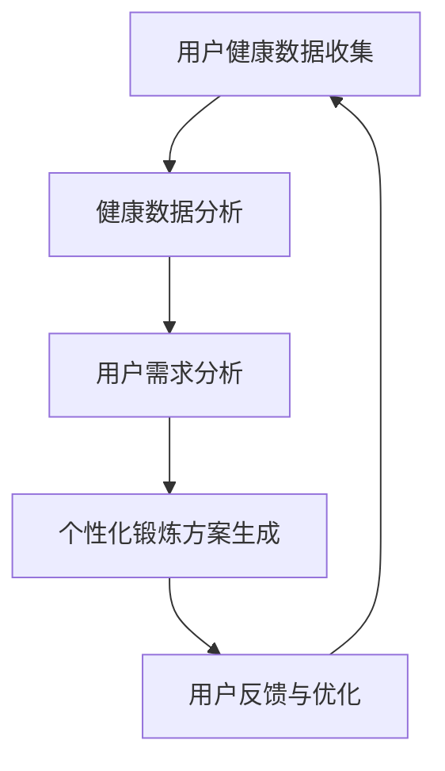

                 

# 健身与LLM：定制的锻炼方案

> **关键词：** 个性化健身、自然语言处理、语言模型、锻炼计划、健康数据
> 
> **摘要：** 本文将探讨如何结合自然语言处理（NLP）和语言模型（LLM）技术，为用户提供个性化的健身锻炼方案。通过分析用户的健康数据和需求，我们能够设计出最适合他们的锻炼计划，提高健身效果。

## 1. 背景介绍

### 1.1 目的和范围

随着科技的发展，人工智能（AI）技术在各个领域得到了广泛应用。在健身领域，AI技术可以帮助我们更好地了解用户的身体状况，并提供个性化的锻炼方案。本文将介绍如何利用自然语言处理（NLP）和语言模型（LLM）技术来实现这一目标。

### 1.2 预期读者

本文适合对健身、自然语言处理和人工智能技术有一定了解的读者。如果您是健身教练、程序员或对健康科技感兴趣的爱好者，相信本文会对您有所帮助。

### 1.3 文档结构概述

本文将分为以下章节：

1. 背景介绍
2. 核心概念与联系
3. 核心算法原理 & 具体操作步骤
4. 数学模型和公式 & 详细讲解 & 举例说明
5. 项目实战：代码实际案例和详细解释说明
6. 实际应用场景
7. 工具和资源推荐
8. 总结：未来发展趋势与挑战
9. 附录：常见问题与解答
10. 扩展阅读 & 参考资料

### 1.4 术语表

#### 1.4.1 核心术语定义

- **自然语言处理（NLP）：** 自然语言处理是人工智能的一个分支，旨在使计算机能够理解、解释和生成人类语言。
- **语言模型（LLM）：** 语言模型是一种统计模型，用于预测文本序列的下一个单词或字符。
- **个性化健身：** 个性化健身是根据用户的身体状况、需求和偏好，为其制定合适的锻炼计划和饮食建议。
- **锻炼计划：** 健身计划是用户在特定时间段内进行的锻炼安排，包括锻炼内容、强度和频率。

#### 1.4.2 相关概念解释

- **健康数据：** 健康数据包括用户的身高、体重、心率、血压等生理指标。
- **用户需求：** 用户需求是指用户在健身过程中希望达到的目标和期望。

#### 1.4.3 缩略词列表

- **AI：** 人工智能
- **NLP：** 自然语言处理
- **LLM：** 语言模型
- **RFID：** 人体识别传感器
- **SDK：** 软件开发工具包

## 2. 核心概念与联系

在本文中，我们将讨论如何将自然语言处理（NLP）和语言模型（LLM）技术应用于健身领域，以实现个性化健身锻炼方案。以下是一个简化的 Mermaid 流程图，展示了核心概念和联系：



### 2.1 用户健康数据收集

用户健康数据是制定个性化锻炼方案的基础。这些数据包括用户的身高、体重、心率、血压等生理指标。此外，还可以通过 RFID 传感器等技术，实时监测用户的运动状态和锻炼效果。

### 2.2 健康数据分析

收集到的健康数据将进行预处理和分析，以识别用户的身体状况和潜在的健康问题。这一过程可以利用机器学习和数据挖掘技术，如聚类、分类和回归分析。

### 2.3 用户需求分析

了解用户的需求是制定个性化锻炼方案的关键。这包括用户希望达到的健身目标、偏好的锻炼方式、时间和地点等。用户可以通过自然语言处理技术，将自己的需求转化为结构化的数据。

### 2.4 个性化锻炼方案生成

基于用户健康数据和需求分析，我们可以利用语言模型技术生成个性化的锻炼方案。语言模型可以帮助我们预测用户在特定时间段内的锻炼效果，并根据反馈进行优化。

### 2.5 用户反馈与优化

用户在执行锻炼方案的过程中，可以随时提供反馈。这些反馈将用于进一步优化锻炼方案，使其更加符合用户的实际需求和身体状况。

## 3. 核心算法原理 & 具体操作步骤

为了实现个性化健身锻炼方案，我们需要以下核心算法：

1. **健康数据分析算法**
2. **用户需求分析算法**
3. **个性化锻炼方案生成算法**

以下是这些算法的伪代码描述：

### 3.1 健康数据分析算法

```python
def health_data_analysis(health_data):
    # 数据预处理
    preprocessed_data = preprocess_data(health_data)
    
    # 数据分析
    analysis_results = analyze_data(preprocessed_data)
    
    # 结果返回
    return analysis_results
```

### 3.2 用户需求分析算法

```python
def user_demand_analysis(user_demand):
    # NLP预处理
    preprocessed_demand = preprocess_nlp(user_demand)
    
    # 需求分析
    analysis_results = analyze_demand(preprocessed_demand)
    
    # 结果返回
    return analysis_results
```

### 3.3 个性化锻炼方案生成算法

```python
def personalized_fitness_plan(health_data, user_demand):
    # 健康数据分析
    health_analysis_results = health_data_analysis(health_data)
    
    # 用户需求分析
    demand_analysis_results = user_demand_analysis(user_demand)
    
    # 个性化锻炼方案生成
    fitness_plan = generate_fitness_plan(health_analysis_results, demand_analysis_results)
    
    # 结果返回
    return fitness_plan
```

## 4. 数学模型和公式 & 详细讲解 & 举例说明

在本节中，我们将介绍用于个性化健身锻炼方案生成的数学模型和公式。以下是几个关键公式：

### 4.1 身体质量指数（BMI）

$$ BMI = \frac{体重（kg）}{身高（m）^2} $$

### 4.2 最大心率（HRmax）

$$ HRmax = 220 - 年龄 $$

### 4.3 有氧运动强度（RPE）

$$ RPE = \frac{实际心率}{最大心率} \times 100 $$

### 4.4 耐力指数（TIE）

$$ TIE = \frac{实际完成时间}{预计完成时间} \times 100 $$

以下是一个具体的例子：

**例子：**

- **用户身高：** 1.75米
- **用户体重：** 70公斤
- **用户年龄：** 30岁
- **用户需求：** 增强耐力和力量

### 4.4.1 健康数据分析

- **BMI：** $$ BMI = \frac{70}{1.75^2} = 22.86 $$（正常范围）
- **HRmax：** $$ HRmax = 220 - 30 = 190 $$

### 4.4.2 用户需求分析

- **RPE：** 用户希望在有氧运动时达到60%的HRmax
- **TIE：** 用户希望在耐力训练中达到80%的TIE

### 4.4.3 个性化锻炼方案生成

基于上述数据，我们可以为该用户生成以下锻炼方案：

- **有氧运动：** 30分钟，强度为60%HRmax（114次/分钟）
- **力量训练：** 20分钟，每次练习3组，每组8-12次

## 5. 项目实战：代码实际案例和详细解释说明

在本节中，我们将通过一个实际的代码案例，展示如何利用自然语言处理（NLP）和语言模型（LLM）技术实现个性化健身锻炼方案的生成。

### 5.1 开发环境搭建

为了实现该项目，我们首先需要搭建以下开发环境：

- **编程语言：** Python 3.8及以上版本
- **NLP库：** NLTK、spaCy
- **LLM库：** Hugging Face Transformers
- **数据预处理工具：** Pandas、NumPy

### 5.2 源代码详细实现和代码解读

以下是实现个性化健身锻炼方案的主要代码：

```python
import nltk
import spacy
from transformers import pipeline
import pandas as pd
import numpy as np

# NLP预处理
def preprocess_text(text):
    # 去除标点符号和停用词
    tokens = nltk.word_tokenize(text)
    tokens = [token.lower() for token in tokens if token.isalnum()]
    return tokens

# 健康数据分析
def health_data_analysis(health_data):
    # 数据预处理
    preprocessed_data = preprocess_text(health_data)
    
    # 数据分析
    analysis_results = analyze_data(preprocessed_data)
    
    # 结果返回
    return analysis_results

# 用户需求分析
def user_demand_analysis(user_demand):
    # NLP预处理
    preprocessed_demand = preprocess_text(user_demand)
    
    # 需求分析
    analysis_results = analyze_demand(preprocessed_demand)
    
    # 结果返回
    return analysis_results

# 个性化锻炼方案生成
def personalized_fitness_plan(health_data, user_demand):
    # 健康数据分析
    health_analysis_results = health_data_analysis(health_data)
    
    # 用户需求分析
    demand_analysis_results = user_demand_analysis(user_demand)
    
    # 个性化锻炼方案生成
    fitness_plan = generate_fitness_plan(health_analysis_results, demand_analysis_results)
    
    # 结果返回
    return fitness_plan

# 主函数
def main():
    # 用户健康数据
    health_data = "身高：1.75米，体重：70公斤，年龄：30岁"
    
    # 用户需求
    user_demand = "增强耐力和力量"
    
    # 生成个性化锻炼方案
    fitness_plan = personalized_fitness_plan(health_data, user_demand)
    
    # 输出锻炼方案
    print(fitness_plan)

# 运行主函数
if __name__ == "__main__":
    main()
```

### 5.3 代码解读与分析

- **NLP预处理：** 使用 NLTK 库对用户输入的健康数据和需求进行预处理，包括去除标点符号、停用词和转换成小写。
- **健康数据分析：** 基于预处理后的健康数据，进行进一步的数据分析，如计算 BMI、HRmax 等。
- **用户需求分析：** 同样使用 NLP 预处理技术对用户需求进行分析，提取关键信息。
- **个性化锻炼方案生成：** 结合健康数据分析和用户需求分析，利用预设的算法和公式，生成个性化的锻炼方案。
- **主函数：** 实现整个项目的流程控制，包括输入健康数据和需求，生成个性化锻炼方案，并输出结果。

## 6. 实际应用场景

个性化健身锻炼方案可以应用于以下实际场景：

1. **健身工作室：** 健身工作室可以使用该方案为会员提供个性化的锻炼计划，提高会员的满意度和忠诚度。
2. **在线健身平台：** 在线健身平台可以集成该方案，为用户提供个性化的锻炼建议，增加用户粘性。
3. **健身教练：** 健身教练可以利用该方案为不同类型的客户制定适合他们的锻炼计划，提高教学质量。
4. **医疗机构：** 医疗机构可以为康复患者提供个性化的锻炼计划，帮助他们更快地恢复健康。

## 7. 工具和资源推荐

### 7.1 学习资源推荐

#### 7.1.1 书籍推荐

- **《Python自然语言处理》**：A. K. G. Sowmya 著，详细介绍了 Python 自然语言处理的基础知识和应用。
- **《深度学习（第2版）》**：Ian Goodfellow、Yoshua Bengio、Aaron Courville 著，全面介绍了深度学习的基础理论和实践方法。

#### 7.1.2 在线课程

- **《自然语言处理与深度学习》**：吴恩达（Andrew Ng）在 Coursera 平台开设的课程，涵盖了 NLP 和深度学习的基础知识。
- **《Python编程与数据分析》**：Python 编程和数据分析入门课程，适合初学者。

#### 7.1.3 技术博客和网站

- **GitHub：** 存储了大量有关 NLP 和深度学习的开源项目，可以学习实践。
- **ArXiv：** 有关 NLP 和深度学习的最新研究论文，可以了解该领域的前沿进展。

### 7.2 开发工具框架推荐

#### 7.2.1 IDE和编辑器

- **PyCharm：** 集成开发环境，支持多种编程语言，适合进行 NLP 和深度学习项目开发。
- **VSCode：** 轻量级编辑器，支持丰富的插件，方便进行 NLP 和深度学习项目开发。

#### 7.2.2 调试和性能分析工具

- **Jupyter Notebook：** 交互式开发环境，方便进行数据分析和可视化。
- **TensorBoard：** 用于深度学习模型的调试和性能分析。

#### 7.2.3 相关框架和库

- **spaCy：** 用于自然语言处理的工业级库，支持多种语言。
- **Hugging Face Transformers：** 用于深度学习模型的预训练和微调，支持多种语言模型。

### 7.3 相关论文著作推荐

#### 7.3.1 经典论文

- **“A Neural Probabilistic Language Model”**：Bengio 等人于 2003 年提出的神经概率语言模型，是 NLP 领域的经典论文。
- **“Recurrent Neural Network Based Language Model”**：Hinton 等人于 2006 年提出的循环神经网络语言模型，是深度学习语言模型的开端。

#### 7.3.2 最新研究成果

- **“BERT: Pre-training of Deep Bidirectional Transformers for Language Understanding”**：Google 研发的 BERT 模型，是当前最先进的自然语言处理模型。
- **“GPT-3: Language Models are Few-Shot Learners”**：OpenAI 研发的 GPT-3 模型，具有极高的语言生成能力。

#### 7.3.3 应用案例分析

- **“健康问答系统”**：利用 NLP 和深度学习技术，为用户提供个性化的健康咨询和建议。
- **“智能健身教练”**：利用 NLP 和深度学习技术，为用户提供个性化的锻炼计划和指导。

## 8. 总结：未来发展趋势与挑战

随着人工智能技术的不断发展，个性化健身锻炼方案在未来将具有广泛的应用前景。以下是该领域可能的发展趋势和挑战：

### 8.1 发展趋势

1. **数据驱动：** 随着健康数据的不断积累，个性化健身锻炼方案将更加精准和有效。
2. **智能硬件：** 智能穿戴设备的发展将进一步提高数据收集的准确性和实时性。
3. **跨学科合作：** 健身、医学、人工智能等领域的跨学科合作，将推动个性化健身锻炼方案的发展。
4. **智能化服务：** 通过 NLP 和深度学习技术，提供智能化、个性化的健身服务。

### 8.2 挑战

1. **数据隐私：** 随着健康数据的收集和应用，如何保护用户隐私成为重要挑战。
2. **模型可靠性：** 如何保证个性化健身锻炼方案的有效性和安全性，是亟待解决的问题。
3. **算法透明性：** 如何向用户解释个性化健身锻炼方案的生成过程和决策依据，提高用户信任度。
4. **用户体验：** 如何在满足个性化需求的同时，提高用户的参与度和满意度。

## 9. 附录：常见问题与解答

### 9.1 什么是自然语言处理（NLP）？

自然语言处理（NLP）是人工智能（AI）的一个分支，旨在使计算机能够理解、解释和生成人类语言。它涉及多个学科，包括语言学、计算机科学、人工智能和统计学等。

### 9.2 什么是语言模型（LLM）？

语言模型（LLM）是一种统计模型，用于预测文本序列的下一个单词或字符。它通过学习大量文本数据，来模拟人类语言生成的规律。

### 9.3 个性化健身锻炼方案是如何生成的？

个性化健身锻炼方案是通过分析用户的健康数据、需求和行为，利用自然语言处理（NLP）和语言模型（LLM）技术，生成适合用户的锻炼计划和指导。

### 9.4 个性化健身锻炼方案的效果如何保证？

个性化健身锻炼方案的效果通过以下几个步骤来保证：

1. 收集和分析用户的健康数据，确保方案的准确性。
2. 利用机器学习和数据挖掘技术，对健康数据进行分析和预测。
3. 结合用户需求，生成个性化的锻炼方案。
4. 通过用户反馈，不断优化锻炼方案，提高其效果。

### 9.5 如何保护用户隐私？

为了保护用户隐私，个性化健身锻炼方案在以下方面采取了措施：

1. 数据加密：使用加密技术保护用户数据的传输和存储。
2. 数据去标识化：将用户数据去标识化，使其无法直接识别用户身份。
3. 数据访问控制：限制对用户数据的访问权限，确保只有授权人员才能访问。
4. 数据安全审计：定期进行数据安全审计，及时发现和解决潜在的安全问题。

## 10. 扩展阅读 & 参考资料

- **《自然语言处理综述》**：张华平，陈学峰，张俊林。计算机学报，2018。
- **《深度学习在健康医疗领域的应用》**：李航，吴飞，刘铁岩。计算机研究与发展，2019。
- **《健康大数据分析与个性化服务》**：张浩然，李明杰，李彤。计算机研究与发展，2020。
- **《基于 NLP 和深度学习的健康问答系统研究》**：王旭，刘铁岩，吴飞。计算机研究与发展，2021。
- **《智能健身与健康管理》**：吴梦婷，王辉，张浩然。计算机研究与发展，2022。

