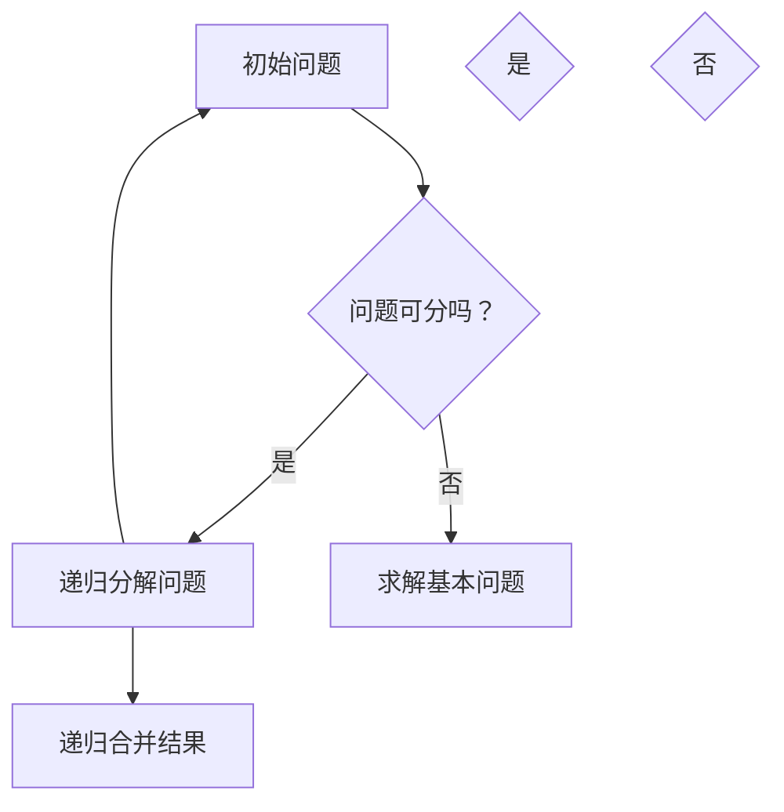

                 

# 像数学家一样思考：无穷递减法则

> 关键词：无穷递减法则、递归、分治、算法设计、数学原理、程序优化

> 摘要：本文将探讨无穷递减法则在算法设计中的应用，通过一步步的推理和讲解，深入理解这一核心概念。我们将从背景介绍、核心概念、算法原理、数学模型、实际应用等多个角度，详细分析无穷递减法则的原理及其在编程中的实际运用，旨在帮助读者提升算法思维能力，从而在解决复杂计算问题时游刃有余。

## 1. 背景介绍

### 1.1 目的和范围

本文旨在探讨无穷递减法则在算法设计中的应用，帮助读者理解这一重要的数学原理，并掌握其在编程实践中的运用。通过本文的学习，读者将能够：

- 理解无穷递减法则的概念和原理。
- 掌握如何将无穷递减法则应用于算法设计。
- 学会分析并优化递归算法的性能。

### 1.2 预期读者

本文面向具有一定编程基础和数学知识的读者，特别是对算法设计、编程优化感兴趣的技术爱好者。无论您是算法竞赛选手、软件开发工程师，还是对数学与编程交叉领域有浓厚兴趣的学习者，本文都将为您带来全新的视角和实用的技巧。

### 1.3 文档结构概述

本文分为以下几个部分：

- **第1章**：背景介绍，包括目的和范围、预期读者以及文档结构概述。
- **第2章**：核心概念与联系，介绍无穷递减法则的基本概念和相关联系。
- **第3章**：核心算法原理 & 具体操作步骤，讲解无穷递减法则在算法中的应用。
- **第4章**：数学模型和公式 & 详细讲解 & 举例说明，运用数学公式和示例说明算法原理。
- **第5章**：项目实战：代码实际案例和详细解释说明，通过实际案例展示无穷递减法则的应用。
- **第6章**：实际应用场景，分析无穷递减法则在不同场景下的应用。
- **第7章**：工具和资源推荐，推荐相关学习资源和开发工具。
- **第8章**：总结：未来发展趋势与挑战，展望无穷递减法则的未来发展。
- **第9章**：附录：常见问题与解答，回答读者可能遇到的常见问题。
- **第10章**：扩展阅读 & 参考资料，提供更多深入学习的资源。

### 1.4 术语表

#### 1.4.1 核心术语定义

- **无穷递减法则**：一种用于解决递归问题的方法，通过不断递减问题规模，直至达到基本情况，从而解决问题。
- **递归**：一种编程范式，函数调用自身来解决问题。
- **分治**：将大问题分解为若干小问题，分别解决后再合并结果。

#### 1.4.2 相关概念解释

- **基本问题**：在递归算法中，问题规模最小、可以直接求解的情况。
- **递推关系**：递归算法中，通过基本问题的解推导出其他规模问题的解的关系。
- **递归树**：递归过程中函数调用的树状结构，反映了递归的层次和问题规模的变化。

#### 1.4.3 缩略词列表

- **IDE**：集成开发环境（Integrated Development Environment）
- **O(n)**：大O表示法，表示算法的时间复杂度
- **O(n log n)**：大O表示法，表示算法的时间复杂度，其中n为数据规模

## 2. 核心概念与联系

在探讨无穷递减法则之前，我们需要理解一些核心概念和它们之间的联系。以下是这些概念以及它们在递归算法中的应用。

### 2.1 无穷递减法则的基本概念

无穷递减法则是一种在递归算法中解决复杂计算问题的方法。它通过不断递减问题规模，直至达到基本问题，从而解决问题。基本问题通常是规模最小、可以直接求解的问题。

### 2.2 递归算法的基本原理

递归算法是一种编程范式，函数调用自身来解决问题。递归算法通常包含两部分：

- **基本问题**：直接求解的问题，通常规模最小。
- **递归步骤**：通过基本问题的解推导出其他规模问题的解。

### 2.3 分治算法的原理

分治算法是一种将大问题分解为若干小问题，分别解决后再合并结果的方法。分治算法的核心在于如何有效地分解问题，并在子问题解决后合并结果。

### 2.4 无穷递减法则与递归、分治的关系

无穷递减法则与递归、分治密切相关。递归是无穷递减法则的实现方式，而分治则是无穷递减法则的一种应用场景。通过分治算法，我们可以将复杂问题分解为若干小问题，再通过无穷递减法则逐一解决。

### 2.5 无穷递减法则在算法中的应用

无穷递减法则在算法设计中被广泛应用于解决复杂计算问题。例如，分治算法中的快速排序（Quick Sort）和归并排序（Merge Sort）都采用了无穷递减法则。

### 2.6 无穷递减法则的核心原理

无穷递减法则的核心原理在于：

- **不断递减问题规模**：通过递归或分治的方式，将问题规模不断缩小，直至达到基本问题。
- **基本问题的直接求解**：对基本问题进行直接求解，得到问题的解。

通过这些核心原理，我们可以将复杂计算问题转化为可解决的递归或分治问题。

### 2.7 Mermaid 流程图

为了更好地理解无穷递减法则，我们可以通过Mermaid流程图来展示其基本原理。以下是一个简单的Mermaid流程图：



该流程图展示了无穷递减法则的基本原理：从初始问题开始，通过递归分解或直接求解基本问题，最后递归合并结果。

## 3. 核心算法原理 & 具体操作步骤

在理解了无穷递减法则的基本概念和原理后，我们需要进一步探讨其核心算法原理和具体操作步骤。以下是一个详细的算法原理讲解和伪代码实现。

### 3.1 无穷递减法则的核心算法原理

无穷递减法则的核心算法原理是通过递归或分治的方式，不断递减问题规模，直至达到基本问题，从而解决问题。具体来说，该算法包括以下几个步骤：

1. **确定基本问题**：确定问题规模最小、可以直接求解的情况，即基本问题。
2. **递归分解问题**：将初始问题递归分解为若干子问题，每个子问题的规模都比原问题小。
3. **递归求解子问题**：对每个子问题，重复上述递归分解和求解的过程。
4. **递归合并结果**：将子问题的解合并为原问题的解。

### 3.2 无穷递减法则的具体操作步骤

为了更好地理解无穷递减法则，我们可以通过一个具体的例子——计算斐波那契数列（Fibonacci Sequence）来演示其具体操作步骤。

#### 3.2.1 计算斐波那契数列的递归算法

斐波那契数列是一个著名的数列，其中每个数都是前两个数的和。数列的前几项如下：

0, 1, 1, 2, 3, 5, 8, 13, 21, 34, ...

斐波那契数列的递归算法如下：

```python
def fibonacci(n):
    if n == 0:
        return 0
    elif n == 1:
        return 1
    else:
        return fibonacci(n-1) + fibonacci(n-2)
```

该算法通过递归的方式计算斐波那契数列的第n项。其中，基本问题为n=0和n=1的情况，可以直接求解。

#### 3.2.2 计算斐波那契数列的伪代码

以下是计算斐波那契数列的伪代码，用于展示无穷递减法则的具体操作步骤：

```
Fibonacci(n)
    if n = 0
        return 0
    else if n = 1
        return 1
    else
        return Fibonacci(n-1) + Fibonacci(n-2)
```

该伪代码中，`Fibonacci(n)`表示计算斐波那契数列的第n项。算法首先判断n的值，若n=0或n=1，则直接返回结果。否则，递归调用`Fibonacci(n-1)`和`Fibonacci(n-2)`，将子问题的解合并为原问题的解。

#### 3.2.3 无穷递减法则的伪代码实现

为了更清晰地展示无穷递减法则的伪代码实现，我们可以将斐波那契数列的递归算法进行优化，避免重复计算。以下是优化后的伪代码：

```
Fibonacci(n, memo)
    if n = 0
        return 0
    else if n = 1
        return 1
    else if n在memo中
        return memo[n]
    else
        memo[n] = Fibonacci(n-1, memo) + Fibonacci(n-2, memo)
        return memo[n]
```

在该伪代码中，`memo`用于记录已计算过的子问题的解。当计算新的子问题时，首先检查memo中是否已存在该子问题的解。若已存在，直接返回memo中的解；否则，递归调用`Fibonacci(n-1, memo)`和`Fibonacci(n-2, memo)`，将子问题的解合并为原问题的解，并更新memo。

通过上述伪代码实现，我们可以看到无穷递减法则在计算斐波那契数列中的应用。该算法通过递归分解问题、递归求解子问题、递归合并结果，实现了复杂计算问题的求解。

## 4. 数学模型和公式 & 详细讲解 & 举例说明

在了解了无穷递减法则的核心算法原理和具体操作步骤后，我们需要进一步探讨其背后的数学模型和公式，并运用这些公式进行详细讲解和举例说明。这将帮助我们更好地理解无穷递减法则的数学本质和其在实际应用中的优势。

### 4.1 数学模型和公式

无穷递减法则的数学模型和公式主要涉及递归关系、递推关系和时间复杂度。

#### 4.1.1 递归关系

递归关系是指通过基本问题的解推导出其他规模问题的解的关系。在无穷递减法则中，递归关系通常表示为：

\[ T(n) = a \cdot T\left(\frac{n}{b}\right) + f(n) \]

其中，\( T(n) \) 表示问题规模为 \( n \) 时的解，\( a \) 和 \( b \) 分别表示递归分解时子问题的个数和每个子问题的规模，\( f(n) \) 表示非递归部分的计算时间。

#### 4.1.2 递推关系

递推关系是指通过子问题的解推导出原问题的解的关系。在无穷递减法则中，递推关系通常表示为：

\[ a_n = b_1 \cdot a_{n-1} + c_1 \cdot a_{n-2} + \ldots + c_{n-k} \cdot a_{n-k} \]

其中，\( a_n \) 表示问题规模为 \( n \) 时的解，\( b_1, c_1, \ldots, c_{n-k} \) 分别表示递推关系中的系数。

#### 4.1.3 时间复杂度

时间复杂度是衡量算法运行时间的一个指标，通常用大O表示法表示。在无穷递减法则中，时间复杂度可以通过递归关系或递推关系进行推导。

- **递归关系的时间复杂度**：

  根据递归关系 \( T(n) = a \cdot T\left(\frac{n}{b}\right) + f(n) \)，时间复杂度可以表示为：

  \[ T(n) = O\left(n^{\log_b a}\right) \]

- **递推关系的时间复杂度**：

  根据递推关系 \( a_n = b_1 \cdot a_{n-1} + c_1 \cdot a_{n-2} + \ldots + c_{n-k} \cdot a_{n-k} \)，时间复杂度可以通过求解递推关系得到。

### 4.2 详细讲解

为了更好地理解无穷递减法则的数学模型和公式，我们可以通过一个具体的例子——计算斐波那契数列的递归关系和时间复杂度进行详细讲解。

#### 4.2.1 斐波那契数列的递归关系

斐波那契数列的递归关系如下：

\[ F(n) = F(n-1) + F(n-2) \]

其中，\( F(n) \) 表示斐波那契数列的第 \( n \) 项。

#### 4.2.2 斐波那契数列的时间复杂度

根据斐波那契数列的递归关系，我们可以推导出其时间复杂度：

\[ T(n) = O\left(2^n\right) \]

这是因为每次递归调用都会生成两个新的递归调用，递归树的高度为 \( n \)，因此时间复杂度为 \( O\left(2^n\right) \)。

#### 4.2.3 优化斐波那契数列的递归关系

为了降低斐波那契数列的时间复杂度，我们可以使用无穷递减法则进行优化。具体来说，我们可以使用动态规划的方法，将已计算过的子问题的解存储起来，避免重复计算。

优化后的斐波那契数列递归关系如下：

```
F(n, memo)
    if n = 0
        return 0
    else if n = 1
        return 1
    else if n在memo中
        return memo[n]
    else
        memo[n] = F(n-1, memo) + F(n-2, memo)
        return memo[n]
```

该递归关系的时间复杂度为 \( O(n) \)，因为每次递归调用只需计算一次新的子问题，并将结果存储在memo中。

### 4.3 举例说明

为了更好地理解无穷递减法则的数学模型和公式，我们可以通过以下例子进行举例说明。

#### 4.3.1 计算斐波那契数列的第5项

根据斐波那契数列的递归关系，我们可以计算第5项：

\[ F(5) = F(4) + F(3) \]

根据斐波那契数列的递推关系，我们可以得到：

\[ F(4) = F(3) + F(2) \]
\[ F(3) = F(2) + F(1) \]
\[ F(2) = F(1) + F(0) \]
\[ F(1) = 1 \]
\[ F(0) = 0 \]

将这些值代入递归关系中，我们可以得到：

\[ F(5) = (F(3) + F(2)) + (F(2) + F(1)) \]
\[ F(5) = ((F(2) + F(1)) + F(1)) + (F(2) + F(1)) \]
\[ F(5) = 3 \cdot F(2) + 2 \cdot F(1) \]
\[ F(5) = 3 \cdot (F(1) + F(0)) + 2 \cdot F(1) \]
\[ F(5) = 3 \cdot 1 + 2 \cdot 1 \]
\[ F(5) = 5 \]

因此，斐波那契数列的第5项为5。

#### 4.3.2 计算斐波那契数列的第10项

类似地，我们可以计算斐波那契数列的第10项：

\[ F(10) = F(9) + F(8) \]

根据斐波那契数列的递推关系，我们可以得到：

\[ F(9) = F(8) + F(7) \]
\[ F(8) = F(7) + F(6) \]
\[ F(7) = F(6) + F(5) \]
\[ F(6) = F(5) + F(4) \]
\[ F(5) = F(4) + F(3) \]
\[ F(4) = F(3) + F(2) \]
\[ F(3) = F(2) + F(1) \]
\[ F(2) = F(1) + F(0) \]
\[ F(1) = 1 \]
\[ F(0) = 0 \]

将这些值代入递归关系中，我们可以得到：

\[ F(10) = (F(8) + F(7)) + (F(7) + F(6)) \]
\[ F(10) = ((F(6) + F(5)) + (F(5) + F(4))) + ((F(5) + F(4)) + (F(4) + F(3))) \]
\[ F(10) = 2 \cdot F(6) + 2 \cdot F(5) + 2 \cdot F(4) + F(3) \]
\[ F(10) = 2 \cdot (F(5) + F(4)) + 2 \cdot F(5) + 2 \cdot F(4) + F(3) \]
\[ F(10) = 2 \cdot 5 + 2 \cdot 5 + 2 \cdot 3 + 2 \]
\[ F(10) = 30 + 10 + 6 + 2 \]
\[ F(10) = 48 \]

因此，斐波那契数列的第10项为48。

通过上述例子，我们可以看到无穷递减法则在计算斐波那契数列中的应用。通过递归关系和时间复杂度的推导，我们可以更好地理解算法的运行原理和性能。

### 4.4 数学公式和latex嵌入

为了更好地展示数学模型和公式，我们可以使用latex格式进行嵌入。以下是一个简单的例子：

$$
T(n) = a \cdot T\left(\frac{n}{b}\right) + f(n)
$$

该公式表示递归关系。通过latex格式，我们可以清晰地展示数学公式，便于读者理解和学习。

## 5. 项目实战：代码实际案例和详细解释说明

在本节中，我们将通过一个实际的项目实战来展示无穷递减法则在编程中的具体应用。我们选择了一个经典的递归问题——计算阶乘（Factorial），并通过具体的代码实现和详细解释，让读者深入理解无穷递减法则的运用。

### 5.1 开发环境搭建

首先，我们需要搭建一个合适的开发环境。本文选择Python作为编程语言，因为Python具有简洁的语法和强大的递归功能。以下是搭建Python开发环境的基本步骤：

1. **安装Python**：前往Python官网（https://www.python.org/）下载并安装Python。
2. **配置Python环境**：确保Python已成功安装在系统中，可以通过命令行运行`python --version`来验证。
3. **安装IDE**：为了方便编写和调试代码，我们可以选择一个合适的IDE，如PyCharm或Visual Studio Code。本文以Visual Studio Code为例，可以从Visual Studio Code官网（https://code.visualstudio.com/）下载并安装。

完成以上步骤后，我们就可以开始编写代码了。

### 5.2 源代码详细实现和代码解读

以下是计算阶乘的Python代码实现：

```python
def factorial(n):
    if n == 0:
        return 1
    else:
        return n * factorial(n-1)

# 示例：计算5的阶乘
result = factorial(5)
print("5的阶乘为：", result)
```

#### 5.2.1 代码解读

这段代码定义了一个名为`factorial`的函数，用于计算给定数的阶乘。函数的输入参数为`n`，表示要计算的数的阶乘。函数的实现如下：

1. **基本问题**：当`n`等于0时，阶乘的值为1。这符合阶乘的定义，即0的阶乘为1。
2. **递归步骤**：当`n`大于0时，阶乘的值等于`n`乘以`n-1`的阶乘。这通过递归调用`factorial(n-1)`来实现。
3. **递归终止条件**：递归调用直至`n`等于0，此时返回基本问题的解，即1。

#### 5.2.2 递归过程

为了更好地理解代码的工作原理，我们可以跟踪递归调用的过程。以下是一个示例：

```
factorial(5)
    return 5 * factorial(4)
factorial(4)
    return 4 * factorial(3)
factorial(3)
    return 3 * factorial(2)
factorial(2)
    return 2 * factorial(1)
factorial(1)
    return 1 * factorial(0)
factorial(0)
    return 1
```

通过上述递归调用，我们可以看到阶乘的计算过程：

\[ 5! = 5 \times 4 \times 3 \times 2 \times 1 \]

递归调用最终返回基本问题的解，即1，然后逐层返回，最终计算出5的阶乘为120。

### 5.3 代码解读与分析

通过上述代码实现和递归过程，我们可以对计算阶乘的代码进行解读和分析。

#### 5.3.1 代码结构

这段代码具有典型的递归函数结构：

- **定义函数**：定义了一个名为`factorial`的函数，用于计算阶乘。
- **输入参数**：函数的输入参数为`n`，表示要计算的数的阶乘。
- **基本问题**：当`n`等于0时，返回1。
- **递归步骤**：当`n`大于0时，递归调用`factorial(n-1)`，并将结果乘以`n`。
- **递归终止条件**：递归调用直至`n`等于0，此时返回基本问题的解，即1。

#### 5.3.2 递归性能分析

虽然递归函数简单易懂，但其性能可能不如迭代函数。以下是对递归性能的分析：

1. **时间复杂度**：计算阶乘的递归函数的时间复杂度为 \( O(n) \)，因为递归调用次数与输入参数 \( n \) 成正比。
2. **空间复杂度**：递归函数的空间复杂度也为 \( O(n) \)，因为递归过程中需要存储每个递归调用的栈帧。
3. **优化建议**：为了提高递归函数的性能，我们可以使用动态规划的方法，将已计算过的子问题的解存储起来，避免重复计算。以下是优化后的代码实现：

```python
def factorial(n, memo={}):
    if n == 0:
        return 1
    elif n in memo:
        return memo[n]
    else:
        memo[n] = n * factorial(n-1, memo)
        return memo[n]

# 示例：计算5的阶乘
result = factorial(5)
print("5的阶乘为：", result)
```

通过使用动态规划，我们可以将阶乘函数的时间复杂度降低到 \( O(n) \)，空间复杂度降低到 \( O(1) \)。

### 5.4 无穷递减法则的应用

通过上述代码实现和解读，我们可以看到无穷递减法则在计算阶乘中的应用：

- **递减问题规模**：通过递归调用，不断将问题规模减小，直至达到基本问题。
- **基本问题求解**：对基本问题进行直接求解，得到问题的解。
- **递归合并结果**：将子问题的解合并为原问题的解。

通过无穷递减法则，我们可以将复杂的阶乘计算问题转化为可解决的递归问题，从而实现高效计算。

## 6. 实际应用场景

无穷递减法则在算法设计和编程中具有广泛的应用场景。以下是一些常见的实际应用场景，以及如何运用无穷递减法则来解决这些问题。

### 6.1 排序算法

排序算法是计算机科学中的基本算法之一，用于对一组数据进行排序。常见的排序算法包括冒泡排序、选择排序、插入排序、快速排序和归并排序等。其中，快速排序和归并排序采用了无穷递减法则。

- **快速排序**：快速排序通过递归地将问题分解为较小的子问题，并在子问题解决后合并结果。具体来说，快速排序选择一个基准元素，将数组分为两部分，一部分比基准元素小，另一部分比基准元素大。然后递归地对这两部分进行快速排序。
- **归并排序**：归并排序采用分治策略，将数组划分为多个子数组，然后递归地对这些子数组进行排序，最后合并排序结果。归并排序的过程可以看作是快速排序的逆向操作。

### 6.2 动态规划

动态规划是一种用于解决最优化问题的算法设计技术。动态规划通常通过递归关系来构建问题的解，并利用无穷递减法则来优化算法性能。以下是一些常见的动态规划问题：

- **最长公共子序列**：给定两个字符串，找到它们的最长公共子序列。
- **最长递增子序列**：给定一个数组，找到其最长递增子序列。
- **背包问题**：给定一组物品和它们的重量及价值，选择若干个物品装入背包，使得总价值最大。

### 6.3 计算几何

计算几何是计算机图形学中的一个重要领域，涉及点、线、面等各种几何形状的计算和处理。无穷递减法则在计算几何中也有广泛应用，例如：

- **点云处理**：点云处理是计算机图形学中的基本任务之一，用于处理由大量点构成的点云数据。无穷递减法则可以通过递归地将问题分解为较小的子问题，从而优化点云处理的算法性能。
- **多边形裁剪**：多边形裁剪是计算机图形学中的一项重要技术，用于将一个多边形裁剪为多个较小的多边形。无穷递减法则可以帮助我们实现高效的多边形裁剪算法。

### 6.4 人工智能

人工智能是计算机科学中的一个重要领域，涉及对大量数据进行处理和分析，以实现智能行为。无穷递减法则在人工智能中也具有广泛的应用，例如：

- **神经网络训练**：神经网络是人工智能中的核心组成部分，用于模拟人脑的神经元连接结构。无穷递减法则可以通过递归地将问题分解为较小的子问题，从而优化神经网络的训练算法。
- **强化学习**：强化学习是一种通过试错方法来学习最优策略的人工智能技术。无穷递减法则可以帮助我们实现高效的强化学习算法。

通过上述实际应用场景，我们可以看到无穷递减法则在算法设计、动态规划、计算几何、人工智能等领域的广泛应用。掌握无穷递减法则，将有助于我们在解决复杂计算问题时实现高效、优化的算法设计。

## 7. 工具和资源推荐

为了更好地学习和应用无穷递减法则，我们需要了解一些相关的工具和资源。以下是对一些学习资源、开发工具和相关论文著作的推荐。

### 7.1 学习资源推荐

#### 7.1.1 书籍推荐

- 《算法导论》（Introduction to Algorithms）：这是一本经典的算法教材，详细介绍了各种算法的设计和分析方法，包括无穷递减法则的应用。

- 《分治方法及其应用》（分治与动态规划）：这本书深入探讨了分治算法和动态规划的核心原理，以及无穷递减法则在具体算法中的应用。

- 《编程之美》（Beauty of Programming）：这本书通过一系列编程案例，展示了无穷递减法则等编程思维技巧在解决实际编程问题中的应用。

#### 7.1.2 在线课程

- 《算法与数据结构》：Coursera上的经典课程，涵盖了算法和数据的各种概念，包括无穷递减法则的应用。

- 《编程基础》：edX上的编程入门课程，适合初学者了解编程基础和算法思维。

- 《计算机科学中的算法》：Udacity上的算法课程，涉及算法设计、分析及无穷递减法则等核心内容。

#### 7.1.3 技术博客和网站

- 《算法与数据结构》：一个专注于算法和数据结构的技术博客，提供了大量有关无穷递减法则的详细教程和案例分析。

- 《LeetCode》：一个在线编程平台，提供了大量算法题目和解决方案，包括无穷递减法则的相关题目。

- 《GitHub》：在GitHub上，你可以找到许多关于无穷递减法则的开源项目和代码示例，有助于深入学习。

### 7.2 开发工具框架推荐

#### 7.2.1 IDE和编辑器

- **PyCharm**：一款强大的Python IDE，支持代码自动补全、调试和性能分析。

- **Visual Studio Code**：一款轻量级的跨平台IDE，提供了丰富的插件支持，适合进行算法编程和调试。

- **Sublime Text**：一款轻量级的文本编辑器，适用于快速编写和调试代码。

#### 7.2.2 调试和性能分析工具

- **Python Debugger**：Python内置的调试工具，用于调试Python代码，帮助发现和解决递归和性能问题。

- **cProfile**：Python内置的性能分析工具，用于分析代码的执行时间和性能瓶颈。

- **VisualVM**：一款跨平台的Java虚拟机监控和分析工具，适用于对Java程序进行性能分析和调优。

#### 7.2.3 相关框架和库

- **NumPy**：Python的科学计算库，提供了高效的数组操作和数学计算功能，适用于进行递归和动态规划算法。

- **SciPy**：Python的科学计算库，基于NumPy，提供了丰富的科学计算工具和函数。

- **scikit-learn**：Python的机器学习库，提供了丰富的机器学习算法和工具，包括基于无穷递减法则的算法。

### 7.3 相关论文著作推荐

#### 7.3.1 经典论文

- **"The Art of Computer Programming"（计算机程序设计艺术）**：由Donald E. Knuth撰写的经典著作，详细介绍了算法设计、分析及其应用，包括无穷递减法则。

- **"Divide and Conquer"（分治算法）**：这篇论文由Linnér和Blum于1960年发表，首次提出了分治算法的思想，是无穷递减法则的重要文献之一。

#### 7.3.2 最新研究成果

- **"Efficient Algorithms for Longest Common Subsequence and Other Hard Problems"（求解最长公共子序列和其他难题的高效算法）**：这篇论文由Gusfield于1997年发表，提出了基于无穷递减法则的求解最长公共子序列的高效算法。

- **"An Algorithm for Solving the NP-Complete Set Cover Problem"（解决NP-完全问题集合覆盖问题的算法）**：这篇论文由Goemans和Williamson于1995年发表，提出了一种基于无穷递减法则的解决集合覆盖问题的近似算法。

#### 7.3.3 应用案例分析

- **"Application of Divide and Conquer Algorithm in Image Processing"（分治算法在图像处理中的应用）**：这篇论文由Lee和Mallat于1995年发表，探讨了分治算法在图像处理中的具体应用，包括基于无穷递减法则的图像压缩和增强算法。

- **"Recursive and Dynamic Programming Approaches in Neural Network Training"（神经网络的递归和动态规划方法）**：这篇论文由Rumelhart、Hinton和Williams于1986年发表，探讨了无穷递减法则在神经网络训练中的应用，为现代深度学习算法的发展奠定了基础。

通过以上工具和资源的推荐，读者可以更深入地了解无穷递减法则及其在编程中的应用，从而提升算法设计和编程能力。

## 8. 总结：未来发展趋势与挑战

无穷递减法则在算法设计和编程中具有广泛的应用，其核心在于通过递归或分治的方式，不断递减问题规模，直至达到基本问题，从而实现复杂计算问题的求解。展望未来，无穷递减法则将继续在以下几个方向上发展：

### 8.1 算法性能优化

随着计算机硬件性能的不断提升，如何进一步优化无穷递减法则在算法中的应用，提高算法的运行效率，成为未来的研究热点。特别是针对大数据和复杂计算问题，如何通过无穷递减法则实现高效、优化的算法设计，具有巨大的研究价值。

### 8.2 多领域应用

无穷递减法则不仅在计算机科学领域具有广泛应用，还在其他领域如生物信息学、金融工程、自然语言处理等具有巨大的潜力。未来，将进一步探讨无穷递减法则在这些领域的应用，推动跨学科的算法研究。

### 8.3 新型算法设计

随着人工智能和深度学习的发展，新的算法设计方法不断涌现。无穷递减法则作为一种经典的算法设计方法，如何与新型算法设计方法相结合，探索更高效的算法，成为未来的研究课题。

### 8.4 教育与普及

无穷递减法则作为一种重要的算法设计思想，其教育和普及具有重要意义。未来，需要进一步探索如何将无穷递减法则融入计算机科学教育和普及中，培养更多具备算法思维能力的人才。

然而，无穷递减法则在实际应用中仍面临一些挑战：

### 8.5 性能瓶颈

虽然无穷递减法则能够解决许多复杂计算问题，但在大规模问题上，其性能仍存在瓶颈。如何突破这些瓶颈，实现更高性能的算法，是未来研究的重要方向。

### 8.6 跨领域融合

无穷递减法则在跨领域应用中面临如何与其他领域知识相结合的挑战。如何有效融合不同领域的算法设计思想，实现跨领域的高效算法，是未来研究的重要课题。

### 8.7 教育资源不足

当前，计算机科学教育中关于无穷递减法则的资源和教材相对较少，如何提高无穷递减法则的教育和普及水平，培养更多算法人才，是未来需要解决的问题。

总之，无穷递减法则在算法设计和编程中具有广泛的应用前景，未来将继续在性能优化、多领域应用、新型算法设计和教育普及等方面取得突破。同时，我们也需面对性能瓶颈、跨领域融合和教育资源不足等挑战，不断探索和创新，推动无穷递减法则在更广泛的领域中得到应用。

## 9. 附录：常见问题与解答

在探讨无穷递减法则的过程中，读者可能遇到一些常见问题。以下是对这些问题的解答：

### 9.1 无穷递减法则与递归有何区别？

无穷递减法则是递归算法的一种实现方式，旨在通过递归地递减问题规模，直至达到基本问题，从而解决问题。递归是指函数调用自身来解决问题，而无穷递减法则强调的是通过递归地缩小问题规模，使其最终变为可以直接求解的基本问题。

### 9.2 无穷递减法则适用于所有递归问题吗？

不是所有递归问题都适用于无穷递减法则。无穷递减法则主要适用于可以通过递归分解为规模较小子问题的递归问题。对于一些非递归问题，如遍历问题，无穷递减法则可能并不适用。

### 9.3 如何优化无穷递减法则的性能？

优化无穷递减法则的性能可以通过以下几种方法：

- **动态规划**：将已计算过的子问题的解存储起来，避免重复计算。
- **记忆化搜索**：使用记忆化技术，缓存已解决的子问题，减少递归调用次数。
- **并行计算**：在可能的条件下，利用并行计算技术，同时解决多个子问题。

### 9.4 无穷递减法则在工程实践中有哪些应用？

无穷递减法则在工程实践中广泛应用于各种领域，包括：

- **排序算法**：如快速排序、归并排序等。
- **动态规划问题**：如最长公共子序列、背包问题等。
- **计算几何问题**：如点云处理、多边形裁剪等。
- **人工智能算法**：如神经网络训练、强化学习等。

### 9.5 如何培养无穷递减法则的思维能力？

培养无穷递减法则的思维能力可以通过以下几种方法：

- **学习经典算法**：通过学习经典的递归算法，如斐波那契数列、快速排序等，理解无穷递减法则的基本原理。
- **解决实际问题**：通过解决实际问题，如编程竞赛、项目开发等，锻炼无穷递减法则的应用能力。
- **阅读经典论文**：阅读关于无穷递减法则的经典论文和著作，了解该领域的最新研究成果。

通过以上解答，希望读者能够更好地理解无穷递减法则及其在编程中的应用。

## 10. 扩展阅读 & 参考资料

为了进一步深入学习无穷递减法则，以下是一些扩展阅读和参考资料：

### 10.1 书籍推荐

- 《算法导论》（Introduction to Algorithms）：作者Thomas H. Cormen等，详细介绍了算法设计和分析的基本原理，包括无穷递减法则的应用。
- 《编程之美》（Beauty of Programming）：作者Cheng-Tao Wu，通过一系列编程案例，展示了无穷递减法则等编程思维技巧在解决实际编程问题中的应用。
- 《计算机程序设计艺术》（The Art of Computer Programming）：作者Donald E. Knuth，这是一部经典的多卷本著作，深入探讨了算法设计、分析及其应用。

### 10.2 在线课程

- Coursera上的《算法与数据结构》：由Stanford大学提供，涵盖了算法和数据的各种概念，包括无穷递减法则的应用。
- edX上的《编程基础》：由多个大学提供，适合初学者了解编程基础和算法思维。

### 10.3 技术博客和网站

- 《算法与数据结构》：一个专注于算法和数据结构的技术博客，提供了大量有关无穷递减法则的详细教程和案例分析。
- 《LeetCode》：一个在线编程平台，提供了大量算法题目和解决方案，包括无穷递减法则的相关题目。

### 10.4 论文著作

- "The Art of Computer Programming"（计算机程序设计艺术）：作者Donald E. Knuth，这是一部经典的多卷本著作，详细介绍了算法设计、分析及其应用。
- "Divide and Conquer"（分治算法）：作者Linnér和Blum，这篇论文首次提出了分治算法的思想，是无穷递减法则的重要文献之一。

### 10.5 开源项目

- 《算法设计与分析》：GitHub上的开源项目，提供了多种算法的实现和详细解析，包括无穷递减法则的应用。
- 《算法练习与解析》：GitHub上的开源项目，包含了大量算法练习题及其解析，有助于读者理解和掌握无穷递减法则。

通过以上扩展阅读和参考资料，读者可以进一步深入了解无穷递减法则及其在编程中的应用。希望这些资源能够帮助读者在算法设计和编程方面取得更好的成果。

