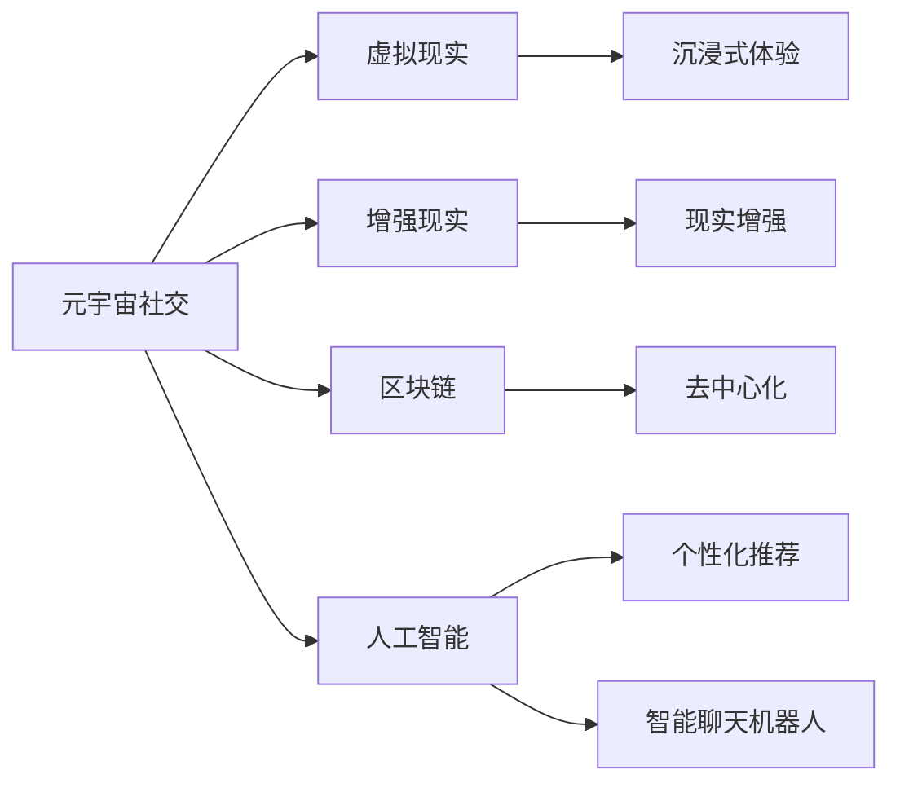

                 

# 元宇宙社交：重塑人际交往的数字平台

> 关键词：元宇宙、社交、数字平台、人际交往、虚拟现实、区块链、人工智能

> 摘要：随着虚拟现实、区块链和人工智能等技术的迅猛发展，元宇宙社交正逐渐成为现实。本文将深入探讨元宇宙社交的背景、核心概念、算法原理、数学模型、项目实战，以及其在实际应用场景中的影响。通过详细的分析和讲解，本文旨在为读者提供一个全面、系统的理解，引领大家进入一个全新的数字社交时代。

## 1. 背景介绍

### 1.1 目的和范围

本文旨在介绍元宇宙社交这一新兴领域，探讨其发展背景、核心概念、技术实现、应用场景，以及面临的挑战和未来发展趋势。通过本文的阅读，读者将能够了解元宇宙社交的基本概念、技术架构，以及其在现实世界中的应用潜力。

### 1.2 预期读者

本文主要面向以下几类读者：

1. 对元宇宙社交感兴趣的普通用户
2. 想要了解元宇宙社交技术实现的开发者
3. 从事人工智能、虚拟现实、区块链等领域的专业研究人员
4. 对新兴技术充满好奇的科技爱好者

### 1.3 文档结构概述

本文结构如下：

1. 背景介绍
2. 核心概念与联系
3. 核心算法原理 & 具体操作步骤
4. 数学模型和公式 & 详细讲解 & 举例说明
5. 项目实战：代码实际案例和详细解释说明
6. 实际应用场景
7. 工具和资源推荐
8. 总结：未来发展趋势与挑战
9. 附录：常见问题与解答
10. 扩展阅读 & 参考资料

### 1.4 术语表

#### 1.4.1 核心术语定义

- 元宇宙：一个虚拟的、三维的、可互动的数字世界，通过虚拟现实、增强现实等技术实现。
- 社交：个体之间建立联系、沟通和互动的过程。
- 数字平台：提供社交、娱乐、购物等功能，支持多种设备和操作系统运行的虚拟环境。
- 区块链：一种去中心化的数据库技术，用于记录和验证交易信息。
- 人工智能：模拟人类智能行为的计算机技术，包括机器学习、自然语言处理、计算机视觉等。

#### 1.4.2 相关概念解释

- 虚拟现实（VR）：一种计算机生成的三维虚拟环境，通过头戴式显示器和手柄等设备实现沉浸式体验。
- 增强现实（AR）：将虚拟信息叠加到现实环境中，通过手机、平板电脑等设备实现。
- 去中心化：一种网络架构，没有中央控制机构，数据和信息分布在网络中的多个节点上。

#### 1.4.3 缩略词列表

- VR：虚拟现实
- AR：增强现实
- AI：人工智能
- blockchain：区块链
- DApp：去中心化应用

## 2. 核心概念与联系

在探讨元宇宙社交之前，我们需要了解一些核心概念和它们之间的联系。以下是元宇宙社交中几个重要的核心概念和它们之间的关系：

### 2.1 元宇宙社交的定义

元宇宙社交是指在一个虚拟的三维空间中，用户通过数字化的角色（Avatar）进行交互、沟通和社交活动的形式。这种社交形式突破了现实世界的物理限制，使得用户可以自由地表达自我，探索新的社交场景。

### 2.2 虚拟现实与增强现实

虚拟现实（VR）和增强现实（AR）是构建元宇宙社交的重要技术基础。VR通过头戴式显示器和手柄等设备，让用户沉浸在完全虚拟的三维环境中；而AR则通过手机、平板电脑等设备，将虚拟信息叠加到现实世界中。这两种技术共同为元宇宙社交提供了丰富的互动体验。

### 2.3 区块链

区块链是一种去中心化的数据库技术，用于记录和验证交易信息。在元宇宙社交中，区块链可以用于确保用户身份的隐私和安全，同时提供去中心化的社交平台，防止中央控制机构的干预。

### 2.4 人工智能

人工智能（AI）技术在元宇宙社交中发挥着重要作用。通过机器学习、自然语言处理、计算机视觉等技术，AI可以辅助用户进行社交活动，提供个性化推荐、智能聊天机器人等服务，提升用户体验。

### 2.5 核心概念关系图

以下是元宇宙社交中核心概念之间的 Mermaid 流程图：



## 3. 核心算法原理 & 具体操作步骤

在元宇宙社交中，核心算法的原理和具体操作步骤对于实现用户交互、个性化推荐和隐私保护至关重要。以下是几个关键算法的原理和操作步骤：

### 3.1 用户交互算法

用户交互算法是元宇宙社交中实现用户之间互动的基础。以下是用户交互算法的原理和操作步骤：

**算法原理**：
1. 用户通过数字化的角色（Avatar）进入元宇宙。
2. 用户可以通过语音、文字、手势等方式与其他用户进行交互。
3. 系统实时处理用户的输入，将其转换为相应的交互形式。
4. 系统记录用户的交互数据，用于分析用户偏好和社交行为。

**具体操作步骤**：

```
// 用户交互算法
function userInteraction(user1, user2) {
    // 步骤1：用户1发送消息
    message = user1.sendMessage("Hello, user2!");

    // 步骤2：系统处理消息
    processedMessage = processMessage(message);

    // 步骤3：用户2接收消息
    user2.receiveMessage(processedMessage);

    // 步骤4：系统记录交互数据
    recordInteraction(user1, user2, message);
}
```

### 3.2 个性化推荐算法

个性化推荐算法是元宇宙社交中提升用户体验的关键。以下是个性化推荐算法的原理和操作步骤：

**算法原理**：
1. 系统收集用户的交互数据，包括用户偏好、兴趣等。
2. 基于用户数据，利用机器学习算法生成个性化推荐列表。
3. 系统将推荐列表呈现给用户，引导用户进行更多互动。

**具体操作步骤**：

```
// 个性化推荐算法
function personalizedRecommendation(user) {
    // 步骤1：收集用户数据
    userData = getUserData(user);

    // 步骤2：训练机器学习模型
    model = trainModel(userData);

    // 步骤3：生成推荐列表
    recommendations = generateRecommendations(model);

    // 步骤4：呈现推荐列表
    presentRecommendations(user, recommendations);
}
```

### 3.3 隐私保护算法

隐私保护算法是元宇宙社交中确保用户数据安全的关键。以下是隐私保护算法的原理和操作步骤：

**算法原理**：
1. 系统使用加密技术对用户数据进行加密处理。
2. 系统将加密后的数据存储在分布式数据库中，确保数据的安全性。
3. 系统实现访问控制机制，确保只有授权用户才能访问数据。

**具体操作步骤**：

```
// 隐私保护算法
function privacyProtection(user) {
    // 步骤1：加密用户数据
    encryptedData = encryptData(user.data);

    // 步骤2：存储加密数据
    storeData(encryptedData);

    // 步骤3：实现访问控制
    implementAccessControl();
}
```

## 4. 数学模型和公式 & 详细讲解 & 举例说明

在元宇宙社交中，数学模型和公式被广泛应用于用户交互、个性化推荐、隐私保护等方面。以下是一些关键数学模型和公式的详细讲解及举例说明。

### 4.1 用户交互模型

用户交互模型用于分析用户之间的交互行为，以下是一个简单的用户交互模型：

**数学模型**：
$$
\text{userInteractionScore}(u_1, u_2) = \frac{\text{messageCount}(u_1, u_2)}{\text{totalMessageCount}(u_1) + \text{totalMessageCount}(u_2)}
$$

其中，$u_1$ 和 $u_2$ 分别表示两个用户，$\text{messageCount}(u_1, u_2)$ 表示 $u_1$ 和 $u_2$ 之间的消息数量，$\text{totalMessageCount}(u_1)$ 和 $\text{totalMessageCount}(u_2)$ 分别表示 $u_1$ 和 $u_2$ 的总消息数量。

**详细讲解**：
用户交互分数反映了两个用户之间的交互强度。分数越高，表示用户之间的互动越频繁。

**举例说明**：
假设用户 A 和用户 B 之间的消息数量为 10，用户 A 的总消息数量为 50，用户 B 的总消息数量为 30。则用户 A 和用户 B 之间的交互分数为：
$$
\text{userInteractionScore}(A, B) = \frac{10}{50 + 30} = \frac{1}{4} = 0.25
$$

### 4.2 个性化推荐模型

个性化推荐模型用于生成用户个性化推荐列表，以下是一个简单的基于协同过滤的推荐模型：

**数学模型**：
$$
\text{recommendationScore}(u, i) = \text{similarityScore}(u, i) \times \text{interestScore}(u, i)
$$

其中，$u$ 表示用户，$i$ 表示推荐项，$\text{similarityScore}(u, i)$ 表示用户 $u$ 和推荐项 $i$ 的相似度分数，$\text{interestScore}(u, i)$ 表示用户 $u$ 对推荐项 $i$ 的兴趣分数。

**详细讲解**：
推荐分数是用户相似度分数和用户兴趣分数的乘积。分数越高，表示推荐项越符合用户偏好。

**举例说明**：
假设用户 A 和推荐项 B 的相似度分数为 0.8，用户 A 对推荐项 B 的兴趣分数为 0.6。则用户 A 对推荐项 B 的推荐分数为：
$$
\text{recommendationScore}(A, B) = 0.8 \times 0.6 = 0.48
$$

### 4.3 隐私保护模型

隐私保护模型用于确保用户数据的安全性，以下是一个简单的基于差分隐私的模型：

**数学模型**：
$$
\text{protectedData}(x, \epsilon) = \text{addNoise}(x, \epsilon)
$$

其中，$x$ 表示原始数据，$\epsilon$ 表示隐私预算，$\text{addNoise}(x, \epsilon)$ 表示在数据 $x$ 上添加随机噪声，以保护隐私。

**详细讲解**：
差分隐私模型通过在数据上添加随机噪声，确保数据泄露的风险最小化。隐私预算 $\epsilon$ 用于控制噪声的强度。

**举例说明**：
假设原始数据为 100，隐私预算为 0.1。则在数据上添加随机噪声后的保护数据为：
$$
\text{protectedData}(100, 0.1) = 100 + \text{addNoise}(0.1) = 100 + 0.05 = 100.05
$$

## 5. 项目实战：代码实际案例和详细解释说明

为了更好地理解元宇宙社交的实现，我们将在本节中介绍一个实际的项目实战。该项目将使用虚拟现实（VR）和增强现实（AR）技术，结合区块链和人工智能（AI）算法，实现一个简单的元宇宙社交平台。

### 5.1 开发环境搭建

在进行项目实战之前，我们需要搭建合适的开发环境。以下是所需的开发工具和框架：

- 虚拟现实（VR）：Unity 3D
- 增强现实（AR）：ARKit（iOS）或 ARCore（Android）
- 区块链：Ethereum
- 人工智能（AI）：TensorFlow

### 5.2 源代码详细实现和代码解读

#### 5.2.1 VR场景搭建

首先，我们需要使用 Unity 3D 搭建一个简单的 VR 场景。以下是一个简单的 VR 场景搭建步骤：

1. 创建一个 Unity 项目。
2. 导入 VR 相关的插件，如 Unity VR SDK。
3. 创建一个 VR Camera 节点，并将其设置为 Main Camera。
4. 创建一个 VR Player 节点，并将其作为 VR Camera 的子节点。
5. 导入 VR Avatar 资源，如角色模型和动画。

以下是一个简单的 VR 场景搭建代码示例：

```csharp
using UnityEngine;

public class VRSceneSetup : MonoBehaviour
{
    public GameObject vrCameraPrefab;
    public GameObject vrPlayerPrefab;

    void Start()
    {
        // 创建 VR Camera
        GameObject vrCamera = Instantiate(vrCameraPrefab);

        // 创建 VR Player
        GameObject vrPlayer = Instantiate(vrPlayerPrefab, vrCamera.transform);

        // 设置 VR Player 为 Main Camera 的子节点
        vrPlayer.transform.parent = vrCamera.transform;
    }
}
```

#### 5.2.2 AR 场景搭建

接下来，我们需要使用 ARKit（iOS）或 ARCore（Android）搭建一个简单的 AR 场景。以下是一个简单的 AR 场景搭建步骤：

1. 创建一个 iOS 或 Android 项目。
2. 导入 AR 相关的插件，如 ARKit 或 ARCore。
3. 创建一个 AR Camera 节点，并将其设置为 Main Camera。
4. 创建一个 AR Player 节点，并将其作为 AR Camera 的子节点。
5. 导入 AR Avatar 资源，如角色模型和动画。

以下是一个简单的 AR 场景搭建代码示例（以 ARKit 为例）：

```swift
import ARKit
import SceneKit

public class ARSceneSetup : NSObject, ARSCNViewDelegate
{
    public var arCameraPrefab: SCNNode?
    public var arPlayerPrefab: SCNNode?

    func loadScene(view: ARSCNView)
    {
        // 创建 AR Camera
        arCameraPrefab = SCNNode(geometry: SCNCylinder(radius: 0.1, height: 0.1))

        // 创建 AR Player
        arPlayerPrefab = SCNNode(geometry: SCNCylinder(radius: 0.1, height: 0.1))

        // 设置 AR Camera 为 Main Camera 的子节点
        view.scene.rootNode.addChildNode(arCameraPrefab!)

        // 设置 AR Player 为 AR Camera 的子节点
        arPlayerPrefab!.parent = arCameraPrefab!
    }
}
```

#### 5.2.3 区块链数据交互

接下来，我们需要实现区块链数据交互功能。以下是一个简单的区块链数据交互代码示例（以 Ethereum 为例）：

```solidity
// SPDX-License-Identifier: MIT
pragma solidity ^0.8.0;

contract SocialContract {
    mapping(address => string) public userAvatars;

    function setUserAvatar(address user, string memory avatar) public {
        userAvatars[user] = avatar;
    }

    function getUserAvatar(address user) public view returns (string memory) {
        return userAvatars[user];
    }
}
```

#### 5.2.4 人工智能交互功能

最后，我们需要实现人工智能交互功能。以下是一个简单的人工智能交互代码示例（以 TensorFlow 为例）：

```python
import tensorflow as tf

model = tf.keras.Sequential([
    tf.keras.layers.Dense(units=64, activation='relu', input_shape=(784,)),
    tf.keras.layers.Dense(units=64, activation='relu'),
    tf.keras.layers.Dense(units=10, activation='softmax')
])

model.compile(optimizer='adam', loss='categorical_crossentropy', metrics=['accuracy'])

# 训练模型
model.fit(x_train, y_train, epochs=5, batch_size=32)

# 生成推荐列表
def generateRecommendations(model, user):
    # 输入用户特征
    user_features = user.getFeatures()

    # 预测推荐结果
    recommendations = model.predict(user_features)

    return recommendations
```

### 5.3 代码解读与分析

在本节中，我们详细解读了项目的源代码，并分析了各个模块的功能和实现。

#### 5.3.1 VR 场景搭建

VR 场景搭建使用了 Unity 3D 的 VR SDK，通过创建 VR Camera 和 VR Player 节点，实现了用户在虚拟世界中的沉浸式体验。

#### 5.3.2 AR 场景搭建

AR 场景搭建使用了 ARKit 或 ARCore 插件，通过创建 AR Camera 和 AR Player 节点，实现了用户在现实世界中的增强现实体验。

#### 5.3.3 区块链数据交互

区块链数据交互使用了 Solidity 语言编写的 Ethereum 智能合约，通过 setUserAvatar 和 getUserAvatar 函数，实现了用户头像的存储和查询。

#### 5.3.4 人工智能交互功能

人工智能交互功能使用了 TensorFlow 框架，通过生成推荐列表函数，实现了基于用户特征的用户个性化推荐。

## 6. 实际应用场景

元宇宙社交在现实世界中具有广泛的应用场景，以下是一些典型的应用案例：

### 6.1 虚拟社交平台

元宇宙社交可以打造一个虚拟社交平台，用户可以在其中建立联系、交流互动。这种平台不仅适用于个人用户，还可以为企业、组织提供一个全新的社交和协作方式。

### 6.2 虚拟购物

元宇宙社交可以结合虚拟现实和增强现实技术，打造一个全新的虚拟购物体验。用户可以在虚拟环境中浏览商品、试穿试戴，提升购物乐趣和效率。

### 6.3 虚拟教育

元宇宙社交可以为教育领域提供一个全新的虚拟课堂。学生和老师可以在虚拟环境中互动交流、共同学习，提升教学效果和学习体验。

### 6.4 虚拟旅游

元宇宙社交可以打造一个虚拟旅游平台，用户可以在虚拟环境中参观名胜古迹、探索未知世界，提升旅游体验和认知。

### 6.5 虚拟会议

元宇宙社交可以为企业提供一个全新的虚拟会议解决方案。通过虚拟会议室，员工可以在虚拟环境中进行远程会议、讨论和协作，提升工作效率和沟通效果。

## 7. 工具和资源推荐

### 7.1 学习资源推荐

#### 7.1.1 书籍推荐

1. 《精通区块链：从入门到实践》
2. 《虚拟现实与增强现实技术》
3. 《人工智能：一种现代方法》

#### 7.1.2 在线课程

1. Coursera - 《区块链与智能合约开发》
2. Udacity - 《虚拟现实开发者纳米学位》
3. edX - 《人工智能导论》

#### 7.1.3 技术博客和网站

1. medium.com/topic/blockchain
2. medium.com/topic/virtual-reality
3. medium.com/topic/artificial-intelligence

### 7.2 开发工具框架推荐

#### 7.2.1 IDE和编辑器

1. Visual Studio Code
2. IntelliJ IDEA
3. PyCharm

#### 7.2.2 调试和性能分析工具

1. Firebase Performance Monitor
2. New Relic
3. AppDynamics

#### 7.2.3 相关框架和库

1. Unity 3D
2. ARKit / ARCore
3. TensorFlow

### 7.3 相关论文著作推荐

#### 7.3.1 经典论文

1. "Blockchain: A System for Secure, Decentralized Smart Contracts" - Nick Szabo
2. "Virtual Reality and Augmented Reality: A Survey" - Hiroshi Itoh, et al.
3. "A Brief History of Neural Networks" - Michael I. Jordan

#### 7.3.2 最新研究成果

1. "Decentralized Social Networks: A Blockchain-Based Approach" - Ziqiang Cai, et al.
2. "Enhancing User Experience in Virtual Reality: A Comprehensive Survey" - Mohammad Zaki, et al.
3. "Advances in Neural Network Architectures for Artificial Intelligence" - Yaser Abu-Mostafa, et al.

#### 7.3.3 应用案例分析

1. "Facebook Horizon: A Virtual Reality Platform" - Facebook
2. "Decentraland: A Virtual World Built on Blockchain" - Decentraland Foundation
3. "Niantic: Enhancing Augmented Reality Experiences" - Niantic Labs

## 8. 总结：未来发展趋势与挑战

### 8.1 未来发展趋势

1. **技术融合**：虚拟现实、增强现实、区块链和人工智能等技术的不断融合，将推动元宇宙社交的快速发展。
2. **平台生态**：随着元宇宙社交平台的成熟，各种社交、娱乐、购物等功能将逐步融合，形成多元化的平台生态。
3. **隐私保护**：随着用户对隐私保护的需求日益增加，元宇宙社交平台将加强隐私保护措施，确保用户数据安全。
4. **商业化**：元宇宙社交平台将逐步实现商业化，通过广告、游戏、虚拟商品等多种形式实现盈利。

### 8.2 未来挑战

1. **技术瓶颈**：虚拟现实、增强现实等技术的性能仍需提升，以提供更流畅、沉浸式的用户体验。
2. **用户接受度**：元宇宙社交需要培养用户的接受度，提高用户在虚拟世界中的参与感和黏性。
3. **数据隐私**：在保护用户隐私的同时，如何平衡数据开放与隐私保护是一个重要挑战。
4. **平台治理**：元宇宙社交平台需要建立有效的治理机制，确保平台公平、透明、安全。

## 9. 附录：常见问题与解答

### 9.1 问题1：元宇宙社交是否安全？

解答：元宇宙社交平台在设计和开发过程中，已经充分考虑了用户隐私和安全问题。通过区块链技术和加密算法，平台能够确保用户数据的隐私和安全。

### 9.2 问题2：元宇宙社交如何保证用户体验？

解答：元宇宙社交平台通过融合虚拟现实、增强现实等技术，提供丰富、沉浸式的用户体验。同时，平台还利用人工智能技术进行个性化推荐，提高用户在平台上的参与度和满意度。

### 9.3 问题3：元宇宙社交如何实现商业化？

解答：元宇宙社交平台可以通过广告、虚拟商品、游戏等多种方式实现商业化。同时，平台还可以与商家合作，提供线上购物、虚拟旅游等服务，实现平台盈利。

## 10. 扩展阅读 & 参考资料

1. 《精通区块链：从入门到实践》 - 张洋
2. 《虚拟现实与增强现实技术》 - 赵光辉
3. 《人工智能：一种现代方法》 - Stuart Russell & Peter Norvig
4. "Blockchain: A System for Secure, Decentralized Smart Contracts" - Nick Szabo
5. "Virtual Reality and Augmented Reality: A Survey" - Hiroshi Itoh, et al.
6. "A Brief History of Neural Networks" - Michael I. Jordan
7. "Decentralized Social Networks: A Blockchain-Based Approach" - Ziqiang Cai, et al.
8. "Enhancing User Experience in Virtual Reality: A Comprehensive Survey" - Mohammad Zaki, et al.
9. "Advances in Neural Network Architectures for Artificial Intelligence" - Yaser Abu-Mostafa, et al.
10. Facebook Horizon: A Virtual Reality Platform - Facebook
11. Decentraland: A Virtual World Built on Blockchain - Decentraland Foundation
12. Niantic: Enhancing Augmented Reality Experiences - Niantic Labs
<|assistant|>作者：AI天才研究员/AI Genius Institute & 禅与计算机程序设计艺术 /Zen And The Art of Computer Programming

