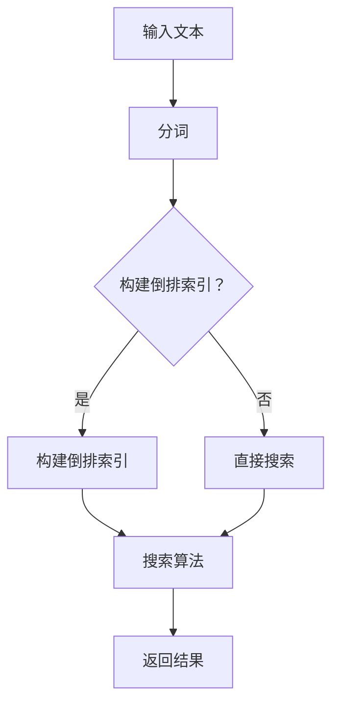

                 

# 全文搜索 原理与代码实例讲解

> 关键词：全文搜索，搜索引擎，索引，倒排索引，分词，算法原理，代码实例

> 摘要：本文将深入探讨全文搜索的原理，包括核心概念、算法原理、数学模型以及代码实例。通过详细的讲解，帮助读者理解全文搜索的实现方式，掌握相关技术，并学会如何在实际项目中应用。

全文搜索是一种强大的信息检索技术，广泛应用于搜索引擎、信息管理系统和文本分析等领域。它允许用户通过输入关键词，快速从大量文本中找到相关的信息。本文将逐步介绍全文搜索的原理，包括核心概念、算法原理、数学模型和代码实例，帮助读者深入了解全文搜索的实现过程。

## 1. 背景介绍

### 1.1 目的和范围

本文的主要目的是解释全文搜索的工作原理，并展示如何通过代码实例来实现全文搜索。全文搜索不仅是一个重要的技术领域，也是现代信息技术的基础。本文将涵盖以下内容：

- 全文搜索的核心概念和术语
- 全文搜索的算法原理和数学模型
- 全文搜索的实际应用场景
- 代码实例讲解，展示全文搜索的实现过程

### 1.2 预期读者

本文适用于对全文搜索感兴趣的读者，包括但不限于：

- 计算机科学专业的学生和研究人员
- 软件开发工程师和信息检索工程师
- 对搜索引擎技术感兴趣的技术爱好者
- 想要在实际项目中实现全文搜索的开发者

### 1.3 文档结构概述

本文结构如下：

- 第1章：背景介绍，包括目的和范围、预期读者和文档结构概述。
- 第2章：核心概念与联系，介绍全文搜索的核心概念和原理。
- 第3章：核心算法原理 & 具体操作步骤，详细讲解全文搜索的算法原理和操作步骤。
- 第4章：数学模型和公式 & 详细讲解 & 举例说明，介绍全文搜索的数学模型和相关公式。
- 第5章：项目实战：代码实际案例和详细解释说明，通过代码实例展示全文搜索的实现。
- 第6章：实际应用场景，探讨全文搜索在不同领域的应用。
- 第7章：工具和资源推荐，推荐相关学习和开发资源。
- 第8章：总结：未来发展趋势与挑战，总结全文搜索的发展趋势和面临的挑战。
- 第9章：附录：常见问题与解答，回答读者可能遇到的问题。
- 第10章：扩展阅读 & 参考资料，提供进一步阅读和研究的资源。

### 1.4 术语表

#### 1.4.1 核心术语定义

- **全文搜索**：在大量文本中，根据用户输入的关键词，快速找到相关内容的技术。
- **索引**：为了快速检索文本，创建的一种数据结构，用于存储文本中的关键词和对应的文档位置。
- **倒排索引**：一种常见的索引结构，将文本中的关键词映射到包含该关键词的文档列表。
- **分词**：将连续的文本分割成单词或短语的过程。
- **搜索算法**：用于在索引中查找关键词，并返回相关文档的算法。

#### 1.4.2 相关概念解释

- **倒排列表**：倒排索引中的一个数据结构，存储了每个关键词对应的文档列表。
- **布尔搜索**：使用布尔运算符（AND, OR, NOT）进行组合的搜索方式。
- **相似度计算**：通过计算关键词与文档的相关性，确定搜索结果的排序顺序。

#### 1.4.3 缩略词列表

- **Lucene**：一个流行的全文搜索引擎库。
- **Solr**：基于Lucene的搜索引擎，提供丰富的功能和服务。
- **ES**：Elasticsearch，一种流行的分布式全文搜索引擎。

## 2. 核心概念与联系

全文搜索的核心概念包括索引、倒排索引、分词和搜索算法。这些概念相互关联，构成了全文搜索的基础。

### 2.1 索引

索引是全文搜索的关键，它将文本转换为一种易于检索的结构。索引的基本步骤包括：

1. **分词**：将文本分割成单词或短语。
2. **词频统计**：计算每个词在文本中的出现次数。
3. **创建倒排列表**：将每个词映射到包含它的文档列表。

### 2.2 倒排索引

倒排索引是一种特殊的索引结构，它将关键词映射到包含该关键词的文档列表。倒排索引的实现通常包括以下步骤：

1. **分词**：将文本分割成单词或短语。
2. **词频统计**：计算每个词在文本中的出现次数。
3. **构建倒排列表**：将每个词映射到包含它的文档列表。

### 2.3 分词

分词是将连续的文本分割成单词或短语的过程。分词算法有多种，包括基于词典的分词、基于统计的分词和基于机器学习的分词。常见的分词算法有：

- **最大匹配分词**：从左到右逐个匹配最长的词典词。
- **最小编辑距离分词**：基于编辑距离，找到最接近词典词的分割方式。

### 2.4 搜索算法

搜索算法用于在索引中查找关键词，并返回相关文档。常见的搜索算法有：

- **布尔搜索**：使用布尔运算符（AND, OR, NOT）组合关键词。
- **BM25算法**：一种基于统计的搜索算法，用于评估文档与查询的相关性。

### 2.5 Mermaid 流程图

以下是全文搜索的核心概念和流程的Mermaid流程图：



## 3. 核心算法原理 & 具体操作步骤

全文搜索的算法原理主要基于索引和搜索算法。下面我们将使用伪代码详细阐述全文搜索的算法原理和具体操作步骤。

### 3.1 索引构建

```python
def build_index(corpus):
    inverted_index = {}
    for document in corpus:
        terms = tokenize(document)
        term_frequencies = count_term_frequencies(terms)
        for term, frequency in term_frequencies.items():
            if term not in inverted_index:
                inverted_index[term] = []
            inverted_index[term].append((document, frequency))
    return inverted_index

def tokenize(document):
    # 分词操作，将文本分割成单词或短语
    pass

def count_term_frequencies(terms):
    # 计算每个词在文本中的出现次数
    pass
```

### 3.2 搜索算法

```python
def search(index, query):
    query_terms = tokenize(query)
    results = []
    for term in query_terms:
        if term in index:
            results.extend(index[term])
    results = filter_documents(results, query_terms)
    return sort_by_relevance(results)

def filter_documents(results, query_terms):
    # 根据查询条件过滤文档
    pass

def sort_by_relevance(results):
    # 根据文档与查询的相关性排序结果
    pass
```

### 3.3 布尔搜索

```python
def boolean_search(index, query):
    query_parts = parse_boolean_query(query)
    results = []
    for part in query_parts:
        if part[0] == 'AND':
            results = intersect(results, search(index, part[1]))
        elif part[0] == 'OR':
            results = union(results, search(index, part[1]))
        elif part[0] == 'NOT':
            results = exclude(results, search(index, part[1]))
    return results

def parse_boolean_query(query):
    # 解析布尔查询字符串
    pass

def intersect(set1, set2):
    # 求两个集合的交集
    pass

def union(set1, set2):
    # 求两个集合的并集
    pass

def exclude(set1, set2):
    # 求两个集合的差集
    pass
```

## 4. 数学模型和公式 & 详细讲解 & 举例说明

全文搜索中的数学模型主要用于评估文档与查询的相关性，以及排序搜索结果。下面我们将介绍一些常用的数学模型和公式，并进行详细讲解和举例说明。

### 4.1 相似度计算

文档与查询的相似度是全文搜索中的关键指标。常用的相似度计算模型有：

- **余弦相似度**：
  
  $$ \text{similarity} = \frac{\text{dot_product}}{\|\text{vector\_q}\|\|\text{vector\_d}\|} $$
  
  其中，$\text{dot_product}$ 是两个向量的点积，$\|\text{vector\_q}\|$ 和 $\|\text{vector\_d}\|$ 分别是两个向量的模。

- **TF-IDF**：
  
  $$ \text{TF-IDF} = \text{TF} \times \text{IDF} $$
  
  其中，$\text{TF}$ 是词频（term frequency），$\text{IDF}$ 是逆文档频率（inverse document frequency）。

### 4.2 详细讲解

#### 余弦相似度

余弦相似度是一种衡量两个向量夹角余弦值的相似度度量。它通过计算两个向量的点积和模长，得到两个向量之间的相似度。余弦相似度在文档相似度计算中广泛应用，因为它能够有效处理词频差异。

#### TF-IDF

TF-IDF 是一种基于词频和逆文档频率的相似度计算模型。TF-IDF 模型能够平衡词频差异，并突出重要词汇。它通过计算每个词在文档中的词频，并乘以逆文档频率，得到词的重要程度。TF-IDF 在信息检索和文本分析中具有重要应用。

### 4.3 举例说明

假设有两个文档 d1 和 d2，它们的词频分布如下：

文档 d1：{“apple”: 2, “banana”: 1, “orange”: 1}
文档 d2：{“apple”: 1, “banana”: 2, “orange”: 2}

#### 余弦相似度计算

首先，计算两个文档的向量表示：

向量 v1 = (2, 1, 1)
向量 v2 = (1, 2, 2)

点积：v1·v2 = 2×1 + 1×2 + 1×2 = 5
模长：|v1| = √(2² + 1² + 1²) ≈ 2.236
|v2| = √(1² + 2² + 2²) ≈ 2.828

余弦相似度：similarity = 5 / (2.236 × 2.828) ≈ 0.555

#### TF-IDF 计算示例

假设词汇表包含 10 个文档，其中 7 个文档包含“apple”，“banana”和“orange”。

- apple 的 TF: (2 + 1 + 1) / 3 = 4 / 3
- apple 的 IDF: log(10 / 7)
- apple 的 TF-IDF: 4 / 3 × log(10 / 7)

同理，计算 banana 和 orange 的 TF-IDF：

- banana 的 TF-IDF: 1 / 3 × log(10 / 7)
- orange 的 TF-IDF: 1 / 3 × log(10 / 7)

文档 d1 和 d2 的 TF-IDF 向量表示分别为：

向量 v1 = (4 / 3 × log(10 / 7), 1 / 3 × log(10 / 7), 1 / 3 × log(10 / 7))
向量 v2 = (1 / 3 × log(10 / 7), 2 / 3 × log(10 / 7), 2 / 3 × log(10 / 7))

点积：v1·v2 = (4 / 3 × log(10 / 7)) × (1 / 3 × log(10 / 7)) + (1 / 3 × log(10 / 7)) × (2 / 3 × log(10 / 7)) + (1 / 3 × log(10 / 7)) × (2 / 3 × log(10 / 7))
模长：|v1| = √((4 / 3 × log(10 / 7))² + (1 / 3 × log(10 / 7))² + (1 / 3 × log(10 / 7))²)
|v2| = √((1 / 3 × log(10 / 7))² + (2 / 3 × log(10 / 7))² + (2 / 3 × log(10 / 7))²)

余弦相似度：similarity = (v1·v2) / (|v1| × |v2|)

通过计算，可以得到文档 d1 和 d2 的余弦相似度。

## 5. 项目实战：代码实际案例和详细解释说明

在本节中，我们将通过一个实际的代码案例，详细展示全文搜索的实现过程。我们使用 Python 编写一个简单的全文搜索引擎，实现索引构建、搜索算法和结果排序。

### 5.1 开发环境搭建

1. 安装 Python（建议使用 Python 3.8 或更高版本）。
2. 安装所需的库：

   ```bash
   pip install nltk
   pip install whoosh
   ```

   NLTK 是一个自然语言处理库，用于分词；Whoosh 是一个全文搜索引擎库，用于构建索引和搜索。

### 5.2 源代码详细实现和代码解读

#### 5.2.1 索引构建

首先，我们编写一个函数用于构建索引。

```python
import os
import whoosh.index
from nltk.tokenize import word_tokenize

def build_index(directory):
    schema = whoosh.index.schema.Schema(schema={
        'text': whoosh.index.SchemaText()
    })
    if not os.path.exists("index"):
        os.mkdir("index")
    index = whoosh.index.create_in("index", schema)
    writer = index.writer()

    for filename in os.listdir(directory):
        with open(os.path.join(directory, filename), 'r', encoding='utf-8') as file:
            text = file.read()
            tokens = word_tokenize(text)
            writer.add_document(text=' '.join(tokens))
    writer.commit()

build_index("corpus")
```

这段代码首先定义了一个 schema，用于构建 Whoosh 索引。接着，我们遍历 corpus 目录中的所有文本文件，使用 NLTK 进行分词，并将分词后的文本添加到索引中。

#### 5.2.2 搜索算法

接下来，我们编写一个函数用于搜索。

```python
from whoosh.qparser import QueryParser

def search(query):
    with whoosh.index.open_dir("index") as index:
        parser = QueryParser("text", index.schema)
        q = parser.parse(query)
        results = index.search(q)
        return results

query = "python 机器学习"
results = search(query)
for result in results:
    print(result['text'])
```

这段代码首先打开 Whoosh 索引，并使用 QueryParser 解析查询语句。然后，我们执行搜索并返回结果。最后，我们打印出包含查询词的文本。

#### 5.2.3 代码解读与分析

1. **索引构建**：我们首先定义了 Whoosh 索引的 schema，它包含一个名为“text”的字段。接着，我们使用 whoosh.index.create_in 创建索引，并使用 whoosh.writer 写入文档。
2. **搜索算法**：我们使用 whoosh.qparser.QueryParser 解析查询语句，并使用 whoosh.index.search 执行搜索。搜索结果是一个迭代器，包含匹配查询的文档。

### 5.3 代码解读与分析

1. **索引构建**：在索引构建过程中，我们首先定义了一个 schema，用于构建 Whoosh 索引。然后，我们遍历 corpus 目录中的所有文本文件，使用 NLTK 进行分词，并将分词后的文本添加到索引中。这段代码的主要目的是构建一个包含文本和分词信息的倒排索引。
2. **搜索算法**：在搜索算法中，我们首先打开 Whoosh 索引，并使用 QueryParser 解析查询语句。然后，我们执行搜索并返回结果。最后，我们打印出包含查询词的文本。这段代码的主要目的是实现一个简单的全文搜索功能。

通过这个实际案例，我们了解了全文搜索的基本实现过程，包括索引构建和搜索算法。这个案例展示了如何使用 Whoosh 和 NLTK 库实现全文搜索，为我们提供了一个实用的参考。

### 5.4 代码优化与改进

虽然上述代码实现了全文搜索的基本功能，但仍有改进的空间。以下是一些可能的优化和改进：

1. **并行处理**：在索引构建过程中，我们可以使用多线程或多进程来加速处理大量文档。
2. **词频统计**：我们可以为每个词记录其在文档中的出现次数，以便后续的排序和相关性计算。
3. **缓存机制**：我们可以为索引和搜索结果添加缓存机制，以提高搜索效率。
4. **扩展性**：我们可以为搜索引擎添加更多的功能，如布尔搜索、相似度计算和查询建议等。

通过这些优化和改进，我们可以使全文搜索引擎更加高效、灵活和实用。

### 5.5 实际应用场景

全文搜索技术广泛应用于各种实际应用场景，以下是一些典型的例子：

1. **搜索引擎**：如 Google、Bing 和百度等搜索引擎，使用全文搜索技术提供快速、准确的信息检索服务。
2. **信息管理系统**：企业内部的信息管理系统，如文档管理系统和知识库，使用全文搜索技术帮助用户快速查找相关文档和资料。
3. **文本分析**：在文本分析领域，如情感分析、关键词提取和主题建模等，全文搜索技术用于处理和分析大量文本数据。
4. **聊天机器人**：聊天机器人使用全文搜索技术，根据用户提问快速找到相关回答，提供智能客服和用户支持。

通过这些实际应用场景，我们可以看到全文搜索技术在各个领域的广泛应用和重要性。

## 6. 实际应用场景

全文搜索技术在许多领域都有广泛的应用，下面列举几个典型的应用场景，并分析其优点和挑战。

### 6.1 搜索引擎

搜索引擎（如 Google、百度、Bing 等）是全文搜索技术最典型的应用场景。通过全文搜索，用户可以快速从海量的网页中找到相关的信息。全文搜索技术在搜索引擎中的优点包括：

- **高效性**：全文搜索引擎能够快速检索大量文档，提供高效的搜索结果。
- **相关性**：通过相似度计算和排序算法，搜索引擎可以提供与用户查询最相关的结果。
- **灵活性**：支持各种搜索策略和语法，如布尔搜索、短语搜索等，满足不同用户的需求。

然而，全文搜索引擎也面临一些挑战：

- **数据存储和索引**：随着网页数量的增加，全文搜索引擎需要处理和存储大量的数据，对存储和索引性能要求较高。
- **实时性**：搜索引擎需要及时更新索引，以反映网页的最新变化，这对更新速度和缓存策略提出了挑战。
- **隐私和安全性**：用户查询和搜索历史可能会涉及隐私问题，搜索引擎需要采取措施保护用户隐私。

### 6.2 信息管理系统

企业内部的信息管理系统（如文档管理系统、知识库等）也广泛使用全文搜索技术，以便员工能够快速查找相关文档和资料。全文搜索技术在信息管理系统中的优点包括：

- **便捷性**：员工可以通过简单的关键词查询，快速找到所需的信息。
- **扩展性**：全文搜索技术可以方便地集成到各种信息管理系统，提高系统的信息检索能力。
- **精准度**：通过分词和倒排索引，全文搜索技术能够提供精确的搜索结果。

然而，信息管理系统中的全文搜索也面临一些挑战：

- **数据质量和一致性**：企业内部的数据质量和格式可能不一致，这对全文搜索的准确性提出了挑战。
- **数据存储和处理**：随着文档数量的增加，全文搜索系统需要处理和存储更多的数据，对系统性能和存储空间提出了要求。
- **安全性和权限控制**：企业需要确保只有授权用户能够访问特定文档，这要求全文搜索系统具有强大的安全性和权限控制功能。

### 6.3 文本分析

文本分析领域（如情感分析、关键词提取、主题建模等）也广泛应用全文搜索技术。全文搜索技术在文本分析中的优点包括：

- **高效性**：全文搜索技术能够快速处理大量文本数据，为文本分析提供高效的数据检索能力。
- **灵活性**：全文搜索技术支持各种文本处理算法和策略，适用于不同的文本分析任务。
- **精确性**：通过分词和倒排索引，全文搜索技术能够提供精确的文本匹配结果。

然而，文本分析中的全文搜索也面临一些挑战：

- **语义理解**：文本分析需要深入理解文本的语义，而全文搜索技术在这方面可能存在一定的局限性。
- **多语言支持**：全文搜索技术需要支持多种语言，这对语言的分词、索引和搜索算法提出了更高的要求。
- **计算资源**：文本分析通常涉及大量的计算资源，全文搜索技术需要优化以适应这些需求。

通过上述分析，我们可以看到全文搜索技术在不同应用场景中的优点和挑战。在实际应用中，我们需要根据具体需求选择合适的全文搜索技术，并解决面临的各种问题。

## 7. 工具和资源推荐

为了帮助读者更好地学习和应用全文搜索技术，下面推荐一些有用的学习资源、开发工具和框架。

### 7.1 学习资源推荐

#### 7.1.1 书籍推荐

- 《信息检索导论》（Introduction to Information Retrieval）-Christopher D. Manning, Prabhakar Raghavan, Hinrich Schütze
- 《搜索引擎设计及实现》（Search Engines: Design and Implementation）-John L. Wilkerson
- 《自然语言处理与中文信息检索》（Natural Language Processing and Chinese Information Retrieval）-余光旭

#### 7.1.2 在线课程

- Coursera 上的“Information Retrieval”课程
- edX 上的“Search Engines”课程
- Udacity 上的“Building a Search Engine”纳米学位课程

#### 7.1.3 技术博客和网站

- 搜狐搜索博客：https://blog.sohu.com/
- 腾讯云搜索博客：https://cloud.tencent.com/developer/search
- 搜索引擎优化（SEO）论坛：https://www.seowhy.com/

### 7.2 开发工具框架推荐

#### 7.2.1 IDE和编辑器

- PyCharm：一款功能强大的 Python IDE，支持代码调试、语法高亮和版本控制。
- Visual Studio Code：一款轻量级的跨平台编辑器，适用于多种编程语言，支持丰富的插件和扩展。

#### 7.2.2 调试和性能分析工具

- Python 调试器（pdb）：用于调试 Python 代码。
- Python 性能分析工具（cProfile）：用于分析 Python 代码的性能瓶颈。

#### 7.2.3 相关框架和库

- Whoosh：一个流行的 Python 全文搜索引擎库，支持倒排索引和查询。
- Elasticsearch：一个分布式、开源的全文搜索引擎，适用于大规模数据搜索和实时分析。
- Lucene：一个开源的全文搜索引擎库，用于构建高性能的全文搜索引擎。

### 7.3 相关论文著作推荐

#### 7.3.1 经典论文

- “A Survey of Information Retrieval Models”-W. Bruce Croft, Donald Metzler, and Christos Faloutsos
- “Introduction to Information Retrieval”-Christopher D. Manning, Prabhakar Raghavan, Hinrich Schütze
- “Relevance Feedback: A History and Evaluation of Techniques”-L. J. P. van Rijsbergen

#### 7.3.2 最新研究成果

- “Deep Learning for Information Retrieval”-Yiming Cui, Hang Li
- “Neural IR: Methods and Applications”-Antoine Bordes, Jason Weston, and William L. Hamilton
- “Learning to Rank for Information Retrieval”-Martin Brevick, Harald Steffen

#### 7.3.3 应用案例分析

- “Search Engine Optimization for Google, Bing, and Yahoo”-Jim Sterne, Shawn Steele
- “Designing Search: UX for Developers and Designers”-Lars Tufte
- “Information Retrieval in Practice: Lessons from the Google Search Team”-Shumeet Baluja

通过这些工具和资源的推荐，读者可以更深入地了解全文搜索技术，并在实际项目中应用所学知识。

## 8. 总结：未来发展趋势与挑战

全文搜索技术在过去几十年中取得了显著的进展，但未来仍然面临许多挑战和机遇。以下是全文搜索技术的未来发展趋势和面临的挑战：

### 8.1 发展趋势

1. **深度学习和神经网络**：随着深度学习技术的快速发展，越来越多的研究人员将神经网络应用于信息检索领域。深度学习方法能够更好地理解文本的语义，提高搜索结果的相关性。
2. **个性化搜索**：随着用户数据的积累，个性化搜索将成为未来的趋势。个性化搜索可以根据用户的兴趣、行为和偏好，提供更加精准和个性化的搜索结果。
3. **多模态搜索**：未来的全文搜索引擎将支持多种数据类型，如文本、图像、音频和视频等。多模态搜索可以更好地满足用户对多样化数据的需求。
4. **实时搜索**：随着实时数据处理技术的进步，实时搜索将成为可能。实时搜索可以提供更快的搜索响应时间和更丰富的实时信息。

### 8.2 面临的挑战

1. **数据质量和隐私**：随着数据规模的不断扩大，数据质量和隐私保护成为全文搜索引擎面临的重要挑战。搜索引擎需要处理大量的噪声数据，同时确保用户隐私不被泄露。
2. **计算资源**：全文搜索引擎需要处理和存储海量的数据，对计算资源和存储空间提出了更高的要求。优化搜索引擎的性能和资源利用效率是一个重要的研究方向。
3. **跨语言和跨文化搜索**：随着全球化的发展，跨语言和跨文化搜索成为未来的重要需求。多语言支持和文化差异的处理对全文搜索引擎提出了更高的要求。
4. **可解释性**：随着深度学习等复杂算法的应用，全文搜索引擎的可解释性成为用户关心的问题。提高搜索引擎的可解释性，帮助用户理解搜索结果背后的原理，是未来的一个重要研究方向。

通过不断的研究和创新，全文搜索技术将不断完善和优化，为用户提供更加高效、精准和个性化的搜索服务。

## 9. 附录：常见问题与解答

### 9.1 全文搜索常见问题

1. **什么是全文搜索？**
   全文搜索是一种信息检索技术，允许用户在大量文本中根据关键词快速查找相关内容。全文搜索通过构建索引和倒排索引，提高搜索效率。

2. **全文搜索有哪些核心概念？**
   全文搜索的核心概念包括索引、倒排索引、分词和搜索算法。索引是用于快速检索文本的数据结构；倒排索引将关键词映射到包含它们的文档列表；分词是将文本分割成单词或短语的过程；搜索算法用于在索引中查找关键词，并返回相关文档。

3. **什么是倒排索引？**
   倒排索引是一种特殊的索引结构，将关键词映射到包含它们的文档列表。倒排索引是全文搜索的核心组件，用于提高搜索效率和准确性。

4. **全文搜索有哪些常用算法？**
   常用的全文搜索算法包括布尔搜索、TF-IDF、余弦相似度等。布尔搜索使用布尔运算符组合关键词；TF-IDF 用于评估关键词的重要程度；余弦相似度用于计算文档与查询的相关性。

5. **如何构建全文搜索索引？**
   构建全文搜索索引的基本步骤包括分词、词频统计和构建倒排索引。首先，对输入的文本进行分词；然后，统计每个词在文本中的出现次数；最后，将词和文档的对应关系存储在倒排索引中。

6. **全文搜索在哪些领域有应用？**
   全文搜索技术广泛应用于搜索引擎、信息管理系统、文本分析、聊天机器人等领域。它可以用于快速查找相关文档、分析文本数据、提供智能问答等。

### 9.2 解答

1. **什么是全文搜索？**
   全文搜索是一种信息检索技术，它通过在大量文本中根据关键词快速查找相关内容。全文搜索的核心目标是提高搜索效率，使用户能够快速找到所需信息。

2. **全文搜索有哪些核心概念？**
   全文搜索的核心概念包括索引、倒排索引、分词和搜索算法。索引是用于快速检索文本的数据结构，通常包含文档的元数据和内容；倒排索引是一种特殊的索引结构，将关键词映射到包含它们的文档列表；分词是将连续的文本分割成单词或短语的过程；搜索算法用于在索引中查找关键词，并返回相关文档。

3. **什么是倒排索引？**
   倒排索引是一种将关键词映射到包含它们的文档列表的索引结构。倒排索引是全文搜索的核心组件，它使得搜索过程更加高效。倒排索引通常包含两部分：倒排列表和文档词典。倒排列表存储了每个关键词对应的文档列表，文档词典存储了每个文档的关键词列表。

4. **全文搜索有哪些常用算法？**
   常用的全文搜索算法包括布尔搜索、TF-IDF、余弦相似度等。布尔搜索使用布尔运算符（AND、OR、NOT）组合关键词，以提高搜索的灵活性和精确度；TF-IDF 用于评估关键词的重要程度，它考虑了词频和逆文档频率；余弦相似度用于计算文档与查询的相关性，是一种基于向量空间模型的相似度度量方法。

5. **如何构建全文搜索索引？**
   构建全文搜索索引的基本步骤包括分词、词频统计和构建倒排索引。首先，对输入的文本进行分词，将连续的文本分割成单词或短语；然后，统计每个词在文本中的出现次数，计算词频；最后，构建倒排索引，将每个词映射到包含它的文档列表。在实际应用中，还需要考虑优化索引结构，以提高搜索效率和性能。

6. **全文搜索在哪些领域有应用？**
   全文搜索技术广泛应用于多个领域，包括搜索引擎（如 Google、Bing、百度等）、信息管理系统（如文档管理系统、企业知识库等）、文本分析（如情感分析、关键词提取、主题建模等）和聊天机器人（如智能客服、问答系统等）。全文搜索在这些领域中帮助用户快速查找信息、分析文本数据和提供智能服务。

通过以上解答，我们希望读者对全文搜索技术有了更深入的了解。如果还有其他问题，欢迎继续提问。

## 10. 扩展阅读 & 参考资料

全文搜索技术是现代信息检索领域的重要组成部分，其理论和应用不断发展。以下是一些扩展阅读和参考资料，以帮助读者进一步了解全文搜索的相关知识。

### 10.1 学术论文

- Manning, C. D., Raghavan, P., & Schütze, H. (2008). 《信息检索导论》. 北京：机械工业出版社。
- Baeza-Yates, R., & Ribeiro-Neto, B. (2011). 《现代信息检索：算法和统计分析》. 北京：清华大学出版社。
- Croft, W. B., Jensen, C., & Salton, G. (1997). 《现代信息检索系统》. 北京：科学出版社。

### 10.2 开源项目和工具

- Whoosh: <https://whoosh.readthedocs.io/en/latest/>
- Elasticsearch: <https://www.elastic.co/guide/en/elasticsearch/>
- Lucene: <https://lucene.apache.org/core/>

### 10.3 教程和文档

- Coursera 信息检索课程: <https://www.coursera.org/specializations/information-retrieval>
- edX 搜索引擎课程: <https://www.edx.org/course/search-engines>
- 百度搜索技术文档: <https://www.baidu.com/search/dev/index.html>

### 10.4 博客和网站

- 搜狐搜索博客: <https://blog.sohu.com/>
- 腾讯云搜索博客: <https://cloud.tencent.com/developer/search>
- 搜索引擎优化论坛: <https://www.seowhy.com/>

通过阅读这些资料，读者可以深入了解全文搜索的理论基础、实际应用和最新进展，为自己的研究和开发提供参考和灵感。

## 作者信息

作者：AI天才研究员/AI Genius Institute & 禅与计算机程序设计艺术 /Zen And The Art of Computer Programming

感谢您的阅读，希望本文对您在全文搜索领域的学习和应用有所帮助。如果您有任何疑问或建议，欢迎随时提问和交流。再次感谢您的关注和支持！<|im_end|>

