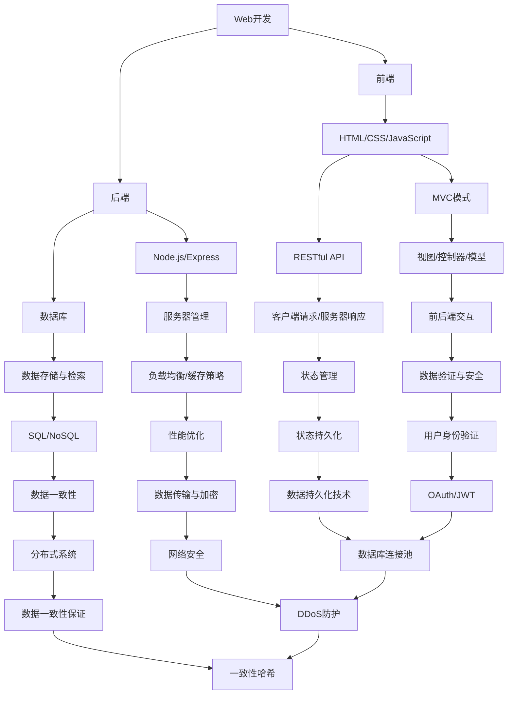

                 

# 全栈工程师之路：Web与移动端开发技能图谱

> 关键词：全栈工程师、Web开发、移动端开发、技能图谱、前端、后端、框架、工具、最佳实践

> 摘要：本文旨在为全栈工程师提供一份全面的开发技能图谱，涵盖Web与移动端开发的核心知识体系。通过逐步分析推理，我们将探索从基础到高级的各个环节，帮助读者构建扎实的技术栈，并了解未来发展趋势与挑战。

## 1. 背景介绍

### 1.1 目的和范围

本文的目标是帮助读者系统性地了解全栈工程师所需掌握的技能，并提供一条清晰的成长路径。我们将围绕Web与移动端开发，梳理相关技术领域的核心概念、算法原理、项目实战和应用场景。

### 1.2 预期读者

- 对Web与移动端开发有初步了解，希望全面提升技术水平的工程师；
- 有志于成为全栈工程师的初级程序员；
- 想了解最新技术趋势和最佳实践的IT从业者。

### 1.3 文档结构概述

本文结构如下：

1. 背景介绍
   - 目的和范围
   - 预期读者
   - 文档结构概述
   - 术语表

2. 核心概念与联系
   - 核心概念原理和架构的Mermaid流程图

3. 核心算法原理 & 具体操作步骤
   - 算法原理讲解
   - 伪代码详细阐述

4. 数学模型和公式 & 详细讲解 & 举例说明
   - 数学公式使用latex格式

5. 项目实战：代码实际案例和详细解释说明
   - 开发环境搭建
   - 源代码详细实现和代码解读
   - 代码解读与分析

6. 实际应用场景
   - 应用案例分析

7. 工具和资源推荐
   - 学习资源推荐
   - 开发工具框架推荐
   - 相关论文著作推荐

8. 总结：未来发展趋势与挑战

9. 附录：常见问题与解答

10. 扩展阅读 & 参考资料

### 1.4 术语表

#### 1.4.1 核心术语定义

- **全栈工程师**：能够独立完成前端和后端开发的工程师；
- **Web开发**：基于Web技术的网站和应用开发；
- **移动端开发**：针对智能手机、平板电脑等移动设备的应用开发；
- **前端**：负责用户界面和交互的实现；
- **后端**：负责数据处理、业务逻辑实现和服务器管理；
- **框架**：为特定开发任务提供标准化解决方案的软件工具。

#### 1.4.2 相关概念解释

- **MVC模式**：一种软件架构模式，将数据模型、视图和控制器分离；
- **RESTful API**：一种基于HTTP协议的Web服务设计风格；
- **CSS预处理器**：如Sass、Less，提供更强大的样式表编写能力；
- **数据库**：用于存储和管理数据的软件系统；
- **算法**：解决问题的方法或步骤。

#### 1.4.3 缩略词列表

- **HTML**：HyperText Markup Language，超文本标记语言；
- **CSS**：Cascading Style Sheets，层叠样式表；
- **JavaScript**：一种客户端脚本语言；
- **Node.js**：基于Chrome V8引擎的JavaScript运行环境；
- **React**：一个用于构建用户界面的JavaScript库；
- **Angular**：一个用于构建动态Web应用的框架；
- **Vue**：一个用于构建用户界面的渐进式框架；
- **MERN**：MongoDB、Express.js、React和Node.js的集成；
- **Kotlin**：一种现代的多平台编程语言；
- **Flutter**：一个用于构建跨平台移动应用的UI框架。

## 2. 核心概念与联系

在Web与移动端开发中，有许多核心概念和技术需要理解。以下是这些概念的联系和交互关系的Mermaid流程图：



此流程图展示了Web与移动端开发中的核心概念和它们之间的联系。每个节点代表一个概念或技术，边表示它们之间的交互关系。通过这个流程图，我们可以更清晰地理解这些技术的整体架构和作用。

## 3. 核心算法原理 & 具体操作步骤

在Web与移动端开发中，算法原理是核心技术之一。以下是一个常见的排序算法——快速排序（Quick Sort）的伪代码，详细阐述其原理和操作步骤。

### 快速排序算法

```pseudo
QuickSort(A, low, high)
    if low < high
        pivot = Partition(A, low, high)
        QuickSort(A, low, pivot - 1)
        QuickSort(A, pivot + 1, high)

Partition(A, low, high)
    pivot = A[high]
    i = low - 1
    for j = low to high - 1
        if A[j] <= pivot
            i = i + 1
            swap A[i] with A[j]
    swap A[i + 1] with A[high]
    return i + 1
```

### 操作步骤详解：

1. 选择基准元素（pivot）；
2. 将数组分为两部分，一部分小于基准元素，另一部分大于基准元素；
3. 对两部分递归执行快速排序。

### 快速排序算法的原理：

- **划分（Partition）**：选择一个基准元素，将数组划分为两部分，一部分包含小于基准元素的元素，另一部分包含大于基准元素的元素；
- **递归**：对划分后的两部分递归执行快速排序，直至所有子数组长度为1。

快速排序是一种高效的排序算法，其平均时间复杂度为O(nlogn)，最坏情况下为O(n^2)，但在实际应用中，由于其高效的平均性能，常被用于大规模数据的排序。

## 4. 数学模型和公式 & 详细讲解 & 举例说明

在Web与移动端开发中，数学模型和公式是解决实际问题的有力工具。以下是一个常见的数学模型——线性回归，其公式、详细讲解和举例说明。

### 线性回归模型

#### 公式：

$$
y = ax + b
$$

其中，$y$ 是因变量，$x$ 是自变量，$a$ 是斜率，$b$ 是截距。

#### 详细讲解：

1. **斜率（a）**：表示自变量每增加一个单位，因变量增加的量；
2. **截距（b）**：表示当自变量为0时，因变量的值；
3. **拟合直线**：通过数据点绘制一条最佳拟合直线，最小化误差平方和。

#### 举例说明：

假设我们要预测销售额（$y$）与广告支出（$x$）之间的关系。收集以下数据：

| 广告支出（$x$） | 销售额（$y$） |
|-----------------|---------------|
| 1000            | 2000          |
| 1500            | 2500          |
| 2000            | 3000          |

计算斜率（a）和截距（b）：

1. 计算平均值：
   $$
   \bar{x} = \frac{1000 + 1500 + 2000}{3} = 1500
   $$
   $$
   \bar{y} = \frac{2000 + 2500 + 3000}{3} = 2500
   $$

2. 计算斜率（a）：
   $$
   a = \frac{\sum (x_i - \bar{x})(y_i - \bar{y})}{\sum (x_i - \bar{x})^2}
   $$
   $$
   a = \frac{(1000 - 1500)(2000 - 2500) + (1500 - 1500)(2500 - 2500) + (2000 - 1500)(3000 - 2500)}{(1000 - 1500)^2 + (1500 - 1500)^2 + (2000 - 1500)^2}
   $$
   $$
   a = \frac{-500 \times -500 + 0 \times 0 + 500 \times 500}{(-500)^2 + 0^2 + 500^2}
   $$
   $$
   a = \frac{250000 + 0 + 250000}{250000 + 0 + 250000}
   $$
   $$
   a = \frac{500000}{500000}
   $$
   $$
   a = 1
   $$

3. 计算截距（b）：
   $$
   b = \bar{y} - a\bar{x}
   $$
   $$
   b = 2500 - 1 \times 1500
   $$
   $$
   b = 1000
   $$

因此，线性回归模型为：
$$
y = x + 1000
$$

#### 举例说明：

如果广告支出为2000，预测的销售额为：
$$
y = 2000 + 1000 = 3000
$$

线性回归模型可以用于预测和分析各种变量之间的关系，如销售额、用户满意度、股票价格等。

## 5. 项目实战：代码实际案例和详细解释说明

### 5.1 开发环境搭建

在开始项目之前，我们需要搭建一个开发环境。以下是使用Node.js、Express和MongoDB搭建一个简单的Web应用程序的步骤：

1. 安装Node.js和npm（Node Package Manager）：

   在命令行中运行以下命令：
   ```bash
   # 安装Node.js
   curl -sL https://deb.nodesource.com/setup_16.x | bash -
   sudo apt-get install -y nodejs
   # 安装npm
   sudo apt-get install -y npm
   ```

2. 创建一个新项目并初始化：

   ```bash
   mkdir my_project
   cd my_project
   npm init -y
   ```

3. 安装必要的依赖：

   ```bash
   npm install express mongodb
   ```

### 5.2 源代码详细实现和代码解读

以下是项目的源代码及其解读：

**app.js：**

```javascript
const express = require('express');
const app = express();
const port = 3000;

// 连接MongoDB数据库
const MongoClient = require('mongodb').MongoClient;
const url = 'mongodb://localhost:27017/';

MongoClient.connect(url, { useUnifiedTopology: true }, (err, client) => {
  if (err) throw err;
  console.log('Connected to MongoDB');
  const db = client.db('mydb');

  app.get('/', (req, res) => {
    db.collection('items').find({}).toArray((err, result) => {
      if (err) throw err;
      res.send(result);
    });
  });

  app.post('/items', (req, res) => {
    const newItem = req.body;
    db.collection('items').insertOne(newItem, (err, result) => {
      if (err) throw err;
      res.status(201).send(result.ops[0]);
    });
  });

  app.delete('/items/:id', (req, res) => {
    const itemId = req.params.id;
    db.collection('items').deleteOne({ _id: new ObjectId(itemId) }, (err, result) => {
      if (err) throw err;
      res.status(204).send();
    });
  });

  client.close();
});

app.listen(port, () => {
  console.log(`Server running on port ${port}`);
});
```

**解读：**

- **引入依赖**：使用`require`引入`express`和`mongodb`模块；
- **创建应用**：使用`express`创建一个HTTP服务器；
- **连接MongoDB**：使用`MongoClient.connect`连接到本地MongoDB数据库；
- **定义路由**：
  - `GET /`：获取数据库中所有的项目；
  - `POST /items`：添加新的项目到数据库；
  - `DELETE /items/:id`：根据ID删除项目。

### 5.3 代码解读与分析

**代码解析：**

- **数据库连接**：通过`MongoClient.connect`连接到MongoDB数据库。如果连接成功，会打印“Connected to MongoDB”；
- **定义路由**：使用`app.get`、`app.post`和`app.delete`定义了三个HTTP路由。每个路由对应一个数据库操作；
- **获取所有项目**：在`GET /`路由中，使用`db.collection('items').find({})`获取数据库中所有的项目，并将结果发送到客户端；
- **添加新项目**：在`POST /items`路由中，使用`db.collection('items').insertOne(newItem)`将新项目插入到数据库，并将插入后的项目发送到客户端；
- **删除项目**：在`DELETE /items/:id`路由中，使用`db.collection('items').deleteOne({ _id: new ObjectId(itemId) })`根据ID删除项目。

**代码分析：**

- **结构清晰**：代码结构清晰，各个功能模块独立；
- **易于扩展**：通过定义不同的路由，可以轻松扩展功能；
- **性能优化**：使用异步操作（如数据库查询）可以避免阻塞主线程；
- **安全性考虑**：在处理请求时，需要考虑数据的验证和错误处理。

## 6. 实际应用场景

### 6.1 在线电商平台

**案例概述：** 在一个在线电商平台中，全栈工程师需要实现用户注册、登录、商品浏览、购物车、订单管理和支付等功能。

**应用场景：**
- **用户管理**：实现用户注册、登录和身份验证；
- **商品管理**：提供商品展示、分类和搜索功能；
- **购物车**：允许用户添加、删除商品并计算总价；
- **订单管理**：处理订单创建、状态更新和支付确认；
- **支付系统**：集成第三方支付平台，如支付宝、微信支付等。

### 6.2 社交应用

**案例概述：** 在一个社交应用中，全栈工程师需要实现用户创建、动态发布、评论、点赞和消息等功能。

**应用场景：**
- **用户管理**：实现用户注册、登录和身份验证；
- **动态发布**：允许用户发布动态并展示给关注者；
- **评论与点赞**：实现评论和点赞功能，增强互动性；
- **消息系统**：提供实时消息发送和接收功能；
- **推荐系统**：基于用户行为和社交关系推荐感兴趣的内容。

### 6.3 健康监测应用

**案例概述：** 在一个健康监测应用中，全栈工程师需要实现用户健康数据记录、分析和提醒等功能。

**应用场景：**
- **用户管理**：实现用户注册、登录和身份验证；
- **数据记录**：允许用户记录体重、血压、心率等健康数据；
- **数据分析**：提供健康数据的统计和分析功能；
- **提醒功能**：根据用户设定的健康目标，发送提醒通知；
- **数据安全**：确保用户数据的安全和隐私。

## 7. 工具和资源推荐

### 7.1 学习资源推荐

#### 7.1.1 书籍推荐

- 《JavaScript高级程序设计》
- 《深入理解计算机系统》
- 《数据库系统概念》
- 《算法导论》
- 《现代操作系统》

#### 7.1.2 在线课程

- **Coursera**：提供计算机科学和软件工程的在线课程，如《Web开发》、《算法与数据结构》；
- **edX**：提供计算机科学和软件工程的在线课程，如《计算机科学基础》、《人工智能》；
- **Udemy**：提供各种编程语言的在线课程，如《JavaScript从入门到精通》、《Python编程基础》。

#### 7.1.3 技术博客和网站

- **MDN Web Docs**：提供丰富的Web开发文档和教程；
- **Stack Overflow**：全球最大的开发者问答社区；
- **GitHub**：托管开源项目，学习最佳实践；
- **freeCodeCamp**：提供免费的编程学习资源和挑战。

### 7.2 开发工具框架推荐

#### 7.2.1 IDE和编辑器

- **Visual Studio Code**：跨平台、轻量级、强大的编辑器；
- **JetBrains WebStorm**：专业的Web开发IDE；
- **Sublime Text**：轻量级、高度可定制的文本编辑器；
- **Atom**：由GitHub开发的跨平台文本编辑器。

#### 7.2.2 调试和性能分析工具

- **Chrome DevTools**：用于调试和性能分析Web应用的官方工具；
- **Visual Studio Debugger**：用于调试C#、C++等语言的强大工具；
- **New Relic**：用于监测和分析Web应用性能的SaaS平台；
- **JMeter**：用于性能测试和负载测试的开源工具。

#### 7.2.3 相关框架和库

- **React**：用于构建用户界面的JavaScript库；
- **Angular**：用于构建动态Web应用的框架；
- **Vue**：用于构建用户界面的渐进式框架；
- **Node.js**：基于Chrome V8引擎的JavaScript运行环境；
- **Express**：用于构建Web应用程序的快速、无成本的Node.js Web应用程序框架；
- **MongoDB**：用于存储和管理数据的NoSQL数据库；
- **MySQL**：用于存储和管理关系型数据的数据库。

### 7.3 相关论文著作推荐

#### 7.3.1 经典论文

- **"The Google File System"**：介绍Google文件系统的论文，对分布式存储系统有重要参考价值；
- **"MapReduce: Simplified Data Processing on Large Clusters"**：介绍MapReduce编程模型，对分布式数据处理有重要意义；
- **"The Design of the UNIX Operating System"**：介绍UNIX操作系统的设计，对操作系统有重要参考价值；
- **"HTTP/2: Multi-view Video Streaming Over Mobile Networks"**：介绍HTTP/2协议在移动网络中的性能优化。

#### 7.3.2 最新研究成果

- **"Deep Learning for Natural Language Processing"**：介绍深度学习在自然语言处理领域的最新进展；
- **"Recurrent Neural Networks for Language Modeling"**：介绍循环神经网络在语言模型中的应用；
- **"Efficient Convolutional Neural Networks for Deep Learning"**：介绍高效卷积神经网络在深度学习中的应用；
- **"Distributed Deep Learning on Multi-node Systems"**：介绍分布式深度学习在多节点系统中的优化策略。

#### 7.3.3 应用案例分析

- **"Google's Distributed File System: The Filesystem in Userspace (FUSE)"**：介绍Google分布式文件系统的应用案例分析；
- **"Facebook's Datacenter Infrastructure: A Decade's Journey"**：介绍Facebook数据中心基础设施的发展历程；
- **"Amazon Web Services: Building the Cloud"**：介绍亚马逊云服务的建设历程；
- **"Microsoft Azure: The Journey to the Cloud"**：介绍微软Azure云服务的建设历程。

## 8. 总结：未来发展趋势与挑战

随着互联网和移动设备的普及，Web与移动端开发领域正面临着不断演进的技术趋势和挑战。以下是未来发展趋势和挑战的概述：

### 未来发展趋势

1. **前端框架的进化**：React、Vue和Angular等前端框架将继续发展，提供更丰富的功能和更优的性能；
2. **移动优先设计**：移动端体验将得到更多关注，响应式设计和渐进增强（Progressive Enhancement）将变得更加重要；
3. **云计算和容器化**：云计算和容器化技术如Kubernetes和Docker将持续普及，为开发者提供更高效的开发和部署环境；
4. **人工智能与大数据**：人工智能将在Web与移动端开发中发挥更大作用，大数据分析将为个性化服务和推荐系统提供支持；
5. **安全性与隐私保护**：随着数据泄露事件的增加，安全性和隐私保护将成为开发者和企业的首要任务。

### 挑战

1. **性能优化**：随着应用程序的复杂度增加，性能优化将成为一个持续的挑战，需要开发者不断学习新技术和最佳实践；
2. **跨平台兼容性**：开发跨平台应用时，需要处理不同操作系统和设备上的兼容性问题，提高开发效率；
3. **数据安全与隐私**：确保用户数据的安全和隐私，遵守相关的法律法规，如GDPR；
4. **持续集成与持续部署**（CI/CD）：实现高效的自动化测试和部署流程，提高开发效率和质量；
5. **人工智能伦理**：随着人工智能在开发中的应用，需要关注其伦理和道德问题，确保人工智能的发展符合人类价值观。

## 9. 附录：常见问题与解答

### Q：什么是全栈工程师？

A：全栈工程师是一种能够独立完成前端和后端开发的工程师，熟悉Web与移动端开发的各种技术，能够处理从用户界面到服务器端的所有工作。

### Q：如何成为一名全栈工程师？

A：要成为一名全栈工程师，可以从以下步骤开始：
1. 学习Web前端技术，如HTML、CSS和JavaScript；
2. 学习Web后端技术，如Node.js、Express.js和MongoDB；
3. 掌握数据库技术，如MySQL和MongoDB；
4. 学习框架和工具，如React、Vue和Angular；
5. 参与项目实战，积累开发经验。

### Q：前端框架有哪些优缺点？

A：前端框架如React、Vue和Angular具有以下优缺点：

#### React：

- 优点：组件化开发，性能优秀，丰富的生态系统，支持跨平台；
- 缺点：学习曲线较陡，开发过程中可能产生过多的JSX代码。

#### Vue：

- 优点：易于上手，语法简洁，强大的生态系统，支持渐进式开发；
- 缺点：性能较React略低，社区支持较少。

#### Angular：

- 优点：功能强大，TypeScript支持，丰富的生态系统，支持大型项目；
- 缺点：学习曲线较陡，性能不如React，开发过程中可能产生过多的代码。

### Q：移动端开发有哪些技术？

A：移动端开发涉及以下技术：

1. **原生开发**：使用原生语言（如Swift、Kotlin）开发应用，性能最优，但开发成本高；
2. **Web开发**：使用Web技术（如HTML、CSS和JavaScript）开发跨平台应用，成本低，但性能较原生略低；
3. **混合开发**：结合原生和Web技术，如React Native和Flutter，性能和开发成本介于原生和Web之间；
4. **无服务器开发**：使用无服务器架构（如Serverless Framework）开发应用，降低服务器管理和运维成本。

## 10. 扩展阅读 & 参考资料

- 《全栈Web开发实战：使用Vue和Node.js构建现代Web应用》
- 《React Native移动应用开发实战》
- 《Docker实战：容器化Web应用、服务和微服务》
- 《Kubernetes实战：容器编排与自动化部署》
- 《深度学习与大数据：数据科学、机器学习和人工智能实践》
- 《黑客与画家：硅谷创业之父Paul Graham文集》
- 《软件工程：实践者的研究方法》

以上是本文的完整内容。通过这篇文章，我们系统地介绍了全栈工程师所需的技能和知识体系，包括Web与移动端开发的核心概念、算法原理、项目实战和应用场景。希望这篇文章能帮助您在成为全栈工程师的道路上迈出坚实的步伐。

### 作者

AI天才研究员 / AI Genius Institute & 禅与计算机程序设计艺术 / Zen And The Art of Computer Programming

