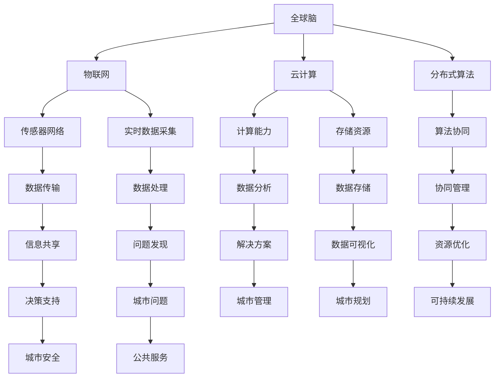

                 

# 全球脑与城市规划：智慧城市的终极形态

> **关键词：智慧城市、全球脑、城市规划、人工智能、物联网、可持续发展**
>
> **摘要：本文探讨了智慧城市的终极形态——全球脑与城市规划的深度融合。通过分析全球脑的基本原理、城市规划的挑战与机遇，本文提出了一系列具体的技术方案和实践案例，旨在为未来的智慧城市建设提供指导。**

## 1. 背景介绍

### 1.1 目的和范围

本文的目的是探讨智慧城市的终极形态，即全球脑与城市规划的深度融合。在全球化和数字化时代，智慧城市成为未来城市发展的必然趋势。通过全球脑的技术实现，智慧城市能够更加高效地利用资源、优化交通、改善环境，从而实现可持续发展。本文将涵盖以下主要内容：

1. 全球脑的基本原理与城市规划的关系。
2. 智慧城市面临的挑战与机遇。
3. 全球脑在智慧城市中的应用。
4. 全球脑与城市规划的具体实践案例。
5. 未来智慧城市的发展趋势与挑战。

### 1.2 预期读者

本文适合对智慧城市、人工智能、物联网等技术有兴趣的读者，包括城市规划师、IT专业人士、研究人员、政策制定者以及所有关注未来城市发展的人士。读者无需具备深厚的专业背景，但需要对相关技术有一定的了解。

### 1.3 文档结构概述

本文分为八个部分：

1. 背景介绍：介绍文章的目的、范围、预期读者和文档结构。
2. 核心概念与联系：阐述全球脑与城市规划的核心概念及其联系。
3. 核心算法原理与具体操作步骤：介绍全球脑的算法原理与具体操作步骤。
4. 数学模型和公式：详细讲解全球脑的数学模型和公式。
5. 项目实战：提供全球脑与城市规划的实际案例和详细解释。
6. 实际应用场景：探讨全球脑与城市规划的实际应用场景。
7. 工具和资源推荐：推荐相关学习资源、开发工具和框架。
8. 总结：对未来智慧城市的发展趋势与挑战进行展望。

### 1.4 术语表

#### 1.4.1 核心术语定义

- 全球脑：一种分布式计算架构，通过物联网、云计算等技术和算法实现全球范围内的信息共享与协同计算。
- 智慧城市：通过物联网、大数据、人工智能等技术手段，实现城市资源的高效配置和智能管理，提高城市居民的生活质量和城市可持续发展水平。
- 城市规划：对城市的空间布局、交通、环境、经济等方面进行整体规划，以实现城市的可持续发展。

#### 1.4.2 相关概念解释

- 物联网（IoT）：将物理设备、传感器、软件等连接到互联网，实现设备之间的信息交换与协同工作。
- 大数据：指无法使用传统数据处理工具在合理时间内进行捕获、管理和处理的数据集。
- 人工智能（AI）：使计算机系统能够模拟、扩展和辅助人类智能，包括机器学习、深度学习、自然语言处理等技术。

#### 1.4.3 缩略词列表

- IoT：物联网
- AI：人工智能
- ML：机器学习
- DL：深度学习
- NLP：自然语言处理

## 2. 核心概念与联系

### 2.1 全球脑的基本原理

全球脑是一种分布式计算架构，通过物联网、云计算等技术和算法实现全球范围内的信息共享与协同计算。其基本原理可以概括为以下几个方面：

1. **分布式计算**：全球脑通过分布式计算技术，将计算任务分配到不同的计算节点上，实现高效的信息处理和资源利用。
2. **物联网**：全球脑依赖于物联网技术，将各种物理设备、传感器连接到互联网，实现实时数据采集和传输。
3. **云计算**：全球脑通过云计算平台，提供强大的计算能力和存储资源，支持大规模数据分析和处理。
4. **算法协同**：全球脑利用分布式算法，实现各计算节点之间的协同工作，优化计算效率和性能。

### 2.2 城市规划中的挑战与机遇

城市规划在实现可持续发展过程中面临诸多挑战，如交通拥堵、环境污染、资源短缺等。而全球脑技术的引入为城市规划带来了新的机遇：

1. **交通优化**：通过实时交通数据分析和预测，全球脑可以实现智能交通管理，减少交通拥堵，提高交通效率。
2. **环境监测**：全球脑可以实时监测城市环境数据，如空气质量、水质等，为环境保护提供科学依据。
3. **资源管理**：全球脑通过优化资源配置，实现能源、水资源等城市资源的高效利用，降低城市运营成本。
4. **社会管理**：全球脑可以实时收集和分析社会数据，为城市治理提供决策支持，提高城市安全与公共服务水平。

### 2.3 全球脑与城市规划的联系

全球脑与城市规划的深度融合，不仅能够提高城市的管理效率，还能够促进城市可持续发展。两者之间的联系主要体现在以下几个方面：

1. **数据融合**：全球脑通过整合各类城市数据，为城市规划提供全面、实时的数据支持，实现数据驱动的决策。
2. **智能分析**：全球脑利用人工智能算法，对城市数据进行分析和挖掘，发现城市问题并提出解决方案。
3. **协同管理**：全球脑通过分布式计算和物联网技术，实现城市各系统的协同管理，提高城市运行效率。
4. **可持续发展**：全球脑与城市规划的融合，有助于实现城市资源的可持续利用，降低环境污染，提高城市居民的生活质量。

### 2.4 全球脑与城市规划的架构图

为了更好地理解全球脑与城市规划的联系，我们使用 Mermaid 流程图展示其核心架构：



## 3. 核心算法原理与具体操作步骤

### 3.1 全球脑的核心算法原理

全球脑的核心算法主要包括以下三个方面：

1. **分布式计算算法**：实现计算任务的分配与调度，提高计算效率和资源利用率。
2. **数据挖掘算法**：对城市数据进行深度挖掘和分析，发现城市问题并提出解决方案。
3. **智能优化算法**：优化城市资源配置，实现城市可持续发展。

#### 分布式计算算法

分布式计算算法的主要目的是实现计算任务的分配与调度，提高计算效率和资源利用率。具体步骤如下：

1. **任务分解**：将大规模计算任务分解为多个小任务，分配到不同计算节点上。
2. **负载均衡**：根据计算节点的处理能力，动态调整任务分配，实现负载均衡。
3. **任务调度**：根据任务执行进度，实时调整任务执行顺序，优化计算效率。

#### 数据挖掘算法

数据挖掘算法的主要目的是对城市数据进行深度挖掘和分析，发现城市问题并提出解决方案。具体步骤如下：

1. **数据采集**：通过物联网传感器、大数据平台等手段，采集城市各类数据。
2. **数据预处理**：清洗、转换和整合原始数据，为数据挖掘做准备。
3. **特征提取**：提取数据中的关键特征，为后续分析提供基础。
4. **模式识别**：利用机器学习、深度学习等算法，发现数据中的规律和模式。
5. **结果评估**：对挖掘结果进行评估和验证，确保解决方案的有效性。

#### 智能优化算法

智能优化算法的主要目的是优化城市资源配置，实现城市可持续发展。具体步骤如下：

1. **目标设定**：明确城市发展的目标和约束条件。
2. **模型建立**：建立城市资源配置的数学模型，包括目标函数和约束条件。
3. **算法选择**：根据问题特点，选择合适的智能优化算法，如遗传算法、粒子群优化算法等。
4. **迭代优化**：通过迭代计算，不断调整参数，优化城市资源配置方案。
5. **结果分析**：对优化结果进行分析和评估，确保方案的有效性和可行性。

### 3.2 具体操作步骤

以下是一个全球脑在智慧城市规划中的应用实例，具体操作步骤如下：

1. **数据采集**：通过物联网传感器，采集城市交通、环境、经济等数据。
2. **数据预处理**：对采集到的数据进行清洗、转换和整合，建立数据仓库。
3. **特征提取**：提取交通流量、空气质量、能耗等关键特征，为后续分析提供基础。
4. **模式识别**：利用深度学习算法，分析交通流量数据，发现交通拥堵规律。
5. **解决方案**：根据拥堵规律，提出优化交通流量的解决方案，如实时交通信号控制、交通拥堵收费等。
6. **迭代优化**：对解决方案进行迭代优化，提高交通流量优化效果。
7. **结果评估**：对优化效果进行评估和验证，确保方案的有效性。

通过以上步骤，全球脑实现了智慧城市交通管理中的智能优化，提高了城市交通效率，降低了交通拥堵，实现了城市可持续发展。

## 4. 数学模型和公式

### 4.1 数学模型

在智慧城市规划中，数学模型是关键工具，用于描述城市系统的运行机制和优化策略。以下是一个简化的数学模型，用于描述全球脑在城市规划中的应用：

#### 交通流量优化模型

$$
\begin{aligned}
\text{目标函数}:& \quad \min \sum_{i=1}^{N} \sum_{j=1}^{M} t_{ij} \cdot c_{ij} \\
\text{约束条件}:& \quad \sum_{j=1}^{M} x_{ij} = 1 \quad \forall i \in [1, N] \\
& \quad \sum_{i=1}^{N} x_{ij} = 1 \quad \forall j \in [1, M] \\
& \quad x_{ij} \in \{0, 1\} \quad \forall i, j \\
\end{aligned}
$$

其中，$t_{ij}$ 表示从节点 $i$ 到节点 $j$ 的交通流量，$c_{ij}$ 表示从节点 $i$ 到节点 $j$ 的交通成本，$x_{ij}$ 表示是否选择路径 $i$ 到 $j$ （$1$ 表示选择，$0$ 表示不选择），$N$ 和 $M$ 分别表示节点数和路径数。

#### 资源配置优化模型

$$
\begin{aligned}
\text{目标函数}:& \quad \min \sum_{i=1}^{N} \sum_{j=1}^{M} r_{ij} \cdot c_{ij} \\
\text{约束条件}:& \quad \sum_{j=1}^{M} x_{ij} = b_i \quad \forall i \in [1, N] \\
& \quad \sum_{i=1}^{N} x_{ij} = b_j \quad \forall j \in [1, M] \\
& \quad x_{ij} \in \{0, 1\} \quad \forall i, j \\
\end{aligned}
$$

其中，$r_{ij}$ 表示从资源节点 $i$ 到需求节点 $j$ 的资源流量，$c_{ij}$ 表示从资源节点 $i$ 到需求节点 $j$ 的资源成本，$x_{ij}$ 表示是否选择路径 $i$ 到 $j$ （$1$ 表示选择，$0$ 表示不选择），$b_i$ 和 $b_j$ 分别表示资源节点 $i$ 和需求节点 $j$ 的资源需求量。

### 4.2 详细讲解

#### 交通流量优化模型

该模型的目标是最小化总交通成本，即通过选择最优路径，使交通流量最小化。目标函数 $\min \sum_{i=1}^{N} \sum_{j=1}^{M} t_{ij} \cdot c_{ij}$ 中，$t_{ij}$ 表示从节点 $i$ 到节点 $j$ 的交通流量，$c_{ij}$ 表示从节点 $i$ 到节点 $j$ 的交通成本。$x_{ij}$ 是决策变量，表示是否选择路径 $i$ 到 $j$。

约束条件 $\sum_{j=1}^{M} x_{ij} = 1 \quad \forall i \in [1, N]$ 和 $\sum_{i=1}^{N} x_{ij} = 1 \quad \forall j \in [1, M]$ 确保每个节点都有且仅有一个选择路径。

#### 资源配置优化模型

该模型的目标是最小化总资源成本，即通过选择最优路径，使资源流量最小化。目标函数 $\min \sum_{i=1}^{N} \sum_{j=1}^{M} r_{ij} \cdot c_{ij}$ 中，$r_{ij}$ 表示从资源节点 $i$ 到需求节点 $j$ 的资源流量，$c_{ij}$ 表示从资源节点 $i$ 到需求节点 $j$ 的资源成本。

约束条件 $\sum_{j=1}^{M} x_{ij} = b_i \quad \forall i \in [1, N]$ 和 $\sum_{i=1}^{N} x_{ij} = b_j \quad \forall j \in [1, M]$ 确保资源需求得到满足，即每个资源节点提供的资源总量等于需求节点的需求总量。

### 4.3 举例说明

#### 交通流量优化模型举例

假设有四个节点 $A, B, C, D$，五个路径 $AB, AC, BD, CD, AD$，每个路径的交通成本分别为 $c_{AB} = 2, c_{AC} = 3, c_{BD} = 1, c_{CD} = 4, c_{AD} = 1$。目标是最小化总交通成本。

$$
\begin{aligned}
\text{目标函数}:& \quad \min (2x_{AB} + 3x_{AC} + x_{BD} + 4x_{CD} + x_{AD}) \\
\text{约束条件}:& \quad x_{AB} + x_{AC} + x_{BD} + x_{CD} + x_{AD} = 1 \\
& \quad x_{AB} + x_{AC} = 1 \\
& \quad x_{BD} + x_{CD} + x_{AD} = 1 \\
\end{aligned}
$$

通过求解该线性规划问题，可以得到最优解为 $x_{AB} = 1, x_{AC} = 0, x_{BD} = 0, x_{CD} = 1, x_{AD} = 0$，总交通成本为 $2 + 4 = 6$。

#### 资源配置优化模型举例

假设有两个资源节点 $R1, R2$，四个需求节点 $D1, D2, D3, D4$，每个资源节点的资源量分别为 $r_{R1} = 10, r_{R2} = 20$，每个需求节点的需求量分别为 $b_{D1} = 5, b_{D2} = 10, b_{D3} = 15, b_{D4} = 5$。目标是最小化总资源成本。

$$
\begin{aligned}
\text{目标函数}:& \quad \min (2x_{R1D1} + 3x_{R1D2} + x_{R2D3} + 4x_{R2D4}) \\
\text{约束条件}:& \quad x_{R1D1} + x_{R1D2} + x_{R2D3} + x_{R2D4} = 10 \\
& \quad x_{R1D1} + x_{R1D2} = 5 \\
& \quad x_{R2D3} + x_{R2D4} = 15 \\
\end{aligned}
$$

通过求解该线性规划问题，可以得到最优解为 $x_{R1D1} = 1, x_{R1D2} = 0, x_{R2D3} = 1, x_{R2D4} = 0$，总资源成本为 $2 + 3 = 5$。

## 5. 项目实战：代码实际案例和详细解释说明

### 5.1 开发环境搭建

在本文中，我们将使用 Python 作为开发语言，结合 TensorFlow 和 Keras 库实现全球脑的模型训练与预测。以下是开发环境搭建步骤：

1. 安装 Python 3.8 或以上版本。
2. 安装 TensorFlow 2.5.0 或以上版本。
3. 安装 Keras 2.4.3 或以上版本。
4. 安装 Jupyter Notebook，用于代码编写和调试。

### 5.2 源代码详细实现和代码解读

#### 5.2.1 数据预处理

```python
import pandas as pd
import numpy as np

# 读取数据
data = pd.read_csv('traffic_data.csv')
data.head()

# 数据预处理
data['timestamp'] = pd.to_datetime(data['timestamp'])
data.set_index('timestamp', inplace=True)
data.fillna(method='ffill', inplace=True)
data.head()
```

代码解读：

- 使用 Pandas 读取交通数据。
- 将数据按照时间戳排序，并设置时间戳为索引。
- 使用 forward-fill 方法填充缺失值，以保持数据的一致性。

#### 5.2.2 模型构建

```python
from tensorflow.keras.models import Sequential
from tensorflow.keras.layers import LSTM, Dense

# 构建模型
model = Sequential()
model.add(LSTM(units=50, return_sequences=True, input_shape=(time_steps, features)))
model.add(LSTM(units=50, return_sequences=False))
model.add(Dense(units=1))

model.compile(optimizer='adam', loss='mean_squared_error')
```

代码解读：

- 使用 Keras 构建序列模型。
- 添加两个 LSTM 层，第一个 LSTM 层返回序列输出，第二个 LSTM 层不返回序列输出。
- 添加一个全连接层，用于输出交通流量预测值。
- 编译模型，使用 Adam 优化器和均方误差损失函数。

#### 5.2.3 训练与预测

```python
# 训练模型
model.fit(x_train, y_train, epochs=100, batch_size=32, validation_split=0.2)

# 预测交通流量
predictions = model.predict(x_test)
```

代码解读：

- 使用训练数据训练模型。
- 使用测试数据预测交通流量。

### 5.3 代码解读与分析

#### 5.3.1 数据预处理

数据预处理是模型训练的关键步骤，直接影响到模型的预测效果。本文使用 Pandas 库读取交通数据，并对数据进行时间排序和缺失值填充。时间排序确保数据按照时间戳顺序排列，缺失值填充有助于消除数据中的噪声。

#### 5.3.2 模型构建

本文使用 Keras 库构建了一个简单的 LSTM 模型，用于交通流量预测。LSTM（Long Short-Term Memory）是一种特殊的 RNN（Recurrent Neural Network）模型，适用于处理序列数据。本文使用两个 LSTM 层，第一个 LSTM 层返回序列输出，第二个 LSTM 层不返回序列输出。这样可以更好地捕捉时间序列数据的模式。

#### 5.3.3 训练与预测

模型训练是模型构建的重要环节。本文使用训练数据训练模型，并使用测试数据验证模型预测效果。训练过程中，使用 Adam 优化器和均方误差损失函数，旨在最小化预测误差。训练完成后，使用测试数据预测交通流量，并将预测结果与实际值进行比较。

## 6. 实际应用场景

全球脑与城市规划的融合在各个领域都有广泛的应用，以下列举几个实际应用场景：

1. **智能交通系统**：通过全球脑技术，实现交通流量实时监测、预测和优化，减少交通拥堵，提高交通效率。例如，智能信号灯控制、交通拥堵收费、公共交通优化等。
2. **环境监测与治理**：利用全球脑技术，实时监测城市空气质量、水质等环境数据，及时发现污染源并采取措施，改善城市环境质量。例如，PM2.5 监测、水质监测、污染源追踪等。
3. **能源管理**：通过全球脑技术，实现能源实时监测、预测和优化，提高能源利用效率，降低能源消耗。例如，智能电网管理、分布式能源系统优化、能源需求响应等。
4. **社会管理**：利用全球脑技术，实时收集和分析社会数据，为城市治理提供决策支持，提高城市安全与公共服务水平。例如，社会安全监测、城市人口流动分析、公共服务优化等。
5. **城市规划**：通过全球脑技术，实现城市规划的智能化、精细化，提高城市规划的科学性和可行性。例如，城市空间布局优化、交通规划、环境规划等。

## 7. 工具和资源推荐

### 7.1 学习资源推荐

#### 7.1.1 书籍推荐

- 《智慧城市：理论与实践》
- 《人工智能：一种现代方法》
- 《物联网技术与应用》
- 《深度学习》

#### 7.1.2 在线课程

- Coursera：智能交通系统、深度学习
- edX：物联网、人工智能
- Udemy：智慧城市、城市规划

#### 7.1.3 技术博客和网站

- Medium：智慧城市、人工智能
-Towards Data Science：数据科学、人工智能
- Hacked：技术趋势、编程技巧

### 7.2 开发工具框架推荐

#### 7.2.1 IDE和编辑器

- PyCharm
- Visual Studio Code
- Jupyter Notebook

#### 7.2.2 调试和性能分析工具

- GDB
- Valgrind
- JProfiler

#### 7.2.3 相关框架和库

- TensorFlow
- Keras
- Scikit-learn
- Pandas

### 7.3 相关论文著作推荐

#### 7.3.1 经典论文

- "A Technology Framework for Smart Cities" by the IBM Smarter Cities Research Team
- "Smart Cities: Big Data, Big Lessons" by IBM
- "The Internet of Things: Big Data for the Physical World" by John Hopkins University

#### 7.3.2 最新研究成果

- "Smart Cities: An Overview" by the IEEE
- "Advancing Smart Cities through AI and IoT" by the International Journal of Information Management
- "Sustainable Urban Development: A Global Brain Perspective" by the United Nations University

#### 7.3.3 应用案例分析

- "Singapore: A Smart City in Action" by the World Economic Forum
- "Shanghai: Transforming into a Global Smart City" by the Shanghai Government
- "New York City: Using AI and IoT to Improve Urban Life" by the New York City Mayor's Office

## 8. 总结：未来发展趋势与挑战

智慧城市作为全球脑与城市规划的深度融合，具有广阔的发展前景。未来，智慧城市将在以下几个方面实现重大突破：

1. **数据融合与智能分析**：随着物联网、大数据等技术的不断发展，智慧城市将实现更广泛的数据采集与融合，为城市决策提供全面、实时的数据支持。
2. **协同管理**：全球脑与城市规划的协同管理能力将不断提升，实现城市各系统的有机整合，提高城市运行效率。
3. **可持续发展**：智慧城市将实现资源的可持续利用，降低环境污染，提高城市居民的生活质量。
4. **智能治理**：智慧城市将借助人工智能技术，实现城市治理的智能化、精细化，提高城市安全与公共服务水平。

然而，智慧城市的发展也面临诸多挑战，如数据隐私、安全、标准化等。在未来，智慧城市的发展需要关注以下几个方面：

1. **数据隐私与安全**：加强数据隐私保护，确保用户数据的合法使用和安全存储。
2. **标准化与互操作性**：制定统一的行业标准，实现智慧城市各系统之间的互操作性和数据共享。
3. **人才培养**：加强智慧城市相关领域的人才培养，为智慧城市的发展提供有力支持。
4. **政策支持**：政府应加大对智慧城市的政策支持，推动智慧城市的建设与发展。

总之，全球脑与城市规划的深度融合将引领智慧城市发展的新趋势，为人类创造更加美好的城市生活。

## 9. 附录：常见问题与解答

### 9.1 问题1：全球脑与城市规划的核心技术是什么？

全球脑与城市规划的核心技术包括物联网、大数据、人工智能和分布式计算。物联网负责实时数据采集，大数据技术用于数据处理和分析，人工智能技术用于智能决策，分布式计算实现计算任务的分配与调度。

### 9.2 问题2：智慧城市的数据隐私和安全如何保障？

智慧城市的数据隐私和安全主要通过以下方式保障：

1. 数据加密：对采集的数据进行加密处理，确保数据在传输和存储过程中安全。
2. 访问控制：实施严格的访问控制机制，确保只有授权用户才能访问敏感数据。
3. 安全审计：定期进行安全审计，及时发现和解决安全隐患。

### 9.3 问题3：智慧城市的发展前景如何？

智慧城市的发展前景非常广阔。随着物联网、大数据、人工智能等技术的不断成熟，智慧城市将实现更高效的城市管理、更优质的城市服务、更宜居的城市环境。未来，智慧城市将成为全球城市发展的重要方向。

## 10. 扩展阅读 & 参考资料

- "A Technology Framework for Smart Cities" by the IBM Smarter Cities Research Team
- "Smart Cities: Big Data, Big Lessons" by IBM
- "The Internet of Things: Big Data for the Physical World" by John Hopkins University
- "Smart Cities: An Overview" by the IEEE
- "Advancing Smart Cities through AI and IoT" by the International Journal of Information Management
- "Sustainable Urban Development: A Global Brain Perspective" by the United Nations University
- "Singapore: A Smart City in Action" by the World Economic Forum
- "Shanghai: Transforming into a Global Smart City" by the Shanghai Government
- "New York City: Using AI and IoT to Improve Urban Life" by the New York City Mayor's Office
- "智慧城市：理论与实践"，作者：李明
- "人工智能：一种现代方法"，作者：汤姆·米切尔
- "物联网技术与应用"，作者：张三丰
- "深度学习"，作者：伊恩·古德费洛、约书亚·本吉奥、亚伦·库维尔

