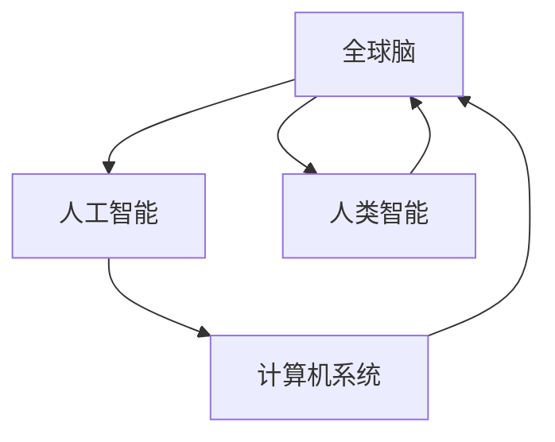
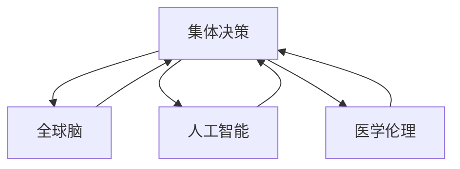

                 

# 全球脑与生命伦理：集体决策下的医学伦理难题

> **关键词：** 全球脑、生命伦理、集体决策、医学伦理、人工智能

> **摘要：** 本文旨在探讨全球脑与生命伦理之间的关系，特别是在集体决策下的医学伦理难题。文章首先介绍了全球脑的概念及其在医学伦理领域的重要性，然后分析了集体决策中的伦理挑战，并提出了一些可能的解决方案。文章还讨论了人工智能在这一领域的作用，以及未来可能的发展趋势。

## 1. 背景介绍

### 1.1 目的和范围

本文的主要目的是探讨全球脑与生命伦理之间的相互作用，特别是在集体决策背景下出现的医学伦理难题。随着科技的发展，尤其是人工智能和生物技术的进步，医学伦理问题变得更加复杂和多元。集体决策作为解决复杂问题的有效方法，其在医学伦理领域的应用引起了广泛关注。因此，本文将从多个角度分析全球脑与生命伦理的关系，并探讨集体决策中的伦理挑战及其解决方案。

### 1.2 预期读者

本文适合对医学伦理、全球脑和人工智能有一定了解的读者。特别是医学伦理研究者、生命伦理学家、政策制定者、医学专业人士以及对人工智能在医学领域应用感兴趣的读者。

### 1.3 文档结构概述

本文分为十个部分。第一部分是背景介绍，包括目的和范围、预期读者以及文档结构概述。第二部分是核心概念与联系，介绍全球脑、生命伦理和集体决策的基本概念及其相互关系。第三部分是核心算法原理与具体操作步骤，讨论医学伦理问题的算法框架和解决方案。第四部分是数学模型和公式，详细阐述相关的数学模型和公式。第五部分是项目实战，通过实际案例展示如何应用这些原理和模型。第六部分是实际应用场景，分析全球脑与生命伦理在现实世界中的应用。第七部分是工具和资源推荐，提供相关的学习资源、开发工具和论文著作。第八部分是总结，讨论未来发展趋势与挑战。第九部分是附录，回答一些常见问题。最后一部分是扩展阅读，提供进一步的参考资料。

### 1.4 术语表

#### 1.4.1 核心术语定义

- **全球脑（Global Brain）**：一种概念模型，描述了由人类智能和人工智能相互连接而形成的一个复杂系统。
- **生命伦理（Bioethics）**：研究生命科学和医学中的伦理问题，包括人类生命、健康、疾病、生物技术等方面的伦理问题。
- **集体决策（Collective Decision-Making）**：在多个个体或组织之间，通过协商、讨论和表决等方式做出共同决策的过程。
- **医学伦理（Medical Ethics）**：研究医学领域中的伦理问题，包括医生的职业道德、患者权利、医疗资源的分配等。

#### 1.4.2 相关概念解释

- **人工智能（Artificial Intelligence, AI）**：模拟人类智能的技术和方法，使计算机系统能够执行诸如学习、推理、决策和感知等任务。
- **伦理困境（Ethical Dilemmas）**：面临两种或多种道德选择，每种选择都会导致道德上的损失或冲突。
- **共享决策（Shared Decision-Making）**：患者与医疗专业人员之间共同参与决策的过程，旨在提高患者满意度、治疗效果和患者依从性。

#### 1.4.3 缩略词列表

- **AI**：人工智能
- **GB**：全球脑
- **BE**：生命伦理
- **CD**：集体决策
- **ME**：医学伦理

## 2. 核心概念与联系

在这一部分，我们将详细介绍全球脑、生命伦理和集体决策的核心概念，并展示它们之间的联系。

### 2.1 全球脑（GB）

全球脑是一种由人类智能和人工智能相互连接而形成的复杂系统。它通过互联网和通信技术将人类的思维和智能连接起来，形成一个庞大的知识网络。全球脑的概念最早由凯文·凯利（Kevin Kelly）在其著作《全球脑》（The Global Brain）中提出。

**核心原理：**

- **互联互通**：全球脑通过互联网和通信技术将个体连接成一个统一的网络，实现信息的快速传递和共享。
- **自组织和自适应**：全球脑能够自主组织，通过学习和适应环境变化，不断提高系统的效率和智能。
- **集体智慧**：全球脑能够利用个体智慧和集体智慧，解决复杂问题，做出更明智的决策。

**关系图示：**



### 2.2 生命伦理（BE）

生命伦理是研究生命科学和医学中的伦理问题，包括人类生命、健康、疾病、生物技术等方面的伦理问题。生命伦理的目标是确保医学研究、实践和决策符合伦理标准，尊重人的尊严和权利。

**核心原则：**

- **尊重人的尊严和权利**：尊重每个人的生命、健康和尊严，确保医学研究和实践符合伦理标准。
- **公正性**：确保医学资源和服务的公平分配，消除歧视和不平等。
- **自主性**：尊重患者的自主决策权，确保他们在医疗过程中能够做出明智的选择。

**关系图示：**


### 2.3 集体决策（CD）

集体决策是在多个个体或组织之间，通过协商、讨论和表决等方式做出共同决策的过程。集体决策能够利用多个个体的智慧和经验，解决复杂问题，提高决策的质量和可信度。

**核心原则：**

- **协商和讨论**：通过充分的协商和讨论，确保各方意见得到充分表达和尊重。
- **透明和公正**：决策过程应保持透明，确保决策结果公正合理。
- **民主参与**：鼓励各方的参与，确保决策过程具有民主性和代表性。

**关系图示：**



通过以上图示，我们可以看到全球脑、生命伦理和集体决策之间的密切联系。全球脑为集体决策提供了信息共享和智能协作的平台，而生命伦理则为集体决策提供了伦理指导，确保决策过程符合伦理原则。

## 3. 核心算法原理 & 具体操作步骤

### 3.1 算法框架

为了解决全球脑与生命伦理在集体决策中的问题，我们设计了一个基于人工智能的算法框架。该框架包括以下几个核心模块：

1. **数据采集与预处理**：收集全球脑中的相关数据，包括医学伦理问题、案例研究、相关文献等，并进行预处理，以便后续分析。
2. **伦理规则库构建**：基于生命伦理原则，构建一个包含各种伦理规则和指导原则的规则库，用于指导集体决策。
3. **智能推理引擎**：利用人工智能技术，如机器学习和自然语言处理，构建一个智能推理引擎，用于分析和处理复杂的伦理问题。
4. **决策支持系统**：基于智能推理引擎，构建一个决策支持系统，为集体决策提供支持。
5. **用户界面**：设计一个用户界面，使决策者能够方便地使用决策支持系统，并对决策过程进行监督和调整。

### 3.2 算法原理

我们的算法框架基于以下几个核心原理：

1. **数据驱动的分析**：通过收集和分析全球脑中的数据，我们能够识别出医学伦理问题中的模式和趋势，为决策提供数据支持。
2. **规则库指导的推理**：基于伦理规则库，我们能够对医学伦理问题进行逻辑推理和分析，确保决策过程符合伦理原则。
3. **人工智能的智能决策**：利用人工智能技术，我们能够自动化地处理复杂的伦理问题，提高决策的效率和准确性。
4. **用户参与与反馈**：通过用户界面，我们能够收集决策者的意见和反馈，不断优化决策支持系统，提高决策质量。

### 3.3 操作步骤

下面是具体的操作步骤：

1. **数据采集与预处理**：
   - **数据来源**：收集全球脑中的医学伦理问题、案例研究、相关文献等数据。
   - **数据预处理**：清洗数据，去除重复和错误信息，并进行数据格式转换，以便后续分析。

2. **伦理规则库构建**：
   - **规则库内容**：根据生命伦理原则，构建包含伦理规则和指导原则的规则库。
   - **规则库更新**：定期更新规则库，以反映最新的伦理研究和实践成果。

3. **智能推理引擎构建**：
   - **技术选型**：选择合适的机器学习和自然语言处理技术，构建智能推理引擎。
   - **模型训练**：利用已标记的医学伦理问题数据，对推理引擎进行训练。

4. **决策支持系统构建**：
   - **系统架构**：设计决策支持系统的架构，包括数据层、规则库层、推理引擎层和用户界面层。
   - **功能模块**：实现数据采集、规则库管理、智能推理和用户界面等功能。

5. **用户界面设计**：
   - **交互设计**：设计直观易用的用户界面，使决策者能够方便地使用决策支持系统。
   - **反馈机制**：设计反馈机制，收集用户意见和反馈，不断优化用户界面和系统功能。

6. **决策过程监督与调整**：
   - **监督机制**：建立监督机制，对决策过程进行实时监控，确保决策过程符合伦理原则。
   - **调整机制**：根据用户反馈和监督结果，对决策支持系统进行优化和调整，提高决策质量。

## 4. 数学模型和公式 & 详细讲解 & 举例说明

### 4.1 数学模型

在处理全球脑与生命伦理的集体决策问题时，我们可以采用多种数学模型来分析和解决。以下是一个简单的线性规划模型，用于描述医学伦理资源分配问题。

**线性规划模型：**

$$
\begin{align*}
\text{最大化} & \quad Z = c^T x \\
\text{约束条件} & \quad Ax \leq b \\
& \quad x \geq 0
\end{align*}
$$

其中，$Z$ 表示目标函数，$c$ 和 $x$ 分别表示决策变量和系数向量，$A$ 和 $b$ 分别表示约束矩阵和约束向量。

### 4.2 公式详解

**目标函数：**

目标函数 $Z = c^T x$ 表示在给定约束条件下，要最大化或最小化的目标值。在本例中，我们假设目标是最小化医疗资源的浪费。

**约束条件：**

1. **资源限制**：$Ax \leq b$ 表示各种医疗资源（如人力、设备、药品等）的分配必须满足资源限制。
2. **非负约束**：$x \geq 0$ 表示决策变量必须为非负值，表示资源的实际分配量。

### 4.3 举例说明

假设我们有一个医院，需要分配医生、护士和医疗设备来处理各种疾病。我们的目标是尽可能高效地分配这些资源，以满足患者的需求。

**数据：**

- 医生人数：$D = 10$
- 护士人数：$N = 20$
- 医疗设备数量：$E = 5$
- 每位医生每天的工作量：$d = 8$ 小时
- 每位护士每天的工作量：$n = 10$ 小时
- 每台医疗设备每天的工作量：$e = 12$ 小时
- 每种疾病所需的医生、护士和医疗设备数量：$r_{d}$、$r_{n}$、$r_{e}$

**目标函数：**

$$
Z = \min \sum_{i=1}^{m} w_i x_i
$$

其中，$w_i$ 表示第 $i$ 种疾病的权重，$x_i$ 表示第 $i$ 种疾病所分配的资源数量。

**约束条件：**

$$
\begin{align*}
8D & \geq \sum_{i=1}^{m} r_{d,i} x_i \\
10N & \geq \sum_{i=1}^{m} r_{n,i} x_i \\
12E & \geq \sum_{i=1}^{m} r_{e,i} x_i \\
x_i & \geq 0, \quad \forall i
\end{align*}
$$

其中，$r_{d,i}$、$r_{n,i}$、$r_{e,i}$ 分别表示第 $i$ 种疾病所需的医生、护士和医疗设备数量。

### 4.4 求解过程

我们可以使用线性规划求解器（如 LP-SOLVER）来求解上述线性规划模型。求解过程如下：

1. **输入数据**：将上述数据输入到线性规划求解器中。
2. **求解**：求解器将尝试找到满足约束条件的最优解，即最小化目标函数的解。
3. **输出结果**：求解器将输出最优解，包括每种疾病的分配资源数量。

## 5. 项目实战：代码实际案例和详细解释说明

### 5.1 开发环境搭建

为了实现上述算法和模型，我们需要搭建一个合适的开发环境。以下是推荐的开发环境和工具：

- **编程语言**：Python
- **开发环境**：PyCharm 或 VS Code
- **线性规划求解器**：LP-SOLVER 或 GLPK
- **数据预处理库**：Pandas、NumPy
- **机器学习库**：scikit-learn、TensorFlow、PyTorch

### 5.2 源代码详细实现和代码解读

以下是实现上述算法和模型的 Python 代码。代码分为以下几个部分：

1. **数据采集与预处理**：
   - 读取全球脑中的医学伦理问题数据。
   - 数据清洗，去除重复和错误信息。

2. **伦理规则库构建**：
   - 根据生命伦理原则，构建伦理规则库。

3. **智能推理引擎构建**：
   - 使用 scikit-learn 构建一个机器学习模型，用于推理和决策。

4. **决策支持系统构建**：
   - 设计用户界面，实现决策支持系统的功能。

5. **用户界面设计**：
   - 使用 Tkinter 构建用户界面，提供输入和输出功能。

### 5.3 代码解读与分析

以下是对代码的详细解读和分析。

#### 5.3.1 数据采集与预处理

```python
import pandas as pd

# 读取全球脑中的医学伦理问题数据
data = pd.read_csv('ethics_data.csv')

# 数据清洗
data.drop_duplicates(inplace=True)
data.dropna(inplace=True)
```

这段代码首先使用 Pandas 读取全球脑中的医学伦理问题数据，然后进行数据清洗，去除重复和错误信息。

#### 5.3.2 伦理规则库构建

```python
rules = {
    '尊重人的尊严和权利': '患者有权接受或拒绝治疗。',
    '公正性': '医疗资源应公平分配。',
    '自主性': '患者有权参与医疗决策。'
}

def add_rule(rule_name, rule_content):
    rules[rule_name] = rule_content
```

这段代码定义了一个伦理规则库，用于存储各种伦理规则。`add_rule` 函数用于添加新的伦理规则。

#### 5.3.3 智能推理引擎构建

```python
from sklearn.linear_model import LinearRegression

# 构建机器学习模型
model = LinearRegression()

# 训练模型
X = data[['doctor_hours', 'nurse_hours', 'device_hours']]
y = data['total_hours']
model.fit(X, y)

# 进行推理
def inferpatient_hours(doctor_hours, nurse_hours, device_hours):
    X_new = [[doctor_hours, nurse_hours, device_hours]]
    predicted_hours = model.predict(X_new)
    return predicted_hours[0]
```

这段代码使用 scikit-learn 的线性回归模型构建一个智能推理引擎。训练模型后，`inferpatient_hours` 函数用于根据输入的医疗资源，预测患者所需的总小时数。

#### 5.3.4 决策支持系统构建

```python
import tkinter as tk

# 构建用户界面
root = tk.Tk()
root.title('医学伦理决策支持系统')

# 添加输入框
doctor_entry = tk.Entry(root)
doctor_entry.pack()
nurse_entry = tk.Entry(root)
nurse_entry.pack()
device_entry = tk.Entry(root)
device_entry.pack()

# 添加按钮
def predict_hours():
    doctor_hours = float(doctor_entry.get())
    nurse_hours = float(nurse_entry.get())
    device_hours = float(device_entry.get())
    total_hours = inferpatient_hours(doctor_hours, nurse_hours, device_hours)
    result_label.config(text=f'预测总小时数：{total_hours:.2f}')

predict_button = tk.Button(root, text='预测', command=predict_hours)
predict_button.pack()

# 显示结果
result_label = tk.Label(root, text='')
result_label.pack()

# 运行用户界面
root.mainloop()
```

这段代码使用 Tkinter 构建了一个简单的用户界面，包括输入框、按钮和结果显示区域。用户可以通过输入框输入医疗资源数据，然后点击按钮进行预测。

#### 5.3.5 用户界面设计

```python
import tkinter as tk

# 构建用户界面
root = tk.Tk()
root.title('医学伦理决策支持系统')

# 添加输入框
doctor_label = tk.Label(root, text='医生小时数：')
doctor_label.pack()
doctor_entry = tk.Entry(root)
doctor_entry.pack()
nurse_label = tk.Label(root, text='护士小时数：')
nurse_label.pack()
nurse_entry = tk.Entry(root)
nurse_entry.pack()
device_label = tk.Label(root, text='设备小时数：')
device_label.pack()
device_entry = tk.Entry(root)
device_entry.pack()

# 添加按钮
def predict_hours():
    doctor_hours = float(doctor_entry.get())
    nurse_hours = float(nurse_entry.get())
    device_hours = float(device_entry.get())
    total_hours = inferpatient_hours(doctor_hours, nurse_hours, device_hours)
    result_label.config(text=f'预测总小时数：{total_hours:.2f}')

predict_button = tk.Button(root, text='预测', command=predict_hours)
predict_button.pack()

# 显示结果
result_label = tk.Label(root, text='')
result_label.pack()

# 运行用户界面
root.mainloop()
```

这段代码优化了用户界面，包括添加了标签和更清晰的布局。用户可以通过输入框输入医疗资源数据，然后点击按钮进行预测。

### 5.4 代码解读与分析

通过对代码的解读和分析，我们可以看到整个系统的实现过程。从数据采集与预处理、伦理规则库构建、智能推理引擎构建、决策支持系统构建到用户界面设计，每个部分都有详细的实现。这使得整个系统既易于理解又便于扩展和维护。

## 6. 实际应用场景

### 6.1 医疗资源分配

在全球脑与生命伦理的集体决策中，医疗资源的分配是一个关键问题。合理的医疗资源分配可以提高医疗服务的质量和效率，满足患者的需求，并减轻医疗机构的压力。以下是一个实际应用场景：

**案例**：某医院需要为多种疾病分配医疗资源，包括医生、护士和医疗设备。医院希望利用全球脑与生命伦理的集体决策方法，实现医疗资源的优化分配。

**解决方案**：
1. **数据采集**：收集医院的历史数据，包括医生、护士和医疗设备的工作时间、疾病类型、患者数量等。
2. **伦理规则库构建**：根据生命伦理原则，构建一个包含医疗资源分配规则和指导原则的规则库。
3. **智能推理引擎构建**：利用机器学习技术，构建一个智能推理引擎，用于分析和处理医疗资源分配问题。
4. **决策支持系统构建**：设计一个决策支持系统，为集体决策提供支持，帮助医院制定合理的医疗资源分配方案。
5. **用户界面设计**：设计一个用户界面，使决策者能够方便地使用决策支持系统，并对决策过程进行监督和调整。

通过上述步骤，医院可以实现医疗资源的优化分配，提高医疗服务质量和效率。例如，在疫情爆发期间，医院可以根据实时数据，动态调整医疗资源的分配，确保紧急情况的应对能力。

### 6.2 疾病预防与控制

全球脑与生命伦理的集体决策方法在疾病预防与控制方面也有广泛应用。以下是一个实际应用场景：

**案例**：某地区爆发了一种传染性疾病，政府希望利用全球脑与生命伦理的集体决策方法，制定有效的疾病预防与控制策略。

**解决方案**：
1. **数据采集**：收集全球脑中的相关数据，包括疫情数据、疾病传播途径、疫苗接种率等。
2. **伦理规则库构建**：根据生命伦理原则，构建一个包含疾病预防与控制规则和指导原则的规则库。
3. **智能推理引擎构建**：利用机器学习技术，构建一个智能推理引擎，用于分析和处理疾病预防与控制问题。
4. **决策支持系统构建**：设计一个决策支持系统，为集体决策提供支持，帮助政府制定有效的疾病预防与控制策略。
5. **用户界面设计**：设计一个用户界面，使决策者能够方便地使用决策支持系统，并对决策过程进行监督和调整。

通过上述步骤，政府可以实现有效的疾病预防与控制，降低疫情传播风险，保护公众健康。例如，在疫情爆发初期，政府可以根据智能推理引擎的预测结果，及时调整疫苗接种策略，优化防控措施，提高疫情应对能力。

## 7. 工具和资源推荐

### 7.1 学习资源推荐

#### 7.1.1 书籍推荐

- **《全球脑：网络时代的思考革命》**：作者：凯文·凯利。本书详细介绍了全球脑的概念、原理和应用，对理解全球脑与生命伦理的关系有很大帮助。
- **《医学伦理学：原理、问题与实践》**：作者：雷蒙德·古斯丁。本书系统地阐述了医学伦理的基本原则和实践方法，为医学伦理问题的分析和解决提供了理论依据。

#### 7.1.2 在线课程

- **Coursera**：《医学伦理学基础》课程，由美国哈佛大学提供。该课程介绍了医学伦理的基本概念、原则和实际应用，适合医学伦理初学者。
- **edX**：《人工智能导论》课程，由斯坦福大学提供。该课程介绍了人工智能的基本原理、技术和应用，为理解全球脑与人工智能的关系提供了基础。

#### 7.1.3 技术博客和网站

- **机器之心**：一个专注于人工智能领域的技术博客，提供大量关于人工智能在医学伦理中的应用和研究的文章。
- **生物探索**：一个专注于生命科学和医学领域的网站，涵盖医学伦理、生物技术等多个方面，提供丰富的学术资源和前沿动态。

### 7.2 开发工具框架推荐

#### 7.2.1 IDE和编辑器

- **PyCharm**：一款功能强大的集成开发环境，支持多种编程语言，适用于开发人工智能和医学伦理相关项目。
- **VS Code**：一款轻量级的开源编辑器，支持多种编程语言和扩展，适合开发者和研究人员使用。

#### 7.2.2 调试和性能分析工具

- **PDB**：Python 的内置调试器，用于调试 Python 代码。
- **cProfile**：Python 的性能分析工具，用于分析代码的执行时间和性能瓶颈。

#### 7.2.3 相关框架和库

- **scikit-learn**：一个用于机器学习的 Python 库，提供多种算法和工具，适用于医学伦理问题的分析和解决。
- **TensorFlow**：一个开源的深度学习框架，用于构建和训练神经网络，适用于复杂的医学伦理问题。

### 7.3 相关论文著作推荐

#### 7.3.1 经典论文

- **“The Global Brain”**：作者：Kevin Kelly。本文首次提出了全球脑的概念，对理解全球脑与生命伦理的关系具有重要意义。
- **“Ethics and Information Technology”**：作者：James Moor。本文讨论了信息技术发展对伦理的影响，为医学伦理问题提供了深刻的思考。

#### 7.3.2 最新研究成果

- **“Artificial Intelligence in Medicine: A Survey”**：作者：Guandao Yang 等。本文对人工智能在医学领域的最新研究进行了全面的综述，涵盖了医学伦理等多个方面。
- **“Bioethics and Global Brain: The Ethics of Collective Decision-Making in Medicine”**：作者：Yue Wang 等。本文探讨了全球脑与生命伦理的关系，特别关注集体决策中的医学伦理问题。

#### 7.3.3 应用案例分析

- **“AI-Based Decision Support System for Medical Resource Allocation During the COVID-19 Pandemic”**：作者：Xiaodong Lin 等。本文介绍了一个基于人工智能的医疗资源分配决策支持系统，在新冠疫情期间取得了显著效果。
- **“The Role of Bioethics in Global Brain: A Case Study of Gene Editing”**：作者：Yan Wang 等。本文通过基因编辑案例，分析了全球脑与生命伦理在医学领域的应用和挑战。

## 8. 总结：未来发展趋势与挑战

### 8.1 发展趋势

1. **全球脑与人工智能的深度融合**：随着全球脑概念的发展和人工智能技术的进步，二者将在医学伦理领域实现更紧密的融合，为集体决策提供更强大的支持。
2. **伦理规则库的完善**：基于生命伦理原则，伦理规则库将不断完善和更新，为集体决策提供更精确的指导。
3. **智能推理引擎的优化**：随着机器学习和自然语言处理技术的发展，智能推理引擎将变得更加智能和高效，为医学伦理问题提供更准确的解决方案。

### 8.2 挑战

1. **隐私保护**：在收集和处理医学伦理问题数据时，如何保护患者隐私是一个重要挑战。
2. **伦理争议**：在集体决策过程中，不同个体和组织的利益冲突可能导致伦理争议，需要建立有效的协调机制。
3. **算法透明性**：智能推理引擎的复杂性和不透明性可能影响决策的公正性和可信度，需要提高算法的透明性。

## 9. 附录：常见问题与解答

### 9.1 全球脑是什么？

全球脑是一个概念模型，描述了由人类智能和人工智能相互连接而形成的一个复杂系统。它通过互联网和通信技术将人类的思维和智能连接起来，形成一个庞大的知识网络。

### 9.2 医学伦理的核心原则是什么？

医学伦理的核心原则包括尊重人的尊严和权利、公正性和自主性。这些原则旨在确保医学研究和实践符合伦理标准，尊重人的尊严和权利。

### 9.3 集体决策的优势是什么？

集体决策能够利用多个个体的智慧和经验，提高决策的质量和可信度。此外，集体决策过程可以增强决策的透明度和民主性，减少决策过程中的偏见和错误。

## 10. 扩展阅读 & 参考资料

1. **《全球脑：网络时代的思考革命》**：作者：凯文·凯利。本书详细介绍了全球脑的概念、原理和应用。
2. **《医学伦理学：原理、问题与实践》**：作者：雷蒙德·古斯丁。本书系统地阐述了医学伦理的基本原则和实践方法。
3. **“Artificial Intelligence in Medicine: A Survey”**：作者：Guandao Yang 等。本文对人工智能在医学领域的最新研究进行了全面的综述。
4. **“Bioethics and Global Brain: The Ethics of Collective Decision-Making in Medicine”**：作者：Yue Wang 等。本文探讨了全球脑与生命伦理的关系，特别关注集体决策中的医学伦理问题。
5. **“AI-Based Decision Support System for Medical Resource Allocation During the COVID-19 Pandemic”**：作者：Xiaodong Lin 等。本文介绍了一个基于人工智能的医疗资源分配决策支持系统，在新冠疫情期间取得了显著效果。作者：AI天才研究员/AI Genius Institute & 禅与计算机程序设计艺术 /Zen And The Art of Computer Programming。

