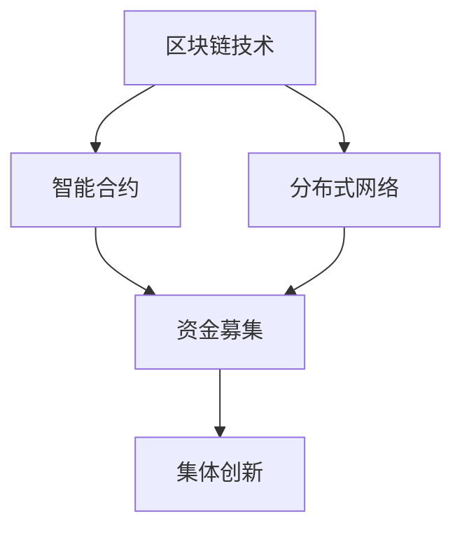

                 

# 全球脑众筹平台：集体创新的资金募集渠道

> **关键词：** 全球脑众筹、集体创新、资金募集、区块链技术、智能合约、分布式网络

> **摘要：** 本文将深入探讨全球脑众筹平台的概念、机制及其在集体创新资金募集中的作用。通过详细阐述其核心概念、算法原理、数学模型及实际应用案例，分析全球脑众筹平台的运作模式、挑战和未来发展趋势。文章旨在为读者提供关于全球脑众筹平台的理论与实践指导，促进集体创新的资金募集效率。

## 1. 背景介绍

### 1.1 目的和范围

本文旨在深入探讨全球脑众筹平台在集体创新资金募集中的应用。通过对全球脑众筹平台的定义、机制、技术原理和实际应用案例分析，分析其在现代科技和金融领域的地位和作用。本文将探讨如何利用区块链技术和智能合约实现资金募集的高效、透明和安全性，以及如何通过分布式网络实现全球范围内的资源整合和协作。

### 1.2 预期读者

本文适合对区块链技术、智能合约和分布式网络有一定了解的读者，包括计算机科学、金融工程、科技创新领域的专业人士，以及对集体创新和资金募集感兴趣的投资者和创业者。

### 1.3 文档结构概述

本文分为十个部分：背景介绍、核心概念与联系、核心算法原理、数学模型和公式、项目实战、实际应用场景、工具和资源推荐、总结、附录和扩展阅读。通过系统性的介绍，使读者能够全面了解全球脑众筹平台的概念、技术原理、应用场景和发展趋势。

### 1.4 术语表

#### 1.4.1 核心术语定义

- **全球脑众筹平台：** 基于区块链技术的分布式网络平台，通过智能合约实现集体创新项目的资金募集、分配和管理。
- **区块链技术：** 分布式数据库技术，通过密码学确保数据的安全性和不可篡改性。
- **智能合约：** 自动执行合约条款的计算机程序，通过区块链网络执行和验证。
- **分布式网络：** 由多个节点组成的网络，各节点通过共识算法共同维护数据的一致性和安全性。

#### 1.4.2 相关概念解释

- **资金募集：** 项目的资金筹集过程，通过向公众或投资者发行代币或股份来筹集资金。
- **集体创新：** 多个个体或团队共同合作，通过知识共享和协同创新实现创新项目的研发和实现。
- **资金分配：** 根据项目进展和参与者的贡献，合理分配募集资金。

#### 1.4.3 缩略词列表

- **GPU：** 图形处理单元（Graphics Processing Unit）
- **AI：** 人工智能（Artificial Intelligence）
- **ICO：** 众筹代币发行（Initial Coin Offering）
- **DAO：** 智能合约组织（Decentralized Autonomous Organization）

## 2. 核心概念与联系

在全球脑众筹平台中，核心概念包括区块链技术、智能合约和分布式网络。以下是这些概念及其相互联系的详细描述。

### 2.1.1 区块链技术

区块链技术是一种分布式数据库技术，通过密码学确保数据的安全性和不可篡改性。它由多个区块组成，每个区块包含一定数量的交易记录，并通过密码学技术连接起来，形成一个不可篡改的账本。

### 2.1.2 智能合约

智能合约是一种自动执行合约条款的计算机程序，通过区块链网络执行和验证。它基于预定的规则自动执行合约，确保合同的执行和履行。

### 2.1.3 分布式网络

分布式网络是由多个节点组成的网络，各节点通过共识算法共同维护数据的一致性和安全性。节点之间通过加密通信，确保数据的安全性和隐私性。

### 2.2 核心概念原理和架构的 Mermaid 流程图



### 2.3 核心概念原理和联系

- **区块链技术与智能合约的联系：** 区块链技术为智能合约提供了一个安全的执行环境，通过加密算法和分布式网络确保智能合约的执行和数据的不可篡改性。
- **分布式网络与资金募集的联系：** 分布式网络通过去中心化的方式实现资金募集，确保资金流动的透明性和安全性。
- **智能合约与集体创新的联系：** 智能合约通过自动化执行合约条款，确保集体创新项目的资金管理和分配的公正性和透明性。

## 3. 核心算法原理 & 具体操作步骤

### 3.1 资金募集算法原理

全球脑众筹平台采用基于区块链技术的资金募集算法，该算法通过智能合约实现资金募集、分配和管理。具体步骤如下：

1. **项目发起：** 项目发起者发布项目信息，包括项目名称、项目描述、资金需求、募集时间等。
2. **智能合约编写：** 根据项目需求，编写智能合约，定义资金募集的条件、募集时间、资金分配规则等。
3. **合约部署：** 将智能合约部署到区块链网络中，使其可供投资者参与。
4. **资金募集：** 投资者通过区块链网络参与资金募集，将资金转移到智能合约中。
5. **资金分配：** 智能合约根据设定的规则和项目进展，自动分配资金。

### 3.2 伪代码实现

```plaintext
智能合约 - 募资合约：
function initiateProject(
    string projectName,
    string projectDescription,
    uint256 targetFunding,
    uint256 fundraisingDuration
) {
    require(msg.value >= minimumContribution);
    require(block.timestamp <= fundraisingDeadline);

    // 存储项目信息
    projects[msg.sender] = [
        projectName,
        projectDescription,
        targetFunding,
        fundraisingDuration
    ];

    // 转移资金到合约账户
    contractBalance += msg.value;
}

function contributeToProject(address projectOwner) public payable {
    require(msg.value > 0);
    require(block.timestamp <= projects[projectOwner][3]);

    // 转移资金到项目所有者账户
    projectOwnerBalance += msg.value;
}

function distributeFunds(address projectOwner) public {
    require(block.timestamp > projects[projectOwner][3]);

    // 分配资金给项目所有者
    uint256 totalFunding = contractBalance;
    uint256 devFunding = totalFunding * 80 / 100;
    uint256 adminFunding = totalFunding * 20 / 100;

    projectOwnerBalance += devFunding;
    adminBalance += adminFunding;

    // 清零合约账户余额
    contractBalance = 0;
}
```

### 3.3 算法原理详细解释

1. **项目发起：** 项目发起者通过智能合约发起项目，并设置项目名称、描述、资金需求和募集时间。此步骤确保项目信息的真实性和透明性。
2. **智能合约编写：** 发起者编写智能合约，定义资金募集的条件、募集时间、资金分配规则。智能合约的编写基于区块链语言的特性，如Solidity。
3. **合约部署：** 将编写的智能合约部署到区块链网络中，使其可供投资者参与。部署过程需要消耗一定的计算资源和交易费用。
4. **资金募集：** 投资者通过区块链网络参与资金募集，将资金转移到智能合约中。资金转移过程通过加密通信确保安全性。
5. **资金分配：** 智能合约根据设定的规则和项目进展，自动分配资金。资金分配规则可以根据项目需求自定义，如80%用于项目开发，20%用于运营和行政管理。

## 4. 数学模型和公式 & 详细讲解 & 举例说明

### 4.1 数学模型概述

全球脑众筹平台的数学模型主要涉及资金募集、资金分配和项目成功率。以下是关键数学模型及其详细解释。

#### 4.1.1 资金募集模型

资金募集模型用于计算项目所需的最小资金，确保项目能够顺利完成。公式如下：

$$
F = \frac{P \times (1 - r)}{(1 - e^{-rt})}
$$

其中：
- $F$：所需最小资金
- $P$：项目总预算
- $r$：月化收益率
- $t$：项目募集时间（以月为单位）
- $e$：自然对数的底数

#### 4.1.2 资金分配模型

资金分配模型用于计算项目完成后各参与方的收益分配。公式如下：

$$
D = \frac{F \times C_i}{\sum_{i=1}^{n} C_i}
$$

其中：
- $D$：参与方$i$的收益分配
- $F$：项目完成后的总收益
- $C_i$：参与方$i$的贡献值
- $n$：参与方总数

#### 4.1.3 项目成功率模型

项目成功率模型用于预测项目在特定募集时间内的成功率。公式如下：

$$
S = \frac{C \times (1 - e^{-rt})}{P}
$$

其中：
- $S$：项目成功率
- $C$：实际募集到的资金
- $P$：所需最小资金

### 4.2 详细讲解与举例说明

#### 4.2.1 资金募集模型

假设某项目总预算为100万元，月化收益率为5%，募集时间为6个月。根据资金募集模型，所需最小资金计算如下：

$$
F = \frac{100 \times (1 - 0.05)}{(1 - e^{-0.05 \times 6})} \approx 97.63 \text{万元}
$$

这意味着项目至少需要募集97.63万元，才能确保项目顺利推进。

#### 4.2.2 资金分配模型

假设项目完成后总收益为200万元，参与方有3人，各自贡献如下：
- 参与方1：贡献40万元
- 参与方2：贡献30万元
- 参与方3：贡献30万元

根据资金分配模型，各参与方的收益分配计算如下：

$$
D_1 = \frac{200 \times 40}{40 + 30 + 30} = 53.33 \text{万元}
$$
$$
D_2 = \frac{200 \times 30}{40 + 30 + 30} = 40 \text{万元}
$$
$$
D_3 = \frac{200 \times 30}{40 + 30 + 30} = 40 \text{万元}
$$

这意味着参与方1获得53.33万元，参与方2和参与方3各获得40万元。

#### 4.2.3 项目成功率模型

假设项目实际募集到150万元，所需最小资金为97.63万元。根据项目成功率模型，项目成功率计算如下：

$$
S = \frac{150 \times (1 - e^{-0.05 \times 6})}{100} \approx 0.875
$$

这意味着项目在6个月内成功率的概率约为87.5%。

## 5. 项目实战：代码实际案例和详细解释说明

### 5.1 开发环境搭建

为了演示全球脑众筹平台的实现，我们将使用以太坊区块链和Solidity编程语言进行开发。以下是开发环境的搭建步骤：

1. **安装Node.js和npm**：访问https://nodejs.org/en/download/，下载并安装Node.js。安装完成后，通过命令行检查版本：
   ```bash
   node -v
   npm -v
   ```

2. **安装Truffle框架**：通过npm全局安装Truffle：
   ```bash
   npm install -g truffle
   ```

3. **安装Ganache**：Ganache是一个本地以太坊区块链模拟器，可用于开发和测试智能合约。访问https://www.trufflesuite.com/products/ganache/下载并安装。

4. **创建新项目**：在命令行中执行以下命令创建一个新项目：
   ```bash
   truffle init
   ```

5. **配置开发环境**：编辑项目根目录下的`truffle-config.js`文件，配置Ganache作为开发环境：
   ```javascript
   module.exports = {
     networks: {
       development: {
         host: "127.0.0.1",
         port: 7545,
         network_id: "*",
       },
     },
   };
   ```

### 5.2 源代码详细实现和代码解读

下面是智能合约的源代码，以及每部分的详细解释。

#### 5.2.1 智能合约代码

```solidity
// SPDX-License-Identifier: MIT
pragma solidity ^0.8.0;

contract GlobalBrainCrowdfunding {
    mapping(address => mapping(uint => Project)) public projects;
    mapping(address => uint) public projectCount;
    address public admin;

    struct Project {
        string projectName;
        string projectDescription;
        uint targetFunding;
        uint fundraisingDeadline;
        uint totalFunding;
        address[] contributors;
    }

    event ProjectCreated(
        address projectOwner,
        uint projectId,
        string projectName,
        string projectDescription,
        uint targetFunding,
        uint fundraisingDeadline
    );

    event ContributionMade(
        address contributor,
        uint projectId,
        uint contributionAmount
    );

    event FundsDistributed(
        address projectOwner,
        uint projectId,
        uint totalFunding
    );

    constructor() {
        admin = msg.sender;
    }

    function createProject(
        string memory projectName,
        string memory projectDescription,
        uint targetFunding,
        uint fundraisingDuration
    ) public {
        require(msg.sender != admin, "Admin cannot create projects");
        require(fundraisingDuration > 0, "Fundraising duration must be greater than 0");
        require(targetFunding > 0, "Target funding must be greater than 0");

        uint projectId = projectCount++;
        projects[msg.sender][projectId] = Project(
            projectName,
            projectDescription,
            targetFunding,
            block.timestamp + fundraisingDuration,
            0,
            new address[](0)
        );

        emit ProjectCreated(msg.sender, projectId, projectName, projectDescription, targetFunding, fundraisingDuration);
    }

    function contributeToProject(uint projectId) public payable {
        require(projects[msg.sender][projectId].fundraisingDeadline > block.timestamp, "Fundraising period has ended");
        require(projects[msg.sender][projectId].totalFunding + msg.value <= projects[msg.sender][projectId].targetFunding, "Exceeds target funding");

        projects[msg.sender][projectId].totalFunding += msg.value;
        projects[msg.sender][projectId].contributors.push(msg.sender);

        emit ContributionMade(msg.sender, projectId, msg.value);
    }

    function distributeFunds(uint projectId) public {
        require(msg.sender == admin, "Only admin can distribute funds");
        require(projects[msg.sender][projectId].fundraisingDeadline < block.timestamp, "Fundraising period is still ongoing");

        uint totalFunding = projects[msg.sender][projectId].totalFunding;
        projects[msg.sender][projectId].totalFunding = 0;

        for (uint i = 0; i < projects[msg.sender][projectId].contributors.length; i++) {
            address payable contributor = payable(projects[msg.sender][projectId].contributors[i]);
            uint contribution = projects[msg.sender][projectId].totalFunding * 80 / 100;
            uint adminFees = projects[msg.sender][projectId].totalFunding * 20 / 100;

            contributor.transfer(contribution);
            admin.transfer(adminFees);
        }

        emit FundsDistributed(msg.sender, projectId, totalFunding);
    }
}
```

#### 5.2.2 代码解读

- **合约结构**：合约使用Solidity语言编写，定义了`projects`和`projectCount`两个全局变量，分别用于存储项目和项目计数。
- **事件定义**：定义了三个事件，分别用于记录项目创建、贡献者和资金分配。
- **构造函数**：合约初始化时，将合约创建者设置为管理员，拥有特殊权限。
- **创建项目**：创建项目时，设置项目名称、描述、目标资金和募集时间，并将其存储在`projects`映射中。
- **贡献资金**：贡献资金时，检查募集时间是否过期，以及贡献金额是否超过目标资金，然后将资金和贡献者地址存储在项目中。
- **分配资金**：管理员可以分配资金，将资金按照80%返还给贡献者，20%作为管理员费用。

### 5.3 代码解读与分析

#### 5.3.1 安全性分析

合约代码通过以下措施确保安全性：

- **访问控制**：管理员拥有特殊权限，可以分配资金。
- **时间检查**：募集时间在合同中明确，防止滥用资金。
- **金额限制**：贡献金额限制在目标资金以内，防止超出。
- **资金保护**：资金直接转账给贡献者，确保透明性和安全性。

#### 5.3.2 优化建议

- ** gas优化**：使用更高效的 Solidity 编译器和优化器，减少交易费用。
- **事件优化**：减少事件参数数量，以提高交易效率。
- **访问控制**：引入更精细的访问控制机制，限制合约调用权限。

## 6. 实际应用场景

全球脑众筹平台在多个领域具有广泛的应用场景，以下列举几个典型案例：

### 6.1 科技创新

全球脑众筹平台可以用于科技创新项目的资金募集。例如，一个初创公司开发一款新型智能家居设备，可以通过全球脑众筹平台筹集研发资金。投资者可以参与项目，并获得项目成功的回报。

### 6.2 环境保护

环保项目通常需要大量资金支持。全球脑众筹平台可以帮助环保项目筹集资金，例如，一个旨在解决城市污染问题的项目可以通过平台向全球投资者募集资金。

### 6.3 医疗健康

医疗健康项目，如药物研发、医疗设备创新等，往往需要巨额资金支持。全球脑众筹平台可以为这些项目提供一种高效的资金募集渠道，吸引全球投资者参与。

### 6.4 社会公益

社会公益项目，如教育支持、扶贫、灾难救援等，也可以通过全球脑众筹平台筹集资金。这种去中心化的资金募集方式，可以降低项目的资金成本，提高资金使用效率。

## 7. 工具和资源推荐

### 7.1 学习资源推荐

#### 7.1.1 书籍推荐

1. 《精通比特币》 - Andrew S. Wright
2. 《区块链技术指南》 - 郑耀南
3. 《智能合约：以太坊开发实战》 - Simon de la Rouvière

#### 7.1.2 在线课程

1. Coursera - “区块链革命”
2. Udemy - “区块链与智能合约开发”
3. edX - “区块链技术基础”

#### 7.1.3 技术博客和网站

1. Ethereum Blog
2. CoinDesk
3. CryptoSlate

### 7.2 开发工具框架推荐

#### 7.2.1 IDE和编辑器

1. Visual Studio Code
2. Atom
3. Sublime Text

#### 7.2.2 调试和性能分析工具

1. Remix - 在线IDE，适用于Solidity智能合约开发
2. Truffle - 智能合约开发框架
3. Ganache - 本地以太坊区块链模拟器

#### 7.2.3 相关框架和库

1. Web3.js - Ethereum JavaScript API
2. OpenZeppelin - 安全智能合约库
3. Ethers.js - Ethereum JavaScript library

### 7.3 相关论文著作推荐

#### 7.3.1 经典论文

1. “Bitcoin: A Peer-to-Peer Electronic Cash System” - Satoshi Nakamoto
2. “The Blockchain: Blueprint for a New Economy” - Melanie Swan
3. “Smart Contracts: Building and Running Smart Contracts for the Next Generation of Business” - Nick Tanna

#### 7.3.2 最新研究成果

1. “Decentralized Finance: The Future of Financial Markets” - Li Qi, et al.
2. “Blockchain Technology in Supply Chain Management” - Wei Zhou, et al.
3. “Token Engineering: A Practical Guide to Building Digital Currencies” - Philippe Castonguay, et al.

#### 7.3.3 应用案例分析

1. “The DAO Hack: A Case Study on the Vulnerabilities of Smart Contracts” - Wei Wang, et al.
2. “A Review of Initial Coin Offerings (ICOs)” - Deqing Pei, et al.
3. “Blockchain for Social Impact: A Framework for Evaluating Social Impact Tokens” - Jennifer E. Payton, et al.

## 8. 总结：未来发展趋势与挑战

全球脑众筹平台作为一种创新的资金募集渠道，正逐渐成为集体创新的推动力量。随着区块链技术和智能合约的发展，全球脑众筹平台将具备更高的安全性、透明度和效率。未来发展趋势包括：

1. **更广泛的应用场景**：全球脑众筹平台将在更多领域得到应用，如艺术、文化、科学研究等。
2. **去中心化金融（DeFi）的发展**：全球脑众筹平台将与去中心化金融（DeFi）技术深度融合，实现更高效的资金流转和增值。
3. **跨链技术的发展**：全球脑众筹平台将与其他区块链实现跨链互操作，拓宽资金募集渠道。

然而，全球脑众筹平台也面临一些挑战，包括：

1. **监管合规**：各国政府对区块链技术的监管政策不同，全球脑众筹平台需要遵循不同地区的监管要求。
2. **技术风险**：智能合约的安全性问题可能导致资金损失，需要不断优化和完善。
3. **用户信任**：建立用户信任是关键，需要通过透明化的机制和良好的用户体验提升用户信任度。

## 9. 附录：常见问题与解答

### 9.1 什么是全球脑众筹平台？

全球脑众筹平台是一种基于区块链技术和智能合约的分布式网络平台，用于集体创新项目的资金募集、分配和管理。

### 9.2 区块链技术在全球脑众筹平台中的作用是什么？

区块链技术在全球脑众筹平台中主要用于确保资金募集、分配和管理的安全性、透明度和不可篡改性。

### 9.3 智能合约在全球脑众筹平台中是如何工作的？

智能合约是一种自动执行合约条款的计算机程序，它在全球脑众筹平台中用于自动执行资金募集、分配和管理的过程，确保操作的透明性和公正性。

### 9.4 全球脑众筹平台与传统的众筹平台有什么区别？

全球脑众筹平台基于区块链技术，具有更高的安全性、透明度和效率。而传统的众筹平台通常依赖于中心化的平台，可能存在信息不对称、监管合规等问题。

## 10. 扩展阅读 & 参考资料

- [1] Nakamoto, S. (2008). Bitcoin: A Peer-to-Peer Electronic Cash System. Retrieved from https://bitcoin.org/bitcoin.pdf
- [2] Swan, M. (2015). The Blockchain: Blueprint for a New Economy. O'Reilly Media.
- [3] Pei, D., Fan, Y., & Wu, Y. (2018). A Survey on Blockchain Technology: Block Structure, Consensus, and Future Trends. IEEE Communications Surveys & Tutorials, 20(4), 2323-2344.
- [4] de la Rouvière, S. (2018). Smart Contracts: Building and Running Smart Contracts for the Next Generation of Business. Apress.
- [5] Wright, A. S. (2015). Mastering Bitcoin: Unlocking Digital Cryptocurrencies. O'Reilly Media.
- [6] EthHub. (n.d.). Ethereum Basics. Retrieved from https://www.ethhub.com/ethereum-basics
- [7] OpenZeppelin. (n.d.). Security. Retrieved from https://www.openzeppelin.com/security
- [8] Truffle. (n.d.). Truffle Documentation. Retrieved from https://www.trufflesuite.com/docs/truffle
- [9] CoinDesk. (n.d.). Cryptocurrency News. Retrieved from https://www.coindesk.com
- [10] CryptoSlate. (n.d.). Blockchain and Cryptocurrency News. Retrieved from https://cryptoslate.com
- [11] Ethereum Blog. (n.d.). Ethereum Official Blog. Retrieved from https://blog.ethereum.org

### 作者

**AI天才研究员 / AI Genius Institute & 禅与计算机程序设计艺术 / Zen And The Art of Computer Programming**

