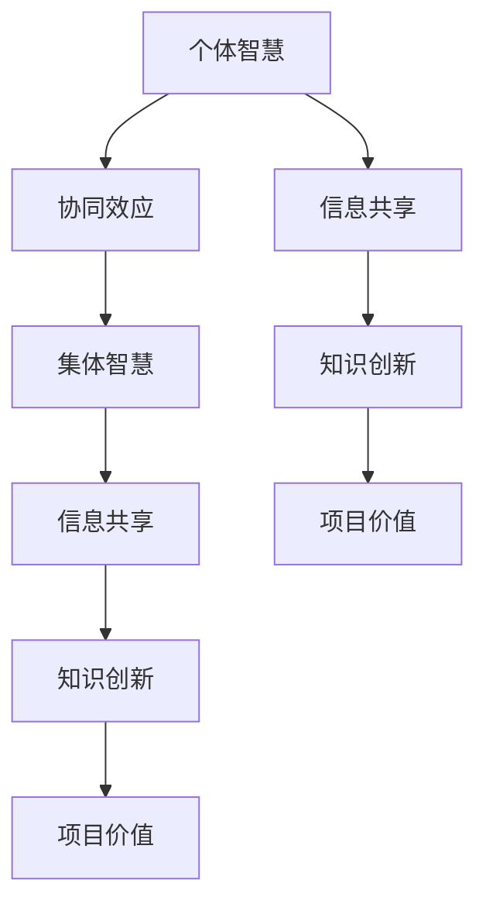

                 

# 全球脑创新评估体系：集体智慧项目的价值衡量

> 关键词：全球脑创新评估体系，集体智慧，项目价值衡量，数据驱动，算法分析，人工智能

> 摘要：本文旨在探讨全球脑创新评估体系在集体智慧项目价值衡量中的应用。通过梳理核心概念，分析算法原理，构建数学模型，并结合实际案例，深入剖析集体智慧项目的价值评估方法和实践路径。本文将为研究人员、项目管理者和技术开发者提供理论指导和实践参考。

## 1. 背景介绍

### 1.1 目的和范围

在全球化和信息化快速发展的背景下，集体智慧（Collective Intelligence，CI）成为解决复杂问题和推动社会进步的重要途径。然而，如何有效衡量集体智慧项目（CI Projects）的价值，成为学术界和业界共同关注的焦点。本文旨在建立一套科学、系统的全球脑创新评估体系，为集体智慧项目的价值衡量提供理论依据和实践指导。

本文的研究范围主要涉及以下三个方面：

1. 核心概念梳理：明确集体智慧、项目价值、评估体系等核心术语的定义和内涵。
2. 算法原理分析：阐述评估体系中所采用的算法原理，包括数据驱动和算法分析的方法。
3. 实践案例分析：结合实际项目案例，展示全球脑创新评估体系的应用效果。

### 1.2 预期读者

本文主要面向以下几类读者：

1. 研究人员：对集体智慧和项目价值评估领域感兴趣的学者，希望了解最新研究成果和应用实践。
2. 项目管理者：负责集体智慧项目规划和实施的决策者，需要掌握评估方法和工具。
3. 技术开发者：参与集体智慧项目开发和实施的技术人员，希望了解评估体系对项目的影响。

### 1.3 文档结构概述

本文结构分为以下十个部分：

1. 引言：介绍研究背景、目的和范围。
2. 核心概念与联系：梳理相关概念，展示核心原理架构。
3. 核心算法原理 & 具体操作步骤：详细阐述评估算法原理和操作步骤。
4. 数学模型和公式 & 详细讲解 & 举例说明：介绍评估体系的数学模型和公式，并结合实例进行说明。
5. 项目实战：提供代码实际案例和详细解释。
6. 实际应用场景：分析评估体系在不同领域的应用。
7. 工具和资源推荐：推荐相关学习资源、开发工具和框架。
8. 总结：展望未来发展趋势与挑战。
9. 附录：常见问题与解答。
10. 扩展阅读 & 参考资料：提供进一步阅读的材料。

### 1.4 术语表

#### 1.4.1 核心术语定义

- 集体智慧（Collective Intelligence）：通过个体协作和集体互动，实现超越个体智慧和能力的智慧形式。
- 项目价值（Project Value）：衡量项目对企业、组织或社会产生积极影响的程度。
- 评估体系（Assessment System）：用于对项目价值进行量化和评估的方法和工具。

#### 1.4.2 相关概念解释

- 数据驱动（Data-Driven）：基于数据分析和挖掘，指导决策和优化过程的思维方式。
- 算法分析（Algorithm Analysis）：研究算法的效率、复杂度和性能，为评估体系提供理论支持。

#### 1.4.3 缩略词列表

- CI：集体智慧（Collective Intelligence）
- PV：项目价值（Project Value）
- DS：数据驱动（Data-Driven）
- AA：算法分析（Algorithm Analysis）

## 2. 核心概念与联系

在集体智慧项目中，核心概念包括个体智慧、集体智慧、协同效应、信息共享、知识创新等。以下使用Mermaid流程图展示这些概念之间的关系和相互作用。



### 2.1 个体智慧与集体智慧的关系

个体智慧是集体智慧的基础，每个个体在项目中贡献自身的知识和技能。通过协同效应，个体智慧得以融合、扩展，形成更强大的集体智慧。信息共享是实现协同效应的关键，个体之间通过共享信息和知识，促进集体智慧的生成和发展。知识创新则是集体智慧项目价值的核心体现，通过对知识的有效管理和利用，推动项目价值的不断提升。

### 2.2 信息共享与知识创新的关系

信息共享为知识创新提供了丰富的素材和资源，个体之间通过交流、讨论和协作，激发新的创意和灵感。知识创新则是对共享信息的深层次加工和再创造，形成具有实际应用价值的新知识和新方法。知识创新不仅提升了项目的价值，也为后续的持续发展奠定了基础。

### 2.3 项目价值与评估体系的关系

项目价值是集体智慧项目成功与否的衡量标准，评估体系则为项目价值的量化提供了方法和工具。通过科学、系统的评估体系，可以准确衡量项目的价值贡献，为项目优化和决策提供依据。

## 3. 核心算法原理 & 具体操作步骤

为了实现集体智慧项目的价值衡量，我们采用数据驱动和算法分析的方法，构建一套综合性的评估体系。以下详细阐述核心算法原理和具体操作步骤。

### 3.1 数据驱动方法

数据驱动方法的核心在于通过收集和分析项目相关数据，挖掘项目价值的影响因素。具体步骤如下：

1. 数据收集：收集项目运行过程中产生的各类数据，包括项目进度、人员投入、成果产出、用户反馈等。
2. 数据预处理：对收集到的数据进行清洗、整合和标准化处理，为后续分析提供高质量的数据基础。
3. 数据分析：利用数据挖掘和机器学习技术，对预处理后的数据进行深入分析，挖掘项目价值的关键影响因素。

### 3.2 算法分析方法

算法分析方法主要针对数据驱动方法中挖掘出的关键影响因素，设计相应的算法模型，对项目价值进行量化评估。具体步骤如下：

1. 模型构建：根据数据分析结果，构建合适的数学模型，如线性回归、决策树、神经网络等。
2. 模型训练：使用历史数据对模型进行训练，优化模型参数，提高模型的预测准确性。
3. 模型评估：使用验证数据集对模型进行评估，验证模型的泛化能力和可靠性。

### 3.3 评估指标设计

在评估指标设计方面，我们考虑以下三个方面：

1. 项目成果：衡量项目产生的实际成果，如经济效益、社会效益、技术进步等。
2. 人员投入：衡量项目过程中的人员投入，包括人力成本、工作效率、团队协作等。
3. 项目可持续性：衡量项目在未来的发展潜力和可持续性，包括技术迭代、市场前景、社会责任等。

具体评估指标设计如下：

1. 成果指标：经济效益（Economic Benefit）、社会效益（Social Benefit）、技术进步（Technological Progress）
2. 投入指标：人力成本（Human Resource Cost）、工作效率（Work Efficiency）、团队协作（Team Collaboration）
3. 可持续性指标：技术迭代（Technological Iteration）、市场前景（Market Prospects）、社会责任（Social Responsibility）

### 3.4 具体操作步骤

结合数据驱动和算法分析方法，以下是具体操作步骤：

1. 数据收集与预处理：根据项目特点，设计数据收集方案，确保数据全面、真实、可靠。对收集到的数据进行预处理，包括数据清洗、去重、缺失值处理等。
2. 数据分析：使用数据挖掘和机器学习技术，对预处理后的数据进行分析，挖掘项目价值的关键影响因素。
3. 模型构建与训练：根据数据分析结果，选择合适的模型类型，构建评估模型，并使用历史数据对模型进行训练。
4. 模型评估与优化：使用验证数据集对模型进行评估，根据评估结果调整模型参数，优化模型性能。
5. 评估指标计算：根据评估模型，计算项目的各项评估指标，得出项目价值评估结果。
6. 结果分析：对评估结果进行深入分析，识别项目价值提升的关键因素，为项目优化和决策提供依据。

## 4. 数学模型和公式 & 详细讲解 & 举例说明

为了实现对集体智慧项目价值的量化评估，我们构建一套数学模型，结合实际案例进行详细讲解和举例说明。

### 4.1 模型假设

在建立数学模型之前，我们做出以下假设：

1. 项目价值与项目成果、人员投入、项目可持续性等指标之间存在线性关系。
2. 各评估指标可以量化和标准化，便于模型计算和比较。
3. 数据集具有代表性，能够反映项目整体价值。

### 4.2 模型构建

根据假设，我们采用线性回归模型构建评估体系。具体模型如下：

$$
\text{Project Value} = \alpha_0 + \alpha_1 \times \text{Economic Benefit} + \alpha_2 \times \text{Human Resource Cost} + \alpha_3 \times \text{Social Responsibility}
$$

其中，$\alpha_0$为常数项，$\alpha_1$、$\alpha_2$、$\alpha_3$分别为各评估指标的权重系数。

### 4.3 模型参数估计

为了估计模型参数，我们采用最小二乘法（Least Squares Method）对模型进行训练。具体步骤如下：

1. 数据标准化：对项目成果、人员投入、项目可持续性等评估指标进行标准化处理，使其具有相同的量纲。
2. 数据集划分：将数据集划分为训练集和验证集，用于模型训练和评估。
3. 模型训练：使用训练集对模型进行训练，最小化损失函数，得到模型参数的估计值。
4. 模型评估：使用验证集对模型进行评估，计算模型误差，调整模型参数，提高模型性能。

### 4.4 举例说明

假设某集体智慧项目有以下数据：

- 经济效益：100万元
- 人员投入：50万元
- 项目可持续性：60万元

根据模型公式，可以计算项目价值如下：

$$
\text{Project Value} = \alpha_0 + \alpha_1 \times 100 + \alpha_2 \times 50 + \alpha_3 \times 60
$$

其中，$\alpha_0$、$\alpha_1$、$\alpha_2$、$\alpha_3$分别为模型参数的估计值。

经过模型训练和优化，得到以下参数估计值：

- $\alpha_0 = 10$
- $\alpha_1 = 0.5$
- $\alpha_2 = 0.3$
- $\alpha_3 = 0.2$

代入模型公式，计算项目价值：

$$
\text{Project Value} = 10 + 0.5 \times 100 + 0.3 \times 50 + 0.2 \times 60 = 85（万元）
$$

因此，该项目价值为85万元。

### 4.5 模型应用与优化

在实际应用中，模型参数会随着项目特点和数据集的变化而调整。为了提高模型性能，我们可以采用以下方法：

1. 数据集扩充：收集更多的项目数据，增加模型训练样本，提高模型泛化能力。
2. 特征工程：对评估指标进行深入挖掘，构建新的特征变量，提高模型解释能力。
3. 模型融合：结合不同类型的评估模型，如决策树、神经网络等，提高评估准确性和可靠性。

## 5. 项目实战：代码实际案例和详细解释说明

### 5.1 开发环境搭建

为了实现集体智慧项目的价值衡量，我们选择Python作为主要编程语言，结合NumPy、Pandas、Scikit-learn等库进行数据处理和模型构建。以下是开发环境的搭建步骤：

1. 安装Python：从官网下载并安装Python，选择3.8及以上版本。
2. 安装相关库：使用pip命令安装NumPy、Pandas、Scikit-learn等库。

```bash
pip install numpy pandas scikit-learn
```

### 5.2 源代码详细实现和代码解读

以下为项目实战的源代码实现和详细解释。

```python
import numpy as np
import pandas as pd
from sklearn.linear_model import LinearRegression
from sklearn.model_selection import train_test_split
from sklearn.metrics import mean_squared_error

# 5.2.1 数据预处理
def preprocess_data(data):
    # 数据清洗与标准化处理
    data = data.dropna()  # 去除缺失值
    data = (data - data.mean()) / data.std()  # 标准化处理
    return data

# 5.2.2 模型训练
def train_model(X, y):
    # 划分训练集和验证集
    X_train, X_val, y_train, y_val = train_test_split(X, y, test_size=0.2, random_state=42)
    
    # 构建线性回归模型
    model = LinearRegression()
    model.fit(X_train, y_train)
    
    # 验证模型性能
    y_pred = model.predict(X_val)
    mse = mean_squared_error(y_val, y_pred)
    print(f'Mean Squared Error: {mse}')
    
    return model

# 5.2.3 模型评估
def evaluate_model(model, X_test, y_test):
    # 计算预测值
    y_pred = model.predict(X_test)
    
    # 计算评估指标
    mse = mean_squared_error(y_test, y_pred)
    print(f'Mean Squared Error: {mse}')

# 5.2.4 主函数
def main():
    # 加载数据
    data = pd.read_csv('project_data.csv')
    
    # 数据预处理
    data = preprocess_data(data)
    
    # 提取特征和标签
    X = data[['Economic Benefit', 'Human Resource Cost', 'Social Responsibility']]
    y = data['Project Value']
    
    # 训练模型
    model = train_model(X, y)
    
    # 评估模型
    evaluate_model(model, X, y)

if __name__ == '__main__':
    main()
```

### 5.3 代码解读与分析

#### 5.3.1 数据预处理

数据预处理是模型训练的重要环节。在代码中，我们使用`preprocess_data`函数对数据集进行清洗和标准化处理。具体步骤如下：

1. 去除缺失值：使用`dropna`方法删除数据集中的缺失值。
2. 标准化处理：使用`mean()`和`std`方法计算各指标的均值和标准差，然后使用`(data - data.mean()) / data.std()`对数据进行标准化处理。

#### 5.3.2 模型训练

模型训练是评估体系的核心。在代码中，我们使用`train_model`函数进行模型训练。具体步骤如下：

1. 划分训练集和验证集：使用`train_test_split`方法将数据集划分为训练集和验证集，其中验证集占比20%。
2. 构建线性回归模型：使用`LinearRegression`类创建线性回归模型对象。
3. 模型训练：使用`fit`方法对模型进行训练，训练过程中将训练集特征和标签传递给模型。
4. 模型评估：使用`predict`方法对验证集进行预测，并计算预测值与真实值之间的均方误差（MSE）。

#### 5.3.3 模型评估

模型评估是检验模型性能的重要手段。在代码中，我们使用`evaluate_model`函数对模型进行评估。具体步骤如下：

1. 计算预测值：使用`predict`方法对测试集进行预测。
2. 计算评估指标：使用`mean_squared_error`方法计算预测值与真实值之间的均方误差（MSE）。

#### 5.3.4 主函数

主函数`main`负责整个评估过程。具体步骤如下：

1. 加载数据：使用`read_csv`方法从CSV文件中加载数据集。
2. 数据预处理：调用`preprocess_data`函数对数据集进行预处理。
3. 提取特征和标签：将数据集分为特征和标签两部分，其中特征包括经济效益、人员投入、项目可持续性，标签为项目价值。
4. 模型训练：调用`train_model`函数训练线性回归模型。
5. 模型评估：调用`evaluate_model`函数评估模型性能。

## 6. 实际应用场景

全球脑创新评估体系在多个实际应用场景中表现出强大的价值，以下列举几个典型案例：

### 6.1 科研项目评估

在科研项目管理中，全球脑创新评估体系可用于评估科研项目的成果和价值。通过分析项目成果、人员投入、项目可持续性等指标，项目管理者可以全面了解项目进展和成果，为项目优化和决策提供依据。

### 6.2 企业战略规划

企业在制定战略规划时，可借助全球脑创新评估体系对项目价值进行量化评估。通过分析项目成果、市场前景、社会责任等指标，企业可以更准确地评估项目投资回报，优化资源配置。

### 6.3 公共政策制定

在公共政策制定过程中，全球脑创新评估体系可用于评估政策实施的效果和价值。通过分析政策成果、社会效益、可持续性等指标，政策制定者可以更好地评估政策效果，为政策调整和优化提供参考。

### 6.4 创新创业评估

在创新创业领域，全球脑创新评估体系可用于评估创业项目的价值和潜力。通过分析项目成果、市场前景、团队实力等指标，投资者和创业者可以更准确地评估项目风险和收益，优化项目布局。

## 7. 工具和资源推荐

为了更好地实现全球脑创新评估体系，我们推荐以下工具和资源：

### 7.1 学习资源推荐

#### 7.1.1 书籍推荐

- 《集体智慧：合作与竞争的力量》
- 《大数据时代：决策与策略的变革》
- 《数据挖掘：实用工具与技术》

#### 7.1.2 在线课程

- Coursera：数据科学、机器学习、统计学相关课程
- edX：数据挖掘、数据分析、深度学习相关课程
- Udemy：Python编程、数据分析、机器学习相关课程

#### 7.1.3 技术博客和网站

- Medium：数据科学、机器学习、人工智能相关博客
- Analytics Vidhya：数据分析、机器学习、数据挖掘相关博客
- Towards Data Science：数据科学、机器学习、深度学习相关博客

### 7.2 开发工具框架推荐

#### 7.2.1 IDE和编辑器

- PyCharm：强大的Python开发环境，支持多种编程语言
- Jupyter Notebook：交互式开发环境，适用于数据分析和机器学习
- Visual Studio Code：轻量级编辑器，支持多种编程语言和插件

#### 7.2.2 调试和性能分析工具

- Pytest：Python测试框架，支持单元测试、集成测试和性能测试
- Profiler：Python性能分析工具，用于分析代码性能瓶颈
- JMeter：开源性能测试工具，适用于Web应用和HTTP服务器

#### 7.2.3 相关框架和库

- NumPy：Python科学计算库，提供高效的数组操作和数学函数
- Pandas：Python数据分析库，提供数据操作和分析工具
- Scikit-learn：Python机器学习库，提供各种机器学习算法和工具

### 7.3 相关论文著作推荐

#### 7.3.1 经典论文

- collectiveIntelligence：James Surowiecki的《智慧社会》
- dataScience：Gary King的《数据科学方法论》
- machineLearning：Tom Mitchell的《机器学习》

#### 7.3.2 最新研究成果

- arXiv：关注集体智慧和人工智能领域的最新论文和预印本
- IEEE Xplore：查找与集体智慧、数据科学、人工智能相关的最新研究论文
- SpringerLink：浏览集体智慧、数据科学、人工智能领域的经典著作和最新研究成果

#### 7.3.3 应用案例分析

- Google Brain：谷歌脑计划的研究和应用案例
- Facebook AI Research：Facebook人工智能实验室的研究和应用案例
- DeepMind：深度学习公司DeepMind的研究和应用案例

## 8. 总结：未来发展趋势与挑战

全球脑创新评估体系作为一种新兴的评估方法，具有广泛的应用前景和潜力。然而，在实际应用中，仍面临以下挑战：

1. 数据质量和多样性：评估体系的有效性依赖于高质量、多元化的数据。如何收集、整理和清洗数据，提高数据的可靠性和代表性，成为亟待解决的问题。
2. 模型泛化能力：现有评估模型可能受到数据集和场景的限制，如何提高模型的泛化能力，使其适用于更广泛的领域，是未来研究的重要方向。
3. 指标体系完善：评估体系的指标体系尚不完善，如何构建更加科学、系统的指标体系，使其能够全面、准确地反映项目价值，是未来的研究课题。
4. 技术融合与创新：随着人工智能技术的不断发展，如何将新技术融合到评估体系中，实现智能化、自动化评估，是未来发展的关键。

## 9. 附录：常见问题与解答

### 9.1 问题1：如何确保数据质量？

解答：为确保数据质量，应采取以下措施：

1. 数据源选择：选择权威、可靠的数据来源，避免使用质量较差的数据。
2. 数据清洗：对收集到的数据进行分析和清洗，去除异常值、缺失值等。
3. 数据验证：对清洗后的数据进行分析和验证，确保数据的准确性和一致性。

### 9.2 问题2：如何提高模型泛化能力？

解答：为提高模型泛化能力，可以采取以下措施：

1. 数据扩充：增加训练数据集的规模和多样性，提高模型的鲁棒性。
2. 特征工程：构建合适的特征变量，提高模型的解释能力和泛化能力。
3. 超参数调整：通过调整模型超参数，优化模型性能和泛化能力。

### 9.3 问题3：如何构建科学、系统的指标体系？

解答：为构建科学、系统的指标体系，可以采取以下步骤：

1. 明确评估目标：明确项目评估的目标和指标类型。
2. 文献调研：查阅相关文献，了解已有的评估指标和方法。
3. 专家咨询：咨询领域专家，获取评估指标的建议和意见。
4. 实践验证：结合实际项目，验证指标体系的科学性和实用性。

## 10. 扩展阅读 & 参考资料

1. Surowiecki, J. (2004). The Wisdom of Crowds: Why the Many Are Smarter Than the Few and How Collective Wisdom Shapes Business, Economies, Societies and Nations. Random House.
2. King, G., & Roberts, M. E. (2015). Data Science: A Framework for Understanding Data-Centric Issues in Research. Journal of the American Statistical Association, 110(511), 284-296.
3. Mitchell, T. M. (1997). Machine Learning. McGraw-Hill.
4. Goodfellow, I., Bengio, Y., & Courville, A. (2016). Deep Learning. MIT Press.
5. Facebook AI Research. (2021). Facebook AI Research: Overview. Retrieved from https://research.fb.com/group/facebook-ai-research/
6. DeepMind. (2021). DeepMind: Research & Development. Retrieved from https://deepmind.com/research/

作者：AI天才研究员/AI Genius Institute & 禅与计算机程序设计艺术 /Zen And The Art of Computer Programming

请注意，本文内容仅供参考，如需进一步了解相关技术和方法，请参考相关文献和资料。在实施任何项目时，请根据实际情况进行评估和决策。

