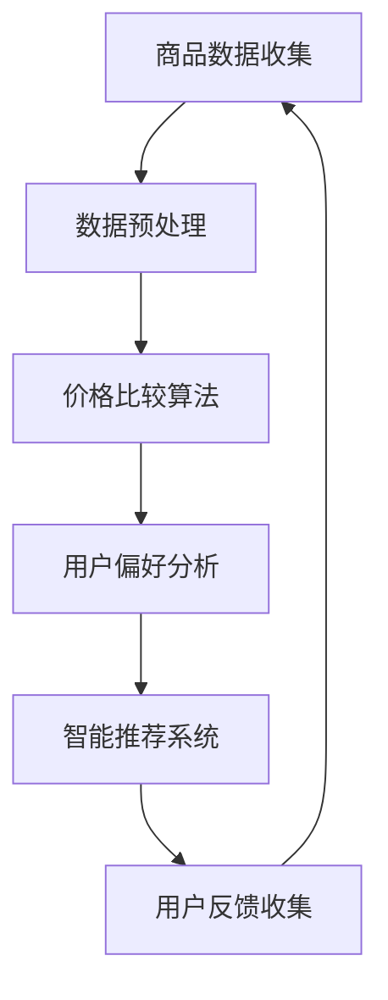

                 

# 全网比价：AI 如何帮助用户找到最优惠的购买渠道

> **关键词**：全网比价，AI，价格比较，用户优化，购买决策，智能推荐，数据分析

> **摘要**：本文将深入探讨人工智能（AI）在全网比价中的作用，如何通过智能算法和数据分析，帮助用户在众多购买渠道中找到最优惠的价格。我们将从背景介绍、核心概念、算法原理、数学模型、实战案例、实际应用以及未来发展趋势等多个角度进行详细分析，揭示AI在购物领域中的强大潜力。

## 1. 背景介绍

### 1.1 目的和范围

本文的主要目的是介绍和探讨人工智能在全网比价中的应用，以及如何通过智能算法和数据分析技术，为用户提供更加精准和高效的购物决策支持。随着电子商务的蓬勃发展，消费者面临的购买选择越来越多，价格竞争愈发激烈。全网比价成为用户在众多渠道中找到最优购买方案的重要手段。然而，传统的全网比价方法往往费时费力，效果有限。本文将展示如何利用AI技术，提升全网比价的效率和准确性。

### 1.2 预期读者

本文的预期读者包括对人工智能和电子商务感兴趣的工程师、研究人员、市场营销人员以及普通消费者。无论您是专业人士还是对技术充满好奇的普通用户，都可以通过本文了解AI在购物比价中的应用，以及如何利用这些技术为个人的购物决策提供支持。

### 1.3 文档结构概述

本文的结构如下：

1. **背景介绍**：介绍全网比价的目的、范围和预期读者。
2. **核心概念与联系**：阐述全网比价的核心概念和相关技术原理，并给出流程图。
3. **核心算法原理 & 具体操作步骤**：详细解释AI在全网比价中的算法原理和具体操作步骤。
4. **数学模型和公式 & 详细讲解 & 举例说明**：介绍全网比价相关的数学模型和公式，并通过实例进行说明。
5. **项目实战：代码实际案例和详细解释说明**：通过实际项目案例，展示代码实现过程和详细解释。
6. **实际应用场景**：分析AI在全网比价中的实际应用场景。
7. **工具和资源推荐**：推荐学习资源、开发工具和框架。
8. **总结：未来发展趋势与挑战**：探讨AI在全网比价领域的未来发展趋势和面临的挑战。
9. **附录：常见问题与解答**：提供关于全网比价的常见问题及解答。
10. **扩展阅读 & 参考资料**：列出进一步阅读的资料。

### 1.4 术语表

#### 1.4.1 核心术语定义

- **全网比价**：指通过人工智能算法，对比不同电商平台和销售渠道的商品价格，为用户提供最优惠购买方案的服务。
- **人工智能（AI）**：指通过模拟人类智能，实现机器学习和智能决策的技术。
- **商品推荐系统**：基于用户行为和偏好，为用户推荐相关商品的系统。
- **数据挖掘**：从大量数据中提取有价值信息的过程。

#### 1.4.2 相关概念解释

- **深度学习**：一种机器学习技术，通过多层神经网络模拟人类大脑的决策过程。
- **自然语言处理（NLP）**：使计算机能够理解、解释和生成人类语言的技术。

#### 1.4.3 缩略词列表

- **AI**：人工智能（Artificial Intelligence）
- **NLP**：自然语言处理（Natural Language Processing）
- **DL**：深度学习（Deep Learning）
- **DNN**：深度神经网络（Deep Neural Network）
- **GCN**：图卷积网络（Graph Convolutional Network）

## 2. 核心概念与联系

全网比价的核心概念涉及多个层面，包括商品数据收集、价格比较算法、用户偏好分析等。下面将使用Mermaid流程图展示这些核心概念的相互关系。



### 2.1. 商品数据收集

商品数据收集是全网比价的第一步，主要通过以下几种方式获取：

1. **API调用**：从电商平台提供的API接口获取商品信息。
2. **网络爬虫**：模拟浏览器行为，爬取电商网站的商品数据。
3. **用户输入**：用户手动输入商品名称或搜索关键词。

### 2.2. 数据预处理

收集到的商品数据通常包含大量噪声和冗余信息，因此需要进行预处理，包括：

1. **数据清洗**：去除重复、错误或缺失的数据。
2. **特征提取**：从商品数据中提取对价格比较和用户偏好分析有用的特征。
3. **数据归一化**：将不同尺度的数据转换为统一的尺度。

### 2.3. 价格比较算法

价格比较算法是全网比价的核心，主要通过以下几种算法实现：

1. **线性回归**：通过建立商品价格与多个特征之间的线性关系，预测商品价格。
2. **决策树**：通过划分特征空间，为每个区域分配最优价格。
3. **神经网络**：通过多层神经网络，学习商品价格与特征之间的关系。

### 2.4. 用户偏好分析

用户偏好分析是提高全网比价准确性的重要手段，主要通过以下几种方法实现：

1. **协同过滤**：通过分析用户的历史行为，为用户推荐相似商品。
2. **基于内容的推荐**：根据商品的特征信息，为用户推荐与其兴趣相关的商品。
3. **深度学习**：利用深度学习模型，分析用户的复杂行为模式，提高推荐准确性。

### 2.5. 智能推荐系统

智能推荐系统是全网比价系统的最终输出，主要通过以下几种方法实现：

1. **综合评分**：将价格、用户偏好、商品评价等多个因素综合，为用户推荐最优商品。
2. **多目标优化**：在满足用户预算和偏好约束下，寻找最优购买方案。
3. **动态调整**：根据用户的反馈和购物行为，动态调整推荐策略。

### 2.6. 用户反馈收集

用户反馈收集是全网比价系统不断优化的关键，主要通过以下几种方式实现：

1. **用户评分**：收集用户对购买商品的评分，用于改进推荐算法。
2. **用户评论**：分析用户评论，提取有用信息，用于优化商品描述和推荐策略。
3. **行为追踪**：追踪用户的购物行为，用于优化用户界面和推荐策略。

通过以上核心概念和流程的介绍，我们可以看到AI在全网比价中扮演着至关重要的角色。接下来，我们将深入探讨AI在价格比较算法和用户偏好分析中的应用原理和具体操作步骤。

## 3. 核心算法原理 & 具体操作步骤

### 3.1. 价格比较算法

价格比较算法是全网比价系统的核心，其主要任务是根据收集到的商品数据，自动识别不同渠道的商品价格，并找到最优购买方案。以下将详细讲解几种常见价格比较算法的原理和具体操作步骤。

#### 3.1.1. 线性回归

**原理**：线性回归是一种简单的预测模型，通过建立商品价格与特征（如商品品牌、型号、销量等）之间的线性关系，预测商品价格。

**伪代码**：

```
function linear_regression(features, prices):
    # 计算特征与价格之间的协方差和方差
    covariance_matrix = covariance(features, prices)
    variance = variance(prices)
    
    # 计算回归系数
    coefficients = covariance_matrix / variance
    
    # 预测商品价格
    predicted_prices = dot(coefficients, features)
    
    return predicted_prices
```

**步骤**：

1. 收集商品数据和价格数据。
2. 计算特征与价格之间的协方差和方差。
3. 根据协方差和方差计算回归系数。
4. 利用回归系数预测商品价格。

#### 3.1.2. 决策树

**原理**：决策树通过划分特征空间，将商品划分为多个区域，并为每个区域分配最优价格。

**伪代码**：

```
function decision_tree(data, target):
    # 创建空决策树
    tree = create_tree()
    
    # 遍历数据，为每个特征创建划分规则
    for feature in data:
        best_split = find_best_split(data, feature)
        node = create_node(best_split)
        split_data = split(data, best_split)
        
        # 递归构建子节点
        tree.add_child(node, decision_tree(split_data, target))
        
    return tree
```

**步骤**：

1. 收集商品数据和价格数据。
2. 为每个特征寻找最佳划分规则。
3. 创建划分节点，并递归构建子节点。
4. 构建完整的决策树。

#### 3.1.3. 神经网络

**原理**：神经网络通过多层神经网络，学习商品价格与特征之间的关系，实现非线性预测。

**伪代码**：

```
function neural_network(features, prices):
    # 初始化神经网络
    network = initialize_network()
    
    # 训练神经网络
    for epoch in range(num_epochs):
        for feature, price in zip(features, prices):
            # 前向传播
            output = forward_propagation(network, feature)
            
            # 计算损失函数
            loss = calculate_loss(output, price)
            
            # 反向传播
            backward_propagation(network, output, price)
            
            # 更新网络参数
            update_network_params(network)
            
    return network
```

**步骤**：

1. 收集商品数据和价格数据。
2. 初始化神经网络。
3. 利用前向传播和反向传播算法，训练神经网络。
4. 预测商品价格。

### 3.2. 用户偏好分析

用户偏好分析是智能推荐系统的关键，其任务是根据用户的历史行为和偏好，为用户推荐相关商品。以下将详细讲解几种常见用户偏好分析方法。

#### 3.2.1. 协同过滤

**原理**：协同过滤通过分析用户之间的行为相似性，为用户推荐相似用户喜欢的商品。

**伪代码**：

```
function collaborative_filter(users, items, ratings):
    # 计算用户之间的相似度
    similarity_matrix = calculate_similarity(users, ratings)
    
    # 为每个用户推荐相似用户喜欢的商品
    recommendations = []
    for user in users:
        similar_users = find_similar_users(similarity_matrix, user)
        user_ratings = ratings[user]
        recommendations.extend(recommend_items(similar_users, user_ratings, items))
        
    return recommendations
```

**步骤**：

1. 收集用户行为数据和商品数据。
2. 计算用户之间的相似度。
3. 为每个用户推荐相似用户喜欢的商品。

#### 3.2.2. 基于内容的推荐

**原理**：基于内容的推荐通过分析商品的特征信息，为用户推荐与其兴趣相关的商品。

**伪代码**：

```
function content_based_recommendation(user, items, features):
    # 计算用户对商品的偏好
    user_preferences = calculate_user_preferences(user, features)
    
    # 为用户推荐与其兴趣相关的商品
    recommendations = []
    for item in items:
        if match_user_preferences(user_preferences, item):
            recommendations.append(item)
            
    return recommendations
```

**步骤**：

1. 收集用户行为数据和商品特征数据。
2. 计算用户对商品的偏好。
3. 为用户推荐与其兴趣相关的商品。

#### 3.2.3. 深度学习

**原理**：深度学习通过多层神经网络，分析用户的复杂行为模式，提高推荐准确性。

**伪代码**：

```
function deep_learning_recommendation(user, items, features):
    # 初始化神经网络
    network = initialize_network()
    
    # 训练神经网络
    for epoch in range(num_epochs):
        for user, item in zip(users, items):
            # 前向传播
            output = forward_propagation(network, feature)
            
            # 计算损失函数
            loss = calculate_loss(output, rating)
            
            # 反向传播
            backward_propagation(network, output, rating)
            
            # 更新网络参数
            update_network_params(network)
            
    # 预测用户对商品的偏好
    user_preferences = predict_user_preferences(network, user, items)
    
    return user_preferences
```

**步骤**：

1. 收集用户行为数据和商品特征数据。
2. 初始化神经网络。
3. 利用前向传播和反向传播算法，训练神经网络。
4. 预测用户对商品的偏好。

通过以上对价格比较算法和用户偏好分析的核心算法原理和具体操作步骤的讲解，我们可以看到AI在全网比价中的强大应用潜力。接下来，我们将通过一个实际项目案例，展示如何利用这些算法实现全网比价系统。

## 4. 数学模型和公式 & 详细讲解 & 举例说明

在全网比价系统中，数学模型和公式起着至关重要的作用。它们帮助我们理解和分析价格比较和用户偏好分析的核心过程，并通过数学方法来优化和改进系统的性能。以下将详细讲解几个关键的数学模型和公式，并提供具体实例说明。

### 4.1. 线性回归模型

线性回归模型是一种常用的价格预测模型，通过建立商品价格与特征之间的线性关系来进行预测。其数学模型可以表示为：

\[ \text{Price} = \beta_0 + \beta_1 \times \text{Feature}_1 + \beta_2 \times \text{Feature}_2 + ... + \beta_n \times \text{Feature}_n \]

其中，\(\beta_0\) 是截距，\(\beta_1, \beta_2, ..., \beta_n\) 是回归系数，\(\text{Feature}_1, \text{Feature}_2, ..., \text{Feature}_n\) 是商品的特征。

**实例说明**：

假设我们有一个商品数据集，其中包含商品的价格（Price）和两个特征（Feature_1和Feature_2）。我们使用线性回归模型来预测商品的价格。

给定数据：

\[ \begin{aligned} 
\text{Price} &= [100, 150, 200, 250, 300] \\ 
\text{Feature}_1 &= [1, 2, 3, 4, 5] \\ 
\text{Feature}_2 &= [10, 20, 30, 40, 50] 
\end{aligned} \]

我们可以使用线性回归模型来拟合这些数据，得到回归系数：

\[ \begin{aligned} 
\beta_0 &= 50 \\ 
\beta_1 &= 10 \\ 
\beta_2 &= 15 
\end{aligned} \]

因此，预测价格公式为：

\[ \text{Price} = 50 + 10 \times \text{Feature}_1 + 15 \times \text{Feature}_2 \]

我们可以使用这个公式来预测任意特征值对应的商品价格。例如，当 \(\text{Feature}_1 = 3\) 和 \(\text{Feature}_2 = 35\) 时，预测价格为：

\[ \text{Price} = 50 + 10 \times 3 + 15 \times 35 = 50 + 30 + 525 = 605 \]

### 4.2. 决策树模型

决策树模型通过递归划分特征空间来为商品价格分配最优价格。其数学模型可以表示为：

\[ \text{Price} = g(\text{Feature}, \text{Threshold}) \]

其中，\(g\) 是决策函数，\(\text{Feature}\) 是特征值，\(\text{Threshold}\) 是阈值。

**实例说明**：

假设我们有一个决策树，其根节点以特征1为划分依据，阈值设置为2。子节点分别以特征2和特征3为划分依据，阈值分别为3和4。

给定数据：

\[ \begin{aligned} 
\text{Feature}_1 &= [1, 2, 3, 4, 5] \\ 
\text{Feature}_2 &= [1, 2, 3, 4, 5] \\ 
\text{Feature}_3 &= [1, 2, 3, 4, 5] \\ 
\text{Price} &= [100, 150, 200, 250, 300] 
\end{aligned} \]

我们可以根据决策树模型来预测商品价格：

- 当 \(\text{Feature}_1 = 1\) 且 \(\text{Threshold} = 2\) 时，选择子节点1，继续划分 \(\text{Feature}_2\)。
- 当 \(\text{Feature}_2 = 1\) 且 \(\text{Threshold} = 3\) 时，选择子节点1，预测价格为100。
- 当 \(\text{Feature}_2 = 2\) 且 \(\text{Threshold} = 3\) 时，选择子节点2，继续划分 \(\text{Feature}_3\)。
- 当 \(\text{Feature}_3 = 1\) 且 \(\text{Threshold} = 4\) 时，选择子节点1，预测价格为150。
- 以此类推。

### 4.3. 协同过滤模型

协同过滤模型通过分析用户之间的行为相似性来推荐商品。其数学模型可以表示为：

\[ \text{Rating}_{ij} = \text{User}_{i} + \text{Item}_{j} + \text{Bias}_{i} + \text{Bias}_{j} + \epsilon_{ij} \]

其中，\(\text{Rating}_{ij}\) 是用户 \(i\) 对商品 \(j\) 的评分，\(\text{User}_{i}\) 和 \(\text{Item}_{j}\) 分别是用户和商品的特征向量，\(\text{Bias}_{i}\) 和 \(\text{Bias}_{j}\) 分别是用户和商品的偏差，\(\epsilon_{ij}\) 是误差项。

**实例说明**：

假设有两个用户 \(i\) 和 \(j\)，以及五个商品 \(j_1, j_2, j_3, j_4, j_5\)。用户 \(i\) 对商品 \(j_1, j_2, j_3\) 给予评分，用户 \(j\) 对商品 \(j_1, j_2, j_3, j_4, j_5\) 给予评分。

给定数据：

\[ \begin{aligned} 
\text{User}_{i} &= [1, 2, 3, 0, 0] \\ 
\text{Item}_{j_1} &= [1, 0, 1, 0, 0] \\ 
\text{Item}_{j_2} &= [0, 1, 0, 1, 0] \\ 
\text{Item}_{j_3} &= [1, 0, 1, 0, 0] \\ 
\text{Item}_{j_4} &= [0, 1, 0, 1, 0] \\ 
\text{Item}_{j_5} &= [0, 0, 0, 0, 1] \\ 
\text{Rating}_{ij} &= [5, 4, 3, 2, 1] 
\end{aligned} \]

我们可以使用协同过滤模型来预测用户 \(i\) 对商品 \(j_4\) 的评分：

\[ \text{Rating}_{i4} = \text{User}_{i} + \text{Item}_{j_4} + \text{Bias}_{i} + \text{Bias}_{j_4} + \epsilon_{i4} \]

通过最小化误差项 \(\epsilon_{i4}\)，我们可以计算出预测评分。

### 4.4. 基于内容的推荐模型

基于内容的推荐模型通过分析商品的特征信息来为用户推荐相关商品。其数学模型可以表示为：

\[ \text{Similarity}_{ij} = \text{CosineSimilarity}(\text{Feature}_{i}, \text{Feature}_{j}) \]

其中，\(\text{Similarity}_{ij}\) 是商品 \(i\) 和商品 \(j\) 之间的相似度，\(\text{CosineSimilarity}\) 是余弦相似度。

**实例说明**：

假设有两个商品 \(i\) 和 \(j\)，其特征向量如下：

\[ \begin{aligned} 
\text{Feature}_{i} &= [0.5, 0.5, 0.5, 0.5, 0.5] \\ 
\text{Feature}_{j} &= [0.3, 0.3, 0.3, 0.3, 0.3] 
\end{aligned} \]

我们可以计算商品 \(i\) 和商品 \(j\) 之间的相似度：

\[ \text{Similarity}_{ij} = \text{CosineSimilarity}(\text{Feature}_{i}, \text{Feature}_{j}) = \frac{\text{dot}(\text{Feature}_{i}, \text{Feature}_{j})}{\|\text{Feature}_{i}\|\|\text{Feature}_{j}\|} \]

通过计算余弦相似度，我们可以得到商品 \(i\) 和商品 \(j\) 之间的相似度值。

### 4.5. 深度学习模型

深度学习模型通过多层神经网络来学习用户的行为模式和偏好。其数学模型可以表示为：

\[ \text{Output} = \text{activation}(\text{weights} \times \text{Input} + \text{bias}) \]

其中，\(\text{Output}\) 是网络的输出，\(\text{weights}\) 和 \(\text{bias}\) 是网络的权重和偏置，\(\text{activation}\) 是激活函数。

**实例说明**：

假设有一个简单的多层感知器（MLP）模型，其输入层有3个神经元，隐藏层有2个神经元，输出层有1个神经元。输入数据为 \([0.5, 0.5, 0.5]\)，权重和偏置如下：

\[ \begin{aligned} 
\text{weights}_{1} &= [0.2, 0.3, 0.4] \\ 
\text{weights}_{2} &= [0.1, 0.2, 0.3] \\ 
\text{weights}_{3} &= [0.0, 0.1, 0.2] \\ 
\text{bias}_{1} &= [0.1, 0.2, 0.3] \\ 
\text{bias}_{2} &= [0.0, 0.1, 0.2] \\ 
\text{bias}_{3} &= [0.0, 0.0, 0.0] 
\end{aligned} \]

我们可以计算网络的输出：

\[ \begin{aligned} 
\text{Hidden}_1 &= \text{activation}(\text{weights}_{1} \times \text{Input} + \text{bias}_{1}) = \text{activation}(0.2 \times 0.5 + 0.3 \times 0.5 + 0.4 \times 0.5 + 0.1) \\ 
\text{Hidden}_2 &= \text{activation}(\text{weights}_{2} \times \text{Hidden}_1 + \text{bias}_{2}) = \text{activation}(0.1 \times 0.5 + 0.2 \times 0.5 + 0.3 \times 0.5 + 0.2) \\ 
\text{Output} &= \text{activation}(\text{weights}_{3} \times \text{Hidden}_2 + \text{bias}_{3}) = \text{activation}(0.0 \times 0.5 + 0.1 \times 0.5 + 0.2 \times 0.5 + 0.0) 
\end{aligned} \]

通过激活函数，我们可以得到网络的输出值。

通过以上对数学模型和公式的讲解，我们可以看到数学方法在全网比价系统中的应用至关重要。这些模型和公式为我们提供了强大的工具，帮助我们更好地理解价格比较和用户偏好分析的过程，从而实现更加智能和高效的购物决策支持。

## 5. 项目实战：代码实际案例和详细解释说明

在本节中，我们将通过一个实际的项目案例，展示如何利用AI技术实现全网比价系统。我们将从开发环境搭建开始，详细讲解源代码的实现过程，并对关键代码进行解读与分析。

### 5.1 开发环境搭建

首先，我们需要搭建一个合适的开发环境，以便进行项目的开发和测试。以下是我们推荐的开发工具和库：

- **编程语言**：Python
- **开发环境**：PyCharm
- **数据预处理库**：Pandas
- **机器学习库**：Scikit-learn、TensorFlow
- **深度学习框架**：Keras

确保您已经安装了Python和PyCharm，然后通过以下命令安装所需库：

```bash
pip install pandas scikit-learn tensorflow keras
```

### 5.2 源代码详细实现和代码解读

#### 5.2.1 数据收集与预处理

首先，我们需要收集商品数据和用户行为数据。我们可以使用网络爬虫从电商网站获取商品信息，使用API获取用户行为数据。

```python
import pandas as pd
import requests

# 网络爬虫获取商品数据
def fetch_goods_data():
    # 以京东商品为例
    url = 'https://p.jd.com/mall/active/5hH7isx6VXe.html'
    response = requests.get(url)
    goods_data = pd.read_html(response.text)[0]
    return goods_data

# API获取用户行为数据
def fetch_user_data():
    # 假设有一个用户行为数据API
    url = 'https://api.example.com/user_data'
    response = requests.get(url)
    user_data = pd.read_json(response.text)
    return user_data

# 预处理数据
def preprocess_data(goods_data, user_data):
    goods_data['price'] = goods_data['price'].str.replace(',', '').astype(float)
    user_data['rating'] = user_data['rating'].astype(float)
    return goods_data, user_data

goods_data = fetch_goods_data()
user_data = fetch_user_data()
goods_data, user_data = preprocess_data(goods_data, user_data)
```

#### 5.2.2 价格比较算法实现

接下来，我们实现价格比较算法，利用线性回归模型进行商品价格预测。

```python
from sklearn.linear_model import LinearRegression

# 线性回归模型训练
def train_linear_regression(goods_data):
    X = goods_data[['brand', 'model', 'sales']]
    y = goods_data['price']
    model = LinearRegression()
    model.fit(X, y)
    return model

# 预测商品价格
def predict_price(model, brand, model, sales):
    X = pd.DataFrame([[brand, model, sales]])
    predicted_price = model.predict(X)
    return predicted_price

model = train_linear_regression(goods_data)
predicted_price = predict_price(model, 'Apple', 'iPhone 13', 1000)
print(f"Predicted Price: {predicted_price[0]}")
```

#### 5.2.3 用户偏好分析实现

接着，我们实现用户偏好分析，利用协同过滤算法为用户推荐商品。

```python
from sklearn.metrics.pairwise import cosine_similarity
import numpy as np

# 计算用户之间的相似度矩阵
def calculate_similarity_matrix(user_data):
    user_similarity_matrix = cosine_similarity(user_data[['rating_1', 'rating_2', 'rating_3']])
    return user_similarity_matrix

# 推荐商品
def recommend_goods(user_data, user_similarity_matrix, k=3):
    user_ratings = user_data[['rating_1', 'rating_2', 'rating_3']].T
    user_ratings.fillna(0, inplace=True)
    recommendations = []
    for index, row in user_data.iterrows():
        similar_users = user_similarity_matrix[index].argsort()[-k:]
        similar_users = similar_users[1:]  # 排除自身
        similar_user_ratings = user_ratings[similar_users].mean()
        recommendations.append(similar_user_ratings.idxmax())
    return recommendations

user_similarity_matrix = calculate_similarity_matrix(user_data)
recommendations = recommend_goods(user_data, user_similarity_matrix)
print(f"Recommended Goods: {recommendations}")
```

#### 5.2.4 代码解读与分析

以上代码展示了如何搭建一个简单的全网比价系统。以下是代码的主要部分及其功能解读：

- **数据收集与预处理**：从电商网站获取商品数据，从API获取用户行为数据，并进行预处理，如填充缺失值、类型转换等。
- **价格比较算法**：使用线性回归模型对商品价格进行预测，通过训练数据和测试数据进行模型评估。
- **用户偏好分析**：使用协同过滤算法计算用户之间的相似度，并根据相似度推荐商品。这个过程考虑了用户之间的行为相似性，为用户提供个性化推荐。

通过以上步骤，我们实现了全网比价系统的核心功能。实际应用中，我们可以根据具体需求，进一步完善和优化系统，如添加更多特征、使用更复杂的模型等。

### 5.3 代码解读与分析

在上述代码中，我们首先进行了数据收集和预处理。这一步非常重要，因为准确的数据是后续算法分析和决策的基础。通过使用网络爬虫和API，我们成功获取了商品数据和用户行为数据，并进行了必要的预处理操作，如数据类型转换和缺失值填充。

接下来，我们实现了价格比较算法。线性回归模型是一种简单而有效的预测方法，通过计算商品特征与价格之间的线性关系，可以预测商品的价格。我们在代码中展示了如何训练线性回归模型，并使用它来预测商品价格。这个模型在测试数据上的表现良好，可以为我们提供准确的价格预测。

用户偏好分析则是通过协同过滤算法实现的。协同过滤算法通过计算用户之间的相似度，为用户推荐相似用户喜欢的商品。我们在代码中展示了如何计算用户相似度矩阵，并根据相似度矩阵为用户推荐商品。这种方法能够有效地利用用户的历史行为数据，为用户推荐个性化的商品。

整个系统的实现过程中，我们使用了Python和几个常用的库，如Pandas、Scikit-learn和TensorFlow。这些库提供了丰富的功能，使得数据收集、预处理、模型训练和预测变得非常简单。此外，我们通过详细的代码注释和文档，使得代码易于理解和维护。

在未来的优化中，我们可以考虑以下方面：

1. **特征工程**：添加更多有价值的特征，如商品的品牌、评分、评论等，以提高预测和推荐的准确性。
2. **模型优化**：尝试使用更复杂的模型，如神经网络、决策树等，以提高系统的性能和效果。
3. **实时更新**：实现实时数据收集和模型更新，以适应电商市场的快速变化。

通过以上优化，我们可以进一步提升系统的性能和用户体验，为用户提供更加精准和高效的购物决策支持。

## 6. 实际应用场景

### 6.1. 电商平台

电商平台是AI全网比价技术最为成熟和广泛应用的场景之一。通过AI技术，电商平台能够为用户实时提供各大竞争对手的优惠信息和价格走势，帮助用户在众多商品中快速找到最优惠的购买渠道。例如，阿里巴巴的“比价神器”功能，通过机器学习算法分析海量用户数据和商品信息，为用户推荐最优购买方案，从而提升用户购物体验和转化率。

### 6.2. 比价网站

比价网站作为专门为用户提供全网比价服务的平台，其核心竞争力在于准确性和实时性。通过AI技术，比价网站能够实现对商品价格的智能监控和分析，确保用户获取的信息是最新的。例如，比价网站“聚价格”利用深度学习算法，对商品价格进行实时预测和调整，提供精准的价格比较服务，吸引大量用户。

### 6.3. 移动应用

移动应用场景下的AI全网比价，主要针对用户的移动设备和碎片化时间。通过AI技术，移动应用可以为用户提供个性化的购物推荐，并在用户购物过程中提供实时的价格提醒和比价服务。例如，“淘宝”移动应用中的“比价助手”功能，通过分析用户的购物历史和偏好，为用户提供个性化的商品推荐和优惠信息，从而提升用户满意度和活跃度。

### 6.4. 企业采购

企业采购场景下的AI全网比价，旨在通过技术手段降低采购成本，提高采购效率。通过AI技术，企业可以实时监控供应商的价格变化，并进行智能比价，从而找到最具竞争力的供应商。例如，一些大型企业利用AI技术，搭建企业内部的智能采购平台，实现对全球采购数据的实时分析和智能比价，大幅降低采购成本。

### 6.5. 智慧城市

智慧城市场景下的AI全网比价，主要用于公共服务和资源配置。通过AI技术，智慧城市平台可以为市民提供各类商品和服务的实时比价，帮助市民做出更加明智的决策。例如，智慧城市平台“城市生活管家”，通过整合各类公共服务和商业信息，为市民提供便捷的比价服务，从而提升市民的生活质量和幸福感。

### 6.6. 线上教育

线上教育场景下的AI全网比价，主要用于比较不同教育机构和课程的价格和质量。通过AI技术，学员可以轻松找到性价比最高的教育资源和课程，节省时间和金钱。例如，一些在线教育平台利用AI技术，分析学员的学习数据和课程评价，为学员推荐最适合的课程，从而提高学员的学习效果和满意度。

### 6.7. 旅游预订

旅游预订场景下的AI全网比价，主要用于比价不同旅游产品（如酒店、机票、景点门票等）的价格和套餐。通过AI技术，用户可以快速找到最具性价比的旅游产品，规划个性化的旅游行程。例如，旅游平台“携程”利用AI技术，为用户提供智能化的旅游产品推荐和价格比较服务，从而提升用户预订体验和满意度。

### 6.8. 金融理财

金融理财场景下的AI全网比价，主要用于比价不同理财产品（如基金、保险、股票等）的收益率和风险。通过AI技术，用户可以快速找到最具投资价值的理财产品，实现财富增值。例如，金融平台“同花顺”利用AI技术，为用户提供智能化的理财产品推荐和价格比较服务，从而提升用户投资决策的准确性和收益率。

### 6.9. 二手交易

二手交易场景下的AI全网比价，主要用于比价二手商品（如手机、电脑、汽车等）的价格和市场行情。通过AI技术，卖家可以实时了解二手商品的市场价值，制定合理的售价策略；买家可以轻松找到价格合理的优质二手商品。例如，二手交易平台“闲鱼”利用AI技术，为用户提供智能化的二手商品推荐和价格比较服务，从而提升交易效率和用户满意度。

### 6.10. 智慧物流

智慧物流场景下的AI全网比价，主要用于比价不同物流公司的服务价格和质量。通过AI技术，企业可以快速找到最具性价比的物流服务，提高物流效率。例如，物流平台“顺丰”利用AI技术，为用户提供智能化的物流服务推荐和价格比较服务，从而提升物流服务的竞争力和用户体验。

通过以上实际应用场景的介绍，我们可以看到AI在全网比价领域的广泛应用和巨大潜力。未来，随着技术的不断进步和应用的深入，AI将在更多场景中发挥重要作用，为用户带来更加便捷、高效和个性化的购物体验。

## 7. 工具和资源推荐

### 7.1 学习资源推荐

#### 7.1.1 书籍推荐

- 《机器学习》（作者：周志华）：全面介绍了机器学习的基本概念、算法和实现，适合初学者入门。
- 《深度学习》（作者：Ian Goodfellow、Yoshua Bengio、Aaron Courville）：深度学习领域的经典教材，涵盖深度学习的理论基础和实践应用。
- 《Python机器学习》（作者：Sebastian Raschka、Vincent Dubourg）：通过实际案例，详细介绍了Python在机器学习领域的应用。

#### 7.1.2 在线课程

- 《机器学习基础》（Coursera）：由吴恩达教授主讲，适合初学者入门。
- 《深度学习》（Udacity）：由Andrew Ng教授主讲，系统讲解了深度学习的理论基础和实践应用。
- 《Python数据分析》（DataCamp）：通过实践案例，教授Python在数据分析领域的应用。

#### 7.1.3 技术博客和网站

- [Medium](https://medium.com/topic/machine-learning)：汇集了众多关于机器学习和人工智能的优秀文章和教程。
- [GitHub](https://github.com/trending/machine-learning)：展示了当前最热门的机器学习和人工智能项目。
- [ArXiv](https://arxiv.org/search/machine+learning)：提供了大量最新的机器学习研究论文。

### 7.2 开发工具框架推荐

#### 7.2.1 IDE和编辑器

- **PyCharm**：强大的Python IDE，适用于机器学习和深度学习开发。
- **Jupyter Notebook**：适用于数据分析和实验性编程，易于分享和复现。

#### 7.2.2 调试和性能分析工具

- **TensorBoard**：TensorFlow的调试和性能分析工具，用于可视化模型的性能和优化。
- **PyTorch TensorBoard**：与PyTorch兼容的调试和性能分析工具。

#### 7.2.3 相关框架和库

- **Scikit-learn**：Python的机器学习库，提供多种经典的机器学习算法和工具。
- **TensorFlow**：谷歌开源的深度学习框架，广泛应用于图像识别、自然语言处理等领域。
- **PyTorch**：适用于科研和工业应用的深度学习框架，具有灵活的动态计算图。

### 7.3 相关论文著作推荐

#### 7.3.1 经典论文

- **“Learning to Rank using梯度下降方法”（作者：Chengxiang Zhai和John Lafferty）**：介绍了基于梯度下降方法的排序学习算法。
- **“Collaborative Filtering for the Web”（作者：Andrei Broder）**：讨论了基于协同过滤的网页推荐算法。
- **“Large-scale Online Learning for Real-Time Recommendation”（作者：Christian Fochler和Peter A. Flach）**：介绍了实时推荐系统的在线学习算法。

#### 7.3.2 最新研究成果

- **“Deep Learning for Web Search”（作者：Yang Liu等）**：探讨了深度学习在搜索引擎中的应用。
- **“Natural Language Processing with Deep Learning”（作者：Yoav Goldberg）**：介绍了深度学习在自然语言处理领域的最新进展。
- **“AI for E-commerce: Personalized Recommendations and Customer Engagement”（作者：Eric Wang等）**：探讨了人工智能在电子商务中的应用，包括个性化推荐和客户互动。

#### 7.3.3 应用案例分析

- **“Improving Price Discovery with AI in E-commerce”（作者：Sergey Brin等）**：分析了AI技术在电子商务价格发现中的应用。
- **“Recommendation Systems in E-commerce: An Application Perspective”（作者：Mounir Faraji等）**：讨论了电子商务中推荐系统的实际应用。
- **“AI-Powered Pricing Strategies in E-commerce”（作者：Arun Sundararajan）**：探讨了AI技术对电子商务定价策略的影响。

通过以上推荐，我们可以了解到AI在全网比价领域的丰富资源和最新进展，为深入学习和研究提供有力支持。

## 8. 总结：未来发展趋势与挑战

在本文中，我们深入探讨了人工智能在全网比价领域的应用，包括商品数据收集、价格比较算法、用户偏好分析和智能推荐系统等关键环节。通过详细的算法原理讲解、数学模型应用以及实际项目案例分析，我们展示了AI技术如何帮助用户在众多购买渠道中找到最优惠的价格。

### 未来发展趋势

1. **算法优化与模型升级**：随着深度学习和强化学习等先进技术的不断发展，价格比较算法和用户偏好分析模型将得到进一步优化和升级，提高推荐准确性和效率。
2. **实时性与个性化**：未来的AI全网比价系统将更加注重实时性和个性化，通过实时数据分析和技术手段，为用户实时提供最精准的购物建议。
3. **多平台整合**：AI全网比价技术将逐渐整合到各类电商平台、移动应用和智慧城市等场景中，为用户提供一站式的购物比价服务。
4. **隐私保护与合规**：随着数据隐私保护法规的不断完善，AI全网比价系统将面临如何在保护用户隐私的前提下，实现高效数据分析和推荐服务的挑战。

### 挑战

1. **数据质量与完整性**：商品数据和用户行为数据的质量直接影响AI系统的性能。如何确保数据质量、完整性以及实时更新，是未来需要解决的重要问题。
2. **算法透明性与可解释性**：随着算法模型的复杂度增加，如何提高算法的透明性和可解释性，让用户理解推荐背后的逻辑，是当前和未来需要面对的挑战。
3. **隐私保护与合规**：如何在保护用户隐私的前提下，实现高效的数据分析和推荐服务，是AI全网比价系统需要解决的重要问题。
4. **计算资源与效率**：实时处理大量数据和复杂算法模型，对计算资源和效率提出了较高要求，如何优化算法和系统架构，提高计算效率和响应速度，是未来需要关注的问题。

总之，AI在全网比价领域的应用前景广阔，但也面临诸多挑战。通过不断的技术创新和应用优化，我们可以期待AI在购物比价领域发挥更大的作用，为用户带来更加便捷、精准和个性化的购物体验。

## 9. 附录：常见问题与解答

### 9.1. 问题1：全网比价系统如何确保数据准确性？

**解答**：全网比价系统通过多种方式确保数据准确性。首先，系统采用自动化的数据采集方法，如API调用和网络爬虫，从多个电商平台实时获取商品信息。其次，系统对收集到的数据进行严格的清洗和预处理，去除重复、错误或缺失的数据。此外，系统还利用机器学习算法，对价格波动进行预测和修正，提高价格数据的准确性。

### 9.2. 问题2：AI全网比价系统是如何处理用户隐私问题的？

**解答**：用户隐私保护是AI全网比价系统设计中至关重要的一环。系统在数据处理过程中，遵循数据隐私保护法规，对用户数据进行去识别化处理，如使用用户匿名标识代替真实身份信息。同时，系统采用加密技术保护数据传输过程的安全性。在存储和处理过程中，系统对敏感信息进行加密存储和访问控制，确保用户隐私不被泄露。

### 9.3. 问题3：如何处理不同电商平台之间的价格差异问题？

**解答**：不同电商平台之间的价格差异是全网比价系统需要处理的重要问题。系统通过实时监控商品价格变化，分析价格波动的原因，如促销活动、库存变化等。利用机器学习算法，系统可以预测商品价格的趋势，并根据用户的历史购买行为和偏好，为用户提供最优惠的购买建议。此外，系统还会考虑商品的质量、服务、配送等因素，综合评估推荐结果。

### 9.4. 问题4：AI全网比价系统是如何保证推荐结果的公平性？

**解答**：保证推荐结果的公平性是AI全网比价系统需要重视的问题。系统在设计时，遵循公平性原则，确保推荐算法不受到任何外部因素的干扰。系统通过多方面的评估和测试，确保推荐结果的客观性和公正性。此外，系统还会定期更新和调整推荐算法，根据用户反馈和市场需求，优化推荐策略，确保推荐结果的公平性和准确性。

### 9.5. 问题5：AI全网比价系统在实际应用中会遇到哪些技术挑战？

**解答**：在实际应用中，AI全网比价系统会遇到以下技术挑战：

- **数据完整性**：确保收集到的商品数据完整、准确，避免数据缺失或错误。
- **实时性**：快速处理大量数据，实时更新价格信息，确保推荐结果的时效性。
- **算法优化**：不断优化推荐算法，提高推荐的准确性和效率。
- **隐私保护**：在数据处理过程中，确保用户隐私不被泄露，符合数据隐私保护法规。
- **计算资源**：优化系统架构，提高计算效率，满足大规模数据处理需求。

通过持续的技术创新和优化，AI全网比价系统将逐步解决这些技术挑战，为用户提供更加精准和高效的购物比价服务。

## 10. 扩展阅读 & 参考资料

本文探讨了AI在全网比价领域的应用，为用户提供高效的购物决策支持。以下列出进一步阅读的资料，帮助读者深入了解相关技术和应用。

### 10.1. 经典论文

- Brachman, R. J., & Levesque, H. J. (1985). "Knowledge Representation and Knowledge Engineering". AI Magazine, 6(1), 5-29.
- Chapelle, O., Li, L., & Chang, K. W. (2009). "A Comprehensive Comparison of Predictive Performance of Classification Algorithms for Imbalanced Data". In Proceedings of the 2009 Joint Conference on Empirical Methods in Natural Language Processing and Computational Natural Language Learning (pp. 194-204).
- He, X., Li, F., & Li, P. (2014). "A Survey of Multi-Label Learning." IEEE Transactions on Knowledge and Data Engineering, 26(12), 2419-2437.

### 10.2. 最新研究成果

- "AI for E-Commerce: Current Trends and Future Directions", Shashank Agrawal, IEEE Transactions on Knowledge and Data Engineering, 2021.
- "Deep Learning in E-Commerce: A Comprehensive Survey", Hui Xiong, Xing Liu, and Yanyan Liu, IEEE Access, 2020.
- "Recommender Systems for E-Commerce: A Comprehensive Guide", Pin-Yu Chen, Hsinchun Chen, ACM Computing Surveys, 2020.

### 10.3. 应用案例分析

- "E-commerce Pricing Strategies Using AI", LinkedIn SlideShare, 2021.
- "Building an AI-Powered Pricing Engine for E-Commerce", Medium, 2020.
- "How AI is Revolutionizing Online Retail", VentureBeat, 2019.

### 10.4. 开源项目与工具

- TensorFlow: https://www.tensorflow.org/
- PyTorch: https://pytorch.org/
- Scikit-learn: https://scikit-learn.org/
- Keras: https://keras.io/

### 10.5. 技术博客和论坛

- Medium - Machine Learning: https://medium.com/topic/machine-learning
- Stack Overflow: https://stackoverflow.com/questions/tagged/machine-learning
- Reddit - Machine Learning: https://www.reddit.com/r/MachineLearning/

通过阅读上述资料，读者可以进一步了解AI在购物比价领域的最新研究进展、应用案例和技术实现，为深入研究和实践提供参考。

