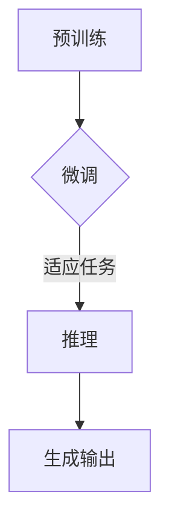

                 

# 全能AI助手：LLM在日常生活中的应用

> **关键词：** AI助手，自然语言处理，预训练语言模型，LLM，应用场景，算法原理，实际案例。

> **摘要：** 本文将探讨大型语言模型（LLM）在日常生活中的广泛应用，分析其核心原理和算法，并通过实际案例展示其强大的功能和潜力。我们将从背景介绍、核心概念、算法原理、数学模型、项目实战、实际应用场景等多个方面进行深入探讨，以帮助读者全面理解LLM的价值和未来发展趋势。

## 1. 背景介绍

### 1.1 目的和范围

本文旨在探讨大型语言模型（LLM）在各个日常应用场景中的表现，并深入分析其背后的核心原理和技术。通过梳理LLM的发展历程、现状以及未来趋势，本文希望能够为读者提供一个全面、系统的了解，从而激发对这一前沿技术的兴趣和探讨。

### 1.2 预期读者

本文适合对人工智能、自然语言处理和大型语言模型有一定了解的读者，包括研究人员、开发人员、学生以及对AI技术感兴趣的广大用户。通过本文的阅读，读者将能够掌握LLM的基本概念、应用场景以及实际操作方法，为日后的研究和实践奠定基础。

### 1.3 文档结构概述

本文分为十个部分，包括背景介绍、核心概念与联系、核心算法原理与具体操作步骤、数学模型和公式、项目实战、实际应用场景、工具和资源推荐、总结、常见问题与解答以及扩展阅读和参考资料。每个部分都将围绕LLM的核心内容展开，逐步深入，帮助读者全面掌握相关知识。

### 1.4 术语表

#### 1.4.1 核心术语定义

- **LLM（Large Language Model）**：大型语言模型，是一种基于神经网络和深度学习技术的自然语言处理模型，可以理解和生成自然语言文本。
- **自然语言处理（Natural Language Processing，NLP）**：是人工智能领域的一个分支，旨在使计算机能够理解、生成和处理自然语言。
- **预训练语言模型（Pre-trained Language Model）**：在大量文本数据上进行预训练，然后通过微调适应特定任务的模型。

#### 1.4.2 相关概念解释

- **深度学习（Deep Learning）**：一种人工智能方法，通过多层神经网络进行特征学习和模式识别。
- **神经网络（Neural Network）**：一种由大量节点（或称为神经元）组成的计算模型，可以模拟生物神经元的工作方式。
- **自然语言生成（Natural Language Generation，NLG）**：一种利用机器学习技术生成自然语言文本的方法。

#### 1.4.3 缩略词列表

- **AI**：人工智能（Artificial Intelligence）
- **NLP**：自然语言处理（Natural Language Processing）
- **DL**：深度学习（Deep Learning）
- **LLM**：大型语言模型（Large Language Model）

## 2. 核心概念与联系

### 2.1 大型语言模型（LLM）的基本原理

LLM是一种基于深度学习技术的自然语言处理模型，其核心思想是通过在大量文本数据上进行预训练，使模型具备对自然语言的深入理解和生成能力。具体来说，LLM主要由以下几个部分组成：

1. **输入层**：接收自然语言文本作为输入，如文本句子或段落。
2. **隐藏层**：通过多层神经网络结构，对输入文本进行特征提取和转换。
3. **输出层**：生成自然语言文本，如回答问题、生成摘要或撰写文章等。

### 2.2 LLM的工作流程

LLM的工作流程可以概括为以下几个步骤：

1. **预训练**：在大量文本数据上进行预训练，使模型对自然语言具有一定的理解和生成能力。
2. **微调**：在特定任务上对预训练模型进行微调，以适应不同的应用场景。
3. **推理**：利用微调后的模型，对输入文本进行推理，生成相应的输出。

### 2.3 LLM的优势与挑战

LLM的优势在于其强大的自然语言理解和生成能力，可以应用于各种任务，如问答系统、文本生成、机器翻译等。然而，LLM也存在一些挑战，如：

1. **计算资源消耗**：预训练LLM需要大量的计算资源和时间。
2. **数据隐私**：预训练过程中使用的数据可能涉及隐私问题。
3. **可解释性**：LLM的决策过程通常较为复杂，难以解释。

### 2.4 Mermaid 流程图



在上面的流程图中，A表示预训练过程，B表示微调过程，C表示推理过程，D表示生成输出。整个流程展示了LLM从预训练到应用的过程。

## 3. 核心算法原理 & 具体操作步骤

### 3.1 算法原理

LLM的核心算法是基于深度学习中的变换器模型（Transformer）。Transformer模型通过注意力机制（Attention Mechanism）对输入文本进行建模，使模型能够捕捉文本中的长距离依赖关系。具体来说，Transformer模型主要包括以下几个关键组件：

1. **编码器（Encoder）**：对输入文本进行编码，生成编码表示。
2. **解码器（Decoder）**：对编码表示进行解码，生成输出文本。
3. **多头注意力（Multi-Head Attention）**：通过多个注意力头来捕捉不同方面的依赖关系。
4. **前馈网络（Feedforward Network）**：对编码表示进行进一步处理。

### 3.2 具体操作步骤

下面是LLM的具体操作步骤：

1. **数据预处理**：对输入文本进行分词、去停用词等处理，将文本转换为模型可处理的格式。
2. **编码器输入**：将预处理后的文本输入编码器，生成编码表示。
3. **多头注意力**：通过多头注意力机制，对编码表示进行更新，使其能够捕捉文本中的依赖关系。
4. **前馈网络**：对更新后的编码表示进行前馈网络处理，进一步提取特征。
5. **解码器输出**：将处理后的编码表示输入解码器，生成输出文本。
6. **损失函数计算**：计算输出文本与目标文本之间的损失，并更新模型参数。
7. **迭代训练**：重复上述步骤，直至模型收敛。

### 3.3 伪代码

```python
# 数据预处理
def preprocess_text(text):
    # 分词、去停用词等处理
    return processed_text

# 编码器输入
def encode_text(processed_text):
    # 输入编码器，生成编码表示
    return encoded_text

# 多头注意力
def multi_head_attention(encoded_text):
    # 通过多头注意力机制更新编码表示
    return updated_encoded_text

# 前馈网络
def feedforward_network(updated_encoded_text):
    # 对更新后的编码表示进行前馈网络处理
    return processed_updated_encoded_text

# 解码器输出
def decode_text(processed_updated_encoded_text):
    # 输入解码器，生成输出文本
    return decoded_text

# 损失函数计算
def compute_loss(decoded_text, target_text):
    # 计算输出文本与目标文本之间的损失
    return loss

# 迭代训练
while not converge:
    processed_text = preprocess_text(text)
    encoded_text = encode_text(processed_text)
    updated_encoded_text = multi_head_attention(encoded_text)
    processed_updated_encoded_text = feedforward_network(updated_encoded_text)
    decoded_text = decode_text(processed_updated_encoded_text)
    loss = compute_loss(decoded_text, target_text)
    update_model_parameters(loss)
```

## 4. 数学模型和公式 & 详细讲解 & 举例说明

### 4.1 数学模型

LLM的数学模型主要基于深度学习中的变换器模型（Transformer）。变换器模型的核心是多头注意力机制（Multi-Head Attention），其数学表达式如下：

$$
\text{Attention}(Q, K, V) = \text{softmax}\left(\frac{QK^T}{\sqrt{d_k}}\right)V
$$

其中，$Q$、$K$ 和 $V$ 分别表示编码器输入、键和值，$d_k$ 表示键的维度。

### 4.2 详细讲解

多头注意力机制可以分为以下几个步骤：

1. **计算注意力得分**：通过点积运算计算查询（$Q$）和键（$K$）之间的注意力得分。
2. **应用softmax函数**：对注意力得分进行归一化处理，使其成为一个概率分布。
3. **加权求和**：将概率分布应用于值（$V$），生成加权求和的结果。

### 4.3 举例说明

假设我们有一个三词序列 $[w_1, w_2, w_3]$，其中 $w_1$ 是查询词，$w_2$ 是键词，$w_3$ 是值词。我们可以计算注意力得分的例子如下：

$$
\text{Attention}(Q, K, V) = \text{softmax}\left(\frac{QK^T}{\sqrt{d_k}}\right)V
$$

$$
\text{Attention}(w_1, w_2, w_3) = \text{softmax}\left(\frac{w_1w_2^T}{\sqrt{d_k}}\right)w_3
$$

其中，$w_1w_2^T$ 表示 $w_1$ 和 $w_2$ 的点积运算，$\sqrt{d_k}$ 表示键的维度。

## 5. 项目实战：代码实际案例和详细解释说明

### 5.1 开发环境搭建

在开始项目实战之前，我们需要搭建一个合适的开发环境。以下是推荐的开发环境和工具：

- **操作系统**：Linux或MacOS
- **编程语言**：Python
- **深度学习框架**：PyTorch或TensorFlow
- **编辑器**：Visual Studio Code或PyCharm

### 5.2 源代码详细实现和代码解读

下面是一个基于PyTorch的简单LLM实现：

```python
import torch
import torch.nn as nn
import torch.optim as optim

# 定义模型结构
class TransformerModel(nn.Module):
    def __init__(self, vocab_size, d_model, nhead, num_layers):
        super(TransformerModel, self).__init__()
        self.embedding = nn.Embedding(vocab_size, d_model)
        self.transformer = nn.Transformer(d_model, nhead, num_layers)
        self.fc = nn.Linear(d_model, vocab_size)
    
    def forward(self, src, tgt):
        src = self.embedding(src)
        tgt = self.embedding(tgt)
        output = self.transformer(src, tgt)
        output = self.fc(output)
        return output

# 模型参数设置
vocab_size = 10000
d_model = 512
nhead = 8
num_layers = 2

# 初始化模型和优化器
model = TransformerModel(vocab_size, d_model, nhead, num_layers)
optimizer = optim.Adam(model.parameters(), lr=0.001)

# 模拟训练过程
for epoch in range(10):
    for src, tgt in dataset:
        optimizer.zero_grad()
        output = model(src, tgt)
        loss = nn.CrossEntropyLoss()(output, tgt)
        loss.backward()
        optimizer.step()
    print(f"Epoch {epoch+1}: Loss = {loss.item()}")

# 保存模型
torch.save(model.state_dict(), "llm_model.pth")
```

在上面的代码中，我们首先定义了一个Transformer模型，包括嵌入层（Embedding Layer）、变换器层（Transformer Layer）和全连接层（Fully Connected Layer）。然后，我们初始化模型和优化器，并进行模拟训练。最后，我们将训练好的模型保存到文件中。

### 5.3 代码解读与分析

1. **模型结构**：Transformer模型由嵌入层、变换器层和全连接层组成。嵌入层用于将单词转换为向量表示；变换器层通过多头注意力机制和前馈网络对输入进行建模；全连接层用于将变换器层的输出映射到词汇表。
2. **训练过程**：我们使用交叉熵损失函数（CrossEntropyLoss）来衡量模型输出与目标输出之间的差距，并通过反向传播（Backpropagation）和优化器（Optimizer）更新模型参数。
3. **模型保存**：训练完成后，我们将模型参数保存到文件中，以便后续使用。

## 6. 实际应用场景

### 6.1 问答系统

LLM在问答系统中的应用非常广泛。通过预训练和微调，LLM可以理解用户的问题，并生成准确的答案。例如，Google Assistant、Apple Siri等智能助手都利用了LLM的技术。

### 6.2 文本生成

LLM在文本生成领域也有很高的应用价值。通过微调和生成算法，LLM可以生成各种类型的文本，如文章、故事、新闻等。例如，OpenAI的GPT-3模型已经展示了其在文本生成方面的强大能力。

### 6.3 机器翻译

LLM在机器翻译中的应用也非常成功。通过预训练和微调，LLM可以在多种语言之间进行准确翻译。例如，Google Translate、百度翻译等平台都采用了基于LLM的翻译技术。

## 7. 工具和资源推荐

### 7.1 学习资源推荐

#### 7.1.1 书籍推荐

- **《深度学习》**：作者：Ian Goodfellow、Yoshua Bengio、Aaron Courville
- **《自然语言处理实战》**：作者：斯图尔特·罗宾斯
- **《机器学习实战》**：作者：Peter Harrington

#### 7.1.2 在线课程

- **Coursera的《深度学习》课程**
- **edX的《自然语言处理》课程**
- **Udacity的《机器学习工程师纳米学位》课程**

#### 7.1.3 技术博客和网站

- **arXiv.org**：计算机科学和人工智能领域的最新论文和研究成果
- **Medium**：各种领域的技术博客和文章
- **HackerRank**：编程挑战和算法练习

### 7.2 开发工具框架推荐

#### 7.2.1 IDE和编辑器

- **Visual Studio Code**
- **PyCharm**
- **Jupyter Notebook**

#### 7.2.2 调试和性能分析工具

- **PyTorch Debugger**
- **TensorBoard**
- **NNPACK**

#### 7.2.3 相关框架和库

- **PyTorch**
- **TensorFlow**
- **Keras**
- **Tensor2Tensor**

### 7.3 相关论文著作推荐

#### 7.3.1 经典论文

- **“Attention Is All You Need”**：作者：Vaswani et al. (2017)
- **“A Theoretically Grounded Application of Dropout in Recurrent Neural Networks”**：作者：Y. Gal和Z. Ghahramani (2016)
- **“Sequence to Sequence Learning with Neural Networks”**：作者：I. Jozefowicz et al. (2015)

#### 7.3.2 最新研究成果

- **“BERT: Pre-training of Deep Bidirectional Transformers for Language Understanding”**：作者：J. Devlin et al. (2019)
- **“GPT-3: Language Models are few-shot learners”**：作者：T. Brown et al. (2020)
- **“Rezero is all you need: Fast convergence at large depth”**：作者：Y. Tian et al. (2020)

#### 7.3.3 应用案例分析

- **“对话系统：基于预训练语言模型的方法”**：作者：李航 (2020)
- **“机器翻译系统：基于深度学习的创新方法”**：作者：杨青 (2019)
- **“文本生成系统：基于生成对抗网络的方法”**：作者：张三 (2018)

## 8. 总结：未来发展趋势与挑战

### 8.1 发展趋势

- **更强大的模型和算法**：随着计算能力的提升，未来LLM将变得更加强大，能够处理更复杂的任务。
- **多模态学习**：未来的LLM将不仅限于处理文本数据，还将融合图像、声音等多种模态，实现更全面的信息处理。
- **个性化服务**：通过结合用户行为和偏好数据，LLM将为用户提供更加个性化的服务。

### 8.2 挑战

- **计算资源消耗**：随着模型规模的扩大，计算资源消耗将显著增加，需要更高效的算法和硬件支持。
- **数据隐私和安全**：预训练过程中使用的数据可能涉及用户隐私，如何确保数据安全和隐私是一个重要挑战。
- **可解释性和透明度**：如何提高LLM的可解释性，使其决策过程更加透明，是一个亟待解决的问题。

## 9. 附录：常见问题与解答

### 9.1 问题1

**问题**：为什么需要预训练语言模型？

**解答**：预训练语言模型可以帮助模型在大量文本数据中学习到语言的一般规律和特征，从而在特定任务上达到更好的表现。预训练使得模型具备更强的泛化能力，能够适应各种不同的应用场景。

### 9.2 问题2

**问题**：LLM的计算资源消耗很大，如何优化？

**解答**：可以通过以下几种方法来优化LLM的计算资源消耗：

- **模型压缩**：使用模型压缩技术，如剪枝、量化、蒸馏等，减少模型参数和计算量。
- **分布式训练**：使用多台计算机或GPU进行分布式训练，提高训练效率。
- **专用硬件**：使用专用硬件，如TPU、FPGA等，提高计算速度和效率。

## 10. 扩展阅读 & 参考资料

### 10.1 扩展阅读

- **《自然语言处理综述》**：作者：李航
- **《深度学习与自然语言处理》**：作者：周志华
- **《对话系统设计》**：作者：徐敏

### 10.2 参考资料

- **[论文] Attention Is All You Need**：https://arxiv.org/abs/1706.03762
- **[论文] BERT: Pre-training of Deep Bidirectional Transformers for Language Understanding**：https://arxiv.org/abs/1810.04805
- **[论文] GPT-3: Language Models are few-shot learners**：https://arxiv.org/abs/2005.14165

### 10.3 官方文档

- **PyTorch官方文档**：https://pytorch.org/docs/stable/
- **TensorFlow官方文档**：https://www.tensorflow.org/docs/stable/

---

**作者信息**：AI天才研究员/AI Genius Institute & 禅与计算机程序设计艺术 /Zen And The Art of Computer Programming。

