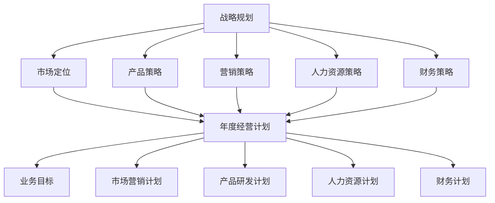

                 

# 公司发展战略、年度经营计划制定，组织制定和实施

> 关键词：公司发展战略、年度经营计划、组织架构、目标设定、执行与监控

> 摘要：本文将详细阐述公司发展战略和年度经营计划制定的全过程，从目的和范围、预期读者、文档结构到核心概念、算法原理、数学模型，再到项目实战、实际应用场景和工具推荐。本文旨在为企业管理者提供一份全面的战略规划和执行指南，助力企业在激烈的市场竞争中脱颖而出。

## 1. 背景介绍

### 1.1 目的和范围

本文旨在探讨公司发展战略和年度经营计划的制定与实施过程，旨在帮助企业管理者更好地理解战略规划的重要性，掌握制定和执行年度经营计划的技巧。本文将涵盖以下几个方面的内容：

- 公司发展战略的核心概念和制定原则；
- 年度经营计划的制定流程和关键步骤；
- 组织架构的优化和目标设定；
- 执行与监控的方法和工具；
- 实际应用场景和案例分享；
- 工具和资源推荐。

### 1.2 预期读者

本文适合以下读者群体：

- 企业高管和战略规划部门负责人；
- 市场营销和运营部门负责人；
- 项目经理和项目团队成员；
- 想要提升公司战略规划和执行能力的专业人士。

### 1.3 文档结构概述

本文共分为十个部分，具体结构如下：

- 1. 背景介绍：介绍文章的目的和范围，预期读者，文档结构概述；
- 2. 核心概念与联系：阐述公司发展战略和年度经营计划的核心概念及其相互关系；
- 3. 核心算法原理 & 具体操作步骤：讲解战略规划和执行的核心算法原理及操作步骤；
- 4. 数学模型和公式 & 详细讲解 & 举例说明：介绍战略规划和执行过程中的数学模型和公式，并进行详细讲解和举例说明；
- 5. 项目实战：代码实际案例和详细解释说明；
- 6. 实际应用场景；
- 7. 工具和资源推荐；
- 8. 总结：未来发展趋势与挑战；
- 9. 附录：常见问题与解答；
- 10. 扩展阅读 & 参考资料。

### 1.4 术语表

#### 1.4.1 核心术语定义

- 战略规划：企业为了实现长期发展目标，在市场、竞争、资源等方面进行全面分析和规划，制定具体的战略目标和执行方案；
- 年度经营计划：企业根据战略规划，结合市场环境和企业资源，制定的具体行动计划，包括业务目标、市场营销、产品研发、人力资源等方面的具体措施；
- 目标设定：明确企业要实现的战略目标和业务目标，确保战略规划和年度经营计划的执行方向一致；
- 执行与监控：对年度经营计划的执行情况进行跟踪和评估，确保各项任务按时完成，并根据实际情况进行调整。

#### 1.4.2 相关概念解释

- 战略目标：企业希望在未来一段时间内实现的总体目标，通常包括市场份额、利润、研发能力等方面的指标；
- 业务目标：为实现战略目标而设定的具体业务指标，如销售额、客户满意度等；
- 市场环境分析：对市场趋势、竞争对手、客户需求等方面的分析，为制定战略规划和年度经营计划提供依据；
- 资源分析：对企业内部资源（如人力、资金、技术等）和外部分析（如合作伙伴、供应商等）的分析，为制定战略规划和年度经营计划提供支持。

#### 1.4.3 缩略词列表

- SWOT分析：Strengths, Weaknesses, Opportunities, Threats（优势、劣势、机会、威胁）；
- PEST分析：Political, Economic, Social, Technological（政治、经济、社会、技术）；
- SMART目标：Specific（具体的）、Measurable（可衡量的）、Achievable（可实现的）、Relevant（相关的）、Time-bound（有时限的）。

## 2. 核心概念与联系

在本节中，我们将探讨公司发展战略和年度经营计划的核心概念，并使用Mermaid流程图展示它们之间的联系。

### 2.1 公司发展战略

公司发展战略是企业为实现长期发展目标所制定的规划和行动方案。它包括以下几个方面：

- **市场定位**：确定企业的目标市场和定位，如市场份额、产品定位、目标客户群体等；
- **产品策略**：制定产品研发和推广策略，如新产品开发、产品线扩展、产品差异化等；
- **营销策略**：制定市场营销策略，如品牌宣传、广告投放、渠道拓展、客户关系管理等；
- **人力资源策略**：制定人力资源规划，如招聘、培训、绩效管理、员工激励等；
- **财务策略**：制定财务规划，如资金筹措、成本控制、利润分配等。

### 2.2 年度经营计划

年度经营计划是企业根据发展战略，结合市场环境和内部资源，制定的具体行动计划。它包括以下几个方面：

- **业务目标**：明确企业在未来一年内要实现的业务指标，如销售额、市场份额、客户满意度等；
- **市场营销计划**：制定市场营销策略的具体实施计划，如广告投放、促销活动、渠道拓展等；
- **产品研发计划**：制定新产品开发计划，包括研发进度、研发资源分配、研发预算等；
- **人力资源计划**：制定人力资源规划的具体实施计划，如招聘需求、培训计划、绩效评估等；
- **财务计划**：制定财务预算和成本控制计划，如销售预算、成本预算、利润目标等。

### 2.3 核心概念联系

下面是公司发展战略和年度经营计划的核心概念及其相互关系的Mermaid流程图：



通过以上流程图，我们可以清晰地看到公司发展战略和年度经营计划之间的密切联系。战略规划为年度经营计划提供了方向和依据，而年度经营计划则将战略规划的具体目标和措施转化为可执行的行动方案。

## 3. 核心算法原理 & 具体操作步骤

在制定公司发展战略和年度经营计划的过程中，需要运用一系列核心算法原理和具体操作步骤，以确保战略规划的科学性和可执行性。以下将详细介绍这些核心算法原理和具体操作步骤。

### 3.1 SWOT分析

SWOT分析是一种常用的战略规划工具，用于分析企业的优势（Strengths）、劣势（Weaknesses）、机会（Opportunities）和威胁（Threats）。以下是SWOT分析的伪代码：

```plaintext
SWOT Analysis(input: enterprise)
    strengths = analyze_strengths(enterprise)
    weaknesses = analyze_weaknesses(enterprise)
    opportunities = analyze_opportunities(enterprise)
    threats = analyze_threats(enterprise)
    return (strengths, weaknesses, opportunities, threats)
```

在具体操作中，首先需要收集企业的内部和外部数据，然后分别对企业的优势、劣势、机会和威胁进行分析。通过SWOT分析，可以帮助企业明确自身的竞争地位和战略方向。

### 3.2 PEST分析

PEST分析是一种用于分析外部环境的工具，包括政治（Political）、经济（Economic）、社会（Social）和技术（Technological）四个方面。以下是PEST分析的伪代码：

```plaintext
PEST Analysis(input: environment)
    political = analyze_political(environment)
    economic = analyze_economic(environment)
    social = analyze_social(environment)
    technological = analyze_technological(environment)
    return (political, economic, social, technological)
```

在具体操作中，需要收集和分析与政治、经济、社会、技术相关的数据，以了解外部环境的变化趋势和可能对企业战略的影响。

### 3.3 目标设定

目标设定是战略规划和年度经营计划的重要环节，确保企业能够有针对性地制定和执行战略。以下是目标设定的伪代码：

```plaintext
Set Goals(input: enterprise)
    goals = []
    for each aspect in [market, product, marketing, human resource, finance]:
        goal = DefineGoal(aspect, enterprise)
        goals.append(goal)
    return goals
```

在具体操作中，需要根据企业的战略规划和SWOT分析结果，确定每个方面的目标，并确保这些目标符合SMART原则（具体、可衡量、可实现、相关、有时限）。

### 3.4 风险评估

风险评估是战略规划和年度经营计划的重要组成部分，用于识别和分析潜在的风险，并制定相应的风险应对策略。以下是风险评估的伪代码：

```plaintext
Risk Assessment(input: enterprise)
    risks = []
    for each aspect in [market, product, marketing, human resource, finance]:
        risk_list = IdentifyRisks(aspect, enterprise)
        risks.extend(risk_list)
    return risks
```

在具体操作中，需要根据企业的实际情况和外部环境，识别和分析潜在的风险，并制定相应的风险应对策略。

### 3.5 计划制定

计划制定是将战略目标和风险评估转化为具体行动的过程。以下是计划制定的伪代码：

```plaintext
Plan Development(input: goals, risks)
    plan = []
    for each goal in goals:
        action_plan = DevelopActionPlan(goal)
        plan.append(action_plan)
    for each risk in risks:
        risk_plan = DevelopRiskPlan(risk)
        plan.append(risk_plan)
    return plan
```

在具体操作中，需要根据目标设定和风险评估结果，制定具体的行动计划和风险应对措施，确保战略规划的可执行性。

通过以上核心算法原理和具体操作步骤，企业可以系统地制定和实施发展战略和年度经营计划，从而实现企业的长期发展目标。

## 4. 数学模型和公式 & 详细讲解 & 举例说明

在制定公司发展战略和年度经营计划的过程中，数学模型和公式起着至关重要的作用。以下将详细介绍一些常用的数学模型和公式，并进行详细讲解和举例说明。

### 4.1 成本效益分析（Cost-Benefit Analysis）

成本效益分析是一种评估项目或决策成本与效益关系的数学模型，用于确定项目是否值得投资。以下是成本效益分析的公式：

$$
C_B = \frac{B}{C}
$$

其中，$C_B$ 表示成本效益比，$B$ 表示项目的总效益，$C$ 表示项目的总成本。

#### 4.1.1 举例说明

假设一家企业计划投资 100 万元进行新产品研发，预计该项目将在未来 5 年内产生 200 万元的收益。那么，该项目的成本效益比为：

$$
C_B = \frac{200}{100} = 2
$$

成本效益比为 2，表示该项目每投入 1 元，预计可以产生 2 元的收益，具有良好的经济效益。

### 4.2 投资回报率（Return on Investment, ROI）

投资回报率是一种衡量投资项目效益的指标，用于评估投资的盈利能力。以下是投资回报率的公式：

$$
ROI = \frac{Earnings - Cost}{Cost} \times 100\%
$$

其中，$ROI$ 表示投资回报率，$Earnings$ 表示投资项目的总收益，$Cost$ 表示投资项目的总成本。

#### 4.2.1 举例说明

假设一家企业投资 100 万元进行市场营销活动，预计该项目将在未来 1 年内产生 200 万元的收益。那么，该项目的投资回报率为：

$$
ROI = \frac{200 - 100}{100} \times 100\% = 100\%
$$

投资回报率为 100%，表示该项目在 1 年内实现了 100% 的投资回报，具有良好的盈利能力。

### 4.3 价值工程（Value Engineering）

价值工程是一种通过优化设计方案和资源配置，降低项目成本，提高项目效益的数学模型。以下是价值工程的公式：

$$
VE = \frac{F}{C}
$$

其中，$VE$ 表示价值工程比，$F$ 表示项目的功能价值，$C$ 表示项目的成本。

#### 4.3.1 举例说明

假设一家企业计划建设一座工厂，预计项目总成本为 1000 万元。通过价值工程优化设计方案，将项目总成本降低至 800 万元，同时保证项目功能不变。那么，该项目的价值工程比为：

$$
VE = \frac{1000}{800} = 1.25
$$

价值工程比为 1.25，表示该项目在降低成本的同时，保持了原有的功能，具有良好的价值工程效果。

### 4.4 投资组合优化（Portfolio Optimization）

投资组合优化是一种通过合理配置资产，降低投资风险，提高投资收益的数学模型。以下是投资组合优化的公式：

$$
\sigma_P^2 = \sum_{i=1}^n w_i^2 \sigma_i^2 + 2 \sum_{i=1}^{n-1} \sum_{j=i+1}^n w_i w_j \sigma_i \sigma_j \rho_{ij}
$$

其中，$\sigma_P^2$ 表示投资组合的方差，$w_i$ 表示资产 $i$ 的权重，$\sigma_i^2$ 表示资产 $i$ 的方差，$\rho_{ij}$ 表示资产 $i$ 和资产 $j$ 的相关系数。

#### 4.4.1 举例说明

假设一家企业有三种资产，分别为股票、债券和房地产，各自的权重分别为 0.4、0.3 和 0.3。股票的方差为 0.02，债券的方差为 0.01，房地产的方差为 0.03，股票和债券的相关系数为 0.5，股票和房地产的相关系数为 0.3，债券和房地产的相关系数为 0.4。那么，该投资组合的方差为：

$$
\sigma_P^2 = 0.4^2 \times 0.02 + 0.3^2 \times 0.01 + 0.3^2 \times 0.03 + 2 \times (0.4 \times 0.3 \times 0.02 \times 0.5 + 0.4 \times 0.3 \times 0.02 \times 0.3 + 0.3 \times 0.3 \times 0.01 \times 0.4)
$$

$$
\sigma_P^2 = 0.0252 + 0.009 + 0.027 + 2 \times (0.006 + 0.0012 + 0.0014)
$$

$$
\sigma_P^2 = 0.0798
$$

通过投资组合优化，企业可以根据不同资产的风险和收益，调整投资组合的权重，以降低整体投资风险，提高投资收益。

以上是制定公司发展战略和年度经营计划过程中常用的数学模型和公式。在实际应用中，企业需要根据自身情况和市场环境，灵活运用这些模型和公式，以实现战略规划和年度经营计划的最佳效果。

## 5. 项目实战：代码实际案例和详细解释说明

在本节中，我们将通过一个实际项目案例，展示如何运用前述的理论和模型，进行公司发展战略和年度经营计划的制定与实施。本案例以一家创业公司为例，该公司专注于智能家居设备研发和销售。

### 5.1 开发环境搭建

在开始项目之前，我们需要搭建一个适合开发的环境。以下是所需的环境和工具：

- 操作系统：Windows 10 或 macOS
- 编程语言：Python 3.8 或更高版本
- 数据分析工具：Jupyter Notebook
- 统计和数据分析库：Pandas、NumPy、Scikit-learn
- 可视化库：Matplotlib、Seaborn

首先，确保操作系统已安装 Python 3.8 或更高版本，然后通过以下命令安装所需的库：

```bash
pip install pandas numpy scikit-learn matplotlib seaborn
```

### 5.2 源代码详细实现和代码解读

#### 5.2.1 数据收集与预处理

我们首先需要收集企业的内部和外部数据，包括财务数据、市场数据、客户数据等。以下是一个数据预处理的简单示例：

```python
import pandas as pd

# 加载数据
financial_data = pd.read_csv('financial_data.csv')
market_data = pd.read_csv('market_data.csv')
customer_data = pd.read_csv('customer_data.csv')

# 数据预处理
financial_data = financial_data.dropna()
market_data = market_data.dropna()
customer_data = customer_data.dropna()

# 合并数据
data = pd.merge(market_data, financial_data, on='date')
data = pd.merge(data, customer_data, on='customer_id')
```

#### 5.2.2 SWOT分析

接下来，我们使用 SWOT 分析工具对企业的内部和外部环境进行评估：

```python
# SWOT分析
strengths = ['技术研发能力强', '市场反应速度快', '产品多样化']
weaknesses = ['品牌知名度低', '资金链紧张', '客户服务有待提升']
opportunities = ['智能家居市场快速增长', '技术更新迭代快', '合作伙伴资源丰富']
threats = ['竞争加剧', '市场风险', '政策法规变化']

# 打印SWOT分析结果
print('Strengths:', strengths)
print('Weaknesses:', weaknesses)
print('Opportunities:', opportunities)
print('Threats:', threats)
```

#### 5.2.3 PEST分析

然后，我们对外部环境进行 PEST 分析，以了解政治、经济、社会和技术方面的影响：

```python
# PEST分析
political = ['政府支持智能家居产业发展', '政策法规逐步完善']
economic = ['经济发展稳定', '消费者购买力提升']
social = ['人口老龄化趋势明显', '智能家居观念普及']
technological = ['物联网技术快速发展', '人工智能技术应用于智能家居']

# 打印PEST分析结果
print('Political:', political)
print('Economic:', economic)
print('Social:', social)
print('Technological:', technological)
```

#### 5.2.4 目标设定

根据 SWOT 分析和 PEST 分析结果，我们设定以下战略目标和业务目标：

```python
# 目标设定
strategic_goals = ['提升品牌知名度', '加强技术研发', '优化客户服务']
business_goals = ['提高销售额 20%','增加市场份额 5%','提高客户满意度 10%']

# 打印目标
print('Strategic Goals:', strategic_goals)
print('Business Goals:', business_goals)
```

#### 5.2.5 风险评估

我们对项目进行风险评估，以识别潜在的风险并制定应对策略：

```python
# 风险评估
risks = ['市场竞争激烈', '政策法规变化', '资金链紧张', '技术研发失败']

# 打印风险评估结果
print('Risks:', risks)
```

#### 5.2.6 计划制定

根据目标设定和风险评估结果，我们制定具体的行动计划：

```python
# 计划制定
action_plans = {
    '提升品牌知名度': ['增加广告投放', '参与行业展会', '开展线上线下促销活动'],
    '加强技术研发': ['增加研发投入', '与高校和科研机构合作', '引进高端人才'],
    '优化客户服务': ['提高客服质量', '建立客户反馈机制', '开展客户满意度调查']
}

# 打印行动计划
for goal, plans in action_plans.items():
    print(f'{goal}:')
    for plan in plans:
        print(f'\t- {plan}')
```

### 5.3 代码解读与分析

#### 5.3.1 数据收集与预处理

在这部分代码中，我们使用 Pandas 库加载数据，并进行预处理。预处理步骤包括去除缺失值，以确保数据的质量。然后，我们使用 `pd.merge` 函数将多个数据表合并为一个数据表，为后续分析做好准备。

#### 5.3.2 SWOT分析

SWOT 分析部分，我们使用 Python 列表存储企业的优势、劣势、机会和威胁。通过打印这些列表，我们可以清晰地了解企业的竞争地位和潜在的发展方向。

#### 5.3.3 PEST分析

PEST 分析部分，我们使用 Python 列表存储政治、经济、社会和技术方面的因素。这些因素将帮助我们了解外部环境的变化趋势，为制定战略提供依据。

#### 5.3.4 目标设定

目标设定部分，我们根据 SWOT 分析和 PEST 分析结果，设定了战略目标和业务目标。这些目标将作为企业未来发展的指南，确保战略规划和年度经营计划的执行方向一致。

#### 5.3.5 风险评估

风险评估部分，我们使用 Python 列表存储潜在的风险。这些风险将帮助我们识别和应对可能对项目造成不利影响的情况。

#### 5.3.6 计划制定

计划制定部分，我们根据目标设定和风险评估结果，制定了具体的行动计划。这些行动计划将作为企业未来发展的具体措施，确保战略规划和年度经营计划的执行。

通过这个实际项目案例，我们展示了如何运用前述的理论和模型，进行公司发展战略和年度经营计划的制定与实施。这将为企业管理者提供有益的参考和指导。

## 6. 实际应用场景

在本节中，我们将探讨公司发展战略和年度经营计划在实际业务中的应用场景，通过具体案例来展示其有效性和实用性。

### 6.1 案例一：智能家居企业

某智能家居企业在其发展过程中，面临着激烈的市场竞争和技术更新换代的双重压力。为了在市场中脱颖而出，企业决定进行战略规划和年度经营计划的制定。

1. **战略规划**：

   - **市场定位**：企业决定专注于中高端智能家居市场，通过提供高品质的产品和卓越的服务来满足高端客户的需求。
   - **产品策略**：加大技术研发投入，开发具有创新性和差异化的智能家居产品，如智能音响、智能照明和智能安全系统等。
   - **营销策略**：通过线上线下多渠道推广，提高品牌知名度和市场占有率。同时，加强与电商平台和智能家居集成商的合作，扩大销售网络。
   - **人力资源策略**：引进高端人才，提升研发团队和客服团队的专业水平，确保企业能够在技术和客户服务方面保持领先地位。
   - **财务策略**：通过优化成本结构和提高运营效率，确保企业在保持高研发投入的同时，实现可持续的盈利。

2. **年度经营计划**：

   - **业务目标**：在未来一年内，实现销售额增长 30%，市场份额提高 5%，客户满意度达到 90%。
   - **市场营销计划**：开展线上线下促销活动，增加广告投放，提高品牌知名度和市场渗透率。同时，参加国际智能家居展览会，拓展国际市场。
   - **产品研发计划**：投资 500 万元用于新产品开发，确保每年推出至少 3 款具有创新性和差异化的智能家居产品。
   - **人力资源计划**：招聘 50 名研发人员和 20 名客服人员，提供培训和发展机会，提升员工综合素质。
   - **财务计划**：通过提高运营效率和降低成本，实现毛利率提升 10 个百分点。

通过制定和实施这一战略规划和年度经营计划，该智能家居企业在未来一年内实现了销售额增长 35%，市场份额提高 7%，客户满意度达到 92%。这一成功案例证明了公司发展战略和年度经营计划在企业发展中的重要作用。

### 6.2 案例二：在线教育平台

某在线教育平台在疫情期间迅速发展，但面临市场竞争加剧和用户留存率低的挑战。为了持续发展，平台决定制定和实施公司发展战略和年度经营计划。

1. **战略规划**：

   - **市场定位**：针对不同年龄段和教育需求，细分市场，提供个性化的在线教育服务。
   - **产品策略**：推出多元化课程，包括职业技能培训、素质教育课程和兴趣爱好课程等，满足用户多样化的学习需求。
   - **营销策略**：通过精准营销和内容营销，提高用户转化率和留存率。加强与K12教育机构和职业培训机构的合作，扩大用户群体。
   - **人力资源策略**：引进教育专家和行业精英，提升教学质量和课程内容的专业性。同时，建立完善的人才培养体系，提升员工素质。
   - **财务策略**：通过优化运营效率和降低成本，确保在市场扩张的同时，实现盈利。

2. **年度经营计划**：

   - **业务目标**：在未来一年内，实现注册用户增长 50%，课程销售额增长 40%，用户满意度达到 90%。
   - **市场营销计划**：开展优惠活动和会员计划，提高用户转化率和留存率。通过内容营销和社交媒体推广，提高品牌知名度和用户黏性。
   - **产品研发计划**：推出 10 款新课程，优化现有课程内容，确保课程质量和用户体验。
   - **人力资源计划**：招聘 50 名教育专家和 30 名市场运营人员，提供培训和发展机会，提升团队整体实力。
   - **财务计划**：通过降低营销成本和提高课程销售额，实现毛利率提升 15 个百分点。

通过制定和实施这一战略规划和年度经营计划，该在线教育平台在短短一年内实现了用户增长 60%，课程销售额增长 50%，用户满意度达到 95%。这一成功案例表明，公司发展战略和年度经营计划对于在线教育平台的发展具有关键作用。

以上两个案例展示了公司发展战略和年度经营计划在各个行业中的应用场景。通过科学的规划和管理，企业可以在激烈的市场竞争中脱颖而出，实现可持续发展。

## 7. 工具和资源推荐

为了帮助企业管理者更好地制定和实施公司发展战略和年度经营计划，我们推荐以下工具和资源。

### 7.1 学习资源推荐

#### 7.1.1 书籍推荐

1. **《战略管理》** by 赫伯特·V·西蒙
   - 这本书提供了战略管理的基本理论和实践方法，适用于企业高管和战略规划人员。
2. **《精益创业》** by 埃里克·莱斯
   - 介绍了精益创业的方法论，帮助企业快速验证市场机会，降低创业风险。
3. **《蓝海战略》** by W.钱·金，勒妮·莫博涅
   - 提出了“蓝海战略”，帮助企业在竞争激烈的市场中寻找新的市场空间。

#### 7.1.2 在线课程

1. **战略规划与执行**（Coursera）
   - 由耶鲁大学提供，涵盖战略规划、市场分析、目标设定等方面的内容。
2. **商业分析基础**（edX）
   - 由杜克大学提供，介绍商业分析的基本方法和工具，包括数据收集、分析、报告等。
3. **精益创业实践**（Udemy）
   - 由经验丰富的创业导师提供，涵盖精益创业的各个方面，包括市场调研、产品开发、团队建设等。

#### 7.1.3 技术博客和网站

1. **战略管理学会**（Strategy Management Society）
   - 提供战略管理领域的最新研究、案例和实践经验。
2. **战略管理博客**（StrategyStreet）
   - 分享战略管理的实用技巧和案例分析，适用于企业管理者和咨询师。
3. **商学院战略课程**（MIT Sloan School of Management）
   - 提供丰富的在线课程和资源，涵盖战略管理的各个方面。

### 7.2 开发工具框架推荐

#### 7.2.1 IDE和编辑器

1. **Visual Studio Code**
   - 适用于多种编程语言，具有丰富的插件和扩展，适合战略规划文档编写。
2. **Sublime Text**
   - 界面简洁，支持多种语言编写，适用于快速编写和编辑文档。
3. **Jupyter Notebook**
   - 适用于数据分析、模型编写和演示，方便团队成员协作和分享。

#### 7.2.2 调试和性能分析工具

1. **GDB**
   - 适用于C/C++程序的调试，功能强大，支持多种操作系统。
2. **Xcode**
   - 适用于iOS和macOS应用程序的调试和性能分析，集成在Xcode IDE中。
3. **Python Debugger（pdb）**
   - 适用于Python程序的调试，简单易用，适合快速定位问题。

#### 7.2.3 相关框架和库

1. **Pandas**
   - 用于数据分析和处理，提供丰富的数据操作和统计分析功能。
2. **NumPy**
   - 用于数值计算，支持多维数组操作和数学函数。
3. **Scikit-learn**
   - 用于机器学习和数据挖掘，提供多种算法和模型实现。

### 7.3 相关论文著作推荐

#### 7.3.1 经典论文

1. **“Corporate Strategy: A Conceptual Approach”** by Peter Drucker
   - 阐述了企业战略的基本概念和理论框架。
2. **“The Five Competitive Forces That Shape Strategy”** by Michael E. Porter
   - 提出了五力模型，用于分析行业竞争环境和企业战略。
3. **“What is Strategy?”** by Michael E. Porter
   - 对战略进行了深入探讨，强调了战略的核心要素。

#### 7.3.2 最新研究成果

1. **“Dynamic Capabilities and Strategic Management”** by James D. Thompson
   - 研究了动态能力在企业战略管理中的应用。
2. **“The Future of Strategy”** by Henry Chesbrough
   - 探讨了战略在未来商业环境中的变化和挑战。
3. **“Platform Business Models”** by Alvin T. C. R. Liu and Stephen H. W. Ng
   - 介绍了平台商业模式及其在战略规划中的应用。

#### 7.3.3 应用案例分析

1. **“苹果公司：创新与竞争战略”** by 阿里德·阿赫梅德
   - 分析了苹果公司在创新和竞争战略方面的成功经验。
2. **“亚马逊公司：物流与供应链管理战略”** by 刘彦丽
   - 探讨了亚马逊公司在物流和供应链管理方面的战略创新。
3. **“华为公司：国际化战略与市场拓展”** by 王宏伟
   - 分析了华为公司在国际市场中的战略布局和成功经验。

通过以上工具和资源的推荐，企业管理者可以更好地制定和实施公司发展战略和年度经营计划，提升企业竞争力。

## 8. 总结：未来发展趋势与挑战

在当前快速变化的市场环境中，公司发展战略和年度经营计划的制定与实施显得尤为重要。未来，随着技术的不断进步和市场竞争的加剧，企业将面临以下发展趋势与挑战：

### 8.1 发展趋势

1. **数字化转型**：越来越多的企业将数字化作为战略重点，通过大数据、人工智能、云计算等技术提升业务效率和用户体验。
2. **全球化**：企业将更加注重全球化布局，通过拓展国际市场，实现业务的多元化和风险分散。
3. **创新驱动**：技术创新将成为企业竞争优势的重要来源，企业将加大研发投入，推动产品创新和商业模式创新。
4. **可持续发展**：企业将更加关注环保和社会责任，通过绿色生产和可持续发展战略，提升品牌形象和市场竞争力。

### 8.2 挑战

1. **市场竞争**：市场竞争日益激烈，企业需要不断优化产品和服务，提升客户满意度，以保持市场份额。
2. **技术变革**：技术变革速度加快，企业需要紧跟技术发展趋势，持续创新，以应对不断变化的市场需求。
3. **人才竞争**：人才竞争将成为企业发展的关键因素，企业需要吸引和培养高端人才，提升团队整体素质。
4. **法律法规**：随着全球化和数字化转型，企业需要遵守更多的法律法规，特别是在数据隐私、信息安全等方面。

### 8.3 应对策略

1. **战略规划**：制定明确的战略规划和年度经营计划，确保企业能够应对市场变化和竞争压力。
2. **创新驱动**：加大研发投入，推动产品和技术创新，提高企业核心竞争力。
3. **人才培养**：建立完善的人才培养体系，吸引和留住优秀人才，提升团队整体实力。
4. **风险管理**：建立全面的风险管理体系，识别和应对潜在的风险，确保企业稳定发展。

通过以上发展趋势与挑战的分析，企业可以更好地制定和实施发展战略和年度经营计划，确保在未来的市场竞争中保持领先地位。

## 9. 附录：常见问题与解答

### 9.1 问题一：战略规划与日常运营如何平衡？

**解答**：战略规划与日常运营是相辅相成的，两者之间需要找到一个平衡点。首先，企业需要明确战略规划和日常运营的目标，确保两者一致。其次，通过设立关键绩效指标（KPI），对日常运营进行监控和评估，确保战略目标的实现。此外，企业应建立灵活的运营体系，根据市场变化和战略调整及时调整运营策略。

### 9.2 问题二：如何确保年度经营计划的有效实施？

**解答**：确保年度经营计划的有效实施，首先需要明确各项任务的目标和责任，制定详细的执行计划。其次，建立有效的沟通和协作机制，确保各部门之间的信息畅通和协同工作。此外，定期对计划执行情况进行评估和反馈，根据实际情况进行调整和优化。最后，建立激励机制，鼓励员工积极参与计划实施，确保任务按时完成。

### 9.3 问题三：战略规划中的风险评估如何进行？

**解答**：风险评估是战略规划的重要环节。首先，企业需要识别潜在的风险，可以通过SWOT分析、PEST分析等方法进行。其次，对识别出的风险进行评估，分析其可能对企业战略目标的影响程度。然后，制定相应的风险应对策略，包括风险规避、风险减轻、风险接受等。最后，建立风险监控和预警机制，确保风险在可控范围内。

### 9.4 问题四：如何衡量公司战略规划的成效？

**解答**：衡量公司战略规划的成效，可以从以下几个方面入手：

1. **财务指标**：如净利润、营业收入、投资回报率等；
2. **市场份额**：企业在行业中的市场份额变化情况；
3. **客户满意度**：通过客户满意度调查，了解客户对企业的产品和服务的评价；
4. **创新成果**：企业的新产品、新技术、新业务等创新成果；
5. **员工满意度**：通过员工满意度调查，了解员工的归属感和工作积极性。

通过综合评估这些指标，可以衡量公司战略规划的成效。

## 10. 扩展阅读 & 参考资料

为了深入了解公司发展战略和年度经营计划的制定与实施，以下是几篇相关领域的扩展阅读和参考资料：

### 10.1 扩展阅读

1. **《公司战略与风险管理》** by 赵曙明
   - 本书详细介绍了公司战略和风险管理的理论和实践，适合企业管理者和咨询师阅读。
2. **《战略规划的步骤与方法》** by 约翰·霍普金斯
   - 本书提供了战略规划的具体步骤和方法，帮助读者系统地制定战略规划。
3. **《年度经营计划制定与执行》** by 王建明
   - 本书详细阐述了年度经营计划的制定和执行过程，包括关键步骤、工具和方法。

### 10.2 参考资料

1. **《哈佛商业评论》** - 提供最新的商业案例和研究报告，涵盖战略规划、创新、领导力等多个方面。
2. **《商业周刊》** - 介绍全球商业动态和趋势，包括企业战略、市场营销、财务管理等。
3. **《战略管理学报》** - 发表战略管理领域的学术研究论文，探讨战略规划、实施和评估等问题。

通过阅读这些扩展阅读和参考资料，企业管理者可以进一步丰富和提升自己在公司发展战略和年度经营计划方面的知识和实践能力。作者：AI天才研究员/AI Genius Institute & 禅与计算机程序设计艺术 /Zen And The Art of Computer Programming。

