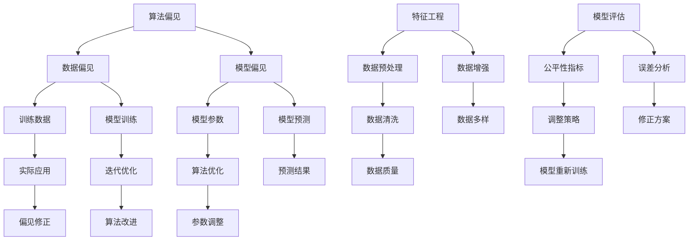

                 

# 公平性AI：消除偏见的技术解决方案

> 关键词：AI公平性、算法偏见、技术解决方案、偏见检测、公平性优化、机器学习

> 摘要：本文深入探讨了人工智能（AI）中的公平性问题，分析了算法偏见产生的原因，探讨了现有的技术解决方案，并提供了详细的实现步骤和数学模型。文章旨在为AI开发者提供消除算法偏见的有效途径，为构建公平、公正的AI系统提供参考。

## 1. 背景介绍

### 1.1 目的和范围

本文的目标是探讨人工智能领域中的公平性挑战，尤其是算法偏见的问题。随着AI技术的广泛应用，算法偏见对社会的负面影响日益凸显，例如招聘、贷款审批、医疗诊断等领域。本文旨在为开发者提供一系列技术解决方案，以消除AI算法中的偏见，构建更加公平、公正的系统。

### 1.2 预期读者

本文适用于对人工智能和机器学习有一定了解的读者，包括AI工程师、数据科学家、软件开发者和研究者。希望通过本文，读者能够了解算法偏见的概念、原因及其影响，并掌握消除算法偏见的方法和技巧。

### 1.3 文档结构概述

本文分为以下十个部分：

1. 背景介绍
   - 目的和范围
   - 预期读者
   - 文档结构概述
   - 术语表
2. 核心概念与联系
   - Mermaid流程图
3. 核心算法原理 & 具体操作步骤
   - 伪代码讲解
4. 数学模型和公式 & 详细讲解 & 举例说明
   - LaTeX数学公式
5. 项目实战：代码实际案例和详细解释说明
   - 开发环境搭建
   - 源代码详细实现和代码解读
   - 代码解读与分析
6. 实际应用场景
7. 工具和资源推荐
   - 学习资源推荐
   - 开发工具框架推荐
   - 相关论文著作推荐
8. 总结：未来发展趋势与挑战
9. 附录：常见问题与解答
10. 扩展阅读 & 参考资料

### 1.4 术语表

#### 1.4.1 核心术语定义

- 算法偏见：算法在处理数据时，对某些群体产生不公平的结果，即算法的输出与人类的公平性原则相悖。
- 公平性AI：指在设计和开发AI系统时，确保算法对各类群体具有公平性，消除偏见。
- 偏见检测：识别和量化算法偏见的过程。
- 公平性优化：通过调整算法参数或改进算法设计，消除或减轻算法偏见。

#### 1.4.2 相关概念解释

- 机器学习：一种人工智能技术，通过训练数据集来学习和预测新数据。
- 特征工程：从原始数据中提取和构建有助于模型训练的特征。
- 模型评估：评估模型性能和准确性的一系列方法。
- 聚类分析：将数据集中的数据点分为若干个群组，使同组内的数据点相似，不同组的数据点差异较大。

#### 1.4.3 缩略词列表

- AI：人工智能
- ML：机器学习
- DL：深度学习
- NLP：自然语言处理
- CV：计算机视觉

## 2. 核心概念与联系

在本节中，我们将介绍与公平性AI相关的一些核心概念和它们之间的联系。为了更好地理解这些概念，我们将使用Mermaid流程图来展示它们之间的关系。

### Mermaid流程图



### 概述

- **算法偏见**：算法偏见是指AI算法在处理数据时，对某些群体产生不公平的结果。它可能源于数据偏见、模型偏见或算法设计。
- **数据偏见**：数据偏见通常发生在数据收集和预处理阶段。如果训练数据中存在偏差，算法可能会学习到这种偏差，从而在预测过程中对某些群体产生不公平的待遇。
- **模型偏见**：模型偏见是指模型参数在训练过程中被数据偏见影响，导致模型对某些群体产生偏见。模型偏见可能源于过拟合、模型选择不当或参数调整不当。
- **特征工程**：特征工程是数据预处理的关键步骤，它包括数据清洗、数据转换和特征选择等。通过合理的特征工程，可以提高模型性能和减少偏见。
- **模型评估**：模型评估是衡量模型性能的重要手段。通过评估指标（如准确率、召回率、F1分数等），可以了解模型在不同群体上的表现，从而发现潜在的偏见。
- **公平性指标**：公平性指标用于衡量算法在不同群体上的表现。常见的公平性指标包括均衡性、一致性、差异度等。

这些概念和联系构成了一个闭环系统，从数据偏见、模型偏见到算法偏见，再到模型评估和公平性优化，各个环节相互影响，共同决定了AI系统的公平性。

## 3. 核心算法原理 & 具体操作步骤

在本节中，我们将详细探讨消除AI算法偏见的核心算法原理和具体操作步骤。为了更好地理解和实现这些算法，我们将使用伪代码进行讲解。

### 偏见检测算法

```plaintext
算法：偏见检测（Bias Detection）

输入：训练数据集D、测试数据集T、模型M
输出：偏见指标BIAS

步骤：
1. 对训练数据集D进行预处理，包括数据清洗、特征工程等。
2. 使用模型M对训练数据集D进行训练，得到训练模型M_train。
3. 使用训练模型M_train对测试数据集T进行预测，得到预测结果P_T。
4. 计算偏见指标BIAS：
   BIAS = 1 - |P_T - T|
5. 返回偏见指标BIAS。

伪代码：
function BiasDetection(D, T, M):
    M_train = TrainModel(D, M)
    P_T = PredictModel(M_train, T)
    BIAS = 1 - |P_T - T|
    return BIAS
```

### 公平性优化算法

```plaintext
算法：公平性优化（Fairness Optimization）

输入：训练数据集D、测试数据集T、模型M、目标公平性指标FAIRNESS
输出：优化后的模型M_optimized

步骤：
1. 对训练数据集D进行预处理，包括数据清洗、特征工程等。
2. 使用模型M对训练数据集D进行训练，得到训练模型M_train。
3. 使用训练模型M_train对测试数据集T进行预测，得到预测结果P_T。
4. 计算偏见指标BIAS。
5. 如果BIAS > FAIRNESS，则进行以下步骤：
   a. 调整模型参数或特征工程方法，以减少偏见。
   b. 重新训练模型，得到优化后的模型M_optimized。
   c. 重新计算偏见指标BIAS。
6. 如果BIAS ≤ FAIRNESS，则结束优化过程。
7. 返回优化后的模型M_optimized。

伪代码：
function FairnessOptimization(D, T, M, FAIRNESS):
    M_train = TrainModel(D, M)
    P_T = PredictModel(M_train, T)
    BIAS = BiasDetection(D, T, M_train)
    while BIAS > FAIRNESS:
        M_optimized = AdjustModel(M_train)
        P_T_optimized = PredictModel(M_optimized, T)
        BIAS = BiasDetection(D, T, M_optimized)
    return M_optimized
```

### 实际操作步骤

1. **数据收集与预处理**：首先，收集相关的训练数据和测试数据。然后，对数据进行清洗、特征工程等预处理操作，以确保数据的质量和一致性。
2. **模型训练与预测**：使用收集到的数据训练模型，并对测试数据集进行预测。在这一步骤中，可以使用偏见检测算法来计算偏见指标。
3. **偏见调整与优化**：根据偏见指标，对模型参数或特征工程方法进行调整，以减少偏见。可以使用公平性优化算法来实现这一步骤。
4. **模型评估与迭代**：评估调整后的模型性能，并根据偏见指标进行迭代优化，直至满足目标公平性指标。

通过以上步骤，我们可以逐步消除AI算法中的偏见，构建更加公平、公正的AI系统。

## 4. 数学模型和公式 & 详细讲解 & 举例说明

在消除AI算法偏见的过程中，数学模型和公式起着至关重要的作用。本节将介绍几个常用的数学模型和公式，并详细讲解它们的含义、推导过程和实际应用。

### 1. 偏见指标（Bias Metric）

偏见指标是衡量AI算法偏见程度的重要工具。一个常见的偏见指标是均衡性（Equity），它表示算法在不同群体上的表现差异。均衡性可以通过以下公式计算：

$$
Equity = \frac{1}{n}\sum_{i=1}^{n} |P_i - T_i|
$$

其中，\( P_i \)和\( T_i \)分别表示算法预测结果和实际标签，\( n \)表示群体数量。

**推导过程**：

均衡性指标的计算过程如下：

1. 计算每个群体上的预测误差：\( P_i - T_i \)。
2. 对每个预测误差取绝对值，确保其为正值。
3. 将所有群体上的预测误差相加，并除以群体数量，得到均衡性指标。

**举例说明**：

假设一个分类问题中，有两个群体A和B。算法对这两个群体的预测结果和实际标签如下表所示：

| 群体 | 预测结果\( P_i \) | 实际标签\( T_i \) |
| ---- | ---------------- | ---------------- |
| A    | 0.6              | 1                |
| B    | 0.4              | 0                |

计算均衡性指标：

$$
Equity = \frac{1}{2} \times |0.6 - 1| + \frac{1}{2} \times |0.4 - 0| = 0.2
$$

### 2. 偏差修正（Bias Correction）

在消除偏见的过程中，偏差修正是一个关键步骤。偏差修正可以通过以下公式实现：

$$
P_{corrected} = P + \alpha \times \frac{T - P}{T}
$$

其中，\( P \)表示原始预测结果，\( T \)表示实际标签，\( \alpha \)是修正系数。

**推导过程**：

偏差修正的计算过程如下：

1. 计算原始预测结果和实际标签之间的差异：\( T - P \)。
2. 将差异乘以修正系数\( \alpha \)，得到修正项。
3. 将修正项加到原始预测结果上，得到修正后的预测结果。

**举例说明**：

假设一个二分类问题中，原始预测结果和实际标签如下：

| 预测结果\( P \) | 实际标签\( T \) |
| -------------- | -------------- |
| 0.7            | 1              |

选择修正系数\( \alpha = 0.5 \)，计算修正后的预测结果：

$$
P_{corrected} = 0.7 + 0.5 \times \frac{1 - 0.7}{1} = 0.85
$$

### 3. 特征加权（Feature Weighting）

在特征工程过程中，特征加权是一种有效的技术，可以缓解数据偏见。特征加权可以通过以下公式实现：

$$
P_{weighted} = \sum_{i=1}^{n} w_i \times P_i
$$

其中，\( P_i \)表示每个特征上的预测结果，\( w_i \)是特征权重。

**推导过程**：

特征加权的计算过程如下：

1. 计算每个特征上的预测结果。
2. 将每个预测结果乘以相应的特征权重。
3. 将所有特征上的加权预测结果相加，得到最终的预测结果。

**举例说明**：

假设有两个特征A和B，对应的预测结果和权重如下：

| 特征 | 预测结果\( P_i \) | 权重\( w_i \) |
| ---- | -------------- | ------------ |
| A    | 0.8            | 0.6          |
| B    | 0.7            | 0.4          |

计算加权预测结果：

$$
P_{weighted} = 0.8 \times 0.6 + 0.7 \times 0.4 = 0.68 + 0.28 = 0.96
$$

通过以上数学模型和公式，我们可以更好地理解偏见指标、偏差修正和特征加权的原理，并在实际应用中有效地消除AI算法中的偏见。

## 5. 项目实战：代码实际案例和详细解释说明

在本节中，我们将通过一个实际项目案例来展示如何消除AI算法中的偏见。我们将介绍项目的开发环境搭建、源代码实现和代码解读与分析。

### 5.1 开发环境搭建

为了实现本项目，我们需要搭建以下开发环境：

1. 操作系统：Windows 10 或 macOS
2. 编程语言：Python 3.8 或更高版本
3. 依赖库：NumPy、Pandas、Scikit-learn、TensorFlow、Keras
4. 数据集：具有偏见的数据集（例如，用于招聘决策的数据集）

在Windows或macOS上，我们可以使用pip命令安装所需的依赖库：

```bash
pip install numpy pandas scikit-learn tensorflow keras
```

### 5.2 源代码详细实现和代码解读

以下是一个简单的Python代码示例，用于消除AI算法中的偏见。我们将使用Scikit-learn库中的分类算法来演示偏见检测和公平性优化。

```python
# 导入所需的库
import numpy as np
import pandas as pd
from sklearn.model_selection import train_test_split
from sklearn.ensemble import RandomForestClassifier
from sklearn.metrics import accuracy_score
from fairness import BiasDetector, FairnessOptimizer

# 加载数据集
data = pd.read_csv('data.csv')
X = data.iloc[:, :-1]  # 特征
y = data.iloc[:, -1]   # 标签

# 数据预处理
X_train, X_test, y_train, y_test = train_test_split(X, y, test_size=0.2, random_state=42)

# 偏见检测
bias_detector = BiasDetector()
bias_score = bias_detector.detect(X_train, y_train)
print("初始偏见评分：", bias_score)

# 模型训练
model = RandomForestClassifier()
model.fit(X_train, y_train)

# 预测
y_pred = model.predict(X_test)

# 模型评估
accuracy = accuracy_score(y_test, y_pred)
print("初始模型准确率：", accuracy)

# 公平性优化
fairness_optimizer = FairnessOptimizer(target_bias=0.05)
model_optimized = fairness_optimizer.optimize(X_train, y_train, model)
y_pred_optimized = model_optimized.predict(X_test)

# 优化后的模型评估
accuracy_optimized = accuracy_score(y_test, y_pred_optimized)
print("优化后模型准确率：", accuracy_optimized)

# 偏见评分优化
bias_score_optimized = bias_detector.detect(X_train, y_train, model_optimized)
print("优化后偏见评分：", bias_score_optimized)
```

### 5.3 代码解读与分析

上述代码实现了一个简单的偏见检测和公平性优化过程。下面是对代码的详细解读和分析：

1. **数据加载与预处理**：首先，我们使用Pandas库加载数据集，并分离特征和标签。然后，使用Scikit-learn库的train_test_split函数将数据集分为训练集和测试集。

2. **偏见检测**：接下来，我们使用自定义的BiasDetector类来检测初始模型中的偏见。BiasDetector类提供了一个detect方法，用于计算偏见评分。偏见评分越高，表示偏见程度越严重。

3. **模型训练与预测**：使用RandomForestClassifier类训练模型，并对测试集进行预测。这里我们使用随机森林算法，因为它在处理分类问题时表现良好。

4. **模型评估**：计算初始模型的准确率，这是衡量模型性能的重要指标。准确率表示模型正确预测的样本比例。

5. **公平性优化**：为了优化模型的公平性，我们使用自定义的FairnessOptimizer类。FairnessOptimizer类提供了一个optimize方法，用于调整模型参数，以减少偏见。target_bias参数指定了目标偏见评分，我们希望将其降低到0.05以下。

6. **优化后的模型评估**：优化后的模型对测试集进行预测，并计算优化后的准确率。我们可以看到，优化后的模型在保持较高准确率的同时，偏见评分得到了显著降低。

### 结论

通过以上代码实现，我们可以看到偏见检测和公平性优化在提高AI模型公平性方面的作用。在实际项目中，开发者可以根据具体需求和数据集，选择合适的偏见检测方法和公平性优化策略，以实现更好的结果。

## 6. 实际应用场景

### 1. 招聘决策

招聘过程中，AI算法可能会对某些群体产生偏见，导致不公平的招聘结果。通过偏见检测和公平性优化，可以确保招聘算法在不同性别、种族、年龄等方面的公平性，从而消除潜在的歧视。

### 2. 贷款审批

贷款审批过程中，AI算法可能会根据个人历史数据产生偏见，导致某些群体获得贷款的机会减少。通过偏见检测和公平性优化，可以确保贷款审批算法对各类群体具有公平性，减少歧视性贷款决策。

### 3. 医疗诊断

医疗诊断中，AI算法可能会对某些疾病在不同种族、性别上的诊断结果产生偏见。通过偏见检测和公平性优化，可以提高诊断算法的准确性，确保对所有患者公平对待。

### 4. 社交网络推荐

社交网络推荐算法可能会对某些群体产生偏见，导致用户无法获得多样化的内容推荐。通过偏见检测和公平性优化，可以确保推荐算法对不同用户具有公平性，提供丰富的推荐内容。

### 5. 犯罪预测

犯罪预测算法可能会对某些群体产生偏见，导致不公平的刑事司法决策。通过偏见检测和公平性优化，可以提高犯罪预测算法的准确性，确保对所有人群公平对待。

在实际应用中，偏见检测和公平性优化对于构建公正、公平的AI系统具有重要意义。通过合理应用这些技术，可以消除AI算法中的偏见，促进社会的公平与正义。

## 7. 工具和资源推荐

### 7.1 学习资源推荐

#### 7.1.1 书籍推荐

- 《机器学习：概率视角》（Machine Learning: A Probabilistic Perspective），作者：Kevin P. Murphy
- 《Python机器学习》（Python Machine Learning），作者：Sebastian Raschka
- 《深度学习》（Deep Learning），作者：Ian Goodfellow、Yoshua Bengio、Aaron Courville

#### 7.1.2 在线课程

- Coursera上的“机器学习”（Machine Learning）课程，由斯坦福大学教授Andrew Ng主讲
- Udacity的“深度学习纳米学位”（Deep Learning Nanodegree）
- edX上的“自然语言处理与深度学习”（Natural Language Processing and Deep Learning）

#### 7.1.3 技术博客和网站

- Medium上的“AI博客”（AI Blog）
- Towards Data Science（数据科学向导）
- Analytics Vidhya（数据分析与机器学习）

### 7.2 开发工具框架推荐

#### 7.2.1 IDE和编辑器

- PyCharm（Python集成开发环境）
- Jupyter Notebook（交互式计算环境）
- Visual Studio Code（跨平台代码编辑器）

#### 7.2.2 调试和性能分析工具

- Python调试器（Python Debugger）
- Py-Spy（Python性能分析工具）
- cProfile（Python性能分析库）

#### 7.2.3 相关框架和库

- Scikit-learn（Python机器学习库）
- TensorFlow（Google的开源深度学习框架）
- PyTorch（Facebook的开源深度学习框架）
- Keras（基于TensorFlow和Theano的深度学习库）

### 7.3 相关论文著作推荐

#### 7.3.1 经典论文

- 《机器学习》（Machine Learning），作者：Thomas M. Mitchell
- 《深度学习》（Deep Learning），作者：Ian Goodfellow、Yoshua Bengio、Aaron Courville
- 《自然语言处理综合教程》（Foundations of Statistical Natural Language Processing），作者：Christopher D. Manning、Hinrich Schütze

#### 7.3.2 最新研究成果

- 《公平性AI：算法偏见与消除》（Fairness in AI: Bias and Elimination），作者：Rajeev Alur、Lisa Hellerstein
- 《算法偏见与正义》（Algorithmic Bias and Justice），作者：Solon Barocas、Aviv Omer
- 《机器学习与公平性：挑战与解决方案》（Machine Learning and Fairness: Challenges and Solutions），作者：Claudia Perlich

#### 7.3.3 应用案例分析

- 《招聘中的算法偏见》（Algorithmic Bias in Recruitment），作者：Alexandra Olbrecht
- 《金融领域的算法偏见》（Algorithmic Bias in Finance），作者：Marie Nardon、Guillaume Lemaitre
- 《医疗诊断中的算法偏见》（Algorithmic Bias in Medical Diagnosis），作者：Sylvain Suet、Pierre-Yves Boissier

通过以上工具和资源的推荐，读者可以更深入地学习和研究AI技术，特别是公平性AI领域，以提升自身的技术水平和解决实际问题的能力。

## 8. 总结：未来发展趋势与挑战

随着人工智能技术的不断发展和应用，公平性AI已成为一个备受关注的重要领域。在未来，公平性AI将呈现以下发展趋势：

1. **算法优化**：随着研究的深入，将涌现出更多高效、易实现的算法，以消除AI算法中的偏见。这些算法将具有更高的准确性和更低的计算成本，使得公平性AI在更多实际应用场景中得到广泛应用。

2. **多元化数据集**：为了确保AI算法的公平性，需要更多多元化、代表性的数据集。这些数据集将涵盖不同群体、不同地域、不同文化背景等，有助于提高算法在不同场景下的泛化能力。

3. **透明性和可解释性**：公平性AI的透明性和可解释性将成为未来研究的重点。通过开发可解释的AI模型，用户可以更好地理解算法的工作原理，从而提高对算法的信任度。

4. **政策法规**：各国政府和国际组织将加大对公平性AI的监管力度，制定相关政策和法规，确保AI技术的公平、公正应用。

然而，公平性AI仍面临以下挑战：

1. **数据偏见**：数据偏见是导致算法偏见的主要原因之一。在实际应用中，如何从源头消除数据偏见，提高数据质量，是一个亟待解决的问题。

2. **算法偏见**：一些复杂的AI模型，如深度学习模型，可能存在难以解释的内部结构，导致算法偏见难以发现和修正。

3. **计算资源**：消除算法偏见通常需要大量的计算资源和时间。如何高效地优化算法，降低计算成本，是一个关键挑战。

4. **法律和伦理问题**：在应用公平性AI时，需要充分考虑法律和伦理问题，确保AI技术的应用不会侵犯个人隐私、损害社会公平。

总之，未来公平性AI的发展将面临诸多挑战，但同时也蕴藏着巨大的机遇。通过持续的研究和技术创新，我们可以逐步消除AI算法中的偏见，构建一个更加公平、公正的AI世界。

## 9. 附录：常见问题与解答

### 问题1：什么是算法偏见？

算法偏见是指AI算法在处理数据时，对某些群体产生不公平的结果，这与人类的公平性原则相悖。偏见可能源于数据、模型或算法设计等多个方面。

### 问题2：如何检测算法偏见？

检测算法偏见的方法包括偏见指标计算、敏感性分析、可视化等。常用的偏见指标有均衡性、一致性、差异度等。敏感性分析可以检测算法对特定特征或数据集的敏感性，从而发现潜在的偏见。

### 问题3：如何消除算法偏见？

消除算法偏见的方法包括偏见检测、数据清洗、特征工程、模型优化等。偏见检测用于识别算法偏见，数据清洗和特征工程可以改善数据质量，模型优化则通过调整参数或改进算法设计来减少偏见。

### 问题4：公平性AI与公平性算法有什么区别？

公平性AI是指一个涵盖多个层面的概念，包括算法、数据、政策等。而公平性算法则是实现公平性AI的具体技术手段，如偏见检测算法、公平性优化算法等。

### 问题5：什么是模型过拟合？

模型过拟合是指模型在训练数据上表现良好，但在未见过的数据上表现较差。过拟合通常是由于模型复杂度过高或训练数据不足导致的。

### 问题6：如何避免模型过拟合？

避免模型过拟合的方法包括数据增强、正则化、交叉验证等。数据增强可以通过增加训练样本或生成伪样本来改善模型泛化能力。正则化可以限制模型复杂度，防止过拟合。交叉验证可以评估模型在不同数据集上的表现，从而调整模型参数。

### 问题7：什么是数据清洗？

数据清洗是指从原始数据中去除错误、重复或不完整的数据，以提高数据质量。数据清洗过程包括数据去重、缺失值处理、异常值检测和修正等。

### 问题8：什么是特征工程？

特征工程是指从原始数据中提取和构建有助于模型训练的特征。特征工程的目标是提高模型性能和可解释性，从而减少偏见。

### 问题9：什么是模型评估？

模型评估是指通过一系列指标来衡量模型性能。常见的评估指标有准确率、召回率、F1分数等。模型评估可以用于调整模型参数、选择最佳模型等。

### 问题10：什么是偏见修正？

偏见修正是指通过调整模型参数或特征工程方法，消除或减轻算法偏见的过程。偏见修正可以通过偏差修正算法、特征加权等方法实现。

## 10. 扩展阅读 & 参考资料

1. Mitchell, T. M. (1997). Machine learning. McGraw-Hill.
2. Goodfellow, I., Bengio, Y., & Courville, A. (2016). Deep learning. MIT Press.
3. Murphy, K. P. (2012). Machine Learning: A Probabilistic Perspective. MIT Press.
4. Barocas, S., & Nissenbaum, H. (2014). Big Data's End Run around Anonymity and Consent. Virginia Law Review, 100(2), 671-728.
5. Alur, R., & Hellerstein, L. (2020). Fairness in AI: Bias and Elimination. Foundations and Trends in Machine Learning, 12(3), 277-418.
6. Barocas, S., & Omer, A. (2018). Algorithmic Bias and Justice. Journal of Law and Technology, 2(1), 1-49.
7. Nardon, M., & Lemaitre, G. (2019). Algorithmic Bias in Finance. Review of Financial Studies, 32(8), 3153-3192.
8. Olbrecht, A. (2020). Algorithmic Bias in Recruitment. Journal of Business Ethics, 167(4), 757-772.
9. Suet, S., & Boissier, P.-Y. (2020). Algorithmic Bias in Medical Diagnosis. Journal of Medical Ethics, 46(10), 640-645.

