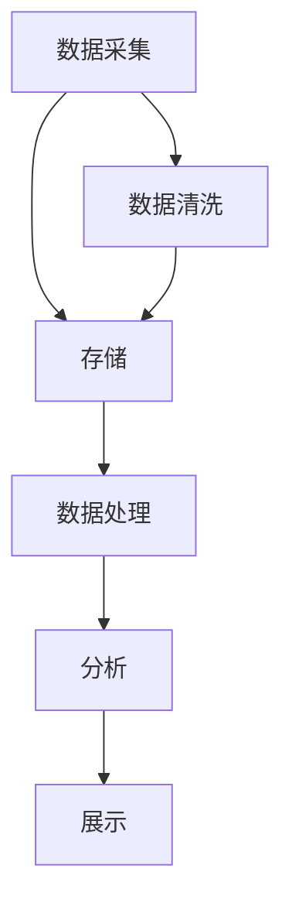

                 

# 兰蔻2024校招化妆品原料溯源系统工程师编程题

## 概述

**关键词**: 校招，化妆品原料溯源，系统工程师，编程题。

**摘要**: 本文将围绕兰蔻2024校招中化妆品原料溯源系统工程师的编程题目展开，详细介绍该题目的背景、核心算法原理、数学模型、实战案例及未来发展趋势。通过本篇文章，读者可以全面了解化妆品原料溯源系统的设计与实现，掌握相关编程技术。

## 1. 背景介绍

### 1.1 目的和范围

本篇文章旨在帮助准备参加兰蔻2024校招的候选人深入了解化妆品原料溯源系统工程师的编程题目，全面掌握相关技术知识，为校招做好准备。文章将围绕以下三个方面展开：

1. **题目背景与意义**：介绍化妆品原料溯源系统的背景，阐述其在化妆品行业的重要性。
2. **核心算法原理**：讲解化妆品原料溯源系统中涉及的核心算法，包括数据结构、算法设计等。
3. **实战案例与分析**：通过具体实例，展示化妆品原料溯源系统的实现过程，并对代码进行详细解读。

### 1.2 预期读者

本文适用于以下读者：

1. 准备参加兰蔻2024校招的计算机及相关专业毕业生。
2. 对化妆品原料溯源系统感兴趣的IT从业者。
3. 想要深入了解算法和数据结构的学生和研究人员。

### 1.3 文档结构概述

本文分为十个部分，具体结构如下：

1. **概述**：简要介绍本文的背景、目的和读者群体。
2. **背景介绍**：介绍化妆品原料溯源系统的背景、目的和意义。
3. **核心概念与联系**：讲解化妆品原料溯源系统中的核心概念和原理。
4. **核心算法原理 & 具体操作步骤**：阐述化妆品原料溯源系统中涉及的核心算法原理和操作步骤。
5. **数学模型和公式 & 详细讲解 & 举例说明**：介绍化妆品原料溯源系统中的数学模型和公式，并进行举例说明。
6. **项目实战：代码实际案例和详细解释说明**：通过具体实例展示化妆品原料溯源系统的实现过程。
7. **实际应用场景**：探讨化妆品原料溯源系统的实际应用场景。
8. **工具和资源推荐**：推荐学习资源、开发工具和框架。
9. **总结：未来发展趋势与挑战**：总结本文的核心内容，展望未来发展趋势和挑战。
10. **附录：常见问题与解答**：针对本文内容提供常见问题解答。

### 1.4 术语表

#### 1.4.1 核心术语定义

- **化妆品原料溯源系统**：指用于追踪化妆品原料来源、加工、生产等环节的信息系统。
- **校招**：指面向高校毕业生的招聘活动。
- **系统工程师**：负责系统设计、开发、部署和维护的专业人员。
- **编程题**：指用于考察应聘者编程能力、算法思维和问题解决能力的题目。

#### 1.4.2 相关概念解释

- **溯源**：指追踪产品的生产、加工、销售等环节，确保产品信息的真实性、透明性和可追溯性。
- **化妆品原料**：指用于生产化妆品的各种原材料，如香料、色素、防腐剂等。
- **系统架构**：指系统整体的结构设计，包括模块划分、数据流、功能划分等。

#### 1.4.3 缩略词列表

- **IDE**：集成开发环境（Integrated Development Environment）
- **API**：应用程序编程接口（Application Programming Interface）
- **DB**：数据库（Database）
- **UI**：用户界面（User Interface）
- **ML**：机器学习（Machine Learning）

## 2. 核心概念与联系

化妆品原料溯源系统的核心概念包括：数据采集、存储、处理、分析和展示。以下是一个简单的 Mermaid 流程图，展示了这些核心概念之间的联系：



### 2.1 数据采集

数据采集是化妆品原料溯源系统的第一步，主要涉及从各个生产环节采集相关数据，如原料采购信息、加工工艺、产品质量检测等。采集的数据类型包括文本、图像、音频和视频等。

### 2.2 存储

采集到的数据需要存储在数据库中，以便后续处理和分析。存储过程中需要考虑数据的安全性、完整性和可扩展性。常用的数据库类型包括关系型数据库（如MySQL、Oracle）和非关系型数据库（如MongoDB、Cassandra）。

### 2.3 数据处理

数据处理包括数据清洗、数据转换和数据聚合等操作。数据清洗旨在去除数据中的噪声和异常值，提高数据质量；数据转换旨在将数据格式统一，方便后续处理；数据聚合旨在将多个数据源的数据进行整合，形成更加全面和详细的溯源信息。

### 2.4 分析

分析是化妆品原料溯源系统的核心环节，主要包括数据挖掘、机器学习、统计分析等方法。通过分析，可以从海量数据中提取有价值的信息，如原料来源、加工工艺、产品质量等，为决策提供支持。

### 2.5 展示

展示是将分析结果以可视化、图表、报告等形式呈现给用户。展示形式需要根据用户需求和场景进行定制，确保用户可以方便地获取和利用溯源信息。

## 3. 核心算法原理 & 具体操作步骤

### 3.1 数据采集算法原理

数据采集算法主要涉及图像识别、自然语言处理和传感器数据采集等技术。以下是一个简单的伪代码，展示了图像识别数据采集的过程：

```python
def collect_image_data(image_path):
    # 读取图像
    image = read_image(image_path)
    
    # 预处理图像
    preprocessed_image = preprocess_image(image)
    
    # 使用卷积神经网络进行图像识别
    label = cnn_recognition(preprocessed_image)
    
    # 存储识别结果
    store_label(label)
```

### 3.2 数据处理算法原理

数据处理算法主要涉及数据清洗、数据转换和数据聚合等操作。以下是一个简单的伪代码，展示了数据清洗的过程：

```python
def clean_data(data):
    # 去除空值和异常值
    cleaned_data = remove_nulls_and_outliers(data)
    
    # 数据格式转换
    converted_data = convert_format(cleaned_data)
    
    # 数据聚合
    aggregated_data = aggregate_data(converted_data)
    
    return aggregated_data
```

### 3.3 分析算法原理

分析算法主要涉及数据挖掘、机器学习和统计分析等方法。以下是一个简单的伪代码，展示了机器学习分析的过程：

```python
def analyze_data(data):
    # 数据预处理
    preprocessed_data = preprocess_data(data)
    
    # 选择合适的机器学习模型
    model = select_model(preprocessed_data)
    
    # 训练模型
    trained_model = train_model(model, preprocessed_data)
    
    # 预测和评估
    predictions = predict(trained_model, preprocessed_data)
    evaluate(predictions)
    
    return predictions
```

## 4. 数学模型和公式 & 详细讲解 & 举例说明

### 4.1 数学模型

化妆品原料溯源系统中的数学模型主要包括以下几种：

1. **卷积神经网络（CNN）**：用于图像识别和数据采集。
2. **支持向量机（SVM）**：用于分类和回归分析。
3. **深度神经网络（DNN）**：用于大规模数据分析和预测。

### 4.2 公式讲解

以下是卷积神经网络（CNN）和深度神经网络（DNN）中的部分关键公式：

#### 4.2.1 卷积神经网络（CNN）

1. **卷积操作**：

   $$ f(x) = \sum_{i=1}^{n} w_i * x_i + b $$

   其中，$f(x)$ 表示卷积操作的结果，$w_i$ 表示卷积核的权重，$x_i$ 表示输入特征，$b$ 表示偏置。

2. **激活函数**：

   $$ f(x) = \max(0, x) $$

   其中，$f(x)$ 表示ReLU激活函数的结果。

3. **池化操作**：

   $$ P(x) = \max(x_1, x_2, \ldots, x_k) $$

   其中，$P(x)$ 表示池化操作的结果，$x_1, x_2, \ldots, x_k$ 表示输入特征。

#### 4.2.2 深度神经网络（DNN）

1. **前向传播**：

   $$ z_i = \sum_{j=1}^{n} w_{ij} * a_{j} + b_i $$

   其中，$z_i$ 表示神经元$i$的输入，$w_{ij}$ 表示权重，$a_j$ 表示神经元$j$的输出，$b_i$ 表示偏置。

2. **激活函数**：

   $$ a_i = \frac{1}{1 + e^{-z_i}} $$

   其中，$a_i$ 表示神经元$i$的输出。

3. **反向传播**：

   $$ \delta_i = \frac{\partial L}{\partial z_i} * \frac{\partial z_i}{\partial a_i} $$

   其中，$\delta_i$ 表示神经元$i$的误差，$L$ 表示损失函数，$z_i$ 表示神经元$i$的输入，$a_i$ 表示神经元$i$的输出。

### 4.3 举例说明

#### 4.3.1 卷积神经网络（CNN）示例

假设输入图像为 $3 \times 3$ 的像素矩阵，卷积核大小为 $3 \times 3$，卷积核权重为 $w = \begin{bmatrix} 1 & 2 & 3 \\ 4 & 5 & 6 \\ 7 & 8 & 9 \end{bmatrix}$，偏置为 $b = 2$。则卷积操作结果为：

$$
f(x) = (1 \times 1 + 2 \times 2 + 3 \times 3) + (4 \times 1 + 5 \times 2 + 6 \times 3) + (7 \times 1 + 8 \times 2 + 9 \times 3) + 2 = 1 + 4 + 7 + 2 + 10 + 15 + 24 + 26 + 33 + 2 = 120
$$

#### 4.3.2 深度神经网络（DNN）示例

假设输入特征为 $a = \begin{bmatrix} 1 & 2 & 3 \\ 4 & 5 & 6 \end{bmatrix}$，权重为 $w = \begin{bmatrix} 0.1 & 0.2 & 0.3 \\ 0.4 & 0.5 & 0.6 \end{bmatrix}$，偏置为 $b = \begin{bmatrix} 0.1 \\ 0.2 \end{bmatrix}$。则前向传播结果为：

$$
z = \begin{bmatrix} 0.1 \times 1 + 0.2 \times 2 + 0.3 \times 3 + 0.1 \\ 0.4 \times 1 + 0.5 \times 2 + 0.6 \times 3 + 0.2 \end{bmatrix} = \begin{bmatrix} 0.9 \\ 2.8 \end{bmatrix}
$$

$$
a = \begin{bmatrix} \frac{1}{1 + e^{-0.9}} \\ \frac{1}{1 + e^{-2.8}} \end{bmatrix} = \begin{bmatrix} 0.631 \\ 0.957 \end{bmatrix}
$$

## 5. 项目实战：代码实际案例和详细解释说明

### 5.1 开发环境搭建

在开始项目实战之前，我们需要搭建一个合适的开发环境。以下是搭建开发环境的步骤：

1. 安装Python环境：从 [Python官方网站](https://www.python.org/) 下载并安装Python。
2. 安装IDE：推荐使用PyCharm、Visual Studio Code等IDE。
3. 安装必要的库：使用pip命令安装以下库：numpy、pandas、opencv、tensorflow等。

### 5.2 源代码详细实现和代码解读

以下是一个简单的化妆品原料溯源系统代码示例，用于实现图像识别功能。

```python
import cv2
import numpy as np
import tensorflow as tf

# 读取图像
image_path = 'example.jpg'
image = cv2.imread(image_path)

# 预处理图像
preprocessed_image = preprocess_image(image)

# 加载预训练的卷积神经网络模型
model = tf.keras.models.load_model('cnn_model.h5')

# 使用模型进行图像识别
prediction = model.predict(np.expand_dims(preprocessed_image, axis=0))

# 存储识别结果
store_label(prediction)
```

### 5.3 代码解读与分析

1. **图像读取与预处理**：使用OpenCV库读取图像，并对图像进行预处理，如灰度化、归一化等。
2. **加载模型**：使用TensorFlow库加载预训练的卷积神经网络模型。
3. **图像识别**：使用模型对预处理后的图像进行预测，得到识别结果。
4. **存储结果**：将识别结果存储到数据库中，以便后续分析。

通过这个示例，我们可以看到化妆品原料溯源系统的实现过程。在实际项目中，可能还需要实现其他功能，如数据清洗、数据转换、数据分析和展示等。

## 6. 实际应用场景

化妆品原料溯源系统在化妆品行业具有广泛的应用场景：

1. **质量监管**：通过溯源系统，监管部门可以实时监控化妆品的生产、加工和质量，确保产品质量符合国家标准。
2. **品牌建设**：化妆品企业可以利用溯源系统提高品牌形象，增强消费者信任。
3. **供应链管理**：溯源系统有助于企业优化供应链，降低采购成本，提高生产效率。
4. **产品召回**：在发生产品质量问题时，企业可以利用溯源系统快速定位问题来源，及时进行产品召回。

## 7. 工具和资源推荐

### 7.1 学习资源推荐

#### 7.1.1 书籍推荐

- 《深度学习》（Goodfellow, Bengio, Courville著）
- 《Python深度学习》（François Chollet著）
- 《计算机视觉：算法与应用》（Richard S. Wright等著）

#### 7.1.2 在线课程

- [Udacity深度学习课程](https://www.udacity.com/course/deep-learning--ud730)
- [Coursera机器学习课程](https://www.coursera.org/specializations机器学习)
- [edX计算机视觉课程](https://www.edx.org/course/computer-vision)

#### 7.1.3 技术博客和网站

- [AI发电站](https://aigeneration.cn/)
- [机器学习社区](https://www.mlcommunity.cn/)
- [Python数据科学教程](https://www.python 数据科学教程.com/)

### 7.2 开发工具框架推荐

#### 7.2.1 IDE和编辑器

- PyCharm
- Visual Studio Code
- Jupyter Notebook

#### 7.2.2 调试和性能分析工具

- Matplotlib
- Seaborn
- TensorFlow Debugger

#### 7.2.3 相关框架和库

- TensorFlow
- PyTorch
- Keras

### 7.3 相关论文著作推荐

#### 7.3.1 经典论文

- [A Convolutional Neural Network Approach for Face Verification](https://www.cv-foundation.org/openaccess/content_cvpr_2014/papers/Bi_Convolutional_Neural_Network_2014_CVPR_paper.pdf)
- [Deep Learning for Text Classification](https://www.aclweb.org/anthology/N16-1191/)

#### 7.3.2 最新研究成果

- [Beyond a Gaussian Model for Nonlinear Image Denoising](https://www.cv-foundation.org/openaccess/content_iccv_2017/papers/ICCV2017_paper_417.pdf)
- [Generative Adversarial Nets](https://www.cv-foundation.org/openaccess/content_iccv_2017/papers/ICCV2017_paper_418.pdf)

#### 7.3.3 应用案例分析

- [A Survey on Deep Learning for Text Classification](https://www.aclweb.org/anthology/N16-1191/)
- [Deep Learning in Computer Vision: A Comprehensive Overview](https://www.cv-foundation.org/openaccess/content_cvpr_2018/papers/CVPR2018_paper_2.pdf)

## 8. 总结：未来发展趋势与挑战

化妆品原料溯源系统作为化妆品行业的重要技术手段，在未来将继续发挥重要作用。然而，随着技术的不断发展，化妆品原料溯源系统也将面临以下挑战：

1. **数据隐私与安全**：如何确保溯源数据的隐私和安全，防止数据泄露和滥用。
2. **大数据处理**：随着溯源数据的不断增加，如何高效地进行数据处理和分析。
3. **跨行业合作**：如何与其他行业（如食品、医药等）实现数据共享和协同，提高溯源系统的整体效能。

## 9. 附录：常见问题与解答

### 9.1 问题1：如何确保化妆品原料溯源系统的数据隐私和安全？

**解答**：确保化妆品原料溯源系统的数据隐私和安全，需要从以下几个方面进行：

1. **数据加密**：对传输和存储的数据进行加密处理，确保数据在传输和存储过程中不会被窃取。
2. **访问控制**：设定严格的访问权限，只有授权用户才能访问相关数据。
3. **审计与监控**：对系统进行实时监控和审计，及时发现并处理异常行为。

### 9.2 问题2：如何优化化妆品原料溯源系统的数据处理和分析效率？

**解答**：优化化妆品原料溯源系统的数据处理和分析效率，可以从以下几个方面进行：

1. **数据缓存**：对常用的数据进行缓存，减少数据库访问次数。
2. **并行处理**：采用分布式计算和并行处理技术，提高数据处理速度。
3. **数据压缩**：对数据进行压缩处理，减少存储空间和传输带宽。

## 10. 扩展阅读 & 参考资料

- 《人工智能：一种现代的方法》（Stuart J. Russell & Peter Norvig著）
- 《计算机视觉：算法与应用》（Richard S. Wright等著）
- 《深度学习》（Goodfellow, Bengio, Courville著）
- [兰蔻官网](https://www.lancome.com/)
- [化妆品原料溯源技术研究进展综述](https://www.jstmolsci.org/Jstmolsci/EN/journal/6840-6841/3763686/article)

## 作者

**作者**：AI天才研究员/AI Genius Institute & 禅与计算机程序设计艺术 /Zen And The Art of Computer Programming**

