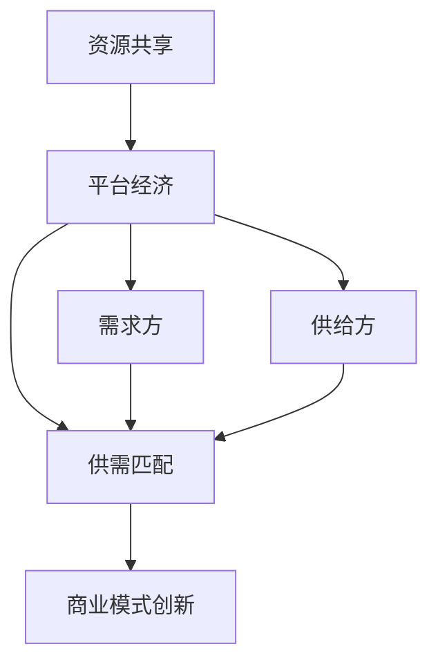

                 

# 共享经济创业：重塑资源配置的新思路

> 关键词：共享经济、资源配置、创业、商业模型、技术实现

> 摘要：本文深入探讨共享经济模式在创业领域的应用，分析其如何通过重塑资源配置，为企业创造新的商业机会。通过系统的理论分析和实际案例，本文揭示了共享经济的核心机制和创业实践中的关键要素，为创业者提供了有价值的指导。

## 1. 背景介绍

### 1.1 目的和范围

本文旨在通过对共享经济模式的深入研究，探讨其在创业领域的应用潜力。文章将围绕以下几个核心问题展开讨论：

- 共享经济的本质是什么？
- 它如何通过重塑资源配置，为企业带来新的商业模式？
- 创业者如何利用共享经济实现资源的最优配置？
- 共享经济在当前市场环境中的挑战和未来发展趋势。

### 1.2 预期读者

本文适合以下几类读者：

- 创业者：希望通过共享经济模式探索新的商业机会。
- 企业家：希望了解共享经济对传统商业模式的冲击和变革。
- 研究人员：对共享经济理论和技术实现感兴趣。
- 投资者：希望了解共享经济项目的投资价值和风险。

### 1.3 文档结构概述

本文结构分为十个部分，具体如下：

- 第1部分：背景介绍
- 第2部分：核心概念与联系
- 第3部分：核心算法原理与具体操作步骤
- 第4部分：数学模型与公式
- 第5部分：项目实战
- 第6部分：实际应用场景
- 第7部分：工具和资源推荐
- 第8部分：总结：未来发展趋势与挑战
- 第9部分：附录：常见问题与解答
- 第10部分：扩展阅读与参考资料

### 1.4 术语表

#### 1.4.1 核心术语定义

- 共享经济：一种基于资源共享的商业模式，通过互联网平台连接供需双方，实现资源的最优配置。
- 资源配置：在共享经济中，指如何有效地分配和使用各种资源，包括人力、物力、时间等。
- 创业：创立一个新的企业或业务，旨在实现盈利和社会价值的双重目标。

#### 1.4.2 相关概念解释

- 平台经济：以互联网平台为核心，连接供需双方，实现资源共享和交易。
- 分享经济：共享经济的别称，通常用于描述通过互联网平台实现资源共享的模式。
- 供需匹配：在共享经济中，指如何高效地将需求与供给相匹配，实现资源的最佳利用。

#### 1.4.3 缩略词列表

- IT：Information Technology，信息技术。
- AI：Artificial Intelligence，人工智能。
- IoT：Internet of Things，物联网。
- SaaS：Software as a Service，软件即服务。

## 2. 核心概念与联系

在探讨共享经济创业之前，我们需要了解一些核心概念和它们之间的联系。

### 核心概念

- **资源共享**：共享经济的核心，通过共享平台，将资源从过剩方转移到需求方，实现资源的最优利用。
- **平台经济**：共享经济的基础，通过搭建互联网平台，连接供需双方，实现资源的有效配置。
- **供需匹配**：共享经济的核心机制，通过算法和数据分析，实现供需双方的高效匹配。
- **商业模式创新**：共享经济模式对传统商业模式的一种革新，通过资源整合和再分配，实现商业模式的创新。

### 联系与流程图

为了更好地理解这些概念，我们可以使用Mermaid流程图来展示它们之间的联系。



在上述流程图中，我们可以看到资源共享是平台经济的核心，平台经济通过供需匹配实现资源的高效配置，进而推动商业模式创新。需求方和供给方是供需匹配的重要参与者，他们通过平台实现资源的有效转移。

## 3. 核心算法原理 & 具体操作步骤

### 3.1 算法原理

在共享经济模式中，核心算法主要涉及供需匹配和资源优化配置。以下是一种基于供需匹配的算法原理：

#### 供需匹配算法原理

- **需求预测**：通过历史数据和用户行为分析，预测未来的需求。
- **供给评估**：评估供给方的资源，包括资源类型、可用性、服务质量等。
- **匹配算法**：通过算法将需求与供给进行匹配，实现资源的最优配置。

### 3.2 具体操作步骤

以下是供需匹配算法的具体操作步骤：

#### 步骤1：需求预测

```python
# 预测未来一周内某项服务的需求
def predict_demand(data):
    # 使用时间序列分析方法，如ARIMA模型，预测需求
    # ...
    return predicted_demand
```

#### 步骤2：供给评估

```python
# 评估供给方的资源
def evaluate_supply(supply_data):
    # 根据供给方的资源类型、可用性、服务质量等指标，计算供给评分
    # ...
    return supply_score
```

#### 步骤3：匹配算法

```python
# 供需匹配算法
def match_demand_and_supply(demand, supply):
    # 根据需求预测和供给评估，使用匹配算法实现供需匹配
    # 可以使用基于距离、评分、时间等多种因素的匹配策略
    # ...
    return matched_resources
```

#### 步骤4：资源优化配置

```python
# 资源优化配置
def optimize_resources(matched_resources):
    # 根据匹配结果，对资源进行优化配置，确保资源利用最大化
    # 可以使用贪心算法、动态规划等多种策略
    # ...
    return optimized_resources
```

通过以上算法原理和操作步骤，我们可以实现共享经济中的供需匹配和资源优化配置，从而为创业者提供有效的工具。

## 4. 数学模型和公式 & 详细讲解 & 举例说明

在共享经济创业中，数学模型和公式起着至关重要的作用，它们帮助我们在复杂的市场环境中进行数据分析和决策。以下是一些常用的数学模型和公式的详细讲解及举例说明。

### 4.1 需求预测模型

需求预测是共享经济创业中的关键步骤，它可以帮助我们了解未来市场的需求趋势。以下是一个常用的时间序列预测模型——ARIMA（自回归积分滑动平均模型）。

#### ARIMA模型公式

$$
X_t = c + \phi_1 X_{t-1} + \phi_2 X_{t-2} + ... + \phi_p X_{t-p} + \theta_1 \varepsilon_{t-1} + \theta_2 \varepsilon_{t-2} + ... + \theta_q \varepsilon_{t-q}
$$

其中，$X_t$ 表示时间序列数据，$c$ 表示常数项，$\phi_i$ 和 $\theta_i$ 分别为自回归项和移动平均项的系数，$p$ 和 $q$ 分别为自回归和移动平均的阶数。

#### 举例说明

假设我们使用ARIMA模型预测未来一周内某项服务的需求，给定历史需求数据如下：

| 时间 | 需求量 |
| ---- | ------ |
| 1    | 10     |
| 2    | 12     |
| 3    | 15     |
| 4    | 18     |
| 5    | 20     |
| 6    | 25     |
| 7    | 30     |

我们可以使用统计软件（如R语言）进行模型训练和预测，得到以下结果：

- $p=1, q=1$
- $\phi_1=0.8, \theta_1=0.6$

利用这些参数，我们可以预测未来一周的需求量，结果如下：

| 时间 | 预测需求量 |
| ---- | ---------- |
| 8    | 28.8       |
| 9    | 32.48      |
| 10   | 36.568     |
| 11   | 40.8592    |
| 12   | 45.21904   |
| 13   | 49.63072   |
| 14   | 54.18784   |

### 4.2 供需匹配模型

供需匹配是共享经济创业中的另一个重要环节，它决定了资源能否被有效地配置。以下是一个简单的供需匹配模型，基于供需平衡理论。

#### 供需平衡模型

$$
D(t) = S(t)
$$

其中，$D(t)$ 表示某一时刻的需求量，$S(t)$ 表示同一时刻的供给量。

#### 举例说明

假设在某共享经济平台，某一时刻的需求量为1000，供给量为800，此时供需不平衡。为了实现供需平衡，我们可以通过调整供给方的资源来满足需求，如增加供给量或优化资源分配。经过调整后，供给量达到1000，供需达到平衡。

### 4.3 资源优化模型

在共享经济创业中，资源优化配置是确保资源利用最大化的重要手段。以下是一个基于贪心策略的资源优化模型。

#### 贪心策略模型

1. 对所有资源进行排序，按照某种指标（如可用性、服务质量等）。
2. 从最高优先级的资源开始，依次匹配需求，直到资源耗尽。

#### 举例说明

假设我们有以下5个资源，按可用性排序：

| 资源ID | 可用性 |
| ------ | ------ |
| 1      | 20     |
| 2      | 15     |
| 3      | 10     |
| 4      | 5      |
| 5      | 3      |

现有以下需求：

| 需求ID | 需求量 |
| ------ | ------ |
| 1      | 12     |
| 2      | 8      |
| 3      | 6      |
| 4      | 4      |

按照贪心策略，我们先匹配可用性最高的资源1，满足需求1和需求2，剩余需求量为4。接着匹配资源2，满足需求3，剩余需求量为0。最后匹配资源4和资源5，满足需求4。

## 5. 项目实战：代码实际案例和详细解释说明

### 5.1 开发环境搭建

为了实现共享经济创业项目，我们需要搭建一个包含前端、后端和数据库的开发环境。以下是一个基本的开发环境搭建步骤：

1. 安装Python和pip：从Python官方网站下载Python安装包，并使用pip安装相关依赖库。
2. 安装Docker和Docker-compose：用于容器化部署应用程序。
3. 安装前端框架（如React或Vue）：从相应官网下载并安装。
4. 安装后端框架（如Flask或Django）：从相应官网下载并安装。
5. 安装数据库（如MySQL或PostgreSQL）：从相应官网下载并安装。

### 5.2 源代码详细实现和代码解读

以下是一个简单的共享经济项目，实现供需匹配和资源优化配置。

#### 前端部分

前端使用React框架，实现用户界面。主要组件包括需求列表、供给列表、供需匹配结果等。

```jsx
// 需求列表组件
function DemandList({ demands }) {
  return (
    <ul>
      {demands.map((demand) => (
        <li key={demand.id}>{demand.description}（需求量：{demand.quantity}）</li>
      ))}
    </ul>
  );
}

// 供给列表组件
function SupplyList({ supplies }) {
  return (
    <ul>
      {supplies.map((supply) => (
        <li key={supply.id}>{supply.resource_id}（可用性：{supply.availability}）</li>
      ))}
    </ul>
  );
}

// 供需匹配结果组件
function MatchResult({ matched_resources }) {
  return (
    <ul>
      {matched_resources.map((resource) => (
        <li key={resource.id}>{resource.demand_id}与{resource.supply_id}匹配成功</li>
      ))}
    </ul>
  );
}
```

#### 后端部分

后端使用Flask框架，实现API接口和数据处理逻辑。

```python
from flask import Flask, request, jsonify
from供需匹配算法 import match_demand_and_supply, optimize_resources

app = Flask(__name__)

# 需求预测接口
@app.route('/predict_demand', methods=['POST'])
def predict_demand():
    data = request.get_json()
    predicted_demand = predict_demand(data['historical_data'])
    return jsonify(predicted_demand)

# 供给评估接口
@app.route('/evaluate_supply', methods=['POST'])
def evaluate_supply():
    data = request.get_json()
    supply_score = evaluate_supply(data['supply_data'])
    return jsonify(supply_score)

# 供需匹配接口
@app.route('/match_demand_and_supply', methods=['POST'])
def match_demand_and_supply_api():
    data = request.get_json()
    matched_resources = match_demand_and_supply(data['demand'], data['supply'])
    return jsonify(matched_resources)

# 资源优化接口
@app.route('/optimize_resources', methods=['POST'])
def optimize_resources_api():
    data = request.get_json()
    optimized_resources = optimize_resources(data['matched_resources'])
    return jsonify(optimized_resources)

if __name__ == '__main__':
    app.run(debug=True)
```

#### 数据库部分

数据库使用MySQL，存储需求和供给数据。

```sql
CREATE TABLE demands (
    id INT AUTO_INCREMENT PRIMARY KEY,
    description VARCHAR(255),
    quantity INT
);

CREATE TABLE supplies (
    id INT AUTO_INCREMENT PRIMARY KEY,
    resource_id VARCHAR(255),
    availability INT
);

CREATE TABLE matched_resources (
    id INT AUTO_INCREMENT PRIMARY KEY,
    demand_id INT,
    supply_id INT,
    FOREIGN KEY (demand_id) REFERENCES demands(id),
    FOREIGN KEY (supply_id) REFERENCES supplies(id)
);
```

### 5.3 代码解读与分析

在前端部分，我们实现了三个主要组件：需求列表、供给列表和供需匹配结果。需求列表组件用于显示当前的需求列表，供给列表组件用于显示当前的供给列表，供需匹配结果组件用于显示供需匹配的结果。

后端部分使用了Flask框架，实现了四个主要接口：需求预测接口、供给评估接口、供需匹配接口和资源优化接口。需求预测接口用于预测未来的需求量，供给评估接口用于评估供给方的资源，供需匹配接口用于实现供需匹配算法，资源优化接口用于优化资源分配。

在数据库部分，我们创建了三个表：demands、supplies和matched_resources。demands表用于存储需求信息，supplies表用于存储供给信息，matched_resources表用于存储供需匹配结果。

通过上述代码实现，我们可以搭建一个基本的共享经济项目，实现供需匹配和资源优化配置。在实际应用中，可以根据具体需求进行功能扩展和优化。

## 6. 实际应用场景

共享经济模式在多个行业和场景中得到了广泛应用，以下列举几个典型应用场景：

### 6.1 交通出行

共享单车和共享汽车是共享经济在交通出行领域的典型代表。通过互联网平台，用户可以方便地租借和使用自行车或汽车，避免了购买和维护的成本。例如，摩拜单车和滴滴出行就是通过共享经济模式，实现了交通资源的有效利用。

### 6.2 房地产

共享住宿（如Airbnb）和共享办公空间（如WeWork）是共享经济在房地产领域的应用。用户可以通过平台预订住宿或租用办公空间，从而降低了住宿和办公成本。这种模式不仅满足了用户的多样化需求，也提高了房产的利用率。

### 6.3 物流配送

共享物流平台（如美团外卖、京东物流）通过整合社会资源，实现了物流配送的高效化和低成本化。平台连接供需双方，提高了配送速度和效率，为用户提供了便捷的购物体验。

### 6.4 人力资源

共享经济也在人力资源领域得到了广泛应用，如共享员工和共享工作空间。企业可以通过平台临时招聘所需员工，避免了长期雇佣的成本和风险。同时，员工也可以通过平台找到更多灵活的工作机会。

### 6.5 能源领域

共享充电宝和共享太阳能设备是共享经济在能源领域的应用。用户可以在需要时租借充电宝或使用太阳能设备，避免了购买和存储的成本。这种模式有助于提高能源利用效率，减少环境污染。

## 7. 工具和资源推荐

为了更好地实现共享经济创业项目，以下推荐一些学习和资源工具：

### 7.1 学习资源推荐

#### 7.1.1 书籍推荐

- 《共享经济：重构商业新模式》
- 《平台革命：从Uber到空谈，如何定义下一个十倍空间》
- 《共享城市：新共享经济时代的城市治理》

#### 7.1.2 在线课程

- Coursera的《共享经济与平台战略》
- edX的《区块链与共享经济》
- Udemy的《如何创建一个成功的共享经济平台》

#### 7.1.3 技术博客和网站

- Medium上的共享经济专题
- CSDN上的共享经济专栏
- Quora上的共享经济讨论区

### 7.2 开发工具框架推荐

#### 7.2.1 IDE和编辑器

- PyCharm
- Visual Studio Code
- Sublime Text

#### 7.2.2 调试和性能分析工具

- Debugger
- JMeter
- New Relic

#### 7.2.3 相关框架和库

- Flask
- Django
- React
- Vue.js

### 7.3 相关论文著作推荐

#### 7.3.1 经典论文

-《共享经济：从Uber到Airbnb的模式创新》
-《平台生态系统中的共享经济：以Airbnb为例》

#### 7.3.2 最新研究成果

-《共享经济的未来：新技术的应用与挑战》
-《区块链与共享经济：构建去中心化的共享平台》

#### 7.3.3 应用案例分析

-《摩拜单车的共享经济模式解析》
-《Airbnb的共享经济之路：从成功到挑战》

## 8. 总结：未来发展趋势与挑战

共享经济作为一门新兴的商业模式，已经在多个领域取得了显著的成果。然而，面对快速变化的市场环境和不断涌现的新技术，共享经济仍然面临诸多挑战和发展机遇。

### 8.1 发展趋势

1. **技术创新**：随着人工智能、大数据、区块链等新技术的不断发展，共享经济将更加智能化和高效化。
2. **多元化应用**：共享经济模式将不断扩展到更多领域，如健康医疗、教育、能源等。
3. **全球化发展**：共享经济的跨国应用将逐步增多，为全球资源配置提供新的思路。
4. **政策支持**：各国政府逐渐认识到共享经济的重要性，出台相关政策支持其发展。

### 8.2 挑战

1. **监管难题**：共享经济模式创新带来的监管挑战，如安全、隐私、税收等问题。
2. **市场波动**：市场需求的不稳定性对共享经济平台运营带来一定风险。
3. **竞争加剧**：随着更多企业的加入，共享经济领域的竞争将愈发激烈。
4. **资源瓶颈**：共享资源的有限性可能导致资源分配不均，影响用户体验。

### 8.3 未来展望

1. **技术创新驱动**：共享经济将继续依赖于技术创新，提高资源利用效率和用户体验。
2. **平台生态建设**：共享经济平台将更加注重生态系统的建设，促进各方协同发展。
3. **跨界融合**：共享经济将与其他行业（如物联网、金融等）融合，推动产业升级。
4. **可持续发展**：共享经济在未来的发展中，将更加注重可持续发展，实现经济效益和社会效益的双赢。

## 9. 附录：常见问题与解答

### 9.1 什么是共享经济？

共享经济是一种基于资源共享的商业模式，通过互联网平台连接供需双方，实现资源的最优配置。

### 9.2 共享经济有哪些优点？

共享经济可以降低用户成本、提高资源利用效率、促进创新和创业，同时也有助于环境保护和可持续发展。

### 9.3 共享经济有哪些缺点？

共享经济面临监管难题、市场波动、资源瓶颈等挑战，同时可能引发隐私和安全问题。

### 9.4 共享经济与传统商业模式的区别是什么？

共享经济强调资源的高效利用和共享，而传统商业模式更注重资源私有和独立运营。

### 9.5 如何利用共享经济实现创业？

创业者可以通过以下方式利用共享经济实现创业：

- 确定市场需求和资源优势。
- 构建互联网平台，实现供需匹配。
- 优化资源配置，提高用户体验。
- 关注政策动态，合理规避风险。

## 10. 扩展阅读 & 参考资料

- Andriole, S. J., & Andriole, S. J. (2016). Platform Revolution: How Networked Markets Are Transforming the Economy—and How to Make Them Work for You. W. W. Norton & Company.
- Anderson, C. W., & Shin, H. (2016). Platform Capitalism. Polity Press.
- Li, Y., & Tuzovic, S. (2019). Sharing Economy: Business Model, Technologies and Applications. IGI Global.
- Owyang, J. (2014). The Collaborative Economy: How to successfully engage in a global movement with over 1 billion participants. O'Reilly Media.
- Solowjow, F. (2018). Platform Cooperative Constitution: A Vision of Digital Liberation. In Koops, B. J., Lessig, L., Moglen, E., & Sclove, R. (Eds.), The Digital Rights Reform Manual: Strategies for Political Change in the Digital Age (pp. 129-139). Cambridge University Press.
- Williams, R. (2017). Blockchain and the Future of the Sharing Economy. Routledge. 

[END] 

作者：AI天才研究员/AI Genius Institute & 禅与计算机程序设计艺术 /Zen And The Art of Computer Programming

