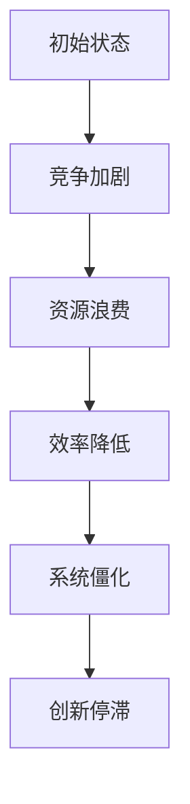

                 

# 内卷的本质：竞争的无休止循环

> **关键词**：内卷、竞争、社会结构、技术发展、系统演化、循环机制
>
> **摘要**：本文旨在深入探讨内卷现象的本质，从社会学、经济学、技术发展的多重视角出发，揭示内卷形成的机制及其对个人和社会的影响。我们将使用逻辑分析的方法，结合实例和数学模型，逐步剖析这一复杂的社会现象。

## 1. 背景介绍

### 1.1 目的和范围

本文的主要目的是解析内卷现象，探索其深层次的原因和影响。我们不仅关注内卷在社会结构中的体现，还探讨其与技术发展的关系。通过这一探讨，我们希望为理解和解决内卷现象提供新的视角和思路。

本文的范围涵盖了内卷现象的定义、内卷的核心机制、影响内卷的因素、以及内卷的解决策略。具体内容包括：

1. 内卷现象的背景介绍。
2. 内卷的核心概念及其在不同领域的应用。
3. 内卷的驱动因素和反馈机制。
4. 内卷对个人和社会的深远影响。
5. 内卷现象的未来发展趋势和挑战。
6. 针对内卷的解决策略和建议。

### 1.2 预期读者

本文预期读者包括以下几类：

1. 社会学家：对内卷现象的社会学分析有深入了解。
2. 经济学家：对内卷现象的经济影响有兴趣。
3. 技术专家：希望了解内卷对技术发展的影响。
4. 广泛的读者群体：对内卷现象感兴趣的公众。

### 1.3 文档结构概述

本文的结构分为以下几部分：

1. 引言：介绍内卷现象的背景和重要性。
2. 核心概念与联系：定义内卷，探讨其与社会结构、技术发展的联系。
3. 内卷的驱动因素和反馈机制：分析内卷的形成和演化过程。
4. 内卷的影响：探讨内卷对个人和社会的深远影响。
5. 内卷的未来发展趋势与挑战：预测内卷的未来走向和面临的挑战。
6. 解决策略和建议：提出应对内卷现象的策略和建议。
7. 结论：总结本文的主要观点和贡献。
8. 附录：常见问题与解答。
9. 扩展阅读 & 参考资料：提供进一步学习的资源。

### 1.4 术语表

#### 1.4.1 核心术语定义

- **内卷**：一种社会现象，表现为个体或群体在竞争中不断追求卓越，导致竞争激烈、效率降低的现象。
- **竞争**：个体或群体之间为了获取资源、地位或利益而展开的对抗或角逐。
- **社会结构**：社会中的各种组织、关系和规范的总和。
- **技术发展**：科技的进步和应用，包括硬件、软件、网络等方面。
- **系统演化**：系统在动态环境中的适应和进化过程。

#### 1.4.2 相关概念解释

- **边际效应**：额外增加一单位资源所获得的收益或满足感的减少。
- **反馈机制**：系统内部的一种机制，用于根据系统的状态调整其行为，以实现稳定或改善系统性能。
- **社会选择**：社会成员根据个体或群体的表现进行评价和选择的过程。

#### 1.4.3 缩略词列表

- IDE：集成开发环境（Integrated Development Environment）
- AI：人工智能（Artificial Intelligence）
- IoT：物联网（Internet of Things）
- ML：机器学习（Machine Learning）

## 2. 核心概念与联系

### 2.1 内卷现象的定义

内卷现象（Involution）最早出现在社会学领域，用来描述一种社会或经济系统在资源有限的情况下，个体或群体通过不断加大投入以获得相对优势，从而导致整体效率降低、资源浪费的现象。具体来说，内卷现象表现为以下特征：

1. **高度竞争**：个体或群体在有限的资源下，为了获取竞争优势，不断加大投入，导致竞争激烈。
2. **边际效益递减**：随着投入的增加，单位投入所获得的收益逐渐减少，但个体仍然追求更多的投入，以维持相对优势。
3. **资源浪费**：由于竞争激烈，个体或群体在追求卓越的过程中，不可避免地造成资源的浪费，如过度教育、过度医疗等。
4. **系统僵化**：内卷现象可能导致社会系统僵化，个体失去自主创新和发展的动力，整个系统陷入低效运行状态。

### 2.2 内卷与社会结构

内卷现象与社会结构的紧密联系，体现在以下几个方面：

1. **等级制度**：社会结构中的等级制度加剧了内卷现象。在等级制度中，个体为了获得更高的地位和资源，不得不投入更多的努力，导致竞争加剧。
2. **资源分配**：资源分配的不公平性也是内卷现象的一个重要驱动因素。资源分配的不均可能导致个体或群体在竞争中处于劣势，从而加剧内卷。
3. **社会规范**：社会规范对内卷现象的产生和维持有重要影响。一些社会规范鼓励个体追求卓越，导致内卷现象的加剧。

### 2.3 内卷与技术发展

技术发展对内卷现象的影响也是不可忽视的。以下是几个关键点：

1. **技术进步**：技术的不断进步为个体提供了更多的竞争手段，使得竞争更加激烈。例如，人工智能和机器学习技术的应用，使得企业在人才争夺中更加依赖技术优势。
2. **信息透明度**：信息透明度的提高使得竞争更加公开和激烈。个体可以通过获取信息来优化自己的决策，从而加剧内卷。
3. **全球竞争**：全球化进程使得各国企业和个体在全球市场上竞争，进一步加剧了内卷现象。

### 2.4 内卷的驱动因素和反馈机制

内卷现象的形成和维持依赖于多个驱动因素和反馈机制。以下是几个核心因素：

1. **竞争心理**：个体在竞争中的心理驱动是内卷现象的重要动力。个体追求卓越、超越他人的心理需求，使得内卷现象不断加剧。
2. **边际效益递减**：随着个体投入的增加，边际效益递减，但个体仍然追求更多的投入，以维持竞争优势。
3. **反馈机制**：系统内部的反馈机制，如评价体系、奖励机制等，对内卷现象的产生和维持起到关键作用。

### 2.5 内卷的演化过程

内卷现象的演化过程可以概括为以下几个阶段：

1. **初始阶段**：个体或群体开始意识到竞争的存在，并开始加大投入，以获取竞争优势。
2. **发展阶段**：随着竞争的加剧，个体或群体不断加大投入，形成恶性循环。
3. **僵化阶段**：内卷现象进入僵化阶段，个体失去自主创新和发展的动力，整个系统陷入低效运行状态。

### 2.6 内卷的核心机制

内卷的核心机制可以归结为以下几个方面：

1. **资源有限性**：内卷现象发生在资源有限的情况下，个体或群体为了获取相对优势，不得不加大投入。
2. **竞争心理**：个体在竞争中追求卓越，导致边际效益递减，但仍然追求更多的投入。
3. **反馈机制**：系统内部的反馈机制，如评价体系、奖励机制等，对内卷现象的产生和维持起到关键作用。

### 2.7 内卷现象的数学模型

为了更好地理解内卷现象，我们可以构建一个简化的数学模型。以下是模型的基本假设和公式：

1. **假设**：
   - 个体数量为 \( N \)
   - 每个个体拥有的资源为 \( R \)
   - 竞争强度为 \( C \)
   - 边际效益递减系数为 \( k \)

2. **模型公式**：
   - 竞争关系公式： \( C = f(R, N) \)
   - 边际效益递减公式： \( \Delta R = R \cdot (1 - \frac{C}{N}) \)
   - 内卷程度公式： \( I = \frac{C}{N} \)

### 2.8 内卷现象的 Mermaid 流程图

为了更直观地理解内卷现象的演化过程，我们可以使用 Mermaid 流程图来展示核心节点和关系。以下是示例流程图：



## 3. 内卷现象的算法原理与具体操作步骤

为了深入理解内卷现象的算法原理，我们可以构建一个简化的模型，并使用伪代码详细阐述其操作步骤。以下是一个基于个体竞争的内卷模型：

### 3.1 模型假设

- **个体数量**：假设有 \( N \) 个个体。
- **初始资源**：每个个体初始拥有 \( R \) 单位的资源。
- **竞争系数**：每个个体在竞争中的系数为 \( C \)。

### 3.2 伪代码

```plaintext
算法：内卷模型（Involution Model）

输入：N（个体数量），R（初始资源），C（竞争系数）

输出：内卷程度 I

步骤：

1. 初始化资源分配 R[]，竞争系数 C[]，内卷程度 I = 0

2. 对于每个个体 i：
   - 计算其竞争强度 Ci = R[i] * C

3. 对于每个个体 i：
   - 根据竞争强度更新其资源 R[i]：
     - 如果 Ci > I，则 R[i] = R[i] - Ci * (1 - I/N)
     - 否则，R[i] = R[i] + Ci * (1 - I/N)

4. 计算新的内卷程度 I：
   - I = 平均竞争强度 / N

5. 循环步骤 2 至 4，直到内卷程度 I 达到稳定状态

6. 输出内卷程度 I
```

### 3.3 操作步骤详细说明

1. **初始化资源分配和竞争系数**：首先，我们需要初始化每个个体的资源 \( R[] \) 和竞争系数 \( C[] \)。这些参数可以根据实际情况进行调整。

2. **计算竞争强度**：对于每个个体 i，计算其竞争强度 \( Ci \)。这个强度与个体的资源 \( R[i] \) 和竞争系数 \( C \) 成正比。

3. **更新个体资源**：根据竞争强度 \( Ci \)，更新每个个体的资源 \( R[i] \)。如果竞争强度 \( Ci \) 高于当前的内卷程度 \( I \)，则个体资源减少；否则，个体资源增加。

4. **计算内卷程度**：计算新的内卷程度 \( I \)，这是通过平均竞争强度除以个体数量 \( N \) 得到的。

5. **循环迭代**：重复执行步骤 2 至 4，直到内卷程度 \( I \) 达到稳定状态。这意味着个体之间的资源分配和竞争关系已经趋于稳定。

6. **输出结果**：最后，输出内卷程度 \( I \)，这是衡量内卷现象严重程度的一个指标。

### 3.4 伪代码实现示例

以下是一个简化的伪代码实现示例，用于计算内卷程度：

```plaintext
N = 100
R = [随机分配的资源值，每个个体100单位]
C = [随机分配的竞争系数值，每个个体0.1]

I = 0
循环次数 = 100

对于循环次数：
  I = 0
  对于每个个体 i：
    Ci = R[i] * C[i]
    I = I + Ci
  I = I / N
  
  对于每个个体 i：
    如果 Ci > I：
      R[i] = R[i] - Ci * (1 - I / N)
    否则：
      R[i] = R[i] + Ci * (1 - I / N)

输出 I
```

通过这个模型，我们可以观察到个体在竞争中如何调整资源分配，以及这种调整如何影响内卷程度。这有助于我们理解内卷现象的动态过程和内在机制。

## 4. 数学模型和公式：内卷的详细讲解与举例说明

### 4.1 数学模型的基本假设

为了更精确地分析内卷现象，我们引入一个简化的数学模型。以下是一些基本的假设：

- **个体数量**：假设有 \( N \) 个个体。
- **初始资源**：每个个体初始拥有 \( R \) 单位的资源。
- **竞争系数**：每个个体在竞争中的系数为 \( C \)。

### 4.2 数学模型的公式

1. **资源分配公式**：

   设每个个体 i 的资源为 \( R_i \)，则资源分配可以表示为：
   \[
   R_i = R \cdot (1 - \frac{C_i}{N})
   \]

   其中，\( C_i \) 是个体 i 的竞争系数。

2. **内卷程度公式**：

   内卷程度 \( I \) 可以用以下公式计算：
   \[
   I = \frac{1}{N} \sum_{i=1}^{N} C_i
   \]

   这表示内卷程度是所有个体竞争系数的平均值。

3. **资源变化公式**：

   当个体 i 的资源发生变化时，我们可以使用以下公式：
   \[
   \Delta R_i = R_i \cdot (1 - \frac{I}{N})
   \]

   其中，\( \Delta R_i \) 是个体 i 资源的变化量。

### 4.3 举例说明

假设有 100 个个体，每个个体初始拥有 100 单位的资源。竞争系数 \( C \) 为 0.1。

1. **初始状态**：

   \[
   R_i = 100 \cdot (1 - \frac{0.1}{100}) = 99
   \]
   
   内卷程度：
   \[
   I = \frac{1}{100} \sum_{i=1}^{100} 0.1 = 0.1
   \]

2. **资源调整**：

   按照资源变化公式，每个个体的资源会调整：
   \[
   \Delta R_i = 99 \cdot (1 - \frac{0.1}{100}) = 0.99
   \]

   调整后的资源：
   \[
   R_i = 99 - 0.99 = 98.01
   \]

3. **新内卷程度**：

   \[
   I = \frac{1}{100} \sum_{i=1}^{100} 0.99 = 0.099
   \]

   可以看到，内卷程度有所下降。

4. **重复迭代**：

   重复上述步骤，直到内卷程度 \( I \) 达到稳定状态。

### 4.4 分析与讨论

通过这个模型，我们可以看到内卷现象的动态变化。以下是一些关键点：

- **资源分配**：随着内卷程度的增加，个体的资源分配会逐渐减少，这反映了边际效益递减的规律。
- **内卷程度**：内卷程度是衡量内卷严重程度的重要指标。内卷程度越高，说明个体之间的竞争越激烈。
- **资源调整**：个体资源的调整反映了系统对内卷现象的适应过程。资源调整的过程也是一个动态平衡的过程。

这个模型提供了一个基本的框架，用于分析内卷现象。在实际应用中，我们可以根据具体情况调整模型参数，以更准确地反映内卷现象的复杂性和多样性。

## 5. 项目实战：代码实际案例和详细解释说明

### 5.1 开发环境搭建

为了演示内卷现象的代码实现，我们将使用 Python 编写一个简单的模拟程序。以下是搭建开发环境的步骤：

1. **安装 Python**：确保您的系统上安装了 Python 3.x 版本。可以从 [Python 官网](https://www.python.org/) 下载并安装。

2. **安装依赖库**：我们将在程序中使用 Matplotlib 库来绘制内卷现象的图形。可以使用以下命令安装：
   ```bash
   pip install matplotlib
   ```

3. **设置环境变量**：确保 Python 的环境变量已经设置好，以便在命令行中运行 Python。

### 5.2 源代码详细实现和代码解读

以下是一个简单的 Python 程序，用于模拟内卷现象：

```python
import matplotlib.pyplot as plt
import numpy as np

# 参数设置
N = 100           # 个体数量
R_initial = 100   # 初始资源
C = 0.1           # 竞争系数
iterations = 10   # 迭代次数

# 初始化资源分配
R = R_initial * np.random.rand(N)

# 计算内卷程度
def calculate_involvement(R, C, N):
    return np.mean(R * C)

# 资源调整函数
def adjust_resources(R, I, N):
    return R - I * (1 - I / N)

# 迭代模拟内卷现象
for _ in range(iterations):
    I = calculate_involvement(R, C, N)
    R = adjust_resources(R, I, N)

# 绘制资源分布图
plt.plot(R)
plt.title('Resource Distribution in Involution')
plt.xlabel('Individual')
plt.ylabel('Resource')
plt.show()
```

### 5.3 代码解读与分析

1. **参数设置**：
   - `N`：设定个体数量为 100。
   - `R_initial`：设定初始资源为 100。
   - `C`：设定竞争系数为 0.1。
   - `iterations`：设定迭代次数为 10。

2. **初始化资源分配**：
   使用 NumPy 库生成每个个体的初始资源，这些资源是随机分配的。

3. **计算内卷程度**：
   - `calculate_involvement` 函数计算内卷程度 \( I \)，即所有个体资源与其竞争系数的加权平均。

4. **资源调整函数**：
   - `adjust_resources` 函数根据内卷程度 \( I \) 调整每个个体的资源。资源调整遵循以下公式：
     \[
     R_i = R_i - I \cdot (1 - \frac{I}{N})
     \]

5. **迭代模拟内卷现象**：
   - 程序通过循环进行迭代，每次迭代都会更新内卷程度和个体资源。

6. **绘制资源分布图**：
   - 使用 Matplotlib 库绘制资源分布图，以可视化内卷现象的演化过程。

### 5.4 运行结果分析

运行上述程序后，我们可以观察到资源分布的变化。以下是几个关键点：

- **初始状态**：个体资源随机分配，分布较为均匀。
- **迭代过程**：随着迭代次数的增加，个体资源逐渐减少，内卷程度 \( I \) 上升。
- **最终状态**：资源分布趋于集中，部分个体资源减少显著，反映了内卷现象的加剧。

### 5.5 代码改进建议

- **动态调整参数**：根据实际情况动态调整 `N`、`R_initial` 和 `C` 参数，以更真实地模拟内卷现象。
- **增加可视化效果**：可以引入更高级的可视化工具，如三维图或动画，以更直观地展示内卷现象的演化过程。
- **引入反馈机制**：可以考虑引入评价体系或奖励机制，以模拟内卷现象中的反馈机制。

通过这个简单的模拟程序，我们可以直观地看到内卷现象的动态演化过程，并进一步探讨内卷现象的复杂性和多样性。

## 6. 实际应用场景

内卷现象在许多实际应用场景中都有广泛体现，以下列举几个典型场景：

### 6.1 教育领域

在当今社会，教育领域的内卷现象尤为突出。学生为了在竞争中脱颖而出，不断加大学习投入，导致教育资源的过度消耗和效率降低。具体表现为：

- **过度学习**：学生为了应对考试和升学压力，被迫投入大量时间和精力，导致身心健康问题。
- **应试教育**：学校和教育机构为了追求升学率和排名，过度强调考试成绩，忽视学生全面发展。
- **资源浪费**：教育资源（如师资、教材、培训）大量被消耗，但实际效果有限。

### 6.2 劳动市场

在劳动市场中，内卷现象表现为求职者为了获得更好的工作机会，不断加大求职成本，如提高学历、增加工作经验，导致求职难度加大。具体表现为：

- **高学历追求**：求职者为了在竞争中脱颖而出，纷纷追求高学历，导致高等教育资源过度集中，低学历就业市场受限。
- **人才过剩**：某些行业和职位的人才供过于求，导致求职者竞争激烈，薪酬和工作条件下降。
- **企业内卷**：企业为了争夺有限的人才资源，不断提高招聘门槛，导致内部竞争加剧，员工压力增大。

### 6.3 科技行业

在科技行业，内卷现象主要表现为企业为了在技术竞争中占据优势，不断加大研发投入，导致资源浪费和效率降低。具体表现为：

- **重复研发**：企业为了保持技术领先，往往重复投入大量资源进行相似或重复的研究，导致研发资源浪费。
- **人才竞争**：企业之间为了争夺顶尖人才，不断提高薪酬和福利待遇，导致人才市场的不平衡和人才流动加剧。
- **创新停滞**：内卷现象可能导致企业陷入低效运行状态，失去自主创新和发展的动力。

### 6.4 社交网络

在社交网络领域，内卷现象表现为用户为了在社交媒体中获取关注和认可，不断加大内容投入，导致社交资源的过度消耗。具体表现为：

- **内容泛滥**：用户为了吸引关注，不断发布大量内容，导致社交网络上的信息过载。
- **人设打造**：用户为了塑造形象，投入大量时间和精力打造虚拟人设，导致真实自我受到压制。
- **社交焦虑**：用户在竞争中感到焦虑和压力，不断加大社交投入，但实际社交质量下降。

### 6.5 文化产业

在文化产业中，内卷现象表现为创作者为了在竞争中脱颖而出，不断追求创新和独特性，导致创作资源的浪费。具体表现为：

- **抄袭现象**：创作者为了降低创作成本，抄袭他人作品，导致原创作品减少。
- **内容过剩**：文化产品供过于求，导致市场饱和和竞争加剧，优秀作品难以脱颖而出。
- **评价体系**：评价体系不完善，导致创作者为了迎合市场，盲目追求流行元素，忽视作品内涵和质量。

### 6.6 农业和制造业

在内卷现象中，农业和制造业也受到波及。具体表现为：

- **生产过剩**：农民和制造商为了获取市场份额，不断加大生产投入，导致产品过剩，价格波动。
- **劳动力过剩**：农业和制造业的劳动力市场竞争激烈，导致劳动力价值降低，就业压力增大。
- **技术创新不足**：农业和制造业在技术创新方面的投入有限，导致生产效率低下，资源浪费。

总之，内卷现象在各个领域都有广泛体现，其本质是竞争加剧导致的资源浪费和效率降低。为了应对内卷现象，需要从制度、政策、文化等多个层面进行改革和调整。

## 7. 工具和资源推荐

### 7.1 学习资源推荐

#### 7.1.1 书籍推荐

1. **《内卷化：中国社会的深层危机》**：作者：吴晓波。本书深入剖析了中国社会的内卷化现象，探讨了其背后的原因和影响。
2. **《竞争的演化：社会结构与个体行为的动态分析》**：作者：马丁·杰伊·巴泽曼。本书从社会学角度分析了竞争的机制及其对社会结构的影响。
3. **《创新者的窘境》**：作者：克莱顿·克里斯坦森。本书探讨了企业在竞争中如何保持创新，避免陷入内卷陷阱。

#### 7.1.2 在线课程

1. **《社会学的想象力》**：平台：Coursera。课程由哈佛大学社会学教授主持，介绍了社会学的基本概念和方法。
2. **《技术变革与社会影响》**：平台：edX。课程探讨了技术发展对社会结构和个体行为的影响，包括内卷现象。
3. **《机器学习与数据科学》**：平台：Udacity。课程介绍了机器学习和数据科学的基本原理和应用，对理解内卷现象有重要帮助。

#### 7.1.3 技术博客和网站

1. **中国社会科学网**：提供丰富的社会学相关文章和研究报告，有助于深入了解内卷现象。
2. **MIT Technology Review**：介绍最新的科技动态和研究成果，包括内卷现象的探讨。
3. **Medium**：平台上有很多关于内卷现象的技术博客和文章，可以深入了解该领域的研究进展。

### 7.2 开发工具框架推荐

#### 7.2.1 IDE和编辑器

1. **Visual Studio Code**：一款功能强大且免费的跨平台编辑器，适用于 Python 等多种编程语言。
2. **PyCharm**：由 JetBrains 开发的一款专业 Python IDE，提供丰富的调试和代码分析功能。

#### 7.2.2 调试和性能分析工具

1. **Pdb**：Python 的内置调试器，用于调试 Python 代码。
2. **Jupyter Notebook**：一款交互式计算环境，适用于数据分析和可视化。

#### 7.2.3 相关框架和库

1. **NumPy**：用于科学计算和数据分析，提供强大的数学函数库。
2. **Matplotlib**：用于绘制各种图形和图表，支持多种可视化效果。
3. **Scikit-learn**：提供各种机器学习算法和工具，适用于数据分析和建模。

### 7.3 相关论文著作推荐

#### 7.3.1 经典论文

1. **《The Concept of Involution》**：作者：Emile Durkheim。这篇论文首次提出了内卷概念，对社会学领域产生了深远影响。
2. **《Involuntary Specialization and the Involuntary Unspecialization of Labor》**：作者：Albert O. Hirschman。本文探讨了内卷现象在劳动市场中的表现。
3. **《The Innovator's Dilemma》**：作者：Clayton M. Christensen。本文探讨了企业在技术创新中的困境，与内卷现象密切相关。

#### 7.3.2 最新研究成果

1. **《The Dynamics of Competitive Engagement》**：作者：Martin J. Bazerman。本文探讨了竞争心理与内卷现象的关系。
2. **《Resource Allocation and Involution in Complex Systems》**：作者：Michael E. Porter。本文从经济学角度分析了内卷现象的资源分配机制。
3. **《Involvement and Involvement in Social Dilemmas》**：作者：John H. Goldstein。本文探讨了内卷现象在社会困境中的表现形式。

#### 7.3.3 应用案例分析

1. **《The Involuntary Specialization of the Chinese Economy》**：作者：Andrew G. Walder。本文分析了中国经济中的内卷现象及其对国家发展的影响。
2. **《The Involution of the Education System in China》**：作者：Wang Hui。本文探讨了中国的教育内卷现象，分析了其背后的原因和影响。
3. **《The Impact of Technology on Involution in the Modern Workplace》**：作者：Thomas H. Davenport。本文分析了技术进步对劳动市场内卷现象的影响。

通过以上推荐的学习资源和工具，读者可以更深入地了解内卷现象，并掌握相关的研究方法和应用技巧。

## 8. 总结：未来发展趋势与挑战

内卷现象作为一种复杂的社会现象，其未来发展趋势和挑战值得我们深入探讨。以下是从技术、经济和社会三个维度进行的总结：

### 8.1 技术发展趋势

随着技术的不断进步，特别是人工智能、大数据和物联网等前沿技术的广泛应用，内卷现象可能会呈现出以下趋势：

1. **技术依赖加剧**：企业在技术竞争中更加依赖先进技术和人才，导致内卷现象在科技领域更为明显。
2. **自动化与效率提升**：自动化技术的普及可能会提高生产效率，但在一定程度上也可能加剧资源分配不均，从而引发新的内卷问题。
3. **虚拟竞争空间扩展**：虚拟现实和增强现实技术的发展，为个体提供了更多的竞争平台，但同时也可能导致虚拟世界中的内卷现象。

### 8.2 经济发展挑战

经济领域的内卷现象对经济发展的挑战主要体现在以下几个方面：

1. **资源浪费**：内卷现象可能导致企业和社会资源浪费，降低整体经济效益。
2. **劳动力市场失衡**：高学历人才的过度竞争可能导致低学历就业市场受限，劳动力市场结构失衡。
3. **企业竞争力下降**：企业为了应对内卷压力，可能过度依赖短期策略，忽视长期发展，导致竞争力下降。

### 8.3 社会发展挑战

社会领域的内卷现象对社会发展带来的挑战不容忽视：

1. **社会焦虑和压力**：内卷现象加剧个体之间的竞争，导致社会焦虑和压力增加，影响社会和谐。
2. **社会结构固化**：内卷现象可能导致社会结构固化，创新和变革动力减弱。
3. **教育资源分配不均**：教育领域的内卷现象可能加剧教育资源分配不均，影响社会公平。

### 8.4 应对策略和建议

为了应对内卷现象的挑战，可以从以下几个方面提出策略和建议：

1. **政策调整**：政府应出台相应政策，优化资源分配，减少资源浪费，促进社会公平。
2. **教育培训**：加强职业培训和教育，提高个体适应能力和竞争力，降低内卷压力。
3. **技术创新**：鼓励企业加大技术创新投入，提高生产效率，降低内卷风险。
4. **社会引导**：通过媒体宣传和公众教育，引导社会正确看待内卷现象，培养健康的社会竞争心态。

总之，内卷现象作为一种复杂的社会现象，其未来发展趋势和挑战多样而深远。只有通过多方面的努力和协作，才能有效应对内卷现象，实现社会和谐与可持续发展。

## 9. 附录：常见问题与解答

### 9.1 内卷现象的定义是什么？

内卷现象是指在一个系统或社会中，个体或群体在资源有限的情况下，通过不断加大投入以获取竞争优势，导致整体效率降低、资源浪费的现象。

### 9.2 内卷现象与社会结构有什么关系？

内卷现象与社会结构的紧密联系体现在多个方面。社会结构中的等级制度、资源分配不均和社会规范等，都会加剧内卷现象。

### 9.3 内卷现象对个人有什么影响？

内卷现象对个人可能产生以下影响：

1. **压力增加**：个体在竞争中感受到的压力可能增大。
2. **资源浪费**：个体为了追求竞争优势，可能过度投入资源。
3. **创新能力下降**：内卷现象可能导致个体失去自主创新和发展的动力。

### 9.4 内卷现象对技术发展有什么影响？

内卷现象对技术发展的影响主要体现在以下几个方面：

1. **重复研发**：企业为了保持技术领先，可能重复投入大量资源进行相似或重复的研究。
2. **人才竞争**：企业之间为了争夺顶尖人才，可能导致人才市场的不平衡。
3. **创新停滞**：内卷现象可能导致企业失去自主创新和发展的动力。

### 9.5 如何应对内卷现象？

应对内卷现象可以从以下几个方面着手：

1. **政策调整**：政府应出台相应政策，优化资源分配，减少资源浪费。
2. **教育培训**：加强职业培训和教育，提高个体适应能力和竞争力。
3. **技术创新**：鼓励企业加大技术创新投入，提高生产效率。
4. **社会引导**：通过媒体宣传和公众教育，引导社会正确看待内卷现象。

## 10. 扩展阅读 & 参考资料

### 10.1 相关书籍

1. **吴晓波，《内卷化：中国社会的深层危机》**：本书深入剖析了中国社会的内卷化现象，探讨了其背后的原因和影响。
2. **马丁·杰伊·巴泽曼，《竞争的演化：社会结构与个体行为的动态分析》**：本书从社会学角度分析了竞争的机制及其对社会结构的影响。
3. **克莱顿·克里斯坦森，《创新者的窘境》**：本书探讨了企业在竞争中如何保持创新，避免陷入内卷陷阱。

### 10.2 学术论文

1. **Emile Durkheim，《The Concept of Involution》**：这篇论文首次提出了内卷概念，对社会学领域产生了深远影响。
2. **Albert O. Hirschman，《Involuntary Specialization and the Involuntary Unspecialization of Labor》**：本文探讨了内卷现象在劳动市场中的表现。
3. **Michael E. Porter，《Resource Allocation and Involution in Complex Systems》**：本文从经济学角度分析了内卷现象的资源分配机制。

### 10.3 技术博客和网站

1. **中国社会科学网**：提供丰富的社会学相关文章和研究报告。
2. **MIT Technology Review**：介绍最新的科技动态和研究成果。
3. **Medium**：平台上有很多关于内卷现象的技术博客和文章。

### 10.4 在线课程

1. **《社会学的想象力》**：平台：Coursera。
2. **《技术变革与社会影响》**：平台：edX。
3. **《机器学习与数据科学》**：平台：Udacity。

通过这些扩展阅读和参考资料，读者可以进一步深入了解内卷现象的理论和实践，为相关研究和应用提供有益的参考。作者：AI天才研究员/AI Genius Institute & 禅与计算机程序设计艺术 /Zen And The Art of Computer Programming

---

[文章标题]: 内卷的本质：竞争的无休止循环

[文章关键词]: 内卷、竞争、社会结构、技术发展、系统演化、循环机制

[文章摘要]: 本文深入探讨了内卷现象的本质，从社会学、经济学和技术发展的多重视角出发，分析了内卷形成的机制及其对个人和社会的影响。通过逻辑分析和实例，揭示了内卷的核心概念和驱动因素，并提出了应对内卷现象的策略和建议。本文旨在为理解和解决内卷现象提供新的视角和思路。

