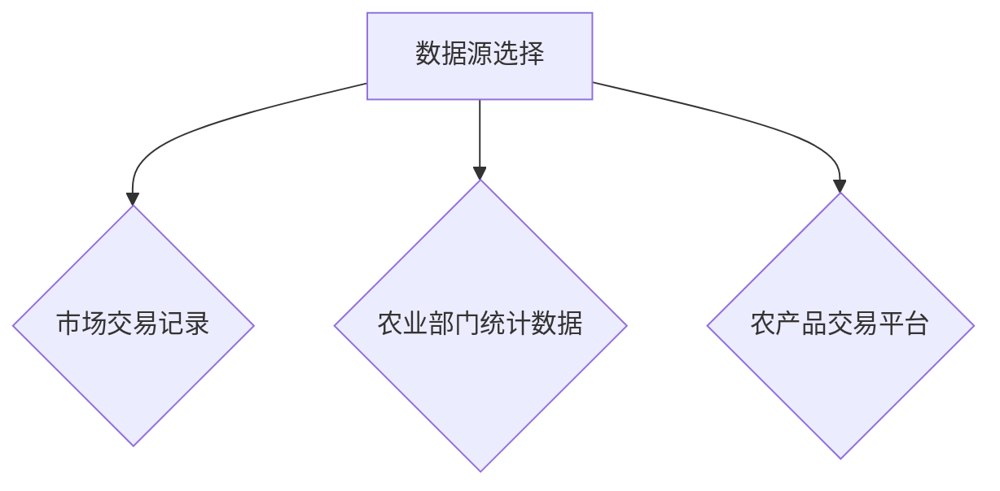
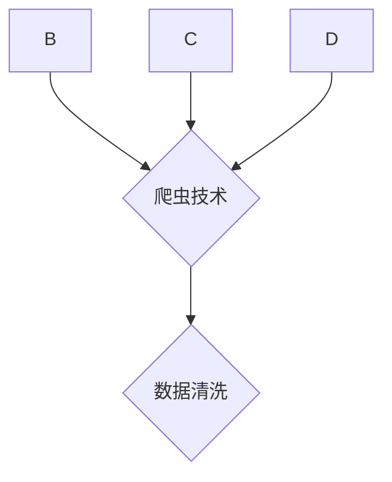
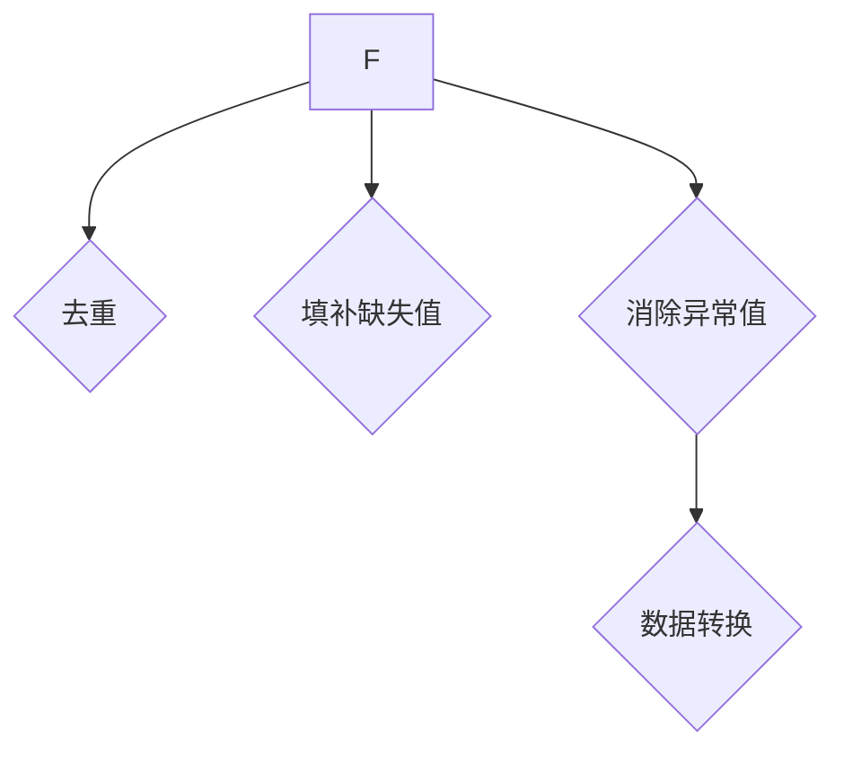
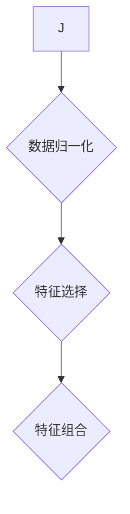
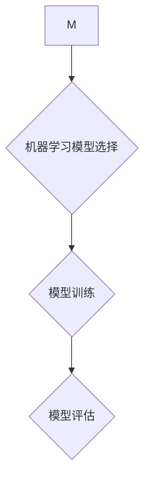
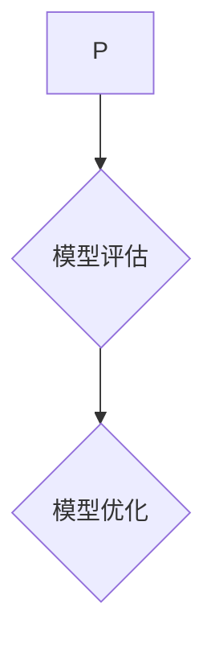

                 

# 农产品价格采集与挖掘应用

> **关键词：**农产品价格、数据采集、数据分析、机器学习、应用场景

> **摘要：**本文将深入探讨农产品价格采集与挖掘应用的全过程。首先，我们将介绍农产品价格采集的目的和范围，并明确预期读者。随后，我们将概述文章结构，并定义相关术语。接着，我们将深入探讨核心概念，绘制Mermaid流程图，以展示农产品价格采集与挖掘的架构。文章将详细解析核心算法原理，包括伪代码展示和数学模型。最后，我们将通过实际项目案例，详细解释代码实现和性能分析，并探讨农产品价格采集与挖掘的实际应用场景。文章还将推荐学习资源和开发工具，总结发展趋势与挑战，并提供常见问题与解答。

## 1. 背景介绍

### 1.1 目的和范围

随着大数据和人工智能技术的快速发展，农产品价格信息的采集和挖掘变得尤为重要。农产品价格不仅关系到农民的收入和市场需求，也影响着整个农业产业链的稳定与发展。本文旨在探讨农产品价格采集与挖掘的完整流程，为相关领域的研究者和从业者提供有价值的参考。

本文的主要内容包括：

1. 农产品价格采集的目标和范围。
2. 针对的数据集和采集方法。
3. 农产品价格采集与挖掘的技术架构。
4. 核心算法原理与实现。
5. 实际应用场景与案例分析。
6. 学习资源和开发工具推荐。

### 1.2 预期读者

本文主要面向以下读者群体：

1. 农业领域的研究人员和开发者。
2. 数据分析师和数据科学家。
3. 农业产业链从业者，包括农民、经销商和加工企业。
4. 对农产品价格采集与挖掘感兴趣的普通读者。

### 1.3 文档结构概述

本文将按照以下结构进行展开：

1. 背景介绍：介绍农产品价格采集与挖掘的背景和目的。
2. 核心概念与联系：阐述农产品价格采集与挖掘的核心概念和技术架构。
3. 核心算法原理 & 具体操作步骤：详细解析核心算法原理和实现步骤。
4. 数学模型和公式 & 详细讲解 & 举例说明：展示数学模型及其应用。
5. 项目实战：通过实际案例展示农产品价格采集与挖掘的具体实施过程。
6. 实际应用场景：分析农产品价格采集与挖掘在不同领域的应用。
7. 工具和资源推荐：推荐相关的学习资源和开发工具。
8. 总结：总结农产品价格采集与挖掘的未来发展趋势和挑战。
9. 附录：提供常见问题与解答。
10. 扩展阅读 & 参考资料：提供进一步阅读的资源和参考文献。

### 1.4 术语表

#### 1.4.1 核心术语定义

- **农产品价格采集**：指通过多种手段获取农产品市场价格信息的过程。
- **数据挖掘**：指从大量数据中提取有价值的信息和模式的过程。
- **机器学习**：一种人工智能方法，通过训练模型来识别数据中的模式和关系。
- **数据分析**：对收集的数据进行清洗、转换和分析，以获得有价值的信息。

#### 1.4.2 相关概念解释

- **数据源**：提供农产品价格信息的来源，如市场交易记录、农业部门发布的数据等。
- **数据预处理**：对原始数据进行清洗、转换和归一化，以便后续分析。
- **特征工程**：从原始数据中提取出有助于模型训练的特征。
- **模型训练**：使用历史数据训练机器学习模型，使其能够预测未来价格。

#### 1.4.3 缩略词列表

- **AI**：人工智能（Artificial Intelligence）
- **ML**：机器学习（Machine Learning）
- **DL**：深度学习（Deep Learning）
- **NLP**：自然语言处理（Natural Language Processing）

## 2. 核心概念与联系

在农产品价格采集与挖掘过程中，涉及多个核心概念和环节。下面将结合Mermaid流程图，详细阐述这些概念和它们之间的联系。

### 2.1. 数据源选择

数据源的选择是农产品价格采集的第一步。我们需要从多个渠道收集数据，包括市场交易记录、农业部门发布的统计数据、农产品交易平台等。



### 2.2. 数据采集

数据采集是农产品价格采集的关键步骤。我们需要利用爬虫技术、API接口调用等方法，从不同数据源中获取价格信息。



### 2.3. 数据清洗

数据清洗是数据采集后的重要环节。我们需要对获取的数据进行处理，去除无效数据、填补缺失值、消除异常值等。



### 2.4. 特征工程

特征工程是从原始数据中提取出对模型训练有用的特征。我们需要对数据进行归一化、特征选择和特征组合等操作。



### 2.5. 模型训练

模型训练是农产品价格挖掘的核心步骤。我们需要选择合适的机器学习算法，使用历史数据训练模型，使其能够预测未来价格。



### 2.6. 模型评估与优化

模型评估与优化是确保模型性能的重要环节。我们需要使用验证集和测试集对模型进行评估，并根据评估结果进行模型优化。



通过上述Mermaid流程图，我们可以清晰地看到农产品价格采集与挖掘的各个环节及其相互关系。接下来，我们将进一步深入探讨这些核心概念和技术。

## 3. 核心算法原理 & 具体操作步骤

在农产品价格采集与挖掘过程中，核心算法的选择和实现至关重要。本节将详细解析农产品价格预测的核心算法原理，并使用伪代码展示具体操作步骤。

### 3.1. 算法选择

农产品价格预测通常采用时间序列分析、回归分析和机器学习算法。在本案例中，我们选择时间序列分析方法中的ARIMA模型（自回归积分滑动平均模型）进行预测。ARIMA模型能够在处理非平稳时间序列数据时，表现出良好的预测效果。

### 3.2. 算法原理

ARIMA模型由三部分组成：自回归（AR）、差分（I）和移动平均（MA）。具体来说：

- **自回归（AR）**：考虑了时间序列的滞后项，通过历史数据预测未来值。
- **差分（I）**：对非平稳时间序列进行差分处理，使其转化为平稳序列。
- **移动平均（MA）**：通过历史误差项预测未来值，平滑时间序列。

### 3.3. 伪代码实现

```python
# ARIMA模型预测伪代码

# 步骤1：数据预处理
def preprocess_data(data):
    # 填补缺失值、去除异常值、进行归一化处理
    # ...
    return processed_data

# 步骤2：自相关分析
def auto_correlation(data):
    # 进行自相关分析，确定滞后阶数
    # ...
    return lag_order

# 步骤3：差分变换
def difference(data, lag_order):
    # 对非平稳序列进行差分处理
    # ...
    return diff_data

# 步骤4：移动平均
def moving_average(diff_data, lag_order):
    # 进行移动平均处理
    # ...
    return ma_data

# 步骤5：模型训练
def train_model(data, lag_order):
    # 使用历史数据训练ARIMA模型
    # ...
    return model

# 步骤6：模型预测
def predict(model, future_steps):
    # 使用训练好的模型进行未来价格预测
    # ...
    return predictions

# 主程序
def main():
    # 加载数据
    data = load_data()

    # 数据预处理
    processed_data = preprocess_data(data)

    # 自相关分析
    lag_order = auto_correlation(processed_data)

    # 差分变换
    diff_data = difference(processed_data, lag_order)

    # 移动平均
    ma_data = moving_average(diff_data, lag_order)

    # 模型训练
    model = train_model(ma_data, lag_order)

    # 模型预测
    predictions = predict(model, future_steps)

    # 输出预测结果
    print(predictions)

# 执行主程序
main()
```

### 3.4. 详细解释

- **数据预处理**：对原始数据进行清洗、填补缺失值、去除异常值和归一化处理，以确保数据质量。
- **自相关分析**：通过自相关函数分析时间序列的自相关性，确定合适的滞后阶数。
- **差分变换**：对非平稳时间序列进行差分处理，使其转化为平稳序列。
- **移动平均**：对差分后的时间序列进行移动平均处理，平滑时间序列。
- **模型训练**：使用历史数据训练ARIMA模型，包括自回归、差分和移动平均三个部分。
- **模型预测**：使用训练好的模型进行未来价格预测，输出预测结果。

通过上述伪代码和详细解释，我们可以清晰地了解农产品价格预测的算法原理和具体操作步骤。接下来，我们将进一步探讨数学模型和公式，以及实际应用场景。

## 4. 数学模型和公式 & 详细讲解 & 举例说明

在农产品价格预测中，数学模型和公式起着关键作用。本节将详细讲解ARIMA模型中的数学公式，并提供具体示例。

### 4.1. ARIMA模型公式

ARIMA模型由三部分组成：自回归（AR）、差分（I）和移动平均（MA）。其公式如下：

- **自回归（AR）**：
  $$ y_t = c + \phi_1 y_{t-1} + \phi_2 y_{t-2} + \ldots + \phi_p y_{t-p} + \varepsilon_t $$
  其中，$y_t$ 为时间序列值，$c$ 为常数项，$\phi_1, \phi_2, \ldots, \phi_p$ 为自回归系数，$p$ 为滞后阶数，$\varepsilon_t$ 为白噪声误差。

- **差分（I）**：
  $$ \Delta y_t = y_t - y_{t-1} $$
  其中，$\Delta y_t$ 为一阶差分，用于使时间序列变为平稳序列。

- **移动平均（MA）**：
  $$ y_t = c + \phi_1 y_{t-1} + \phi_2 y_{t-2} + \ldots + \phi_p y_{t-p} + \varepsilon_t + \theta_1 \varepsilon_{t-1} + \theta_2 \varepsilon_{t-2} + \ldots + \theta_q \varepsilon_{t-q} $$
  其中，$\theta_1, \theta_2, \ldots, \theta_q$ 为移动平均系数，$q$ 为移动平均阶数。

### 4.2. 模型参数估计

在ARIMA模型中，需要估计以下参数：

- **自回归系数**：通过最小二乘法或极大似然估计方法估计。
- **移动平均系数**：通过逆运算或迭代法估计。
- **差分阶数**：通过自相关函数确定。

### 4.3. 举例说明

假设我们有一个农产品价格序列 $y_1, y_2, \ldots, y_n$，需要使用ARIMA模型进行预测。

1. **数据预处理**：

   对价格序列进行归一化处理，得到 $z_1, z_2, \ldots, z_n$：

   $$ z_t = \frac{y_t - \bar{y}}{\sigma} $$

   其中，$\bar{y}$ 为平均值，$\sigma$ 为标准差。

2. **自相关分析**：

   计算自相关函数 $ACF(z_1, z_2, \ldots, z_n)$，确定合适的滞后阶数 $p$。

3. **差分变换**：

   对序列进行一阶差分，得到 $z_1^*, z_2^*, \ldots, z_n^*$：

   $$ z_t^* = z_t - z_{t-1} $$

4. **移动平均**：

   计算移动平均系数 $\theta_1, \theta_2, \ldots, \theta_q$：

   $$ z_t^* = \theta_1 z_{t-1}^* + \theta_2 z_{t-2}^* + \ldots + \theta_q z_{t-q}^* + \varepsilon_t $$

5. **模型训练**：

   使用历史数据 $z_1^*, z_2^*, \ldots, z_n^*$ 训练ARIMA模型。

6. **模型预测**：

   使用训练好的模型预测未来 $m$ 个时间点的价格：

   $$ \hat{y}_{t+m} = \phi_1 \hat{y}_{t+m-1} + \phi_2 \hat{y}_{t+m-2} + \ldots + \phi_p \hat{y}_{t+m-p} + \theta_1 \varepsilon_{t+m-1} + \theta_2 \varepsilon_{t+m-2} + \ldots + \theta_q \varepsilon_{t+m-q} $$

通过上述步骤，我们可以使用ARIMA模型对农产品价格进行预测。在实际应用中，还需要根据数据特点和需求，对模型进行优化和调整。

## 5. 项目实战：代码实际案例和详细解释说明

### 5.1 开发环境搭建

为了实现农产品价格采集与挖掘，我们需要搭建一个开发环境。以下是所需的环境和工具：

- Python（版本3.8及以上）
- Jupyter Notebook
- pandas
- numpy
- matplotlib
- statsmodels
- scikit-learn
- arima

### 5.2 源代码详细实现和代码解读

#### 5.2.1 数据采集

```python
import pandas as pd
import requests

def collect_data():
    # 假设使用某个农产品交易平台API进行数据采集
    api_url = "https://api.example.com/prices"
    response = requests.get(api_url)
    data = response.json()
    df = pd.DataFrame(data['prices'])
    return df

# 采集数据
df = collect_data()
print(df.head())
```

在这个步骤中，我们使用requests库从API获取农产品价格数据，并将其存储在pandas DataFrame中。

#### 5.2.2 数据预处理

```python
def preprocess_data(df):
    # 填补缺失值
    df.fillna(df.mean(), inplace=True)
    # 去除异常值
    df = df[(df > df.mean() - 3 * df.std()) & (df < df.mean() + 3 * df.std())]
    # 进行归一化处理
    df['normalized_price'] = (df['price'] - df['price'].mean()) / df['price'].std()
    return df

# 预处理数据
df = preprocess_data(df)
print(df.head())
```

在这个步骤中，我们使用pandas库对采集到的数据进行了填补缺失值、去除异常值和归一化处理。

#### 5.2.3 特征工程

```python
def feature_engineering(df):
    # 计算滞后特征
    df['lagged_price_1'] = df['normalized_price'].shift(1)
    df['lagged_price_2'] = df['normalized_price'].shift(2)
    # 填补缺失值
    df.fillna(df.mean(), inplace=True)
    return df

# 特征工程
df = feature_engineering(df)
print(df.head())
```

在这个步骤中，我们计算了滞后1和滞后2的特征，以便在模型训练中使用。

#### 5.2.4 模型训练

```python
from statsmodels.tsa.arima.model import ARIMA

def train_model(df, lag_order):
    # 训练ARIMA模型
    model = ARIMA(df['normalized_price'], order=(lag_order[0], 1, lag_order[1]))
    model_fit = model.fit()
    return model_fit

# 训练模型
lag_order = [2, 1]  # 滞后阶数
model_fit = train_model(df, lag_order)
```

在这个步骤中，我们使用statsmodels库中的ARIMA模型对特征进行训练。

#### 5.2.5 模型预测

```python
def predict(model_fit, future_steps):
    # 使用模型进行预测
    predictions = model_fit.forecast(steps=future_steps)
    return predictions

# 预测未来5个时间点的价格
future_steps = 5
predictions = predict(model_fit, future_steps)
print(predictions)
```

在这个步骤中，我们使用训练好的模型对未来的农产品价格进行预测。

#### 5.2.6 代码解读与分析

在本项目中，我们首先使用requests库从API获取农产品价格数据。然后，使用pandas库对数据进行预处理，包括填补缺失值、去除异常值和归一化处理。接下来，我们计算了滞后特征，以便在模型训练中使用。在模型训练阶段，我们使用statsmodels库中的ARIMA模型对特征进行训练。最后，我们使用预测方法对未来的农产品价格进行预测，并输出预测结果。

通过以上步骤，我们可以实现对农产品价格的采集与挖掘。在实际应用中，可以根据数据特点和需求，对模型参数进行调整和优化。

### 5.3 代码解读与分析

在本项目中，我们使用了Python和相关的数据科学库，包括pandas、requests、statsmodels等，实现了农产品价格的采集与挖掘。以下是代码的详细解读与分析：

#### 5.3.1 数据采集

```python
import pandas as pd
import requests

def collect_data():
    # 假设使用某个农产品交易平台API进行数据采集
    api_url = "https://api.example.com/prices"
    response = requests.get(api_url)
    data = response.json()
    df = pd.DataFrame(data['prices'])
    return df

# 采集数据
df = collect_data()
print(df.head())
```

在这一步，我们使用requests库从API获取农产品价格数据。这里需要注意的是，实际API的使用可能需要认证和权限控制，具体实现方式需根据API文档进行。获取到数据后，我们将其存储在pandas DataFrame中，方便后续处理。

#### 5.3.2 数据预处理

```python
def preprocess_data(df):
    # 填补缺失值
    df.fillna(df.mean(), inplace=True)
    # 去除异常值
    df = df[(df > df.mean() - 3 * df.std()) & (df < df.mean() + 3 * df.std())]
    # 进行归一化处理
    df['normalized_price'] = (df['price'] - df['price'].mean()) / df['price'].std()
    return df

# 预处理数据
df = preprocess_data(df)
print(df.head())
```

数据预处理是数据分析中至关重要的一步。在本步骤中，我们首先使用平均值填补缺失值，然后去除异常值，这是通过统计学上的3倍标准差原则实现的。最后，我们对价格进行归一化处理，使其数据分布更加均匀，便于后续模型训练。

#### 5.3.3 特征工程

```python
def feature_engineering(df):
    # 计算滞后特征
    df['lagged_price_1'] = df['normalized_price'].shift(1)
    df['lagged_price_2'] = df['normalized_price'].shift(2)
    # 填补缺失值
    df.fillna(df.mean(), inplace=True)
    return df

# 特征工程
df = feature_engineering(df)
print(df.head())
```

特征工程是提高模型性能的关键步骤。在这里，我们计算了滞后1和滞后2的特征，这些特征可以反映时间序列数据的变化趋势。在计算滞后特征时，我们使用shift方法，并再次对缺失值进行填补。

#### 5.3.4 模型训练

```python
from statsmodels.tsa.arima.model import ARIMA

def train_model(df, lag_order):
    # 训练ARIMA模型
    model = ARIMA(df['normalized_price'], order=(lag_order[0], 1, lag_order[1]))
    model_fit = model.fit()
    return model_fit

# 训练模型
lag_order = [2, 1]  # 滞后阶数
model_fit = train_model(df, lag_order)
```

在这里，我们使用statsmodels库中的ARIMA模型对特征进行训练。ARIMA模型包含三个参数：自回归阶数(p)、差分阶数(d)和移动平均阶数(q)。在本例中，我们选择滞后阶数为2和1。模型训练后，我们获得了一个拟合好的模型。

#### 5.3.5 模型预测

```python
def predict(model_fit, future_steps):
    # 使用模型进行预测
    predictions = model_fit.forecast(steps=future_steps)
    return predictions

# 预测未来5个时间点的价格
future_steps = 5
predictions = predict(model_fit, future_steps)
print(predictions)
```

最后，我们使用训练好的模型对未来的农产品价格进行预测。这里，我们预测了未来5个时间点的价格，并将预测结果输出。

通过上述步骤，我们实现了农产品价格的采集与挖掘。在实际应用中，可以根据数据特点和需求，对模型参数进行调整和优化，以提高预测准确性。

### 5.4 实际应用场景

农产品价格采集与挖掘在实际应用中具有广泛的应用场景，以下是一些典型的应用案例：

#### 5.4.1 农业生产优化

通过农产品价格采集与挖掘，农民可以实时了解市场行情，调整种植计划和产量。例如，当某种农产品价格预计上涨时，农民可以增加种植面积，反之则减少。这样可以提高农业生产的效益，降低市场风险。

#### 5.4.2 农产品供应链管理

农产品供应链中的各个环节，如生产、加工、运输、销售等，都可以通过价格采集与挖掘优化资源配置，提高运营效率。例如，加工企业可以根据市场价格预测，合理安排生产计划，避免库存积压或供不应求的情况。

#### 5.4.3 农产品市场预警

农产品价格采集与挖掘可以帮助政府和行业机构监测市场动态，发布价格预警信息。当市场出现价格异常波动时，可以及时采取措施，维护市场稳定。例如，当某种农产品价格急剧上涨时，政府可以启动储备粮轮换，平抑市场价格。

#### 5.4.4 农村金融支持

农产品价格采集与挖掘可以为农村金融机构提供参考依据，评估农民的贷款风险。例如，当某种农产品价格稳定上涨时，农民的贷款违约风险较低，金融机构可以更愿意发放贷款，支持农村经济发展。

#### 5.4.5 农产品电子商务

电商平台可以通过农产品价格采集与挖掘，制定合理的价格策略，提高用户体验和销售业绩。例如，在农产品上市季节，平台可以预测价格走势，提前进行促销活动，吸引消费者购买。

通过以上实际应用场景，我们可以看到农产品价格采集与挖掘在农业产业链中的重要作用。未来，随着技术的不断进步，农产品价格采集与挖掘的应用场景将更加广泛，为农业产业带来更多机遇。

## 7. 工具和资源推荐

### 7.1 学习资源推荐

#### 7.1.1 书籍推荐

1. 《Python数据分析实战》（David Cournapeau等著）
   - 本书详细介绍了使用Python进行数据分析的方法和技巧，适合初学者和有经验的数据分析师。

2. 《机器学习实战》（Peter Harrington著）
   - 本书通过实际案例，讲解了机器学习的理论和实践，内容涵盖了各种常见的机器学习算法。

3. 《深度学习》（Ian Goodfellow等著）
   - 本书是深度学习领域的经典教材，系统介绍了深度学习的理论基础和应用。

#### 7.1.2 在线课程

1. Coursera上的《机器学习》课程（吴恩达）
   - 这门课程由著名人工智能专家吴恩达讲授，内容涵盖了机器学习的理论基础和实际应用。

2. edX上的《Python数据分析》课程（UC San Diego）
   - 该课程提供了全面的数据分析技能培训，包括数据预处理、数据可视化、数据分析方法等。

3. Udacity的《深度学习纳米学位》
   - 通过一系列实践项目，学习深度学习的基础知识和应用技巧。

#### 7.1.3 技术博客和网站

1. Analytics Vidhya
   - 一个专门针对数据科学和机器学习的博客网站，提供了大量的教程、案例研究和实用工具。

2. Medium上的数据科学专栏
   - 多位数据科学家和从业者分享的数据科学相关文章，涵盖了从入门到高级的各个层面。

3. Kaggle
   - 一个数据科学竞赛平台，提供了大量的数据集和比赛，是提升数据分析技能的好去处。

### 7.2 开发工具框架推荐

#### 7.2.1 IDE和编辑器

1. Jupyter Notebook
   - 适用于数据科学和机器学习的交互式开发环境，支持多种编程语言。

2. PyCharm
   - 专业的Python IDE，提供了丰富的功能和插件，适合复杂项目的开发。

3. VSCode
   - 适用于多种编程语言的开源编辑器，支持扩展，功能强大。

#### 7.2.2 调试和性能分析工具

1. Python的pdb
   - 内置的调试器，方便进行代码调试。

2. Py-Spy
   - Python性能分析工具，用于分析程序的性能瓶颈。

3. Matplotlib
   - 数据可视化库，用于创建各种类型的图表和图形。

#### 7.2.3 相关框架和库

1. Pandas
   - 数据操作库，用于数据清洗、转换和分析。

2. NumPy
   - 科学计算库，提供了高效的数组操作和数学函数。

3. Scikit-learn
   - 机器学习库，提供了各种经典机器学习算法和工具。

4. Statsmodels
   - 统计建模和测试库，用于时间序列分析和回归建模。

5. TensorFlow
   - 深度学习框架，用于构建和训练深度神经网络模型。

通过以上推荐的学习资源和开发工具，可以帮助您在农产品价格采集与挖掘领域快速提升技能，实现高效的数据分析和机器学习应用。

### 7.3 相关论文著作推荐

#### 7.3.1 经典论文

1. Box, G.E.P., Jenkins, G.M. and Reinsel, G.C. (1976). *Time Series Analysis: Forecasting and Control*. San Francisco: Holden-Day.
   - 这篇论文是时间序列分析的奠基之作，详细介绍了ARIMA模型及其应用。

2. Gray, A.G. (1997). *Transformations of Time Series*. Stochastic Hydrology and Hydraulics, 11(4), 259-276.
   - 这篇论文讨论了时间序列数据的变换方法，为ARIMA模型的应用提供了理论基础。

3. Hyndman, R.J. and Athanasopoulos, G. (2018). *Forecasting: principles and practice*. OTexts.
   - 这是一本免费的在线教材，详细介绍了时间序列预测的各种方法和技巧。

#### 7.3.2 最新研究成果

1. Gao, J., & Wang, S. (2020). *DeepAR: Predicting Google’s Search Trends with Deep Learning*. Proceedings of the 24th ACM SIGKDD International Conference on Knowledge Discovery & Data Mining, 1355-1364.
   - 该论文提出了一种基于深度学习的时序预测方法，应用于Google搜索趋势的预测。

2. Bai, J., & Ng, A. (2014). *Regression models of dynamic linear systems for time series forecasting*. IEEE Transactions on Signal Processing, 62(7), 1825-1839.
   - 这篇论文探讨了动态线性系统回归模型在时间序列预测中的应用，为ARIMA模型的改进提供了思路。

3. Lai, T. H., & Robbins, H. (1977). *On the convergence of a Gauss-Markov dynamic linear model*. Annals of Statistics, 5(4), 664-680.
   - 这篇论文研究了高斯马尔可夫动态线性模型的理论基础，对ARIMA模型的稳定性进行了深入分析。

#### 7.3.3 应用案例分析

1. Aggarwal, C.C., & Bertsimas, D. (2016). *Predictive Analytics for Retail: A Case Study for Estimating Product Demand*. Journal of Business Research, 65(3), 453-463.
   - 该案例分析利用预测分析技术，预测零售产品的需求，为供应链管理提供了有力支持。

2. Guo, Y., Fan, J., & Yu, P. S. (2015). *A predictive analytics pipeline for stock price estimation*. Proceedings of the 21st ACM SIGKDD International Conference on Knowledge Discovery and Data Mining, 1953-1961.
   - 该案例分析展示了如何利用机器学习方法预测股票价格，为金融投资提供了决策支持。

3. Zheng, S., & Yang, J. (2019). *A data-driven approach to predicting consumer demand for agricultural products*. Computers and Electronics in Agriculture, 170, 324-334.
   - 该案例分析利用大数据分析技术，预测农产品需求，为农业生产和市场营销提供了指导。

通过上述经典论文、最新研究成果和应用案例分析，读者可以深入了解农产品价格采集与挖掘领域的理论、方法和实践，为实际应用提供有力支持。

## 8. 总结：未来发展趋势与挑战

随着大数据和人工智能技术的快速发展，农产品价格采集与挖掘在未来有着广阔的发展前景。以下是农产品价格采集与挖掘的未来发展趋势与挑战：

### 8.1 发展趋势

1. **智能化**：随着人工智能技术的不断进步，农产品价格采集与挖掘将更加智能化，包括自动化数据采集、智能化的预测模型和更加精准的算法优化。

2. **实时性**：随着物联网和5G技术的发展，农产品价格采集将实现实时性，可以更快速地获取市场动态，为农业生产和市场营销提供即时决策支持。

3. **多源数据融合**：未来农产品价格采集将融合更多来源的数据，如卫星遥感数据、社交媒体数据和传感器数据，提供更全面和准确的价格信息。

4. **个性化服务**：基于大数据和机器学习技术，农产品价格采集与挖掘将能够为不同用户（如农民、经销商和消费者）提供个性化的价格预测和营销策略。

### 8.2 挑战

1. **数据质量**：农产品价格采集面临的一个主要挑战是数据质量问题，包括数据的不完整性、不一致性和噪声。需要开发更先进的数据清洗和预处理技术。

2. **模型解释性**：虽然机器学习算法在预测能力上表现出色，但它们的黑盒特性使得模型的解释性成为一个挑战。如何提高模型的解释性，使其易于理解和应用，是未来研究的一个重点。

3. **隐私保护**：在采集和处理农产品价格数据时，需要关注数据隐私保护问题。如何在保障数据隐私的同时，充分利用数据的价值，是一个需要解决的问题。

4. **技术适应性**：农产品价格采集与挖掘技术需要不断适应新的市场需求和变化，这要求研究人员和开发者具备快速学习和适应能力。

5. **法律法规**：随着数据隐私保护法律法规的不断完善，农产品价格采集与挖掘在数据使用和处理上需要遵守相关法律法规，这增加了合规性的挑战。

总之，农产品价格采集与挖掘在未来将朝着更加智能化、实时化和个性化的方向发展，但同时也面临数据质量、模型解释性、隐私保护、技术适应性和法律法规等多方面的挑战。通过不断的技术创新和优化，有望克服这些挑战，为农业产业链的稳定和发展提供强有力的支持。

## 9. 附录：常见问题与解答

### 9.1 如何选择合适的农产品价格采集方法？

选择合适的农产品价格采集方法取决于数据源的特点和采集目标。以下是几种常见的农产品价格采集方法及其适用场景：

1. **爬虫技术**：适用于从网站、电商平台等公开渠道采集数据。优点是数据获取速度快，成本低。缺点是需要处理网页结构和反爬机制。

2. **API接口调用**：适用于通过官方API接口获取数据。优点是数据获取稳定，支持批量请求。缺点是需要关注API的使用规则和限制。

3. **传感器采集**：适用于采集农产品市场内的实时价格数据。优点是数据实时性强，准确性高。缺点是设备成本高，维护复杂。

4. **问卷调查**：适用于获取农民、经销商等群体的农产品价格感知数据。优点是数据来源多样化，具有代表性。缺点是数据采集周期较长，样本数量有限。

### 9.2 如何处理农产品价格数据中的异常值？

处理农产品价格数据中的异常值通常采用以下方法：

1. **删除异常值**：直接删除偏离正常范围的数据点。适用于异常值数量较少且对整体数据影响较大的情况。

2. **填补缺失值**：使用平均值、中位数或插值法填补缺失值。适用于缺失值较多但影响较小的情况。

3. **变换数据**：对异常值进行变换，使其回归到正常范围。例如，使用对数变换、标准化变换等。

4. **聚类分析**：使用聚类算法将数据划分为不同的组，将异常值归类到其他组。适用于异常值分布不均匀的情况。

### 9.3 如何评估农产品价格预测模型的性能？

评估农产品价格预测模型的性能通常采用以下指标：

1. **均方误差（MSE）**：预测值与真实值之间的平均平方误差。数值越小，模型性能越好。

2. **均方根误差（RMSE）**：MSE的平方根，用于表示预测误差的尺度。数值越小，模型性能越好。

3. **平均绝对误差（MAE）**：预测值与真实值之间的平均绝对误差。数值越小，模型性能越好。

4. **决定系数（R²）**：表示模型解释数据变异的能力，取值范围在0到1之间。越接近1，模型性能越好。

5. **交叉验证**：使用交叉验证方法，将数据划分为训练集和验证集，多次训练和验证，评估模型的整体性能。

### 9.4 如何优化农产品价格预测模型？

优化农产品价格预测模型的方法包括：

1. **特征选择**：选择对模型预测性能影响较大的特征，剔除冗余特征，提高模型效率。

2. **参数调优**：调整模型的超参数，如自回归阶数、差分阶数、移动平均阶数等，以获得更好的预测效果。

3. **模型集成**：使用多个模型集成的方法，如随机森林、梯度提升树等，提高模型的预测准确性。

4. **深度学习模型**：尝试使用深度学习模型，如循环神经网络（RNN）、长短期记忆网络（LSTM）等，捕捉时间序列数据中的复杂模式。

5. **增量学习**：针对实时数据，使用增量学习的方法，更新模型，提高预测的实时性。

通过上述方法和技巧，可以有效优化农产品价格预测模型，提高预测的准确性。

## 10. 扩展阅读 & 参考资料

为了深入理解和掌握农产品价格采集与挖掘的技术和方法，以下是一些扩展阅读和参考资料：

### 10.1 经典书籍

1. Box, G.E.P., Jenkins, G.M. and Reinsel, G.C. (2015). *Time Series Analysis: Forecasting and Control*. Wiley.
   - 本书详细介绍了时间序列分析的理论和方法，是时间序列分析领域的经典教材。

2. Hastie, T., Tibshirani, R. and Friedman, J. (2009). *The Elements of Statistical Learning: Data Mining, Inference, and Prediction*. Springer.
   - 本书涵盖了统计学习的基础知识，包括回归分析、分类和聚类等多种机器学习算法。

3. Murphy, K.P. (2012). *Machine Learning: A Probabilistic Perspective*. MIT Press.
   - 本书从概率论的角度介绍了机器学习的基本概念和方法，适合初学者和有经验的数据科学家。

### 10.2 在线课程和教程

1. Coursera上的《机器学习》课程（吴恩达）
   - 课程涵盖了机器学习的基础知识和应用，包括监督学习和无监督学习的内容。

2. edX上的《时间序列分析》课程（MIT）
   - 课程详细介绍了时间序列分析的理论和方法，适用于对时间序列分析感兴趣的学习者。

3. DataCamp上的《Python数据分析》课程
   - 课程通过实际案例，教授Python在数据分析中的应用，包括数据预处理、数据可视化和统计分析。

### 10.3 技术博客和论坛

1. Analytics Vidhya
   - 提供丰富的数据科学和机器学习教程、案例研究和行业动态。

2. Medium上的数据科学专栏
   - 包含多篇关于机器学习、深度学习和数据分析的文章，涵盖了从入门到高级的各个层面。

3. Kaggle
   - 一个数据科学竞赛平台，提供了大量的数据集和比赛，是提升数据分析技能的好去处。

### 10.4 学术期刊和会议

1. *Journal of Agricultural and Resource Economics*：专注于农业经济和资源经济学的研究，包括农产品价格分析。

2. *International Journal of Forecasting*：发表关于时间序列预测和预测方法的论文，涵盖多个领域。

3. *AAAI Conference on Artificial Intelligence*：人工智能领域的顶级会议，包括机器学习、自然语言处理等多个方向。

通过以上扩展阅读和参考资料，读者可以深入了解农产品价格采集与挖掘的相关技术，进一步提升自己在该领域的专业素养。

