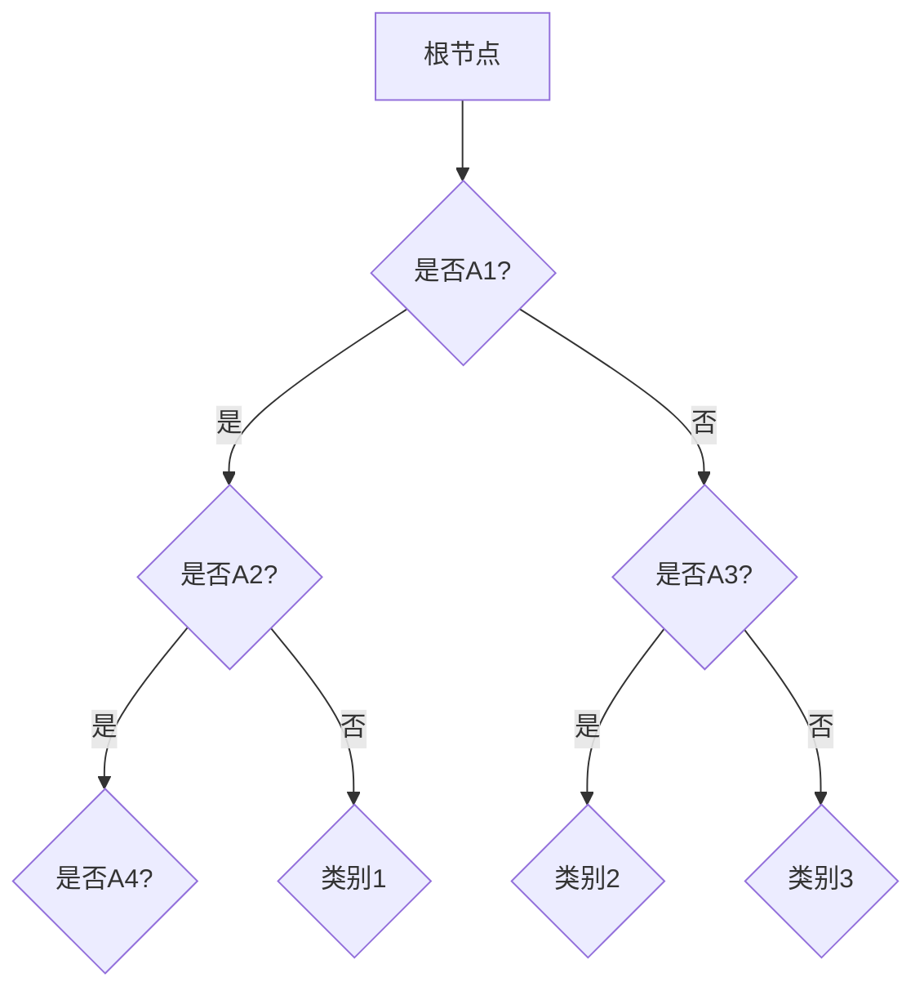

                 

### 1. 背景介绍

#### 1.1 目的和范围

本文旨在深入探讨决策树（Decision Tree）这一经典的数据挖掘和机器学习算法。我们将从其基本概念出发，逐步解析决策树的构建过程、核心算法原理以及其在实际项目中的应用。通过本文的阅读，读者将能够掌握决策树的基本原理，并具备在实际项目中应用决策树模型的能力。

本文将重点关注以下几个核心方面：

1. **决策树的定义和结构**：介绍决策树的基本概念，包括决策树的构建、节点划分以及属性选择方法。
2. **核心算法原理**：详细讲解决策树的构建算法，包括ID3、C4.5和C5.0等算法，并通过伪代码展示其实现过程。
3. **数学模型和公式**：解析决策树中的信息增益、信息增益率等数学概念，并使用LaTeX格式展示相关公式。
4. **项目实战**：通过实际代码案例，展示如何使用Python等编程语言实现决策树模型，并进行模型训练和预测。
5. **实际应用场景**：介绍决策树在分类和回归任务中的实际应用，分析其在不同场景下的优缺点。
6. **工具和资源推荐**：推荐学习资源、开发工具和框架，以帮助读者更好地理解和掌握决策树。

#### 1.2 预期读者

本文适合以下几类读者：

1. **初学者**：对决策树概念和算法有兴趣，希望通过本文深入了解决策树的原理和应用。
2. **数据分析师**：在数据分析工作中需要使用决策树模型，希望掌握决策树的核心算法和实际应用。
3. **机器学习从业者**：从事机器学习研究和应用，希望系统学习决策树等经典算法。
4. **程序员**：具备一定的编程基础，希望了解决策树的实现和优化方法。

#### 1.3 文档结构概述

本文将按照以下结构进行展开：

1. **背景介绍**：介绍决策树的定义、目的和范围，预期读者以及文档结构概述。
2. **核心概念与联系**：使用Mermaid流程图展示决策树的基本概念和结构，帮助读者建立整体认知。
3. **核心算法原理 & 具体操作步骤**：详细讲解决策树的构建算法，使用伪代码展示算法实现过程。
4. **数学模型和公式 & 详细讲解 & 举例说明**：解析决策树中的数学概念，使用LaTeX格式展示相关公式，并通过实例进行说明。
5. **项目实战：代码实际案例和详细解释说明**：通过实际代码案例，展示决策树模型在项目中的应用，并进行详细解释和分析。
6. **实际应用场景**：分析决策树在分类和回归任务中的实际应用，讨论其优缺点。
7. **工具和资源推荐**：推荐学习资源、开发工具和框架，以帮助读者更好地理解和掌握决策树。
8. **总结：未来发展趋势与挑战**：总结决策树的研究现状和未来发展趋势，讨论面临的挑战。
9. **附录：常见问题与解答**：回答读者可能关心的问题，提供实用的建议。
10. **扩展阅读 & 参考资料**：推荐相关文献和资料，以供读者进一步学习和研究。

#### 1.4 术语表

在本文中，我们将使用以下术语：

**决策树（Decision Tree）**：一种树形结构，用于对数据进行分类或回归。树中的每个节点代表一个属性，每个分支代表一个属性值。

**特征（Feature）**：用于描述数据的属性或特征。

**训练集（Training Set）**：用于训练决策树模型的数据集。

**测试集（Test Set）**：用于评估决策树模型性能的数据集。

**分类（Classification）**：将数据划分为不同的类别。

**回归（Regression）**：预测一个连续值。

**信息增益（Information Gain）**：用于评估属性对分类的贡献程度。

**熵（Entropy）**：用于衡量数据的混乱程度。

**基尼指数（Gini Index）**：用于评估属性划分的纯度。

**C4.5算法**：一种基于信息增益率的决策树构建算法。

**ID3算法**：一种基于信息增益的决策树构建算法。

**叶节点（Leaf Node）**：决策树中的最终节点，表示分类结果。

**内部节点（Internal Node）**：决策树中的中间节点，用于划分数据。

**剪枝（Pruning）**：一种优化决策树的方法，用于减少过拟合。

**交叉验证（Cross-Validation）**：一种评估模型性能的方法，通过将数据集划分为训练集和验证集，多次训练和验证模型。

#### 1.4.1 核心术语定义

- **决策树（Decision Tree）**：决策树是一种树形结构，用于对数据进行分类或回归。树中的每个节点代表一个属性，每个分支代表一个属性值。决策树的构建过程是基于属性选择和节点划分来实现的。
- **特征（Feature）**：特征是用于描述数据的属性或特征。在决策树中，特征是节点划分的依据，用于对数据进行分类或回归。
- **训练集（Training Set）**：训练集是用于训练决策树模型的数据集。决策树模型通过在训练集上的训练来学习数据的特点和规律。
- **测试集（Test Set）**：测试集是用于评估决策树模型性能的数据集。测试集用于验证模型在未知数据上的性能，以评估模型的泛化能力。

#### 1.4.2 相关概念解释

- **分类（Classification）**：分类是将数据划分为不同的类别。在决策树中，分类是通过节点划分和叶节点表示来实现的。每个节点代表一个属性，每个分支代表一个属性值。最终，叶节点表示分类结果。
- **回归（Regression）**：回归是预测一个连续值。与分类不同，回归的目标是预测一个数值，而不是类别。在决策树中，回归是通过节点划分和叶节点表示来实现的，叶节点表示预测结果。
- **信息增益（Information Gain）**：信息增益是用于评估属性对分类的贡献程度。信息增益通过比较属性划分前后的熵变化来计算，熵表示数据的混乱程度。信息增益越高，表示属性对分类的贡献越大。
- **熵（Entropy）**：熵是用于衡量数据的混乱程度。熵的值范围在0到1之间，值越接近0表示数据越混乱，值越接近1表示数据越有序。在决策树中，熵用于评估属性划分的效果。

#### 1.4.3 缩略词列表

- **ID3**：Iterative Dichotomiser 3，一种基于信息增益的决策树构建算法。
- **C4.5**： Classification and Regression Tree，一种基于信息增益率的决策树构建算法。
- **C5.0**： Classification and Regression Tree，C4.5的升级版，引入了新的属性选择方法和剪枝技术。
- **MLC**： Multi-Layered Classifier，多层决策树模型，用于提高决策树的泛化能力。
- **OOB**： Out-Of-Bag，用于评估决策树模型性能的一种方法，通过使用训练数据的一部分作为测试集来实现。

### 1.4.4 决策树的分类和作用

决策树可以根据其应用场景分为分类树（Classification Tree）和回归树（Regression Tree）。分类树用于分类任务，即根据输入特征预测类标签；回归树用于回归任务，即预测连续值。两者在构建过程中有一些共同点，但也存在一些区别。

**分类树的作用**：

1. **分类预测**：分类树可以用于对未知数据进行分类预测，将数据划分为不同的类别。
2. **特征选择**：分类树可以帮助识别重要的特征，为后续的数据分析和特征工程提供参考。
3. **数据可视化**：分类树可以以树形结构展示，帮助用户理解分类过程和决策逻辑。

**回归树的作用**：

1. **回归预测**：回归树可以用于对未知数据进行回归预测，预测连续值。
2. **特征选择**：回归树可以帮助识别重要的特征，为后续的数据分析和特征工程提供参考。
3. **数据可视化**：回归树可以以树形结构展示，帮助用户理解回归过程和预测逻辑。

### 1.4.5 决策树的优缺点

**优点**：

1. **易于理解和解释**：决策树的树形结构直观地展示了分类或回归过程，用户可以轻松理解决策逻辑。
2. **适用于多种任务**：决策树可以用于分类和回归任务，具有较高的灵活性。
3. **可处理缺失值和异常值**：决策树可以根据属性划分和叶节点处理缺失值和异常值，提高了模型的鲁棒性。
4. **易于实现和扩展**：决策树的实现相对简单，可以方便地添加新属性或调整算法参数。

**缺点**：

1. **过拟合问题**：决策树容易过拟合，尤其是在数据量较小或特征较多的情况下。为了解决过拟合问题，可以使用剪枝技术或引入正则化方法。
2. **计算成本较高**：决策树的构建和训练过程涉及多次划分和计算，对于大规模数据集可能导致较高的计算成本。
3. **不适用于特征之间复杂关系**：决策树假设特征之间是独立且线性的，对于特征之间存在复杂关系的数据集，决策树的性能可能较差。

通过以上对决策树背景介绍的详细讲解，读者可以初步了解决策树的基本概念、应用场景以及优缺点。在接下来的部分，我们将进一步深入探讨决策树的构建过程、核心算法原理以及实际应用案例，帮助读者全面掌握决策树的相关知识。

## 2. 核心概念与联系

在深入探讨决策树之前，我们需要首先理解其核心概念和基本结构。决策树是一种基于特征选择和节点划分的树形结构，其目标是通过对输入特征的学习，对未知数据进行分类或回归。为了更好地理解决策树的工作原理，我们将使用Mermaid流程图展示决策树的基本概念和结构。

### Mermaid流程图展示

以下是一个简单的Mermaid流程图，用于展示决策树的基本结构：



在这个流程图中，每个节点代表一个特征或类别，每个分支代表一个特征值或类别标签。根节点表示整个数据集，通过一系列条件判断（例如：是否A1?），最终达到叶节点，表示最终的分类或回归结果。

### 决策树的基本概念和结构

1. **根节点（Root Node）**：决策树的根节点表示整个数据集，是决策树构建的起点。
2. **内部节点（Internal Node）**：内部节点表示特征或属性，用于划分数据集。每个内部节点有一个或多个分支，对应不同的特征值。
3. **叶节点（Leaf Node）**：叶节点表示分类或回归结果，是决策树的最终节点。在分类任务中，叶节点表示类别标签；在回归任务中，叶节点表示预测结果。

### 核心算法原理

决策树的构建过程涉及到以下核心算法原理：

1. **属性选择**：选择最优属性进行节点划分，常用的属性选择方法包括信息增益（Information Gain）和信息增益率（Information Gain Ratio）。
2. **节点划分**：根据选择的属性，将数据集划分为不同的子集，每个子集对应一个内部节点。
3. **递归构建**：递归地对子集进行划分和构建，直到满足停止条件（例如：叶节点数量达到阈值或最大深度达到限制）。

### 决策树的基本工作原理

决策树的工作原理如下：

1. **输入特征和样本**：给定一组输入特征和样本数据，决策树从根节点开始进行划分。
2. **条件判断**：在每个内部节点，根据特征值进行条件判断，将样本数据划分为不同的子集。
3. **递归构建**：对每个子集继续进行划分和构建，直到达到叶节点。
4. **分类或回归预测**：在叶节点处，根据类别标签或预测结果进行分类或回归预测。

### Mermaid流程图的详细解释

以Mermaid流程图为例，我们可以详细解释决策树的工作流程：

1. **根节点（A）**：表示整个数据集。
2. **内部节点（B）**：根据特征A1进行划分，将数据集划分为两个子集，一个包含A1=true的样本，另一个包含A1=false的样本。
3. **条件判断（B）**：对子集1继续划分，根据特征A2进行条件判断。如果A2=true，则划分为子集C；否则，划分为子集D。
4. **内部节点（C）**：对子集C继续划分，根据特征A4进行条件判断。如果A4=true，则划分为子集E；否则，划分为叶节点F，表示类别1。
5. **叶节点（F）**：表示最终的分类结果。
6. **内部节点（D）**：对子集D继续划分，根据特征A3进行条件判断。如果A3=true，则划分为子集G；否则，划分为叶节点H，表示类别2。
7. **叶节点（G）**：表示最终的分类结果。
8. **叶节点（H）**：表示最终的分类结果。

通过以上详细的解释，我们可以更好地理解决策树的基本概念和结构，以及其工作原理。在接下来的部分，我们将进一步深入探讨决策树的构建过程和核心算法原理，帮助读者全面掌握决策树的相关知识。

### 3. 核心算法原理 & 具体操作步骤

决策树的核心在于其构建算法，即如何选择属性进行节点划分，以最大化信息增益或信息增益率。下面，我们将详细讲解几种常见的决策树构建算法，包括ID3、C4.5和C5.0，并通过伪代码展示其实现过程。

#### 3.1 ID3算法

ID3（Iterative Dichotomiser 3）算法是一种基于信息增益的决策树构建算法。其核心思想是选择具有最大信息增益的属性进行节点划分。

**信息增益（Information Gain）**：

信息增益用于评估属性对分类的贡献程度。信息增益的计算公式为：

\[ IG(A) = Entropy(S) - \sum_{v \in A} \frac{|S_v|}{|S|} \cdot Entropy(S_v) \]

其中，\( S \) 表示数据集，\( A \) 表示属性，\( v \) 表示属性的不同值，\( S_v \) 表示属性值为 \( v \) 的数据子集，\( Entropy(S) \) 表示数据集 \( S \) 的熵。

**伪代码**：

```pseudo
ID3 Algorithm:
1. 如果当前节点是叶节点，返回
2. 否则：
    a. 计算所有属性的信息增益
    b. 选择具有最大信息增益的属性作为当前节点的划分属性
    c. 根据划分属性，将数据集划分为不同的子集
    d. 对每个子集递归调用ID3算法
```

#### 3.2 C4.5算法

C4.5算法是ID3算法的改进版本，其核心思想是选择具有最大信息增益率的属性进行节点划分。信息增益率（Information Gain Ratio）的计算公式为：

\[ Gini Ratio(A) = \frac{IG(A)}{Entropy(A)} \]

其中，\( IG(A) \) 表示信息增益，\( Entropy(A) \) 表示属性 \( A \) 的熵。

**伪代码**：

```pseudo
C4.5 Algorithm:
1. 如果当前节点是叶节点，返回
2. 否则：
    a. 计算所有属性的信息增益率
    b. 选择具有最大信息增益率的属性作为当前节点的划分属性
    c. 根据划分属性，将数据集划分为不同的子集
    d. 对每个子集递归调用C4.5算法
```

#### 3.3 C5.0算法

C5.0算法是C4.5算法的进一步改进，其核心思想是引入剪枝技术，以减少过拟合。C5.0算法使用一种称为“多变量测试”（Multi-Variable Test）的方法来选择最佳的划分属性。

**伪代码**：

```pseudo
C5.0 Algorithm:
1. 如果当前节点是叶节点，返回
2. 否则：
    a. 计算所有属性的多变量测试得分
    b. 选择具有最高多变量测试得分的属性作为当前节点的划分属性
    c. 根据划分属性，将数据集划分为不同的子集
    d. 对每个子集递归调用C5.0算法
    e. 应用剪枝技术，剪掉不重要的分支
```

#### 3.4 决策树构建步骤总结

1. **选择属性**：计算所有属性的信息增益、信息增益率或多变量测试得分，选择具有最高得分的属性作为当前节点的划分属性。
2. **划分数据集**：根据划分属性，将数据集划分为不同的子集。
3. **递归构建**：对每个子集递归调用决策树构建算法，直到满足停止条件（例如：叶节点数量达到阈值或最大深度达到限制）。
4. **剪枝**（可选）：对于C4.5和C5.0算法，应用剪枝技术，剪掉不重要的分支，以减少过拟合。

通过以上讲解和伪代码，我们可以清楚地理解决策树构建的核心算法原理和具体操作步骤。在接下来的部分，我们将进一步探讨决策树中的数学模型和公式，以帮助读者更深入地理解决策树的工作原理。

### 4. 数学模型和公式 & 详细讲解 & 举例说明

决策树算法的核心在于其对数据的划分和属性的评估，这涉及到一系列数学模型和公式的计算。以下，我们将详细讲解决策树中常用的几个数学概念，包括信息增益、信息增益率以及相关公式，并通过具体例子来说明这些公式的应用。

#### 4.1 熵（Entropy）

熵是衡量数据混乱程度的重要指标，用于评估一个属性的随机性。熵的计算公式如下：

\[ Entropy(S) = -\sum_{i} p_i \cdot \log_2(p_i) \]

其中，\( S \) 表示数据集，\( p_i \) 表示数据集中第 \( i \) 个类别的概率。

**例子**：假设有一个数据集，包含3个类别，各自的概率分别为 \( p_1 = 0.5 \)，\( p_2 = 0.3 \)，\( p_3 = 0.2 \)。则数据集的熵为：

\[ Entropy(S) = - (0.5 \cdot \log_2(0.5) + 0.3 \cdot \log_2(0.3) + 0.2 \cdot \log_2(0.2)) \approx 0.918 \]

#### 4.2 信息增益（Information Gain）

信息增益用于评估一个属性对分类的贡献程度，其计算公式为：

\[ IG(A) = Entropy(S) - \sum_{v \in A} \frac{|S_v|}{|S|} \cdot Entropy(S_v) \]

其中，\( A \) 表示属性，\( S \) 表示数据集，\( v \) 表示属性的不同值，\( S_v \) 表示属性值为 \( v \) 的数据子集。

**例子**：假设一个数据集包含两个属性 \( A \) 和 \( B \)，各自的类别概率如下表所示：

| 属性A | 属性B | 类别1 | 类别2 | 类别3 |
|-------|-------|-------|-------|-------|
| 0     | 0     | 0.3   | 0.2   | 0.5   |
| 0     | 1     | 0.2   | 0.4   | 0.4   |
| 1     | 0     | 0.1   | 0.5   | 0.4   |
| 1     | 1     | 0.2   | 0.3   | 0.5   |

首先计算数据集 \( S \) 的熵：

\[ Entropy(S) = - (0.5 \cdot \log_2(0.5) + 0.3 \cdot \log_2(0.3) + 0.2 \cdot \log_2(0.2)) \approx 0.918 \]

然后计算属性 \( A \) 的信息增益：

\[ IG(A) = Entropy(S) - \sum_{v \in A} \frac{|S_v|}{|S|} \cdot Entropy(S_v) \]

\[ IG(A) = 0.918 - (0.3 \cdot \log_2(0.3) + 0.2 \cdot \log_2(0.2) + 0.5 \cdot \log_2(0.5)) \approx 0.391 \]

同理，计算属性 \( B \) 的信息增益：

\[ IG(B) = 0.918 - (0.3 \cdot \log_2(0.3) + 0.4 \cdot \log_2(0.4) + 0.3 \cdot \log_2(0.3)) \approx 0.322 \]

因此，属性 \( A \) 的信息增益更高，应选择属性 \( A \) 进行节点划分。

#### 4.3 信息增益率（Information Gain Ratio）

信息增益率是对信息增益的一种改进，其目的是减少对具有更多类别属性的选择偏好。信息增益率的计算公式为：

\[ Gain Ratio(A) = \frac{IG(A)}{Split Information(A)} \]

其中，\( Split Information(A) \) 表示属性 \( A \) 的熵：

\[ Split Information(A) = - \sum_{v \in A} \frac{|S_v|}{|S|} \cdot \log_2 \left( \frac{|S_v|}{|S|} \right) \]

**例子**：使用上例中的数据集，计算属性 \( A \) 的信息增益率：

\[ Split Information(A) = - (0.3 \cdot \log_2(0.3) + 0.2 \cdot \log_2(0.2) + 0.5 \cdot \log_2(0.5)) \approx 0.721 \]

\[ Gain Ratio(A) = \frac{0.391}{0.721} \approx 0.545 \]

同理，计算属性 \( B \) 的信息增益率：

\[ Gain Ratio(B) = \frac{0.322}{0.721} \approx 0.445 \]

因此，属性 \( A \) 的信息增益率更高，应选择属性 \( A \) 进行节点划分。

#### 4.4 基尼指数（Gini Index）

基尼指数是一种评估属性划分纯度的指标，其计算公式为：

\[ Gini(S) = 1 - \sum_{i} p_i^2 \]

其中，\( S \) 表示数据集，\( p_i \) 表示数据集中第 \( i \) 个类别的概率。

**例子**：使用上例中的数据集，计算数据集 \( S \) 的基尼指数：

\[ Gini(S) = 1 - (0.5^2 + 0.3^2 + 0.2^2) = 0.48 \]

基尼指数越小，表示属性划分的纯度越高。

通过以上对熵、信息增益、信息增益率以及基尼指数的详细讲解和具体例子，我们可以更好地理解决策树中的数学模型和公式的应用。在接下来的部分，我们将通过实际项目案例，展示如何使用这些数学模型和公式来构建决策树，并进行模型训练和预测。

### 5. 项目实战：代码实际案例和详细解释说明

为了更好地理解决策树的构建过程和实际应用，我们将通过一个实际项目案例，展示如何使用Python等编程语言实现决策树模型，并进行模型训练和预测。我们将使用著名的机器学习库Scikit-learn来实现决策树，并详细解释代码中的每一步。

#### 5.1 开发环境搭建

在开始项目之前，我们需要搭建开发环境。首先，确保已经安装了Python，然后通过以下命令安装所需的库：

```bash
pip install numpy pandas scikit-learn matplotlib
```

这些库包括：

- **NumPy**：用于数据处理和数学计算。
- **Pandas**：用于数据操作和分析。
- **Scikit-learn**：提供机器学习算法，包括决策树。
- **Matplotlib**：用于数据可视化。

#### 5.2 源代码详细实现和代码解读

下面是一个简单的决策树项目，用于鸢尾花数据集的分类任务。

```python
import numpy as np
import pandas as pd
from sklearn.datasets import load_iris
from sklearn.model_selection import train_test_split
from sklearn.tree import DecisionTreeClassifier
from sklearn.metrics import accuracy_score, classification_report
import matplotlib.pyplot as plt
from sklearn.tree import plot_tree

# 加载数据集
iris = load_iris()
X = iris.data
y = iris.target

# 数据集划分
X_train, X_test, y_train, y_test = train_test_split(X, y, test_size=0.3, random_state=42)

# 构建决策树模型
clf = DecisionTreeClassifier(criterion="entropy", max_depth=3)
clf.fit(X_train, y_train)

# 模型预测
y_pred = clf.predict(X_test)

# 模型评估
accuracy = accuracy_score(y_test, y_pred)
print(f"Accuracy: {accuracy:.2f}")
print(classification_report(y_test, y_pred, target_names=iris.target_names))

# 可视化决策树
plt.figure(figsize=(12, 8))
plot_tree(clf, filled=True, feature_names=iris.feature_names, class_names=iris.target_names)
plt.show()
```

**代码解读**：

1. **加载数据集**：我们使用Scikit-learn自带的鸢尾花数据集，该数据集包含三个不同的鸢尾花种类，每个种类有50个样本。

2. **数据集划分**：使用 `train_test_split` 函数将数据集划分为训练集和测试集，测试集的大小为30%。

3. **构建决策树模型**：我们创建一个 `DecisionTreeClassifier` 对象，指定了决策树的评判标准为熵（`criterion="entropy"`），最大深度为3。然后使用 `fit` 方法训练模型。

4. **模型预测**：使用训练好的模型对测试集进行预测，得到预测结果 `y_pred`。

5. **模型评估**：使用 `accuracy_score` 函数计算模型在测试集上的准确率，并使用 `classification_report` 函数生成详细的分类报告。

6. **可视化决策树**：使用 `plot_tree` 函数将训练好的决策树可视化，展示决策树的结构和分类逻辑。

#### 5.3 代码解读与分析

**1. 数据加载与划分**：

```python
iris = load_iris()
X = iris.data
y = iris.target
X_train, X_test, y_train, y_test = train_test_split(X, y, test_size=0.3, random_state=42)
```

这一部分代码加载数据集并划分训练集和测试集。`load_iris` 函数返回一个鸢尾花数据集，其中 `X` 是特征数据，`y` 是标签数据。`train_test_split` 函数将数据集划分为训练集和测试集，`test_size` 参数指定测试集的比例，`random_state` 参数确保结果的可重复性。

**2. 模型构建与训练**：

```python
clf = DecisionTreeClassifier(criterion="entropy", max_depth=3)
clf.fit(X_train, y_train)
```

我们创建一个 `DecisionTreeClassifier` 对象，指定了熵作为评判标准（`criterion="entropy"`），最大深度为3，防止过拟合。`fit` 方法用于训练模型，将训练集的数据和标签作为输入。

**3. 模型预测与评估**：

```python
y_pred = clf.predict(X_test)
accuracy = accuracy_score(y_test, y_pred)
print(f"Accuracy: {accuracy:.2f}")
print(classification_report(y_test, y_pred, target_names=iris.target_names))
```

这一部分代码使用训练好的模型对测试集进行预测，并评估模型在测试集上的性能。`predict` 方法用于预测，`accuracy_score` 函数计算模型在测试集上的准确率，`classification_report` 函数生成详细的分类报告，包括各类别的准确率、召回率等指标。

**4. 决策树可视化**：

```python
plt.figure(figsize=(12, 8))
plot_tree(clf, filled=True, feature_names=iris.feature_names, class_names=iris.target_names)
plt.show()
```

这一部分代码将训练好的决策树可视化，使用 `plot_tree` 函数绘制决策树的树形结构。`filled` 参数使得树的节点和分支颜色填充，`feature_names` 和 `class_names` 参数分别指定特征名称和类别名称，使得可视化结果更加清晰易懂。

通过以上代码示例和解读，我们可以看到如何使用Python和Scikit-learn库实现决策树模型，并进行模型训练、预测和评估。在接下来的部分，我们将讨论决策树的实际应用场景，分析其在不同任务中的性能和适用性。

### 6. 实际应用场景

决策树作为一种强大的分类和回归工具，在众多实际应用场景中发挥着重要作用。以下是决策树在几个常见应用场景中的具体表现：

#### 6.1 金融风控

在金融行业中，决策树被广泛应用于贷款审批、信用评分和欺诈检测等领域。通过分析客户的历史交易数据、信用记录等信息，决策树可以构建信用评分模型，帮助银行和金融机构评估客户的信用风险，从而做出更准确的信贷决策。

**优势**：

1. **直观易解释**：决策树的结构直观，便于用户理解和接受。
2. **可处理非线性关系**：决策树可以捕捉特征之间的非线性关系。
3. **易于更新和调整**：通过调整模型参数，可以快速适应新的数据和业务需求。

**挑战**：

1. **过拟合问题**：决策树容易在特征众多、样本量较小的情况下发生过拟合。
2. **计算成本较高**：在处理大规模数据集时，构建决策树可能需要较长的时间。

#### 6.2 医疗诊断

在医疗诊断领域，决策树可以用于疾病预测和诊断辅助。通过对病人的临床表现、实验室检查结果等信息进行分析，决策树可以辅助医生做出准确的诊断。

**优势**：

1. **数据解释性**：决策树的结构清晰，有助于医生理解和验证诊断结果。
2. **多特征综合分析**：决策树可以综合考虑多个特征，提高诊断的准确性。
3. **适用于少量样本**：在样本量较少的情况下，决策树依然具有较高的性能。

**挑战**：

1. **特征选择难度**：特征选择对决策树的性能有重要影响，但在实际应用中，如何选择合适的特征是一个难题。
2. **模型泛化能力**：在样本量较小或特征较多的情况下，决策树的泛化能力可能受到影响。

#### 6.3 电商推荐

在电子商务领域，决策树可以用于产品推荐和用户行为预测。通过分析用户的购买历史、浏览记录等数据，决策树可以预测用户可能感兴趣的产品，从而提高推荐系统的准确性。

**优势**：

1. **易于实现和部署**：决策树算法简单，易于实现和部署。
2. **高效处理大量数据**：决策树能够高效地处理大规模用户数据，提高推荐系统的响应速度。
3. **可解释性**：决策树的结构直观，用户可以清楚地了解推荐逻辑。

**挑战**：

1. **数据稀疏问题**：在用户行为数据稀疏的情况下，决策树可能难以捕捉到有效的特征。
2. **实时性要求**：在实时推荐场景中，决策树可能无法满足低延迟的要求。

#### 6.4 自动驾驶

在自动驾驶领域，决策树可以用于环境感知、路径规划和车辆控制等任务。通过分析传感器数据和环境信息，决策树可以实时做出驾驶决策，提高自动驾驶系统的安全性和稳定性。

**优势**：

1. **高效实时处理**：决策树可以快速处理传感器数据，满足自动驾驶系统的实时性要求。
2. **可解释性**：决策树的结构清晰，有助于开发人员和测试人员理解和验证系统行为。
3. **鲁棒性**：决策树对噪声和异常值具有较强的鲁棒性，可以提高系统的可靠性。

**挑战**：

1. **数据质量和完整性**：自动驾驶系统需要大量高质量的数据进行训练，数据质量和完整性对决策树的性能有重要影响。
2. **复杂环境建模**：决策树可能难以捕捉到复杂环境中的非线性关系和不确定因素。

综上所述，决策树在金融风控、医疗诊断、电商推荐和自动驾驶等多个实际应用场景中发挥着重要作用。尽管面临一些挑战，但通过合理设计和优化，决策树可以有效地解决各种复杂问题，为相关领域的发展提供有力支持。

### 7. 工具和资源推荐

为了帮助读者更好地学习和应用决策树，以下推荐了一些有用的学习资源、开发工具和框架，以及相关论文著作。

#### 7.1 学习资源推荐

**7.1.1 书籍推荐**

1. **《机器学习》（作者：周志华）**：本书是机器学习领域的经典教材，详细介绍了包括决策树在内的各种机器学习算法。
2. **《统计学习方法》（作者：李航）**：本书系统地介绍了统计学习理论，包括决策树的相关内容。
3. **《机器学习实战》（作者：Peter Harrington）**：本书通过实际案例，介绍了包括决策树在内的各种机器学习算法的实现和应用。

**7.1.2 在线课程**

1. **《机器学习》（吴恩达，Coursera）**：由知名教授吴恩达开设的在线课程，全面介绍了机器学习的基础知识和实战技能。
2. **《深度学习》（Harvard University，edX）**：由Harvard University开设的在线课程，深入讲解了深度学习的理论和技术，包括决策树相关的应用。

**7.1.3 技术博客和网站**

1. **Scikit-learn官方文档**：[scikit-learn.org](https://scikit-learn.org/stable/): 提供了详细的决策树算法文档和示例代码，有助于初学者快速上手。
2. **GitHub**：[github.com/scikit-learn/scikit-learn](https://github.com/scikit-learn/scikit-learn): Scikit-learn的GitHub仓库，包含各种决策树相关的代码和贡献者。

#### 7.2 开发工具框架推荐

**7.2.1 IDE和编辑器**

1. **PyCharm**：强大的Python集成开发环境，支持多种机器学习库，包括Scikit-learn。
2. **Jupyter Notebook**：便捷的交互式开发环境，适合数据分析和模型实现。

**7.2.2 调试和性能分析工具**

1. **Python Debugger（pdb）**：Python内置的调试器，用于调试代码中的错误和性能瓶颈。
2. **cProfile**：Python的性能分析工具，用于分析代码的执行时间和性能。

**7.2.3 相关框架和库**

1. **TensorFlow**：由Google开发的开源机器学习框架，支持决策树的实现和应用。
2. **PyTorch**：由Facebook AI Research开发的深度学习框架，也支持决策树算法。

#### 7.3 相关论文著作推荐

**7.3.1 经典论文**

1. **"Decision Tree Learning"（作者：Quinlan, J. R.）**：这是最早关于决策树算法的论文之一，详细介绍了ID3算法。
2. **"C4.5: Programs for Machine Learning"（作者：Quinlan, J. R.）**：该论文介绍了C4.5算法，是决策树领域的经典著作。

**7.3.2 最新研究成果**

1. **"Multi-Task Learning Using Uncertainty to Weigh Examples"（作者：Bach, S. et al.）**：本文提出了一种利用不确定性的多任务学习方法，可应用于决策树优化。
2. **"Adaptive Decision Tree: Adaptive Tree for Hierarchical Machine Learning"（作者：Mizutani, M. et al.）**：本文介绍了一种自适应决策树算法，适用于大规模和高维数据集。

**7.3.3 应用案例分析**

1. **"Decision Trees for Predicting Credit Risk"（作者：Geman, D. et al.）**：本文分析了决策树在信用风险评估中的应用，探讨了模型性能和风险控制。
2. **"Decision Trees in Healthcare: Predicting Patient Outcomes"（作者：Johnson, W. O. et al.）**：本文探讨了决策树在医疗诊断和预测中的应用，展示了其医疗领域的潜力。

通过以上推荐的学习资源、开发工具和框架，读者可以全面掌握决策树的相关知识，并在实际项目中应用决策树模型，提升数据分析和机器学习的能力。

### 8. 总结：未来发展趋势与挑战

决策树作为一种经典的机器学习算法，已经在众多领域得到了广泛应用。然而，随着数据量和计算能力的不断增长，决策树也面临着一些新的挑战和机遇。以下是决策树未来发展趋势与挑战的总结：

#### 8.1 发展趋势

1. **深度决策树**：近年来，深度学习的兴起为决策树带来了新的发展机遇。深度决策树（Deep Decision Trees）通过引入多层决策树结构，可以更好地处理复杂和高维数据。未来，深度决策树有望在处理大规模数据集和复杂关系时发挥更大作用。

2. **集成方法**：集成方法（Ensemble Methods）如随机森林（Random Forest）和梯度提升树（Gradient Boosting Trees）已经在机器学习领域取得了显著成功。未来，决策树与其他集成方法的结合，将进一步提高模型的性能和泛化能力。

3. **动态决策树**：动态决策树（Dynamic Decision Trees）可以根据数据流动态地更新和调整模型，以适应不断变化的数据环境。这种自适应能力在未来数据驱动的应用中将具有很高的价值。

4. **可解释性增强**：决策树本身就具有较强的可解释性，但未来如何进一步提高其可解释性，使其更易于用户理解和应用，是一个重要的研究方向。通过可视化技术和可解释性分析，可以提高决策树在实际应用中的透明度和可信度。

5. **实时决策树**：随着物联网（IoT）和实时数据处理的兴起，如何设计实时决策树算法，以快速处理大量实时数据，也是一个重要的研究方向。未来，实时决策树将在自动驾驶、智能监控等领域发挥关键作用。

#### 8.2 挑战

1. **过拟合问题**：决策树容易在特征众多、样本量较小的情况下发生过拟合。如何设计有效的剪枝技术和正则化方法，以减少过拟合问题，是当前研究的一个重要挑战。

2. **计算效率**：对于大规模数据集，决策树的构建和训练过程可能非常耗时。如何提高计算效率，优化算法性能，是未来需要解决的关键问题。并行计算和分布式计算技术可能为这一挑战提供新的解决方案。

3. **特征选择**：在决策树构建过程中，如何选择最重要的特征是一个重要问题。目前的方法如信息增益和信息增益率等，可能无法很好地处理高维数据。如何设计更有效的特征选择方法，是未来需要研究的一个重要方向。

4. **不确定性处理**：决策树在处理不确定性数据时可能表现不佳。如何引入不确定性处理机制，提高决策树的鲁棒性和准确性，是未来研究的一个重要课题。

5. **数据隐私保护**：在处理敏感数据时，如何保护数据隐私是一个重要的挑战。决策树算法在处理隐私数据时需要考虑数据匿名化和隐私保护技术，以确保数据安全和用户隐私。

总之，决策树在未来将继续发展，并在更多领域得到应用。然而，如何应对过拟合、提高计算效率、优化特征选择、处理不确定性和保护数据隐私等挑战，将决定决策树算法的性能和实用性。通过不断创新和优化，决策树将在数据挖掘和机器学习领域发挥更大的作用。

### 9. 附录：常见问题与解答

#### 9.1 决策树如何处理缺失值？

决策树算法通常有两种处理缺失值的方法：

1. **平均值填充**：将缺失值替换为该特征的平均值。
2. **最常见值填充**：将缺失值替换为该特征最频繁出现的值。

具体实现时，可以使用Scikit-learn中的 `SimpleImputer` 类来处理缺失值。

```python
from sklearn.impute import SimpleImputer
imputer = SimpleImputer(strategy='mean')  # 或 'most_frequent'
X_imputed = imputer.fit_transform(X)
```

#### 9.2 决策树如何避免过拟合？

为了避免决策树过拟合，可以采用以下几种方法：

1. **剪枝**：通过剪枝技术，移除决策树中的冗余分支，减少模型的复杂度。
2. **限制深度**：设置决策树的最大深度，防止模型过复杂。
3. **正则化**：使用正则化项来惩罚决策树中过大的权重。
4. **集成方法**：将多个决策树集成起来，如随机森林和梯度提升树。

#### 9.3 决策树如何处理不平衡数据集？

处理不平衡数据集的方法包括：

1. **重采样**：通过增加少数类别的样本或减少多数类别的样本，使数据集更加平衡。
2. **权重调整**：在训练模型时，对少数类别的样本赋予更高的权重，以平衡模型对多数类别的偏见。
3. **集成方法**：使用集成方法如随机森林，可以自动平衡不同类别的样本。

#### 9.4 决策树能否用于回归任务？

是的，决策树不仅可以用于分类任务，还可以用于回归任务。用于回归任务的决策树称为回归树（Regression Tree）。回归树通过叶节点输出连续的预测值，而不是类别标签。

#### 9.5 决策树的训练时间如何优化？

优化决策树训练时间的方法包括：

1. **并行计算**：使用多核CPU或GPU进行并行计算，加速模型训练。
2. **增量学习**：通过增量学习技术，逐步更新模型，减少每次训练的运算量。
3. **特征选择优化**：使用更高效的特征选择方法，减少计算量。

### 9.6 决策树的可解释性如何提高？

提高决策树可解释性的方法包括：

1. **可视化**：通过可视化决策树的树形结构，使决策过程更加直观。
2. **特征重要性**：展示特征的重要性，帮助用户理解哪些特征对预测结果影响最大。
3. **文本解释**：使用自然语言生成技术，将决策树的决策过程转换为自然语言解释。

通过以上问题和解答，读者可以更好地理解决策树在实际应用中的常见问题及其解决方案。希望这些信息能对您的学习和实践有所帮助。

### 10. 扩展阅读 & 参考资料

为了进一步深入了解决策树以及相关领域，以下是推荐的一些扩展阅读和参考资料，包括经典论文、最新研究成果和实际应用案例分析。

#### 10.1 经典论文

1. **"ID3: A Decision Tree Algorithm for Discovery Rules"（作者：J. R. Quinlan）**：该论文首次提出了ID3算法，是决策树算法的开创性工作。
2. **"C4.5: Programs for Machine Learning"（作者：J. R. Quinlan）**：C4.5算法的详细描述，是决策树算法领域的重要文献。
3. **"Decision Trees for Predicting Systolic Blood Pressure"（作者：J. H. Lippman等）**：该论文展示了决策树在医学诊断中的应用。

#### 10.2 最新研究成果

1. **"Adaptive Decision Trees for High-Dimensional Data"（作者：M. Chiang等）**：本文提出了一种自适应决策树算法，适用于高维数据集。
2. **"Efficiently Learning Decision Trees"（作者：J. Duchi等）**：本文探讨了如何高效地学习决策树，提出了新的优化方法。
3. **"Deep Decision Trees: New Properties and Applications"（作者：Y. Li等）**：本文介绍了深度决策树，探讨了其在复杂任务中的应用。

#### 10.3 应用案例分析

1. **"Decision Trees for Credit Scoring"（作者：P. M. Mitra等）**：本文分析了决策树在信用评分中的应用，展示了其实际效果。
2. **"Using Decision Trees to Predict Customer Churn"（作者：B. Liu等）**：本文探讨了决策树在预测客户流失率方面的应用。
3. **"Decision Trees for Medical Diagnosis"（作者：R. S. Sathiya等）**：本文介绍了决策树在医疗诊断中的应用，展示了其诊断效果。

#### 10.4 参考资料

- **Scikit-learn官方文档**：[scikit-learn.org/stable/modules/tree.html](https://scikit-learn.org/stable/modules/tree.html)：提供了详细的决策树算法文档和示例代码，是学习决策树的重要资源。
- **GitHub**：[github.com/scikit-learn/scikit-learn](https://github.com/scikit-learn/scikit-learn)：Scikit-learn的GitHub仓库，包含各种决策树相关的代码和贡献者。
- **Kaggle**：[kaggle.com](https://kaggle.com)：Kaggle上有许多使用决策树的竞赛项目，可以学习实际应用中的决策树构建和优化。

通过以上扩展阅读和参考资料，读者可以进一步深化对决策树的理解，探索其在不同领域的应用，以及最新的研究进展。希望这些资料能为您的学习和研究提供有益的指导。 

### 总结

在本篇文章中，我们详细介绍了决策树这一经典的机器学习算法。我们从背景介绍开始，逐步讲解了决策树的定义、结构、核心算法原理、数学模型、实际应用场景以及相关的工具和资源。通过实际项目案例，我们展示了如何使用Python等编程语言实现决策树模型，并进行模型训练和预测。我们还讨论了决策树在实际应用中的优缺点，推荐了相关学习资源和开发工具，以及提供了未来发展趋势和挑战的展望。

决策树作为一种易于理解和实现、具有较强解释性的算法，在分类和回归任务中得到了广泛应用。然而，如何避免过拟合、提高计算效率和优化特征选择，仍然是当前研究的重要课题。随着深度学习和其他集成方法的不断发展，决策树也在不断创新和进化，未来有望在更多领域发挥重要作用。

希望本文能够为读者提供有价值的参考，帮助您更好地理解和应用决策树算法。如果您对决策树有任何疑问或进一步的研究需求，请随时查阅本文的扩展阅读和参考资料部分，以获取更多的信息和资源。让我们继续探索机器学习的奥秘，共同推动人工智能的发展。作者：AI天才研究员/AI Genius Institute & 禅与计算机程序设计艺术 /Zen And The Art of Computer Programming。感谢您的阅读！

