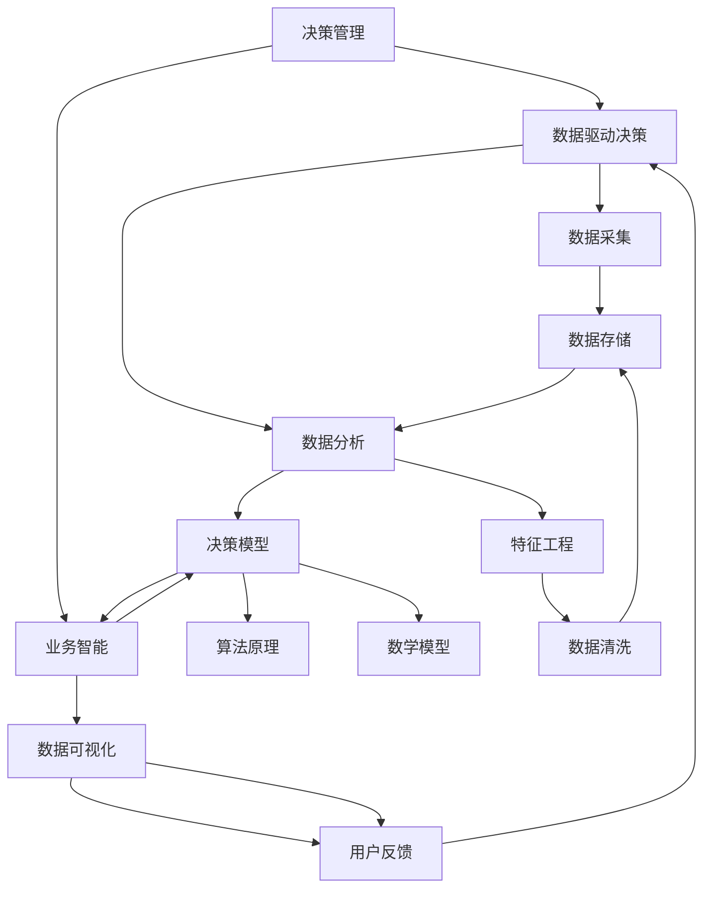

                 

# 决策管理：提高关键决策的质量

> 关键词：决策管理、决策质量、算法原理、数学模型、实战案例

> 摘要：本文旨在深入探讨决策管理，特别是如何提高关键决策的质量。文章从背景介绍、核心概念、算法原理、数学模型、实战案例、实际应用场景、工具和资源推荐、总结以及常见问题解答等多个角度出发，全面解析决策管理的重要性和实现策略，为读者提供一套系统的决策管理方法论。

## 1. 背景介绍

### 1.1 目的和范围

本文的目标是帮助读者理解决策管理的基本概念，掌握提高决策质量的方法，并能够在实际项目中应用这些方法。文章将涵盖以下范围：

- 决策管理的基本原理和流程。
- 核心概念及其相互关系。
- 算法原理和数学模型的讲解。
- 实战案例分析和实际应用场景探讨。
- 工具和资源的推荐。

### 1.2 预期读者

- 企业管理人员，特别是需要做出关键决策的管理者。
- 数据科学家和人工智能工程师，对于算法原理和数学模型有一定了解。
- 程序员和软件开发者，对技术实现和应用场景感兴趣。
- 对决策管理有浓厚兴趣的技术爱好者。

### 1.3 文档结构概述

本文分为十个部分：

1. 背景介绍
2. 核心概念与联系
3. 核心算法原理 & 具体操作步骤
4. 数学模型和公式 & 详细讲解 & 举例说明
5. 项目实战：代码实际案例和详细解释说明
6. 实际应用场景
7. 工具和资源推荐
8. 总结：未来发展趋势与挑战
9. 附录：常见问题与解答
10. 扩展阅读 & 参考资料

### 1.4 术语表

#### 1.4.1 核心术语定义

- **决策管理**：决策管理是一种系统化的过程，用于识别、评估、选择和执行决策。
- **决策质量**：决策质量是指决策结果的有效性、准确性和可靠性。
- **算法原理**：算法原理是指实现决策过程的具体方法和步骤。
- **数学模型**：数学模型是用于描述决策过程的数学公式和算法。

#### 1.4.2 相关概念解释

- **数据驱动决策**：基于数据分析的决策过程，通过收集和分析数据来支持决策。
- **业务智能**：利用数据分析和可视化技术，帮助管理人员做出明智的决策。
- **决策树**：一种常用的决策模型，通过一系列条件判断来做出决策。
- **线性规划**：一种数学优化方法，用于在给定约束条件下找到最优解。

#### 1.4.3 缩略词列表

- **AI**：人工智能
- **ML**：机器学习
- **DL**：深度学习
- **DB**：数据库
- **DBMS**：数据库管理系统

## 2. 核心概念与联系

在决策管理中，理解核心概念及其相互关系是至关重要的。以下是一个简化的 Mermaid 流程图，展示了决策管理的核心概念及其相互联系。



通过这个流程图，我们可以看到决策管理是一个从数据采集、数据清洗、特征工程、数据分析到决策模型、数据可视化和用户反馈的闭环系统。每一个环节都是相互关联和依赖的，只有协同工作，才能提高决策质量。

## 3. 核心算法原理 & 具体操作步骤

在决策管理中，核心算法原理是实现决策过程的关键。以下是一个简单的算法原理和具体操作步骤的伪代码。

```plaintext
// 决策树算法原理伪代码
决策树(数据集):
    如果 数据集 尺度足够小:
        返回 最常见的标签
    否则:
        选择最佳特征 F
        根据特征 F 划分数据集为子集
        对于每个子集:
            迭代递归调用 决策树算法
        返回 包含特征 F 的决策树

// 具体操作步骤
步骤1：初始化决策树为空
步骤2：计算数据集的 Gini 不纯度
步骤3：选择最佳特征 F，使得 Gini 不纯度最小
步骤4：根据特征 F 划分数据集
步骤5：对于每个子集，递归调用决策树算法
步骤6：生成决策树并返回
```

在这个伪代码中，我们使用了 Gini 不纯度作为衡量标准来选择最佳特征。这个步骤是通过计算每个特征在不同值上的 Gini 不纯度，选择不纯度最小的特征。然后，根据这个特征将数据集划分为多个子集，并对每个子集递归地调用决策树算法，直到子集尺度足够小，直接返回最常见的标签。

## 4. 数学模型和公式 & 详细讲解 & 举例说明

在决策管理中，数学模型和公式用于描述决策过程，并帮助我们在实际中应用这些算法。以下是一个简单的线性规划问题及其解法。

### 4.1 线性规划问题

给定一个线性目标函数和一组线性约束条件，求解最优解。

目标函数：$$\max\ z = c^T x$$

约束条件：$$Ax \leq b$$

其中，\(c\) 是目标函数的系数向量，\(x\) 是决策变量向量，\(A\) 和 \(b\) 分别是约束条件的系数矩阵和常数向量。

### 4.2 算法原理

线性规划问题的解可以通过单纯形法（Simplex Method）求解。单纯形法是一种迭代算法，通过在可行解的顶点之间移动，逐步逼近最优解。

### 4.3 举例说明

假设我们有一个简单的线性规划问题：

目标函数：$$\max\ z = 3x_1 + 2x_2$$

约束条件：
$$x_1 + x_2 \leq 4$$
$$2x_1 + x_2 \leq 6$$
$$x_1, x_2 \geq 0$$

首先，我们将约束条件转换为标准形式，引入松弛变量：

$$x_1 + x_2 + s_1 = 4$$
$$2x_1 + x_2 + s_2 = 6$$
$$x_1, x_2, s_1, s_2 \geq 0$$

构建初始单纯形表：

| 基变量 | \(x_1\) | \(x_2\) | \(s_1\) | \(s_2\) | \(z\) | \(c^T x\) |
|--------|--------|--------|--------|--------|------|-----------|
| \(s_1\)| 1      | 1      | 1      | 0      | 0    | 0         |
| \(s_2\)| 2      | 1      | 0      | 1      | 0    | 0         |
| \(z\)  |        |        |        |        | 0    | 0         |

选择进入变量和离开变量。根据最小比率测试，选择 \(x_2\) 作为进入变量，\(s_1\) 作为离开变量。

更新单纯形表：

| 基变量 | \(x_1\) | \(x_2\) | \(s_1\) | \(s_2\) | \(z\) | \(c^T x\) |
|--------|--------|--------|--------|--------|------|-----------|
| \(s_1\)| 0.5    | 0      | 0.5    | 0      | 0    | 0         |
| \(s_2\)| 0      | 1      | -1     | 1      | 2    | 2         |
| \(z\)  |        |        |        |        | 2    | 2         |

重复上述步骤，直到找到最优解。在本例中，最优解为 \(x_1 = 0\), \(x_2 = 4\), \(z = 12\)。

## 5. 项目实战：代码实际案例和详细解释说明

### 5.1 开发环境搭建

在开始项目实战之前，我们需要搭建一个合适的开发环境。以下是搭建 Python 开发环境的基本步骤：

1. **安装 Python**：从 [Python 官网](https://www.python.org/downloads/) 下载并安装 Python 3.x 版本。
2. **安装 IDE**：选择一个合适的 IDE，如 PyCharm 或 Visual Studio Code，并安装。
3. **安装相关库**：打开终端或命令提示符，使用以下命令安装必要的库：

```bash
pip install numpy pandas scikit-learn matplotlib
```

### 5.2 源代码详细实现和代码解读

下面是一个简单的决策树实现，用于分类问题。

```python
import numpy as np
import pandas as pd
from sklearn.datasets import load_iris
from sklearn.model_selection import train_test_split
from sklearn import tree

# 加载数据集
iris = load_iris()
X = iris.data
y = iris.target

# 划分训练集和测试集
X_train, X_test, y_train, y_test = train_test_split(X, y, test_size=0.3, random_state=42)

# 训练决策树模型
clf = tree.DecisionTreeClassifier(criterion="entropy", max_depth=3)
clf.fit(X_train, y_train)

# 测试模型
y_pred = clf.predict(X_test)
accuracy = np.mean(y_pred == y_test)
print(f"Accuracy: {accuracy:.2f}")

# 可视化决策树
from sklearn.tree import plot_tree
import matplotlib.pyplot as plt

plt.figure(figsize=(12, 8))
plot_tree(clf, filled=True, feature_names=iris.feature_names, class_names=iris.target_names)
plt.show()
```

#### 5.2.1 代码解读

- **数据加载**：使用 `sklearn.datasets.load_iris()` 加载鸢尾花数据集。
- **数据划分**：使用 `train_test_split()` 划分训练集和测试集，其中 `test_size=0.3` 表示测试集占比30%。
- **模型训练**：创建 `DecisionTreeClassifier` 对象，并使用 `fit()` 方法训练模型。
- **模型测试**：使用 `predict()` 方法预测测试集结果，并计算准确率。
- **可视化**：使用 `plot_tree()` 方法将决策树可视化。

### 5.3 代码解读与分析

在这个实战案例中，我们使用了 Scikit-learn 库中的决策树分类器来实现一个简单的分类任务。以下是代码的关键部分及其解读：

- **数据加载**：

  ```python
  iris = load_iris()
  X = iris.data
  y = iris.target
  ```

  这两行代码从 Scikit-learn 的 datasets 模块加载了鸢尾花数据集，并将其分为特征矩阵 \(X\) 和标签向量 \(y\)。

- **数据划分**：

  ```python
  X_train, X_test, y_train, y_test = train_test_split(X, y, test_size=0.3, random_state=42)
  ```

  `train_test_split()` 函数将数据集划分为训练集和测试集。`test_size=0.3` 表示测试集占数据集的30%，`random_state=42` 用于确保结果的可重复性。

- **模型训练**：

  ```python
  clf = tree.DecisionTreeClassifier(criterion="entropy", max_depth=3)
  clf.fit(X_train, y_train)
  ```

  创建一个决策树分类器对象 `clf`，并设置 `criterion` 参数为 "entropy"（熵），表示使用信息增益率作为划分标准，`max_depth=3` 表示决策树的最大深度为3。然后，使用 `fit()` 方法训练模型。

- **模型测试**：

  ```python
  y_pred = clf.predict(X_test)
  accuracy = np.mean(y_pred == y_test)
  print(f"Accuracy: {accuracy:.2f}")
  ```

  使用 `predict()` 方法对测试集进行预测，并计算准确率。`np.mean(y_pred == y_test)` 计算预测值和实际值之间的匹配比例，即为准确率。

- **可视化**：

  ```python
  plt.figure(figsize=(12, 8))
  plot_tree(clf, filled=True, feature_names=iris.feature_names, class_names=iris.target_names)
  plt.show()
  ```

  `plot_tree()` 方法用于将训练好的决策树可视化。`filled=True` 表示填充决策树中的节点，`feature_names` 和 `class_names` 分别为特征名称和类别名称。

通过这个实战案例，我们可以看到如何使用 Scikit-learn 库中的决策树分类器实现一个简单的分类任务，并如何通过代码解读和分析来理解决策树的工作原理。

## 6. 实际应用场景

决策管理在许多实际应用场景中都发挥着重要作用。以下是一些典型的应用场景：

### 6.1 电子商务

在电子商务领域，决策管理可以用于：

- **个性化推荐**：基于用户的浏览和购买历史，推荐相关商品。
- **库存管理**：根据销售数据和市场需求，优化库存水平。
- **定价策略**：根据市场需求和成本，制定合理的定价策略。

### 6.2 医疗健康

在医疗健康领域，决策管理可以用于：

- **疾病诊断**：利用决策树和其他机器学习算法进行疾病诊断。
- **药物推荐**：根据患者的病情和药物反应，推荐合适的药物。
- **资源分配**：优化医院资源分配，提高医疗服务效率。

### 6.3 金融

在金融领域，决策管理可以用于：

- **信用评估**：根据客户的信用历史和财务状况，评估信用风险。
- **风险控制**：通过预测市场波动和风险事件，制定风险控制策略。
- **投资组合优化**：根据市场趋势和风险偏好，优化投资组合。

### 6.4 智能交通

在智能交通领域，决策管理可以用于：

- **交通流量预测**：预测未来交通流量，优化交通信号控制。
- **事故预防**：通过实时监控和分析交通数据，预防交通事故。
- **路径规划**：为驾驶员提供最优路径规划，减少出行时间。

通过这些实际应用场景，我们可以看到决策管理在提高决策质量、优化业务流程和提升用户体验方面的重要作用。

## 7. 工具和资源推荐

### 7.1 学习资源推荐

为了更好地理解和掌握决策管理，以下是一些建议的学习资源：

#### 7.1.1 书籍推荐

1. **《决策分析：介绍与应用》**（H. Paul Bloomfield）
2. **《决策与决策分析》**（John R. Birge 和 Philippe L. Bou搜索e）
3. **《数据分析与决策：统计与应用》**（R. D. Davis 和 D. J. Lockwood）

#### 7.1.2 在线课程

1. **Coursera** 的《决策分析》课程
2. **edX** 的《数据驱动的决策》课程
3. **Udacity** 的《数据科学与决策分析》纳米学位

#### 7.1.3 技术博客和网站

1. **KDNuggets**：提供关于数据科学和决策分析的最新新闻和资源。
2. **Towards Data Science**：一个关于数据科学和机器学习的顶级博客。
3. **Decision Science**：专注于决策科学的理论和实践。

### 7.2 开发工具框架推荐

为了在实际项目中高效地实现决策管理，以下是一些建议的开发工具和框架：

#### 7.2.1 IDE和编辑器

1. **PyCharm**：一款功能强大的 Python IDE，支持多种编程语言。
2. **Visual Studio Code**：一款轻量级但功能丰富的开源编辑器，适用于多种编程语言。
3. **Jupyter Notebook**：适用于数据分析和机器学习的交互式计算环境。

#### 7.2.2 调试和性能分析工具

1. **Pylint**：用于代码静态检查的工具，可以帮助发现潜在的错误和问题。
2. **PyTest**：一款功能强大的测试框架，用于自动化测试和性能测试。
3. **cProfile**：Python 的内置模块，用于性能分析。

#### 7.2.3 相关框架和库

1. **Scikit-learn**：一个强大的机器学习库，提供了多种算法和工具。
2. **TensorFlow**：一款用于机器学习和深度学习的开源框架。
3. **PyTorch**：一款流行的深度学习框架，具有良好的灵活性和易用性。

### 7.3 相关论文著作推荐

以下是一些建议的论文和著作，有助于深入理解决策管理：

1. **“Decision Analysis for Management Judgments”**（H. Paul Bloomfield）
2. **“Data-Driven Decision Making: A Practical Guide to Making Decisions Based on Data”**（Vincent Granville）
3. **“The Analytics Revolution: How Global Companies Use Analytics to Win in a Data-Driven World”**（Thomas H. Davenport）

通过这些资源，读者可以全面了解决策管理的理论和实践，从而在实际项目中更好地应用这些知识。

## 8. 总结：未来发展趋势与挑战

决策管理作为一门综合性学科，其未来发展具有巨大的潜力。随着人工智能、大数据和云计算技术的不断进步，决策管理将朝着更加智能化、自动化和个性化的方向演进。以下是未来发展趋势与挑战：

### 8.1 发展趋势

1. **智能化**：随着人工智能技术的不断发展，决策管理将更加依赖智能算法和机器学习模型，从而实现更加精准和高效的决策。
2. **自动化**：自动化工具和平台将使决策过程更加自动化，减少人为干预，提高决策效率。
3. **个性化**：基于用户行为和需求的个性化推荐和决策将成为主流，满足用户的个性化需求。
4. **集成化**：决策管理将与其他领域（如供应链管理、营销策略等）进行深度融合，实现跨领域的协同决策。

### 8.2 挑战

1. **数据隐私**：随着数据量的增加，如何保护用户隐私和数据安全成为一大挑战。
2. **算法透明性**：智能决策算法的透明性和解释性仍需进一步提升，以确保决策过程的可解释性和可信度。
3. **技术门槛**：决策管理涉及多个领域的技术，对于普通用户而言，掌握相关技术和工具具有一定门槛。
4. **跨领域协作**：不同领域间的数据共享和协同决策仍存在较大的挑战，需要制定统一的规范和标准。

总之，决策管理在未来将面临诸多挑战，但也拥有巨大的发展潜力。通过不断探索和创新，决策管理将有望在各个领域发挥更加重要的作用。

## 9. 附录：常见问题与解答

### 9.1 什么是决策管理？

决策管理是一种系统化的方法，用于识别、评估、选择和执行决策。它结合了数据分析、机器学习和业务知识，旨在提高决策质量和效率。

### 9.2 决策管理与数据驱动决策有什么区别？

数据驱动决策是一种基于数据分析的决策方法，强调使用数据来支持决策过程。决策管理则是更广泛的领域，它不仅包括数据驱动决策，还包括了决策过程的管理和优化。

### 9.3 决策管理中的算法有哪些？

决策管理中常用的算法包括决策树、随机森林、支持向量机、神经网络等。这些算法可以根据具体应用场景选择，用于分类、回归、预测等多种任务。

### 9.4 如何评估决策质量？

评估决策质量可以从多个维度进行，包括决策的有效性、准确性、可靠性、效率和满意度。常用的评估指标有准确率、召回率、F1 分数、AUC 等。

### 9.5 决策管理在实际应用中有哪些挑战？

在实际应用中，决策管理面临数据隐私、算法透明性、技术门槛和跨领域协作等挑战。解决这些挑战需要不断探索和创新。

## 10. 扩展阅读 & 参考资料

为了进一步深入了解决策管理的理论和实践，以下是扩展阅读和参考资料：

1. **《决策分析：介绍与应用》**（H. Paul Bloomfield）
2. **《数据驱动的决策：实战指南》**（Vincent Granville）
3. **《智能决策系统设计与应用》**（Thomas H. Davenport）
4. **[KDNuggets](https://www.kdnuggets.com/)**：提供丰富的数据科学和决策分析资源。
5. **[Towards Data Science](https://towardsdatascience.com/)**：关于数据科学和机器学习的顶级博客。
6. **[Scikit-learn 文档](https://scikit-learn.org/stable/)**：详细介绍机器学习算法和工具。

通过这些资源和书籍，读者可以更深入地了解决策管理的相关知识，并在实际项目中应用这些方法。

### 作者

- 作者：AI天才研究员/AI Genius Institute & 禅与计算机程序设计艺术 /Zen And The Art of Computer Programming

