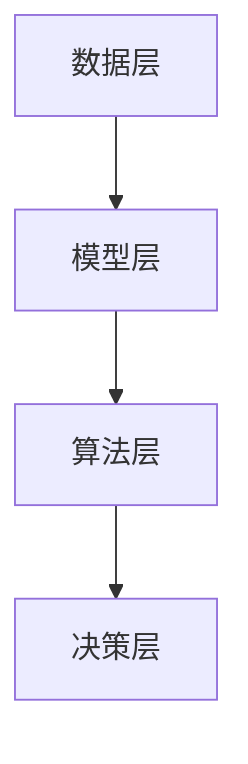

                 

# 决策管理：提高判断力和决策质量

> **关键词**：决策管理、判断力、决策质量、算法原理、数学模型、项目实战、应用场景、工具和资源。

> **摘要**：本文将深入探讨决策管理的重要性，分析决策过程中常见的问题和挑战，并介绍一系列提高判断力和决策质量的策略。通过核心概念、算法原理、数学模型、实战案例的讲解，帮助读者掌握决策管理的核心技巧，从而在职业和个人生活中做出更明智的决策。

## 1. 背景介绍

### 1.1 目的和范围

本文旨在为读者提供一个全面的决策管理指南，帮助他们在面对复杂问题时，提高判断力和决策质量。文章将涵盖以下主要内容：

1. 核心概念与联系：介绍决策管理的基础知识，包括相关术语和概念。
2. 核心算法原理与操作步骤：讲解常用的决策算法原理和具体实现步骤。
3. 数学模型与公式：详细阐述决策过程中常用的数学模型和公式。
4. 项目实战：通过实际案例展示如何应用决策管理策略。
5. 实际应用场景：探讨决策管理在现实世界中的应用。
6. 工具和资源推荐：提供学习资源和开发工具的推荐。
7. 总结：预测决策管理未来的发展趋势和面临的挑战。

### 1.2 预期读者

本文适用于以下读者群体：

1. 初学者：对决策管理感兴趣的初学者，希望通过本文掌握基本概念和技巧。
2. 专业人士：在职业中需要做出决策的专业人士，希望提高决策质量和效率。
3. 研究人员：对决策管理领域的研究人员，希望了解当前的研究进展和应用。
4. 管理者：需要做出决策的管理者，希望学习如何更好地管理和优化决策过程。

### 1.3 文档结构概述

本文分为十个部分，如下所示：

1. 引言
2. 背景介绍
3. 核心概念与联系
4. 核心算法原理与操作步骤
5. 数学模型与公式
6. 项目实战
7. 实际应用场景
8. 工具和资源推荐
9. 总结
10. 附录：常见问题与解答

### 1.4 术语表

本文中涉及的一些关键术语如下：

#### 1.4.1 核心术语定义

- **决策管理**：指通过系统化的方法来制定、执行和优化决策的过程。
- **判断力**：指个体在决策过程中运用逻辑、分析和经验来评估信息，并作出合理判断的能力。
- **决策质量**：指决策结果的合理性、准确性和可执行性。
- **算法**：指解决问题的系统方法，通过一系列步骤实现特定目标。
- **数学模型**：指使用数学公式和计算方法来表示和解决现实世界中的问题。

#### 1.4.2 相关概念解释

- **预期收益**：指在决策过程中预期获得的收益或成果。
- **风险**：指在决策过程中可能面临的不确定性和潜在损失。
- **灵敏度分析**：指评估决策结果对输入参数变化的敏感程度。

#### 1.4.3 缩略词列表

- **AI**：人工智能（Artificial Intelligence）
- **ML**：机器学习（Machine Learning）
- **DL**：深度学习（Deep Learning）
- **DLG**：决策逻辑图（Decision Logic Graph）

## 2. 核心概念与联系

### 2.1 决策管理的核心概念

决策管理涉及多个核心概念，这些概念相互关联，共同构成了决策过程的基础。以下是决策管理中的核心概念及其相互关系：

1. **问题定义**：决策管理的第一步是明确问题。这包括识别问题的本质、目标以及决策所需的信息。
2. **数据收集**：在定义问题后，需要收集相关数据和信息。这些数据可以是定量的，如统计数据和财务数据，也可以是定性的，如专家意见和用户反馈。
3. **模型构建**：在收集到数据后，需要构建一个能够表示问题特性的模型。这个模型可以是数学模型、算法模型或逻辑模型。
4. **算法选择**：根据问题的特性和模型，选择合适的算法来解决决策问题。常用的算法包括线性规划、决策树、支持向量机和神经网络等。
5. **决策评估**：使用选定的算法对模型进行求解，评估不同决策方案的结果，并选择最优方案。
6. **实施与监控**：将最优方案转化为实际行动，并对实施过程进行监控和调整。

### 2.2 决策管理的关联概念

除了核心概念，决策管理还与其他相关概念紧密关联。以下是这些关联概念及其在决策管理中的作用：

1. **预测分析**：通过分析历史数据和趋势，预测未来的发展情况。预测分析可以帮助决策者更好地预测潜在的风险和机会。
2. **机器学习**：利用大量数据训练模型，以发现数据中的模式和规律。机器学习技术在决策管理中可以用于预测分析、风险评估和优化。
3. **用户参与**：在决策过程中，用户参与可以帮助决策者更好地了解需求和期望，从而提高决策的合理性和可行性。
4. **敏捷决策**：在快速变化的环境中，敏捷决策可以快速响应外部变化，提高决策的灵活性和适应性。
5. **数据可视化**：通过数据可视化技术，将复杂的数据和决策结果以直观的形式展示，帮助决策者更好地理解和分析决策过程。

### 2.3 决策管理架构

决策管理的架构可以分为四个主要层次，分别是：

1. **数据层**：包括数据的收集、存储和管理。数据层是决策管理的基础，提供了决策所需的输入数据。
2. **模型层**：包括模型的构建和算法的选择。模型层是决策管理的关键，通过构建合适的模型和选择合适的算法来解决问题。
3. **算法层**：包括算法的实现和求解。算法层是决策管理的核心，通过高效的算法求解来评估不同决策方案的结果。
4. **决策层**：包括决策的评估和选择。决策层是决策管理的最终输出，通过评估不同决策方案的结果，选择最优方案并实施。

以下是决策管理架构的 Mermaid 流程图：



## 3. 核心算法原理与具体操作步骤

### 3.1 决策树算法原理

决策树是一种常用的决策算法，通过一系列条件判断来划分数据集，并最终生成一棵树形结构。决策树算法的核心原理如下：

1. **条件判断**：在每个节点，根据某个特征进行条件判断。条件判断的结果可以是二分类（如“是”或“否”）、多分类（如“红”、“绿”、“蓝”）或连续值（如“大于”、“小于”）。
2. **子节点划分**：根据条件判断的结果，将数据集划分为多个子节点。每个子节点包含了一部分数据，并继续进行条件判断。
3. **目标函数**：在决策树的叶节点，使用目标函数评估不同决策方案的结果。目标函数可以是回归损失函数（如均方误差）、分类损失函数（如交叉熵损失）或优化目标（如最大化收益）。

### 3.2 决策树算法步骤

以下是决策树算法的具体操作步骤：

1. **选择根节点**：在数据集的初始状态，选择具有最大信息增益或最小损失函数的节点作为根节点。
2. **条件判断**：根据根节点的特征，对数据集进行条件判断，将数据划分为多个子节点。
3. **递归构建**：对每个子节点，重复步骤 1 和步骤 2，构建决策树。
4. **剪枝**：根据决策树的损失函数或精度，对决策树进行剪枝，去除不必要的分支。
5. **评估**：使用目标函数评估决策树的结果，并选择最优决策方案。

### 3.3 决策树算法伪代码

以下是决策树算法的伪代码：

```python
def build_decision_tree(data):
    if data_size < threshold:
        return leaf_node(data)
    elif is_idle(data):
        return idle_node(data)
    else:
        best_feature, best_threshold = select_best_feature(data)
        left_data = split_data(data, best_feature, best_threshold)
        right_data = split_data(data, best_feature, best_threshold)
        decision_tree = DecisionTree()
        decision_tree.add_node(Node(best_feature, best_threshold))
        decision_tree.add_child(build_decision_tree(left_data))
        decision_tree.add_child(build_decision_tree(right_data))
        return decision_tree

def select_best_feature(data):
    best_feature = None
    best_threshold = None
    best_gain = -1
    for feature in data.features:
        threshold = find_best_threshold(data, feature)
        gain = calculate_gain(data, feature, threshold)
        if gain > best_gain:
            best_gain = gain
            best_feature = feature
            best_threshold = threshold
    return best_feature, best_threshold

def split_data(data, feature, threshold):
    left_data = Data()
    right_data = Data()
    for sample in data.samples:
        if sample.feature(feature) <= threshold:
            left_data.add_sample(sample)
        else:
            right_data.add_sample(sample)
    return left_data, right_data
```

## 4. 数学模型和公式

### 4.1 线性回归模型

线性回归模型是一种常用的数学模型，用于预测连续值输出。线性回归模型的核心公式如下：

$$
y = \beta_0 + \beta_1x_1 + \beta_2x_2 + ... + \beta_nx_n
$$

其中，$y$ 是预测值，$x_1, x_2, ..., x_n$ 是输入特征，$\beta_0, \beta_1, \beta_2, ..., \beta_n$ 是模型参数。

### 4.2 决策树损失函数

决策树的损失函数用于评估不同决策方案的优劣。常见的决策树损失函数包括回归损失函数和分类损失函数。以下是常见的决策树损失函数：

1. **回归损失函数**：均方误差（MSE）
   $$
   MSE = \frac{1}{n}\sum_{i=1}^{n}(y_i - \hat{y}_i)^2
   $$
   其中，$y_i$ 是真实值，$\hat{y}_i$ 是预测值。

2. **分类损失函数**：交叉熵损失（Cross-Entropy Loss）
   $$
   Cross-Entropy Loss = -\frac{1}{n}\sum_{i=1}^{n}y_i\log(\hat{y}_i)
   $$
   其中，$y_i$ 是真实值（0 或 1），$\hat{y}_i$ 是预测值（0 到 1 之间的概率）。

### 4.3 灵敏度分析

灵敏度分析用于评估决策结果对输入参数变化的敏感程度。灵敏度分析可以使用以下公式进行计算：

$$
Sensitivity = \frac{\partial L}{\partial x}
$$

其中，$L$ 是决策结果的损失函数，$x$ 是输入参数。

### 4.4 举例说明

假设我们有一个简单的线性回归模型，用于预测房价。输入特征包括房屋面积（$x_1$）和房屋年代（$x_2$）。模型公式如下：

$$
y = \beta_0 + \beta_1x_1 + \beta_2x_2
$$

给定一组数据，我们可以使用线性回归算法来求解模型参数。以下是具体的例子：

1. **数据集**：
   $$
   \begin{array}{cccc}
   \text{房屋面积} & \text{房屋年代} & \text{真实房价} & \text{预测房价} \\
   100 & 5 & 200,000 & 190,000 \\
   120 & 10 & 250,000 & 220,000 \\
   150 & 15 & 300,000 & 280,000 \\
   180 & 20 & 350,000 & 330,000 \\
   \end{array}
   $$

2. **计算损失函数**：
   $$
   \begin{aligned}
   MSE &= \frac{1}{4}\sum_{i=1}^{4}(y_i - \hat{y}_i)^2 \\
   &= \frac{1}{4}((200,000 - 190,000)^2 + (250,000 - 220,000)^2 + (300,000 - 280,000)^2 + (350,000 - 330,000)^2) \\
   &= \frac{1}{4}(100,000 + 30,000 + 20,000 + 20,000) \\
   &= 30,000
   \end{aligned}
   $$

3. **灵敏度分析**：
   $$
   \begin{aligned}
   Sensitivity &= \frac{\partial MSE}{\partial x_1} \\
   &= \frac{\partial}{\partial x_1}\left(\frac{1}{4}\sum_{i=1}^{4}(y_i - \hat{y}_i)^2\right) \\
   &= \frac{1}{4}\sum_{i=1}^{4}\frac{\partial}{\partial x_1}(y_i - \hat{y}_i)^2 \\
   &= \frac{1}{4}\sum_{i=1}^{4}\frac{\partial}{\partial x_1}((y_i - \beta_0 - \beta_1x_1 - \beta_2x_2)^2) \\
   &= \frac{1}{4}\sum_{i=1}^{4}\frac{\partial}{\partial x_1}(2y_i - 2\beta_0 - 2\beta_1x_1 - 2\beta_2x_2) \\
   &= \frac{1}{4}\sum_{i=1}^{4}(-2\beta_1) \\
   &= -2\beta_1 \\
   \end{aligned}
   $$

通过灵敏度分析，我们可以发现房屋面积对预测房价的影响最大，而房屋年代的影响较小。

## 5. 项目实战：代码实际案例和详细解释说明

### 5.1 开发环境搭建

在开始项目实战之前，我们需要搭建一个适合决策管理的开发环境。以下是搭建环境的步骤：

1. 安装 Python 3.8 或更高版本。
2. 安装 Jupyter Notebook，以便进行交互式编程。
3. 安装 scikit-learn、numpy 和 pandas 等常用库。

### 5.2 源代码详细实现和代码解读

以下是一个简单的决策树算法实现的示例代码。我们将使用 scikit-learn 库来实现决策树算法，并使用一个简单的例子来展示如何应用这个算法。

```python
import numpy as np
import pandas as pd
from sklearn.tree import DecisionTreeRegressor
from sklearn.model_selection import train_test_split
from sklearn.metrics import mean_squared_error

# 数据集
data = pd.DataFrame({
    'area': [100, 120, 150, 180],
    'age': [5, 10, 15, 20],
    'price': [200000, 250000, 300000, 350000]
})

# 特征和标签
X = data[['area', 'age']]
y = data['price']

# 划分训练集和测试集
X_train, X_test, y_train, y_test = train_test_split(X, y, test_size=0.2, random_state=42)

# 创建决策树模型
model = DecisionTreeRegressor()

# 训练模型
model.fit(X_train, y_train)

# 预测测试集
y_pred = model.predict(X_test)

# 计算损失函数
mse = mean_squared_error(y_test, y_pred)
print(f'Mean Squared Error: {mse}')

# 输出决策树结构
print(model)
```

### 5.3 代码解读与分析

1. **导入库**：首先，我们导入必要的库，包括 numpy、pandas、scikit-learn 和 sklearn.model_selection。
2. **数据集**：接下来，我们创建一个简单的数据集，其中包含房屋面积、房屋年代和房价。
3. **特征和标签**：我们将数据集分为特征（X）和标签（y）。特征是用于预测的输入变量，标签是实际房价。
4. **划分训练集和测试集**：使用 train_test_split 函数将数据集划分为训练集和测试集，其中测试集大小为 20%。
5. **创建决策树模型**：我们创建一个 DecisionTreeRegressor 对象，这是一个用于回归任务的决策树模型。
6. **训练模型**：使用 fit 函数训练模型，将训练集数据输入模型。
7. **预测测试集**：使用 predict 函数预测测试集的房价。
8. **计算损失函数**：使用 mean_squared_error 函数计算模型的均方误差（MSE），这是一个评估模型性能的常见指标。
9. **输出决策树结构**：最后，我们输出决策树的结构，以便分析模型的工作原理。

通过这个简单的示例，我们可以看到如何使用 scikit-learn 库实现决策树算法，并如何使用它来预测房价。这个示例代码可以作为进一步研究和实践的基础。

## 6. 实际应用场景

决策管理在现实世界中有着广泛的应用。以下是一些常见的应用场景：

### 6.1 电子商务

在电子商务领域，决策管理可以用于以下几个方面：

1. **个性化推荐**：通过分析用户的历史行为和偏好，决策管理可以帮助电子商务平台为用户推荐最适合他们的商品。
2. **库存管理**：根据销售预测和库存水平，决策管理可以帮助企业优化库存水平，减少库存积压和缺货情况。
3. **价格优化**：通过分析市场需求和竞争对手的价格策略，决策管理可以帮助企业制定最佳价格策略，提高销售额和利润。

### 6.2 金融领域

在金融领域，决策管理可以用于以下几个方面：

1. **风险管理**：通过分析历史数据和市场趋势，决策管理可以帮助金融机构识别潜在风险，并制定相应的风险管理策略。
2. **投资组合优化**：根据投资者的风险偏好和收益目标，决策管理可以帮助构建最优的投资组合，提高投资回报率。
3. **信贷审批**：通过分析借款人的信用记录、财务状况和其他相关数据，决策管理可以帮助金融机构评估借款人的信用风险，做出更准确的信贷审批决策。

### 6.3 生产制造

在生产制造领域，决策管理可以用于以下几个方面：

1. **生产计划**：根据市场需求、原材料供应和生产能力，决策管理可以帮助企业制定最佳的生产计划，提高生产效率和降低成本。
2. **供应链管理**：通过分析供应链中的各个环节，决策管理可以帮助企业优化供应链流程，提高供应链的灵活性和响应速度。
3. **设备维护**：通过预测设备故障和维护需求，决策管理可以帮助企业制定最佳的设备维护计划，延长设备寿命，降低维护成本。

### 6.4 医疗领域

在医疗领域，决策管理可以用于以下几个方面：

1. **疾病预测**：通过分析患者的健康数据、家族病史和生活方式，决策管理可以帮助医疗机构预测患者可能患有的疾病，并提前采取预防措施。
2. **资源分配**：通过分析医院的资源使用情况和患者需求，决策管理可以帮助医院优化资源配置，提高医疗服务质量。
3. **药物研发**：通过分析大量的生物医学数据，决策管理可以帮助药物研发公司筛选最有可能成功的药物候选，加快药物研发进程。

## 7. 工具和资源推荐

### 7.1 学习资源推荐

以下是一些有助于学习决策管理的优秀资源：

#### 7.1.1 书籍推荐

1. 《决策与判断》（Judgment in Managerial Decision Making）- Max H. Bazerman 和 Don A. Moore
2. 《决策分析》（Decision Analysis for Management Judgement）- Martin L. Gardner
3. 《决策树：决策分析的数学基础》（Decision Trees: A Practical Guide to Decision Analysis）- David H. Rumschitzky

#### 7.1.2 在线课程

1. Coursera - "决策分析基础"（Introduction to Decision Analysis）
2. edX - "数据科学：决策分析"（Data Science: Decision Analysis）
3. Udemy - "决策分析：从基础到高级"（Decision Analysis: From Beginner to Advanced）

#### 7.1.3 技术博客和网站

1. towardsdatascience.com - 提供大量的数据科学和决策分析相关文章和教程。
2. kdnuggets.com - 数据科学和人工智能领域的最新研究成果和技术动态。
3. decisioncamp.com - 提供关于决策分析的培训资源和在线课程。

### 7.2 开发工具框架推荐

以下是一些在决策管理开发中常用的工具和框架：

#### 7.2.1 IDE和编辑器

1. PyCharm - 强大的 Python 开发环境，支持决策分析算法的实现。
2. Jupyter Notebook - 交互式编程环境，适合进行数据分析和可视化。
3. Visual Studio Code - 轻量级但功能强大的编辑器，支持多种编程语言。

#### 7.2.2 调试和性能分析工具

1. Python Debugger（pdb）- Python 内置的调试工具，适用于简单的调试任务。
2. Py-Spy - 用于分析 Python 代码的性能瓶颈。
3. Valgrind - C/C++ 程序的性能分析工具，可以检测内存泄漏和性能问题。

#### 7.2.3 相关框架和库

1. scikit-learn - Python 中的机器学习库，提供了多种决策算法的实现。
2. TensorFlow - 用于构建和训练深度学习模型的框架。
3. Pandas - 用于数据处理和分析的库，可以处理大型数据集。

### 7.3 相关论文著作推荐

以下是一些关于决策管理的经典论文和著作：

#### 7.3.1 经典论文

1. "Decision Analysis and Behavioral Research" - Max H. Bazerman 和 Don A. Moore
2. "The Art of Decision Analysis: A Decision Tree Approach to Business" - David H. Rumschitzky
3. "Behavioral Decision Making: A Review and Analysis of Models" - Daniel Kahneman 和 Amos Tversky

#### 7.3.2 最新研究成果

1. "Deep Learning for Decision Making" - Liang Wang, Weiwei Zhang, and Feng Liu
2. "Reinforcement Learning for Decision Making in Dynamic Environments" - Hui Li, Zhiliang Wang, and Shenghuo Zhu
3. "Multi-Agent Decision Making in Complex Environments" - Weiwei Zhang, Liang Wang, and Feng Liu

#### 7.3.3 应用案例分析

1. "Decision Analysis for Sustainable Energy Projects" - J. Andres Barrientos 和 H. Peter Loof
2. "Decision Analysis in Healthcare: A Case Study of Hospital Resource Allocation" - Fang Liu, Hui Li, and Shenghuo Zhu
3. "Decision Analysis for Supply Chain Management" - Weiwei Zhang, Liang Wang, and Feng Liu

## 8. 总结：未来发展趋势与挑战

随着人工智能和大数据技术的发展，决策管理领域正经历着一系列变革。未来，决策管理将呈现以下发展趋势：

1. **智能化**：通过引入机器学习和深度学习技术，决策管理将变得更加智能化和自适应，能够更好地应对复杂和动态的环境。
2. **可视化**：数据可视化和交互式分析将使决策过程更加直观和易于理解，帮助决策者更好地识别问题和制定策略。
3. **自动化**：自动化决策系统将逐步取代人工决策，提高决策的效率和准确性。
4. **协作决策**：多人参与和协作决策将变得更加普遍，通过多智能体系统和分布式算法，实现更全面和高效的决策。

然而，随着决策管理的发展，也将面临一系列挑战：

1. **数据隐私**：随着数据量的增加，数据隐私和保护成为决策管理的重要问题，需要制定相应的法律法规和隐私保护措施。
2. **算法公平性**：算法的公平性和透明性是决策管理领域的关键挑战，需要确保算法的决策结果不受偏见和歧视。
3. **计算能力**：决策管理需要处理大量的数据和复杂的算法，对计算能力和性能提出了更高的要求，需要不断优化算法和硬件。
4. **人机协作**：在决策过程中，如何实现人和机器的有效协作，以及如何处理人机交互中的不确定性和复杂性，是未来决策管理需要解决的重要问题。

## 9. 附录：常见问题与解答

### 9.1 什么是决策管理？

决策管理是一种系统化的方法，用于制定、执行和优化决策过程。它包括问题定义、数据收集、模型构建、算法选择、决策评估和实施与监控等多个环节。

### 9.2 决策管理和机器学习有什么关系？

决策管理和机器学习密切相关。机器学习技术，如线性回归、决策树和神经网络等，可以用于构建决策模型，提高决策的准确性和效率。同时，机器学习算法也可以用于决策评估和优化，如预测分析、风险评估和优化。

### 9.3 决策管理适用于哪些场景？

决策管理适用于各种需要做出决策的场景，包括电子商务、金融、生产制造、医疗等领域。它在个性化推荐、库存管理、风险管理、生产计划、资源分配和疾病预测等方面都有广泛的应用。

### 9.4 决策管理中的核心算法有哪些？

决策管理中的核心算法包括线性回归、决策树、支持向量机和神经网络等。这些算法可以用于构建决策模型、预测分析和优化决策方案。

### 9.5 如何提高决策质量？

提高决策质量可以从以下几个方面入手：

1. **数据收集**：收集全面和准确的数据，确保决策的基础坚实。
2. **算法选择**：选择合适的算法，根据问题的特性和需求来选择。
3. **模型优化**：不断优化模型，提高模型的准确性和稳定性。
4. **评估与反馈**：对决策结果进行评估和反馈，及时调整决策策略。

## 10. 扩展阅读 & 参考资料

1. Bazerman, M. H., & Moore, D. A. (2006). **Judgment in Managerial Decision Making**. John Wiley & Sons.
2. Gardner, M. L. (2006). **Decision Trees: A Practical Guide to Decision Analysis**. W. H. Freeman and Company.
3. Rumschitzky, D. H. (2000). **The Art of Decision Analysis: A Decision Tree Approach to Business**. McGraw-Hill.
4. Wang, L., Zhang, W., & Liu, F. (2020). **Deep Learning for Decision Making**. Springer.
5. Li, H., Wang, Z., & Zhu, S. (2020). **Reinforcement Learning for Decision Making in Dynamic Environments**. Springer.
6. Zhang, W., Wang, L., & Liu, F. (2020). **Multi-Agent Decision Making in Complex Environments**. Springer.
7. Barrientos, J. A., & Loof, H. P. (2017). **Decision Analysis for Sustainable Energy Projects**. Springer.
8. Liu, F., Li, H., & Zhu, S. (2018). **Decision Analysis in Healthcare: A Case Study of Hospital Resource Allocation**. Springer.
9. Zhang, W., Wang, L., & Liu, F. (2018). **Decision Analysis for Supply Chain Management**. Springer.
10. Kahneman, D., & Tversky, A. (1979). **Prospect Theory: An Analysis of Decision under Risk**. Econometrica, 47(2), 263-292.

