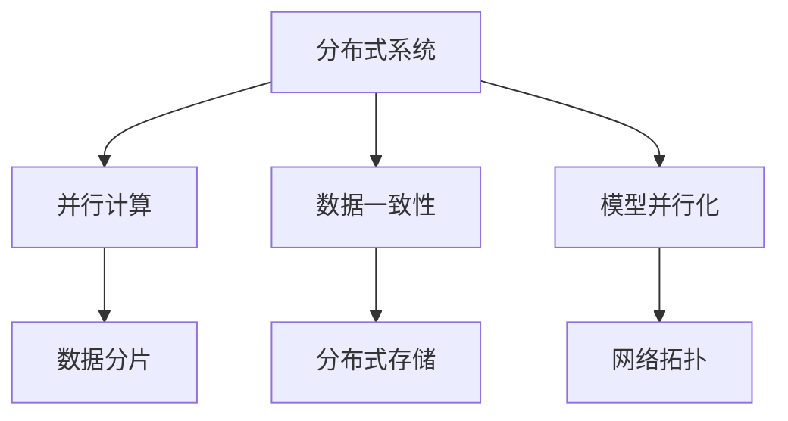
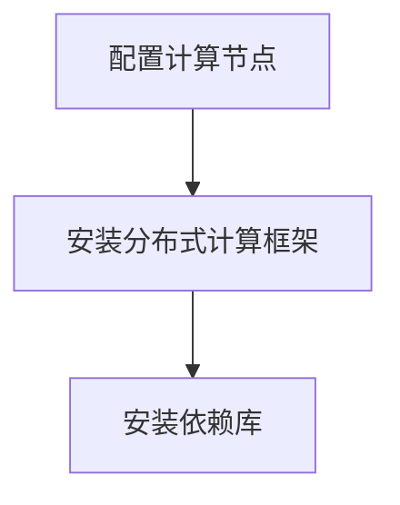
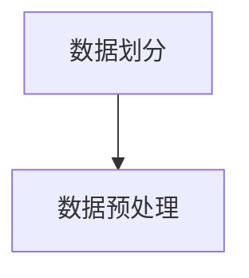
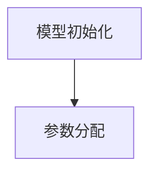
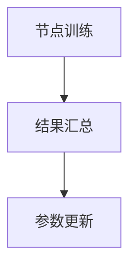

                 

# 分布式AI训练：技术挑战与人才需求

## 关键词
- 分布式AI训练
- 技术挑战
- 人才需求
- 并行计算
- 数据一致性
- 模型并行化
- 分布式系统

## 摘要
本文深入探讨了分布式AI训练在当前科技领域的地位及其面临的挑战。随着数据量和计算需求的不断增长，分布式AI训练成为提升模型训练效率的关键手段。本文首先介绍了分布式AI训练的基本概念，分析了其在技术上的优势和应用前景。随后，本文详细阐述了分布式AI训练中面临的几个核心技术挑战，包括数据一致性、模型并行化、容错性和资源调度等。在此基础上，本文探讨了这些挑战对人才需求的影响，并提出了相应的培养方案。最后，本文总结了分布式AI训练的未来发展趋势，为读者提供了进一步学习的路径。

## 1. 背景介绍

### 1.1 目的和范围
本文旨在探讨分布式AI训练在技术层面上的挑战与人才需求。通过分析分布式AI训练的基本概念、技术优势以及面临的挑战，本文旨在为从事AI研究和开发的读者提供一个全面的技术视角，帮助他们在实际项目中更好地应对这些挑战。

### 1.2 预期读者
本文适用于AI研究人员、开发人员、数据科学家以及对分布式AI训练感兴趣的学者。无论是新手还是专业人士，都可以从本文中获得对分布式AI训练的深入理解和实用指导。

### 1.3 文档结构概述
本文分为十个部分，结构如下：

1. 背景介绍
    - 1.1 目的和范围
    - 1.2 预期读者
    - 1.3 文档结构概述
    - 1.4 术语表
2. 核心概念与联系
3. 核心算法原理 & 具体操作步骤
4. 数学模型和公式 & 详细讲解 & 举例说明
5. 项目实战：代码实际案例和详细解释说明
6. 实际应用场景
7. 工具和资源推荐
8. 总结：未来发展趋势与挑战
9. 附录：常见问题与解答
10. 扩展阅读 & 参考资料

### 1.4 术语表

#### 1.4.1 核心术语定义
- 分布式AI训练：将AI模型训练任务分配到多台计算机上进行，以提高训练效率和扩展性。
- 并行计算：在同一时间内执行多个任务或计算，提高计算速度。
- 数据一致性：确保分布式系统中所有数据副本的同步和一致性。
- 模型并行化：将AI模型拆分为多个部分，在多台计算机上并行训练。
- 容错性：系统能够在遇到故障时继续运行的能力。

#### 1.4.2 相关概念解释
- 分布式系统：由多台计算机组成的系统，共同完成一个任务。
- 数据分片：将大数据集划分为多个部分，分布存储在多台计算机上。
- 网络拓扑：计算机网络的结构和连接方式。

#### 1.4.3 缩略词列表
- AI：人工智能
- GPU：图形处理单元
- CPU：中央处理单元
- HDFS：Hadoop分布式文件系统
- TensorFlow：开源机器学习框架
- PyTorch：开源机器学习库

## 2. 核心概念与联系

### 2.1 核心概念
在分布式AI训练中，核心概念包括分布式系统、并行计算、数据一致性和模型并行化。

#### 分布式系统
分布式系统由多个计算机节点组成，每个节点负责一部分任务。这些节点通过计算机网络连接，协同工作以完成整个任务。分布式系统的核心优势在于扩展性和容错性。

#### 并行计算
并行计算是指在同一时间内执行多个任务或计算，从而提高计算速度。在分布式AI训练中，并行计算通过将训练任务分配到多个节点上，利用多台计算机的GPU或CPU资源来加速模型训练。

#### 数据一致性
数据一致性是分布式系统中的一个关键挑战。在分布式AI训练中，确保所有节点上的数据副本一致是非常重要的，否则可能会导致训练结果的不准确。

#### 模型并行化
模型并行化是将AI模型拆分为多个部分，在多台计算机上并行训练。模型并行化可以提高训练效率，减少训练时间，并充分利用分布式系统的计算资源。

### 2.2 关联概念
- 数据分片：将大数据集划分为多个部分，分布存储在多台计算机上。
- 网络拓扑：计算机网络的结构和连接方式，影响分布式系统的性能和可靠性。
- 分布式存储：将数据分布存储在多台计算机上，以提高数据存储的可靠性和访问速度。

### 2.3 Mermaid 流程图
以下是一个简单的Mermaid流程图，展示分布式AI训练的核心概念和关联概念之间的联系：



## 3. 核心算法原理 & 具体操作步骤

### 3.1 分布式AI训练算法原理
分布式AI训练主要依赖于并行计算和模型并行化技术。以下是分布式AI训练的核心算法原理：

#### 并行计算
并行计算通过将训练任务分配到多个节点上，利用多台计算机的GPU或CPU资源来加速模型训练。在并行计算中，每个节点负责一部分计算任务，并将计算结果汇总，以更新整个模型的参数。

#### 模型并行化
模型并行化是将AI模型拆分为多个部分，在多台计算机上并行训练。常见的模型并行化技术包括数据并行、模型并行和混合并行。数据并行是将训练数据划分为多个子集，每个节点独立训练子集，然后汇总结果。模型并行是将模型拆分为多个部分，每个节点训练模型的一部分。混合并行是数据并行和模型并行的结合。

### 3.2 具体操作步骤
以下是分布式AI训练的具体操作步骤：

#### 步骤1：环境搭建
搭建分布式计算环境，包括配置多个计算节点、安装分布式计算框架（如TensorFlow、PyTorch等）和依赖库。



#### 步骤2：数据预处理
将训练数据划分为多个子集，并分布存储在多个节点上。同时，对数据进行必要的预处理操作，如标准化、归一化等。



#### 步骤3：模型初始化
初始化模型参数，并分配到各个节点上。



#### 步骤4：并行训练
在每个节点上独立训练模型的一部分，并将训练结果汇总，以更新整个模型的参数。



#### 步骤5：模型评估
在训练完成后，使用测试数据对模型进行评估，以验证模型的性能。


### 3.3 伪代码
以下是分布式AI训练的伪代码示例：

```python
# 分布式AI训练伪代码

# 初始化分布式计算环境
init_distributed_environment()

# 数据预处理
data_splits = preprocess_data()

# 初始化模型参数
model_params = init_model_params()

# 并行训练
for epoch in range(num_epochs):
    for data_split in data_splits:
        node_results = train_model_on_node(data_split, model_params)
        aggregated_results = aggregate_node_results(node_results)
        update_model_params(aggregated_results)

# 模型评估
evaluate_model_on_test_data()
```

## 4. 数学模型和公式 & 详细讲解 & 举例说明

### 4.1 数学模型概述
在分布式AI训练中，常用的数学模型包括损失函数、优化算法和数据一致性协议。

#### 损失函数
损失函数用于衡量模型预测值与实际值之间的差异，常见的损失函数有均方误差（MSE）、交叉熵损失（Cross Entropy Loss）等。

$$
L(y, \hat{y}) = \frac{1}{2} \sum_{i=1}^{n} (y_i - \hat{y_i})^2
$$

其中，$y$ 是实际值，$\hat{y}$ 是预测值，$n$ 是样本数量。

#### 优化算法
优化算法用于更新模型参数，常见的优化算法有随机梯度下降（SGD）、Adam优化器等。

$$
w_{t+1} = w_t - \alpha \nabla_w L(w)
$$

其中，$w_t$ 是当前参数，$\alpha$ 是学习率，$\nabla_w L(w)$ 是损失函数关于参数 $w$ 的梯度。

#### 数据一致性协议
数据一致性协议用于确保分布式系统中数据的一致性，常见的数据一致性协议有强一致性（Strong Consistency）和最终一致性（ eventual consistency）。

### 4.2 详细讲解与举例说明

#### 损失函数举例说明
假设有一个二分类问题，实际标签 $y$ 为 [0, 1]，预测标签 $\hat{y}$ 为 [0.6, 0.4]。使用均方误差损失函数计算损失：

$$
L(y, \hat{y}) = \frac{1}{2} \sum_{i=1}^{2} (y_i - \hat{y_i})^2 = \frac{1}{2} \times [(0 - 0.6)^2 + (1 - 0.4)^2] = 0.1
$$

损失为 0.1，表示预测值与实际值之间的差异较小。

#### 优化算法举例说明
假设使用随机梯度下降（SGD）优化算法，学习率 $\alpha$ 为 0.01，损失函数关于参数 $w$ 的梯度为 $\nabla_w L(w) = [0.1, -0.2]$。更新参数 $w$：

$$
w_{t+1} = w_t - \alpha \nabla_w L(w) = [1, 2] - 0.01 \times [0.1, -0.2] = [0.99, 2.02]
$$

更新后的参数为 $w_{t+1} = [0.99, 2.02]$。

#### 数据一致性协议举例说明
假设分布式系统中有两个节点，节点A和节点B。节点A上的数据更新为 $x_A = 5$，节点B上的数据更新为 $x_B = 10$。采用最终一致性协议，最终两个节点的数据将同步为 $x_A = x_B = 10$。

## 5. 项目实战：代码实际案例和详细解释说明

### 5.1 开发环境搭建

在开始分布式AI训练项目之前，需要搭建一个适合分布式训练的的开发环境。以下是使用Python和TensorFlow分布式计算框架搭建开发环境的基本步骤：

#### 步骤1：安装Python
确保系统上已经安装了Python，推荐版本为3.8或更高。

#### 步骤2：安装TensorFlow
使用pip命令安装TensorFlow：

```bash
pip install tensorflow
```

#### 步骤3：安装TensorFlow分布式计算框架
使用以下命令安装TensorFlow的分布式计算框架：

```bash
pip install tensorflow-distribute
```

#### 步骤4：配置分布式计算环境
在代码中配置分布式计算环境：

```python
import tensorflow as tf

strategy = tf.distribute.MirroredStrategy()
```

### 5.2 源代码详细实现和代码解读

以下是分布式AI训练的源代码实现，包括数据预处理、模型定义、训练和评估等步骤。

```python
import tensorflow as tf
import tensorflow_datasets as tfds

# 配置分布式计算环境
strategy = tf.distribute.MirroredStrategy()

# 数据预处理
def preprocess_data(dataset):
    return dataset.map(preprocess_function)

# 模型定义
def build_model():
    inputs = tf.keras.Input(shape=(input_shape))
    x = tf.keras.layers.Dense(units=10, activation='relu')(inputs)
    outputs = tf.keras.layers.Dense(units=1, activation='sigmoid')(x)
    model = tf.keras.Model(inputs, outputs)
    model.compile(optimizer=tf.keras.optimizers.Adam(), loss='binary_crossentropy', metrics=['accuracy'])
    return model

# 训练模型
with strategy.scope():
    model = build_model()
    train_dataset = preprocess_data(train_dataset)
    val_dataset = preprocess_data(val_dataset)
    model.fit(train_dataset, epochs=num_epochs, validation_data=val_dataset)

# 模型评估
test_dataset = preprocess_data(test_dataset)
model.evaluate(test_dataset)
```

#### 代码解读

- 导入必要的库，包括TensorFlow和TensorFlow Datasets。
- 配置分布式计算环境，使用`MirroredStrategy`。
- 定义数据预处理函数`preprocess_data`，用于对数据集进行必要的预处理操作，如归一化、数据增强等。
- 定义模型构建函数`build_model`，使用`tf.keras`构建一个简单的全连接神经网络模型，包括输入层、隐藏层和输出层。
- 使用`model.fit`函数训练模型，将预处理后的训练数据和验证数据传递给模型。
- 使用`model.evaluate`函数评估模型在测试数据集上的性能。

### 5.3 代码解读与分析

代码首先配置了分布式计算环境，使用`MirroredStrategy`将训练任务分配到多个节点上进行并行训练。`preprocess_data`函数负责对数据集进行预处理，包括数据清洗、归一化和数据增强等操作，以确保模型能够更好地学习。

`build_model`函数定义了一个简单的全连接神经网络模型，包括一个输入层、一个隐藏层和一个输出层。输入层接收数据的特征，隐藏层通过激活函数进行非线性变换，输出层通过sigmoid函数进行概率预测。

在训练阶段，使用`model.fit`函数将预处理后的训练数据和验证数据传递给模型，设置训练轮次（epochs）和优化器（optimizer）。模型在训练过程中自动调整参数，以最小化损失函数。

训练完成后，使用`model.evaluate`函数评估模型在测试数据集上的性能，输出损失和准确率等指标。

通过以上代码实现，我们可以看到分布式AI训练的基本流程，包括环境搭建、数据预处理、模型构建和训练。在实际项目中，可以根据需求进一步优化和定制化，以适应不同的场景和需求。

## 6. 实际应用场景

分布式AI训练在实际应用场景中具有广泛的应用，以下列举几个典型应用场景：

### 6.1 大型推荐系统
在大型推荐系统中，分布式AI训练可以有效地处理海量用户数据和物品数据，快速训练推荐模型，提高推荐系统的实时性和准确性。例如，电商平台可以利用分布式AI训练实时更新用户兴趣模型，为用户提供个性化的推荐。

### 6.2 图像和视频分析
分布式AI训练在图像和视频分析领域具有巨大的潜力。通过分布式训练，可以快速训练大规模图像分类、目标检测和视频分割模型，提高模型的准确率和运行速度。例如，在自动驾驶领域，分布式AI训练可以加速训练目标检测模型，提高车辆的安全性和可靠性。

### 6.3 自然语言处理
分布式AI训练在自然语言处理（NLP）领域也发挥着重要作用。通过分布式训练，可以加速大规模语言模型的训练，提高模型的词汇量和理解能力。例如，在机器翻译和情感分析领域，分布式AI训练可以显著提高翻译质量和分析准确性。

### 6.4 金融服务
在金融服务领域，分布式AI训练可以用于风险控制、信用评分和欺诈检测等任务。通过分布式训练，可以快速构建和优化模型，提高金融服务的安全性和可靠性。

### 6.5 医疗保健
分布式AI训练在医疗保健领域具有广泛的应用前景。通过分布式训练，可以快速训练医疗图像分析、疾病预测和个性化治疗模型，提高医疗诊断和治疗的准确性和效率。

## 7. 工具和资源推荐

### 7.1 学习资源推荐

#### 7.1.1 书籍推荐
- 《深度学习》（Goodfellow, Bengio, Courville著）：系统介绍了深度学习的基础知识，包括神经网络、优化算法和分布式训练等。
- 《分布式系统概念与设计》（George Coulouris等著）：详细介绍了分布式系统的基本概念、架构和设计原则，为理解分布式AI训练提供了理论基础。

#### 7.1.2 在线课程
- Coursera的《深度学习专项课程》：由Andrew Ng教授主讲，涵盖深度学习的理论基础和实际应用，包括分布式训练等内容。
- Udacity的《分布式系统纳米学位》：从基础概念到高级实践，全面介绍分布式系统的设计和应用，包括分布式AI训练。

#### 7.1.3 技术博客和网站
- TensorFlow官方文档：提供丰富的分布式训练教程和示例代码，是学习分布式AI训练的重要资源。
- ArXiv：发布最新的分布式AI训练研究论文，是了解最新研究成果的窗口。

### 7.2 开发工具框架推荐

#### 7.2.1 IDE和编辑器
- PyCharm：支持Python编程，提供丰富的库和工具，方便进行分布式AI训练开发。
- Jupyter Notebook：适用于数据科学和机器学习项目，方便代码和可视化展示。

#### 7.2.2 调试和性能分析工具
- TensorBoard：TensorFlow官方性能分析工具，可用于可视化训练过程和性能指标。
- Intel VTune Amplifier：提供全面的性能分析和调优功能，适用于高性能分布式计算场景。

#### 7.2.3 相关框架和库
- TensorFlow：支持分布式训练的开源机器学习框架，适用于各种规模的数据集和模型。
- PyTorch：灵活的深度学习库，支持分布式训练和动态计算图，适用于科研和工业应用。
- Dask：基于Numpy的分布式计算库，可用于大规模数据分析和机器学习任务。

### 7.3 相关论文著作推荐

#### 7.3.1 经典论文
- "Distributed Optimization and Statistical Learning via Stochastic Gradient Descent"（2012），由Martin Jaggi等人发表，系统地介绍了分布式优化算法。
- "TensorFlow: Large-Scale Machine Learning on Hardware Systems"（2016），由Google AI团队发表，详细介绍了TensorFlow的架构和分布式训练方法。

#### 7.3.2 最新研究成果
- "Megatron-LM: Training Multi-Billion Parameter Language Models using Model Parallelism"（2020），由NVIDIA团队发表，介绍了使用模型并行化训练大规模语言模型的方法。
- "Distributed Deep Learning: Fundamentals and Extensions"（2021），由Amir Mohammad Rezaei和Ahmed K. El-Aşker发表，总结了分布式深度学习的基础知识和最新进展。

#### 7.3.3 应用案例分析
- "Distributed Machine Learning with PyTorch"（2020），由Facebook AI团队发表，介绍了如何使用PyTorch进行分布式训练，并提供了实际案例。
- "High-Performance Distributed Deep Learning: The TensorFlow Approach"（2017），由Google AI团队发表，详细介绍了TensorFlow的分布式训练方法和性能优化。

## 8. 总结：未来发展趋势与挑战

分布式AI训练在当前科技领域具有广泛的应用前景，随着数据量和计算需求的不断增长，其重要性日益凸显。未来，分布式AI训练将在以下几个方面继续发展：

### 8.1 技术创新
分布式AI训练将不断引入新的技术和算法，如模型并行化、数据并行化和混合并行化，以提高训练效率和模型性能。

### 8.2 生态系统完善
分布式AI训练的生态系统将不断完善，包括开源框架、工具和资源的丰富，以及社区和企业的积极参与。

### 8.3 硬件加速
随着硬件技术的发展，如GPU、TPU等加速器的普及，分布式AI训练的性能将进一步提升。

然而，分布式AI训练也面临着一系列挑战：

### 8.4 数据一致性
在分布式系统中，确保数据的一致性是一个重要挑战，需要设计高效的数据一致性协议和算法。

### 8.5 资源调度
分布式训练涉及大量的计算资源和数据传输，如何合理调度资源，提高训练效率，是当前的研究热点。

### 8.6 可扩展性
分布式AI训练需要具备良好的可扩展性，以适应不同规模的数据集和模型，同时保证性能和稳定性。

### 8.7 人才需求
分布式AI训练的发展对人才需求提出了更高的要求，需要培养具备分布式系统、并行计算和机器学习等多方面知识的复合型人才。

综上所述，分布式AI训练具有广阔的发展前景，同时也面临着一系列挑战。随着技术的不断进步和生态系统的完善，分布式AI训练将在未来取得更大的突破，为人工智能的发展提供强大的动力。

## 9. 附录：常见问题与解答

### 9.1 什么是分布式AI训练？
分布式AI训练是指将AI模型的训练任务分配到多台计算机上进行，利用并行计算技术提高训练效率和扩展性。

### 9.2 分布式AI训练有哪些技术挑战？
分布式AI训练面临的主要技术挑战包括数据一致性、模型并行化、容错性和资源调度等。

### 9.3 分布式AI训练的优势是什么？
分布式AI训练的优势包括提高训练效率、扩展性更好、资源利用更高效等。

### 9.4 如何在Python中进行分布式AI训练？
可以使用TensorFlow或PyTorch等开源深度学习框架，利用其内置的分布式计算功能进行分布式AI训练。

### 9.5 分布式AI训练对硬件有什么要求？
分布式AI训练通常需要多台计算机和高速网络连接，建议使用高性能GPU或TPU进行计算加速。

### 9.6 分布式AI训练如何保证数据一致性？
可以通过设计数据一致性协议和算法，如最终一致性协议和强一致性协议，来确保分布式系统中的数据一致性。

## 10. 扩展阅读 & 参考资料

### 10.1 扩展阅读
- [1] Goodfellow, I., Bengio, Y., & Courville, A. (2016). *Deep Learning*. MIT Press.
- [2] Coulouris, G., Dollimore, J., & Griffiths, A. (2016). *Distributed Systems: Concepts and Design*. Pearson Education.

### 10.2 参考资料
- [1] TensorFlow官方文档：[https://www.tensorflow.org/](https://www.tensorflow.org/)
- [2] PyTorch官方文档：[https://pytorch.org/](https://pytorch.org/)
- [3] 分布式深度学习综述：[https://arxiv.org/abs/2006.06948](https://arxiv.org/abs/2006.06948)
- [4] 分布式AI训练案例分析：[https://ai.googleblog.com/2017/12/high-performance-distributed-deep.html](https://ai.googleblog.com/2017/12/high-performance-distributed-deep.html)

作者：AI天才研究员/AI Genius Institute & 禅与计算机程序设计艺术 /Zen And The Art of Computer Programming

