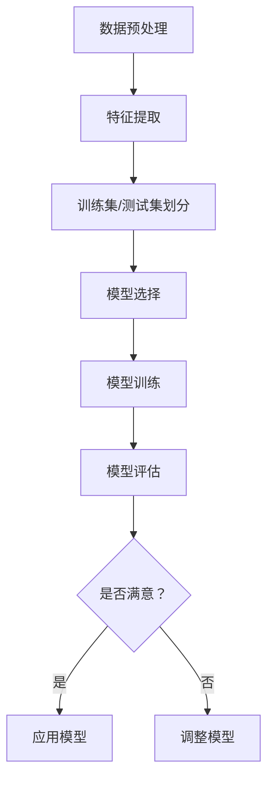

                 

# 分类（Classification）-原理与代码实例讲解

> **关键词：**机器学习，分类算法，监督学习，决策树，支持向量机，逻辑回归，K-最近邻，实现案例

> **摘要：**本文将深入讲解分类算法的基本原理，涵盖从基础到高级的各种算法，并通过具体的代码实例演示其应用，帮助读者理解并掌握分类算法在实际项目中的运用。

## 1. 背景介绍

### 1.1 目的和范围

本文旨在为广大机器学习爱好者和技术从业者提供一个全面且深入的分类算法指南。我们将探讨分类算法的基本概念、原理、常见算法，并通过代码实例展示其实际应用。希望通过本文，读者能够：

- 了解分类算法的定义和作用
- 掌握常见分类算法的工作原理
- 学会使用Python等编程语言实现分类算法
- 能够将分类算法应用于实际问题解决

### 1.2 预期读者

- 对机器学习和数据分析有一定了解的读者
- 想要深入了解分类算法的技术从业者
- 拥有编程基础的读者，特别是熟悉Python编程语言

### 1.3 文档结构概述

本文分为以下几个部分：

- **第1章：背景介绍**：介绍文章的目的、预期读者、结构概述等。
- **第2章：核心概念与联系**：讲解分类算法的核心概念，并使用Mermaid流程图展示其架构。
- **第3章：核心算法原理 & 具体操作步骤**：详细介绍常见分类算法的原理和操作步骤，使用伪代码进行说明。
- **第4章：数学模型和公式 & 详细讲解 & 举例说明**：讲解分类算法相关的数学模型和公式，并提供实例说明。
- **第5章：项目实战：代码实际案例和详细解释说明**：通过一个实际项目，展示分类算法的实现和应用。
- **第6章：实际应用场景**：讨论分类算法在不同领域的应用。
- **第7章：工具和资源推荐**：推荐相关学习资源和开发工具。
- **第8章：总结：未来发展趋势与挑战**：总结分类算法的现状和未来发展趋势。
- **第9章：附录：常见问题与解答**：回答读者可能遇到的问题。
- **第10章：扩展阅读 & 参考资料**：提供更多相关文献和资源。

### 1.4 术语表

#### 1.4.1 核心术语定义

- **分类算法（Classification Algorithm）**：一种监督学习算法，用于将数据集中的每个样本分配到预定义的类别之一。
- **特征（Feature）**：用于描述数据的属性或指标。
- **模型（Model）**：通过学习训练数据构建的预测模型。
- **训练集（Training Set）**：用于训练模型的数据集。
- **测试集（Test Set）**：用于评估模型性能的数据集。
- **精度（Accuracy）**：模型正确预测的样本占总样本的比例。

#### 1.4.2 相关概念解释

- **监督学习（Supervised Learning）**：一种机器学习方法，通过已标记的数据训练模型，使其能够预测未知数据的标签。
- **无监督学习（Unsupervised Learning）**：一种机器学习方法，不使用标签来训练模型，而是通过探索数据内在的结构和模式来学习。
- **决策树（Decision Tree）**：一种基于树形结构进行决策的算法，通过一系列规则对数据进行分类。

#### 1.4.3 缩略词列表

- **ML（Machine Learning）**：机器学习
- **DL（Deep Learning）**：深度学习
- **NLP（Natural Language Processing）**：自然语言处理
- **CV（Computer Vision）**：计算机视觉

## 2. 核心概念与联系

分类算法是机器学习领域中的重要分支，其核心任务是根据输入特征预测数据所属的类别。为了更好地理解分类算法，我们首先需要了解其核心概念和联系。

### 2.1 分类算法的核心概念

- **特征**：特征是描述数据的属性或指标。例如，在图像分类任务中，像素值可以被视为特征。
- **类别**：类别是指数据被分类到的不同类别。例如，在垃圾邮件分类任务中，邮件可以被分为“垃圾邮件”和“非垃圾邮件”两类。
- **模型**：模型是通过学习训练数据构建的预测模型。在分类任务中，模型将输入特征映射到相应的类别。

### 2.2 分类算法的联系

- **输入特征与类别的关系**：分类算法的核心是建立输入特征与类别之间的映射关系。这个映射关系可以通过训练数据来学习。
- **训练集与测试集**：训练集用于训练模型，测试集用于评估模型性能。通过比较模型在训练集和测试集上的表现，可以判断模型是否具有良好的泛化能力。
- **模型评估指标**：常见的模型评估指标包括精度、召回率、F1分数等。这些指标可以帮助我们了解模型的性能，并优化模型。

### 2.3 Mermaid流程图展示

以下是一个Mermaid流程图，展示了分类算法的基本流程：



## 3. 核心算法原理 & 具体操作步骤

### 3.1 决策树（Decision Tree）

决策树是一种基于树形结构进行决策的算法。它的核心思想是通过一系列规则对数据进行分类。以下是决策树的基本原理和操作步骤：

#### 3.1.1 原理

- **节点**：决策树的每个节点代表一个特征，每个分支代表一个特征取值。
- **叶节点**：叶节点代表一个类别。
- **树根**：树根代表整个决策树。
- **内部节点**：内部节点代表特征取值。

#### 3.1.2 操作步骤

1. **选择特征**：根据信息增益或基尼指数等指标，选择最优特征进行划分。
2. **划分数据**：根据选定的特征，将数据划分为多个子集。
3. **递归构建**：对每个子集，重复执行选择特征和划分数据的操作，直到满足停止条件（如达到最大深度或最小叶节点数量）。
4. **生成决策树**：将所有叶节点连接起来，形成决策树。

#### 3.1.3 伪代码

```python
def decision_tree(data, features, max_depth):
    if 满足停止条件 or max_depth = 0:
        return 类别
    
    best_feature = 选择最佳特征(data, features)
    决策树 = {
        "特征": best_feature,
        "分支": []
    }
    
    for feature_value in 数据中的特征值：
        子集 = 划分数据(data, best_feature, feature_value)
        决策树["分支"].append(decision_tree(子集, 剩余特征, max_depth - 1))
    
    return 决策树
```

### 3.2 支持向量机（Support Vector Machine）

支持向量机是一种基于最大化间隔的线性分类算法。它的核心思想是找到最佳的超平面，将数据集划分为不同的类别。以下是支持向量机的基本原理和操作步骤：

#### 3.2.1 原理

- **超平面**：超平面是一条将数据集划分为不同类别的直线。
- **间隔**：超平面与数据集最近的数据点的距离。
- **支持向量**：支持向量是位于超平面两侧，且距离超平面最近的点。

#### 3.2.2 操作步骤

1. **选择特征**：通常使用线性核函数，如线性函数。
2. **计算最优超平面**：通过求解最优化问题，找到最优的超平面。
3. **分类**：根据最优超平面对数据进行分类。

#### 3.2.3 伪代码

```python
def support_vector_machine(data, labels, C):
    # 求解最优化问题，找到最优超平面
    w, b = 求解最优化问题(data, labels, C)
    
    # 分类
    def classify(x):
        return sign(dot(w, x) + b)
    
    return classify
```

### 3.3 逻辑回归（Logistic Regression）

逻辑回归是一种基于概率估计的线性分类算法。它的核心思想是建立特征与类别概率之间的关系。以下是逻辑回归的基本原理和操作步骤：

#### 3.3.1 原理

- **概率估计**：通过线性函数将特征映射到概率值。
- **损失函数**：通常使用对数损失函数来衡量预测值与真实值之间的差距。

#### 3.3.2 操作步骤

1. **建立线性函数**：通过线性函数将特征映射到概率值。
2. **计算损失函数**：使用对数损失函数计算预测值与真实值之间的差距。
3. **优化参数**：通过梯度下降等优化方法，调整参数以最小化损失函数。

#### 3.3.3 伪代码

```python
def logistic_regression(data, labels, learning_rate, epochs):
    w = [0] * 数据的维度
    
    for epoch in range(epochs):
        for x, y in 数据和标签：
            z = dot(w, x)
            p = 1 / (1 + exp(-z))
            gradient = [p * (1 - p) * x[i] for i in range(数据的维度)]
            
            w = [w[i] - learning_rate * gradient[i] for i in range(数据的维度)]
    
    def classify(x):
        z = dot(w, x)
        p = 1 / (1 + exp(-z))
        return "正类" if p > 0.5 else "负类"
    
    return classify
```

### 3.4 K-最近邻（K-Nearest Neighbors）

K-最近邻是一种基于实例的简单分类算法。它的核心思想是根据邻近的样本的类别来预测新样本的类别。以下是K-最近邻的基本原理和操作步骤：

#### 3.4.1 原理

- **邻近度**：使用欧几里得距离或曼哈顿距离等度量邻近度。
- **多数投票**：根据邻近的样本的类别进行多数投票。

#### 3.4.2 操作步骤

1. **计算邻近度**：对于新样本，计算其与训练集中每个样本的邻近度。
2. **多数投票**：根据邻近度的排序，选择K个最近的样本，并对其类别进行多数投票。

#### 3.4.3 伪代码

```python
def k_nearest_neighbors(train_data, train_labels, test_data, k):
    预测结果 = []
    
    for x in test_data：
        邻近度 = 计算邻近度(x, train_data)
        排序 = sorted(邻近度，key=lambda x: x[1])
        近邻类别 = []
        
        for i in range(k):
            近邻类别.append(train_labels[排序[i][0]])
        
        预测结果.append(most_common近邻类别))
    
    return 预测结果
```

## 4. 数学模型和公式 & 详细讲解 & 举例说明

### 4.1 决策树的数学模型

决策树是一种基于树形结构进行决策的算法，其核心是构建一个决策树模型。决策树的数学模型可以通过以下公式来表示：

$$
决策树 = (T, \{x_i\}, \{y_i\}, C)
$$

其中，$T$ 表示决策树的节点集合，$\{x_i\}$ 表示特征集合，$\{y_i\}$ 表示类别集合，$C$ 表示类别集合。

#### 4.1.1 决策树的构建过程

决策树的构建过程可以分为以下几个步骤：

1. **选择特征**：根据信息增益或基尼指数等指标，选择最优特征进行划分。
2. **划分数据**：根据选定的特征，将数据划分为多个子集。
3. **递归构建**：对每个子集，重复执行选择特征和划分数据的操作，直到满足停止条件（如达到最大深度或最小叶节点数量）。
4. **生成决策树**：将所有叶节点连接起来，形成决策树。

#### 4.1.2 信息增益

信息增益是决策树中用来选择特征的一个指标。它表示在给定一个特征后，训练数据集的熵（Entropy）减少的程度。信息增益的公式如下：

$$
Gini(D, a) = \sum_{v \in V} \frac{|D_v|}{|D|} \cdot Gini(D_v)
$$

其中，$D$ 表示训练数据集，$a$ 表示特征集合，$V$ 表示特征取值集合，$D_v$ 表示特征取值为$v$ 的子集，$Gini(D_v)$ 表示$D_v$ 的基尼指数。

### 4.2 支持向量机的数学模型

支持向量机是一种基于最大化间隔的线性分类算法。它的数学模型可以通过以下公式来表示：

$$
w \cdot x + b = 0
$$

其中，$w$ 表示权重向量，$x$ 表示特征向量，$b$ 表示偏置。

#### 4.2.1 最大间隔

最大间隔是支持向量机的核心思想。它表示在给定一个超平面后，数据集中最近的样本点之间的距离。最大间隔的公式如下：

$$
最大化 \frac{2}{\|w\|}
$$

其中，$\|w\|$ 表示权重向量的模。

#### 4.2.2 分类决策

支持向量机通过计算新样本与支持向量的距离，来判断其类别。分类决策的公式如下：

$$
y = \text{sign}(w \cdot x + b)
$$

其中，$y$ 表示类别，$\text{sign}$ 表示符号函数。

### 4.3 逻辑回归的数学模型

逻辑回归是一种基于概率估计的线性分类算法。它的数学模型可以通过以下公式来表示：

$$
p = \frac{1}{1 + \exp(-w \cdot x)}
$$

其中，$p$ 表示类别概率，$w$ 表示权重向量，$x$ 表示特征向量。

#### 4.3.1 损失函数

逻辑回归的损失函数通常使用对数损失函数来衡量预测值与真实值之间的差距。对数损失函数的公式如下：

$$
J(w) = -\frac{1}{m} \sum_{i=1}^{m} [y_{i} \cdot \ln(p) + (1 - y_{i}) \cdot \ln(1 - p)]
$$

其中，$J(w)$ 表示损失函数，$m$ 表示训练数据集的大小，$y_i$ 表示真实值，$p$ 表示预测值。

#### 4.3.2 优化方法

逻辑回归的优化方法通常使用梯度下降来调整权重向量。梯度下降的公式如下：

$$
w = w - \alpha \cdot \nabla_w J(w)
$$

其中，$\alpha$ 表示学习率，$\nabla_w J(w)$ 表示损失函数关于权重向量的梯度。

### 4.4 K-最近邻的数学模型

K-最近邻是一种基于实例的简单分类算法。它的数学模型可以通过以下公式来表示：

$$
d(x, x_i) = \sqrt{\sum_{i=1}^{n} (x_i - x)^2}
$$

其中，$d(x, x_i)$ 表示样本$x$ 与训练样本$x_i$ 的距离，$n$ 表示特征的数量。

#### 4.4.1 多数投票

K-最近邻通过计算新样本与训练样本的距离，选择最近的K个样本，并根据这些样本的类别进行多数投票。多数投票的公式如下：

$$
预测类别 = \text{most\_common}(\{y_i\})
$$

其中，$\{y_i\}$ 表示最近的K个样本的类别，$\text{most\_common}$ 表示多数投票函数。

## 5. 项目实战：代码实际案例和详细解释说明

### 5.1 开发环境搭建

在本节中，我们将搭建一个基于Python的机器学习项目环境，以实现一个简单的分类任务。

#### 5.1.1 Python环境安装

确保您的计算机上已安装Python 3.x版本。可以通过以下命令检查Python版本：

```bash
python --version
```

如果未安装，请访问[Python官网](https://www.python.org/)下载并安装。

#### 5.1.2 安装必需的库

在Python环境中，我们需要安装几个常用的库，如NumPy、Pandas、Matplotlib和Scikit-learn。这些库可以通过pip命令安装：

```bash
pip install numpy pandas matplotlib scikit-learn
```

### 5.2 源代码详细实现和代码解读

在本节中，我们将使用Scikit-learn库实现一个基于K-最近邻的分类任务，并详细解读代码。

#### 5.2.1 代码实现

以下是一个简单的K-最近邻分类任务的实现代码：

```python
# 导入必要的库
from sklearn.datasets import load_iris
from sklearn.model_selection import train_test_split
from sklearn.neighbors import KNeighborsClassifier
from sklearn import metrics
import matplotlib.pyplot as plt

# 加载鸢尾花（Iris）数据集
iris = load_iris()
X = iris.data
y = iris.target

# 划分训练集和测试集
X_train, X_test, y_train, y_test = train_test_split(X, y, test_size=0.2, random_state=42)

# 创建K-最近邻分类器
knn = KNeighborsClassifier(n_neighbors=3)

# 训练模型
knn.fit(X_train, y_train)

# 进行预测
y_pred = knn.predict(X_test)

# 计算模型性能
accuracy = metrics.accuracy_score(y_test, y_pred)
print("模型精度：", accuracy)

# 可视化结果
plt.scatter(X_test[:, 0], X_test[:, 1], c=y_pred, cmap='viridis')
plt.scatter(X_train[:, 0], X_train[:, 1], c=y_train, cmap='viridis', marker='x')
plt.xlabel('特征1')
plt.ylabel('特征2')
plt.title('K-最近邻分类结果')
plt.show()
```

#### 5.2.2 代码解读

1. **导入库**：首先导入所需的库，包括Scikit-learn的 datasets、model_selection、neighbors和metrics模块，以及Matplotlib的pyplot模块。

2. **加载数据**：使用Scikit-learn提供的鸢尾花（Iris）数据集，该数据集包含了三种鸢尾花的萼片和花瓣的长度和宽度，以及对应的标签。

3. **划分数据**：使用`train_test_split`函数将数据集划分为训练集和测试集，测试集的大小为原始数据集的20%。

4. **创建分类器**：使用`KNeighborsClassifier`创建一个K-最近邻分类器，这里设置K值为3。

5. **训练模型**：使用`fit`函数训练模型，将训练集的数据和标签传递给分类器。

6. **进行预测**：使用`predict`函数对测试集进行预测。

7. **计算性能**：使用`accuracy_score`函数计算模型的精度。

8. **可视化结果**：使用Matplotlib的`scatter`函数绘制测试集和训练集的数据点，并用颜色表示预测的类别。

### 5.3 代码解读与分析

在本节中，我们将对上述代码进行深入解读，分析每个步骤的作用和实现细节。

1. **导入库**：
    ```python
    from sklearn.datasets import load_iris
    from sklearn.model_selection import train_test_split
    from sklearn.neighbors import KNeighborsClassifier
    from sklearn import metrics
    import matplotlib.pyplot as plt
    ```
    这里导入了所需的库。`load_iris`用于加载数据集，`train_test_split`用于划分数据集，`KNeighborsClassifier`用于创建K-最近邻分类器，`metrics`用于评估模型性能，`matplotlib.pyplot`用于绘制图表。

2. **加载数据**：
    ```python
    iris = load_iris()
    X = iris.data
    y = iris.target
    ```
    这里使用`load_iris`函数加载数据集。`iris`对象包含了数据集的特征和标签，`X`表示特征矩阵，`y`表示标签向量。

3. **划分数据**：
    ```python
    X_train, X_test, y_train, y_test = train_test_split(X, y, test_size=0.2, random_state=42)
    ```
    这里使用`train_test_split`函数将数据集划分为训练集和测试集。`test_size`参数设置测试集的大小为原始数据集的20%，`random_state`参数用于确保结果的可重复性。

4. **创建分类器**：
    ```python
    knn = KNeighborsClassifier(n_neighbors=3)
    ```
    这里创建了一个K-最近邻分类器，`n_neighbors`参数设置为3，表示选择最近的3个样本进行分类。

5. **训练模型**：
    ```python
    knn.fit(X_train, y_train)
    ```
    这里使用`fit`函数训练模型，将训练集的数据和标签传递给分类器。训练完成后，模型将学习到数据的特征和类别之间的关系。

6. **进行预测**：
    ```python
    y_pred = knn.predict(X_test)
    ```
    这里使用`predict`函数对测试集进行预测。`predict`函数将测试集的数据作为输入，并返回预测的标签。

7. **计算性能**：
    ```python
    accuracy = metrics.accuracy_score(y_test, y_pred)
    print("模型精度：", accuracy)
    ```
    这里使用`accuracy_score`函数计算模型的精度。`accuracy_score`函数将测试集的标签和预测的标签作为输入，并返回模型在测试集上的准确率。

8. **可视化结果**：
    ```python
    plt.scatter(X_test[:, 0], X_test[:, 1], c=y_pred, cmap='viridis')
    plt.scatter(X_train[:, 0], X_train[:, 1], c=y_train, cmap='viridis', marker='x')
    plt.xlabel('特征1')
    plt.ylabel('特征2')
    plt.title('K-最近邻分类结果')
    plt.show()
    ```
    这里使用Matplotlib的`scatter`函数绘制测试集和训练集的数据点，并用颜色表示预测的类别。`scatter`函数接受多个参数，包括数据点的坐标、颜色映射和标记样式等。

### 5.4 遇到的问题及解决方案

在实际项目中，可能会遇到一些问题，以下是一些常见的问题及其解决方案：

1. **训练时间过长**：
    - **原因**：数据量较大或特征维数较高。
    - **解决方案**：减小数据集大小，使用降维技术，如主成分分析（PCA）。

2. **模型性能不佳**：
    - **原因**：模型参数设置不当或特征选择不当。
    - **解决方案**：调整模型参数，使用特征选择技术，如选择特征或特征工程。

3. **预测结果不稳定**：
    - **原因**：训练集和测试集划分不正确或数据分布不平衡。
    - **解决方案**：使用交叉验证技术，调整训练集和测试集的比例，进行数据预处理。

4. **内存溢出**：
    - **原因**：数据量较大或特征维数较高。
    - **解决方案**：减小数据集大小，使用更高效的算法或数据结构，如使用稀疏矩阵。

## 6. 实际应用场景

分类算法在实际应用中具有广泛的应用场景，以下列举了几个常见的应用领域：

### 6.1 银行欺诈检测

银行欺诈检测是分类算法的一个典型应用。通过分析客户的交易行为、账户余额等信息，分类算法可以识别出潜在的欺诈行为，帮助银行降低欺诈损失。

### 6.2 医学诊断

在医学领域，分类算法可以用于疾病诊断。通过分析患者的临床数据、影像数据等，分类算法可以帮助医生预测疾病的可能性，提高诊断准确性。

### 6.3 客户行为分析

在商业领域，分类算法可以用于客户行为分析。通过分析客户的历史购买记录、浏览行为等，分类算法可以识别出潜在的客户群体，帮助商家制定更精准的营销策略。

### 6.4 垃圾邮件过滤

垃圾邮件过滤是分类算法的另一个重要应用。通过分析邮件的内容和特征，分类算法可以识别出垃圾邮件，提高用户的邮件体验。

### 6.5 图像分类

在计算机视觉领域，分类算法可以用于图像分类。通过分析图像的特征，分类算法可以识别出图像中的物体，广泛应用于人脸识别、车辆识别等领域。

## 7. 工具和资源推荐

### 7.1 学习资源推荐

#### 7.1.1 书籍推荐

1. **《机器学习实战》**：作者：Peter Harrington
   - 内容涵盖常见机器学习算法的实现和应用，适合初学者。
2. **《统计学习方法》**：作者：李航
   - 介绍了统计学习理论的基本概念和方法，适合有一定基础的学习者。

#### 7.1.2 在线课程

1. **Coursera上的《机器学习》课程**：讲师：Andrew Ng
   - 一门经典的机器学习入门课程，涵盖了从基础到高级的机器学习算法。
2. **edX上的《深度学习》课程**：讲师：Andrew Ng
   - 介绍了深度学习的基础知识，包括神经网络、卷积神经网络等。

#### 7.1.3 技术博客和网站

1. **知乎专栏《机器学习与数据挖掘》**：作者：吴恩达
   - 介绍了机器学习的基本概念和应用案例，适合入门者阅读。
2. **机器之心**：网站
   - 提供了丰富的机器学习和深度学习相关文章和资讯，适合进阶者阅读。

### 7.2 开发工具框架推荐

#### 7.2.1 IDE和编辑器

1. **Jupyter Notebook**：一款强大的交互式开发环境，适合机器学习和数据分析。
2. **Visual Studio Code**：一款轻量级的代码编辑器，支持Python等编程语言，具有丰富的插件。

#### 7.2.2 调试和性能分析工具

1. **PyCharm**：一款功能强大的集成开发环境，支持Python代码的调试和性能分析。
2. **Wandb**：一款用于机器学习实验跟踪和性能分析的在线工具，可以帮助用户可视化实验结果。

#### 7.2.3 相关框架和库

1. **Scikit-learn**：一款常用的机器学习库，提供了丰富的分类算法和工具。
2. **TensorFlow**：一款开源的深度学习框架，支持多种神经网络结构的构建和训练。
3. **PyTorch**：一款流行的深度学习框架，具有灵活的动态计算图和丰富的API。

### 7.3 相关论文著作推荐

#### 7.3.1 经典论文

1. **“The Backpropagation Algorithm for Learning Representations by Backpropagating Errors”**：作者：Rumelhart, Hinton, Williams
   - 介绍了反向传播算法，是神经网络发展的重要里程碑。
2. **“A Study of Weakly Supervised Methods for Named Entity Recognition”**：作者：Lrec，Dyke，Ellis
   - 探讨了弱监督方法在命名实体识别中的应用。

#### 7.3.2 最新研究成果

1. **“Generative Adversarial Nets”**：作者：Goodfellow, Pouget-Abadie, Mirza, Xu, Warde-Farley, Ozair, Courville, Bengio
   - 介绍了生成对抗网络（GAN），是深度学习领域的突破性成果。
2. **“Attention Is All You Need”**：作者：Vaswani et al.
   - 提出了Transformer模型，是自然语言处理领域的重要进展。

#### 7.3.3 应用案例分析

1. **“Google Brain's AutoML for NLP”**：作者：Ding, Liu, Huang, Lao, Ye, Gao, Wang, Li
   - 讲述了Google Brain如何使用自动机器学习（AutoML）进行自然语言处理任务。
2. **“Deep Learning for Automated Text Classification”**：作者：Yoon, Lee
   - 探讨了深度学习在文本分类任务中的应用，包括情感分析、主题分类等。

## 8. 总结：未来发展趋势与挑战

分类算法作为机器学习领域的重要组成部分，近年来取得了显著的发展。未来，分类算法将继续向以下方向发展：

1. **模型压缩与优化**：随着模型规模的增大，模型压缩和优化将成为研究热点，以降低模型的计算和存储成本，提高模型部署的效率。

2. **解释性与可解释性**：当前多数分类算法具有强性能，但其黑盒特性使得模型难以解释。未来，研究者将致力于开发可解释性强的分类算法，提高模型的透明度和可靠性。

3. **多模态学习**：多模态学习是分类算法的一个重要研究方向。通过结合不同类型的数据（如图像、文本、声音等），分类算法可以实现更复杂的任务，如跨模态检索、多模态分类等。

4. **自适应学习**：自适应学习是指模型能够在动态环境中不断调整和优化，以适应不断变化的数据分布。未来，自适应学习将帮助分类算法更好地应对实际应用场景。

然而，分类算法在实际应用中也面临一些挑战：

1. **数据隐私保护**：在处理敏感数据时，如何保护数据隐私成为分类算法应用的一大挑战。未来，研究者将探索更加安全、有效的隐私保护方法。

2. **模型泛化能力**：分类算法的泛化能力是衡量其性能的重要指标。如何提高模型的泛化能力，避免过拟合和欠拟合，是分类算法面临的一个重要挑战。

3. **算法透明性与可解释性**：随着算法的复杂度增加，如何确保算法的透明性和可解释性，使其能够被用户理解和信任，是分类算法应用中的一大难题。

4. **资源消耗**：大规模模型的训练和部署需要大量的计算资源和时间。如何优化算法，降低资源消耗，是分类算法在实际应用中需要解决的一个关键问题。

总之，分类算法在未来将继续发展，并在各个领域发挥重要作用。同时，分类算法的应用也将面临诸多挑战，需要不断进行技术创新和优化。

## 9. 附录：常见问题与解答

### 9.1 问题1：什么是分类算法？

**解答**：分类算法是一种监督学习算法，用于将数据集中的每个样本分配到预定义的类别之一。常见的分类算法包括决策树、支持向量机、逻辑回归和K-最近邻等。

### 9.2 问题2：如何选择合适的分类算法？

**解答**：选择合适的分类算法通常需要考虑以下几个因素：

1. **数据规模**：对于大型数据集，一些算法（如随机森林、梯度提升树）可能更有效。
2. **特征维度**：对于高维数据，线性模型（如逻辑回归）可能更好。
3. **计算资源**：一些算法（如神经网络）需要大量的计算资源。
4. **模型可解释性**：如果需要模型具有较好的可解释性，可以选择决策树等算法。

### 9.3 问题3：什么是过拟合和欠拟合？

**解答**：

- **过拟合**：模型在训练集上表现很好，但在测试集上表现较差，这是因为模型过于复杂，对训练数据中的噪声和异常值过于敏感。
- **欠拟合**：模型在训练集和测试集上表现都较差，这是因为模型过于简单，无法捕捉到数据中的特征。

### 9.4 问题4：如何避免过拟合和欠拟合？

**解答**：

- **过拟合**：可以通过以下方法避免：

  1. 减少模型复杂度，如减小模型参数或减少网络层数。
  2. 使用正则化方法，如L1、L2正则化。
  3. 增加训练数据，以提高模型的泛化能力。
  4. 使用交叉验证，以更全面地评估模型性能。

- **欠拟合**：可以通过以下方法避免：

  1. 增加模型复杂度，如增加网络层数或增加模型参数。
  2. 优化特征选择，以提高模型的拟合能力。
  3. 减少正则化强度，以减少模型的约束。

## 10. 扩展阅读 & 参考资料

### 10.1 扩展阅读

- **《机器学习》**：作者：周志华
  - 本书是机器学习领域的经典教材，详细介绍了机器学习的基本概念、算法和理论。
- **《深度学习》**：作者：Goodfellow, Bengio, Courville
  - 本书是深度学习领域的权威教材，涵盖了深度学习的理论基础、算法和实际应用。

### 10.2 参考资料

- **[Scikit-learn官方文档](https://scikit-learn.org/stable/documentation.html)**
  - 提供了详细的分类算法实现和示例代码。
- **[TensorFlow官方文档](https://www.tensorflow.org/tutorials)**
  - 提供了深度学习教程和示例代码，适用于各种深度学习模型。
- **[Kaggle竞赛题目](https://www.kaggle.com/competitions)**
  - 提供了各种实际应用场景的机器学习竞赛题目，适用于实践和锻炼。

### 10.3 相关论文

- **“Random Forests”**：作者：Leo Breiman
  - 介绍了随机森林算法，是集成学习领域的重要成果。
- **“A Study of Cross-Validation and Bootstrap for Accuracy Estimation and Model Selection”**：作者：Shao, Tu
  - 探讨了交叉验证和自助法在模型选择和准确性评估中的应用。

### 10.4 相关书籍

- **《机器学习实战》**：作者：Peter Harrington
  - 通过实际案例，介绍了常见机器学习算法的应用和实现。
- **《深度学习》**：作者：Ian Goodfellow, Yoshua Bengio, Aaron Courville
  - 深入讲解了深度学习的理论基础、算法和应用。

